```{r}
knitr::opts_chunk$set(cache = F)
knitr::opts_knit$set(root.dir = rprojroot::find_rstudio_root_file())
```

```{r, include=FALSE}
knitr::knit_hooks$set(class = function(before, options, envir) {
  if(before){
    sprintf("<div class = '%s'>", options$class)
  }else{
    "</div>"
  }
})
```

```{r panel-setup, include = FALSE}
library(downlit)
xaringanExtra::use_panelset()
xaringanExtra::style_panelset(font_family = "inherit")
```


# Welcome {-}

<br>

```{r banner, echo=FALSE, out.width='100%', class = "text-image"}
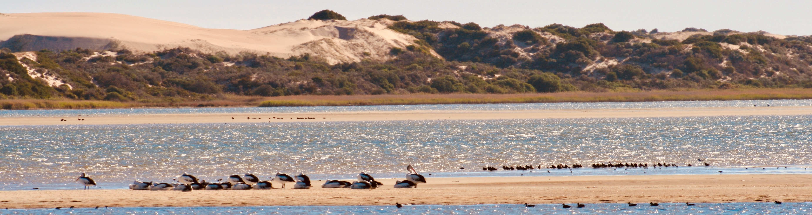

```

<br>

Welcome to the <span style="color:darkgreen">**Coorong Dynamics Model** </span> ($\mathbf{CDM}$) interactive e-book!

<br>


## Project background {-}

The Coorong is a unique coastal ecosystem renowned for its important cultural, economic, and environmental values, and it is recognised globally as wetland of international significance through the [Ramsar convention](https://rsis.ramsar.org/ris/321). However, the state of the Coorong has degraded significantly over the past decade, primarily due to a reduction in freshwater flows from the Murray River, and also due to the accumulation of nutrients, which have led to deleterious changes in water quality.

To avoid further degradation and map out a way restore the ecosystem, the [Healthy Coorong Healthy Basin](https://www.environment.sa.gov.au/topics/coorong/healthy-coorong-healthy-basin) (HCHB) program was established by the Commonwealth and South Australian Governments in 2019. The HCHB Program supports a number of [scientific trials and investigations](http://www.goyderinstitute.org/research/healthy-coorong-healthy-basin/), and on-ground works to help restore the balance to the Coorong and identify long term solutions.

As part of the HCHB program, the *Coorong Dynamics Model* ($\mathbf{CDM}$) has been developed as a tool quantify nutrient cycling and habitat changes within the Coorong ecosystem in response to different environmental conditions, and to assist by assessing Coorong management scenarios, and other questions relevant to decision-making. A previous version of the CDM has been developed and applied for assessing the environmental benefits of [Commonwealth Environmental Water](https://flow-mer.org.au/selected-area-lower-murray/) on the ecological habitat, and most recently as part of the [Coorong Infrastructure Investigations Project](https://www.environment.sa.gov.au/topics/coorong/healthy-coorong-healthy-basin/coorong-infrastructure-investigations-project) (CIIP) to assess the proposed changes  on water quality and habitat. Within the HCHB program, the key areas of CDM development has been to update core data inputs from the latest HCHB science investigations, which include nutrient cycling studies and ecological habitats surveys. The modelling presented herein seeks to integrate these data with state-of-the-art modelling tools to help improve the functional capability of the CDM to simulate Coorong environmental conditions.

This e-book documents the development of the CDM, including the integration with the latest scientific experimental and monitoring data. Improvements in the model functional capability, detailed validation tests, and assessment of the scenarios are reported here. 


## Document layout and guidance {-}

This documentation is structured to allow a systematic description of the model rationale, model description and testing, and the finally results from the model in the context of assessing management options. The document starts with an introduction to the site and general model approach, including an overview opf previous modelling work in the Coorong and the research challenges and knowledge gaps that motivated the present work. The second chapter “*The Coorong Dynamics Model*” provides a high-level overview of the CDM platform and configuration, and Chapter 3 outlines the approach to data-model integration. Chapters 4 - 8  describe the model customisations and technical tests by assessing model areas with data from HCHB science projects. This is followed by an *Integrated assessment of CDM*, using a compilation of all available Coorong data. The section also provides an overview of how the model results can be used by other scientists and managers for supporting decision-making.


## Contributing {-}

### Coordinating authors {.unnumbered}

The CDM manual has been developed by the following project team:

-	Matthew Hipsey ǂ
-	Peisheng Huang ǂ
-	Brendan Busch ǂ
-	Daniel Paraska ǂ
-	Sherry Zhai ǂ
- Claire Sims \*

<sub><sup>ǂ Aquatic Ecodynamics, UWA School of Agriculture & Environment, The University of Western Australia, Crawley WA 6009, Australia.</sup></sub><br>
<sub><sup>* Water Science and Monitoring Branch, Water and River Murray Division, Department for Environment and Water, Adelaide, SA 5000, Australia.</sup></sub><br>

### Adding and updating content {.unnumbered}

The intent of the CDM Manual is that the model - *and its documentation* - can continually be updated; thus the correction, improvement and addition of material is encouraged. This online book is therefore open-source and interested stakeholders can comment, raise issues, and further develop content.

The CDM documentation is available via GitHub and prepared in "R Mark Down" language. This is an implementation of mark down that can integrate with the R environment for enabling interactive content.

To access and edit the CDM manual you can [download the CDM repository](https://github.com/AquaticEcoDynamics/cdm-science) and work with the `CDM-manual` R project file in RStudio.


### Using RStudio's visual editor {.unnumbered}

If you're unfamiliar with writing `.Rmd` and `.md` files, the [RStudio IDE 1.4](https://blog.rstudio.com/2020/09/30/rstudio-v1-4-preview-visual-markdown-editing/) release implements a visual markdown editor that minimises the need to learn most syntax. To use this feature, open a `.Rmd` or `.md` file and click the visual editor button in the top right-hand corner of the editor window. You will now see a live-rendered version of your document and the addition of numerous buttons/menus that provide a GUI for formatting. Standard word processing functionality, such as buttons to **bold**, *italicise*, and [underline]{.ul} text are available, as well as shortcuts to features that can be more finicky in the basic source editor (e.g. citations, links, and simple tables). Returning to the source editor will reveal the formatting changes made are directly translated to the syntax of the raw file.

<center>
<video width="100%" height="70%" controls>
<source src="images/contributing/video1.mp4" type="video/mp4">
</video>
</center>

<br>

## Acknowledgements {-}

This project is part of the South Australian Government’s Healthy Coorong, *Healthy Basin Program*, which is jointly funded by the Australian and South Australian governments. Model development has been undertaken by the University of Western Australia *AED research group*. The developers of the model and authors of this e-book gratefully acknowledge the contribution by Matthew Gibbs, Michelle Waycott and the Trials and Investigations Integration Team within the Department for Environment and Water for assisting with the setup and support of the CDM project and this CDM online resource. We are also grateful to BMT Commercial Australia for use of the model TUFLOW-FV and Dr. Ian Teakle from BMT for support and collaboration using the TUFLOW-FV hydrodynamic model. Casper Boon provided model development support for the AED platform, and Giles Knight made this online book possible by creation of the R bookdown repository.

<!--

The model development has been funded by the South Australian Government *Department of Environment and Water* and undertaken by the University of Western Australia *AED research group*. The developers of the model and authors of this e-book gratefully acknowledge the contribution by Matthew Gibbs, Michelle Waycott and the Integration Team within DEW for assisting with the setup and support of the CDM project and this CDM online resource. We are also grateful to BMT Commercial Australia for use of the model TUFLOW-FV and Dr. Ian Teakle from BMT for support and collaboration using the TUFLOW-FV hydrodynamic model. Casper Boon provided model development support for the AED platform, and Giles Knight made this online book possible by creation of the R bookdown repository.

-->

## Citing this document  {-}

Please cite this online book in reports and scientific publications as: 

*Hipsey, M.R., Huang, P., Zhai, S., Busch, B.. Paraska, D., Sims, C., 2022. The Coorong Dynamics Model (CDM): Model description and performance assessment. Zenodo: DOI: 10.5281/zenodo.7778773.*  

<br>

<center>

```{r logos, echo=FALSE, out.width='25%', class = "text-image"}
knitr::include_graphics(c("images/contributing/aed-transparent-background.png","images/contributing/white.png","images/contributing/UWA-Full-Hor-CMYK.png"))

```

</center>

<br>


<!--chapter:end:index.Rmd-->

# Introduction

## Background and significance of the Coorong

### Importance of the Coorong

The Coorong has been recognised as a unique ecosystem that is essential to the overall health of the Murray--Darling Basin, and is recognised globally by its Ramsar-listing. The key functions of the Coorong include supporting a wide range of wild life as well as the local culture and economy. In recognition of the importance of the Ramsar-listed Coorong as well as the declining condition of the Coorong South Lagoon, the Commonwealth and South Australian Governments jointly funded the HCHB program to support the long-term health of the Coorong.

### Ecological Character of the Coorong

The Coorong is a shallow and narrow saline to hypersaline lagoon, which runs north-west to south-east, parallel to the South Australian coast for \~110 km and separated from the sea by a sand barrier (Figure \@ref(fig:intro-pic1)). It has a constricted channel connection to the sea towards its north-western end, referred to as the Murray Mouth. The Mouth allows exchange with sea water into the main body of the Coorong. River Murray water also enters into Lake Alexandrina and is regulated to flow, under suitable conditions, out to the Murray Mouth-Coorong region via five barrage structures (Tauwitchere, Mundoo, Ewe Island, Boundary Creek and Goolwa).

The Coorong naturally splits about halfway into the North and South Lagoons at a narrow constriction (Hell's Gate and Parnka Channel) with width down to approximately 100 m. The average widths of the North and South Lagoons are 1.5 km and 2.5 km respectively, and the average depths are 1.2 m and 1.4 m respectively [@gibbs2018] . The South Lagoon receives inputs of fresh to brackish water from a network of drains from the South-East region of South Australia, discharging at Salt Creek. This discharge can be regulated via structures in Morella Basin (immediately upstream from Salt Creek), and further up the drainage network. Groundwater discharge zones exist along the length of the Coorong, from both perched freshwater lenses and the regional unconfined aquifer, but hydraulic gradients are relatively low [@barnett2018].

The Coorong system is an important habitat for waterbirds, supporting more than 1% of the global populations of nine waterbird taxa [@paton2009]. The region is recognised as a Wetland of International Importance under the Ramsar Convention. Furthermore, the Lower Lakes and Coorong are an important refuge for waterbirds, hosting up to 90% of waterbirds counted at icon sites in the Murray-Darling Basin during drought [@kingsford2008]. However, like other Australian estuaries and coastal wetlands [@kingsford2000], the Coorong is increasingly threatened and its ecological health has been eroded by river regulation and over extraction of water. Waterbird populations have declined by at least 30% since 1985 [@paton2009] and low flows have led to decreased fish abundance [@brookes2015]. Freshwater flows to the Murray Mouth and Coorong help maintain an open Murray Mouth, maintain connectivity for diadromous fish and modify water level and salinity in the Coorong, which shapes the habitat for biota. Freshwater flows are important in maintaining estuarine habitat and ecosystem health and preventing extreme hyper-salinity [@brookes2009], which are influenced by flows through the barrages. Salinity has been identified as a key driver of fish distribution and assemblage structure by influencing the extent of estuarine fish habitat in the Coorong [@ye2011; @ye2016; @bice2018; @brookes2021]. Early summer flows are likely to be particularly beneficial as they delay the drop in water level in the South Lagoon and can prevent extreme salinities emerging, thereby improving habitat conditions for key fish species.

```{r intro-pic1, echo = FALSE, out.width='80%', class = "text-image",fig.align='center', fig.cap = "The Lower Lakes and Coorong. The freshwater in the lakes is isolated from the marine water by five barrages. Exchange with the ocean occurs through the Murray Mouth, which is located near Goolwa. The Coorong is comprised of the North and South lagoons. Source: ..."}

knitr::include_graphics("images/intro/1_picture1.png")

```

### Management challenges

The major management challenge of the Coorong is the long-term decline in its ecological condition due to reductions in inflows and restricted exchange with ocean. Whilst there has been recovery of some elements of the Coorong ecosystem associated with increased inflows since the Millennium Drought, the South Lagoon has not recovered to the levels expected. There has been a switch of the ecosystem from being dominated by aquatic plants to algae associated with eutrophication (nutrient enrichment), with subsequent impacts on invertebrates, fish and waterbirds. These changes in the ecosystem and the lack of recovery is likely caused by a number of complex, interacting factors, which are not well understood. This is limiting the capacity to forecast the ecological response to future management scenarios and therefore the capacity of water managers to identify management interventions required to improve the health of the Coorong.

## Need for an integrated model to support Coorong management

The use of water quality models in the management of coastal water has been well recognised. In the past years, the development of mathematical modelling has been rapid [@stolarska2012] and many models have been utilized to date for coastal management. The development and application of water quality models can support decision making by identifying nutrient reduction targets [@kim2014; @waltham2014], controls on harmful algal blooms [@chung2014; @robson2004], public health risks [@hipsey2008], and the quality of aquatic habitat [@brown2013].

For the Coorong, the ongoing challenges of managing the degrading water quality and habitats in a drying climate, alongside other management objectives, have led to the following priority areas where model tools are needed to support management:

-   Whole estuary water balance and nutrient budgets
-   Nutrient paths and dynamics
-   Re-construction of historical changes in habitat changes
-   Assessment of scenarios related to management options and climate change

### Prior modelling

Various modelling tools have previously been developed to assist in management of the Coorong, such as the 1D Coorong Hydrodynamic Model (CHM). Additionally, an early version of the CDM was developed over the period 2018-2019. The model TUFLOW-FV was used to simulate the hydrodynamics, and this was coupled with the ecological model AED2 for simulation of nutrients, algae and habitat. TUFLOW-FV hydrodynamics has been validated for the system separately by @bmt2017 and @collier2017 . The model simulations run by @collier2017 also simulated turbidity (including particle resuspension and sediment redistribution), inorganic and organic nutrients, chlorophyll a (chl-a), and filamentous algae (Ulva); the validation of these components occurred by comparing model outputs against observed data for the period from 2014-2016 at multiple locations within the domain. These years were chosen based on recent data availability for validation [@mosley2017; @frahn2015], and also spanned a range of conditions including water levels that experienced a sharp decline resulting in poor Ruppia habitat, which a weir could be expected to improve. Most recently, the CDM was applied in the Coorong Infrastructure Investigations Project (CIIP) for modelling investigations of hydrodynamics, biogeochemistry, and habitat changes to a range of infrastructure options.

A list of the prior modelling work in the Coorong:

-   BMT WBM, 2017. Coorong Options Assessment. Brisbane: BMT WBM Pty Ltd
-   Collier, C., van Dijk, K., Erftemeijer, P., Foster, N., Hipsey, M., O'Laughlin, E., Ticli, K. and Waycott, M., 2017. Optimising Coorong Ruppia habitat: Analysis of management strategies to improve habitat conditions for *Ruppia tuberosa* in the Coorong (South Australia) based on literature review, manipulative experiments and predictive modelling.
-   Mosley, L.M., Hamilton, B. Busch, B. Hipsey, M. and and Taylor, B., 2017. Assessment and modelling of the effects of the 2013-2016 Morella Basin releases on Coorong water quality. Report to the Department of Environment, Water and Natural Resources (DEWNR). University of Adelaide, South Australia.
-   Hipsey, M.R., Busch, B.D., Aldridge, K.T., 2017. Coorong Investigations Project: Ruppia habitat changes in response to augmented South East Flows scenarios and a regulating structure. AED Report \#R39, The University of Western Australia, Perth, Australia. 72pp.
-   Teakle, I., et al. 2021. Coorong Infrastructure Investigations Project: Hydrodynamic, Biogeochemical and Habitat Modelling Study. Brisbane: BMT WBM Pty Ltd.

### Knowledge gaps and development needs

Previous studies on the Coorong have laid the foundations for the development of CDM, built on model software tools able to simulate hydrodynamics, water quality and ecological habitat conditions. Whilst these previous modelling efforts have assisted decision-making, the patchy data and restricted scope of previous modelling has left uncertainty as to their suitability in capturing nutrient and sediment budgets, and in particular, the responses of algae and *Ruppia tuberosa*.

Key knowledge gaps identified from the prior modelling work include:

-   nutrient loads from sediment vs recycling, and links to Ulva accumulation;
-   the role of wave-induced resuspension on turbidity and nutrient cycling;
-   spatial extent of both Ulva and Ruppia to provide a higher level of confidence to validate model predictions;
-   eco-physiological response of different Ruppia life stages to environmental conditions. In particular, a range of studies on adult plant growth have been undertaken but the present results indicated that the seed and flowering phases, where less information is available, are the most sensitive life stages.

With the development of the HCHB research program, many of these key knowledge and data gaps have been (or are being) addressed and able to inform improved model approaches. The findings and research outputs range across a range of scales and disciplines and there is therefore a complex integration process to ensure the new knowledge is matched by the model capability and accuracy.

## Modelling development rationale

### Known gaps and model limitations

A significant component of the work tasks are allocated to customise and develop key modules of the AED platform to incorporate the specific science requirements of the model so it is compatible with the findings and details reported in the T&I research projects. These are identified in the specification as:

-   Need to improve and validate hydrodynamic-biogeochemical-habitat models, including updating the Ruppia Habitat Suitability Model, to provide increased certainty in the forecasted responses to various management interventions, this includes improving and updating model representation of the following:

    -   external and internal nutrient loads based on outputs from 'Understanding Coorong nutrient dynamics' (T&I activity 1.2)
    -   sediment loads, nutrient fluxes and cycling based on environmental data collected and outputs from 'Understanding Coorong nutrient dynamics' (T&I activity 1.3)
    -   Ruppia habitat suitability model and filamentous algae preference model (within AED) based on environmental data collected and outputs from 'Investigating the drivers and controls of filamentous algae and restoration of aquatic plants' in the Coorong (T&I activities 2.4 and 2.5)

-   Extended habitat models to incorporate the quantitative models developed through the food web and waterbird components, including:

    -   Linking the quantitative food web models developed as part of 'Restoring a functioning Coorong food web' (T&I activity 3.4) to the existing TUFLOW FV -- AED model framework to enable additional outcomes to be evaluated
    -   Linking the habitat suitability models for priority waterbird species developed as part of 'Maintaining viable waterbird populations' (T&I activities 4.1 and 4.3) to the existing TUFLOW FV -- AED2 model framework to enable additional outcomes to be evaluated

### Development focus and integration with HCHB research and monitoring

The staged development and assessment approach to the above model components and how they are linked with related T&I components are summarised in Figure \@ref(fig:dev-pic0) (the data-model integration strategy diagram) and outlined in the below sections.

```{r dev-pic0, echo = FALSE, out.width='100%', class = "text-image", fig.cap = "Data and model integration strategy, showing links between the HCHB Goyder T&I research program and the model development priorities."}

knitr::include_graphics("images/dev/Project integration diagram.png")

```

## Scope of this document

The existing platforms will be further developed to expand both the hydrodynamic and biogeochemical capabilities in accordance with the specification. The scope of the project tasks are summarised as per the requirement:

-   Coupling of the TUFLOW-FV hydrodynamic model with AED biogeochemical and habitat models, as required to support HCHB science and management goals.

-   Development of improved model representation of:

    -   external and internal nutrient loads
    -   sediment loads, nutrient fluxes and recycling
    -   Ruppia habitat suitability

-   Linking the ecological model approaches to the above model framework, including:

    -   waterbird habitat suitability
    -   supporting food web modelling (incl. fish)

-   Testing, validation and scenarios using the improved and integrated models and framework.

<br>

------------------------------------------------------------------------

<!--chapter:end:cdm_introduction.Rmd-->

# CDM: The Coorong Dynamics Model

<br>

## Overview

The Coorong Dynamics Model (CDM) is a spatially resolved model to simulate the environmental conditions within the Coorong, a large coastal lagoon located in South Australia. It is not a single model, but a system of models that can be configured, applied and coupled in various ways for different purposes.

At its core, it consists of the hydrodynamic model TUFLOW-FV and the water quality model AED, which can be optionally linked with the SWAN wave model. Different model domain resolutions can be selected and/or time-periods of interest simulated. Different levels of model complexity (i.e., biogeochemical or ecological components) can be engaged within an environment with common input files and output analysis workflows. The flexibility allows a common approach to be used in different use-cases; for example, a long-term low-resolution simulation vs a high-resolution habitat restoration simulation can share common model settings, parameters and parameterisations. This provides decision-makers a single trusted tool that can be used to answer a diversity of questions that span from day-to-day management (e.g., barrage operation) to long-term policy settings (e.g, restoration and climate change adaptation strategies).

In general, the models are configured to resolve hydrodynamics and flushing, water temperature and salinity, and numerous water quality attributes including oxygen, nutrients (organic and inorganic), phytoplankton, macroalgae, and suspended sediment. The outputs from these modules are used to predict ecological attributes of interest, including seagrass, fish and benthic macro-invertebrates.

The CDM is also more than the individual models. The model links a large volume of data from historical surveys, real-time data streams and recent experimental work. Complex integration workflows are implemented to process data for model inputs (e.g., boundary conditions) or model assessment (e.g., calibration or validation).

The CDM project is therefore a model-data 'ecosystem' that serves as a shared analytics platform to provide a holistic view of the many complex aspects of the system. Model and data provenance is a high priority and all data and model products that are developed are under strict version control within the platform to ensure traceability and transparency in model use and assumptions (see Section 3).

The following sections describe the model platform, detail the CDM configuration, summarise the different model generations being developed and used for decision support, and provide a persistent resource summarising model performance.

<br>

## Model platform

### Hydrodynamics: TUFLOW-FV

[TUFLOW-FV](https://www.tuflow.com/products/tuflow-fv/) is a finite volume hydrodynamic model, developed by BMT Global Pty Ltd [@bmt2019]. It has flexible-mesh and accounts for variations in water level, salinity, temperature, and density in response to tides, inflows and surface thermodynamics. The current version has various use-ability features including integration with QGIS and optimisiation for operation on desktop GPU resources.

The TUFLOW-FV has been used extensively in the region for hydrological assessments. Within the CDM two(three) different model domains are applied with different levels of spatial resolution, including both 2D and 3D implementations.

### Waves: SWAN

The Simulating WAves Nearshore ([SWAN](https://www.tudelft.nl/en/ceg/about-faculty/departments/hydraulic-engineering/sections/environmental-fluid-mechanics/research/swan/)) model is a numerical wave model used to obtain realistic estimates of surface wave parameters in coastal areas, lakes, and estuaries from given wind, bottom, and current conditions. The model is based on the wave action balance equation (or energy balance in the absence of currents) with sources and sinks. SWAN is a third-generation wave model with first-, second-, and third-generation options.

### Water quality and habitat: AED

The Aquatic EcoDynamics ([AED](http://aed.see.uwa.edu.au/research/models/aed/)) water quality model is a community-driven library of modules and algorithms for simulation of "aquatic ecodynamics" - water quality, aquatic biogeochemistry, biotic habitat and aquatic ecosystem dynamics, developed by the AED research group of UWA [@hipsey2019]. Each module aims to be based on state-of-the-art science sourced from a wide variety of scientific literature, making the library one of the most advanced available to aquatic ecosystem modellers.

<br>

## CDM setup and configuration

The following sections describe the general setup and approach of the model and provide an overview. Speciic simulations decsribed in subsequent sections may use tailored or customised versions adapted from this description.

### Simulation domains

The CDM modelling domain spans from the Murray Mouth region to the south end of the Coorong, with a length of \~116 km and a total area of \~237 km^2^.

Two types of model mesh were developed to support different research purposes. The first is a fine-resolution mesh (26250 cells with mean cell size of \~1×10^4^ m^2^, Figure 2.1, left); this mesh was used for resolving the spatial heterogeneity of the water quality response, especially for the habitat predictions; the second is a relatively coarse resolution mesh (2202 cells with mean cell size of \~1.3×10^5^ m^2^, Figure 2.1, right) for faster simulations of investigating water balance and other modelling experiments. The fine- and coarse-mesh models share the same boundary conditions and have been bench-marked with each other, and can be used in different stages of model development.

```{r cdm-pic1, echo = FALSE, out.width='100%', class = "text-image",fig.align='center', fig.cap = "Plan view of the Coorong Dynamics Model fine (left) and coarse (right) mesh."}

knitr::include_graphics("images/cdm/2_picture1.png")

```

```{r CDM-grid, echo=FALSE, message=FALSE, warning=FALSE}
library(knitr)
library(kableExtra)
library(readxl)
library(rmarkdown)
theSheet <- read_excel('tables/grids.xlsx', sheet = 1)
theSheet <- theSheet[theSheet$Table == "Data",]
theSheetGroups <- unique(theSheet$Group)


kbl(theSheet[,3:8], caption = "Grid Specifications", align = "l",) %>%
  pack_rows(theSheetGroups[1],
            min(which(theSheet$Group == theSheetGroups[1])),
            max(which(theSheet$Group == theSheetGroups[1])),
            background = '#ebebeb') %>%
  pack_rows(theSheetGroups[2],
            min(which(theSheet$Group == theSheetGroups[2])),
            max(which(theSheet$Group == theSheetGroups[2])),
            background = '#ebebeb') %>%
row_spec(0, background = "#14759e", bold = TRUE, color = "white") %>%
  kable_styling(full_width = F,font_size = 11) %>%
	column_spec(2, width_min = "7em") %>%
	column_spec(3, width_max = "19em") %>%
	column_spec(4, width_min = "10em") %>%
	column_spec(5, width_min = "5em") %>%
  column_spec(6, width_min = "10em") %>%
  scroll_box(width = "700px",
             fixed_thead = FALSE)
```

<br>

A range of bathymetry data is available and specified within the model(s).

-   2008 survey
-   2018 1m Lidar / Sentinel DEM
-   1999 - 2019 Murray Mouth Surveys

This is processe within the SMS software to generate a computational mesh suitable for TUFLOW-FV.

```{r cdm-pic2, echo = FALSE, out.width='100%', class = "text-image",fig.align='center', fig.cap = "Coorong bathymetry."}

knitr::include_graphics("images/cdm/HCHB 2dm.png")

```

### Boundary conditions

Regardless of the model domain / mesh option that is chosen, then CDM system manages several standard boundary conditions to allow the model to be forced by tidal, meteorological and inflow information, which is brought together from various data sources.

-   **Tidal conditions:** Set on the ocean side of the Murray Mouth, an open water level boundary is specified based on Barker Knoll / Victor Harbour tidal data, which are available at 10 minute resolution.
-   **Salk Creek inflow:** Inflow to the South Lagoon from the local catchment via Salt Creek was set based on available flow data from [water.data.sa.gov.au](water.data.sa.gov.au) (curated by the South Australian Department of Environment and Water). The nutrient boundary condition inputs are extrapolated based on field measurements at Salt Ck.
-   **Barrage flows:** Inflow boundary conditions at the five barrages are based off historical daily-interval measurements of flow rate, temperature, salinity. The nutrient boundary condition inputs are extrapolated based on field measurements at Lake Alexandrina, close to the barrages.
-   **Meteorology:** Meteorological conditions are collected from a range of sources. The main data used include that from Narrung weather station (Figure \@ref(fig:cdm-pic4)), and stations maintained on the Coorong by DEW. The spatially -resolved Bureau of Meteorology Atmospheric High-Resolution Regional Reanalysis for Australia (BARRA) climate model is also available and has been used, but we note this product is discontinued beyond 2019. A comparison of weather data sources is discussed [here](https://github.com/AquaticEcoDynamics/CDM/discussions/4).

```{r cdm-pic4, echo = FALSE, out.width='100%', class = "text-image",fig.align='center', fig.cap = "Summary locations where relevant boundary condition data is collected and/or applied."}

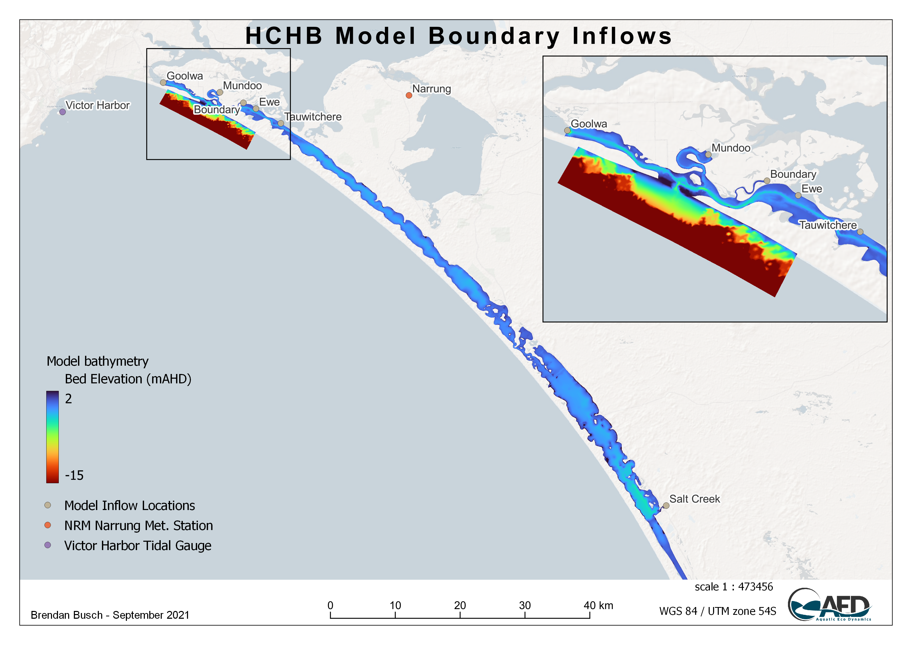

```

For each of the flow boundaries, the model requires specification of inflow nutrient and salt concentrations, to resolve the external loading into the domain. This is depicted in Figure \@ref(fig:cdm-pic6). Details on the specific simulated variables that must be specified are summarised in further detail below.

```{r cdm-pic6, echo = FALSE, out.width='100%', class = "text-image",fig.align='center', fig.cap = "Summary of inflow files used for boundary specification and the required input constituents."}

knitr::include_graphics("images/cdm/HCHB_Inflows.png")

```

### Hydrodynamic settings

The key hydrodynamic settings controlling the water transportation and mixing in the TUFLOW-FV model include:

-   **Bottom drag**: For hydrodynamic simulations the bed boundary resistance is described using a $K_S$ bottom drag model, which assumes a log-law velocity profile and requires specification of a surface roughness length-scale. A background roughness length-scale of 0.018 was applied in the CDM (*update to reflect zones*);

-   **Horizontal momentum mixing**: the Smagorinsky scheme was applied for the horizontal momentum mixing modelling, with default Smagorinsky coefficient of 0.2;

-   **Horizontal scalar mixing**: the horizontal non-isotropic scalar diffusivity is calculated according to the Elder model, with Global Horizontal Scalar Diffusivity was set to 250 m^2^/s and the coefficient was set to 25;

-   **Tidal input**: a `WL` (water level) boundary condition was applied to the Murray Mouth tidal input;

-   **Inflow input**: a `Q` (nodestring flow) boundary condition was applied to the barrage flows, and a `QC` (cell inflow) boundary condition was applied to the Salt Ck inflow;

-   **Meteorology**:

    -   The background shortwave radiation extinction coefficients was set to 2.0, with feedback from the AED model of TSS concentration altering the extinction coefficient;
    -   Longwave radiation heat transfer model was using the net downward long wave radiation input, based on cloud cover;
    -   The wind stress was calculated using the [@wu1982] wind stress model.

-   **Salinity correction on evaporation**: The effect of high salinity on evaporation is included, as outlined [here](https://github.com/AquaticEcoDynamics/CDM/discussions/5).

### Water quality modules

The water quality model AED has been dynamically linked with TUFLOW-FV to simulate the mass balance and redistribution of carbon, nutrients and sediment, including partitioning between organic and inorganic forms and resolution of the relevant biotic components. This includes turbidity (including particle resuspension and sediment redistribution), chlorophyll a (chl-a), and filamentous algae (Ulva), plus habitat quality of Ruppia. Benthic and pelagic properties have been resolved.

A summary of simulated model variables is shown in Table 1. For detailed scientific documentation the reader is referred to the [AED Science Manual](https://aquaticecodynamics.github.io/aed-science/index.html).

```{r 2-varstable, echo=FALSE, message=FALSE, warning=FALSE}
library(knitr)
library(kableExtra)
library(readxl)
library(rmarkdown)
theSheet <- read_excel('tables/variable_summary.xlsx', sheet = 1)
theSheet <- theSheet[theSheet$Table == "Variable",]
theSheetGroups <- unique(theSheet$Group)
theSheet$Name <- paste0("`",theSheet$Name,"`")

for(i in seq_along(theSheet$Symbol)){
  if(!is.na(theSheet$Symbol[i])==TRUE){
    theSheet$Symbol[i] <- paste0("$$",theSheet$Symbol[i],"$$")
  } else {
    theSheet$Symbol[i] <- " "
  }
}
for(i in seq_along(theSheet$Units)){
  if(!is.na(theSheet$Units[i])==TRUE){
    theSheet$Units[i] <- paste0("$$\\small{",theSheet$Units[i],"}$$")
  } else {
    theSheet$Units[i] <- NA
  }
}

kbl(theSheet[,3:NCOL(theSheet)], caption = "CDM simulated variable summary", align = "l",) %>%
  pack_rows(theSheetGroups[1],
            min(which(theSheet$Group == theSheetGroups[1])),
            max(which(theSheet$Group == theSheetGroups[1])),
            background = '#ebebeb') %>%
  pack_rows(theSheetGroups[2],
            min(which(theSheet$Group == theSheetGroups[2])),
            max(which(theSheet$Group == theSheetGroups[2])),
            background = '#ebebeb') %>%
  pack_rows(theSheetGroups[3],
					  min(which(theSheet$Group == theSheetGroups[3])),
					  max(which(theSheet$Group == theSheetGroups[3])),
					  background = '#ebebeb') %>%
  pack_rows(theSheetGroups[4],
					  min(which(theSheet$Group == theSheetGroups[4])),
					  max(which(theSheet$Group == theSheetGroups[4])),
					  background = '#ebebeb') %>%
  pack_rows(theSheetGroups[5],
					  min(which(theSheet$Group == theSheetGroups[5])),
					  max(which(theSheet$Group == theSheetGroups[5])),
					  background = '#ebebeb') %>%
  row_spec(0, background = "#14759e", bold = TRUE, color = "white") %>%
  kable_styling(full_width = F,font_size = 11) %>%
	column_spec(2, width_min = "6em") %>%
	column_spec(3, width_max = "19em") %>%
	column_spec(4, width_min = "10em") %>%
	column_spec(5, width_min = "5em") %>%
  scroll_box(width = "700px", height = "2800px",
             fixed_thead = FALSE)
```

<br>

For the sediment and benthic related variables, the model allows for spatial variability in these properties, and this is captured through the definition of several *material zones*. This is explored in some detail in Chapter 4; though an example default material zone setup (used in Generation 1.5 simulations, see below) is shown below in Figure \@ref(fig:cdm-pic3).

```{r cdm-pic3, echo = FALSE, out.width='100%', class = "text-image",fig.align='center', fig.cap = "Different sediment zones used within the domain."}

knitr::include_graphics("images/cdm/Material Zones Updated.png")

```

<br>

## Model generation summary

The CDM modelling project by its very nature has evolving capability over time, and different modelling capabilities have been developed for particular use-cases. For context, the range of pre-HCHB and HCHB simulation "generations" are summarised in Table \@ref(tab:2-simtable). As at Sept 2021, this document mainly reports on Generation 0 results and the development of Generation I and II which is underway.

```{r 2-simtable, echo=FALSE, message=FALSE, warning=FALSE}
library(knitr)
library(kableExtra)
library(readxl)
library(rmarkdown)
theSheet <- read_excel('tables/sim_summary.xlsx', sheet = 1)
theSheet <- theSheet[theSheet$Table == "Simulation",]
theSheetGroups <- unique(theSheet$Group)

theSheet$Name <- paste0("`",theSheet$Name,"`")

kbl(theSheet[,3:NCOL(theSheet)], caption = "CDM simulation summary", align = "l",) %>%
  pack_rows(theSheetGroups[1],
            min(which(theSheet$Group == theSheetGroups[1])),
            max(which(theSheet$Group == theSheetGroups[1])),
            background = '#ebebeb') %>%
  pack_rows(theSheetGroups[2],
            min(which(theSheet$Group == theSheetGroups[2])),
            max(which(theSheet$Group == theSheetGroups[2])),
            background = '#ebebeb') %>%
  pack_rows(theSheetGroups[3],
					  min(which(theSheet$Group == theSheetGroups[3])),
					  max(which(theSheet$Group == theSheetGroups[3])),
					  background = '#ebebeb') %>%
  pack_rows(theSheetGroups[4],
					  min(which(theSheet$Group == theSheetGroups[4])),
					  max(which(theSheet$Group == theSheetGroups[4])),
					  background = '#ebebeb') %>%
  row_spec(0, background = "#14759e", bold = TRUE, color = "white") %>%
  kable_styling(full_width = F,font_size = 11) %>%
	column_spec(2, width_min = "5em") %>%
	column_spec(3, width_max = "19em") %>%
	column_spec(4, width_max = "19em") %>%
	column_spec(5, width_max = "19em") %>%
	column_spec(6, width_max = "19em") %>%
	column_spec(7, width_max = "19em") %>%
  scroll_box(width = "700px", height = "1100px",
             fixed_thead = FALSE)
```

<br>

<!--chapter:end:cdm_overview.Rmd-->

# Model-Data Ecosystem

<br>

The data requirements for the modelling are diverse and varied, spanning hydrological, meteorological, water and sediment quality (long-term monitoring, data from intensive campaigns and in situ sondes), plus ecological survey data. This creates an integration challenge for model setup, parameterisation and assessment (calibration and validation) (Figure \@ref(fig:cdm-pic5)). 


```{r cdm-pic5, echo = FALSE, out.width='100%', class = "text-image",fig.align='center', fig.cap = "The Coorong model-data ecosystem and conceptual approach to model-data integration, accomodating data diversity and varied model requirements."}

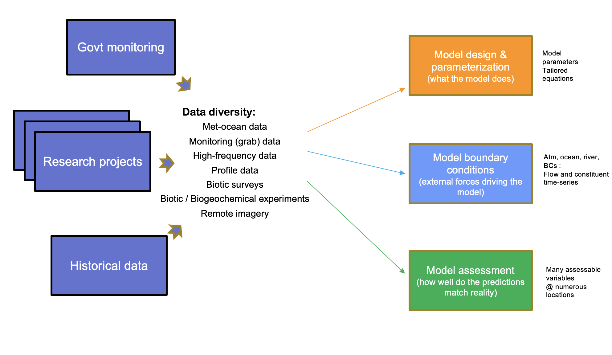
```

To enable the ongoing use and development of the CDM in this context, we have developed a **model-data integration framework** able to be used by DEW staff and project partners to co-ordinate the reference datasets needed for model development, and standardise the data integration and modelling workflows. The below sections describe how the CDM is organised, the tools and approaches used for model provenance and managing data streams, and model versioning.

<br>

## CDM structure and organisation

The CDM has been designed is such a way to both facilitate the sharing of data and models across various agencies and researchers, as well as providing a formalised structure to store, catalogue and process complex and unique datasets. Comparmentalised data structures have been implemented to allow for tracking and version control of data and models as they are utilised and upgraded throughout the project.

Data cataloguing via the "CDM Data Catalogue" (described in Section 3.4) has been designed with cross-agency usage in mind. Integration with the HCHB MEK Catalogue is essential to allow for the tracking of data changes and upgrades throughout the project. The "Point of Truth", "MEK Catalogue Classification" and "Status Notes" catagories have been included in the CDM Data Catalogue to track a dataset's evolution throughout the project.

Github has been chosen to house the repository based on it's mature version control systems and cross platform program support to aid all stakeholders accessing the data and models (https://github.com/). In addition, there is a [wide variety of documentation online](https://guides.github.com/activities/hello-world/) to assist users new to GitHub. 


###	**Online repository access**

The data and model files are stored in the Github [CDM Repository](https://github.com/AquaticEcoDynamics/CDM) and shared with HCHB research partners.


###	**Repository folder structure**

The folders structure follows the logic of data types and resources as shown in Figure \@ref(fig:cdm-pic7). 

```{r cdm-pic7, echo = FALSE, out.width='100%', class = "text-image",fig.align='center', fig.cap = "CDM online data storage folder structure"}

knitr::include_graphics("images/cdm/2.4.1_Folder_Structure.png")

```

The root directories are listed and described below: 

```{r A-folders, echo=FALSE, message=FALSE, warning=FALSE}
library(knitr)
library(kableExtra)
library(readxl)
library(rmarkdown)
theSheet <- read_excel('tables/folders.xlsx', sheet = 1)
theSheet <- theSheet[theSheet$Table == "data",]
theSheetGroups <- unique(theSheet$Group)

kbl(theSheet[,2:3], caption = "CDM Root Folder Descriptions", align = "l",) %>%

row_spec(0, background = "#14759e", bold = TRUE, color = "white") %>%
  kable_styling(full_width = T,font_size = 10) %>%
    scroll_box(fixed_thead = FALSE)
```

###	**High level workflows** ###

The raw data collected from previous works and current HCHB component outcomes are stored in the ```data/incoming``` folder and classified by their sources. These raw data are then post-processed using standard scripts (stored in the ```scripts``` folder) to convert the raw data into ‘standard’ data format (stored in the ```data/store``` folder) for model configuration, calibration/validation, and reporting (see 2.4.2 Data organisation for more details). The data-model workflow is shown in Figure \@ref(fig:cdm-pic8). 

```{r cdm-pic8, echo = FALSE, out.width='100%', class = "text-image",fig.align='center', fig.cap = "CDM conceptual diagram showing the flow of data through the system"}

knitr::include_graphics("images/cdm/2.4.1_Workflow.png")

```

<br>

## Data repository and management

### **Data catalogue**

All data that is uploaded to the CDM github repository is logged in the CDM Data Catalogue. The catalogue (found in the data directory) is comprised of a main data sheet ("CDM Data Catalogue") as well as summary sheets for all processed data. Every raw datafile is logged with the following information:

```{r A-metadata, echo=FALSE, message=FALSE, warning=FALSE}
library(knitr)
library(kableExtra)
library(readxl)
library(rmarkdown)
theSheet <- read_excel('tables/CDM_Classes.xlsx', sheet = 1)
theSheet <- theSheet[theSheet$Table == "Data",]
theSheetGroups <- unique(theSheet$Group)

kbl(theSheet[,3:4], caption = "CDM Catalogue Metadata", align = "l",) %>%

row_spec(0, background = "#14759e", bold = TRUE, color = "white") %>%
  kable_styling(full_width = T,font_size = 10) %>%
    scroll_box(fixed_thead = FALSE)
```
<br>

A catalogue of all data under management of the CDM is provided in [Appendix A](Appendix A : Data Catalogue).


### **Data organisation**

All raw data is initially uploaded into the ```data/incoming``` directory is filed under either it's Trials and Investigations (T&I) component, or the agency responsible for supplying the data.

Data is then imported into a common format via the scripts found in the ```scripts/dataimport``` directory and stored in the ```data/store``` directory. Although some imported data may contain extra fields, all imported data contains the following fields:

```{r CDM-datastore, echo=FALSE, message=FALSE, warning=FALSE}
library(knitr)
library(kableExtra)
library(readxl)
library(rmarkdown)
theSheet <- read_excel('tables/data_store_info.xlsx', sheet = 1)
theSheet <- theSheet[theSheet$Table == "Data",]
theSheetGroups <- unique(theSheet$Group)

kbl(theSheet[,3:4], caption = "CDM Stored Data", align = "l",) %>%
  pack_rows(theSheetGroups[1],
            min(which(theSheet$Group == theSheetGroups[1])),
            max(which(theSheet$Group == theSheetGroups[1])),
            background = '#ebebeb') %>%
  pack_rows(theSheetGroups[2],
            min(which(theSheet$Group == theSheetGroups[2])),
            max(which(theSheet$Group == theSheetGroups[2])),
            background = '#ebebeb') %>%
row_spec(0, background = "#14759e", bold = TRUE, color = "white") %>%
  kable_styling(full_width = T,font_size = 11) %>%
  scroll_box(fixed_thead = FALSE)
```
<br>

Once imported, the data is then summerised via a script in the ```scripts/dataimport/summary``` directory to create a standard set of plots and summary tables that can be found in the ```data/summary``` directory. ESRI shapefiles are also automatically produced and saved into the ```gis/summary``` directory to be used to create a stardarised site map of the data's sampling locations.

```{r cdm-pic10, echo = FALSE, out.width='100%', class = "text-image",fig.align='center', fig.cap = "Example GIS Map showing the sampling locations for the Water Data SA online data "}

knitr::include_graphics("images/cdm/DEW WaterDataSA Locations.png")
```

### **Data processing workflows**

The data processing scripts for the CDM are all contained within the ```scripts/``` directory, which has three subfodlers:

  + `dataimport`: All scripts that import data into the CDM, or process data into a common format
  + `datatools`: All scripts that use processed data to create additional datasets or model input files
  + `modeltools`: All scripts that use processed data and model output to create additional datasets, model validation images and analysis

Scripting has been predominately carried out utilising the [Matlab](https://au.mathworks.com/?s_tid=gn_logo) programming language, however there are scripts within the ```scripts``` directory using both [R](https://www.r-project.org/about.html) and [Python](https://www.python.org/). Users are able to add scripts in their preferred language; the repository core scripts for data storage and model plotting are currently in Matlab.
  
Below is an example workflow outlining how a meteorological boundary condition file for the TUFLOW-FV model is created (Figure \@ref(fig:cdm-pic9). Data is first downloaded and processed by scripts in the ```dataimport``` directory. A series of Matlab functions found in the ```datatools``` directory then read in the processed data (archived in the ```data/store``` directory) and use it to create the meteorological boundary condition file for the model. Both Matlab and R scripts were used in this example.


```{r cdm-pic9, echo = FALSE, out.width='100%', class = "text-image",fig.align='center', fig.cap = "CDM work flow diagram for met data"}

knitr::include_graphics("images/cdm/2.4.1_Met_Workflow.png")

```

<br>

## Model repository and management


### **Model catalogue**

All model files are stored in the `models` folder. As the model is developed over time, the model files are classified with project names and model generation identifiers. The ‘MER’ folder contains the model files used for assessing ‘eWater’ within the MER program; the ‘CIIP’ folder contains the model files developed for assessing CIIP scenarios, and the ‘HCHB’ folder contains the the core CDM files being updated throughout the HCHB project. 

Models within each project directory are separated via both *generation* and model *type*. Within the HCHB model folder there are currently 4 distinct models:

+ `hchb_swan_v1`
+ `hchb_tfvaed_Gen1.0_1PFT`
+ `hchb_tfvaed_Gen1.5_4PFT_MAG`
+ `coorong-rapid`

The ```hchb_swan_v1``` is the first generation of the Coorong SWAN Wave model that has been developed (see Section 3.2). Found inside the ```hchb_swan_v1``` directory are two zipped model folders:

+ `Coorong_swn_20170101_20220101_UA_Wind_200g_2000w.zip`
+ `Coorong_swn_20191101_20220101_UA_Wind_200g_2000w.zip`

The ```coorong-rapid``` simulation folder and the ```hchb_tfvaed_Gen1.0_1PFT``` simulation folder both contain TUFLOW-FV - AED simulations, but are kept separate as they constitute different generations, using different grids, simulation periods and BC files. The Generation 1.5 simulation (```hchb_tfvaed_Gen1.5_4PFT_MAG```) represents an upgrade in the number of phytoplankton groups, new material zones and the addition of macroalgae.

Each model folder may contain multiple simulation sets, but they will all rely on the same model base configuration, with minor differences or adujstments. Major changes to a model's configuration will constitute a change in generation numeber and these are stored in a separate folder. Note, models uploaded to the CDM repository may have been created by different agencies and researchers and should maintain a consistent naming convention.


### **TUFLOW-FV model organisation**

Each version of TUFLOW-FV models in the *CIIP* and *HCHB* sub-folders are organised with the following structure:

  + `Bc_dbase` (or `BCs`): boundary condition files, including tide and inflow boundary files; meteorological boundary files, and initial condition files;
  + `External`: AED model files linked with the TUFLOW-FV, and optionally the ‘GOTM’ vertical mixing model if the CDM is in 3D mode;
  + `Model`: TUFLOW-FV model structure files, including geometry and mesh files, and GIS files controlling the nodestrings and material zones;
  + `Run`: model control/configuration files;

The TUFLOW-FV model found in the MER project folder was created prior to the above structure being implemented and contains the following folder structure:

  + `BCs`: boundary condition files, including tide and inflow boundary files; meteorological boundary files, and initial condition files;
  + `External`: AED model files linked with the TUFLOW-FV, and optionally the ‘GOTM’ vertical mixing model if the CDM is in 3D mode;
  + `GEO`: TUFLOW-FV model structure files, including geometry and mesh files, and GIS files controlling the nodestrings and material zones;
  + `INPUT`: model control/configuration files;
  + `Plotting` : Directory to store model output images;

The ```hchb_tfvaed_Gen1.5_4PFT_MAG``` simulation folder also contains a `bin` directory containing the windows binaries for the TFV-AED model   

  + `TFV:` Build version: 2020.03.105
  + `AED:` Build version: 2.0.5b


### **SWAN Wave Model organisation**

The SWAN Wave models found in the HCHB model directory have the following format:

  + `01_geometry` : Contains the bathymetry input files as well as a automatically generated image of the bathymetry and a matlab .mat file containing the bathymetry information;
  + `02_bc_dbase` : Contains the processed wind input files
  + `03_simulation` : Contains the INPUT control file required to run the simulation
  + `04_results` : Model output directory
  
The script required to create and configure a new SWAN wave model can be found in the ```scripts/datatools/wave``` directory.


### **Model processing toolbox**

The processing of any model output is predominately written and run in Matlab. Scripts that have been specifically developed for this project are contained within the ```scripts/modeltools``` directory. Scripts that have created Figures 3.9, 3.11 and 5.2 (among others) can be found here. 

Plotting and model processing types include:

  + Time-series plotting;
  + Transect plotting;
  + Model animation creation;
  + Error assessment;
  + Wave model plotting;
  + Habitat mapping (e.g., Ruppia & Fish HSI processing and mapping)
  + Scenario comparison and "DelMap" plotting;
  + Nutrient budget assessments.

In particular, the publicly available GitHub repository called [`aed_matlab_modeltools`](https://github.com/AquaticEcoDynamics/aed_matlab_modeltools) is used and contains a wide variety of matlab scripts and functions that are frequently used to process and visualise model output. `plottfv_polygon` and `plottfv_transect` are the main functions that are frequently used. Tables 7.3 and 7.6 in Appendix B are examples of output generated via the `plottfv_polygon` function found in the `aed_matlab_modeltools` repository. This plotting function uses data and gis files stored in the CDM repository, in addition to model output to create timeseries plots of the model (averaged within a polygon region) compared against field data. The plotting function will also automatically calculate a range of error statistics based on model output and field measured data.

```{r cdm-plottfvpolygon, echo = FALSE, out.width='100%', class = "text-image",fig.align='center', fig.cap = "Example output from plottfv_polygon with error matrix"}

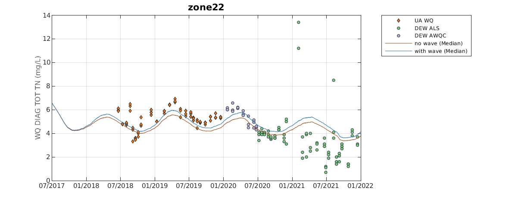

```

`plottfv_transect` can also be found in the `aed_matlab_modeltools` repository. This plots model data extracted along a transect line during a specified plotting period, and compares against the range of field data found within that period.

```{r cdm-plottfvtransect, echo = FALSE, out.width='100%', class = "text-image",fig.align='center', fig.cap = "Example output from plottfv_transect with distance from Goolwa Barrage (km) along the x-axis"}

knitr::include_graphics("images/cdm/example_Transect.png")

```

The `aed_matlab_modeltools` also houses scripts and functions for:

  + Nutrient Budgeting;
  + Stacked Area Transect;
  + Curtain plotting;
  + Mesh manipulation tools;
  + Data exports;
  + Sheet plotting and animation tools;


```{r cdm-stackedarea, echo = FALSE, out.width='100%', class = "text-image",fig.align='center', fig.cap = "Example output from plottfv_transect_StackedArea with distance from Goolwa Barrage (km) along the x-axis"}

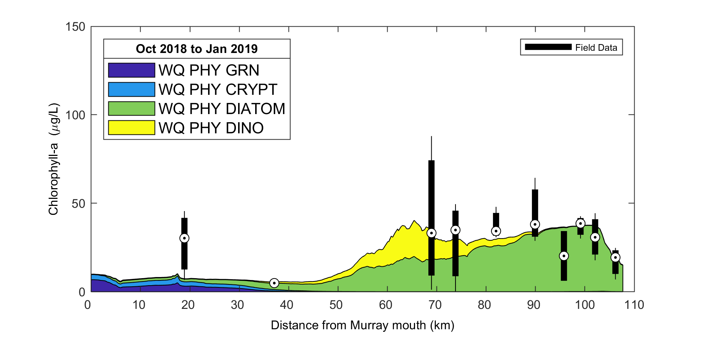

```


```{r cdm-nutrientbudget, echo = FALSE, out.width='100%', class = "text-image",fig.align='center', fig.cap = "Example Nutrient Budgeting output of the North Coorong"}

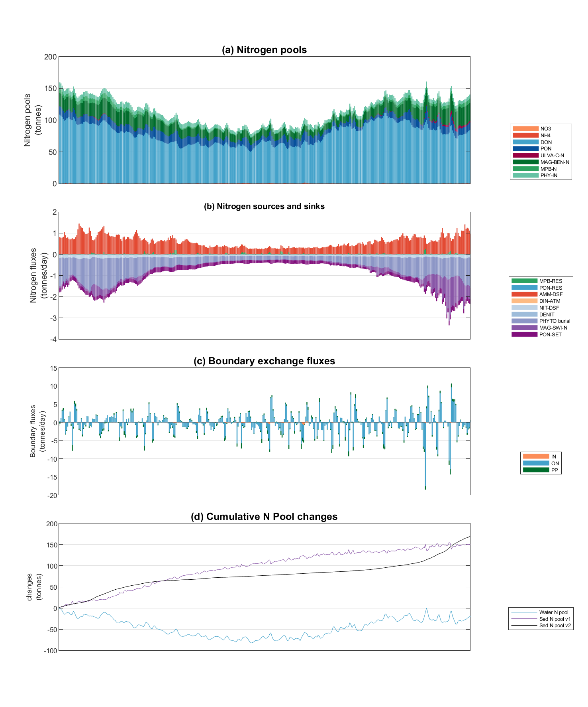

```

Information on how to clone a publicly available GitHub repository can be found [here](https://docs.github.com/en/github/creating-cloning-and-archiving-repositories/cloning-a-repository-from-github/cloning-a-repository).


<!--chapter:end:cdm_integration.Rmd-->


# Resuspension & Turbidity

<br>

## Overview

Waves and currents are the primary mechanisms of sediment resuspension
in coastal waterways. In shallow lagoons with restricted connection to
the ocean such as the Coorong, waves are locally generated by the wind
acting on the fetch inside the basin [@green2014; @mosley2021]. Some may also propagate into the basin from the ocean, but
the effect is limited in terms of the distance into the lagoon they can
enter from the mouth.

Sediments in aquatic systems are resuspended into the water column when
the bottom shear stress becomes greater than the critical shear stress
for the initiation of suspension [@rijn1993]. The critical shear stress
for the particles is depending on the particle properties such as size
and density.

In order to capture the role of wind-driven waves on water column
suspended solids and organic matter concentrations within the Coorong,
the SWAN wave model was applied. The wave model predicts the spatial
pattern of significant wave height and wave periods and the output is
used by the TUFLOW-FV model for modelling shear stress at the seabed as
affected by orbital wave velocities. Depending on the sediment particle
sizes, the combined stress from the wave and current activity is used to
predict the rate of sediment resuspension. Capturing sediment
resuspension in the Coorong is critical to predict the turbidity fo the
water which shapes the underlying light climate that shapes the dynamics
of primary producers.

The settings of the wave model and the particle properties such
resuspension rates and settling rates are described below. Some wave
data are available from experimental work undertaken in 2020 at sites of
Policeman Point and Villa de Yampa (@mosley2021; site map available in
Figure \@ref(fig:dev-sites)). Turbidity data is also available as part
of the regular monitoring program and as part of HCHB research at
multiple sites along the Coorong. These data are used for calibration
purposes and the results are presented and discussed in the following
sections.

<br>

## Model approach

### SWAN wave model simulation

The SWAN wave model was adopted using a Cartesian grid with 200 m
resolution, and the third generation simulation mode. The wave model
domain covers the CDM domain (Figure \@ref(fig:dev-sites)) therefore the
wave outputs can be linked with CDM for resuspension simulations. The
model was initially forced with the Narrung weather station data and the
water depth was interpolated from the existing (2008) Coorong bathymetry
data. Wind data at the wave measurement site was also integrated in the
wind forcing dataset for the period of field experiments when it was
available.

```{r dev-sites, echo = FALSE, out.width='100%', class = "text-image",fig.align='center', fig.cap = "Model extents for SWAN Wave Model and the TFV domains, with validation sites."}

knitr::include_graphics("images/dev/HCHB SWAN Extents.png")

```

### Sediment solids and resuspension

The field observations of the total suspension solids (TSS) composition
showed that the TSS was mostly dominated by the small size particles
(\<3.8 microns) during the observation periods, while large size
particles (186 -- 461 microns) may periodically become dominant (Figure
\@ref(fig:dev-ssarea)). Based on these observations, the AED component
of the simulation has been configured to include upto three suspended
solids (SS) groups, namely:

-   clay, for suspended particles with size \< 3.8 microns;
-   silt, for suspended particles with 3.8 microns ≤ size \< 186
    microns; and
-   sand, for suspended particles with size \> 186 microns;

```{r dev-ssarea, echo = FALSE, out.width='100%', class = "text-image",fig.align='center', fig.cap = "Suspended solids components during the field observations (data source: Mosley et al., 2021)."}

knitr::include_graphics("images/dev/waves/timehist_TSS_area.png")

```

The rate of resuspension (R) varies across the system due to
heterogeneity in sediment properties. It is calculated by assuming
linearity with the excess shear stress at the bed [@lee2005], such that:

$$
R_i=\sum_{s=1}^{n_s}{{\ \ f}_{s,i}\ {\ \ \varepsilon}_s}\ \ \text{max}\left(\tau_b-\tau_c,\ 0\right)
(\#eq:resus1)
$$

where $n_s$ is the number of particle size classes, $f_{s,i}$ is the
fraction of each particle size class in the sediment material zone,
$\varepsilon_{ss}$ is the bulk resuspension rate, $\tau_b$ is the bed
shear stress (computed based on the current and wave orbital velocities
in each cell), and $\tau_c$ is the critical shear stress for
resuspension, which depends on the sediment size class [@julien2010],
and optionally, the presence of vegetation.

To capture regional heterogeneity across the lagoon, the sediment of
Coorong was categorized to 10 regions from north to south, and each
region was further divided into 3 zones spanning the deep water and both
sides of shallow water in order to categorise different sediment
properties between the shallow and deep areas and north to south (Figure
\@ref(fig:dev-31z)).

```{r dev-31z, echo = FALSE, out.width='100%', class = "text-image",fig.align='center', fig.cap = "31 discrete sediment zones used within the model domain."}

knitr::include_graphics("images/cdm/Material Zones Updated.png")

```

<br>

The major components of N and P released by resuspension can be in
particulate form, depending on the organic matter content of the
sediment [@tang2019]. Therefore, the resuspension of particulate organic
matter is also considered in the model. The organic matter resuspension
rate, $R_{OM}$} is calculated as:

$$
R_{OM}=\sum_1^i \left(R_i\:f_{(OM-frac)} \right)  
(\#eq:resus2)
$$

where $i$ is the particle group index, $R_i$ is the resuspension rate,
and $f_{OM-frac}$ is the organic matter fraction in the sediment. This
is set to be unique in each of the simulated zones. Once $R_{OM}$ is
computed, this is partitioned into carbon, nitrogen and phosphorus
resuspension rates for the POC, PON and POP water column balances using
a user-prescribed sediment $OM$ C:N:P ratio.

The sediment properties of particle size and organic matter content were
set based on the sediment survey data (details of sediment survey and
results are described in Chapter 7 - Sediment Biogeochemistry), which
were then interpolated into the zones based on the sediment particle
sizes, organic matter content and expert assessment of sediment quality
data. The details of sediment particle property settings in each zone
are summarized in Table \@ref(tab:dev-zonepars).

<br>

```{r dev-zonepars, echo=FALSE, message=FALSE, warning=FALSE}
library(knitr)
library(kableExtra)
library(readxl)
library(rmarkdown)
theSheet <- read_excel('tables/water/sediment_flux.xlsx', sheet = 5)
theSheet <- theSheet[theSheet$Table == "Data",]
for(i in seq_along(theSheet$Description)){
  if(!is.na(theSheet$Description[i])==TRUE){
    theSheet$Description[i] <- paste0("*",theSheet$Description[i],"*")
  } else {
    theSheet$Description[i] <- NA
  }
}
for(i in seq_along(theSheet$ZoneID)){
  if(!is.na(theSheet$ZoneID[i])==TRUE){
    theSheet$ZoneID[i] <- paste0("**",theSheet$ZoneID[i],"**")
  } else {
    theSheet$ZoneID[i] <- NA
  }
}

kbl(theSheet[,2:7], caption = "Summary of sediment property settings in CDM with 10 regions defined north to south, split into 31 discrete material zones.", align = "l",escape = F, ) %>%

row_spec(0, background = "#14759e", bold = TRUE, color = "white") %>%
  kable_styling(full_width = T,font_size = 10) %>%
  scroll_box(fixed_thead = FALSE)
```

<br>

Once in suspension, particles are subject to a sedimentation rate back
into the sediment based on a estimated settling velocity for each
particle size group. The settling velocity is calculated based on
Stokes' law, which balances gravitational forces and drag. For inorganic
suspended sediment particles this is sumamrised as:

$$
V_{ss_s}=\frac{d_s^2 g}{18η}(ρ_s-ρ_w)
(\#eq:resus3)
$$ 
where $w_s$ is the settling velocity ($m/s$); $d_s$ is the particle
diameter ($m$); $g$ is the acceleration due to gravity ($m/s^2$); $ρ_s$
is the particle density ($kg/m^3$); $ρ_w$ is the water density
($kg/m^3$); and $η$ is the kinematic fluid viscosity ($kg/m/s$). A
summary of the literature and current CDM settings related to the
resuspension and suspended sediment model is summarised below in Table
4.1.

<br>

### Suspended solids and light

The concentration of suspended solids at any location depends on inputs
from tributaries, advection of material through the lagoon, and vertical
fluxes due to particle resuspension and deposition (described above).
The CDM includes 1 to 3 sediment particles sizes ($SS_s$) and is
configured to include light ($I$). The TUFLOW-FV -- AED models are also
dynamically coupled to capture the feedback between $SS$, light, and
surface heating.

Light is modelled by capturing the attenuation of incident shortwave
radiation as it penetrates the water column. The attenuation of light is
dependent on the specific bandwidth. For primary production, the
shortwave (280-2800 nm) intensity at the surface ($I_0$) is partitioned
to the photosynthetically active component (PAR) based on the assumption
that \~45% of the incident spectrum lies between 400-700nm. PAR and
other light bandwidths such as ultra-violet (UV, \~3.5%) and
near-infrared (NIR, \~51%), penetrate into the water column according to
the Beer-Lambert Law:

$$
I_{i} = f_{i} I_{0} \text{exp} (-K_{d_{i}} z)
(\#eq:resus4)
$$

where $i$ refers to the specific bandwidth range (e.g., PAR, UV, etc),
$f_i$ is the fraction of light intensity within that range at the water
surface and $z$ is the water depth. The light extinction coefficient
$K_d$ is a variable parameter governing light attenuation, as influenced
by the suspended solids ($SS$) in the water column, filamentous algae
density, and vegetation leaf area index. In these simulations it is
computed by assuming a background light extinction coefficient $K_w$ and
the specific attenuation coefficient, $K_e$, for $SS$ and algae:

$$
K_{d} = K_{w} + K_{e_{s}} SS + K_{e_{pom}} POC +  K_{e_{PHY}} PHY + K_{e_{F}} FA 
(\#eq:resus5)
$$

Computing turbidity from the concentration of particulates is also
possible and able to be compared to routinely measured turbidity data.
The relation for simulation of turbidity is able to be expressed as:

$$
\text{Turbidity} = f_{t_{ss}}\:SS + f_{t_{chl}}\: Chla + f_{t_{pom}}\: POC
(\#eq:resus6)
$$

where $f_{t_{s}}$ is an empirical coefficient, determined through site
specific correlations or literature. The suspended solids-turbidity
ratio is currently assumed to be 1, based on experimental data from the
March 2020 UA field assessment where both SS and Turbidity were measured
simultaneously.

<br>

```{r dev-wavepars, echo=FALSE, message=FALSE, warning=FALSE}
library(knitr)
library(kableExtra)
library(readxl)
library(rmarkdown)

# function to fix floating point decimals
# df = dataframe to fix
# colNames = list() of colummns to fix
fixDecimals <- function(df, colNames){
  for(i in colNames){
    for(ii in 1:NROW(df[,i])){
      currentVal <- df[ii,i]
      currentVal <- as.numeric(currentVal)
      if(!is.na(currentVal)==TRUE){
        newVal <- as.character(currentVal)
        df[ii,i] <- newVal
      } 
    }
  }
  return(df)
}
theSheet <- read_excel('tables/wave_pars.xlsx', sheet = 2)
theSheet <- fixDecimals(
  df = theSheet, 
  colNames = list("SS1:Clay","SS2:Silt","SS3:Sand")
  )
theSheet <- theSheet[theSheet$Table == "Data",]
theSheetGroups <- unique(theSheet$Group)

for(i in seq_along(theSheet$Parameter)){
  if(!is.na(theSheet$Parameter[i])==TRUE){
    theSheet$Parameter[i] <- paste0("$$",theSheet$Parameter[i],"$$")
  } else {
    theSheet$Parameter[i] <- NA
  }
}
for(i in seq_along(theSheet$Unit)){
  if(!is.na(theSheet$Unit[i])==TRUE){
    theSheet$Unit[i] <- paste0("$$\\small{",theSheet$Unit[i],"}$$")
  } else {
    theSheet$Unit[i] <- NA
  }
}

kbl(theSheet[,2:NCOL(theSheet)], caption = "Summary of key parameters used to simulate sediment resuspension, deposition and turbidity. ", align = "l",) %>%

row_spec(0, background = "#14759e", bold = TRUE, color = "white") %>%
  kable_styling(full_width = T,font_size = 10) %>%
    scroll_box(fixed_thead = FALSE)
```

<sub><sup>a: van Rijn (1993)</sup></sub><br> <sub><sup>b: Depinto et al.
(2010)</sup></sub><br> <sub><sup>c: Evans (1994)</sup></sub><br>
<sub><sup>d: Tang et al. (2019)</sup></sub><br> <sub><sup>e: calculated
from Eq \@ref(eq:resus3)</sup></sub><br>

<br>

An example output from the model showing the spatial variability in
$K_d$ at a given time is shown in Figure \@ref(fig:dev-pic109).

<center>

```{r dev-pic109, echo = FALSE, out.width='80%', class = "text-image", fig.cap = "Model output showing the extinction coefficient, Kd (/m), variability within the lagoon."}

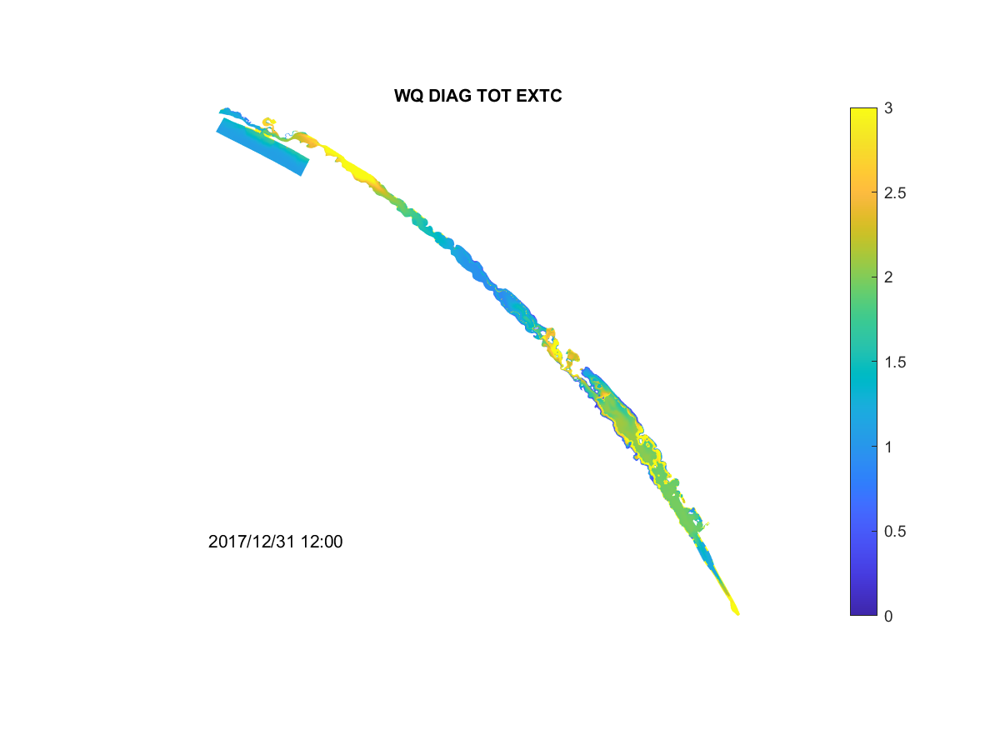

```

</center>

<br>

## Validation and assessment

### Wave characteristics

The SWAN wave model was calibrated against data collected during the
periods when sediment resuspension studies were undertaken by the UA
team in December 2020 and March 2021. The comparison between the SWAN
wave model outputs and the field survey data of significant wave height
is shown in Figure \@ref(fig:dev-pic101), which indicates the wave model
acurately simulated the time variation and magnitude of significant wave
height.

```{=html}
<!-- 
 ```{r dev-pic1, echo = FALSE, out.width='60%', class = "text-image", fig.cap = "Comparison of the Coorong SWAN wave model output and the UA field survey data at two sites. Period spanning Mar 2021."}

knitr::include_graphics("images/dev/3_picture1.png") 

```
-->
```
<center>

```{r dev-pic101, echo = FALSE, out.width='80%', class = "text-image", fig.cap = "Comparison of the Coorong SWAN wave model output and the UA field survey data at two sites. Period spanning Dec 2020 and Mar 2021."}

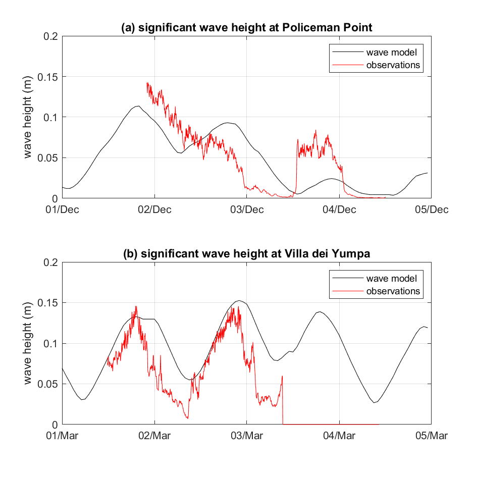

```

</center>

### Lagoon scale turbidity

The wave model output is then coupled to the TUFLOW-FV - AED model,
where it influences $\tau_b$ and influences the rate of sediment
resuspension (Eq. \@ref(eq:resus1)).

Examples of the spatial distribution of significant wave height, bottom
shear stress (TAUB), resuspension rate, and TSS concentration in the
water during a low wind event (Figure \@ref(fig:dev-pic3)) and high wind
event (Figure \@ref(fig:dev-pic4)) are shown below. In general, the wind
condition was shown to be the dominant factor of the sediment
resuspension rate. During the calm wind condition such as in 01/11/2021
when the wind speed was \< 3 m/s, the sediment resuspension rate was
negligible. The resuspension rate exceeded 20 g/m^2^/day in 19/11/2020
when the wind speed reached 9 m/s, which subsequently led to increase in
the water TSS concentrations. The shallow water in the littoral zones
are more vulnerable to the wind-induced resuspension.

```{r dev-pic3, echo = FALSE, out.width='100%', class = "text-image", fig.cap = "An example output of modelled (a) weight height, (b) bottom shear stress, (c) resuspension rates, and (d) total suspended solid concentration in Coorong during low wind condition (< 3m/s)."}

knitr::include_graphics("images/dev/3_picture2.png")

```

```{r dev-pic4, echo = FALSE, out.width='100%', class = "text-image", fig.cap = "Same as Figure xx except for a relatively higher wind condition (>9m/s)."}

knitr::include_graphics("images/dev/3_picture3.png")

```


An animation of the wave, resuspension and turbidity conditions is also
shown below.

<br>

<center>

<video width="100%" height="100%" controls>

<source src="images/dev/animation_resuspension.mp4" type="video/mp4">

</video>

</center>

<br>

The resulting turbidity, in comparison with the field observations and
the CDM outputs without the waves, at sites of A4261165, A4261209 and
A4261135 is shown in Figure \@ref(fig:dev-pic2). The comparison
indicates the degree to which addition of orbital wave velocity into the
simulation led to more resuspension when compared to the 'no-waves'
scenario; the model with the wave inputs included accuractely captured
the magnitude and the timing of high turbidity events in general. The
results also showed that the wave effects on the turbidity diminished
from south to north. While in the north lagoon (e.g., the site
A4261135), the turbidity showed similar results between the 'with wave'
and 'without waves' scenarios, indicating that the current dominated the
resuspension in the north lagoon.

Though the wave stress has a significant effect on the turbidity, the
effect on the nutrient concentration is relatively small. An example of
TN concentration at the same sites between the 'with wave' and 'without
wave' scenario is presented in Figure \@ref(fig:dev-picss2), where shows
the difference of TN concentration between the scenarios are generally
\< 10%, probably due the fact that the Coorong has a large stock of
nutrient in the water therefore the resuspension contribution is small
when compared to the existing stock.

<br>

<head>

<meta name="viewport" content="width=device-width, initial-scale=1">

```{=html}
<style>
/* Style the buttons inside the tab */
.tab button {
  background-color: #2481AA;
  float: left;
  width: 49.5%;
  border: none;
  outline: none;
  cursor: pointer;
  padding: 14px 16px;
  transition: 0.3s;
  font-size: 14px;
  color: #FFFFFF;
  font-weight: bold;
}
</style>
```
</head>

<body>

::: {.tab}
<button class="tablinks" onclick="opentab(event, 'turb')"id="defaultOpen">Turbidity</button>
<button class="tablinks" onclick="opentab(event, 'tn')">Total
Nitrogen</button>
:::

::: {#turb .tabcontent}
<center>

```{r dev-pic2, echo = FALSE, out.width='95%', class = "text-image", fig.cap = "Comparison of the AED turbidity model output against the observed data at three sites within the Coorong over the calibration period from January 2020 to December 2021."}

knitr::include_graphics("images/dev/waves/turbidity_performance.jpg")

```

</center>
:::

::: {#tn .tabcontent}
<center>

```{r dev-picss2, echo = FALSE, out.width='95%', class = "text-image", fig.cap = "Comparison of the AED Total Nitrogen (TN) model output against the observed data at three sites within the Coorong over the calibration period from January 2020 to December 2021."}

knitr::include_graphics("images/dev/waves/tn_performance.jpg")

```

</center>
:::

```{=html}
<script>
function opentab(evt, tabName) {
  var i, tabcontent, tablinks;
  tabcontent = document.getElementsByClassName("tabcontent");
  for (i = 0; i < tabcontent.length; i++) {
    tabcontent[i].style.display = "none";
  }
  tablinks = document.getElementsByClassName("tablinks");
  for (i = 0; i < tablinks.length; i++) {
    tablinks[i].className = tablinks[i].className.replace(" active", "");
  }
  document.getElementById(tabName).style.display = "block";
  evt.currentTarget.className += " active";
}
document.getElementById("defaultOpen").click();
</script>
```
</body>

<br>

The performance assessment of the various model generations in capturing
turbidity, and other variables influenced by resuspension, is outlined
in Chapter 9. In addition, a full comparison results of key water
quality parameters assessing the model sensitivity to inclusion of the
wave forcing effect ('with wave' and 'no-waves' scenarios) is provided
in [Appendix B : Results Archive].

<br>

## Summary

The existing wave model is shown to be well calibrated, and the
resuspension model performance is reasonable in terms of resuspension
magnitudes to capture changes in the water column turbidity. The results
also showed that the coupling of wave model within CDM helped to capture
the high-turbidity events that occured within the south lagoon. The
results suggest that the driver for sediment resuspension transitions
from a mix of wave and currents in the south lagoon to being primarily
current dominated in the north lagoon, similar to the findings in other
lagoon systems (e.g. @green2014).

In shallow aquatic system, hydrodynamics and diffusion are regarded as
crucial factors to controlling sediment nutrients exchange. More
specifically, two modes are responsible for nutrient release from
sediment layers to overlying water, i.e., static release by nutrient
diffusion in relatively calm situation caused by concentration gradient,
and dynamic release accompanied by hydrodynamic-induced sediment
resuspension in the shallow lake [@teng2003; @tamm2015]. In open water
where the fetch is long, In particular, the dynamic release is the
dominant mode in the actual situations since the water-sediment
interface is frequently disturbed by hydrodynamic processes [@tamm2015].
However, from the point of view of the long-term nutrient cycle, natural
resuspension may make a small contribution to the nutrient release and
diffusion release may dominate [@black1997]. The results for the Coorong
based on these CDM simulations has shown that the effects of
wind-induced resuspension on the nutrient release is relatively mild.
This is coincident with the field survey of waves and resuspension in
the Coorong, that there was no significant change in (total) nutrient
levels due to resuspension [@mosley2021]. Also, the sediment experiment
showed a strong diffusive nutrient flux of $NH_4$ and $PO_4$ under calm
condition, which indicate the diffusive flux of nutrient is the major
process of sediment release in the Coorong. Nonetheless, in Chapters 5
and 7, we do include parameterisations for OM resuspension and surficial
pore-water flushing when resolving the sediment-water nutrient exchange.

<br>

<!--chapter:end:cdm_resuspension_and_turbidity.Rmd-->

---
editor_options: 
  markdown: 
    wrap: 72
---

# Oxygen, Nutrients & Chlorophyll-a

<br>

<!-- -->

## Overview

Coastal lagoons occur along 13% of the coastlines of all continents
[@barnes1980] and represent a special type of coastal systems in terms
of their hydrology and biogeochemistry, where strong gradients in
chemical variables and ecosystem function persist [@kjerfve1994].
Coastal lagoons like the Coorong are shallow with restricted connection
with the ocean, and become vulnerable to nutrient enrichment and
eutrophication. Choked lagoons have comparatively long water retention
time and high phytoplankton biomass [@knoppers1991; @newton2005] due to
the restricted water exchange. The relatively poor flushing, together
with shallow bathymetry and evaporation, leads to accumulation of salt
and nutrients within the basins that is not easily flushed out. Within
the South Lagoon in particular, the intense cycling of N and P between
the organic and inorganic forms is mediated by the many complex controls
on oxygen solubility and primary productivity.

Furthermore, the biogeochemical cycle of hypersaline environments is
highly distinct from typical freshwater, estuarine or marine
environments because it is strongly affected by changes in the
physicochemical parameters of the brine as well as in the state and
composition of the biological community in response to the salinity
variations [@zhang2011; @isaji2019; @mosley2020]. The use of water
quality models in the management of coastal water has been well
recognised and many models have been utilized to date for coastal
management, however, water quality models considering hypersaline lagoon
environments are relatively rare although extensive hydrodynamic
modelling has been undertaken in these systems.

Therefore, whilst the base AED model platform being used in previous
model versions has been a good starting point, there is a need to tailor
the setup to the hypersaline Coorong lagoon system. The aim of this
section is to describe the approach, model adjustments and model
assessment in terms of how the model is applied to capture the core
biogeochemical components: the oxygen, nutrients, and phytoplankton that
form the foundation of the elemental cycles in the lagoon.

<br>

<!-- -->

## Dissolved Oxygen

### Background

Dissolved Oxygen ($DO$) dynamics respond to processes of atmospheric
exchange, sediment oxygen demand, microbial use during organic matter
mineralisation and nitrification, photosynthetic oxygen production and
respiratory oxygen consumption, chemical oxygen demand and respiration
by other biotic components. In general, within the Coorong, dissolved
oxygen levels are affected by salinity and temperature changes, which
control oxygen solubility. In the South Lagoon however, enriched
sediments create a large sediment oxygen demand ($SOD$), which can casue
a temporary sag in the oxygen saturation levels, particualr under
quiescent conditions when wind mixing is unable to replenish low oxugen
in the bottom waters. Superimposed on this is the often patchy
photosynthetic inputs of oxygen by phytoplankton and filamentous
macroalgae, and their subsequent high respiratory demands under dark
conditions.

### Model setup

The CDM oxygen modelling approach follows the AED oxygen model setup as
outlined in the [AED science
manual](https://aquaticecodynamics.github.io/aed-science/DO_1.html). The
configuration used in the CDM simulations includes:

-   atmospheric exchange, based on oxygen solubility
-   phytoplankton photosynthesis and respiration
-   microphytobenthos photosynthesis and respiration
-   macroalgae photosynthesis and respiration
-   sediment oxygen demand
-   oxygen consumption due to nitrification
-   oxygen consumption due to organic matter mineralisation

The sediment oxygen demand is calculated either by the static sediment
oxygen model, or when the SDG model is engaged, then the sediment oxygen
demand is computed dynamically based on the oxygen gradient across the
sediment-water interface.

The settings for the model run with the static sediement oxygen demand
models, include sensitivity of the SOD to temperature and oxygen
concentration in the overlying water. The base oxygen flux rate is
however specified for each sediment zone; this is summarised in more
detail in the subsequent section.

Aside from the sediment oxygen demand, the parameters used in the oxygen
module are largely fixed and based on either the solubility constants
for oxygen, and the reaction rates computed in the nutrient and primary
producer modules based on a pre-determined oxygen stoichiometry.

### Model results

The oxygen predictions have been assessed over various years of
conditions in the Coorong (2017-2021) based on the routine oxygen
monitoring data available, in addition to the once-off high-frequency
oxygen logger deployment undertaken at McGrath. In assessing the model
performance, we sought to ensure:

-   the mean solubility condition across the lagoon was resolved along
    the salinity gradient
-   the seasonal cycle of solubility was reproduced in the mouth, south
    lagoon and north lagoon
-   the high-frequency measurements of diel oxygen variation were
    resolved in the deep (open) water monitoring sites, and
-   the high-frequency measurements of diel oxygen variation were
    resolved in the shallow (littoral) water monitoring locations, which
    have higher densities of macrophytes and macroalgae.

The results of the integrated assessment for the final calibrated model
are shown in Chapter 9, and below some focused results are presented to
demonstrate model performance in simulation oxygen dynamics.

#### Oxygen metabolism at McGrath {.unnumbered}

Figure \@ref(fig:water-oxy1) shows the modelled dissolved oxygen
saturation levels against the high frequency oxygen logger data that was
collected at the site of McGrath. The results indicate the model
captures diel oxygen metabolism at this site well, with fluctuations of
high oxygen saturation levels in the day time and low oxygen saturation
level at the night time, due to primary production and respiration,
respectively.

```{r water-oxy1, echo = FALSE, out.width='100%', class = "text-image", fig.cap = "(a) Long-term time-series and (b) zoom-in view of the modelled vs. measured DO saturation levels at McGrath."}

knitr::include_graphics("images/dev/water/oxygen_metabolism_mcgrath.png")

```

#### Long-term oxygen predictions {.unnumbered}

The predictions of oxygen concentrations for the main calibration
(2020-2021) and validation (2017-2021) multi-year assessments are shown
in [Appendix B : Results Archive].

<br>

<!-- -->

## Nitrogen, Phosphorus & Silica

### Background

Nutrient retention in the Coorong lagoon is currently a core management
driver, linked to habitat quality and a key target of proposed
management interventions. Recent analysis of the available historical
nutrient data across the lagoon has shown the sharp gradients in
nutrient species, and often high levels of nutrients in the South Lagoon
in particular [@mosley2021]. Furthermore, process investigations have
elucidated the high rates of benthic metabolism and rates of
productivity, contributing to a system with intensively cycled materials
between ecosystem pools. Yet, we currently have only a limited
understanding of the nutrient budget within the lagoons and the
hydrodynamic and biogeochemical controls on elemental cycling. In this
section, we outline the model setup and approach to parameterisation and
parameter selection for the key pools and processes relevant to the
Coorong.

### Model setup

#### General approach {.unnumbered}

The CDM approach to simulate nutrients includes the
[nitrogen](https://aquaticecodynamics.github.io/aed-science/inorganic-nitrogen.html),
[phosphorus](https://aquaticecodynamics.github.io/aed-science/inorganic-phosphorus.html),
[silica](https://aquaticecodynamics.github.io/aed-science/silica.html)
and [organic
matter](https://aquaticecodynamics.github.io/aed-science/organic-matter.html)
modules within AED. Both the inorganic and organic, and dissolved and
particulate forms of C, N and P are modelled explicitly along the
general degradation pathway of POM to DOM to dissolved inorganic matter
(DIM), however the need for discrete OM pools is elaborated upon below.
The nitrogen cycle includes the additional processes of denitrification
and nitrification that are not in the carbon and phosphorus cycles.

An 8-pool organic matter module able to capture the variable reactivity
of the OM pool and its stoichiometry is included. Under this conceptual
model the decomposition of particulate detrital material is broken down
through a process of enzymatic hydrolysis that slowly converts POM to
labile DOM. A small fraction, f_ref, of this material is diverted to the
DOM-R pool. The bioavailable DOM material enters the bacterial terminal
metabolism pathways. These are active depending on the ambient oxygen
concentrations and presence of electron acceptors, and of most relevance
to the reservoirs, these pathways aerobic breakdown, denitrification,
sulfate reduction, and methanogenesis. In most model approaches it is
assumed these communities vary in response to temperature, and are
mediated using a simple oxygen dependence or limitation factor.
Reoxidation of reduced by-products is also included to account the role
of nitrifiers, sulfate oxidising bacteria (SOB) and methane oxidising
bacteria (MOB).

Filterable reactive phosphorus also is known to adsorb onto suspended
solids (SS), however, the rate is often site specific. Particulate
organic matter in that deposits into the sediment may also be
resuspended back into the water column when the bottom shear stress is
adequate. In addition to the normal process descriptions included in the
AED modules summarised above, several adjustments were made during the
Coorong application, as dsicussed next.

#### Impact of hypersalinity on nitrification and denitrification {.unnumbered}

The hypersalinity in the Coorong also has potential to impair the
nitrification-denitrification process which is regarded as a function to
remove the nitrogen in healthy coastal wetland systems. Multiple studies
have suggested that the nitrification and denitrification rates in
estuarine environments generally decrease with increasing salinity
[@helder1983; @isaji2019; @enrich-prast2015]. Salinity inhibits ammonia
oxidizing bacteria activity that has been observed to lead to enrichment
of ammonium with salinity [@cui2016; @isaji2019]. This is coincident
with the finding in the Coorong that strong ammonium flux from sediment
and high ammonium concentrations within surface sediments observed at
Parnka Point [@mosley2020]. In the Coorong, it also has been found that
the denitrification gene *nirK* had a strong inverse relationship with
salinity, and the decline of the *nirK* concentration became more
significant when the salinity was over about 40 PSU [@mosley2020].
Therefore, a Michaelis-Menten kinetic function of salinity limitation
has been adopted for the nitrification and denitrification rates within
the water columns as:

```{=tex}
\begin{equation}
  f_{SAL}=\begin{cases}
    1, & \text{when $S \le S_{thresh}$}\\
    \frac{K_S}{K_S+(S-S_{thresh})}, & \text{when $S>S_{thresh}$}
  \end{cases}
\end{equation}
```
where $f_{SAL}$ is the limitation factor, $S$ the salinity, $S_{thresh}$
the salinity threshold when limitation starts to work, and $K_S$ is the
half saturation coefficient. In the Coorong, the $S_{thresh}$ is set to
40 PSU and $K_S$ is set to 20 PSU as interpolated from the report of
@mosley2020. This is shown graphically in Figure \@ref(fig:water-sal1).

```{r water-sal1, echo = FALSE, out.width='100%', class = "text-image", fig.cap = "Limitation factor of salinity on base nitrification and denitrification rates."}

knitr::include_graphics("images/dev/water/salinity_denitrification.png")

```

#### Impact of salinity and temperature on phosphorus adsorption-desorption {.unnumbered}

Because of low solubility of P-bearing minerals in the earth's crust and
a strong affinity of dissolved phosphate to adsorb on the solid
surfaces, sediment, including suspended particles, has been identified
as the dominant P reservoir in both freshwater and coastal marine
environments. Suspended particles are able to adsorb or desorb phosphate
in the water, depending on the sediment phosphorus contents and a range
of environmental conditions. Adsorption can vary considerably along a
salinity gradient [@sundareshwar1999; @zhang2011] as well as affected by
the temperature [@zhang2011]. For this process adoption of the
algorithm, as implemented by @zhang2011, is a convenient method. In this
method, the PO4 adsorption capability ($K_{PO4-P}$), defined as the
ratio of $PO_4$ concentration in the particles and water per mg of
suspended particles, is calculated as:

<center>

```{=tex}
\begin{equation}
K_{PO4-P} = (60- [EPC]_0)/(100 ×[EPC]_0)
(\#eq:watereq1)
\end{equation}
```
</center>

where the $[EPC]_0$ is the equilibrium $PO_4$ concentration in the water
and is a function of the exchangeable $PO_4$ content in the particle
$P_{exch}$, calculated as:

```{=tex}
\begin{equation}
[EPC]_0 = A × P_{exch} +B×P_{exch}^2
(\#eq:watereq2)
\end{equation}
```
where $A$ and $B$ in Eq \@ref(eq:watereq2) are coefficients as a
function of salinity and temperature through multi-parameter regression
analysis from laboratory experiments as:

```{=tex}
\begin{equation}
A=-140.5+1098.2/T+30.67× ln(T)+0.0907×S \\
B=1225.96-6880.49/T-278.77×ln(T))+0.4561×S
(\#eq:watereq3)
\end{equation}
```
where $T$ is the water temperature in °C, $S$ is the salinity in PSU. In
the Coorong, the $P_{exch}$ is estimated as 0.78 µmol P/g from the field
survey data [@mosley2020]. The resulting $PO4$ adsorption capability
under a range of temperature and salinity is shown graphically in Figure
\@ref(fig:water-sal2).

```{r water-sal2, echo = FALSE, out.width='100%', class = "text-image", fig.cap = "Response of the adsorption capability of phosphorus of suspended particles to water temperature and salinity."}

knitr::include_graphics("images/dev/water/salinity_p_adsorption.png")

```

#### Nutrient flux at the sediment-water interface (SWI) {.unnumbered}

One of the key drivers of lagoon water quality is the sediment
biogeochemical processes and the exchange of nutrient at the SWI
[@crowe2012]. In shallow waters, hydrodynamics and diffusion have been
regarded as the crucial factors to dominate the rate of sediment
nutrient release. More specifically, two modes are responsible for
nutrient release from sediment layers to overlying water: static release
by nutrient diffusion in relatively calm situations as driven by a
concentration gradient, and dynamic release accompanied by
hydrodynamic-induced sediment resuspension [@qin2006; @teng2003]. In
open water where the fetch is long, in particular, the dynamic release
can be the dominant mode since the water-sediment interface is
frequently disturbed by hydrodynamic processes [@qin2006]. @fan2001 have
claimed that the internal phosphorus (P) load induced by resuspension
was 8--10 times larger than the static release, while @reddy1996 have
reported that ammonia concentration increased ten times in the overlying
water caused by resuspension compared with gradient diffusion. It is
also found that internal P from sediment resuspension resulting from
moderate wind could be comparable in magnitude to the daily external
supply @gelencser1982. Thus, the disturbance at the water-sediment layer
induced by wind can significantly affect SS and nutrient behaviors in
shallow aquatic ecosystems [@huang2016].

Resuspension leads to a predictable increase of suspended solids
(including POC) in the overlying water, but the impacts on the dissolved
nutrient release rate depends on many factors. @teng2003 showed the
resuspension led to an increase flux of NO3, but decrease of PO4 and no
change of NH4. Similarly, @teng2003 and @sondergaard1992 found that
resuspension can led to either higher or lower concentration of
phosphate in the overlying water, depending the iron level of the
suspended solids. Furthermore, the effects of resuspension on the
long-term nitrogen and phosphorus liberation may be mild. [@sloth1996]
showed small changes in nutrient fluxes in the laboratory study, and the
measured parameters of a marine system returned to the condition before
the resuspension events. @black1997 also stated that natural
resuspension does not significantly contribute to a long-term change of
sediment nitrogen release. The nitrogen release with or without
resuspension is just a matter of time, that is a sudden or a gradual
release but to the same extent.

In the Coorong, the effects of wind-induced resuspension on the nutrient
release in the Coorong may be relatively mild. In the field survey of
waves and resuspension in the Coorong, there was no significant change
in nutrient levels due to resuspension. Total nutrient concentrations
did not show a consistent relationship to any other variables and TN and
TP had a moderately negative relationship to each other. Dissolved
nutrient concentrations were consistently below minimum detectable
levels. This is probably due to the major components of N/P released by
resuspension was the particulate forms [@tang2020]; also, the sediment
experiment showed a strong diffusive nutrient flux of NH4 and PO4 under
calm condition, which indicate the diffusive flux of nutrient is the
major process of sediment release in the Coorong. The major components
of TSS in the Coorong was found to be phytoplankton, where the inorganic
suspended particles contributed relatively small to the TSS.

Therefore, in the CDM generation one the "static" sediment flux
algorithm is adopted that is suited to long-term studies and assumed the
OM concentration is thought to be relatively stable. The sediment oxygen
demand and nutrient flux rates were set based on the sediment flux data
from the site of Parnka Point (Table \@ref(tab:5-sedpars)) which were
then interpolated into the zones based on the sediment particle sizes
and organic matter contents, following a role of thumb that the oxygen
demand and nutrient flux increased with the organic matter contents
(Table \@ref(tab:5-zonepars)).

<br>

```{r 5-sedpars, echo=FALSE, message=FALSE, warning=FALSE}
library(knitr)
library(kableExtra)
library(readxl)
library(rmarkdown)
theSheet <- read_excel('tables/water/sediment_flux.xlsx', sheet = 3)
theSheet <- theSheet[theSheet$Table == "Data",]
theSheetGroups <- unique(theSheet$Group)

for(i in seq_along(theSheet$Units)){
  if(!is.na(theSheet$Units[i])==TRUE){
    theSheet$Units[i] <- paste0("$$",theSheet$Units[i],"$$")
  } else {
    theSheet$Units[i] <- NA
  }
}

kbl(theSheet[,3:6], caption = "Summary of dissolved sediment flux data collected within the Coorong (HCHB T&I 1) and used in the CDM model.", align = "l",) %>%
  pack_rows(theSheetGroups[1],
            min(which(theSheet$Group == theSheetGroups[1])),
            max(which(theSheet$Group == theSheetGroups[1])),
            background = '#ebebeb') %>%
  pack_rows(theSheetGroups[2],
            min(which(theSheet$Group == theSheetGroups[2])),
            max(which(theSheet$Group == theSheetGroups[2])),
            background = '#ebebeb') %>%
  pack_rows(theSheetGroups[3],
          min(which(theSheet$Group == theSheetGroups[3])),
          max(which(theSheet$Group == theSheetGroups[3])),
          background = '#ebebeb') %>%
  pack_rows(theSheetGroups[4],
          min(which(theSheet$Group == theSheetGroups[4])),
          max(which(theSheet$Group == theSheetGroups[4])),
          background = '#ebebeb') %>%
row_spec(0, background = "#14759e", bold = TRUE, color = "white") %>%
  kable_styling(full_width = T,font_size = 11) %>%
  scroll_box(fixed_thead = FALSE)
```

<br>

These sediment flux parameters serve as the default values used in the
intial simulations. When the model is run with the dynamic sediment
biogeochemistry model this fluxes in the tables are not used as input
parameters, but rather as guides for validation of the predicted rates -
see Chapter 7 for further detail about the dynamic prediction of
sediment nutrient fluxes.

<br>

```{r 5-zonepars, echo=FALSE, message=FALSE, warning=FALSE}
library(knitr)
library(kableExtra)
library(readxl)
library(rmarkdown)
theSheet <- read_excel('tables/water/sediment_flux.xlsx', sheet = 4)
theSheet <- theSheet[theSheet$Table == "Data",]

kbl(theSheet[,2:7], caption = "Summary of sediment oxygen demand and nutrient fluxes setting in the CDM with 31 material zones.", align = "l",escape = F, ) %>%

row_spec(0, background = "#14759e", bold = TRUE, color = "white") %>%
  kable_styling(full_width = T,font_size = 11) %>%
  scroll_box(fixed_thead = FALSE)
```

<br>

#### Parameter summary {.unnumbered}

A summary of the overall model parameters used within the CDM
simulations related to nutrient dynamics are summarised below in Table
X.

### Model results

A summary of the model performance for several nutrient variables is
shown in Figure \@ref(fig:water-nut1), for a wet and dry period in
2018-2019. The results show the gradient along the lagoon, and also the
very low concentrations of bio-available nutrient fractions within the
total pool. Further results of the nutrient variables are reported in
the integrated assessment of the model in Chapter 9. The predictions of
nutrient concentrations for the main calibration (2020-2021) and
validation (2017-2021) multi-year assessments are shown in [Appendix B :
Results Archive]. Appendix B also includes the results of a sensitivity
analysis undertaken to assess the relative importance of sediment
nutrient flux rates on the overlying water nutrient and chlorophyll-a
concentrations.

```{r water-nut1, echo = FALSE, out.width='100%', class = "text-image", fig.cap = "Performance of predicted nutrient concentrations along the length of the Coorong. The observed (field) data is from available monitoring over the period of a dry season (left) and wet season (right), presented as a box-whisker plot for each site based on all data available for that site within that period."}

knitr::include_graphics("images/dev/water/nutrient_transect_v3.jpg")

```

<br>

<!-- ------------------- -->

## Phytoplankton & Chlorophyll-a

### Background

Within the Coorong, salinity has been identified as the most important
driver of the phytoplankton community [@scha2010; @jend2014; @lete2015].
The water in the north lagoon is brackish because of mixing between the
ocean and barrage flows, and this area is generally dominated by
chlorophytes since the salinity threshold for dominant chlorophyte
species in the lagoon is reported to be \~28 PSU. On the other hand, the
water in the south lagoon is hypersaline and generally dominated by
diatoms. Cryptophytes and dinoflagellates have also be documented
throughout both lagoons but in comparatively lower abundance and biomass
[@jend2014; @lete2015].

More specifically, this paper proposed 4 salinity regimes that tend to
shape phytoplankton habitat:

-   waters in the H1 category (\<5 PSU) which tend to be dominated by
    chlorophytes, although diatoms and cryptophytes sporadically
    accounted for between 10 and 50% of the overall phytoplankton
    abundance at Site 1 and Site 2.
-   waters in the H2 category (5--20 PSU) are co-dominated by
    chlorophytes, diatoms and cryptophytes with no significant temporal
    differences in the relative overall abundance evident.
-   waters in the H3 category (21--40 PSU) saw a drastic decrease in the
    prevalence of chlorophytes compared to lower salinity habitats, and
    a marked increases in the abundance of dinoflagellates, particularly
    toward the higher end of the salinity spectrum.
-   waters the H4 category (\>41 PSU) which are mainly dominated by
    diatoms, although the abundance of dinoflagellates was sometimes
    higher than that of diatoms.

Aside from these main habitat-species groupings, @scha2010 had
previously reported on the Coorong phytoplankton community. The major
conclusions from theri study were:

-   salinity was identified as the main factor structuring the
    distribution of pico-phytoplankton along the lagoon;
-   the highest pico-phytoplankton abundances were recorded under
    salinity conditions ranging between 8.0% and 11.0%;
-   one population of pico-eukaryote dominated the community throughout
    the salinity gradient and was responsible for the bloom observed
    between 8.0% and 11.0%. Only this halotolerant population and
    *Prochlorococcus*-like pico-cyanobacteria were identified in
    hypersaline waters (i.e. above 14.0%).

In addition to the phytoplankton assemblage (algae and cyanobacteria
suspended in the water), the lagoon is also characterised by benthic
microalgae - the so-called microphytobenthos (MPB). These have been
shown to vary along the lagoon as part of the The Living Murray
ecological sampling [@dittman2021]. As with the phytoplankton biomass,
the benthic chlorophyll-a biomass is also controlled by the sharp
salinity gradient with significantly higher biomass in the North Lagoon.

The subsequent sections document the phytoplankton ($PHY$) and
microphytobenthos ($MPB$) modelling approach and rationale, and the
results and analysis, with comaprisons against available chlorophyll-a
data within the lagoon.

### Model setup: Phytoplankton

The approach to simulate algal biomass is to adopt several plankton
functional types (PFTs) that are typically defined based on specific
groups. Whilst each group that is simulated is unique, they share a
common mathematical approach and each simulate growth, death and
sedimentation processes, and customisable internal nitrogen, phosphorus
and/or silica stores. Distinction between groups is made by adoption of
group's specific parameters for environmental dependencies, and/or
enabling options such as vertical migration or N fixation. This way the
group-specific traits are used to inform the groups parameterisations.

Based on the findings of the above-cited studies, the phytoplankton
community in the CDM has been configured into four PFTs, according to
their salinity tolerance and literature review of their biogeochemical
properties asscoiated with the dominant taxa - spanning green algae
(chlorophytes), cryptophytes, dinoflagellates, and diatoms.

The algal biomass of each group, $PHY_C$, is simulated in units of
carbon ($mmol\:C/m^3$), and the groups have been configured to have a
constant C:N:P:Si ratio (this can be alternatuvely changed to use
dynamic stoichiometry and uptake of N and P sources in response to
changing water column condition and cellular physiology if preferred).
The total water column chlorophyll-a is calculated from the sum of the
individual groups with a carbon:chlorophyll-a conversion applied.
Balance equations that capture the various processes impacting
phytoplankton are outlined in the full description of the phytoplankton
model within the [AED science
manual](https://aquaticecodynamics.github.io/aed-science/phytoplankton.html).
Key aspects relevant to the Coorong implementation are summarised in the
following sections, including the salinity limitation functions and
parameters used to differentiate the phytoplankton groups within the
community.

The four pools configured to simulate the biomass of phytoplankton, were
denoted $grn$, $crypt$, $diatom$ and $dino$, which map to the mixed
assemblage groups identified above as $H1$ - $H4$. The parameters used
in the setup are outlined in Table (Table \@ref(tab:5-phytopars)).

<br>

```{r 5-phytopars, echo=FALSE, message=FALSE, warning=FALSE}
library(knitr)
library(kableExtra)
library(readxl)
library(rmarkdown)

# function to fix floating point decimals
# df = dataframe to fix
# colNames = list() of colummns to fix
fixDecimals <- function(df, colNames){
  for(i in colNames){
    for(ii in 1:NROW(df[,i])){
      currentVal <- df[ii,i]
      currentVal <- as.numeric(currentVal)
      if(!is.na(currentVal)==TRUE){
        newVal <- as.character(currentVal)
        df[ii,i] <- newVal
      } 
    }
  }
  return(df)
}

theSheet <- read_excel('tables/water/phytoplankton_parameters.xlsx', sheet = 1)
theSheet <- fixDecimals(
  df = theSheet, 
  colNames = list("Parameter1","Parameter2","Parameter3","Parameter4")
  )
theSheet <- theSheet[theSheet$Table == "Parameter",]
theSheetGroups <- unique(theSheet$Group)

for(i in seq_along(theSheet$Parameter)){
  if(!is.na(theSheet$Parameter[i])==TRUE){
    theSheet$Parameter[i] <- paste0("$$",theSheet$Parameter[i],"$$")
  } else {
    theSheet$Parameter[i] <- NA
  }
}
for(i in seq_along(theSheet$Unit)){
  if(!is.na(theSheet$Unit[i])==TRUE){
    theSheet$Unit[i] <- paste0("$$\\small{",theSheet$Unit[i],"}$$")
  } else {
    theSheet$Unit[i] <- NA
  }
}

kbl(theSheet[,3:NCOL(theSheet)], caption = "Summary of the phytoplankton parameters used in the CDM version of the AED model.", align = "l",) %>%
  pack_rows(theSheetGroups[1],
            min(which(theSheet$Group == theSheetGroups[1])),
            max(which(theSheet$Group == theSheetGroups[1])),
            background = '#ebebeb') %>%
  pack_rows(theSheetGroups[2],
            min(which(theSheet$Group == theSheetGroups[2])),
            max(which(theSheet$Group == theSheetGroups[2])),
            background = '#ebebeb') %>%
  pack_rows(theSheetGroups[3],
					  min(which(theSheet$Group == theSheetGroups[3])),
					  max(which(theSheet$Group == theSheetGroups[3])),
					  background = '#ebebeb') %>%
  pack_rows(theSheetGroups[4],
          	min(which(theSheet$Group == theSheetGroups[4])),
          	max(which(theSheet$Group == theSheetGroups[4])),
          	background = '#ebebeb') %>%
  pack_rows(theSheetGroups[5],
            min(which(theSheet$Group == theSheetGroups[5])),
            max(which(theSheet$Group == theSheetGroups[5])),
            background = '#ebebeb') %>%
  pack_rows(theSheetGroups[6],
            min(which(theSheet$Group == theSheetGroups[6])),
            max(which(theSheet$Group == theSheetGroups[6])),
            background = '#ebebeb') %>%
  pack_rows(theSheetGroups[7],
            min(which(theSheet$Group == theSheetGroups[7])),
            max(which(theSheet$Group == theSheetGroups[7])),
            background = '#ebebeb') %>%

row_spec(0, background = "#14759e", bold = TRUE, color = "white") %>%
  kable_styling(full_width = F,font_size = 10) %>%
  column_spec(2, width_min = "10em") %>%
  column_spec(3, width_max = "19em") %>%
  column_spec(4, width_min = "5em") %>%
  column_spec(5, width_min = "5em") %>%
  column_spec(6, width_min = "5em") %>%
  column_spec(7, width_min = "5em") %>%
    scroll_box(width = "700px", height = "4200px",
             fixed_thead = FALSE)
```

<br>

In terms of understanding the productivity of phytoplankton, for
informing other rate parameters in the model, [@joint2002] studied
phytoplankton along a hypersalinity gradient and found that elevated
photosynthetic pigment concentrations were present in ponds of
intermediate (5\^11%) and high (s32%) salinity, but that rates of
primary production and nutrient uptake were generally reduced at the
highest salinity. For example, the maximum primary production was
measured at 8% salinity and chlorophyll-specific carbon fixation also
maximised at this salinity under conditions where ammonium was the
dominant nitrogen source throughout the salinity gradient.

Noting that salinity impacts productivity and the observations noted in
the previous section in the Coorong, the salinity tolerance effect on
phytoplankton was therefore given by adopting salinity tolerance
functions, $f(S)$, depending on the group's sensitivity to salinity.
There are four options adding into the $CDM$ based on quadratic
functions that are used to define the salinity effect [@griffin2001;
@robson2004]:

The salinity limitation settings are included in the phytoplankton
parameter table and the use of various salinity limitation options for
each phytoplankton PFT are shown graphically in Figure
\@ref(fig:water-sal3).

```{r water-sal3, echo = FALSE, out.width='100%', class = "text-image", fig.cap = "Salinity limitation curves applied to the photosynthesis rate of each phytoplankton group to acheive the phytoplankton group zonation reported in the literature."}

knitr::include_graphics("images/dev/water/salinity_phytoplankton.jpg")

```

Direct measurements for other group-specific physiological rates and
parameters are not yet available for the Coorong, and so the current
version of the model relies on prior experience and relevant literature
to set the other key parameters shown in Table \@ref(tab:5-phytopars)
for each group, such as the sedimentation rate, nutrient stoichiometry
and light sensitivity.

------------------------------------------------------------------------

### Model setup: Microphytobenthos

The approach to simulate the biomass of benthic microalgae
(microphytobenthos) is to allocate a single biomass pool that
cocneptually sites between the water and sediment (i.e., at the
sediment-water interface). The biomass of this group, $MPB$, is
simulated in units of carbon ($mmol\:C/m^2$), and has a dynamic C:N:P
stoichiometry based on the history of the deposited phytopalnkton that
have landed on the sediment. The model is conceptually simple compared
to the overlying phytoplankton group model, with paramaetrs to mediate
response to light, resuspension back into the watre column, and burial
into the deeper sediment.Balance equations that capture the various
processes impacting phytoplankton are outlined in the full description
of the phytoplankton model within the [AED science
manual](https://aquaticecodynamics.github.io/aed-science/phytoplankton.html).

The $MPB$ pool configured to simulate the biomass is configured
according to the parameters outlined in Table (Table
\@ref(tab:5-mpbpars)).

<br>

```{r 5-mpbpars, echo=FALSE, message=FALSE, warning=FALSE}
library(knitr)
library(kableExtra)
library(readxl)
library(rmarkdown)
theSheet <- read_excel('tables/water/phytoplankton_parameters.xlsx', sheet = 1)
theSheet <- theSheet[theSheet$Table == "Microphytobenthos",]
theSheetGroups <- unique(theSheet$Group)

for(i in seq_along(theSheet$Parameter)){
  if(!is.na(theSheet$Parameter[i])==TRUE){
    theSheet$Parameter[i] <- paste0("$$",theSheet$Parameter[i],"$$")
  } else {
    theSheet$Parameter[i] <- NA
  }
}
for(i in seq_along(theSheet$Unit)){
  if(!is.na(theSheet$Unit[i])==TRUE){
    theSheet$Unit[i] <- paste0("$$\\small{",theSheet$Unit[i],"}$$")
  } else {
    theSheet$Unit[i] <- NA
  }
}

kbl(theSheet[,3:6], caption = "Summary of the microphytobenthos parameters used in the CDM version of the AED model.", align = "l",) %>%
  pack_rows(theSheetGroups[1],
            min(which(theSheet$Group == theSheetGroups[1])),
            max(which(theSheet$Group == theSheetGroups[1])),
            background = '#ebebeb') %>%

row_spec(0, background = "#14759e", bold = TRUE, color = "white") %>%
  kable_styling(full_width = F,font_size = 10) %>%
  column_spec(2, width_min = "15em") %>%
  column_spec(3, width_max = "20em") %>%
  column_spec(4, width_min = "20em") %>%
    scroll_box(width = "680px", height = "700px",
             fixed_thead = FALSE)
```

<br>

### Model results

The simulated phytoplankton biomass has been compared against the
available chlorophyll-a data from the routine WQ monitoring sites. The
model captures well the long-term mean gradient in biomass along the
length of the Coorong, which includes the separation of the groups based
on their optimum salinity and nutrient parameters (Figure
\@ref(fig:water-phy1)).

```{r water-phy1, echo = FALSE, out.width='100%', class = "text-image", fig.cap = "Simulated and observed chlorophyll-a concentration along the length of the Coorong from the Murray Mouth. The observed (field) data is from available monitoring over the period from Jul 2017 to Jan 2022, presented as a box-whisker plot for each site based on all data available for that site. The simulated data is shaded based on the PFT (group) contribution to the total phytoplankton biomass."}

knitr::include_graphics("images/dev/water/phyto_stacked_area.png")

```

<br>

Whilst the above plot shows the along-lagoon gradient, the seasonal and
high frequency variability of chlorophyll-a can be more variable and is
also well-captured by the model (Figure \@ref(fig:water-phy2)).

```{r water-phy2, echo = FALSE, out.width='100%', class = "text-image", fig.cap = "Performance of predicted phytoplankton biomass and other key water quality variables at north lagoon, center, and south lagoon."}

knitr::include_graphics("images/dev/water/waterquality_v3_new.png")

```

<br>

The limitation plots for each simulated group provide insights into the
dynamic environmental controls on group productivity (Figures
\@ref(fig:water-lim1)-\@ref(fig:water-lim7)).

<br>

<head>

<meta name="viewport" content="width=device-width, initial-scale=1">

```{=html}
<style>
/* Style the buttons inside the tab */
.tab button {
  background-color: #2481AA;
  float: left;
  width: 14.25%;
  border: none;
  outline: none;
  cursor: pointer;
  padding: 14px 16px;
  transition: 0.3s;
  font-size: 14px;
  color: #FFFFFF;
  font-weight: bold;
}
</style>
```
</head>

<body>

::: {.tab}
<button class="tablinks" onclick="opentab(event, &#39;A4260633&#39;)" id="defaultOpen">

A4260633

</button>

<button class="tablinks" onclick="opentab(event, &#39;A4261036&#39;)">

A4261036

</button>

<button class="tablinks" onclick="opentab(event, &#39;A4261039&#39;)">

A4261039

</button>

<button class="tablinks" onclick="opentab(event, &#39;A4261134&#39;)">

A4261134

</button>

<button class="tablinks" onclick="opentab(event, &#39;A4261135&#39;)">

A4261135

</button>

<button class="tablinks" onclick="opentab(event, &#39;A4261165&#39;)">

A4261165

</button>

<button class="tablinks" onclick="opentab(event, &#39;A4261209&#39;)">

A4261209

</button>
:::

::: {#A4260633 .tabcontent}
<p>

```{r water-lim1, echo = FALSE, out.width='100%', class = "text-image", fig.cap = "Phytoplankton environmental limitation controlling the photosynthesis rate of each phytoplankton group, for site A4260633 (Click the station ID above to change image)."}

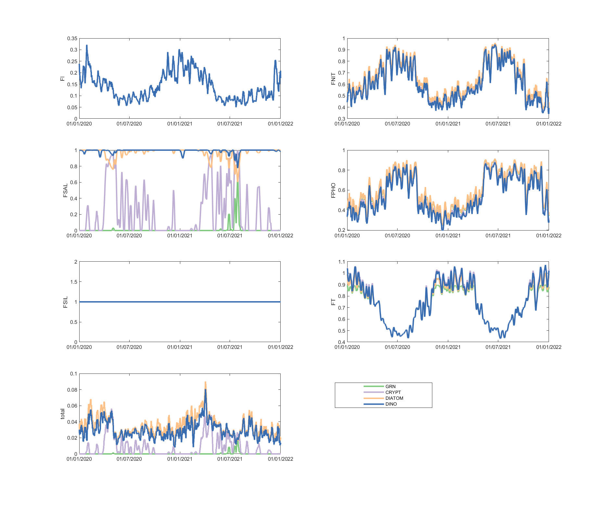

```

</p>
:::

::: {#A4261036 .tabcontent}
<p>

```{r water-lim2, echo = FALSE, out.width='100%', class = "text-image", fig.cap = "Phytoplankton environmental limitation controlling the photosynthesis rate of each phytoplankton group, for site A4261036."}

knitr::include_graphics("images/dev/water/phyto_limitation_allPFTs_movmean_A4261036.png")

```

</p>
:::

::: {#A4261039 .tabcontent}
<p>

```{r water-lim3, echo = FALSE, out.width='100%', class = "text-image", fig.cap = "Phytoplankton environmental limitation controlling the photosynthesis rate of each phytoplankton group, for site A4261039."}

knitr::include_graphics("images/dev/water/phyto_limitation_allPFTs_movmean_A4261039.png")

```

</p>
:::

::: {#A4261134 .tabcontent}
<p>

```{r water-lim4, echo = FALSE, out.width='100%', class = "text-image", fig.cap = "Phytoplankton environmental limitation controlling the photosynthesis rate of each phytoplankton group, for site A4261134."}

knitr::include_graphics("images/dev/water/phyto_limitation_allPFTs_movmean_A4261134.png")

```

</p>
:::

::: {#A4261135 .tabcontent}
<p>

```{r water-lim5, echo = FALSE, out.width='100%', class = "text-image", fig.cap = "Phytoplankton environmental limitation controlling the photosynthesis rate of each phytoplankton group, for site A4261135."}

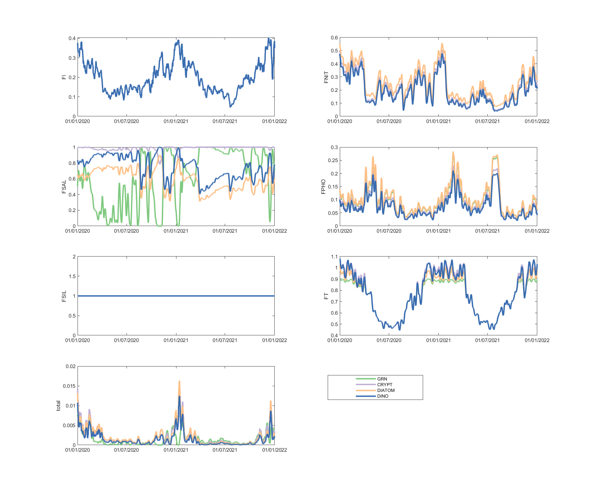

```

</p>
:::

::: {#A4261165 .tabcontent}
<p>

```{r water-lim6, echo = FALSE, out.width='100%', class = "text-image", fig.cap = "Phytoplankton environmental limitation controlling the photosynthesis rate of each phytoplankton group, for site A4261165."}

knitr::include_graphics("images/dev/water/phyto_limitation_allPFTs_movmean_A4261165.png")

```

</p>
:::

::: {#A4261209 .tabcontent}
<p>

```{r water-lim7, echo = FALSE, out.width='100%', class = "text-image", fig.cap = "Phytoplankton environmental limitation controlling the photosynthesis rate of each phytoplankton group, for site A4261209."}

knitr::include_graphics("images/dev/water/phyto_limitation_allPFTs_movmean_A4261209.png")

```

</p>
:::

```{=html}
<script>
function opentab(evt, tabName) {
  var i, tabcontent, tablinks;
  tabcontent = document.getElementsByClassName("tabcontent");
  for (i = 0; i < tabcontent.length; i++) {
    tabcontent[i].style.display = "none";
  }
  tablinks = document.getElementsByClassName("tablinks");
  for (i = 0; i < tablinks.length; i++) {
    tablinks[i].className = tablinks[i].className.replace(" active", "");
  }
  document.getElementById(tabName).style.display = "block";
  evt.currentTarget.className += " active";
}
document.getElementById("defaultOpen").click();
</script>
```
</body>

<!-- -->

## Summary

<!--chapter:end:cdm_water_biogeochemistry.Rmd-->

# Macroalgae
<br>

## Overview

Recent surveys in the Coorong have highlighted the challenge to ecosystem health due to the high biomass and wide extent of filamentous algae, and these 'blooms' have become emblematic of the recent cycle of eutrophication experienced in the lagoon (Figure \@ref(fig:dev-ulva01)). The survey data highlight that the filamentous algae, mainly species from the genus *Ulva*, are tightly associated with the locations where the seagrass *Ruppia* is present, and they flourish in areas with shallow, warm and poorly-mixed water. Late in the season the smothering and deoxygenation caused by the breakdown of large *Ulva* biomass accumulations drives poor water quality. This section describes the approach to simulating macroalgae within the CDM, and development of the model to tailor to the observed data collected within the HCHB research program.   

```{r dev-ulva01, echo = FALSE, out.width='40%', class = "text-image",fig.show='hold',fig.align='center', fig.cap = "Images of filamentous algae bloom conditions within the Coorong South Lagoon, showing the pervasive extent of biomass accumulation. Photo credit: David Paton."}

knitr::include_graphics(c("images/dev/paton1.jpeg","images/dev/paton2.jpeg"))

```

<br>

## Model approach

Within the Coorong, the AED model has previously been set up to predict inorganic and organic nutrients, and chlorophyll-a. Whilst nutrients are not directly required for the *Ruppia* model assessment, the presence of filamentous algal blooms can compete for light and these are linked to bioavailable nutrients within the water column (in addition to other attributes).

### Filamentous algae

We include a filamentous algae variable, $FA$, in the model that is customized to reflect the Ulva community that was been extensively described. For this case we assumed it to be attached to benthic substrate, and is therefore is not subject to advection and mixing, but can slough off under high stress conditions and become a floating variable subject to transport. Evidence from the field suggest the abundance of filaments are tightly linked to the Ruppia shoots, which the algae use to anchor too.

In general, the balance equation describes how the biomass changes over time, according to:

$$
\frac{d\left(FA\right)}{dt}=+f_{\text{uptake}}^{FA}-f_{\text{excr}}^{FA}-f_{\text{mort}}^{FA}-f_{\text{resp}}^{FA}\ -f_{\text{slough}}^{FA}
(\#eq:ulva5)
$$
where the main growth term is resolved as:

$$
\scriptsize{f^{FA}_{\text{uptake}} = \underbrace{R^{FA}_{\text{growth}}}_{\text{max growth} \\ \text{rate at 20$^\circ$C}} \ \ \underbrace{(1-k^{FA}_{\text{pr}})}_{\text{photorespiratory} \\ \text{loss}} \ \ \underbrace{\Phi^{FA}_{\text{tem}}(T)}_{\text{temperature} \\ \text{scaling}} \text{min} \left \{\underbrace{\Phi^{FA}_{\text{light}}(I)}_{\text{light limitation}}, \underbrace{\Phi^{FA}_{\text{N}}(NO_{3},NH_{4})}_{\text{N limitation}}, \underbrace{\Phi^{FA}_{\text{P}}(PO_{4})}_{\text{P limitation}} \right \} [FA]}
(\#eq:ulva6)
$$

An example of the above approach in practice is shown in the below animation. The results highlight, for this time period of interest, the areas where salinity exceeds the threshold and initially limits the productivity, and the shallow areas where light is abundant; along with other environmental drivers (e.g., temperature) these shape the biomass accumulation pattern seen in the top left panel. Animations like this for different periods throughout the year, or between years, can look quite different.

<br>
<center>
<video width="100%" height="100%" controls>
<source src="images/dev/MA2_JAN.mp4" type="video/mp4">
</video>
</center>
<br>


### Macroalgae growth physiology

The original AED macroalgal biomass model previously applied in the Generation 0 and 1 CDM applications, and exemplified in the above example, has been further developed to include  advances to light extinction within the canopy, nutrient cycling and excretion processes, and updates to the parameterisations associated with photosynthesis and biomass accumulation. The latter, in particular, are updated to better align with the experimental work reported in @waycott2019 and recent survey data collected as part of from the HCHB research program.

The algal biomass, $FA$ (or $MAG_C$), is simulated in units of carbon ($mmol\:C/m^2$), and in addition the groups have been configured to have a variable C:N:P ratio. The model therefore tracks the internal cell nutrition and includes dynamic uptake rates of N and P sources simulated in response to changing water column conditions and internal nutrient stress.

The growth rate functions used in Eq \@ref(eq:ulva6) are tailored to use temperature and salinity ranges based on the experimental data reported in @waycott2019.

### Resolving seasonal life-stage dynamics

Following review of the initial data and findings from the T&I project 2, the approach to modelling macroalgae has been revised to better resolve seasonal shifts in form and physiology over the seasonal cycle.

A new ‘colony’ based model for simulating clump emergence, biomass accumulation and sloughing has been conceptualised (Figure \@ref(fig:dev-ulva5)). The model adopts the same underlying physiology as described in the above section, but allows for age/size specific application of these rates to better align with recent observations and monitoring.

```{r dev-ulva5, echo = FALSE, out.width='100%', class = "text-image", fig.cap = "Schematic depicting a new life-stage based macroalgal “clump” model  developed to track seasonal macroalgal biomass development stages and late-stage decay."}

knitr::include_graphics("images/dev/macroalgae_conceptual.png")

```

This approach allows more direct links with a) the experimental data collected on biomass accumulation and photosynthesis rates in the lab, and b) the field data estimates of macroalgae density from photos and aerial imagery at different points through the growth season.

The approach essentially follows a size-class based model for resolving the filamentous algae biomass pool. According to the above conceptual schematic, four discrete life-stage (aka size) categories are included. In general they are fixed in space, but note that 'sloughed' biomass (Stage 4) becomes mobilised after a sloughing 'event', and can continue to be exposed to surface light irradiances and also begin decomposition should environmental conditions be inadequate for growth (e.g., as the water becomes too salty).

The fundamental balance equation shaping growth remains as depicted in Eq \@ref(eq:ulva5) to capture the various processes impacting ulva growth and decay, with the difference that each growth-stage allows for different light, nutrient and salinity sensitivity, and there is a aging component linking the size classes, $R_{aging}$.  A full description of the AED macroalgae model can be referred to the [AED science manual](https://aquaticecodynamics.github.io/aed-science/DO_1.html). 


### Ulva HSI

In addition to the simulation of Ulva biomass, a simple "Habitat Suitability Index" (HSI), termed $Ulva\:HSI$, was also developed to map Ulva growth potential and 'hotspot' locations. The $Ulva\:HSI$ is an index between 0 and 1, and is computed by normalising the expression outlined in Eq \@ref(eq:ulva6). This metric does not account for the accumulation of biomass, or consider processes such as mortality and sloughing or mobilisation, but is a useful metric to look where high growth rates typically occur.


<br>

## Data availability

### Algae extent within the lagoon

Regular monitoring for macroalgae biomass within the Coorong is not routinely undertaken, but a range of data are available over the model calibration and testing periods. A summary of the available algal extent data is summarised in Table \@ref(tab:3-malgtable).

```{r 3-malgtable, echo=FALSE, message=FALSE, warning=FALSE}
library(knitr)
library(kableExtra)
library(readxl)
library(rmarkdown)
theSheet <- read_excel('tables/malgae_data.xlsx', sheet = 1)
theSheet <- theSheet[theSheet$Table == "malgae",]
theSheetGroups <- unique(theSheet$Group)
for(i in seq_along(theSheet$Identifier)){
  if(!is.na(theSheet$Identifier[i])==TRUE){
    theSheet$Identifier[i] <- paste0("**",theSheet$Identifier[i],"**")
  } else {
    theSheet$Identifier[i] <- " "
  }
}
kbl(theSheet[,3:NCOL(theSheet)], caption = "Macroalgae data availability summary", align = "l",escape=F) %>%
  pack_rows(theSheetGroups[1],
            min(which(theSheet$Group == theSheetGroups[1])),
            max(which(theSheet$Group == theSheetGroups[1])),
            background = '#ebebeb') %>%
  pack_rows(theSheetGroups[2],
            min(which(theSheet$Group == theSheetGroups[2])),
            max(which(theSheet$Group == theSheetGroups[2])),
            background = '#ebebeb') %>%
  row_spec(0, background = "#14759e", bold = TRUE, color = "white") %>%
  kable_styling(full_width = F,font_size = 11) %>%
  scroll_box(width = "680px", height = "380px",
             fixed_thead = FALSE)
```

<br>

The locations of the various smaplign campaigns for assessment of *Filamentous Algae* presence and biomass are shown for the historical (pre-HCHB) sampling campaigns (Figure \@ref(fig:dev-ulva10)) and for the more intensive sampling campaigns undertaken within the HCHB research program (Figure \@ref(fig:dev-ulva11)).

<br>
<head>
<meta name="viewport" content="width=device-width, initial-scale=1">
<style>
/* Style the buttons inside the tab */
.tab button {
  background-color: #2481AA;
  float: left;
  width: 49.5%;
  border: none;
  outline: none;
  cursor: pointer;
  padding: 14px 16px;
  transition: 0.3s;
  font-size: 14px;
  color: #FFFFFF;
  font-weight: bold;
}
</style>
</head>
<body>

<div class="tab">
  <button class="tablinks" onclick="opentab(event, 'hchb')"id="defaultOpen">HCHB Monitoring</button>
  <button class="tablinks" onclick="opentab(event, 'hist')">Historical Monitoring</button>
</div>

<div id="hchb" class="tabcontent">
<center>

<br>

**HCHB Monitoring** A summary of the HCHB *Filamentous Algae* monitoring locations are shown below.

```{r dev-ulva11, echo = FALSE, out.width='33%', class = "text-image",fig.show='hold',fig.align='center', fig.cap = "Filamentous algae sampling sites for the HCHB program (T & I 2). Agency/program code under each map corresponds to those listed in Table 6.1. Turquoise outline represents the model boundary. Click image to enlarge."}

knitr::include_graphics(c("images/dev/algaesites_Sep2020.png","images/dev/algaesites_Mar2021.png","images/dev/algaesites_Sep2020.png"))

```

</center>
</div>

<div id="hist" class="tabcontent">
<center>

<br>

**Historical Monitoring** A summary of historical (pre 2020) *Filamentous Algae* monitoring locations are shown below.

```{r dev-ulva10, echo = FALSE, out.width='50%', class = "text-image", fig.show='hold',fig.align='default', fig.cap = "Filamentous Algae sampling sites for monitoring program prior to 2020. Agency/program code under each map corresponds to those listed in Table 6.1. Turquoise outline represents the model boundary. Click image to enlarge."}

knitr::include_graphics("images/dev/algaesites-may2017.png")
knitr::include_graphics("images/dev/algaesites_Dec2016.png")

```

</center>
</div>


<script>
function opentab(evt, tabName) {
  var i, tabcontent, tablinks;
  tabcontent = document.getElementsByClassName("tabcontent");
  for (i = 0; i < tabcontent.length; i++) {
    tabcontent[i].style.display = "none";
  }
  tablinks = document.getElementsByClassName("tablinks");
  for (i = 0; i < tablinks.length; i++) {
    tablinks[i].className = tablinks[i].className.replace(" active", "");
  }
  document.getElementById(tabName).style.display = "block";
  evt.currentTarget.className += " active";
}
document.getElementById("defaultOpen").click();
</script>

</body>

<br>


### Environmental threshold parameter review

In order to set/refine the parameters required for the macroalgae model, such as light, salinity and temperature responses, a review of available experimental data and observations was undertaken. The key information sourced incldued:

- For salinities from 35—90 ppt, an optimum temperature for the *Ulva paradoxa* filamentous green algal community was 30°C, which was the temperature where the relationship between weight gain became the most positive [@waycott2019].<br>
-	At salinities of 30 - 140 ppt, weight change decreased as salinity increases. Salinities of more than 90 ppt were the most significant at reducing filamentous green algal growth rates. At a salinity of 140 ppt the growth of algae is inhibited at all temperatures [@waycott2019].<br>
-	At salinities below 35 g/L, algal communities appear resilient to a wide range of temperatures and nutrient availability [@collier2017 cited in @asano2020].

<br>

## Model setup

Four pools were configured to simulate the biomass of filamentous algae, $ulva_a$, $ulva_b$, $ulva_c$ and $ulva_s$. The parameters used in the setup are outlined in Table (Table \@ref(tab:6-malgpars)). 

```{r 6-malgpars, echo=FALSE, message=FALSE, warning=FALSE}
library(knitr)
library(kableExtra)
library(readxl)
library(rmarkdown)

# function to fix floating point decimals
# df = dataframe to fix
# colNames = list() of colummns to fix
fixDecimals <- function(df, colNames){
  for(i in colNames){
    for(ii in 1:NROW(df[,i])){
      currentVal <- df[ii,i]
      currentVal <- as.numeric(currentVal)
      if(!is.na(currentVal)==TRUE){
        newVal <- as.character(currentVal)
        df[ii,i] <- newVal
      } 
    }
  }
  return(df)
}

theSheet <- read_excel('tables/macroalgae_parameters.xlsx', sheet = 1)
theSheet <- fixDecimals(
  df = theSheet, 
  colNames = list("Parameter1","Parameter2","Parameter3","Parameter4")
  )
theSheet <- theSheet[theSheet$Table == "Parameter",]
theSheetGroups <- unique(theSheet$Group)

for(i in seq_along(theSheet$Parameter)){
  if(!is.na(theSheet$Parameter[i])==TRUE){
    theSheet$Parameter[i] <- paste0("$$",theSheet$Parameter[i],"$$")
  } else {
    theSheet$Parameter[i] <- NA
  }
}
for(i in seq_along(theSheet$Unit)){
  if(!is.na(theSheet$Unit[i])==TRUE){
    theSheet$Unit[i] <- paste0("$$\\small{",theSheet$Unit[i],"}$$")
  } else {
    theSheet$Unit[i] <- NA
  }
}

kbl(theSheet[,3:NCOL(theSheet)], caption = "Macralgae (Ulva) parameter summary", align = "l",) %>%
  pack_rows(theSheetGroups[1],
            min(which(theSheet$Group == theSheetGroups[1])),
            max(which(theSheet$Group == theSheetGroups[1])),
            background = '#ebebeb') %>%
  pack_rows(theSheetGroups[2],
            min(which(theSheet$Group == theSheetGroups[2])),
            max(which(theSheet$Group == theSheetGroups[2])),
            background = '#ebebeb') %>%
  pack_rows(theSheetGroups[3],
					  min(which(theSheet$Group == theSheetGroups[3])),
					  max(which(theSheet$Group == theSheetGroups[3])),
					  background = '#ebebeb') %>%
  pack_rows(theSheetGroups[4],
          	min(which(theSheet$Group == theSheetGroups[4])),
          	max(which(theSheet$Group == theSheetGroups[4])),
          	background = '#ebebeb') %>%
  pack_rows(theSheetGroups[5],
            min(which(theSheet$Group == theSheetGroups[5])),
            max(which(theSheet$Group == theSheetGroups[5])),
            background = '#ebebeb') %>%
  pack_rows(theSheetGroups[6],
            min(which(theSheet$Group == theSheetGroups[6])),
            max(which(theSheet$Group == theSheetGroups[6])),
            background = '#ebebeb') %>%
  pack_rows(theSheetGroups[7],
            min(which(theSheet$Group == theSheetGroups[7])),
            max(which(theSheet$Group == theSheetGroups[7])),
            background = '#ebebeb') %>%

row_spec(0, background = "#14759e", bold = TRUE, color = "white") %>%
  kable_styling(full_width = F,font_size = 10) %>%
  column_spec(2, width_min = "10em") %>%
  column_spec(3, width_max = "19em") %>%
  column_spec(4, width_min = "5em") %>%
  column_spec(5, width_min = "5em") %>%
  column_spec(6, width_min = "5em") %>%
  column_spec(7, width_min = "5em") %>%
    scroll_box(width = "700px", height = "3400px",
             fixed_thead = FALSE)
```

<br>

The total biomass of $FA$, in comparable units to the field data ($g\text{ dry weight}/m^2$), is termed $TMALG$ and computed as the sum of the attached and floating components:

$$
TMALG = \left[\underbrace{\sum_i^{\text{a,b,c}} \left( ulva_{i} \right)}_{\text{attached}} + \underbrace{ulva_{s}\:\Delta z}_{\text{floating}} \right] \: \chi_{c:dw} \: \times 10^{-3}
(\#eq:ulva7)
$$
where $\chi_{c:dw}$ is the dry weight per carbon ratio. $TMALG$ is used to assess against the algal densities reported in the field, thus assuming the reported algal densities from the transects are the combined amount of attached and detached material.

<br>

## Validation and assessment

### Generation 0

Using the Generation 0 model, the following assessment against Ulva biomass prediction and data showing presence/absence was recorded (Figure \@ref(fig:dev-ulva12)). The simulated biomass reasonably correlated with the presence/absence data record in 2016 in particular, but included several false positives in 2017 in the South Lagoon. Whilst biomass data wasn't recorded in the survey data for these time periods, the simulated biomass concentrations have retrospectively been seen to be systematically under predicting the typical biomass levels seen in the HCHB field surveys.

```{r dev-ulva12, echo = FALSE, out.width='45%', class = "text-image",fig.show='hold',fig.align='center', fig.cap = "Comparison of observed and simulated Ulva for 2016 (left) and 2017 (right)."}

knitr::include_graphics(c("images/dev/AlgaeDec2016vsULVAbiomass2016.png","images/dev/AlgaeMay2017vsUlvaBiomass2016.png"))

```

Nonetheless, the modelled $Ulva\:HSI$ prediction correlated well with the observed filamentous algae abundance categories (Figure \@ref(fig:dev-ulva13)). This implies the growth controls (as embodied in the HSI) are well resolved, but the seasonal factors leading to biomass accumulation were more complicated, thus justifying the further refinements outlined in Section 6.3. The HSI range was however quite restricted and not as sensitive suggesting the normalisation could be improved.  


```{r dev-ulva13, echo = FALSE, out.width='100%', class = "text-image",fig.align='center', fig.cap = "Filamentous algae observed density and equivalent model predicted Ulva HSI (top) and Ulva Biomass (bottom)."}

knitr::include_graphics("images/dev/Algae_2016.png")

```

### Generation 2

Following further refinement of the general water quality model calibration (as outlined in Chapters 4-5), and the macroalgae model developments (Section 6.3), the Generation 2 model was run over the period from 2020-2021, inclusive, and the results were compared with in-depth HCHB survey data collected during several surveys undertaken within the period (see Figure \@ref(fig:dev-ulva11)).   

The model results are shown in  Figure \@ref(fig:dev-ulva14) - \@ref(fig:dev-ulva15) for the 2020 dataset, and Figure \@ref(fig:dev-ulva16) - \@ref(fig:dev-ulva17) for the 2021 dataset.

The simulated biomass in this version is higher that earlier versions, around 100-200 gDW/m2 in the main zones. This is lower than some of the peak biomass densities recorded in the field. This, however, was deemed to be acceptable as the model is predicting the average biomass across broad areas in the simulated mesh, whereas the observed data shows patchy densities with areas of high and low densities, with the higher biomass recorded in the shallow areas near the shore.

 
```{r dev-ulva14, echo = FALSE, out.width='100%', class = "text-image", fig.align='center', fig.cap = "Comparison of Observed and Simulated Ulva biomass (g DW/m2) for 2020."}

knitr::include_graphics("images/dev/algae_biomass_2020_map.png")
```

```{r dev-ulva15, echo = FALSE, out.width='100%', class = "text-image",fig.align='center', fig.cap = "Scatter and box plot of field estimated macroalgae biomass versus simulated Ulva biomass for 2020 in the entire lagoon (top panel: red - north lagoon sites; blue - south lagoon sites) and south lagoon (bottom panel)."}

knitr::include_graphics("images/dev/algae_biomass_2020.png")

```

```{r dev-ulva16, echo = FALSE, out.width='100%', class = "text-image",fig.align='center', fig.cap = "Comparison of Observed and Simulated Ulva biomass (g DW/m2) for 2021."}

knitr::include_graphics("images/dev/algae_biomass_2021_map.png")
```

```{r dev-ulva17, echo = FALSE, out.width='100%', class = "text-image",fig.align='center', fig.cap = "Scatter and box plot of field estimated macroalgae biomass versus simulated Ulva biomass for 2021 in the entire lagoon (top panel: red - north lagoon sites; blue - south lagoon sites) and south lagoon (bottom panel). "}

knitr::include_graphics("images/dev/algae_biomass_2021.png")
```

Comparison of zone averaged modelled and observed data in 2020 - 2021 is shown in Figure \@ref(fig:dev-ulva18).The model did capture accurately that several zones should have no or low biomass, the zones indicated by zeros in Figure \@ref(fig:dev-ulva18). The model recorded zone-averaged biomass accumulating in some zones where observed biomass was lower (e.g. zone 31,33). Therefore, the model isn't capturing the spatial gradient as seen in the field data.


```{r dev-ulva18, echo = FALSE, out.width='60%', class = "text-image",fig.align='center', fig.cap = "Scatter plot of field estimated macroalgae biomass versus simulated Ulva biomass for 2020 - 2021 averaged by zones in the lagoon. Labels indicate zone number (see Figure 2.5 for details)."}

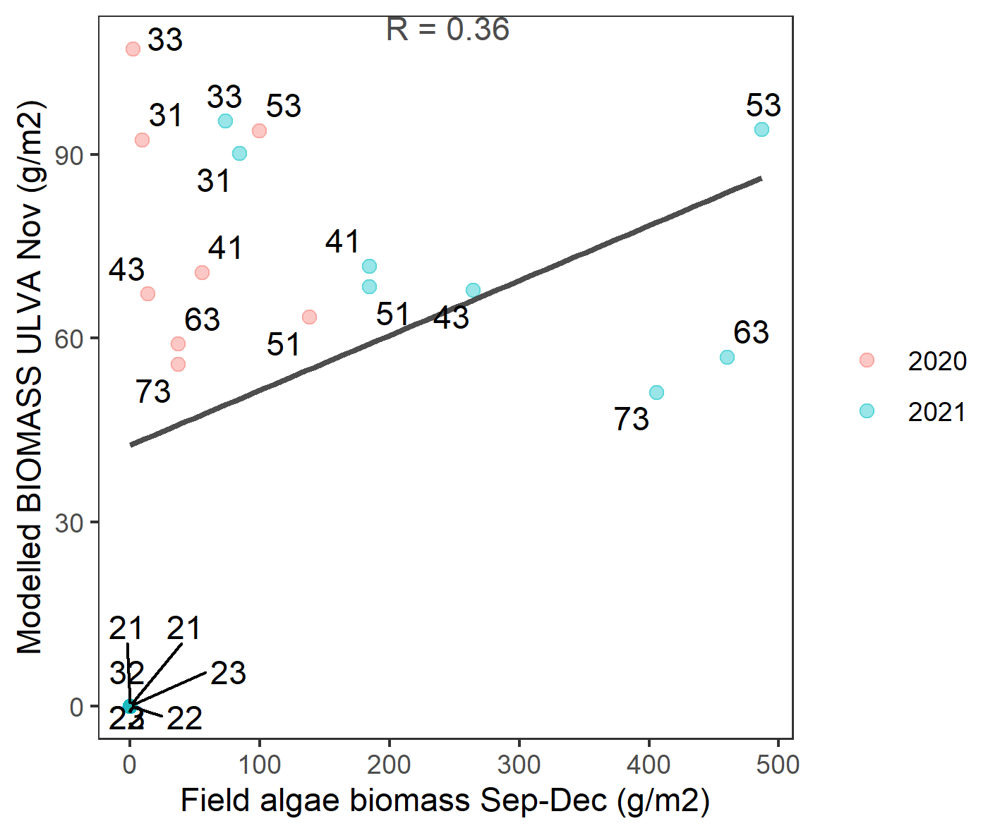
```

<br>

Closer inspection of the controls on growth are highlighted in the animation below. 


<br>
<center>
<video width="100%" height="100%" controls>
<source src="images/lagoon_habitat/ULVA_6_Panel.mp4" type="video/mp4">
</video>
</center>
<br>


## Summary 

The macroalgae model in AED has been able to capture the broad spatial patterns in environmental drivers that control the drivers and biomass of the *Ulva* community. Comparison of the Generation 0 model with the pre-HCHB survey data provided insights to the suitability of the model approach, and demonstrated the growth drivers (as captured via the $Ulva\:HSI$) correlated well with the early (albeit patchy) observations of biomass occurrence. This has been further refined in the Generation 1, 1.5 and 2.0 model simulations to ultimately allow simulation of the spatial extent of filamentous algal biomass accumulation. 

The Generation 2 model showed mixed accuracy against the more comprehensive dataset from 2021 and 2022 with a more notable number of false positives - areas where biomass was predicted to occur but was not observed in the field. This is recommended as an area for further investigation and may benefit from further data on  benthic substrates that can be used to constrain where it is able to attach and grow.


<!--chapter:end:cdm_macroalgae.Rmd-->

# Sediment Biogeochemistry

## Overview

This section outlines the examination of the Coorong sediment environment and the simulation of its key processes using CANDI-AED. This section consists of the theory, a summary of relevant Coorong data, how the theory is implemented in CANDI-AED, a standalone sediment simulation and a coupled sediment-water simulation. 

## Background

### Organic matter – background
#### Organic matter pools and pathways
Organic matter drives most of the biogeochemical reactions in the sediment. It acts as a source of reduced carbon for bacteria to metabolise, producing oxidised carbon, $CO_2$. Oxidised organic matter also releases N and P to the environment. As sediment bacteria oxidise organic matter, they consume $O_2$, $NO_3^-$, $MnO_2$, $Fe(OH)_3$ and $SO_4^{2-}$. These processes have implications for the rest of the biogeochemistry: animals are deprived of $O_2$, $NO_3^-$ is ultimately removed from the system as $N_2$, $PO_4^{3-}$ bound to iron minerals is released, toxic $H_2S$ is produced and greenhouse gases $N_2O$ and $CH_4$ are released. 

Although organic matter is fundamental, it does not exist as one clearly defined chemical species. It is present in dissolved and particulate forms, and with different degrees of reactivity. It is composed of recognisable components such as carbohydrates, lipids and proteins and the bacterial metabolism of organic matter is often calculated by considering the consumption of simple molecules such as glucose, acetate or a representative $CH_2O$ polymer. However, it can also be composed of irregular refractory components such as lignin, humic acids or polymerised and aromatic hydrocarbons. The origin of organic matter can be sources such as bacterial biomass, algal detritus, aquatic plants, terrestrial plants and stored sediment organic matter. 

This complexity is treated differently in each model, however, a common method in sediment models is the ‘multi-G’ approach, where the organic matter is assigned two or three classes of reactivity, for example, labile, refractory and very refractory. 

Although these descriptions apply generally, it is difficult to describe the organic matter of any particular study site with any precision. Field measurements are typically in the form of the mass of total organic carbon per mass of sediment. The characteristics of the organic matter are inferred from the reaction by-products such as $NH_4^+$ and Fe2+ concentration. 
In the Coorong, observations show a large pool of accumulated organic matter in the sediment. Observational studies have suggested that the Coorong organic matter is largely derived from algal detritus. NMR analysis shows functional groups that are present in algae, rather than plants washed in from the catchment. It is not known why the algal detritus was not consumed by sediment bacteria. 

### Iron and sulfur – background
#### Iron and sulfate reduction redox processes
Iron reduction and sulfate reduction are anaerobic processes that break down organic matter and produce $Fe^{2+}$ and $∑H_2S$ as reaction by-products. These processes occur deeper in the sediment where $O_2$, $NO_3^-$ and $MnO_2$ have already been consumed, and sulfate reduction occurs where $Fe(OH)_3$ has been consumed. The by-products of these two reactions react with each other to form solid $FeS$. 
 
 
 
Figure 1 Schematic of the iron and sulfate reduction parts of the organic matter oxidation reactions. When both reactions occur, the reduced by-products combine to form FeS.

Antler et al. (2019) described a ‘bistable’ system of salt marshes being either iron rich or sulphide rich. The iron rich sediments were characterised by macrofauna mixing, aerobic oxidation and iron reduction. The sulphide rich sediments were characterised by less mixing, sulfate reduction and methanogenesis. The possible switch between the two states was suggested to be dependent on the local iron concentration. Where both iron and sulfate reduction of organic matter occur, the production of $FeS$ pulls the $H_2S$ out of the system, preventing toxicity for the macrofauna and maintaining mixing. If the iron to sulphur ratio were lower than a certain threshold, then through positive feedbacks, the system could be pushed towards a sulphide rich state. 

 
Figure 2 Left – in a system with high concentrations of oxidised iron minerals, iron reduction inhibits sulfate reduction. Right – in a system with less iron, sulfate reduction dominates and $H2S$ is produced.

#### Sulphide toxicity

The Coorong may have a similar bistable state controlled by salinity as well as iron. The mechanism may be related to either the salinity itself, as described in the section below on salinity, or it may be related to the $SO_4^{2-}$ that is coincident with salinity. $H_2S$ being toxic to macrofauna may cause the lack of mixing and bring about the anoxic state of the sediment, although examples can be found where the animals are tolerant of $H_2S$. Volkenborn et al. (2007) found that concentrations of 0.1 mmol  L^-1^ $H_2S$ were toxic to macrofauna. Fuller et al. (1994) showed that polychaete worms could tolerate 3.8 mmol  L^-1^ $H_2S$. Shumway et al. (1983) found that clams could survive with $H_2S$ at 2.68 mmol  L^-1^, but were less tolerant of anoxia when $H_2S$ was present. Hargraves et al. (2008) suggested that benthic macrofauna communities may change their composition as sediments become sulfidic, with increasing biomass of species that are tolerant of sulfidic sediment, but lower total biomass of all macrofauna. A review by Hargraves et al. (2008) considered a range of benthic $∑H_2S$, $O_2$ and macrofauna and suggested that the transition from healthy to unhealthy sediments occurred at $H_2S$ concentration between 0.75 and 1.5 mmol L^-1^. These observational studies suggest a likely mechanistic link between the concentration of $H_2S$, mixing and anoxic sediment, though the exact concentrations are hard to pinpoint.

#### Iron and sulfur phases in sediments
Examining the interactions between iron- and sulfur-dominated states requires an estimate of both iron and sulfur species and minerals in the sediment. The variables used in sediment models are rarely measured directly in the environment, and the assumptions made in the model for iron compounds are also dependent on the assumptions for sulfur compounds. Sulfur was measured as acid volatile sulfur (AVS) and chromium reducible sulfur (CRS).

It is assumed that the concentration of AVS corresponds to the amount of FeS. An argument has been presented by Rickard and Morse (2005) that measured AVS is not necessarily a good proxy for FeS, because of differences in what is being measured at study sites. The AVS may not correspond to all of the sulphide in the sediment, it may correspond to different metal sulphide species and it may be partly organic sulphur compounds. The rapid assessments in the Coorong showed that there was a sulphurous black ooze in many of the sediment samples and so the presence of an organic sulphur compound mixed with metal sulphur compounds is possible. Several responses to Rickard and Morse’s paper were published in the same issue, including one from Meysman and Middelburg, which presented the issue from the point of view of sediment diagenesis modellers. Meysman and Middelburg’s perspective on modelling reflected the model used for this project well. They wrote that although Rickard and Morse’s explanation is thorough and precise, it is not necessarily helpful for modellers, who cannot include all chemical species in their models, especially if there is not measured data for calibration. Considering this argument, and the need for general measured concentrations that we can use in the model, we assume that the AVS measurement is an adequate proxy for $FeS$. 

The concentration of $FeS_2$ is calculated as the difference between CRS and AVS. The remaining iron minerals are calculated as the difference between total iron and CRS. Iron minerals are an unknown combination of redox-active Fe(OH)3A, redox-stable Fe(OH)3B and siderite, FeCO3. The literature provides some clues as to the distribution of these species but no definite concentrations. 

The modelling study of Van Cappellen and Wang (1996), based in a marine environment, had a surface peak concentration of Fe(OH)3A of around 35 mmol L^-1^ solids, and $FeCO_3$ of 25 mmol L^-1^ solids. A study by Canfield et al. (1989) measured $Fe(OH)_{3A}$ and $Fe(OH)_{3B}$ at roughly equal concentrations. Thamdrup et al (1994) measured Fe(OH)3A at around 10 to 20% of total iron in the top 4 cm and ‘residual Fe’ at around 70% of total iron, which was constant for approximately the whole depth. $Fe(OH)_{3A}$ was also around 20 to 40 mmol  L^-1^ in five samples, which was consistent with the measurement from Van Cappellen and Wang (1996).

### Nitrogen – background
#### Nitrogen redox pathways
Nitrogen redox processes are important in this context because they control whether bioavailable forms of N, such as $NO_3^-$, are recycled in the ecosystem or removed from the system as $N_2$ gas. The simplest conceptual model of nitrogen redox has $NH_4^+$ oxidised by $O_2$ to $NO_3^-$, and $NO_3^-$ reduced with organic matter to $N_2$. A more sophisticated conceptual model includes the N species $NO_2^-$ and $N_2O$, which allows more reaction processes of DNRA, denitrousation and deammonification (also known as anammox). The full explanation can be found in aed-science [chapter 14.3](https://aquaticecodynamics.github.io/aed-science/sediment-biogeochemistry.html#model-description-8) for organic matter reactions, and [chapter 6.4.2.1](https://aquaticecodynamics.github.io/aed-science/inorganic-nitrogen.html#model-description---adding-n2o-reactions) for inorganic reactions.
 
 
 
 
Figure 3 Schematic of the nitrogen redox model commonly used in sediment biogeochemical models. 

 
 
 
 
 
Figure 4 Schematic of the nitrogen redox reactions used in this sediment model. Brown pathways are the oxidation of organic matter by nitrogen species; red pathways are oxidation of nitrogen species by oxygen; the blue pathway is the oxidation of one nitrogen species by another.

Two processes create $N_2O$: nitrousation, from the oxidation of $NH_4^+$; and nitrous denitritation, from the reduction of $NO_2^-$. Tallec et al (2008) showed that nitrous denitritation produced more $N_2O$ than nitrousation. The peak of nitrous denitritation occurred at $O_2$ concentration of 0.01 mmol  L^-1^. 

There is a tight range of $O_2$ concentration in which these nitrogen redox reactions can take place. At high $O_2$ concentration, organic matter oxidation by N species is inhibited and so $NO_2^-$ and $N_2O$ accumulate. According to some literature observations, at zero $O_2$ concentration, denitrousation is the energetically favoured process, rather than denitritation. At around 200 nmol  L^-1^ $O_2$, denitritation is less inhibited by $O_2$ and $NO_2^-$ is converted to $NH_4^+$ and $N_2O$ . Above 200 nmol  L^-1^ denitrousation is inhibited and $N_2O$ accumulates. 

The $N_2O$ production rate has been measured at 626 mmol  L^-1^  y^-1^ (Su et al ), 9 mmol L^-1^  y^-1^ (Jiang et al), 175 mmol  L^-1^  y^-1^ (Tan et al ) and 88 mmol  L^-1^  y^-1^ (Hernandez-del-Amo et al ). 

### Salinity – background 
####Salinity and benthic fauna
High salinity does not favour benthic macrofauna and the processes they create, bioturbation and bioirrigation. Bioturbation is the mixing of solids and solutes by small animals as they move in the upper layers of the sediment; bioirrigation is the transport of solutes between the sediment-water interface and the bottom of a burrow. One of the effects of these processes is to increase the concentration of oxygen in the upper layers of the sediment, and so, conversely, a lack of these processes creates an anaerobic environment closer to the sediment-water interface. These processes are captured in the sediment model, as described in the implementation section below, and in the aed-science manual, chapter 14.3. 
Benthic macrofauna have been described as ‘ecosystem engineers’, in which they maintain the sediment conditions within a range favourable to their own survival (T&I 1.3.2). Beyond a certain point they cannot maintain their own favourable conditions. If they can help bury nutrients deep in the sediment rather than release them to the water column, they can prevent eutrophication and thus prevent oxygen depletion. However, at high salinity, it becomes difficult for benthic macrofauna to survive.

#### Salinity and $SO_4^{2-}$ concentration 
Seawater has a consistent concentration of $SO_4^{2-}$, in mmol L^-1^, of approximately 0.9 × salinity, in PSU. Hypersaline water is produced by evapoconcentration of the salt in seawater, and so in principle it should have a correspondingly high concentration of $SO_4^{2-}$. This calculation may be imprecise because $SO_4^{2-}$ is removed through sulfate reduction, whereas salt only accumulates. However, it provides a first-order approximation. 

#### Salinity and nitrogen redox – theoretical background
Some evidence suggests that the hypersaline environment causes lower rates of denitrification. The cause is not clear, but it may be either because the salt has a direct effect on denitrifying bacterial cells, or it may be because of broader environmental effects on the benthic macrofauna. Hypersaline water does impose an energetic cost on cellular systems (Isaji et al., 2019). However, despite the cost, cells can still live in hypersaline environments. 

The process of nitrification has been shown to be inhibited by hypersaline conditions. In some cases, there is a time lag from the onset of hypersaline conditions, for example, a 20-day lag for the growth of ammonium oxidising bacteria (Helder and DeVries 1983). Santoro and Enrich-Prast (2015) found a negative exponential correlation between nitrification rates and salinity between 0 and 30‰. The maximum nitrification rate was 120 nml $NO_3^-$ cm^-3^ h^-1^. Cui et al. (2016) observed that high salinity did not change which ammonia-oxidising bacteria species were dominant, but it did inhibit their activity and abundance. The effect of inhibited nitrification is ultimately less denitrification: in the theoretical redox equilibrium, the nitrogen remains in the $NH_4^+$ phase rather than being nitrified to $NO_3^-$ and reduced to N2. This phenomenon has been observed in algal mats by Isaji et al. (2019). Benthic algae has been observed to correlate positively with nitrification rates (Lorenzen et al. 1998; Risgaard et al. 1999; An and Joye, 2001; Travieso et al. 2006).

### Observed data and characteristics in the Coorong
#### Salinity – Coorong observations
Salinity in the Coorong has been observed to range from as low as around 20 PSU in the north (where freshwater from the lake mixes with marine water) to around 80 in the south (where the salt from the marine water has evapoconcentrated). The whole southern lagoon is more saline and has at least around 60 PSU.

#### Iron and sulfur – Coorong observations
##### Sediment iron
Coorong grab samples had been analysed as total iron, measured in mg Fe / kg dry sediment solid. For reference with the other variables in the model, raw Coorong iron measurements were converted to the unit of mmol L^-1^. Grab samples averaged around 6500 mg kg^-1^ and ranged from 700 to 23 000 mg kg^-1^. Each grab was converted using the % moisture measured at that site, which ranged widely from 18% to 81%. The final values ranged from 5 to 158 mmol L^-1^ sediment: this wide range in final values was determined mostly because of the % moisture measurements. The average measurement was 45 mmol L^-1^, which was in line with literature values (35 mmol L^-1^ in Van Cappellen and Wang).

##### Water column iron
Total iron data was also available from the water column sampling to use as a boundary at the sediment water interface. Data was available for total iron and dissolved iron (mg L^-1^), at 16 sites along the whole Coorong, for the time period 1998 to 2012. The dissolved iron was typically less than 1% of the total iron. Both were converted to mmol L^-1^ and averaged over the entire time period at each site. The total iron was assumed to be particulate iron and it was converted from mmol L^-1^ to a flux in mmol m-2 y^-1^ by multiplying the concentration by the deposition rate of 1 cm y^-1^. Iron fluxes ranged from 0.0042 to 0.0109 mmol L^-1^. These fluxes were much lower than literature values used in sediment models, for example, 750 mmol m-2 y^-1^ in Van Cappellen and Wang (1996). Reconciling these differences depends on the settling rate of the iron mineral particles, which is unknown. 

##### Water column $SO_4^{2-}$
Water column $SO_4^{2-}$ data was available from measurements at 16 sites along the length of the Coorong, for the time period 1998 to 2005. When these measurements were converted from mg L^-1^ to mmol L^-1^ and averaged over time, they corresponded well with the theoretical rule mentioned above, where $SO_4^{2-}$ (mmol L^-1^) is equal to 0.9 × salinity (PSU).

##### Sediment sulfides
AVS was converted from units of ‘% S WW’, which was assumed to be kg S (100 kg wet sediment)-1, to mmol S (L total volume)-1, using porosity at each grab site. (A sample of 0.025 % S WW converted to 3.7 mmol S L^-1^, where the porosity was 0.66). The average of the AVS grabs was 3.36 mmol L^-1^, the minimum value 0.26 and maximum 7.21 mmol L^-1^.The AVS concentrations in the grab samples mostly corresponded with the values in the rapid assessments, with high concentrations usually in the deep channel and in zones 4, 5 and 6.The AVS concentrations were compared to the total iron concentrations from the grab samples. The average total iron was 7.69 mmol L^-1^ total sediment, which implies roughly two Fe for each S on average over the lagoon. Each site did not have a clear correlation between S and Fe.

##### Sediment $∑H2S$ cores
Depth profiles of $∑H2S$ were taken at two sites in November 2020 and three sites in February 2021. The profiles were measured after either a dark or light incubation, to see the difference in oxic state. Concentrations peaked at around 0.1 mmol L^-1^ and the peak was around 5 cm deep.

##### Sediment $Fe^{2+}$ cores
$Fe^{2+}$ was measured in cores taken from five locations, in November 2020 and February 2021. The highest concentrations were at Parnka Point and Policeman’s Point in November 2020. These were not sites that had very high TOC or nutrients. 

#### Nitrogen – Coorong observations
##### Grab sample and core measurements
TN was measured in grab samples in units of N%, ranging from 0.04 to 0.78%. This was converted to mmol L^-1^ using each grab sample’s porosity and an assumed density of 2.7 g cm-3. This resulted in a concentration between 0.0063 and 0.0176 mmol L^-1^ of total volume. 
 $NH_4^+$ measurements in the core samples were around 0.1 mmol L^-1^ porewater, increasing with depth. This concentration was similar to that in Van Cappellen and Wang (1996). 
 
##### Water column model results at the sediment boundary
$NO_3^-$ and  $NH_4^+$ concentrations were measured in the water column and a separate water column model was calibrated to match these concentrations. The average water column concentration of each was 1.5 × 10^-5^ mmol NO3- L^-1^ and 6.0 × 10 -5 mmol $NH_4^+$ L^-1^. Organic N flux was calculated in the water column model at around 250 mmol m-2 y^-1^ for detritus (PONR) and 300 mmol m-2 y^-1^ for algae (PONS). This indicated that most of the N was held in the organic pools.

##### TN and TP budget estimates
The T&I report 1.2.2 Nutrient Dynamics contained an estimate of nutrient budgets in the sediment of the Coorong. The mass of TN was estimated at 25506 tonnes for the South Lagoon and 9377 tonnes for the North Lagoon. The mass of TP was 2204 tonnes for the South Lagoon and 924 tonnes for the North Lagoon. To meet this budget, the concentration of TN was calculated at around 50 mmol L^-1^, which was four orders of magnitude higher than indicated by the TN% measurements. 

##### Nitrogen and salinity 
Observations of denitrification correspond to the theory and literature observations described above. The T&I report 1.3.2 Nutrient Cycling showed a statistical relationship between salinity and the genes present in denitrifying bacteria, indicating that denitrification was occurring at a low rate in hypersaline areas. The Coorong has very low concentrations of NO3-, which suggests that nitrification may be inhibited by the high salinity. However, the  $NH_4^+$ concentrations are also low, and organic nitrogen is high. Therefore the problem is not with the lack of nitrification so much as the binding of the N in algal biomass.

#### Organic matter– Coorong observations
The grab samples had TOC% measured between 0.1 and 6.6 %C, averaging 2.7%. This was converted to mmol L^-1^ using porosity measurements and an assumed density of 2.7 g cm-3 to reach concentrations of 0.5 to 104 mmol L^-1^, averaging 34. The wide variation in TOC mmol L^-1^ was a result of the wide range of porosity measurements. The RAPID assessments had many examples of black ooze, which suggested high concentrations of organic carbon. The large TN budget suggested a likely high concentration of organic carbon. The organic carbon concentration may be six or more times greater than the organic nitrogen concentration. 


## Model approach: CANDI-AED

The heart of this model is a reaction, diffusion, advection model termed CANDI-AED. For details of the CANDI-AED model and scientific description, please refer to the AED Manual [here](https://aquaticecodynamics.github.io/aed-science/sediment-biogeochemistry.html).

The model approach is broadly used in lakes, ocean and estuarine environments, but there remain few cases in shallow lagoons [@paraska2014]. 

### Model developments made during the Coorong project
Several developments have been undertaken to adapt the CANDI_AED vertical column model to the Coorong application:

-  Improved parameterisation of diffusion at the sediment-water interface, based on $\tau_b$.
-  Inclusion of functionality to resolve resuspension effects
-  Addition of MPB and macrophyte roots $O_2$ sources into the sediment
-  Dynamic bioturbation rates linked to salinity and $H_2S$ concentrations
-  Bioturbation rates linked to salinity and $H_2S$ concentrations
-  Bioturbation rates linked to salinity and $H_2S$ concentrations
-  $NH_4^+$, $PO_4^{3-}$ and $DOM$ adsorption
-  Allocation of a an unreactive organic matter pool

In addition, to the physical and chemical process updates described above, the $SDG$ module was further developed to support multi-zone operation of the CANDI-AED model, dynamic links with MPB, MAG and MAC modules, and the ability to allow for spin-up of sediment profiles.


## Methods

### Implementation of theory and Coorong observations in the sediment model setup

#### Salinity – implementation on mixing and nitrogen redox
Two functions to connect salinity to mixing and nitrogen reactions were developed for the sediment model during this project: $F_{Sal}$ and $F_{Sul}$. The full explanation for these can also be found in the aed-science manual, chapter 14.3. The $F_{Sal}$ function decreases from 1 to 0 as salinity increases, with two parameters for salinity concentrations that set the range over which the function works (35 and 70 PSU). The $F_{Sul}$ function decreases from 1 to 0 as $H_2S$ increases, which occurs as organic matter undergoes sulphate reduction. These two functions were applied to both macrofauna mixing processes, by multiplying the process rate by the value between 0 and 1. $F_{Sal}$ was also applied to all nitrogen redox reactions. Therefore, as salinity increased, and as $SO_4^{2-}$ increased and indirectly created H2S, mixing and nitrogen redox were all reduced. $F_{Sal}$ was applied to the nitrogen redox reactions, but not the hydrolysis breakdown pathways that generated NH4+ (Figure 5).
 
Figure 5 Schematic of the nitrogen breakdown pathways from PONR to N2. PONL was not included in this diagram in order to simplify it, and because PONR was the major PON pool. The salinity inhibition factor, $F_{Sal}$, was applied to those processes where $F_{Sal}$ is beside the arrow.
Iron and sulfur – implementation
The influx of redox active Fe(OH)3A was set to 80 mmol m-2 y-1, and a range of boundary fluxes were tested alongside different organic matter influxes. SO42- concentration was set in proportion to salinity, as described in the section above.
The iron and sulfur cycles function as described in the aed-science manual. In brief, Fe(OH)3A reacts with organic matter to produce Fe2+ and its presence inhibits sulfate reduction. SO42- reacts with organic matter to produce H2S. The by-products Fe2+ and H2S react together to form FeS. 
Simulations were run with the parameter rxn_mode set to each option, 0 to 4, to test the effect of each option. The options are outlined in the aed-science manual. In brief, with options 0 and 1, FeS does not precipitate; with option 2 FeS precipitates at a constant kinetic rate; with options 3 and 4 FeS precipitates in proportion to the concentrations of the reactants and products already present. Options 2, 3 and 4 often created numerical instability problems. 
Organic matter– implementation
The sediment model has several organic matter models available to it, as outlined in the aed-science manual. This simulation used OMModel set to 2, which has separate state variables for each of dissolved or particulate, and refractory or labile organic C, N and P – 12 variables. An additional three variables were developed for this project, POCS, PONS and POPS, which were representative of the algal deposition from the water column – 15 variables in total. The boundary fluxes were set to average results from outputs from the water column model. Labile phases were set to be 10% of the value of the refractory variable. This simulation used the advanced nitrogen redox model shown above in Figure 4. 


### Coupled model methods

#### Resolving sediment zonation {.unnumbered}

The model was developed to allow the use of multiple independent sediment zones across the domain, which are identical to the above CANDI-AED description but are not necessarily coincident with the grid-structure of the water. This way sediment zones may be defined for the domain, and depending on the nature of the grid, the water cells above the sediment are averaged for the purposes of the interfacial fluxes, allowing more efficient simulations (see for example Figure \@ref(fig:dev-pics3). Using zones is a practical compromise between using fewer sediment calculations (for computational efficiency) and more calculations (for capturing spatial heterogeneity in sediment properties and their fluxes).

```{r dev-pics3, echo = FALSE, out.width='100%', class = "text-image", fig.cap = "Schematic depicting sediment zone numerical approach."}

knitr::include_graphics("images/dev/sed_picture5.png")

```

#### Sediment-water coupling {.unnumbered}

The sediment and hydrodynamic models are coupled at the sediment-water interface (Figure \@ref(fig:dev-pics5)). The AED model setup has three separate functions for coupling the bottom-most cell of the TUFLOW-FV hydrodynamic model to the top-most layer of the sediment model:

-  flux of solid material onto the sediment surface from the water column: *part_sed_link*
-  concentration of dissolved substances in the bottom water to the sediment: *water_link*
-  flux of dissolved substances from the top sediment layer to the water column: *diss_flux_link*

```{r dev-pics5, echo = FALSE, out.width=c('45%','45%'), class = "text-image",fig.show='hold',fig.align='center', fig.cap = "Schematic of sediment water coupling approach. Left: the three linking options between the water column and sediment models. Right: Water column cell concentrations and fluxes within a zone are averaged and transferred between the models."}

knitr::include_graphics(c("images/dev/sed_picture3.png","images/dev/sed_picture4.png"))

```


#### Sediment-water interface fluxes {.unnumbered}

Flux across the sediment-water interface was governed by three factors:\
- Advection\
- Bioturbation\
- Bioirrigation

The advection component of this was composed of\
- Molecular diffusion\
- Porewater flux\
- Sediment particle deposition

Molecular diffusion was driven by differences in chemical concentration across the sediment-water interface. For example, high $NH_4^+$ concentration in the sediment fluxes to the lower concentration in the water column. In this simulation there was no external porewater flux from, for example, groundwater inflow. The sediment particle deposition rate (*w~00~*) was set to have the same value across the whole of the domain (1 cm y^-1^). (The particle deposition model was developed in the water column model during this project and a link for water column particle deposition between the models was not implemented in this study.) A link was developed for the shear stress at the sediment-water interface, such that molecular diffusion was increased when the motion in the water column was higher. The sensitivity of sediment-water diffusion to bottom water motion was assigned by the parameter *tau~b~sensitivity*. The values for *tau~b~sensitivity* can be found in the physical parameters table above. The sensitivity was set to be higher in the southern zones. The diffusion was also sensitive to the amount of macroalgae and seagrass roots in each zone, where a high amount of either reduced $\tau_b$ to zero, leading to diffusion being mostly controlled by chemical concentration gradient.

Bioturbation was set up using the step-wise function, where *x~1~* was the depth of full bioturbation, and *x~2~* the depth of zero bioturbation (Figure \@ref(fig:dev-picsbudgetsetup-4)). The values for *x~1~* and *x~2~* can be found in the physical parameters table below In this simulation, the values were assigned for each zone, with deeper vales for the northern zones. The rate constant *DB~0~* was assigned to be the same for all zones. The original model code had a constant bioturbation rate assigned at the initialisation step. For this simulation the model was developed to have a dynamic bioturbation rate that is updated at every time step.

```{r dev-picsbudgetsetup-4, echo = FALSE, out.width='50%', class = "text-image",fig.show='hold',fig.align='center', fig.cap = "Diagram of bioturbation setup, showing full bioturbation above the parameter *x~1~* and no bioturbation below *x~2~*."}

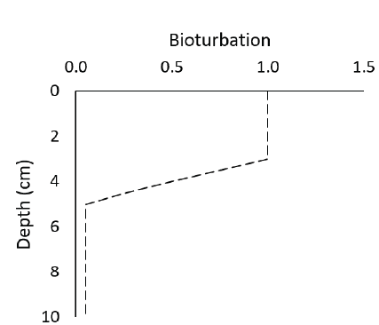

```

Bioirrigation was set up as a depth at which non-local transport occurred, using the parameter *x~irrig~*. The value for *x~irrig~* can be found in the physical parameters table below, and as with *x~1~*, the depths of *x~irrig~* were assigned to each zone, to reflect the decrease of benthic fauna in the southern zones. 

Within the Coorong, in the hot summer months as the water in the southern lagoon evaporates, the remaining water becomes hypersaline. The hypersaline water kills the macroinvertebrate fauna, which causes a decrease in fauna-driven mixing of the upper sediment. The model for bioturbation and irrigation was set to update at each time step. As $F_{Sal}$ and $F_{Sal}$ were updated at each time step, bioturbation and bioirrigation were therefore dynamically dependent on water column salinity and $H_{2}S$ concentration.


#### Salinity coupling method {.unnumbered}

Salinity was set as a permanently linked variable from the water column AED model, without using *water_link*.

A special salinity factor, $F_{Sal}$ was developed for the salinity in the Coorong, to inhibit processes at hypersaline concentrations. $F_{Sal}$ ranges from 1 to 0, as set between salinity concentration parameters *Sal1* and *Sal2* (PSU).

The equations for $F_{Sal}$ are given below.

```{=tex}
\begin{eqnarray}
   If  Salinity < Sal_1 \ \ then \ \   F_{Sal} = 1 \ 
  \\
  \\
   If  Salinity > Sal_1 then   \frac {Sal_2 - Salinity} {Sal_2 - Sal_1} \ 
  \\
  \\
   If  Salinity > Sal_2 then   F_{Sal} = 1 \ 
\end{eqnarray}
```
The effect of the scaling is shown in Figure \@ref(fig:dev-picsbudgetsetup-2).

```{r dev-picsbudgetsetup-2, echo = FALSE, out.width='50%', class = "text-image",fig.show='hold',fig.align='center', fig.cap = "Diaagram of the salinity factor $F_{Sal}$, scaling between 1 and 0 between the parameters. In this diagram *Sal~1~* is 40 and *Sal~2~* is 70."}

knitr::include_graphics("images/dev/sed_$F_{Sal}$.png")

```

The values for *Sal~1~* and *Sal~2~* can be found in the physical parameters table below. In this simulation, the same value for all was used in all zones.

$F_{Sal}$ was applied to biota-driven mixing (see below) and to the nitrogen redox and adsorption reactions. It was multiplied by the following reactions:

-  *R~$N_2O$ ~*
-  *R~NO2~*
-  *R~NO3~*
-  *R~NH4ox~*
-  *R~NH4NO2~*
-  *R~NO2O2~*
-  *NH~4~^+^ adsorption*

The term affected all rates equally and so did not favour the concentration of any of the species. However, it slowed down the transformation of each species into the other, and increased the effect of transport reactions and depth-driven concentration gradients. Since $PON_R$, $O_2$ and $NO_3^-$ entered the domain from above and $NH_4^+$ generally accumulated with depth, N variables in areas of high salinity were subject to more transport before they were reacted.

#### Sulfur and denitrification {.unnumbered}

As mentioned above, $SO_4^{2-}$ bottom water concentrations were tied to salinity and initial $SO_4^{2-}$ concentrations were set to reflect the salinity gradient along the estuary. Consequently, the generation of $H_{2}S$ was higher in the southern zones. High $H_{2}S$ concentration was set to inhibit biota-driven mixing and nitrogen redox reactions, on the basis that $H_{2}S$ is toxic to organisms. An $H_{2}S$ factor, $F_{Sul}$, was set up as an inhibition factor similar to other inhibition factors in the sediment model.

```{=tex}
\begin{eqnarray}

F_{Sul} = \frac {K_{H_{2}S}} {(K_{H_{2}S} + H_{2}S)} 

\end{eqnarray}
```
As with $F_{Sal}$, $F_{Sul}$ scales between 1 and 0, however, as a decay rather than a stepped function (Figure \@ref(fig:dev-picsbudgetsetup-3)). The value for *K~H2S~* can be found in the physical parameters table below In this simulation, the same value for *K~H2S~* was used in all zones.

```{r dev-picsbudgetsetup-3, echo = FALSE, out.width='50%', class = "text-image",fig.show='hold',fig.align='center', fig.cap = "Diagram of the $H_2S$ factor, $F_{Sul}$, scaling from 1 to 0 as $H_2S$ concentration decreases. "}

knitr::include_graphics("images/dev/sed_$F_{Sul}$.png")

```

As with $F_{Sal}$, $F_{Sul}$ was applied to biota-driven mixing (see below) and to the nitrogen redox reactions. It was multiplied by the following reactions:

-  *R~$N_2O$ ~*
-  *R~NO2~*
-  *R~NO3~*
-  *R~NH4ox~*
-  *R~NH4NO2~*
-  *R~NO2O2~*
-  *NH~4~^+^ adsorption*

### Nutrient sorption and burial {.unnumbered}

A process for removing nutrients from the active zone was burial of the nutrients deep in the sediment. As much of the nutrient calibration was based around calculating the mass in the top 5 cm (see Calibration section above), a measurement of burial was defined as the change in mass at 5 cm over time.

Another mechanism of nutrient removal was adsorption of dissolved nutrients onto solid particles. $NH_4^+$ was simulated as precipitating onto solid particles, including organic matter and clay. Since the Coorong sediment survey showed high concentrations of organic matter and clay, it was assumed that there were unlimited adsorption sites for $NH_4^+$, and the relative amounts of $NH_4^+$ were assigned by the adsorption constant as per the methods in Van Cappellen and Wang (1996), which was ultimately based on Mackin and Aller (1984). The adsorption constant was set to the same value in all zones, which can be found in the geochemistry parameter table below. A simplified version of the adsorption equations adsorption can be found below (the full equations correct for porosity and solid volume when transferring between particulate and dissolved phases).

<center>

```{=tex}
\begin{eqnarray}

NH_{4 _{Total}}^+    = NH_{4}^+ + NH_{4_{Adsorbed}}
\\
\\
NH_{4 _{Dissolved}}^+  = \frac {1}{K_{NH_4p}}
\\
\\
NH_{4 _{Particulate}}^+ = 1 - NH_{4 _{Dissolved}}^+ F_{Sal}
\\
\\
NH_{4 _{Particulate}}^+ = NH_{4_{Total}}^+ NH_{4 _{Particulate}}^+
\\
\\
NH_{4 _{Dissolved}}^+  = NH_{4_{Total}}^+ - NH_{4 _{Particulate}}^+

\end{eqnarray}
```
</center>

A similar approach was taken for dissolved organic carbon, nitrogen and phosphrous. The $DON_R$ and $DON_S$ are adsorbed to the sediment with the adsorption constant *K~DOMP~*, and $DOP_R$ and $DOP_S$ adsorbed using the same adsorption constant *K~DOMP~*. The value for *K~DOMP~* defaults to 1.4 and the model defaults to being switched on.

$PO_4^{3-}$ was adsorbed onto the surfaces of iron oxide particles, both the reactive $Fe(OH)_{3A}$ and unreactive $Fe(OH)_{3B}$ fractions. (While the sediment model has optional configurations, as outlined in the AED Manual, in this simulation the options *PO4AdsorptionModel* = 1 and *ads_use_pH* = TRUE.) The overall property of this setup was that low oxygen and nitrate concentrations in the sediment cause iron oxide reduction, which dissolves the solid particles and releases the dissolved $PO_4^{3-}$ to the porewater.

```{=tex}
\begin{eqnarray}

PO_{4_{Particulate}}^{3-} = \frac {K_{PO_4p} (Fe(OH)_{3A} + Fe(OH)_{3B})} 
{1 + K_{PO_4p} (Fe(OH)_{3A} + Fe(OH)_{3B}) } (PO_{4 _{Total}}^{3-})
\\
\\
PO_{4_{Dissolved}}^{3-}  = \frac {1} {1 + K_{PO_4p} (Fe(OH)_{3A} + Fe(OH)_{3B}) } (PO_{4 _{Total}}^{3-})

\end{eqnarray}
```

Organic P and 'residual' P were assumed to be the two largest fractions of sediment P, based on the work of Koch et al. (2001) from a study site similar to the Coorong. The 'residual' P was bound to sediment particles and extracted with acid. The ratio of PIP:POP was 40:60 in the initialisation step.

The final feature developed for nutrient burial for this project was the very unreactive organic matter parameter. As mentioned in the model setup above, the organic matter setup in this model has labile and refractory phases, as state variables. The model was extended in this project by dropping the reactivity of the particulate refractory phase towards zero as the concentration approached a minimum. For $PON_R$, the parameter *ponu* set the minimum concentration and *KOMPres_N* set the sensitivity of the decrease, as in the equation below. The equivalent parameters for C an P were *pocu* and *popu*, and *KOMPres_C* and *KOMPres_P*.


```{=tex}
\begin{eqnarray}

komlim = \frac {PON_R - ponu} {PON_R - ponu + KOMPres_N} 
\\
\\
R_{PONR} = (ponr2donr) (komlim)

\end{eqnarray}
```
(The equation above is a simplified version, where the full equation had checks to prevent the rate going below zero, plus the respiration processes of $MPB$.)

### Plants, microphytobenthos and macroalgae

$O_2$ is injected into the sediment from microphytobenthic algae ($MPB$) and from plant roots (\@ref(fig:dev-picsbudgetsetup-5)). The oxygen is not part of the mass balance of the ecosystem and it is not in stoichiometric balance with biomass or $∑CO_2$. The depths where the $O_2$ is injected are set separately for $MPB$ and roots. The $O_2$ in these layers from $MPB$ is set as a rate of both gross primary production ($Rgpp O_2 input$) and respiration ($Rrsp O_2 consumption$). The rate $Rgpp$ is calculated as a function of the $MPB$ production rate, the parameter *fgpp~sflux~* and a decay with depth. The production rate is linked directly to the rate calculated in the water column model. Similarly, the rate $Rrsp$ is calculated as a function of the respiration rate, the same parameter *fgpp~sflux~* and a decay with depth. The respiration rate is also linked directly to the rate calculated in the water column model. Below the parameter *MPBDepth*, $Rgpp$ is zero, which means that the $MPB$ cannot photosynthesise without light. Below *MPBDepth* the rate $Rrsp$ is the product of $MPB$ biomass and 52 days, which means that the cells die within a week without access to light.

The rate of $O_2$ injection from roots is calculated from the variable $RTO_2$, which applies above the depth $RTDP$. Both $RTO_2$ and $RTDP$ are linked directly from the water column model.

```{r dev-picsbudgetsetup-5, echo = FALSE, out.width='75%', class = "text-image",fig.show='hold',fig.align='center', fig.cap = "Schematic of the new parameterisation of $O_2$ injection into the sediment. Left: $O_2$ is released where $MPB$ are respiring. Right: $O_2$ comes from plant roots to the depth of *RTDP*."}

knitr::include_graphics("images/dev/sed_O2Inject.png")

```

## Coorong model setup and configuration

### Site description and zonation

**Spatial aggregation - ten regions** In order to simplify the Coorong study site measurement points and simulation areas, the lagoon was divided into ten separate Coorong regions from north to south, that were then split into the simulated zones. These were primarily based on the natural boundaries, channels and sandbars of the estuary. Regions 1 to 4 were the southern lagoon, region 5 was the intermediate area and region 6 to 10 were in the northern lagoon (Figure \@ref(fig:dev-pics1)).

```{r dev-pics1, echo = FALSE, out.width='45%', class = "text-image",fig.show='hold',fig.align='center', fig.cap = "Example sediment zonation."}

knitr::include_graphics(c("images/dev/sed_Zones.png","images/dev/sed_ZonesSat.png"))

```

**Deep and shallow sites** The ten Coorong regions were further subdivided into three zones each -- the western bank on the ocean side, the central channel, and the eastern bank on the inland side. The cut-off between the channel and the bank subdivision was defined by any area that reached more than 1 m deep. Therefore, each of the ten regions along the length of the lagoon had three zones across the breadth of the lagoon, and region ten had one additional zone for the ocean boundary, giving 31 zones in total (Figure \@ref(fig:dev-pics2)).

```{r dev-pics2, echo = FALSE, out.width='45%', class = "text-image",fig.show='hold',fig.align='center', fig.cap = "Example sediment zonation."}

knitr::include_graphics(c("images/dev/sed_Half Page zones11to104.png","images/dev/sed_Half Page zones61to73.png"))

```

#### Validation sites and data {.unnumbered}

A range of data was collected and is documented in [Appendix D](Appendix D: Sediment Data). In summary, there were five broad categories of field data available from the HCHB research project surveys for the $SDG$ module setup and parameterisation:

*Grab samples -- C, N, P, Mn, Fe, S* : These were available for many sites but only one or two depths. They were useful for averaging a concentration at depth within a zone. These were key variables for sediment biogeochemistry.

*Cores -- Fe, S, NH~4~^+^, PO~4~^3-^ GHGs* : The cores were available for only around four sites, but they were used for calibrating depth profiles and sediment-water fluxes. These often had data measured in the day and the night, as well as in November and March, which all had different concentrations and fluxes. The challenge was to capture both day and night conditions, while also capturing seasonal changes.

*Sediment quality* : These measurements were used for setting the initial porosity parameters. Once these were set they were not tuned further.

*Macroinvertebrates -- bioturbation parameters* : Benthic infauna measurements were used for setting bioturbation and bioirrigation parameters. Broadly, the North Lagoon had high bioturbation and the South Lagoon had very little bioturbation. The depth to bioturbation was important, as it was expected that there was uninhabited black ooze below a few centimetres.

*Water column water quality measurements* : These were used for estimating water column concentrations and influxes for variables that were not able to be linked to active AED modules used for the water column model.

A detailed analysis of available sediment data is presented in [Appendix D](Appendix%20D%20:%20Sediment%20Data) - this was used as the basis for the $SDG$ module steup and validation.

### Model setup and application approach

#### Simulated variables {.unnumbered}

In total, each sediment zone was configured to include a total of 42 simulated constituents. All simulated variables are listed in Table \@ref(tab:3dev-sedvars).

<center>

```{r 3dev-sedvars, echo=FALSE, message=FALSE, warning=FALSE}
 library(knitr)
 library(kableExtra)
 library(readxl)

 sediment_vars <- read_xlsx("tables/BookdownSDGVars.xlsx", sheet = "Vars" )
 kable(sediment_vars,"html", escape = F, align = "c", caption = "All sediment variables",
    bootstrap_options = "hover") %>%
  kable_styling(sediment_vars, bootstrap_options = "hover", 
         full_width = F, position = "center", 
         font_size = 12) %>% 
  row_spec(0, background = "#14759e", bold = TRUE, color = "white") %>% 
  column_spec(1, width_min = "10em") %>%
  column_spec(1, width_min = "10em") %>%
  column_spec(1, width_min = "10em") %>%
  row_spec(1, background = 'white') %>% 
  scroll_box(width = "400px", height = "400px",
       fixed_thead = FALSE)
```

</center>

<br>

\

row_spec(0, background = "#14759e", bold = TRUE, color = "white") %>%
 kable_styling(full_width = T,font_size = 10) %>%
  scroll_box(fixed_thead = FALSE)


#### Water column linkages {.unnumbered}

Where possible, simulated sediment variables were dynamically 'linked' to their water column counterpart to assign the upper sediment boundary condition.

Nutrients, TN and TP, are transferred between the water column model and the sediment model in three ways:

-  Solids fluxed to the sediment via the *part_sed_link* term, using the link variables from the AED organic matter module *OGM_pon_swi* and *OGM_pop_swi*.
-  Dissolved species were fluxed from the sediment to the water column via the *diss_flux_link* terms *SDF_Fsed_don* and *SDF_Fsed_dop* for organics, and *SDF_Fsed_nit* and *SDF_Fsed_amm* for $NO_3^-$ and $NH_4^+$.
-  Dissolved species took their upper sediment concentration from the water column bottom water concentration via the *water_link* term, using *OGM_don* and *OGM_dop* for organics and *NIT_nit* and *NIT_amm* for $NO_3^-$ and $NH_4^+$.

The linked variables are listed in Table \@ref(tab:3dev-sedlinkvars). As outlined above, they can be linked by concentration, dissolved flux and particle flux. The $SO_4^2-$ link is set such that $SO_4^2-$ concentration in mmol L^-1^ is 0.9 × salinity (PSU).

```{r 3dev-sedlinkvars, echo=FALSE, message=FALSE, warning=FALSE}
 library(knitr)
 library(kableExtra)
 library(readxl)

 sediment_linkvars <- read_xlsx("tables/BookdownSDGVars.xlsx", sheet = "Links" )
 kable(sediment_linkvars,"html", escape = F, align = "c", caption = "Linked sediment variables",
    bootstrap_options = "hover") %>%
  kable_styling(sediment_linkvars, bootstrap_options = "hover", 
         full_width = F, position = "center", 
         font_size = 12) %>% 
  row_spec(0, background = "#14759e", bold = TRUE, color = "white") %>% 
  column_spec(1, width_min = "10em") %>%
  column_spec(2, width_min = "20em") %>% 
  column_spec(3, width_min = "10em") %>% 
  column_spec(4, width_min = "10em") %>%
  column_spec(5, width_min = "10em") %>%
  column_spec(6, width_min = "10em") %>%
  row_spec(1:10, background = 'white') %>% 
  scroll_box(width = "650px", height = "400px",
       fixed_thead = FALSE)
```

<br>

Sediment nutrients were present in several phases:\
- organic and inorganic,\
- dissolved and particulate,\
- labile and refractory, and \
- oxidised and reduced. \
This is also the case for water column nutrients, however, they were not simulated as labile and refractory. Therefore, the *part_sed_link* water column $PON$ was partitioned into $PON_L$ and $PON_R$ with the term *part_sed_scale*. In this simulation, the value for $PON$ was 0.5 (and for all other variables the value was 1). The *diss_flux_link* of water column $DON$ and $DOP$ were linked to sediment $DON_R$ and $DOP_R$ only Figure \@ref(fig:dev-picsbudgetsetup-1).

Sediment nutrients were present in several phases: - organic and inorganic, - dissolved and particulate, - labile and refractory, and - oxidised and reduced. This is also the case for water column nutrients, however, they were not simulated as labile and refractory. Therefore, the *part_sed_link* water column $PON$ was partitioned into $PON_L$ and $PON_R$ with the term *part_sed_scale*. In this simulation, the value for $PON$ was 0.5 (and for all other variables the value was 1). The *diss_flux_link* of water column $DON$ and $DOP$ were linked to sediment $DON_R$ and $DOP_R$ only Figure \@ref(fig:dev-picsbudgetsetup-1).

 ```{r dev-picsbudgetsetup-1, echo = FALSE, out.width='50%', class = "text-image", fig.show='hold' , fig.align='center', fig.cap = "Schematic of major N pools, as transferred between the water and sediment models. The water column PON is partitioned into labile and refractory fractions in the sediment. The refractory DON is fluxed back to the water column."}

 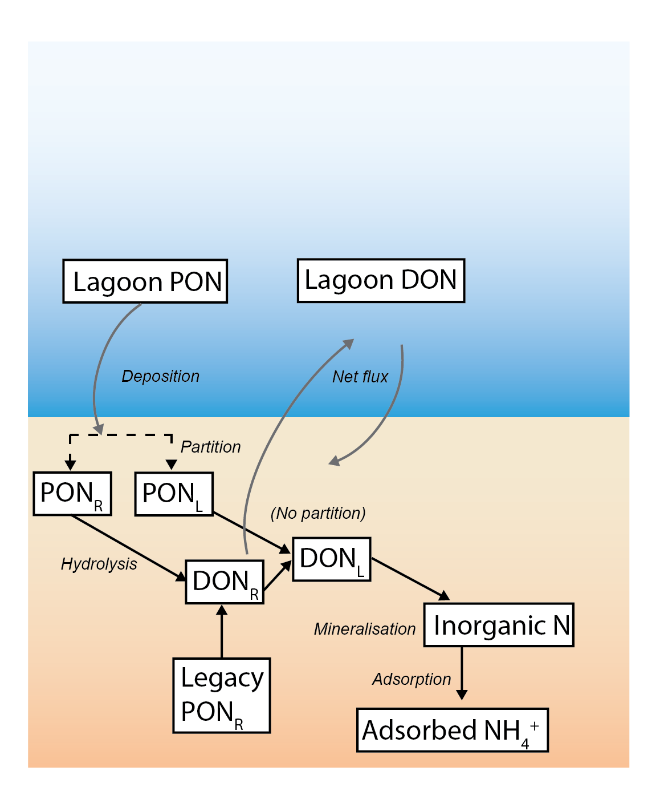

 ```

The flux of $Fe(OH)_{3A}$ from the water column to the sediment is set from the parameter 'default_vals'. In the water column model, Fe is not simulated, therefore one value was applied equally to all zones. The value was calibrated to fit the $Fe^2+$ concentration value. <br>

\

#### Initialisation and spinup {.unnumbered}

Most chemical species were initialized at zero concentration. Some species were initialised as guided by the available field data (Table \@ref(tab:3dev-init)), or where field measurements were not available, then literature sources for coastal sediment were assumed. From the initial tests, it was assumed the bulk of the nutrients were the in the refractory organic phases, e.g., $PON_R$ and $POP_R$.
=======
Most chemical species are initialized at zero concentration. Some species are initialised as guided by the available field data (Table \@ref(tab:3dev-init)), or where field measurements were not available, then literature sources for coastal sediment were assumed. From the initial tests, it was assumed the bulk of the nutrients were the in the refractory organic phases, e.g., $PON_R$ and $POP_R$.

```{r 3dev-init, echo=FALSE, message=FALSE, warning=FALSE}

sediment_initial <- read_xlsx("tables/BookdownSDGVars.xlsx", sheet = "Initial" )
kable(sediment_initial,"html", escape = F, align = "c", caption = "Sediment initial conditions for all variables in all 31 zones", 
   bootstrap_options = "hover") %>%
 kable_styling(sediment_initial, bootstrap_options = "hover",
        full_width = F, position = "center",
        font_size = 12) %>%
 row_spec(0, background = "#14759e", bold = TRUE, color = "white") %>% 
 column_spec(1, width_min = "10em") %>%
 column_spec(2, width_min = "20em") %>%
 column_spec(3, width_min = "10em") %>%
 column_spec(4, width_min = "10em") %>%
 row_spec(1:10, background = 'white') %>%
 scroll_box(width = "650px", height = "400px",
      fixed_thead = FALSE)
```

<br>

**Organic matter initialisation** : Organic matter was initialised with profiles that had a higher concentration in the upper layers of the sediment. (All other variables were initialised with concentrations that were constant with depth.) This is due to the common assumption that organic matter concentration decreases with depth, based on the degradation of water column-derived organic matter over time. Refractory species (particulate and dissolved) used the linear method and labile species (particulate and dissolved) used the exponential method. The linear method set the initial concentration at the surface, a minimum concentration as a fraction of the initial concentration (*OM_minR*), and a depth at which the minimum concentration would be reached (*InitMinDepthR*). The exponential method set the initial concentration, and an exponential decay constant (*OM_cfL*). An example of how the initial profiles appear is given in \@ref(fig:dev-pics2b).

\

```{r dev-pics2b, echo = FALSE, out.width='100%', class = "text-image",fig.show='hold',fig.align='center', fig.cap = "Organic matter initial profiles. Left - linear profiles for refractory species. Right - exponential profiles for labile species."}

knitr::include_graphics(c("images/dev/sed_OMInitialProfiles-02.png"))

```

\

#### Model parameters {.unnumbered}

##### Physical domain and numerical parameters {.unnumbered}

The physical properties of the sediment are given in Table \@ref(tab:3dev-Mixing) and \@ref(tab:3dev-Layers). In general, the SDG module was set to run with a time-step of 2 hours, resolve a vertical sediment depth of 80 cm using 50 layers. 
=======
The physical properties of the sediment are given in Table \@ref(tab:3dev-Mixing) and \@ref(tab:3dev-Layers). In general, the SDG module was set to run with a time-step of 2 hours, resolve a vertical sediment depth of 80cm using 50 layers.

The physical properties of the sediment are given in Table \@ref(tab:3dev-Mixing) and \@ref(tab:3dev-Layers). In general, the SDG module was set to run with a time-step of 2 hours, resolve a vertical sediment depth of 80cm using 50 layers.

Some parameters are set as constant values for all zones, while others are set to be variable in each zone. The variability of bioturbation and irrigation along the length of the lagoon is set using the depth of the effect ($x_1$, $x_2$ and $x_{irrig}$) rather than the intensity ($DB_0$, $\alpha_0$). Upper porosity $\rho_0$ is held at 0.9 (i.e. 90% porewater) for all zones and the lower porosity $\rho_{00}$ is based on measured data at sites in each zone.

<!-- 2 Mixing -->

```{r 3dev-Mixing, echo=FALSE, message=FALSE, warning=FALSE}
sediment_Mixing <- read_xlsx("tables/BookdownParams.xlsx", sheet = "Mixing" )
kable(sediment_Mixing,"html", escape = F, align = "c", caption = "Sediment physical properties", 
   bootstrap_options = "hover") %>%
  kable_styling(sediment_initial, bootstrap_options = "hover",
        full_width = F, position = "center",
        font_size = 12) %>%
 row_spec(0, background = "#14759e", bold = TRUE, color = "white") %>% 
 column_spec(1, width_min = "10em") %>%
 column_spec(2, width_min = "20em") %>%
 column_spec(3, width_min = "10em") %>%
 row_spec(1:5, background = 'white') %>%
 scroll_box(width = "600px", height = "200px",
      fixed_thead = FALSE)
```

<!-- 3 SedimentLayers -->

\

```{r 3dev-Layers, echo=FALSE, message=FALSE, warning=FALSE}
sediment_Layers <- read_xlsx("tables/BookdownParams.xlsx", sheet = "Layers" )
kable(sediment_Layers,"html", escape = F, align = "c", caption = "Sediment layer setup parameters and mixing parameters that vary by zone.", 
   bootstrap_options = "hover") %>%
  kable_styling(sediment_initial, bootstrap_options = "hover",
        full_width = F, position = "center",
        font_size = 12) %>%
 row_spec(0, background = "#14759e", bold = TRUE, color = "white") %>% 
 column_spec(1, width_min = "10em") %>%
 column_spec(2, width_min = "20em") %>%
 column_spec(3, width_min = "10em") %>%
 row_spec(1:5, background = 'white') %>%
 scroll_box(width = "600px", height = "300px",
      fixed_thead = FALSE)
```

<br>

\

##### Organic matter parameters {.unnumbered}

Many of the key processes in the sediment are driven by organic matter oxidation. Fresh organic matter supplied to the sediment surface fuels the bacterially-driven primary redox reactions that constantly shift the chemical equilibrium in the sediment. Organic matter metabolism also releases organic N and P to the water column. The parameters are given in Table \@ref(tab:3dev-OM).

The organic matter model option number 2 was used in this project. This option has both particulate and dissolved organic phases, and simulates organic C, N and P as separate state variables.

<!-- 4 OM -->

```{r 3dev-OM, echo=FALSE, message=FALSE, warning=FALSE}
sediment_OM <- read_xlsx("tables/BookdownParams.xlsx", sheet = "OM" )
kable(sediment_OM ,"html", escape = F, align = "c", caption = "Organic matter oxidation parameters", 
   bootstrap_options = "hover") %>%
  kable_styling(sediment_initial, bootstrap_options = "hover",
        full_width = F, position = "center",
        font_size = 12) %>%
 row_spec(0, background = "#14759e", bold = TRUE, color = "white") %>% 
 column_spec(1, width_min = "10em") %>%
 column_spec(2, width_min = "20em") %>%
 column_spec(3, width_min = "10em") %>%
 row_spec(1:5, background = 'white') %>%
 scroll_box(width = "600px", height = "300px",
      fixed_thead = FALSE)
```

<br>

\

##### Secondary redox reactions {.unnumbered}

Secondary redox reactions are formed from the by-products of primary redox reactions. The nitrogen redox cycle parameters are given in Table \@ref(tab:3dev-NRedox).

<!-- 5 NRedox -->

```{r 3dev-NRedox, echo=FALSE, message=FALSE, warning=FALSE}
sediment_Nredox <- read_xlsx("tables/BookdownParams.xlsx", sheet = "NRedox" )
kable(sediment_Nredox ,"html", escape = F, align = "c", caption = "Nitrogen redox cycle parameters", 
   bootstrap_options = "hover") %>%
  kable_styling(sediment_initial, bootstrap_options = "hover",
        full_width = F, position = "center",
        font_size = 12) %>%
 row_spec(0, background = "#14759e", bold = TRUE, color = "white") %>% 
 column_spec(1, width_min = "10em") %>%
 column_spec(2, width_min = "20em") %>%
 column_spec(3, width_min = "10em") %>%
 row_spec(1:5, background = 'white') %>%
 scroll_box(width = "600px", height = "300px",
      fixed_thead = FALSE)
```
\
\
\
\

Secondary redox parameters for other processes are given in Table \@ref(tab:3dev-SecondaryRedox).

<!-- 6 SecondaryRedox -->

```{r 3dev-SecondaryRedox, echo=FALSE, message=FALSE, warning=FALSE}
sediment_SecondaryRedox <- read_xlsx("tables/BookdownParams.xlsx", sheet = "SecondaryRedox" )
kable(sediment_SecondaryRedox ,"html", escape = F, align = "c", caption = "Secondary redox arameters",   bootstrap_options = "hover") %>%
  kable_styling(sediment_initial, bootstrap_options = "hover",
        full_width = F, position = "center",
        font_size = 12) %>%
 row_spec(0, background = "#14759e", bold = TRUE, color = "white") %>% 
 column_spec(1, width_min = "10em") %>%
 column_spec(2, width_min = "20em") %>%
 column_spec(3, width_min = "10em") %>%
 row_spec(1:5, background = 'white') %>%
 scroll_box(width = "600px", height = "300px",
      fixed_thead = FALSE)
```

<br>

\

##### Geochemistry parameters {.unnumbered}

Equilibrium and precipitation/dissolution constants are given in Table \@ref(tab:3dev-Geochem).

<!-- 7 Geochem -->

```{r 3dev-Geochem, echo=FALSE, message=FALSE, warning=FALSE}
sediment_Geochem <- read_xlsx("tables/BookdownParams.xlsx", sheet = "Geochem" )
kable(sediment_Geochem ,"html", escape = F, align = "c", caption = "Geochemistry and precipitation/dissolution parameters",
   bootstrap_options = "hover") %>%
  kable_styling(sediment_initial, bootstrap_options = "hover",
        full_width = F, position = "center",
        font_size = 12) %>%
 row_spec(0, background = "#14759e", bold = TRUE, color = "white") %>% 
 column_spec(1, width_min = "10em") %>%
 column_spec(2, width_min = "20em") %>%
 column_spec(3, width_min = "10em") %>%
 row_spec(1:5, background = 'white') %>%
 scroll_box(width = "600px", height = "300px",
      fixed_thead = FALSE)
```

<br>

## Validation and assessment

### Calibration process

As there was no perfect data set for calibration of the sediment constituent profiles, a multi-pronged strategy was developed to assess the performance of the model. The model performance was assessed across 31 zones, and compared to measured data wherever they were available, which was a small subset of the simulated zones. The model outputs were also compared to the values used in the unlinked water column model, which was separately calibrated to data measured in the water column.

##### Top 5 cm budget {.unnumbered}

The initial condition of organic matter was set such that it matched the estimated sediment budget from the UA T&I 1.2.2 investigation. This gave estimates of the mass of total N and total P in the top 5 cm of the sediment, for both the north and south lagoons. It was assumed that the bulk of the deep N was in the form of particulate refractory organic nitrogen ($PON_R$) and the P was a combination of refractory organic and adsorbed P. The budget was found by using:

-  the concentration at each layer in the top 5 cm
-  the height between layers in the top 5 cm
-  the area of each zone
-  the zones that corresponded to the lagoons of the original study.

$TN$ and $TP$ were also compared to the grab samples. The grab samples showed a wide variety of concentrations, over several orders of magnitude, and in some cases it was necessary to compress the range of concentrations in order to get a more constant initial sediment concentration.\

##### Top 5 cm over time {.unnumbered}

The combination of the linear initial profile and the *ponu* parameter produced an unexpected result in the long-term concentration of organic nitrogen. Even though the top 5 cm had a high initial concentration, over a long simulation, the concentration would eventually drop to zero. As the $PON_R$ was hydrolysed to $DON_R$, and buried with ongoing sediment deposition, the $PON_R$ concentration in the top 5 cm decreased: $PON_R$ was not replenished by incoming organic matter from the water column (see Figure \@ref(fig:dev-picsbudgetsetup-5b)). The $DON_R$ that was created from $PON_R$ fluxed out of the sediment to the water column or mineralised to $NH_4^+$. The $NH_4^+$ either fluxed to the water column, or accumulated at depth. The problem that this creates for future calibrations is that either - the $DON_R$ and $NH_4^+$ fluxes are artificially high early in the simulation, as a false result of a long spin-up, or - an additional amount of $PON_R$ needs to be added to the influxing organic matter.

 

```{r dev-picsbudgetsetup-5b, echo = FALSE, out.width='100%', class = "text-image",fig.show='hold',fig.align='center', fig.cap = "Schematic of the fate of $PON_R$ over the course of a long simulation. Left - in the initial phase, the concentration resembled the initial profile. The $PON_R$ broke down to $DON_R$ and $NH_4^+$. Right - later in the simulation, the upper 5 cm had a much lower $PON_R$ concentration."}

knitr::include_graphics("images/dev/sed_OMInitialProfiles-03.png")

```

\

##### Oxygen penetration depth {.unnumbered}

The concentration of $O_2$ was not measured in the Coorong sediment. However, some general patterns were observed from the measured data, which informed the setup of the model. The rapid samples had oxygen penetration depths, which were used to guide the general trends of oxygen behaviour. The banks generally had higher concentrations than the deep channel. The South Lagoon had lower concentration than the North lagoon, due to the lower abundance of benthic fauna mixing oxygen into the upper sediment. The oxygen penetration was examined in line with the core measurements in order to calibrate the organic matter reduction. The $O_2$ concentration was dependent on the concentrations of species that could be oxidised, such as organic matter, $NH_4^+$ and $H_2S$ concentration. It was also dependent on bioturbation bioirrigation, and injection from plant roots and MPB, which were assigned for each zone.

Achieving the right oxic environment was important for its inhibition of other lower-energy redox processes, such as N cycling, and Fe and $SO_4^{2-}$ reduction.

##### Fluxes {.unnumbered}

While there were measured fluxes across the sediment-water interface for several variables, they were not used for the calibration. These variables were measured in laboratory cores and so they were typically much lower than would be expected in the field site. The motion of water in the lagoon causes a larger flux than just the diffusive flux in the laboratory cores. Therefore, the guide for sediment fluxes was the fluxes used in the standalone model, which was calibrated to water column concentrations. The advantage of using the sediment model over the constant rates in the water column model was that the fluxes became much more responsive to changing chemical concentrations. There was also varying sensitivity to the water column hydrodynamics (see section above on $\tau_b$).

##### Grabs {.unnumbered}

The grab samples were not used for the calibration, rather they were used for setting the initial condition. For $TOC$, $TN$ and $TP$, the total sediment budget was relied on for calibration, rather than the grab samples. For $FeS$ and $FeS_2$, their concentrations stayed approximately consistent with the initial condition.

##### Cores {.unnumbered}

Measured $NH_4^+$ profiles showed concentrations of about 0.1 mmol L^-1^ and accumulation with depth. The model captured this well, with a finely tuned balance between the main source of $NH_4^+$ from DONR and $NH_{4}^+$ flux to the bottom water.

The measured data showed a spike of $Fe^2+$ at approximately 1 cm depth, with a $H_2S$ spike slightly below that. The model was calibrated to fit this. In many zones, the oxygen was penetrating too deeply into the sediment and inhibiting iron reduction. Once the oxygen was consumed higher in the sediment, more $Fe^2+$ and $H_2S$ were produced. This was then balanced with the precipitation of FeS.

Only one $PO_4^{3-}$ core was available, which had concentrations around 1×10^-3^ mmol L^-1^. Other samples were taken but the concentrations were below detection limit. The model produced concentrations of $PO_4^3-$ that were satisfactory compared to the measured data.

##### Overall nitrogen calibration {.unnumbered}

As mentioned above, the nitrogen was initialised and calibrated based on\
- sediment top 5 cm budget\
- $NH_4^+$ concentrations in the sediment\
- $NH_4^+$ fluxes into the water column

The dominant reaction pathways for nitrogen include hydrolysis of $PON_R$ to $DON_R$, and mineralisation of $DON_R$ to $NH_4^+$. The major chemical processes that affected the mass budget were hydrolysis of $PON_R$ to $DON_R$ and mineralization of $DON_R$ to $NH_4^+$.

```{=tex}
\begin{eqnarray}
\\
  PON_{R} \rightarrow DON_{R} 
\\
  DON_{R} \rightarrow NH_{4}^{+}  
\\
\end{eqnarray}
```
The setup was tuned to prevent the degradation of too much $PON_R$ and accumulation of $NH_4^+$, especially over the course of a long simulation. During the calibration, $PON_R$ concentrations were in the order of 1×10^3^ mmol L^-1^, while $DON_R$ and $NH_4^+$ were in the order of 1×10^-1^ mmol L^-1^, and so a small change in the concentration of $PON_R$ was able to cause a large change in the concentrations of DONR and $NH_4^+$. The accumulation was controlled by adjusting the hydrolysis and mineralisation rate constants, and the amount of unreactive $PON_R$ (see $ponu$ below).

The concentration of $NH_4^+$ was compared to measured concentration values, and the $NH_4^+$ flux was compared to both the measured fluxes and the flux rate that was calibrated for the water column model.

A side effect of producing the $DON_R$ intermediate product was its flux into the water column. The sediment model combined both labile and refractory DON ($DON_L$ and $DON_R$) and fluxed a combined $DON$ species to the water column (via *diss_flux_link*). The water column $DON$ was also fluxed back into the sediment and split 50:50 into $DON_L$ and $DON_R$ (via *water_link*). This resulted in the surprising outcome of a much larger accumulation of $DON$ and $NH_4^+$ in the water column than had been expected from the uncoupled model. As the simulation proceeded, the $NH_4^+$ had such high concentrations that it was fluxing back into the sediment in some zones, which was an unrealistic outcome.

##### Denitrification rates {.unnumbered}

In the initial calibration, denitrification processes did not occur in the sediment model, which was in conflict with the rates measured by UA in T&I 1.2.2 (Reference). The high penetration of oxygen into the sediment inhibited the reduction of $NO_3^-$ to $NO_2^-$ and $NO_2^-$ to $NH_4^+$ or $N_2$. Furthermore, there was too little labile dissolved organic matter to consume the oxygen in the upper layers. The salinity and sulphide factors *$F_{Sal}$* and *$F_{Sul}$* inhibited denitrification in the deep sediment.

<br>

### Model results

#### Top 5 cm budget {.unnumbered}

The total mass of TN and TP in both the north and the south lagoons was calibrated to the right order of magnitude as that measured in the field measurements (Figures \@ref(fig:dev-calpics1) to \@ref(fig:dev-calpics4)). The total mass decreased by a small amount over the course of the simulation.

```{r dev-calpics1, echo = FALSE, out.width='100%', class = "text-image",fig.show='hold',fig.align='center', fig.cap = " "}

knitr::include_graphics(c("images/dev/sed_TNNorth.png"))

```

```{r dev-calpics2, echo = FALSE, out.width='100%', class = "text-image",fig.show='hold',fig.align='center', fig.cap = "TN budgets in the top 5 cm. Above: North lagoon. Below: South lagoon. Left: each zone is displayed in the horizontal bars, changing over time across the x axis. Right: sum of all zones in the lagoon, changing over time across the x axis. The 'Target concentration' is the lagoon concentration as determined by UA."}

knitr::include_graphics(c("images/dev/sed_TNSouth.png"))

```

```{r dev-calpics3, echo = FALSE, out.width='100%', class = "text-image",fig.show='hold',fig.align='center', fig.cap = " "}

knitr::include_graphics(c("images/dev/sed_TPNorth.png"))

```

```{r dev-calpics4, echo = FALSE, out.width='100%', class = "text-image",fig.show='hold',fig.align='center', fig.cap = "TP budgets in the top 5 cm. Above: North lagoon. Below: South lagoon. Left: each zone is displayed in the horizontal bars, changing over time across the x axis. Right: sum of all zones in the lagoon, changing over time across the x axis. The 'Target concentration' is the lagoon concentration as determined by UA."}

knitr::include_graphics(c("images/dev/sed_TPSouth.png"))

```

<br>

#### Oxygen penetration depth {.panelset .unnumbered}

The $O_2$ concentration was generally higher, and the penetration was deeper in the northern zones, and it was lower and shallower in the southern zones. In general, the oxygen penetration depth ($OPD$) was higher than that indicated by the RAPID samples, though the spatia pattern reflected the field sampling.

The penetration of oxygen is shown to vary along the lagoon (Figure \@ref(fig:dev-sdgoxy)) in accordance with the porosity and bioturbation/bioirrigation depth, and this depth controls the vertical profiles of nutrient species like ammonia (Figure \@ref(fig:dev-sdgamm)).

##### Oxygen, DO {.unnumbered}

<center>

```{r dev-sdgoxy, echo = FALSE, out.width='70%', class = "text-image", fig.cap = "Simulated sediment concentrations of oxygen in different zones along the length of the lagoon."}

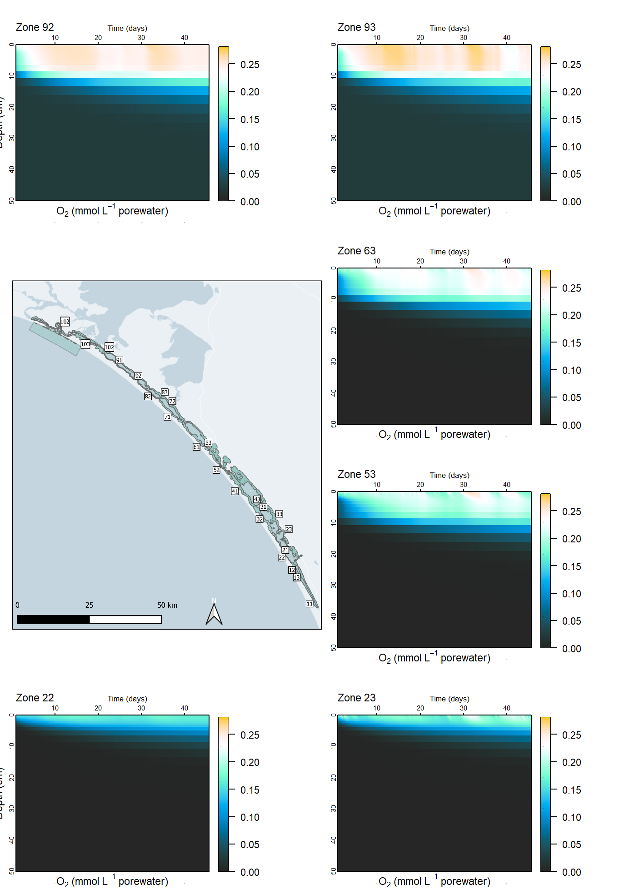
```

</center>

##### Ammonium, NH4 {.unnumbered}

<center>

```{r dev-sdgamm, echo = FALSE, out.width='70%', class = "text-image", fig.cap = "Simulated sediment concentrations of ammonium in different zones along the length of the lagoon."}

knitr::include_graphics("images/dev/sdg/t_D_C_6panel_amm.png")
```

</center>

<br>

#### Cores {.unnumbered}

Simulated depth profiles of $NH_4^+$ matched the measured values well, in particular in zone 73 (Figure \@ref(fig:dev-calpics6)). This was a major result, considering the very large total mass of N tied up in $PON_R$ and the relatively small amount produced as $DON$ and $NH_4^+$.

In most cases the initial concentration was close to the final concentration, with a slight decay over time. In a few zones (51, 52, 53 and 63) the $NH_4^+$ concentration in the upper sediment centimetres was more responsive to the flux at the sediment-water interface.

```{r dev-calpics6, echo = FALSE, out.width='45%', class = "text-image",fig.show='hold',fig.align='center', fig.cap = "Ammonium concentration profile for zone 73, compared to data at Noonameena."}

knitr::include_graphics(c("images/dev/sed_C_D_core_zone73_amm_2020-11-30.png"))

```

Some measured $Fe^{2+}$ and $H_2S$ data showed a clear spike in the profile at around 10 cm (with the $H_2S$ spike being slightly deeper in the sediment than the $Fe^{2+}$ spike) (Figure \@ref(fig:dev-calpics7) and \@ref(fig:dev-calpics8)). The sediment model did not capture this, and so a future calibration would require getting the total magnitude of both species right, as well as the right depth of $O_2$ penetration. Since the $O_2$ was generally slightly too deep, it is assumed that a shallower $O_2$ depth would create the right anoxic zone for Fe and SO~4~^2-^ reduction.

```{r dev-calpics7, echo = FALSE, out.width='45%', class = "text-image",fig.show='hold',fig.align='center', fig.cap = "$Fe^{2+}$ concentration profile with simulated and measured data, as a snapshot at November 2020."}

knitr::include_graphics(c("images/dev/sed_C_D_core_zone33_feii_2020-11-01.png"))

```

```{r dev-calpics8, echo = FALSE, out.width='45%', class = "text-image",fig.show='hold',fig.align='center', fig.cap = "$H_2S$ concentration profile with simulated and measured data, as a snapshot at November 2020."}

knitr::include_graphics(c("images/dev/sed_C_D_core_zone33_h2s_2020-11-01.png"))

```

<br>

#### Fluxes {.unnumbered}

The fluxes were generally within the right order of magnitude (Figure \@ref(fig:dev-calpics5)). Comparison was made with either the constant values used by the water column model for calibration, and the measured fluxes. Constant values were available for $O_2$, $NO_3^-$, $PO_4^{3-}$ and $NH_4^+$. Zone 52 had the most measured flux data, from Parnka Point and measured under dark and light conditions, with measurements for $O_2$, $NO_3^-$, $PO_4^{3-}$, $NH_4^+$, $N_2O$ and $CH_4$. Simulated fluxes were generally closer to the measured values than the constant values for $O_2$, $PO_4^{3-}$, $NH_4^+$. In the case of $NO_3^-$, the constant flux was close to the measured fluxes.

```{r dev-calpics5, echo = FALSE, out.width='100%', class = "text-image",fig.show='hold',fig.align='center', fig.cap = "Example of 12 sediment-water flux results for zone 52. Measured values are averages of several measurements for dark and light conditions and 'Constant fluxes' were those used in the previous calibration of the water column model."}

knitr::include_graphics(c("images/dev/sed_t_F_zone_52.png"))

```

<br>

### Nutrient behaviour and advanced biogeochemistry analysis

#### Nutrient species {.unnumbered}

Most of the TN and TP was present in unreactive OM, largely as a result of how the model was initialised to meet the total budget. The concentration of $PON$ was at approximately 500 to 1000 mmol L^-1^, while the concentrations of $DON$ and $NH_4^+$ were around 0.1 to 0.5 mmol L^-1^. Although the dissolved N concentrations were so much smaller than the solid concentration, they had an important effect on the water column concentrations.

<br>

#### Salinity and denitrification {.unnumbered}

High salinity and high $H_2S$ in the southern zones created inhibition. $F_{Sal}$ was at around 0.2 and $F_{Sul}$ around 0.7 (Figure \@ref(fig:dev-nutpics1)). In the northern zones, both factors were closer to 1.0, and therefore not inhibitory at all. The inhibition in the southern zones affected biota-driven mixing (see section below) and denitrification reactions (see section below).

```{r dev-nutpics1, echo = FALSE, out.width='95%', class = "text-image",fig.show='hold',fig.align='center', fig.cap = "Time-magnitude-depth profiles of $F_{Sal}$ and $F_{Sul}$ inhibition factors in four of the sediment zones, from north to south. The central figure shows the interpolated salinity from the UA survey. The higher salinity and higher $H_2S$ in the southern zones resulted in greater inhibition of other processes."}

knitr::include_graphics(c("images/dev/sed_FSalFSulBioturb_2-02.png"))

```

<br>

#### Sediment-water interface fluxes {.unnumbered}

Bioturbation and irrigation resulted from\
- the setup (depths) and\
- the $F_{Sal}$ and $F_{Sul}$ gradient along the lagoons (see above).

\
Note that the bioturbation and bioirrigation input parameters were 40 and 200 cm y^-1^, respectively (Figure \@ref(fig:dev-nutpics3)). In the southern zones, these raw inputs were decreased to around 8 for bioturbation and 40 for bioirrigation. The image from Zone 52, which is the intermediate area between the north and south lagoons, illustrates how the dynamic salinity boundary produced a dynamic response from biota-driven mixing. Future work could build in a time lag between the onset of the environmental condition and the result for the benthic fauna.

```{r dev-nutpics3, echo = FALSE, out.width='95%', class = "text-image",fig.show='hold',fig.align='center', fig.cap = "Time-magnitude-depth profiles of bioturbation and bioirrigation in four of the sediment zones, from north to south. The central figure shows the interpolated salinity from the UA survey. The higher salinity and higher $H_2S$ in the southern zones resulted in greater inhibition of bioturbation and bioirrigation."}

knitr::include_graphics(c("images/dev/sed_$F_{Sal}$$F_{Sul}$Bioturb-01.png"))

```

As an example going across the breadth of the lagoon, bioturbation and bioirrigation in zones 61 to 63 are shown in Figure \@ref(fig:dev-nutpics2). The depth and magnitude of bioturbation are smaller in the central, deep zone 62, than on the shallow edge zones, 61 and 63.

```{r dev-nutpics2, echo = FALSE, out.width='100%', class = "text-image",fig.show='hold',fig.align='center', fig.cap = "Time-magnitude-depth profiles of bioturbation and bioirrigation in three sediment zones, across the breadth of the lagoon in zone 6. The deeper central zone had lower bioturbation than the edge zones."}

knitr::include_graphics(c("images/dev/sed_Z6Bioturb.png"))

```

The total mass of TN flux across the sediment-water interface was calculated for one year (Figure \@ref(fig:dev-nutpics4)). The flux was dominated by the influx of $PON$ from the water to the sediment. There was a relatively smaller amount of $NH_4^+$ outflux from the sediment to the water.

```{r dev-nutpics4, echo = FALSE, out.width='75%', class = "text-image",fig.show='hold',fig.align='center', fig.cap = "Total flux of TN across the sediment-water interface, calculated as a mass (tonnes). The smaller species, such as $NO_2$ were at such low masses that they do not appear on the figure. "}

knitr::include_graphics(c("images/dev/sed_TotalNFluxMass.png"))

```

Although the influx of $PON$ was a far larger amount than the outflux of $NH_4^+$, there was an overall loss of $PON_R$ in the upper 5 cm (Figures \@ref(fig:dev-nutpics5) and \@ref(fig:dev-nutpics6)). The $PON_R$ was hydrolysed to $DON_R$, which was mineralised to $NH_4^+$. Deeper than 10 cm, the $PON_R$ concentration was stable over time. The $DON_R$ concentration was dependent on the flux to the water column.

```{r dev-nutpics5, echo = FALSE, out.width='100%', class = "text-image",fig.show='hold',fig.align='center', fig.cap = "Time-concentration-depth figures for three major N species. Upper 25 cm of sediment over 50 days for zone 52."}

knitr::include_graphics(c("images/dev/sed_t_D_C_3N_zone_52.png"))

```

```{r dev-nutpics6, echo = FALSE, out.width='100%', class = "text-image",fig.show='hold',fig.align='center', fig.cap = "Sediment-water interface fluxes for major N species. The fluxes correspond to the concentration figures above."}

knitr::include_graphics(c("images/dev/sed_t_F_3Nzone_52.png"))

```

<br>

#### Nutrient burial {.unnumbered}

The change in mass at the 5 cm depth over a year was very small (around 1%) for both lagoons and for both $TN$ and $TP$. Using this definition of burial, very little of the nutrients were removed. The concentration of adsorbed $NH_4^+$ and $PO4^{3-}$ was also a small percentage of TN and TP, and stayed constant over the course of the simulation (see, for example, Figure \@ref(fig:dev-nutpics7)). It was not the case that adsorption was a major process for removing water column nutrients and locking them in the sediment. In the case of adsorbed $PO4^{3-}$, the lack of change in concentration was due, in part, to the relatively low amount of Fe reduction in the sediment.

```{r dev-nutpics7, echo = FALSE, out.width='95%', class = "text-image",fig.show='hold',fig.align='center', fig.cap = "Time-concentration-depth figures of adsorbed N and P in zone 52."}

knitr::include_graphics(c("images/dev/sed_t_D_C_pip_zone_52.png"))

```

<br>

#### Plants, microphytobenthos and macroalgae {.unnumbered}

$O_2$ penetration into the sediment from MPB and roots inhibited many of the nitrogen redox reactions in the upper sediment layers. However, the $O_2$ did allow the nitrification reactions. In the zones that had less $O_2$, nitrogen redox reactions were allowed to occur, however, they were also inhibited by $H_2S$ through $F_{Sul}$.

<br>

#### Denitrification {.unnumbered}

Little TN was lost through the denitrification reactions. Overall, conditions were not very favourable for denitrification, as the processes were either inhibited by $O_2$ and salinity from above, or inhibited by $H_2S$ from below. In areas that lacked mixing due to low bioturbation and bioirrigation, $NO_3^-$ was not mixed into the upper sediment layers. Where denitrification did occur, it was through the deammonification pathway, rather than denitrousation (see Figure \@ref(fig:dev-nutpics8)). The denitrousation pathway is favoured by mixing labile organic matter deeper into the sediment, and so a low amount of organic matter and inhibited bioturbation made denitrousation unfavourable in this simulation.

The total mass of N converted to $N_2$ in each lagoon over the course of the simulation was around 10 g.

```{r dev-nutpics8, echo = FALSE, out.width='95%', class = "text-image",fig.show='hold',fig.align='center', fig.cap = "Denitrification reactions in four zones across the lagoon from north to south. The occurrence of the process of deammonification can be seen at around 10 to 20 cm."}

knitr::include_graphics(c("images/dev/sed_FO2-04.png"))

```

<br>

Across the lagoon, there were at least three major types of sediment environment that affected denitrification rates. In the northern zones, where salinity was lower, the upper sediment was well-mixed and so water column variables such as $O_2$, $NO_3^-$ and organic matter went deeper into the sediment. Overall $SO_4^{2-}$, and therefore $H_2S$ concentration was also lower in the northner zones. In the southern zones, where salinity was high, the upper sediment was not well mixed. High concentrations of $O_2$, $NO_3^-$ and organic matter were held in the upper few mm, and reacted before they were mixed deeper. In some southern zones, salinity was high but plant roots added $O_2$ deeper into the sediment. Mixing was still low, and so $NO_3^-$ and organic matter were not mixed deep into the sediment. Denitrification reactions were able to occur just below the oxic zone.

```{r dev-nutpics9, echo = FALSE, out.width='100%', class = "text-image",fig.show='hold',fig.align='center', fig.cap = "Schematic of three of the possible sediment zone denitrification results. Left: low-salinity areas were well mixed and had $O_2$ added at a relatively deep layer. Centre: high-salinity zones had little mixing and so influxing chemicals were confined to the very top layers. Right: High-salinity zones with plants had $O_2$ but not other variables mixed into the deeper layers."}

knitr::include_graphics(c("images/dev/sed_3panel-16.png"))

```

#### Integrated TN results {.unnumbered}

The mass of TN in the top 5 cm of the sediment was close to the target mass, and it can be refined after further calibration. Most of the TN was in the form of $PON_R$, which decayed from its initial concentration. As the $PON_R$ was hydrolysed to $DON_R$, the $DON_R$ solute was fluxed to the water column. Below 10 cm, the $PON_R$ concentration was relatively stable. The sediment received a greater mass of $PON_R$ and $PON_L$ than it returned to the water column, and so the sediment was a source of $NH_4^+$ and $DON_R$ but overall a sink of TN. The major TN pathways and masses are given in Table \@ref(tab:3dev-TotalTNa) and \@ref(tab:3dev-TotalTNb).

A challenge of this project was the accumulation of TN. The small extra amount of DON fluxed from the sediment to the water column created a high concentration of $NH_4^+$ in the water column by the end of a long simulation.

A future calibration will start with a check of $O_2$ penetration depth in each zone, compared to the rapid samples. A shallower $O_2$ depth would provide a better agreement with $Fe^2+$ and $H_2S$ depth profiles.

```{r 3dev-TotalTNa, echo=FALSE, message=FALSE, warning=FALSE}
sediment_Geochem <- read_xlsx("tables/sed/TotalTN.xlsx", sheet = "SCL" )
kable(sediment_Geochem ,"html", escape = F, align = "c", caption = "TN balance for the South Coorong Lagoon",
   bootstrap_options = "hover") %>%
  kable_styling(sediment_initial, bootstrap_options = "hover",
        full_width = F, position = "center",
        font_size = 12) %>%
 column_spec(1, width_min = "10em") %>%
 column_spec(2, width_min = "20em") %>%
 column_spec(3, width_min = "10em") %>%
 row_spec(1:5, background = 'white') %>%
 scroll_box(width = "600px", height = "300px",
      fixed_thead = FALSE)
```

\

```{r 3dev-TotalTNb, echo=FALSE, message=FALSE, warning=FALSE}
sediment_Geochem <- read_xlsx("tables/sed/TotalTN.xlsx", sheet = "NCL" )
kable(sediment_Geochem ,"html", escape = F, align = "c", caption = "TN balance for the North Coorong Lagoon",
   bootstrap_options = "hover") %>%
  kable_styling(sediment_initial, bootstrap_options = "hover",
        full_width = F, position = "center",
        font_size = 12) %>%
 column_spec(1, width_min = "10em") %>%
 column_spec(2, width_min = "20em") %>%
 column_spec(3, width_min = "10em") %>%
 row_spec(1:5, background = 'white') %>%
 scroll_box(width = "600px", height = "300px",
      fixed_thead = FALSE)
```

<br>

## Summary

Overall, the sediment diagenesis module $SDG$ has been setup and applied successfully to the Coorong Lagoon. The approach adopts 31 independent simulated sediment zones, each with 50 layers that resolve the local sediment physical and chemical conditions and dynamically interact with the overlying water column. Several model development activities were undertaken to better resolve the processes at the sediment-water interface, account for benthic primary producers and infauna, and to account for the effect of hyper-salinity on various biogeochemical processes.

The model was able to be run in a computationally efficient way for the four-year GEN 2 simulations. The fluxes between the sediment and water were shown to be highly dynamic, and vary not only seasonally but also at finer time-scales. The model resolved the difference in sediment conditions in the south and north lagoon in response to different sediment organic matter contents, and organic matter deposition rates (e.g. from phytoplankton and filamentous algae).

The calibration of the model was found to be highly sensitive to assumptions of a) organic matter partitioning and reactivity, b) mineralisation rates and c) the settings related sediment-water exchange including bioturbation and bioirrigation.

The model is suitable for assessing scenarios related to restoration of the south lagoon by identifying sustainable conditions that will promote the optimal attenuation and burial of sedimented organic material.

---------------------------------------------------------------------------

Koch, M. S., et al. (2001). "Solid-phase phosphorus pools in highly organic carbonate sediments of northeastern Florida Bay." Estuarine, Coastal and Shelf Science 52(2): 279-291.
	
Mackin, J. E. and R. C. Aller (1984). "Ammonium adsorption in marine sediments 1." Limnology and Oceanography 29(2): 250-257.
	
Van Cappellen, P. and Y. Wang (1996). "Cycling of iron and manganese in surface sediments; a general theory for the coupled transport and reaction of carbon, oxygen, nitrogen, sulfur, iron, and manganese." American Journal of Science 296(3): 197-243.
	
------------------------------------------------------------------------

<!-- install.packages("kableExtra", lib="C:/Program Files/R/R-4.2.0/library") -->

<!-- install.packages("knitr", lib="C:/Program Files/R/R-4.2.0/library") -->

<!-- install.packages("readxl", lib="C:/Program Files/R/R-4.2.0/library") -->

<!-- library(rmarkdown, lib.loc = "C:/Program Files/R/R-4.2.0/library") -->

<!-- install.packages("downlit") -->

<!-- library(knitr) -->

<!-- library(kableExtra) -->

<!-- library(readxl) -->

<!-- library(downlit) -->

<!--chapter:end:cdm_sediment_biogeochemistry.Rmd-->

---
editor_options: 
  markdown: 
    wrap: 72
---

# Habitat Modelling

<br>

## Habitat modelling - **Ruppia**

### Overview

Whilst the Coorong is a naturally saline to hyper-saline lagoon,
freshwater flows are important in maintaining estuarine habitat and
ecosystem health and preventing extreme hyper-salinity [@brookes2009].
*Ruppia tuberosa* is an important macrophyte in the Coorong that
provides habitat for fish and food for herbivorous birds
[@phillips2006], and it can tolerate a salinity higher than natural
seawater. It therefore is known to concentrate in the mid to southern
regions (Figure \@ref(fig:hab-pic1)).

The germination and growth of *R. tuberosa* is known to be governed in
large part by changes in salinity and water level regimes, which are
influenced by flows through the barrages [@kim2013]. Other factors that
influence *R. tuberosa* growth include nutrient availability, water
temperature, sediment quality and interactions with algae, including
shading of light and interference with flowers and fruits on the
surface. Early summer flows are thought to be particularly beneficial as
they delay the drop in water level in the South Lagoon and can prevent
extreme salinities emerging, thereby encouraging a more complete
reproductive cycle [@collier2017].

In addition, salinity has also been identified as the key driver that
influences fish assemblage structure and the extent of estuarine fish
habitat in the Coorong [@ye2011]. This section describes how simulations
of *Ruppia* and estuarine fish habitat have been configured and
assessed.

```{r hab-pic1, echo = FALSE, out.width='100%', class = "text-image", fig.cap = "Conceptual diagram of *Ruppia* presence in the Coorong, under base case conditions=  with moderate inflows from the Barrages (North) and Salt Creek (South-east)."}

knitr::include_graphics("images/lagoon_habitat/fig1.png")

```

### Model description: *Ruppia* HSI

The approach adopted in the current study is to simulate "habitat
suitability" based on an assessment of modelled environmental conditions
relative to the known requirements of *Ruppia tuberosa*, for example,
considering salinity, light and/or other environmental conditions. This
approach was then used to define a relative index for each computational
cell by overlaying the various environmental controls/limitations that
have been informed based on prior experiments and surveys. The
***Habitat Suitability Index*** approach empirically defines conditions
that lead to successful growth and reproduction, without simulation of
processes such as photosynthesis and respiration.

For the Coorong, a similar habitat model approach was undertaken
previously by @ye2014, who focused exclusively on the salinity and water
level requirements of *Ruppia* and presented the model results as an
overall probability that *Ruppia* plants would successfully complete
their lifecycle, by accounting for the different tolerances of different
life stages.

In this study, we used the hydrodynamic-biogeochemical model to predict
environmental conditions at high spatial and temporal resolution for a
period of multiple years, and used this to calculate the habitat
suitability index (HSI) for each particular phase of the life cycle of
*Ruppia* (Figure \@ref(fig:hab-pic2)). The calculation of the HSI
required the integration of environmental conditions over a biologically
relevant time period, based on the typical duration and seasonal timing
for each life-stage. HSI results for different life stages were then
combined and integrated to obtain overall HSI results for successful
completion of sexual or asexual life cycles of *Ruppia*. For each annual
cycle these model results were then summarised over the length of the
Coorong, to allow estimation of the total suitable area.

```{r hab-pic2, echo = FALSE, out.width='75%', class = "text-image", fig.align='center', fig.cap = "Overview of the sexual and vegetative life cycles of *Ruppia tuberosa* (from Collier et al. 2017)."}

knitr::include_graphics("images/lagoon_habitat/lifecycle.png")
```

#### *Ruppia* Habitat Suitability Index calculation {.unnumbered}

In each model cell ($c$), the Habitat Suitability Index (HSI) is
computed based on suitability of conditions ($i$), for each of the main
life-stages ($j$), by defining a fractional index, $Φ$. The fractional
index for each attribute is computed at each time, step and then
integrated over a time window, specific to the life-cycle stage.

$$
\Phi^{HSI_{j}}_{i} = \frac{1}{t_{j_{\text{start}}}-t_{j_{\text{end}}}} \sum^{t_{j_{\text{end}}}}_{t=t_{j_{\text{start}}}}\Phi^{HSI_{j}}_{i}(i)_{t}
(\#eq:hab1)
\\
\scriptsize{
\\ \text{whereby: $i$ = {salinity, temperature, light, depth, algae}}
\\ \text{and: $j$ = {seed, sprout, adult, flower, turion} (Generation 0), or}
\\ \text{$j$ = {turion viability, seed, sprout, adult, flower, turion} (Generation 2.0)}}
$$

The integration time for each life-stage, $j$, is selected from within
the available plant growth windows, as indicated in Table
\@ref(tab:timewindow-0) (Generation 0) and Table \@ref(tab:timewindow-2)
(Generation 2.0).

The above function is computed in each cell and produces maps of
suitability (between 0 and 1) for each environmental attribute for each
life stage within any given year. The individual functions are
piece-wise, based on synthesis of the available literature and analyses
of survey data (Table \@ref(tab:threshold)). These are then overlaid to
produce a final map for any given year using:

$$
\Phi^{HSI}_{c} = \text{min}\left[\Phi^{HSI_{j}}_{i} \right]_{c}
(\#eq:hab2)
$$

To compare the overall area of suitable habitat between years, or the
relative suitability of alternate scenarios, the fractional suitability
is used as a multiplier with the cell area, according to:

$$
A^{HSI} = \sum_{c} \Phi^{HSI}_{c} A_{c}
(\#eq:hab3)
$$

and the spatially averaged HSI in any given region (with area A) is
computed as:

$$
\overline{HSI} = \frac{1}{A}\sum_{c} \Phi^{HSI}_{c} A_{c}
(\#eq:hab4)
$$

### Data availability

The model approach requires empirical data for a) assignment of
appropriate environmental threshold data for each life-stage, and b)
validation and assessment of the approach under various conditions. The
available data for this tasks is described next.

#### Environmental threshold review

##### *Ruppia* life-stages {.unnumbered}

*Ruppia* life-stage time windows were reviewed based on both the
phenology and seasonal survey datasets collected during the HCHB
program. Number of *Ruppia* flowers, fruits, seeds, turions and their
biomass recorded at each site during September 2020 -- December 2021 as
well as algae biomass were grouped by month and plotted as timeseries to
visualise the peak of life-stage events that are relevant to the
*Ruppia* habitat model. It was evident that the peak of
flowering/fruiting and turion formation lies between September and
December (Figure \@ref(fig:phe-sex) and Figure \@ref(fig:phe-asex)).
Seed count peaked around March -- May in 2021, as well as during the
reproductive period (September -- December) in 2020, however in 2021 Dec
much fewer seeds were recorded (Figure \@ref(fig:phe-sex)). Peak algae
growth occurred around September -- December, coincident with the
*Ruppia* reproductive period (Figure \@ref(fig:phe-biomass)). It was
suggested that there were remnant living plants during the aestivation
season (January -- March), which indicates the presence of a perennial
*Ruppia* community [@lewis2022].

```{r phe-sex, echo = FALSE, out.width='100%', class = "text-image", fig.cap = "Boxplots  of monthly *Ruppia* flower count, fruit count, seed count (per m^2^) and biomass of sexual reproductive structures (inflorescence, flowers, fruits, g DW/m^2^) between December 2020 and December 2021. ‘+’ indicates data outside of plotting range."}

knitr::include_graphics("images/lagoon_habitat/phenology_sexual.png")
```

```{r phe-asex, echo = FALSE, out.width='100%', class = "text-image", fig.cap = "Boxplots of monthly *Ruppia* turion count (type I and type II combined, per m^2^) and turion biomass (type I and type II combined, g DW/m^2^) between December 2020 and December 2021."}

knitr::include_graphics("images/lagoon_habitat/phenology_asexual.png")
```

```{r phe-biomass, echo = FALSE, out.width='100%', class = "text-image", fig.cap = "Boxplots of monthly aboveground macrophyte biomass (excluding reproductive structures, g DW/m^2^) and estimated algae biomass (g DW/m^2^) between December 2020 and December 2021."}

knitr::include_graphics("images/lagoon_habitat/phenology_shoot_algae.png")
```

<br>

##### Environmental threshold parameters {.unnumbered}

Environmental conditions and thresholds suitable for *Ruppia* growth,
including salinity, water depth, light availability and temperature have
been reviewed and summarised in Table \@ref(tab:threshold) based on
existing literature and analyses of survey data collected during the
HCHB program.

```{r threshold, echo=FALSE, message=FALSE, warning=FALSE}
library(kableExtra)
library(readxl)
theSheet <- read_excel('tables/habitat/AllTables.xlsx', sheet =4)

kbl(theSheet[,2:6], caption = "Summary of environmental thresholds for *Ruppia* growth based on existing literature (including reports prepared during the HCHB program) and analyses of survey data collected during the HCHB program.", align = "l",escape = F) %>%  #escape controls whether the syntax in table is interpreted
  row_spec(0, background = "#14759e", bold = TRUE, color = "white") %>%
  kable_styling(bootstrap_options = "basic", full_width = T,font_size = 10) %>%
  column_spec(1, width = "12em")%>%
  column_spec(2, width = "12em")%>%
  column_spec(4, width = "10em")%>%
#  scroll_box(fixed_thead = FALSE) %>%
  pack_rows("Turion viability (Jan 1 – Mar 31)", 1, 1) %>%
  pack_rows("Seed germination (Apr 1 – Jun 30)", 2, 2) %>%
  pack_rows("Turion sprouting (Apr 1 – Jun 30)", 3, 3) %>% #3rd and 4th row
  pack_rows("Adult plant growth (Jun 1 – Sep 30)", 4, 8) %>%
  pack_rows("Flowering and seed set (Sep 1 – Dec 31)", 9, 11) %>%
  pack_rows("Turion formation (Sep 1 – Dec 31)", 12, 13)
```

<br>

Statistical analyses were conducted on HCHB *Ruppia* survey data to
investigate the influences of salinity and water depth on *Ruppia*
abundance during 2020 -- 2021, in order to further refine environmental
thresholds in the *Ruppia* model. This is because some of the optimal
values presented in the literature prior to HCHB were thought to be
possibly biased due to extreme environmental conditions in the Coorong
during the survey (e.g. salinity thresholds for turion formation from
[@kim2015], pers. comm). Nonparametric multiplicative regressions (NPMR,
@mccune2006) were used to derive optimal fit models describing the
response of different life-stages of *Ruppia* to salinity and water
depth in seasons appropriate for each life-stage. Salinity and water
depth were found to be the most important abiotic factors influencing
the distribution and abundance of *R. tuberosa* in previous studies
[@kim2015]. Although recent studies suggested that Distance from Murray
Mouth (DFMM), elevation and algal biomass also influence macrophyte
communities in the lagoon [@lewis2022], they are not included in this
NPMR analysis as 1) the mechanisms underlying how DFMM influences
macrophyte abundance is unclear; 2) elevation was recorded as a more
permanent landmark which does not vary between seasons compared to water
depth, however it is the actual water depth that influences the
distribution of seagrass; 3) algae biomass is also influenced by
salinity therefore co-correlation likely exists. The analysis was
conducted in R using the 'ngnn' package and results are shown in (Figure
\@ref(fig:NPMR-repro) and Figure \@ref(fig:NPMR-allperiod)) and Table
\@ref(tab:NPMRresult) below. The abundance of *Ruppia* flower, seed and
macrophyte shoot recorded during 2020 -- 2021 surveys in relation to
salinity and water depth largely agreed with existing literature (Table
\@ref(tab:threshold)). However, relatively high turion abundance was
found to be in lower salinity conditions than previously recorded by
@kim2015. During 2020 -- 2021, considerable number of turions occurred
below salinity of 70 g/L down to approximately 45 g/L, especially when
water depth \<0.4m (Figure \@ref(fig:NPMR-repro)), while @kim2015
suggested that turions were most likely to occur with salinity \>70 g/L.
This finding was therefore incorporated into the turion formation
thresholds in the habitat model (Table \@ref(tab:threshold)). <br>

```{r NPMR-repro, echo = FALSE, fig.show="hold", out.width='50%',  fig.align = "default", class = "text-image",  fig.cap = "Relationship between abundance of *Ruppia* flowers, turions, macroalgae and salinity (g/L) and water depth (m) during the *Ruppia* reproductive period (Sep – Dec 2020 and Dec 2021) in the Coorong."}

knitr::include_graphics("images/lagoon_habitat/NPMR_flower.png")
knitr::include_graphics("images/lagoon_habitat/NPMR_turion.png")
knitr::include_graphics("images/lagoon_habitat/NPMR_algaebiomass.png")
knitr::include_graphics("images/lagoon_habitat/NPMR_algaecover.png")
```

<br>

```{r NPMR-allperiod, echo = FALSE, fig.show="hold", out.width='50%',  fig.align = "default", class = "text-image",  fig.cap = "Relationship between abundance of *Ruppia* seeds, macrophyte shoots, macrophyte biomass and salinity (g/L) and water depth (m) during the *Ruppia* reproductive and aestivation period (Sep – Dec 2020, Mar – Apr 2021 and Dec 2021) in the Coorong."}

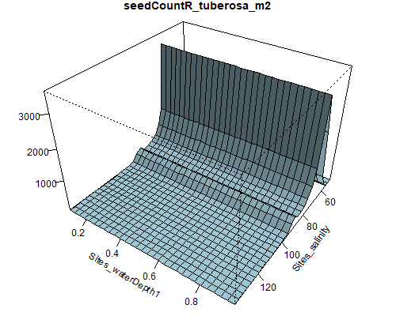
knitr::include_graphics("images/lagoon_habitat/NPMR_shoot_allperiod.png")
knitr::include_graphics("images/lagoon_habitat/NPMR_seagrassbiomass_allperiod.png")
```

<br>

```{r NPMRresult, echo=FALSE, message=FALSE, warning=FALSE}
theSheet <- read_excel('tables/habitat/AllTables.xlsx', sheet = 1)
kbl(theSheet[,1:7], caption = "Summary of nonparametric multiplicative regression results on the influence of salinity and water depth on *Ruppia* and macroalgae abundance. Tol: tolerance; Sens: sensitivity.", align = "c",escape=F) %>%
row_spec(0, background = "#14759e", bold = TRUE, color = "white") %>%
  kable_styling(full_width = F,font_size = 10) %>%
  column_spec(1, width = "15em")%>%
  column_spec(2, width = "11em")%>%
  column_spec(3, width = "11em")%>%
  scroll_box(fixed_thead = FALSE)
```

<br>

##### Macroalgae influences {.unnumbered}

As the presence of filamentous algae mats is thought to negatively
impact *Ruppia* growth by shading submerged plants and entangle
flowers/fruits potentially causing sexual reproductive failure
[@paton2018; @asano2020], a literature review and statistical analyses
on HCHB survey data were conducted on the relationship between *Ruppia*
abundance and macroalgae abundance in an attempt to quantify the effect
of macroalgae on *Ruppia* and improve model accuracy. Very limited
literature exists on the impact of macroalgae on seagrass that may
potentially be translated to the *Ruppia* model. A field experimental
study by @bittick2018 on the effect of *Ulva* biomass on *Zostera
marina* shoot density and growth indicated that *Zostera* shoot density
was negatively affected by *Ulva* biomass predictable by an exponential
decay function (Figure \@ref(fig:Bittick), while *Zostera* growth was
not affected. @irlandi2004 found that 100% drift algal cover for 2-3
months produced around 25% reduction in above ground seagrass biomass
(*Thalassia testudinum*). However, below-ground biomass, shoot density
or growth rate were not impacted.

```{r Bittick, echo = FALSE, fig.show="hold", out.width='100%', class = "text-image",  fig.cap = "Relationship between *Ulva* biomass and *Zostera marina* shoot density (Source: Bittick et al. 2018)."}

knitr::include_graphics("images/lagoon_habitat/Bittick2018.png")
```

<br>

During the HCHB survey filamentous algae largely co-occur with *Ruppia*
communities both spatially and temporally, and dense mats were observed
to be almost exclusively associated with the presence of macrophytes
[@lewis2022]. @lewis2022 identified that when estimated algae biomass
exceeded 184 g DW/m2, there was a significant reduction in macrophyte
biomass.As it was previously speculated that filamentous algal mats may
have a negative impact on the reproductive success of *Ruppia* by
entangling and breaking flower stalks away from the stem [@paton2018;
@asano2020], further analyses were conducted on the relationship between
algae biomass and various *Ruppia* life-stages to provide insights on
assigning appropriate threshold values to each *Ruppia* life-stage in
the habitat model. HCHB seasonal survey core data including seagrass
biomass, seagrass shoot count, *Ruppia* flower count and total turion
count during period when algae growth was most active (i.e., September -
December 2020 and December 2021, Figure \@ref(fig:phe-biomass)) were
averaged by site and summarised in boxplots against six levels of algae
biomass (estimated by converting algal severity index, conversion method
is described in @lewis2022). Results indicated that compared to overall
macrophyte biomass or density, flower density appeared to have a shaper
reduction as algae biomass reached 184 g DW/m^2^ (Figure
\@ref(fig:ruppia-algae)). Although this association may not indicate
causation, a lower maximum tolerance on algae was assigned to the
flowering stage than adult growth stage in the habitat model (Table
\@ref(tab:threshold)) based on the assumption that the impact of dense
algal mats is likely to be greater on the sexual reproductive success
than on vegetative growth. In contrast, turion density appeared to be
almost unaffected by high algae biomass (Figure
\@ref(fig:ruppia-algae)). However, it is unclear whether this was a
shift of reproductive strategy from aboveground (flowering) to
belowground (turion) when algae mats were dense, or other co-correlating
factors were at play. As a result, no threshold values were assigned for
turion formation in the model.

```{r ruppia-algae, echo = FALSE, fig.show="hold", out.width='100%',  class = "text-image",  fig.cap = "Boxplots for macrophyte biomass, macrophyte shoot count, *Ruppia* flower count and turion count against six levels of estimated algae biomass during September - December 2020 and December 2021."}

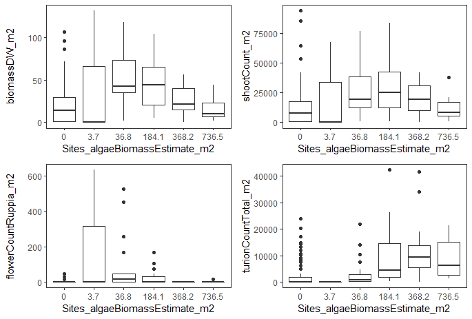
```

<br>

#### *Ruppia* extent within the lagoon

The distribution and abundance of *Ruppia* has been regularly monitored
in the Coorong since 1998. However, the types of data collected, the
sampling season, location and methods varied between programs. An
overview of the available historical and HBHC datasets is shown in
Figure \@ref(fig:dataavail).

```{r dataavail, echo = FALSE, out.width='100%', class = "text-image", fig.cap = "Overview of *Ruppia* survey datasets showing sampling periods and types of data collected (purple boxes, with HCHB data highlighted in yellow), versus habitat model output (HSI, blue boxes) on a timeline. For model output, life-stages involved in the integration of overall sexual reproduction success are shaded in light blue (with light blue dashed outline), and life-stages involved in the integration of overall asexual reproduction success are shaded in light green (with green dashed outline). Please note that the integration method shown reflects the updated *Ruppia* model (Generation 2.0), for detailed information on the differences between Generation 2.0 model and Generation 0 model (pre-HCHB) please refer to Section 8.1.4."}

knitr::include_graphics("images/lagoon_habitat/data_availability.png")
```

**Historical Monitoring** A summary of historical *Ruppia* monitoring
datasets (pre-2020) is shown in Table \@ref(tab:data-hist). Locations of
sampling sites are shown in Figure \@ref(fig:site-hist). <br>

```{r data-hist, echo=FALSE, message=FALSE, warning=FALSE}
theSheet <- read_excel('tables/habitat/AllTables.xlsx', sheet = 2)
kbl(theSheet[,1:4], caption = "Details of available *Ruppia* survey datasets prior to 2020 showing types of data collected, date range and number of sites surveyed. UA = University of Adelaide. MDBA = Murray-Darling Basin Authority. ORH = Optimising Ruppia Habitat project.", align = "l",escape = F) %>%
row_spec(0, background = "#14759e", bold = TRUE, color = "white") %>%
  kable_styling(bootstrap_options = "basic",full_width = F,font_size = 10) %>%
    scroll_box(fixed_thead = FALSE)
```

```{r site-hist, echo = FALSE, out.width='100%', class = "text-image", fig.cap = "*Ruppia* sampling sites for various monitoring program prior to 2020. Agency/program code under each map corresponds to those listed in Table 5.3. Turquoise outline represents the model boundary. Note that sampling sites of the last dataset listed in Table 5.3 are the same as UA MDBA_2."}

#knitr::include_graphics("images/lagoon_habitat/surveysites_hist.png")

```

{width="100%"}

**HCHB Monitoring** A summary of the HCHB monitoring datasets is shown
in Table \@ref(tab:data-hchb). Locations of sampling sites are shown in
Figure \@ref(fig:site-hchb). <br>

```{r data-hchb, echo=FALSE, message=FALSE, warning=FALSE}
theSheet <- read_excel('tables/habitat/AllTables.xlsx', sheet = 3)
kbl(theSheet[,1:4], caption = "Details of available *Ruppia* survey datasets for the HCHB program showing types of data collected, date range and number of sites surveyed. UA = University of Adelaide. HCHB = Healthy Coorong Healthy Basin project.", align = "l",escape = F) %>%
row_spec(0, background = "#14759e", bold = TRUE, color = "white") %>%
  kable_styling(bootstrap_options = "basic",full_width = F,font_size = 10) %>%
  scroll_box(fixed_thead = FALSE)
```

```{r site-hchb, echo = FALSE, out.width='100%', class = "text-image", fig.cap = "*Ruppia* sampling sites for the HCHB program. Agency/program code under each map corresponds to those listed in Table 5.4. Turquoise outline represents the model boundary."}

#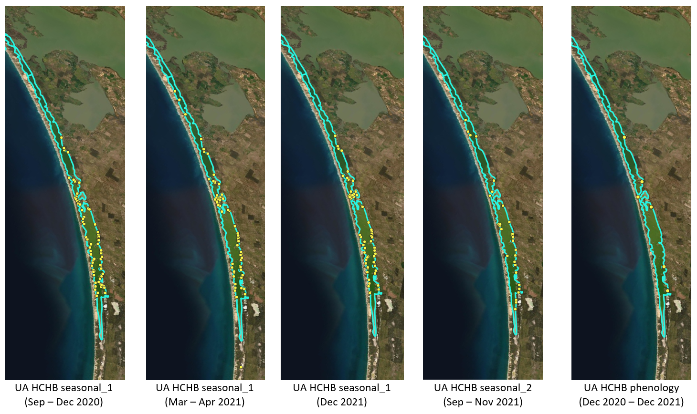
```

{width="100%"}

### Model application

This section describes both the Generation 0 model, which is the
original model developed before HCHB, and the Generation 2.0 model, which
was developed during HCHB.

#### Generation 0 model

The hydrodynamic-biogeochemical model TUFLOW-FV -- AED was used to
simulate hydrodynamic conditions (velocity, salinity, temperature and
water level), water clarity (light and turbidity) and the potential for
filamentous algae (nutrients and algae). Specifically, the HCHB V0.1
model was applied, configured using the specification of AED parameters
(...). The Coorong has a long residence time and to account for the
longer timescales of water and solute flux, multi-year simulations must
be performed. The habitat suitability functions for each environmental
variable of each *Ruppia* life-stage were determined based on literature
review and expert judgement (Table \@ref(tab:timewindow-0) and Table
\@ref(tab:threshold-0)), and used for the calculation of HSI for each
life-stage (Equation \@ref(eq:hab1) and Equation \@ref(eq:hab2)). The
HSI for each life-stage were integrated into an overall HSI for

-   Completing the sexual reproduction annual cycle by going through
    seed germination in autumn, adult growth in winter and flowering and
    seed set in spring; or
-   Completing the asexual reproduction annual cycle by going through
    turion sprouting in autumn, adult growth in winter and turion
    formation in spring. Specifically:

$$
\Phi^{HSI sexual}_{c} = \text{min}\left[\Phi^{HSI_{seed}}_{i},\Phi^{HSI_{adult}}_{i},\Phi^{HSI_{flower}}_{i} \right]_{c}
(\#eq:hab5)
$$

$$
\Phi^{HSI asexual}_{c} = \text{min}\left[\Phi^{HSI_{sprout}}_{i},\Phi^{HSI_{adult}}_{i},\Phi^{HSI_{turion}}_{i} \right]_{c}
(\#eq:hab6)
$$

<br>

```{r timewindow-0, echo=FALSE, message=FALSE, warning=FALSE}
theSheet <- read_excel('tables/habitat/AllTables.xlsx', sheet = 5)
kbl(theSheet[,1:4], caption = "Life-stage time windows over which environmental suitability for *Ruppia* is assessed.", align = "c",escape = F) %>%
row_spec(0, background = "#14759e", bold = TRUE, color = "white") %>%
  kable_styling(bootstrap_options = "basic",full_width = F,font_size = 10)
#  scroll_box(fixed_thead = FALSE)
```

<br>

```{r threshold-0, echo=FALSE, message=FALSE, warning=FALSE}
theSheet <- read_excel('tables/habitat/AllTables.xlsx', sheet = 7)
kbl(theSheet[,1:6], caption = "Environmental thresholds applied in the Gen 0 model for *Ruppia* life-stages based on past literature review and expert judgement.", align = "c",escape = F) %>%
row_spec(0, background = "#14759e", bold = TRUE, color = "white") %>%
  kable_styling(bootstrap_options = "basic",full_width = T,font_size = 10)
#  scroll_box(fixed_thead = FALSE)
```

<font size="1"> \*Provided that the wet days are not followed by \>8 dry
days (= unsuitable).</font> <font size="1"> Note: for Salinity,
Temperature, Light and Algal biomass, use 90-day rolling mean values for
the respective periods to interrogate the model outputs against these
thresholds</font> <br>

In these tests, the model was run from May 2013 to March 2019 using the
base case condition. The outputs of the model are maps of habitat
suitability of critical life stages (Figure \@ref(fig:ewater-HSIflower),
showing only the flowering stage in 2018), in response to light, depth,
salinity and filamentous algae presence, which in the end results in a
combined probability of sexual or asexual life-cycle completion (Figure
\@ref(fig:ewater-HSIsexual), showing only the overall HSI for the
completion of the sexual life cycle in 2018). The requirements for each
life stage are quite different, and when each is superimposed together,
the areas where life-cycle completion are limited to the margins of the
main lagoons, and the shallow areas around the central region. From year
to year, the area of good habitat changes, depending on that year's
eco-hydrodynamic regime.

```{r ewater-HSIflower, echo = FALSE, out.width='60%', class = "text-image", fig.cap = "Habitat suitability (HSI) for the flowering plant phase of *Ruppia tuberosa* in the Coorong as a function of salinity f(S), light f(l), water level f(WL), and presence of filamentous algae f(FA) for the Base Case in 2018.An HSI of 0 (dark purple) represents unsuitable habitat conditions, while an HSI of 1 represents optimal conditions (yellow)."}

knitr::include_graphics("images/lagoon_habitat/eWater_HSI flowering.png")
```

```{r ewater-HSIsexual, echo = FALSE, out.width='60%', class = "text-image", fig.cap = "Overall HSI for the successful completion of the sexual life cycle of *Ruppia tuberosa* calculated by integrating the HSI results for adult plants, flowering and seedset, and seed germination in the Coorong, for the Base Case in 2018. An HSI of 0 (dark purple) represents unsuitable habitat conditions, while an HSI of 1 represents optimal conditions (yellow)."}

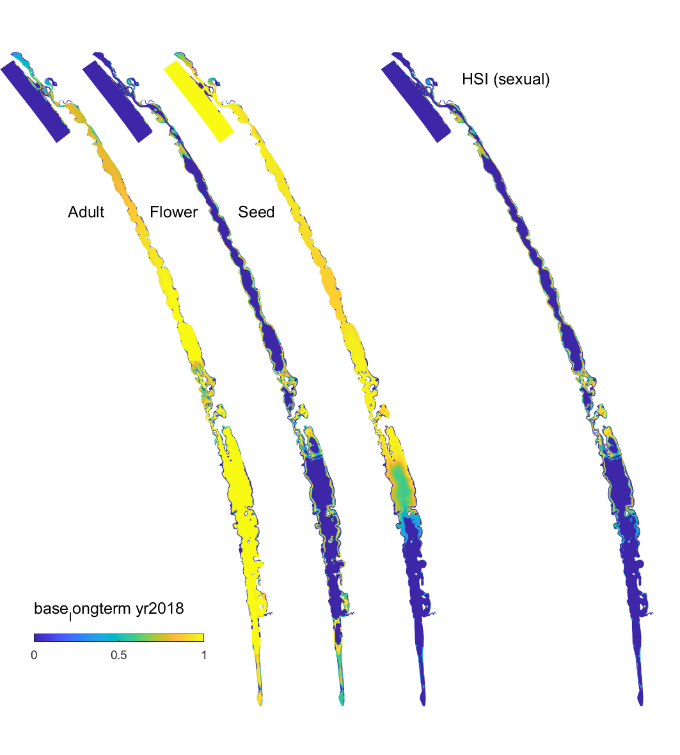

```

</center>

#### Generation 2.1 model

The hydrodynamic-biogeochemical model TUFLOW-FV -- AED was used to
simulate the hydrodynamic conditions (velocity, salinity, temperature
and water level), water clarity (light and turbidity) and the potential
for filamentous algae (nutrients and algae). Specifically, the HCHB
Generation 2.1 model was applied, configured using the specification of
AED parameters (...). The Coorong has a long residence time and to
account for the longer timescales of water and solute flux, multi-year
simulations must be performed. The habitat suitability functions for
each environmental variable of each *Ruppia* life-stage were determined
based on recent literature review, analyses of the HCHB survey data and
expert judgement (Table \@ref(tab:timewindow-2), Table
\@ref(tab:threshold-2), Appendix C), and used for the calculation of HSI
for each life-stage (Equation \@ref(eq:hab1) and Equation
\@ref(eq:hab2)). The HSI for each life-stage were integrated into

-   An overall HSI sexual, representing the integrated habitat
    suitability for *Ruppia* to complete its annual life cycle by
    reproducing sexually, i.e., flowering, which includes i) emerging in
    autumn, either from germination from seed or sprouting from viable
    turions that survived the summer; ii) vegetative growth to adult
    plants in winter; and iii) successful flowering and producing seed
    in spring; or

-   An overall HSI asexual, representing the integrated habitat
    suitability for *Ruppia* to complete its annual life cycle by
    reproducing asexually, i.e., forming turions, which includes i)
    emerging in autumn, either from germination from seed or sprouting
    from viable turions that survived the summer; ii) vegetative growth
    to adult plants in winter; and iii) formation of turions in spring.
    Specifically:

$$
\Phi^{HSI sexual}_{c} = \text{min}\left[\text{max}\left[\Phi^{HSI_{seed}}_{i},\text{min}\left[\Phi^{HSI_{viability}}_{i},\Phi^{HSI_{sprout}}_{i}\right]\right],\Phi^{HSI_{adult}}_{i},\Phi^{HSI_{flower}}_{i}\right]_{c}
(\#eq:hab7)
$$

$$
\Phi^{HSI asexual}_{c} = \text{min}\left[\text{max}\left[\Phi^{HSI_{seed}}_{i},\text{min}\left[\Phi^{HSI_{viability}}_{i},\Phi^{HSI_{sprout}}_{i}\right]\right],\Phi^{HSI_{adult}}_{i},\Phi^{HSI_{turion}}_{i}\right]_{c}
(\#eq:hab8)
$$

<br> This new HSI integration approach differs from the Generation 0
model in two ways:

1.  A new function, turion viability was added to the model for the
    summer dormancy period and integrated in the HSI calculation before
    turion sprouting to exclude areas where salinity levels were
    sufficiently high to cause ion toxicity in turions during summer.
    @kim2013 showed that after exposure to high salinities for 60 days,
    most turions lost viability and failed to sprout after being
    transferred back to fresher conditions. In comparison, seed
    viability was not negatively affected by high salinities.

2.  For the beginning of *Ruppia*'s life cycle in autumn, the
    probability of both seed germination and turion sprouting are
    included in both sexual and asexual pathways, whereas in the
    previous version, seed germination was exclusive to the calculation
    of HSI sexual and turion sprouting exclusive to HSI asexual. The
    rationale behind this change is because *Ruppia* individuals that
    ended up flowering may not necessarily have started from seed
    germination but could be from turion sprouting. Likewise, *Ruppia*
    individuals that formed turions in the end could have started from
    seed germination. <br>

```{r timewindow-2, echo=FALSE, message=FALSE, warning=FALSE}
theSheet <- read_excel('tables/habitat/AllTables.xlsx', sheet = 6)
kbl(theSheet[,1:5], caption = "Life-stage time windows over which environmental suitability for *Ruppia* is assessed. Refer to Section 8.1.3.1 for details on rationale.", align = "c",escape = F) %>%
row_spec(0, background = "#14759e", bold = TRUE, color = "white") %>%
  kable_styling(bootstrap_options = "basic",full_width = F,font_size = 10)
#  scroll_box(fixed_thead = FALSE)
```

<br>

```{r threshold-2, echo=FALSE, message=FALSE, warning=FALSE}
theSheet <- read_excel('tables/habitat/AllTables.xlsx', sheet = 8)
kbl(theSheet[,1:6], caption = "Environmental thresholds applied in the Gen 2.0 model for *Ruppia* life-stages based on recent literature review, HCHB survey data and expert judgement. Refer to Section 8.1.3.1 and Appendix C for more details on each function and rationale.", align = "c",escape = F) %>%
row_spec(0, background = "#14759e", bold = TRUE, color = "white") %>%
  kable_styling(bootstrap_options = "basic",full_width = T,font_size = 10)
#  scroll_box(fixed_thead = FALSE)
```

<font size="1"> \*Provided that the wet days are not followed by \>8 dry
days (= unsuitable).</font>

<br> In these tests, the model was run from July 2017 to Nov 2022 using
the base case condition. The outputs of the model are maps of habitat
suitability of critical life stages (Figure \@ref(fig:Gen2-HSIflower)),
showing only the flowering stage in 2020), in response to light, depth,
salinity, temperature and filamentous algae presence, which in the end
results in a combined probability of sexual or asexual life-cycle
completion (Figure \@ref(fig:Gen2-HSIsexual), showing only the overall
HSI for the completion of the sexual life cycle in 2020). The
requirements for each life stage are quite different, and when each is
superimposed together, the areas where life-cycle completion are limited
to the margins of the main lagoons, and the shallow areas around the
central region. From year to year, the area of good habitat changes,
depending on that year's eco-hydrodynamic regime.

```{r Gen2-HSIflower, echo = FALSE, out.width='60%', class = "text-image", fig.cap = "Habitat suitability (HSI) for the flowering plant phase of *Ruppia tuberosa* in the Coorong as a function of salinity f(S), light f(l), water level f(WL), temperature f(T) and presence of filamentous algae f(FA) for the base case in 2020. An HSI of 0 (dark purple) represents unsuitable habitat conditions, while an HSI of 1 represents optimal conditions (yellow)."}

knitr::include_graphics("images/lagoon_habitat/Gen2_HSI_flower.png")
```

```{r Gen2-HSIsexual, echo = FALSE, out.width='60%', class = "text-image", fig.cap = "Overall HSI for the successful completion of the sexual life cycle calculated by integrating the HSI results for seed germination, turion viability and turion sprouting, adult plants, and flowering and seed set in the Coorong, for the Base Case in 2020. An HSI of 0 (dark purple) represents unsuitable habitat conditions, while an HSI of 1 represents optimal conditions (yellow)."}

knitr::include_graphics("images/lagoon_habitat/Gen2_HSI_sexual.png")

```

<br>

### Model results and assessment

To assess the accuracy of model predictions, the habitat suitability
maps produced above were compared with *Ruppia* field survey results for
both distribution and abundance, including several types of plant
materials (e.g., shoot, seed, turion) which were used to validate HSI of
different life-stages. In addition to a visual assessment, regression
analyses were conducted in R studio between HSI values and *Ruppia*
abundance for each life-stage over relevant periods. In general, this
was done by overlaying *Ruppia* spatial data on HSI maps, creating a
buffer around each sampling site, averaging HSI values in each model
cell that fall within this buffer, and comparing with *Ruppia*
abundance. <br> The specific validation approach has evolved as the
project progresses with more data becoming available, model updates
implemented, and more insights revealed. For example, the strategies for
pairing specific plant material recorded in the field with HSI output of
a particular life-stage (e.g. seed abundance in Mar vs. HSI flowering in
Sep the previous year) and its appropriate timing has initially been
explored extensively. Table \@ref(tab:validversion) summarises the
various major validation versions, including their data source, model
version and methodology. Details of methods and results of the latest
version 'HCHB_Gen 2.1', in which the Gen 2.1 model were implemented are
described below. Details of assessments of previous versions and
evolution of validation approaches are included in Appendix C. <br>

```{r validversion, echo=FALSE, message=FALSE, warning=FALSE}
theSheet <- read_excel('tables/habitat/AllTables.xlsx', sheet = 9)
kbl(theSheet[,1:9], caption = "Validation versions for the *Ruppia* model showing their data source, model version and validation methodology. Gen 0: Generation 0 model; Gen 2.0: Generation 2.0 model; Gen 2.1: Generation 2.1 model; ‘default’ model output timeframe: the output HSI results were integrated across the entire period of relevant life-stage (e.g. HSI flowering by default is an integration of environmental conditions over Aug – Dec); ‘tailored’ model output timeframe: the output HSI results were integrated only up to the survey period (e.g. to validate against field surveys conducted in Sep, HSI flowering Sep is an integration of environmental conditions over Aug – Sep only).", align = "c",escape = F) %>%
  add_header_above(c(" " = 3, "Ruppia model" = 3, "Validation methodology" = 3))%>%
#row_spec(0, background = "#14759e", bold = TRUE, color = "white") %>%
  column_spec(2, width = "13em")%>%
  column_spec(6, width = "8em")%>%
  kable_styling(bootstrap_options = "basic",full_width = T,font_size = 10)
#  scroll_box(fixed_thead = FALSE)
```

<font size="1"> \*Excludes turion viability function </font> <br>

<br>

#### HCHB Gen 2.1 validation {.unnumbered}

<br> Ruppia survey data and associated model output used for the Gen 2.1
model assessment as well as model error metrics are summarised in Table \@ref(tab:validpairs), and results
described in following subsections. In addition to Spearman's rank correlation
coefficients (*rs*), two additional error metrics were calculated:

- overall goodness-of-fit (*fit*), expressed as % of all survey sites, was calculated by

$$
fit = \frac{\text{number of instances of True Positive + number of instances of  True Negative}}{\text{total number of instances}}*100
$$
Where True Positive (TP) refers to sites where Ruppia density is greater than the median density of all sites surveyed in that season and modelled HSI > 0.5, while True Negative (TN) refers to sites where Ruppia density is lower than the median density and modelled HSI ≤ 0.5. 

- *score*, calculated by 

$$
score = \frac{\text{proportion of sites containing major biomass within suitable habitat}}{\text{proportion of survey sites containing suitable habitat}}
$$
Where sites containing major biomass refers to sites where Ruppia density is greater than the median density of all sites surveyed in that season; and suitable habitat refers to HSI > 0.5. The model prediction is informative if score > 1, whereas if score ≤ 1 Ruppia is randomly distributed.

Note that while Gen 2.1 hydrodynamic model was extended to 2022 with a refined mesh, *Ruppia* model performance was assessed up to 2021 only since field data were unavailable for 2022.


-- to be updated--

Overall, implementation of the
*Ruppia* Gen II model has improved validation scores on most life-cycle
phases, in particular field turion abundance versus modelled HSI for
asexual reproduction due to a major update on the turion environmental
threshold parameters. In most cases, model achieved a higher validation
score in the south lagoon compared to the whole lagoon, which offers a
higher confidence in assessing potential management options that are
focused in the south. Model performance was significantly better in 2020
than in 2021 (for all validation pairs in the whole lagoon: average R =
0.4 in 2020 versus R = 0.11 in 2021). The lower scores in 2021 may be
due to 1) an unusually cool and wet conditions experienced in the
winter/spring 2021 that has delayed the *Ruppia* life cycle,
particularly the flowering phase which may be triggered by rising
temperature (Waycott 2022, pers.comm.), the threshold of which is
currently unknown; 2) quantitative field surveys were conducted in Dec
only in 2021 due to accessibility issues in extremely wet conditions
prior to Dec, instead of between Sep and Dec in 2020.

```{r validpairs, echo=FALSE, message=FALSE, warning=FALSE}
# library(kableExtra)
# library(readxl)
theSheet <- read_excel('tables/habitat/AllTables.xlsx', sheet =14)

kbl(theSheet[,1:10], digits = 2, caption = "Summary of *Ruppia* survey data with their corresponding model output used for validation of the Gen 2.1 model, and Spearman's rank correlation  (rs), fit and score between field abundance and modelled Habitat Suitability Index (HSI).", align = "l",escape = F) %>%  #escape controls whether the syntax in table is interpreted
  row_spec(0, background = "#14759e", bold = TRUE, color = "white") %>%
  kable_styling(bootstrap_options = "basic", full_width = T,font_size = 10) 
  # column_spec(1, width = "12em")%>%
  # column_spec(2, width = "12em")%>%
  # column_spec(4, width = "10em")%>%
#  scroll_box(fixed_thead = FALSE) %>%
```

<br>

**i. Field shoot count Sep 2020 (obs) vs. HSI seed germination + turion
viability + turion sprouting + adult growth Sep 2020 (model)**

Average number of seagrass shoots per square meter recorded in Sep - Dec
2020 (reproductive period) were compared with combined HSI for seed
germination, turion sprouting and adult growth up to end of Sep in the
same year (Figure \@ref(fig:hchb-shoot2020map) and
\@ref(fig:hchb-shoot2020)). The Gen II model update has resulted in
slightly higher validation scores (correlation coefficient) than that of
the Gen 0 model. The overall distribution of shoots was consistent with
model prediction. Seagrass density around the middle lagoon and north
lagoon were higher, where HSI predictions were highest.

<!-- # ```{r hchb-shoot2020map, echo = FALSE, out.width='100%', class = "text-image", fig.cap = "Average seagrass shoot count per square meter in Sep – Dec 2020 (circles) overlaid on HSI model output for germination, sprouting and adult growth integrated over Jan - Sep 2020. An HSI of 0 (dark purple) represents unsuitable habitat conditions, while an HSI of 1 represents optimal conditions (yellow)."} -->
<!-- # knitr::include_graphics("images/lagoon_habitat/shoot2020_germspradt2020_map.png") -->
<!-- # ``` -->

```{r hchb-shoot2020, echo = FALSE, out.width='100%', class = "text-image", fig.cap = "Scatter plot and boxplot of average seagrass shoot count per square meter in Sep – Dec 2020 versus HSI model output for germination, sprouting and adult growth integrated over Jan - Sep 2020. Top panel: the entire lagoon (red: north, blue: south), bottom panel: south lagoon. An HSI of 0 represents unsuitable habitat conditions, while an HSI of 1 represents optimal conditions. Vertical dashed line: median count; horizontal dashed line: HSI = 0.5, above which the habitat is classified as ‘preferred habitat’; points within light shaded area: True Positive; points within dark shaded area: True Negative."}

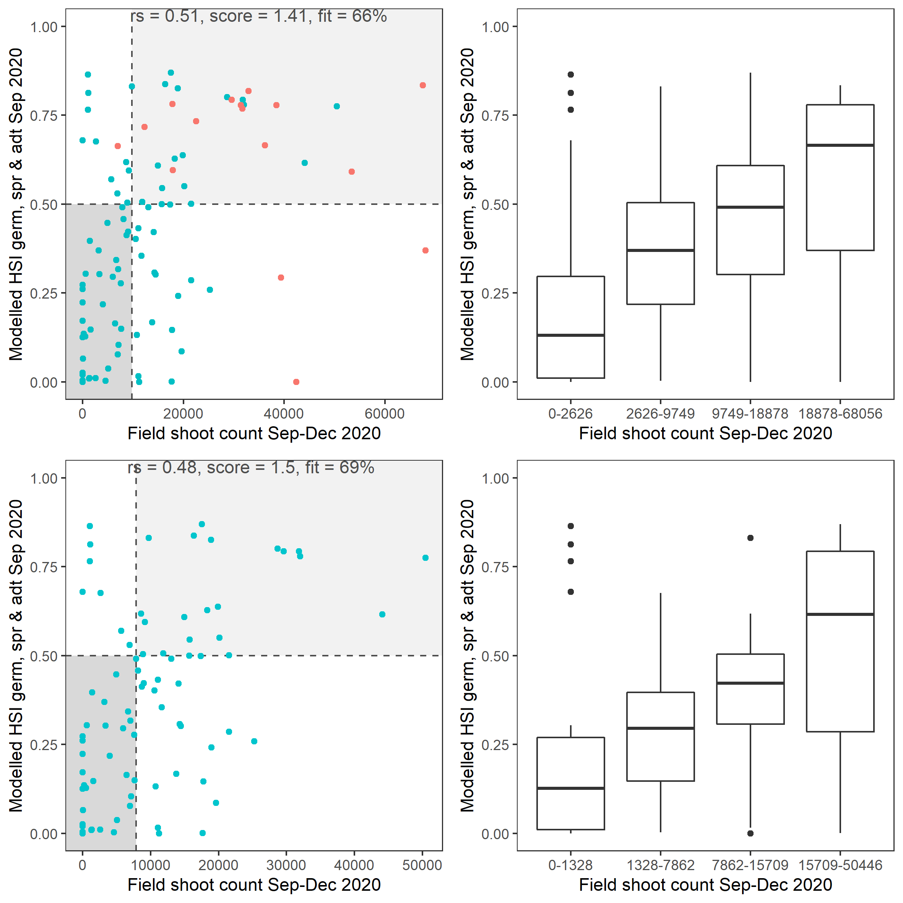

```

<br>

**ii. Field flower count Sep 2020 (obs) vs. HSI sexual Oct 2020
(model)**

Average number of *Ruppia* flower per square meter recorded in Sep - Dec
2020 (reproductive period) were compared with overall HSI for sexual
reproduction up to end of Oct in the same year (Figure
\@ref(fig:hchb-flower2020map) and \@ref(fig:hchb-flower2020)). The Gen
II has similar validation scores of the Gen 0 model. The overall
distribution of flowers was consistent with model prediction. Highest
density of flowers was found in the north lagoon where HSI predictions
were highest. Almost no flowers were recorded in the south lagoon, where
HSI predictions were low.

<!-- # ```{r hchb-flower2020map, echo = FALSE, out.width='100%', class = "text-image", fig.cap = "Average *Ruppia* flower count per square meter in Sep – Dec 2020 (circles) overlaid on HSI model output for overall sexual reproduction integrated over Jan – Oct 2020. An HSI of 0 (dark purple) represents unsuitable habitat conditions, while an HSI of 1 represents optimal conditions (yellow)."} -->
<!-- #  -->
<!-- # knitr::include_graphics("images/lagoon_habitat/flower2020_sexual2020_map.png") -->
<!-- #  -->
<!-- # ``` -->

```{r hchb-flower2020, echo = FALSE, out.width='100%', class = "text-image", fig.cap = "Scatter plot and boxplot of average *Ruppia* flower count per square meter in Sep – Dec 2020 versus HSI model output for overall sexual reproduction integrated over Jan - Oct 2020. Top panel: the entire lagoon (red: north, blue: south), bottom panel: south lagoon. An HSI of 0 represents unsuitable habitat conditions, while an HSI of 1 represents optimal conditions.Vertical dashed line: median count; horizontal dashed line: HSI = 0.5, above which the habitat is classified as ‘preferred habitat’; points within light shaded area: True Positive; points within dark shaded area: True Negative."}

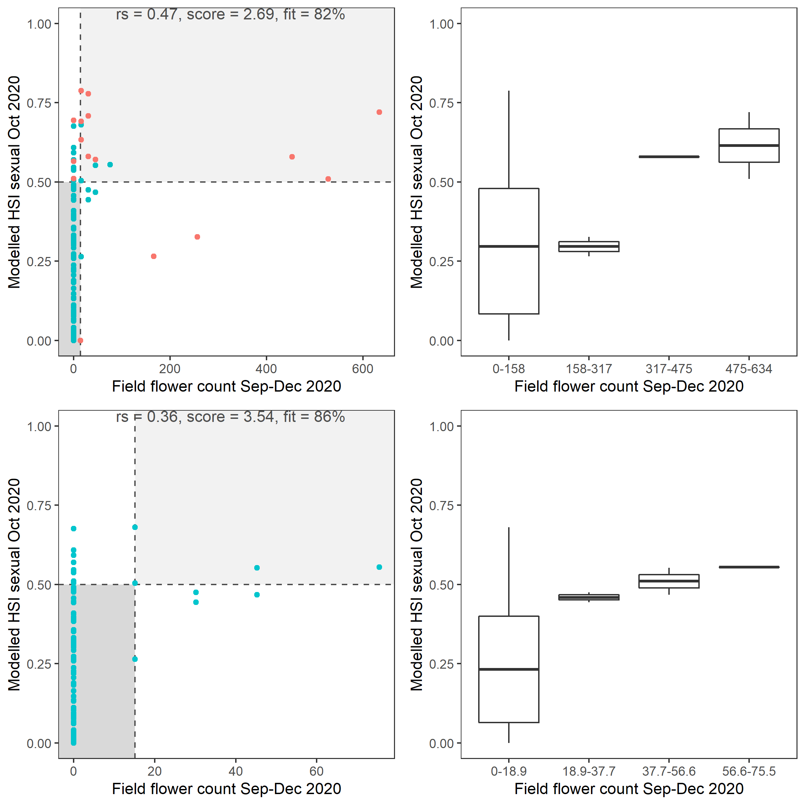

```

<br>

**iii. Field seed count Mar 2021 (obs) vs. HSI sexual Dec 2020 (model)**

Average number of *Ruppia tuberosa* seed per square meter recorded in
Mar - Apr 2021 (aestivation period) were compared with overall HSI for
sexual reproduction in 2020 (Figure \@ref(fig:hchb-seed2021map) and
\@ref(fig:hchb-seed2021)). The Gen II model update has resulted in
better validation scores than the Gen 0 model, especially in the south
lagoon. It's important to note that seeds have the potential to disperse
with water current/wind therefore its distribution and abundance may be
less predictable than other plant materials.

<!-- # ```{r hchb-seed2021map, echo = FALSE, out.width='100%', class = "text-image", fig.cap = "Average *Ruppia tuberosa* seed count per square meter in Mar – Apr 2021 (circles) overlaid on HSI model output for overall sexual reproduction integrated over Jan – Dec 2020. An HSI of 0 (dark purple) represents unsuitable habitat conditions, while an HSI of 1 represents optimal conditions (yellow)."} -->
<!-- #  -->
<!-- # 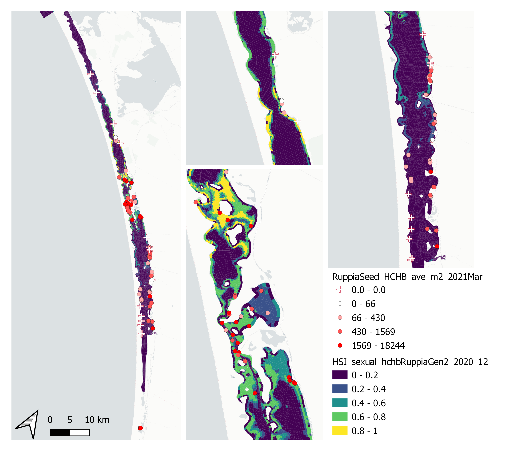 -->
<!-- # ``` -->

```{r hchb-seed2021, echo = FALSE, out.width='100%', class = "text-image", fig.cap = "Scatter plot and boxplot of average *Ruppia tuberosa* seed count per square meter in Mar – Apr 2021 versus HSI model output for overall sexual reproduction integrated over Jan - Dec 2020. Top panel: the entire lagoon (red: north, blue: south), bottom panel: south lagoon. An HSI of 0 represents unsuitable habitat conditions, while an HSI of 1 represents optimal conditions. Vertical dashed line: median count; horizontal dashed line: HSI = 0.5, above which the habitat is classified as ‘preferred habitat’; points within light shaded area: True Positive; points within dark shaded area: True Negative."}

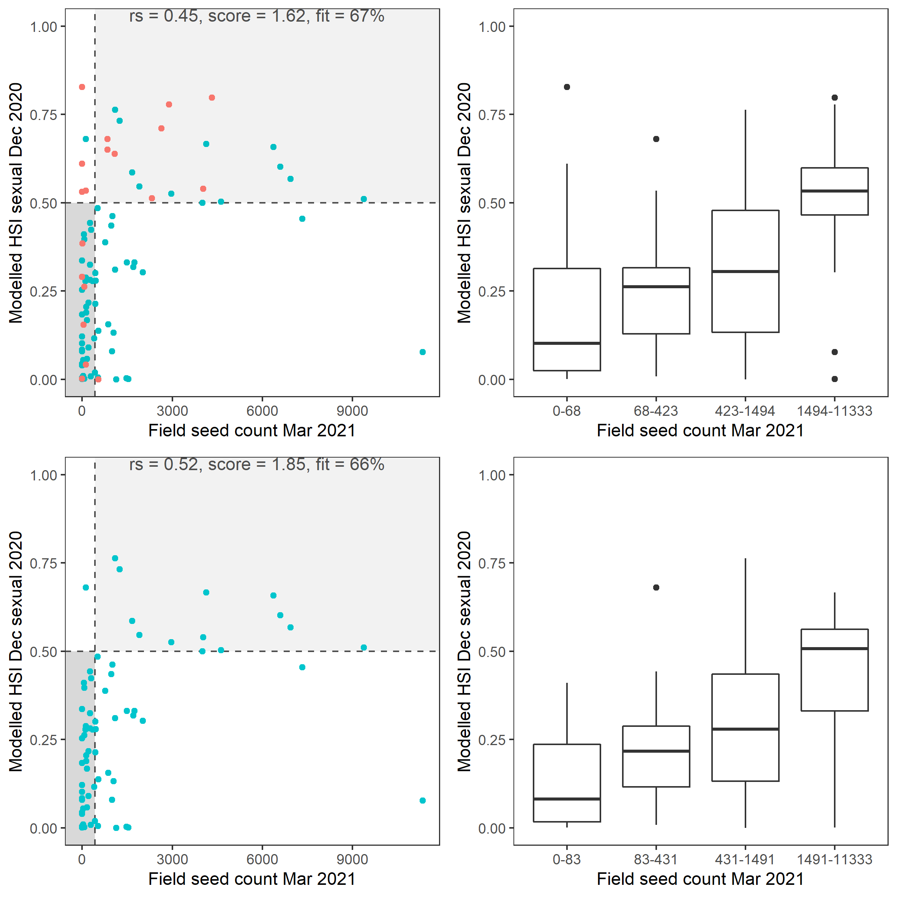
```

<br>

**iv. Field turion count Sep 2020 (obs) vs. HSI asexual Oct 2020
(model)**

Average number of *Ruppia* turion (type I and II) per square meter
recorded in Sep - Dec 2020 (reproductive period) were compared with
overall HSI for asexual reproduction up to end of Oct in the same year
(Figure \@ref(fig:hchb-turion2020map) and \@ref(fig:hchb-turion2020)).
The Gen II model update has significantly improved validation scores
compared to the Gen 0 model due to a major change in salinity threshold
parameter. The overall distribution of turions agreed with model
prediction in that more turions were found around the middle lagoon and
northern end of south lagoon, where HSI were highest.

<!-- # ```{r hchb-turion2020map, echo = FALSE, out.width='100%', class = "text-image", fig.cap = "Average *Ruppia* turion count per square meter in Sep – Dec 2020 (circles) overlaid on HSI model output for overall asexual reproduction integrated over Jan – Oct 2020. An HSI of 0 (dark purple) represents unsuitable habitat conditions, while an HSI of 1 represents optimal conditions (yellow)."} -->
<!-- #  -->
<!-- # knitr::include_graphics("images/lagoon_habitat/turion2020_asexual2020_map.png") -->
<!-- # ``` -->

```{r hchb-turion2020, echo = FALSE, out.width='100%', class = "text-image", fig.cap = "Scatter plot and boxplot of average *Ruppia* turion count per square meter in Sep – Dec 2020 versus HSI model output for overall asexual reproduction integrated over Jan - Oct 2020. Top panel: the entire lagoon (red: north, blue: south), bottom panel: south lagoon. An HSI of 0 represents unsuitable habitat conditions, while an HSI of 1 represents optimal conditions. Vertical dashed line: median count; horizontal dashed line: HSI = 0.5, above which the habitat is classified as ‘preferred habitat’; points within light shaded area: True Positive; points within dark shaded area: True Negative."}

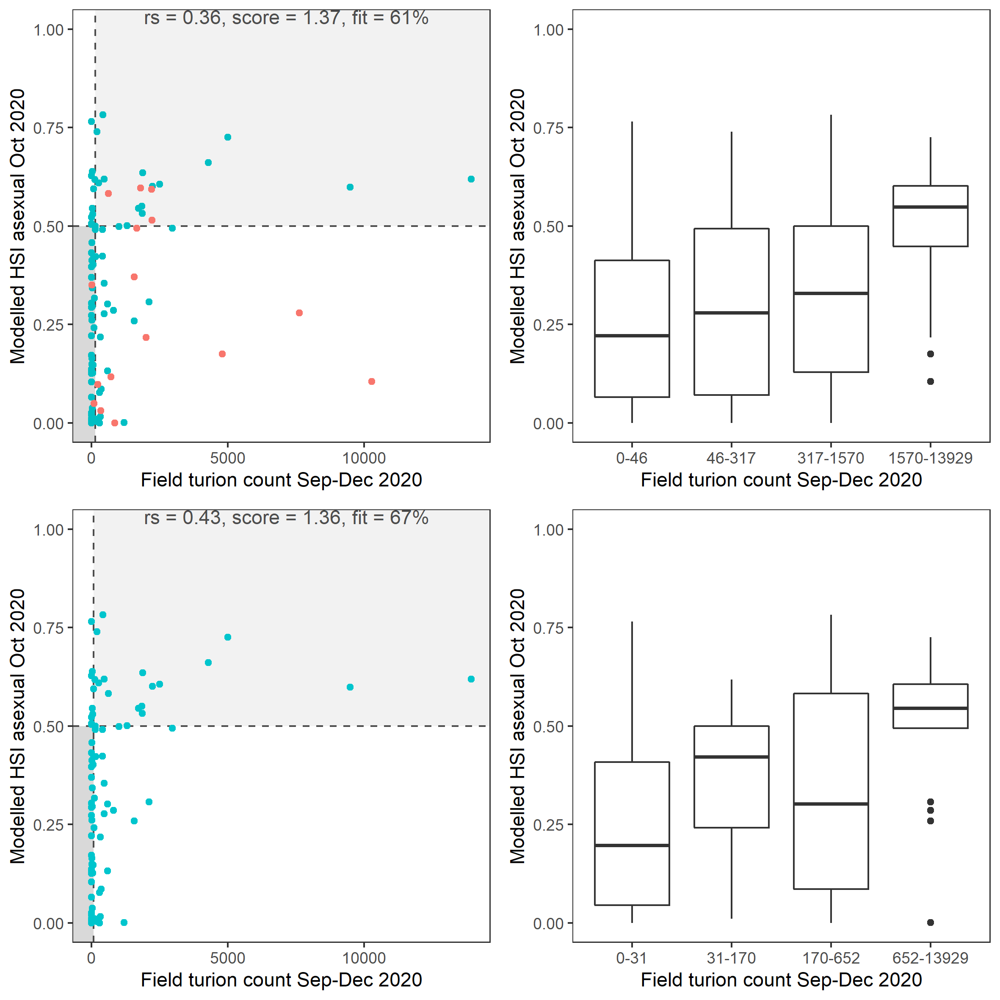
```

<br>

**v. Field shoot count Dec 2021 (obs) vs. HSI seed germination + turion
viability + turion sprouting + adult growth Sep 2021 (model)**

Average number of seagrass shoots per square meter recorded in Dec 2021
(reproductive period) were compared with combined HSI for seed
germination, turion sprouting and adult growth up to end of Sep in the
same year (Figure \@ref(fig:hchb-shoot2021map) and
\@ref(fig:hchb-shoot2021)). The validation scores of 2021 were lower
than that of 2020, possibly due to the environmental conditions
experienced in winter-spring 2021 (including unusually cool and wet
conditions), which may have caused a delay in the *Ruppia* life cycle
(Waycott 2022, pers. comm.).

<!-- # ```{r hchb-shoot2021map, echo = FALSE, out.width='100%', class = "text-image", fig.cap = "Average seagrass shoot count per square meter in Dec 2021 (circles) overlaid on HSI model output for germination, sprouting and adult growth integrated over Jan - Sep 2021. An HSI of 0 (dark purple) represents unsuitable habitat conditions, while an HSI of 1 represents optimal conditions (yellow)."} -->
<!-- #  -->
<!-- # knitr::include_graphics("images/lagoon_habitat/shoot2021_germspradt2021_map.png") -->
<!-- # ``` -->

```{r hchb-shoot2021, echo = FALSE, out.width='100%', class = "text-image", fig.cap = "Scatter plot and boxplot of average seagrass shoot count per square meter in Dec 2021 versus HSI model output for germination, sprouting and adult growth integrated over Jan - Sep 2020. Top panel: the entire lagoon (red: north, blue: south), bottom panel: south lagoon. An HSI of 0 represents unsuitable habitat conditions, while an HSI of 1 represents optimal conditions. Vertical dashed line: median count; horizontal dashed line: HSI = 0.5, above which the habitat is classified as ‘preferred habitat’; points within light shaded area: True Positive; points within dark shaded area: True Negative."}

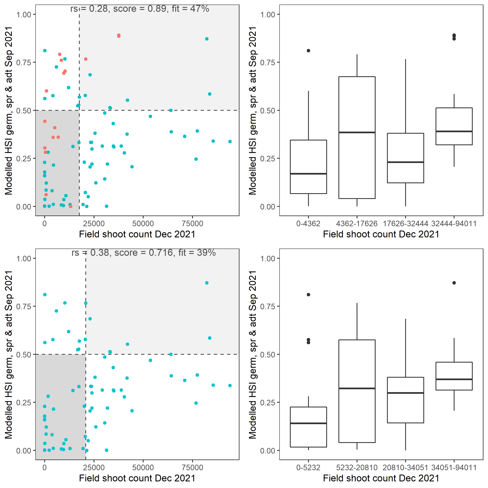
```

<br>

**vi. Field flower count Dec 2021 (obs) vs. HSI sexual Dec 2021
(model)**

Average number of *Ruppia* flowers per square meter recorded in Dec 2021
(reproductive period) were compared with overall HSI for sexual
reproduction in 2021 (Figure \@ref(fig:hchb-flower2021map) and
\@ref(fig:hchb-flower2021)). The validation scores of 2021 were lower
than that of 2020, possibly due to the environmental conditions
experienced in winter-spring 2021 (including unusually cool and wet
conditions), which may have caused a delay in the *Ruppia* life cycle
(Waycott 2022, pers. comm.). Overall very few flowers were recorded in
the 2021 reproductive period. It was speculated that flowering may be
triggered by warming temperature (Waycott 2022, pers. comm.), the
threshold of which remains unclear (in the current model the temperature
threshold for flowering is assumed to be the same as vegetative growth).

<!-- # ```{r hchb-flower2021map, echo = FALSE, out.width='100%', class = "text-image", fig.cap = "Average *Ruppia* flower count per square meter in Dec 2021 (circles) overlaid on HSI model output for overall sexual reproduction integrated over Jan – Dec 2021. An HSI of 0 (dark purple) represents unsuitable habitat conditions, while an HSI of 1 represents optimal conditions (yellow)."} -->
<!-- #  -->
<!-- # knitr::include_graphics("images/lagoon_habitat/flower2021_sexual2021_map.png") -->
<!-- # ``` -->

```{r hchb-flower2021, echo = FALSE, out.width='100%', class = "text-image", fig.cap = "Scatter plot and boxplot of average *Ruppia* flower count per square meter in Dec 2021 versus HSI model output for overall sexual reproduction integrated over Jan – Dec 2021. Top panel: the entire lagoon (red: north, blue: south), bottom panel: south lagoon. An HSI of 0 represents unsuitable habitat conditions, while an HSI of 1 represents optimal conditions. Vertical dashed line: median count; horizontal dashed line: HSI = 0.5, above which the habitat is classified as ‘preferred habitat’; points within light shaded area: True Positive; points within dark shaded area: True Negative."}

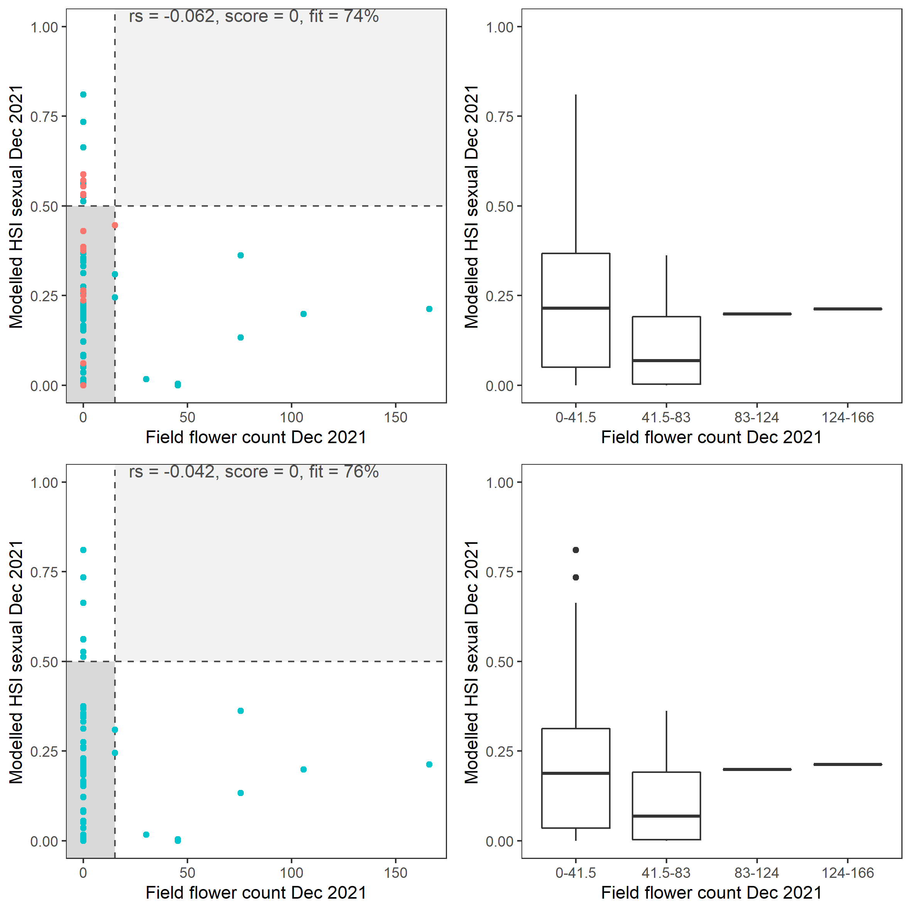
```

<br>

**vii. Field seed count Dec 2021 (obs) vs. HSI sexual Dec 2021 (model)**

Average number of *Ruppia tuberosa* seeds per square meter recorded in
Dec 2021 (reproductive period) were compared with overall HSI for sexual
reproduction in 2021 (Figure \@ref(fig:hchb-seed2021map-2) and
\@ref(fig:hchb-seed2021-2)). The validation scores of 2021 were lower
than that of 2020. This is as expected, since flowering activity was
markedly delayed in 2021 and would not have set seed in Dec yet.

<!-- # ```{r hchb-seed2021map-2, echo = FALSE, out.width='100%', class = "text-image", fig.cap = "Average *Ruppia tuberosa* seed count per square meter in Dec 2021 (circles) overlaid on HSI model output for overall sexual reproduction integrated over Jan – Dec 2021. An HSI of 0 (dark purple) represents unsuitable habitat conditions, while an HSI of 1 represents optimal conditions (yellow)."} -->
<!-- #  -->
<!-- # knitr::include_graphics("images/lagoon_habitat/seed2021_sexual2021_map.png") -->
<!-- # ``` -->

```{r hchb-seed2021-2, echo = FALSE, out.width='100%', class = "text-image", fig.cap = "Scatter plot and boxplot of average *Ruppia tuberosa* seed count per square meter in Dec 2021 versus HSI model output for overall sexual reproduction integrated over Jan - Dec 2021. Top panel: the entire lagoon (red: north, blue: south), bottom panel: south lagoon. An HSI of 0 represents unsuitable habitat conditions, while an HSI of 1 represents optimal conditions. Vertical dashed line: median count; horizontal dashed line: HSI = 0.5, above which the habitat is classified as ‘preferred habitat’; points within light shaded area: True Positive; points within dark shaded area: True Negative."}

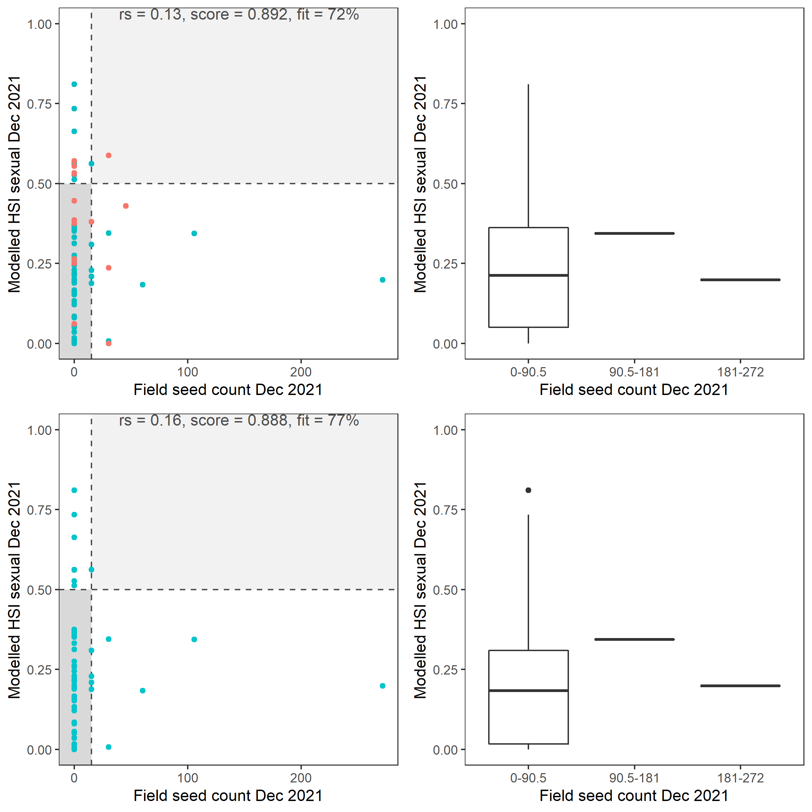
```

<br>

**viii. Field turion count Dec 2021 (obs) vs. HSI asexual Dec 2021
(model)**

Average number of *Ruppia* turion (type I and II) per square meter
recorded in Dec 2021 (reproductive period) were compared with overall
HSI for asexual reproduction in 2021 (Figure
\@ref(fig:hchb-turion2021map) and \@ref(fig:hchb-turion2021)).
Validation scores for 2021 is markedly higher than in 2020. The overall
distribution of turions agreed with model prediction in that more
turions were found around the middle lagoon and northern half of south
lagoon, where HSI were higher.

<!-- # ```{r hchb-turion2021map, echo = FALSE, out.width='100%', class = "text-image", fig.cap = "Average *Ruppia* turion count per square meter in Dec 2021 (circles) overlaid on HSI model output for overall asexual reproduction integrated over Jan – Dec 2021. An HSI of 0 (dark purple) represents unsuitable habitat conditions, while an HSI of 1 represents optimal conditions (yellow)."} -->
<!-- #  -->
<!-- # knitr::include_graphics("images/lagoon_habitat/turion2021_asexual2021_map.png") -->
<!-- # ``` -->

```{r hchb-turion2021, echo = FALSE, out.width='100%', class = "text-image", fig.cap = "Scatter plot and boxplot of average *Ruppia* turion count per square meter in Dec 2021 versus HSI model output for overall asexual reproduction integrated over Jan - Dec 2021. Top panel: the entire lagoon (red: north, blue: south), bottom panel: south lagoon. An HSI of 0 represents unsuitable habitat conditions, while an HSI of 1 represents optimal conditions. Vertical dashed line: median count; horizontal dashed line: HSI = 0.5, above which the habitat is classified as ‘preferred habitat’; points within light shaded area: True Positive; points within dark shaded area: True Negative."}

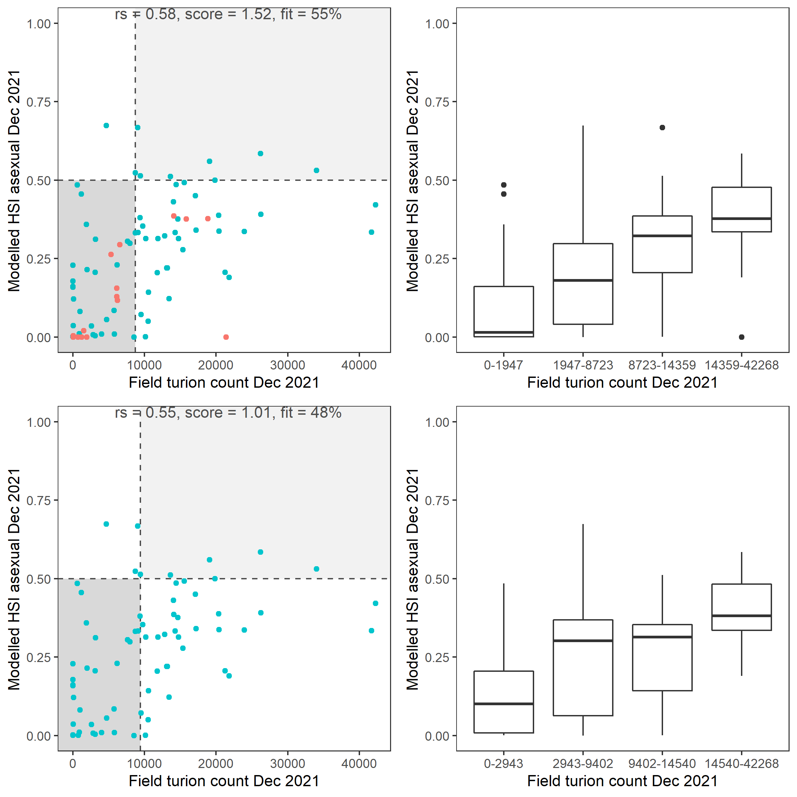
```

<br>

### Summary

We undertook an extensive review of historical and HCHB *Ruppia*
monitoring data and literature review on environmental influences
including the effect of macroalgae on all *Ruppia* life-stages. We also
conducted statistical analyses on *Ruppia* phenology and distribution
data in relation to salinity, water depth and macroalgae abundance.
Based on literature review, data analyses and on-going model assessment,
we have developed the Ruppia Gen II model by 1) refining relevant
environmental threshold parameters and time windows for all *Ruppia*
life-stages, with a new life-stage function (turion viability) added to
the model; 2) improving life-stage integration approach in the model. We
have also for the first time developed an approach for validating model
output against field data. <br> Model performance was overall
satisfactory, where areas with higher HSI predicted by the model aligned
with higher abundance recorded in the field in most cases. The
implementation of Gen II model has improved validation metrics for most
life stages, especially turion abundance versus HSI for asexual
reproduction. In most cases, model achieved a higher validation score in
the south lagoon compared to the whole lagoon, which offers higher
confidence in assessing potential management options that are focused in
the south. The year-to-year variability in model performance, however,
implicates that there were likely environmental factors influencing the
distribution and abundance of *Ruppia* and its life phases that were not
accounted for in the model, such as environmental cues for flowering
event, which may include elevated temperature and photoperiod. Similar
for other life stages, statistical analysis conducted on HCHB survey
data showed that only a small portion of the variances in the
distribution of seagrass biomass (23%), *Ruppia* seeds (6.8%) and turion
(13%) could be explained by salinity, depth, elevation, algae biomass,
and distance to Murray Mouth [@lewis2022]. Although the unexplained
variances remain a knowledge gap, it is important to note that our
Ruppia model focuses on the potential suitability of habitats based on
environmental factors and does not take into account biotic interactions
such as foraging by birds. Our model focuses on the annual life cycle of
*Ruppia*, while it was observed during the HCHB surveys that there
exists a perennial *Ruppia* community in the Coorong [@lewis2022] which
may cause some mismatch between the modelled and observed *Ruppia*
presence. However what factors contribute to *Ruppia* community
persisting through the aestivation period is unclear and could
potentially be integrated into our model in the future.

<br><br>

------------------------------------------------------------------------

<br>

## Habitat modelling - **Fish**

### Overview

The high salinity values experienced in times of low freshwater flows
challenges the fish populations that inhabit the lagoon. As an indicator
of suitable conditions, the fish model calculates probabilities of
habitat suitability for juveniles of seven key species, mulloway
(*Argyrosomus japonicus*), black bream (*Acanthopagrus butcheri*),
greenback flounder (*Rhombosolea tapirina*), yelloweye mullet
(*Aldrichetta forsteri*), congolli (*Pseudaphritis urvillii*), Tamar
goby (*Afurcagobius tamarensis*) and smallmouth hardyhead (*Atherinosoma
microstoma*), based on laboratory experiment-derived salinity thresholds
(Table \@ref(tab:fishtolerance). from \@mcneil2013).

### Model description: Fish HSI

The model adopts a seasonal effect by account for temperature
sensitivity to the salinity thresholds (higher salinity tolerance at
lower temperatures), according to functions and parameters described
below. It is computed as:

```{=tex}
\begin{equation}
  Fish\: HSI =\left\{
  \begin{array}{@{}ll@{}}
    1, & 0 \le S \lt S_{c10} \\
    \frac{S_{c50}-S}{S_{c50}-S_{c10}}, & S_{c10} \le S \lt S_{c50}\\
    0 & S\ge S_{c50}\\
  \end{array}\right.
\end{equation}
```
where $S$ is salinity $S_{c50}$ is the temperature-corrected
concentration of salinity that kills 50% of the test animals and
$S_{c10}$ is the temperature-corrected concentration of salinity that
kills 10% of the test animals. These are based on lethal concentration
tests at specific temperatures, and calculated according to:

\begin{equation}
  S_{c10} =\left\{
  \begin{array}{@{}ll@{}}
    LC_{10}^{14}, & 0 \le \bar{T} \lt 14 \\
    \frac{LC_{10}^{23}-LC_{10}^{14}}{23-14}(T-14) +LC_{10}^{14} , & 14 \le \bar{T} \lt 23 \\
    LC_{10}^{23}, & \bar{T} \ge 23 \\
  \end{array}\right.
\end{equation} \begin{equation}
  S_{c50} =\left\{ 
  \begin{array}{@{}ll@{}}
    LC_{50}^{14}, & 0 \le \bar{T} \lt 14 \\
    \frac{LC_{50}^{23}-LC_{50}^{14}}{23-14}(T-14) +LC_{50}^{14} , & 14 \le \bar{T} \lt 23 \\
    LC_{50}^{23}, & \bar{T} \ge 23 \\
  \end{array}\right.
\end{equation}

where $\bar{T}$ is the monthly average water temperature and the $LC$
are the experimentally determined salinity concentrations that removed
10 and 50% of the population for the denoted temperatured.

Figure \@ref(fig:fishHSI) shows an example three-dimensional plot of the
HSI functions for mulloway. In addition, habitat is deemed unsuitable if
water is less than 0.1m deep. The computed habitat suitability index
(HSI) ranges between 0 and 1, where 0 represents least suitable and 1
represents most suitable. Details of model description and application
are described in @brookes2022.

```{r fishHSI, echo = FALSE, out.width='70%', class = "text-image", fig.cap = "Fish Habitat Suitability Index (HSI) surface plot (3D) as a function of salinity tolerance for mulloway, where a HSI value of 1 represents the most suitable conditions and 0 the least suitable. The salinity thresholds are specified as a function of water temperature where fish is able to tolerate higher salinities at lower temperatures. The red lines (2D) show the effect of salinity on HSI at two fixed temperatures"}

knitr::include_graphics("images/lagoon_habitat/fishHSI.png")
```

### Data availability

#### Environmental threshold parameter review {.unnumbered}

The following parameters have been assigned as the temperature and
salinity thresholds (Table \@ref(tab:fishtolerance)).

```{r fishtolerance, echo=FALSE, message=FALSE, warning=FALSE}
# library(kableExtra)
# library(readxl)
theSheet <- read_excel('tables/habitat/AllTables.xlsx', sheet =13)

kbl(theSheet[,1:5], caption = "Summary of $LC_{50}$ and $LC_{10}$ estimates of salinity (expressed as ppt) for six species at 14°C ($LC^{14}$) and 23°C ($LC^{23}$) temperatures.", align = "l",escape = F) %>%  #escape controls whether the syntax in table is interpreted
  row_spec(0, background = "#14759e", bold = TRUE, color = "white") %>%
  kable_styling(bootstrap_options = "basic", full_width = T,font_size = 10) 
  # column_spec(1, width = "12em")%>%
  # column_spec(2, width = "12em")%>%
  # column_spec(4, width = "10em")%>%
#  scroll_box(fixed_thead = FALSE) %>%
```

<!-- #### Fish data {.unnumbered} -->

<!-- -   Overview -->

<!-- -   Historical monitoring -->

<!-- -   HCHB monitoring -->

### Model application and results

The Generation 0 model was run between 2017 - 2020 using the base case
and two management scenarios. For details of model application and
results please refer to @brookes2022.

<!-- ### Model results and assessment -->

<!-- The estuarine fish species that inhabit the Coorong vary slightly in their tolerance to salinity with yellow-eye mullet and small mouth hardyhead able to tolerate more saline conditions. Salinity varies in response to tides, season and river flow. Fish can move to in response to the expansion and contraction of appropriate salinity conditions. -->

<!-- To summarise the suitable habitat area for each species, the sum of HSI-weighted area (i.e. HSI \* area) in each grid cell for each scenario was computed. -->

<!-- ### Summary (Sept 2021) -->

<!-- The fish habitat model has been applied with the Generation 0 model and has demonstrated its usefulness in comparing how different hydrologic conditions can impact on biota. The approach will be further tested with T & I 3 project data using results from the next model simualtions. -->

<!--chapter:end:cdm_habitat_modelling.Rmd-->

# Integrated Assessment

<br>

## Overview

The previous chapters have detailed the nature of the model setup, additions and areas of development. In this section, the model is assessed in its entirety, for each version of the fully coupled model, against the complete dataset. The approach to assess the model aims to follow the CSPS framework of [@hipsey2020]. The framework considers:

-   *Level 0*: conceptual evaluation; the conceptual diagrams for each of the water quality variables, biogeochemical reactions, and habitat modelling are based on the scientific review and data inspection as detailed in the previous chapters;
-   *Level 1*: simulated state variables; a range of metrics is used for a large number of predicted variable and different sites.
-   *Level 2*: process rates; and
-   *Level 3*: system-level patterns and emergent properties; this is evaluated by the overall nutrient budget analysis, nutrient cycling pathway analysis, and assessment of the relationship between the areas of habitat for Ruppia and Ulva.

The specific data available for validation and the assessment metrics used are described next. The level of model uncertainty is discussed in terms of how much confidence is in the current generation of model outputs for the purposes of defining model reliability. As the model is continuously evolving, we report performance based on the model generation.

In addition to the model performance assessment, the model is also routinely used to support management decision-making. Detail is provided on how the diverse model outputs can be processed and analysed for informing the Coorong Decision Making Framework (DMF) and other applications.

<br>

## Integrated simulations

A summary of the model lineage and provenance of the different simulations that have been assessed include:

[**Generation 0** model]{style="color:teal"} : Original mesh, 2D hydrodynamics, no surface wave coupling, 1 overall phytoplankton functional group, 5 sediment zones with statically assigned flux rates based on assumed parameters.

[**Generation 1** model]{style="color:orangered"} : Original mesh, 2D hydrodynamics, no surface wave coupling, 1 overall phytoplankton functional group, 5 sediment zones with statically assigned flux rates, updated based on observed estimates.

[**Generation 1.5** model]{style="color:brown"} : Original mesh, 2D hydrodynamics, surface wave coupling, 4 phytoplankton functional groups, 31 sediment zones with statically assigned flux rates based on observed parameters.

[**Generation 2.0** model]{style="color:darkblue"} : Habitat optimised mesh, 2D/3D hydrodynamics, surface wave coupling, 4 phytoplankton functional groups, 31 sediment zones including optional simulation of dynamic, depth-resolved sediment properties, revised life-stage specific macroalgae model, and updated Ruppia habitat thresholds. Uses the 2.0.5 release AED code-base.

[**Generation 2.1** model]{style="color:green"} : Based on Gen 2.0, refined domain, mesh, bathymetry and material zones to integrate the lastest datasets and improve the Ruppia and macroalgae performance, and update model run time to Nov 2022.

The results from Generation 0 model and Generation 1 model have been reported separately (and their results archived in [Appendix B : Results Archive]). In this chapter, we focus on the results from the Generation 1.5 and Generation 2 simulations that include the model developments related to the biogeochemistry and habitat, as detailed in the previous chapters. To access a specific model version, refer to the CDM version downloads within GitHub.

<br>

## Model assessment approach

### Summary of validation data-set

The field observation data available for the model validation and assessment include a diversity of historical data (collected pre 2020), and a large volume of data generated by recent monitoring and HCHB research projects. Relevant data for validation include:

-   In situ water quality sensors; high frequency measurements at fixed locations.
-   Water quality grab samples
-   Biotic surveys
-   Strategic experimental data.

All the data relevant to model calibration and validation are included in the *CDM Data Catalogue* (see Section 3.2) and detailed in [Appendix A](Appendix%20A%20:%20Data%20Catalogue). The data spans a wide range of locations and time-periods; the most intense period of monitoring is however between 2020-2021 and this serves as the primary model assessment focus period. Long-term assessments are also undertaken for different versions of the model, as outlined next.

### Performance assessment metrics

The modelling results are compared against historical data collected within the Coorong (where available), using both traditional statistical metrics of model error, and other metrics relevant to model performance. The approach is applied to each model generation with the aim to identify areas where the model is accurate, and areas for further improvement and ongoing calibration effort.

**Error metrics** : Initially, the model performance in predicting a range of relevant variables including salinity, temperature, nitrogen, phosphorus and total chlorophyll-a are assessed with a set of statistical metrics, and the calculations of statistical metrics was performed for each observation site where the number of field observations was \>10 in the assessment period.

The core statistical metrics considered consist of:

-   $r$: regression coefficient, Varies between -1 and 1, with a score of 1 indicating the model varies perfectly with the observations and a negative score indicating the model varies inversely with the observations. A consistent bias may be present even when high score of r is obtained.
-   $BIAS$: bias of average prediction to the average observation during the assessing period. This method presents a magnitude for the discrepancy between the model results and the observational data.
-   $MAE$: mean absolute error: Similar to RMSE except absolute value is used. This reduces the bias towards large events. Values near zero indicate good model skill.
-   $RMS$: root mean squared error, Measures the mean magnitude, but not direction, of the difference between model data and observations, and hence can be used to measure bias. Values near zero are desirable. This method is not affected by cancellation of negative and positive errors, but squaring the data may cause bias towards large events.
-   $nash$: the Nash-Sutcliffe metric (also called $NSE$ or $MEF$ is a matrix of modelling efficiency, measures the mean magnitude of the difference between model data and observations. This method compares the performance of the model to that only uses the mean of the observed data. A value of 1 would indicate a perfect model, while a value of zero indicates performance similar to simply using the mean of observed data.

**Seasonality** : The model results are assessed in terms of the degree of seasonal fluctuation, as seen in the field data. Whilst this is captured in the error metrics (e.g. R, the visual assessment can assess timing issues related with seasonal peaks.

**Transects** : The model results are assessed in terms of the seasonal mean along the length of the domain (longitudinal transect). The transect analysis allows a system wide scale assessment of conditions, that smooths out noise and local variability in the field and model predictions.

**Advanced measures** : The model results were finally assessed considered that partitioning of nutrients in terms of inorganic vs organic, and other expected measures.

**Confidence** : Based on the above assessment we evaluate confidence in the model by assigning each variable to the following categories:

-   Good
-   Acceptable, and
-   Caution.

This confidence evaluation, considers:

-   Quality of observed data, which is influenced by field and laboratory data limitations, methodologies, processes and protocols.
-   Error metric scores relative to what is typically reported in the literature for water quality models (e.g., @arhonditsis2004 ).
-   Ability of the CDM to capture the mean of an indicator and its spatial gradient and seasonality.
-   Partitioning of water quality constituents within different ecosystem pools.
-   Natural variability of the indicator at different temporal scales (i.e. sub-daily to seasonal).

<br>

## Assessment and validation periods

-   *CIIP period*: 2013-2019: initial assessment prior to availability of HCHB research project data;
-   *Focus period*: 2020-2021: initial calibrated against the intensive field sampling and observations obtained from different components of the HCHB research project;
-   *Long-term performance*: 2017 -- 2021: calibrated against the long-term water quality data collected from the routine measurements, as well as from the HCHB research project. These results are summarised here.

<br>

## Integrated simulation performance

### Generation 0

With the [*Generation 0* model]{style="color:teal"} compiled boundary conditions (tide, barrages, Salt Ck inflows) and BARRA weather forcing, the performance of the model in reproducing the long-term nutrient pools has been examined. <!--
Example model outcomes against the field observations of TN and TP are shown in Figure 10 & 11, and a summary of model performance is provided in Table 1. In summary, the model predicted well the temporal and spatial variations in TN and TP concentrations. However, the model has been shown to poorly predict the phytoplankton concentration in the South Coorong. A reason for this may be due to the current CDM being in in 2D mode which assumes the water column is fully mixed; whilst the phytoplankton samples were taken in the surface water where the phytoplankton can accumulate. The release of bioavailable nutrients is also subject to change once the sediment modelling is completed and the accuracy resolving bioavailable nutrients is still weak. A further examination of phytoplankton and nutrient data is underway, and a 3D Coorong model is under development to capture the vertical distribution of phytoplankton biomass.
--> A summary of model performance is provided in Table 6.1. The full set of time-series validation plots against comparing the model with field observations of salinity, temperature, phytoplankton, and nitrogen/phosphorus species are included in Appendix B1. In summary, the [*Generation 0*]{style="color:teal"} model predicted well the temporal and spatial variations in TN and TP concentrations. However, this version of the model poorly predicted the phytoplankton concentration in the South Lagoon. A reason for this may be due to the fact that this version is run in 2D mode which assumes the water column is fully mixed; whilst the phytoplankton samples were taken in the surface water where the phytoplankton can accumulate.

```{r ass-pic0, echo = FALSE, out.width='100%', class = "text-image", fig.cap = "Performance summary of CDM (Gen 0) simulating long-term TCHLA, TN and TP concentrations."}

knitr::include_graphics("tables/error.png")

```

The release of bioavailable nutrients is also subject to change once the sediment modelling is completed and the accuracy resolving bioavailable nutrients is still weak. Examination of phytoplankton and nutrient data (see CDM sensitivity assessment to internal loading in appendix B2), and implmentation of 3D dynamics is under development with the Generation I model to capture the vertical distribution of phytoplankton biomass.

### Generation 1.5 {.panelset}

With the [**Generation I.5** model]{style="color:brown"} compiled boundary conditions (tide, barrage flows, Salt Ck inflows) and weather forcing data from Narrung, the performance of the model in reproducing the long-term nutrient pools has been examined in detail. A brief summary of model performance is provided in Table 6.1. The full set of time-series validation plots against comparing the model with field observations of salinity, temperature, phytoplankton, and nitrogen/phosphorus species are included in Appendix B1. In summary, the Generation I.5 model generally predicted well in most of the variables, including temperature, salinity, TN, TOC, DOC, ammonium and TSS. However, the results in total chlorophyll-a (TCHLA), TP, PO4 and turbidity are relatively poor. On the top of model setting reasons, some reasons for this also come from the data quality, such as:

1.  The concentration of some of the nutrient species (such as ammonium, nitrate, and phosphate) are lower than the laboratory detective limits, therefore not able to properly evaluate the performance in these species; an example of this is shown in Figure 6.1, which shows the measured nitrate concentration was consistent at 0.003 mg/L (the lowest laboratory detective level for nitrate at UA) from 07/2018 to 01/2020 in zone 42.
2.  The field observational data were provided from different labs, where the data quality was not consistent; an example of this is shown in Figure 6.2, which shows the TP concentration varied between 0.1-0.4 mg/L before 07/2020, then raised to \>5 mg/L after the data source changed to ALS from 07/2020. A similar plot for TN is provided in Figure 6.3, where the TN time series pattern also changed from 07/2020.

Given the fact that the ALS dataset largely departs from the historical data range, a new validation was performed with all existing data except the ALS dataset. A separate summary of model performance is provided in Table \@ref(fig:ass-ass001), and the full set of time series validation plots are included in [Appendix B](Appendix%20B%20:%20Results%20Archive). It can be seen from Table \@ref(fig:ass-ass15_1) - \@ref(fig:ass-ass15_1) that all performance scores of CDM are significantly improved and the performance in most of the water quality prediction are satisfying.

<center>

```{r ass-ass001, echo = FALSE, out.width='80%', class = "text-image", fig.cap = "Example of data quality issue with modelled vs. measured nitrate concentration in zone 42. Note the consistent nitrate concentration of 0.003 mg/L from 07/2018 to 01/2020 (circled in green)."}

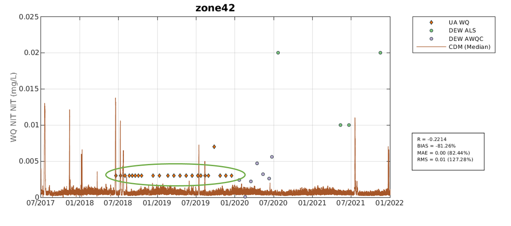
```

```{r ass-ass002, echo = FALSE, out.width='80%', class = "text-image", fig.cap = "Example of data quality issue with modelled vs. measured TP concentration in zone 22. The colours of the observational data indicate their data sources."}

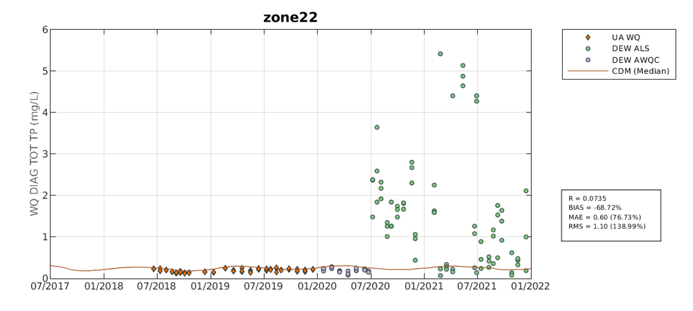
```

```{r ass-ass003, echo = FALSE, out.width='80%', class = "text-image", fig.cap = "Same as Figure 6.2 except for TN concentration in zone 22."}

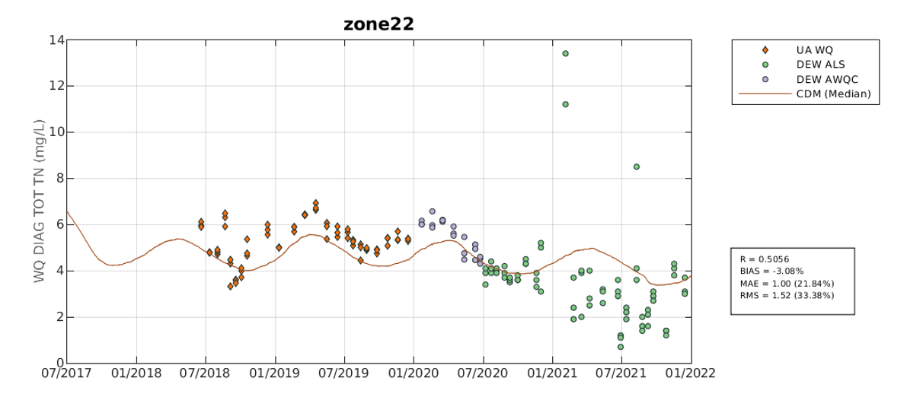
```

</center>

<br>

#### Model performance assessment (no ALS data) {.unnumbered}

```{r ass-004d, echo = FALSE, out.width='99%', class = "text-image",fig.show='hold',fig.align='center', fig.cap = "Performance summary of CDM (GEN 1.5) simulating long-term temperature, salinity, and nutrient concentrations, validated with all existing data available (inlcuding ALS). Red indicates a poor calibration result suggesting those variables should be considered with caution, yellow indicates an acceptable level of performance, and green indicates anaccurate prediction. Click to enlarge."}

knitr::include_graphics(c("images/assessment/table 6_2-performance table_no_ALS1.png","images/assessment/table 6_2-performance table_no_ALS2.png"))

```

#### Model performance assessment (all data) {.unnumbered}

```{r ass-005d, echo = FALSE, out.width='99%', class = "text-image",fig.show='hold',fig.align='center', fig.cap = "Performance summary of CDM (GEN 1.5) simulating long-term temperature, salinity, and nutrient concentrations, validated with all existing data except the laboratory data from ALS. Red indicates a poor calibration result where results should be considered with caution, yellow indicates an acceptable level of performance, and green indicates a highly accurate prediction. Click to enlarge."}

knitr::include_graphics(c("images/assessment/table 6_1-performance table1.png","images/assessment/table 6_1-performance table2.png"))

```

<br>

### Generation 2 {.panelset}

The error metrics for the Generation 2.0 simulation are shown below.

<br>

#### Model performance assessment (no ALS data) {.unnumbered}

```{r ass-004e, echo = FALSE, out.width='99%', class = "text-image",fig.show='hold',fig.align='center', fig.cap = "Performance summary of CDM (GEN 2) simulating long-term temperature, salinity, and nutrient concentrations, validated with all existing data available (inlcuding ALS). Red indicates a poor calibration result suggesting those variables should be considered with caution, yellow indicates an acceptable level of performance, and green indicates anaccurate prediction. Click to enlarge."}

knitr::include_graphics(c("images/assessment/GEN2 performance - no ALS - table1.png","images/assessment/GEN2 performance - no ALS - table2.png"))

```

#### Model performance assessment (all data) {.unnumbered}

```{r ass-005e, echo = FALSE, out.width='99%', class = "text-image",fig.show='hold',fig.align='center', fig.cap = "Performance summary of CDM (GEN 2) simulating long-term temperature, salinity, and nutrient concentrations, validated with all existing data except the laboratory data from ALS. Red indicates a poor calibration result where results should be considered with caution, yellow indicates an acceptable level of performance, and green indicates a highly accurate prediction. Click to enlarge."}

knitr::include_graphics(c("images/assessment/GEN2 performance - all data - table1.png","images/assessment/GEN2 performance - all data - table2.png"))

```

<br>

## Nutrient budget assessment

### Nutrient budgets {.panelset}

A methodology for nutrient flux and budget analysis has been developed. For the nutrient budget analysis, all of the nutrient pools (dissolved and particulate carbon, nitrogen and phosphorus, macroalgae and Ruppia) can be summarized for different regions of the estuary (north, south etc.). As an example of this method, the results from a period of five years (01/07/2017 to 01/07/2022) were summarized for nitrogen budgeting of NCL and SCL region in Figure 9.9 - 9.12. The nutrient budgeting analysis showed that the dissolved organic matter is the major nitrogen pool in both the lagoons, while particle organic matter and the nitrogen assimilated by phytoplankton also presented to be major nutrient pools (panel "a"). The sediment diffusion release of ammonium and the nitrogen loss due to phytoplankton burial into the sediment dominate the interaction at the sediment-water interface (panel "b"), which also presented a clear seasonal pattern. The boundary exchange fluxes are dominated by the organic matters in coincident to the major pools in the water (panel "c"). The daily change flux rate varied between 0 to \>20 tonne/day in the north lagoon, compared to that of between 0 to \~10 tonnes/day in the south lagoon, indicating stronger hydrodynamic transportation in the north lagoon affected by tidal intrusion and barrage flow. The results showed a net cumulative of nutrient in the sediment (panel "d"), indicating the sediment acting as a sink for the nutrients.

#### NITROGEN (**CSL**) {.unnumbered}

```{r ass-budget1, echo = FALSE, out.width='100%', class = "text-image", fig.cap = "Time-series plot of daily changes in (a) nitrogen pools, (b) nitrogen sources and sinks at the atmospheric and sediment interfaces, (c) exchange fluxes at the boundaries, and (d) cumulative changes in water and sediment of the south lagoon."}

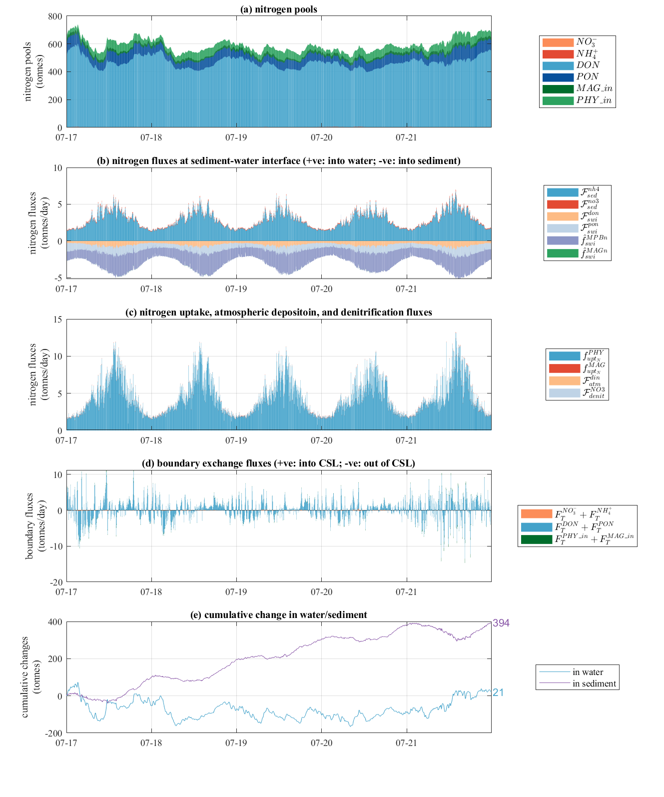

```

#### NITROGEN (CNL) {.unnumbered}

```{r ass-budget2, echo = FALSE, out.width='100%', class = "text-image", fig.cap = "Time-series plot of daily changes in (a) nitrogen pools, (b) nitrogen sources and sinks at the atmospheric and sediment interfaces, (c) exchange fluxes at the boundaries, and (d) cumulative changes in water and sediment of the north lagoon."}

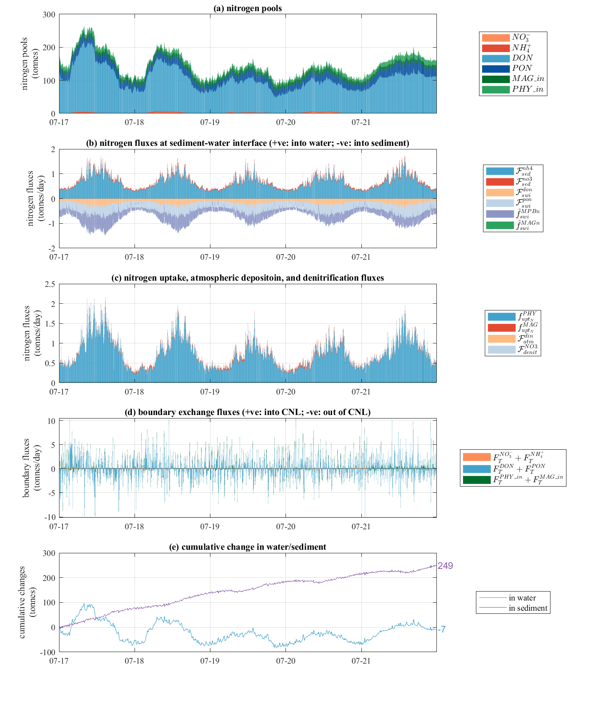

```

#### PHOSPHORUS (CSL) {.unnumbered}

```{r ass-budget3, echo = FALSE, out.width='100%', class = "text-image", fig.cap = "Time-series plot of daily changes in (a) phosphorus pools, (b) phosphorus sources and sinks at the atmospheric and sediment interfaces, (c) exchange fluxes at the boundaries, and (d) cumulative changes in water and sediment of the south lagoon."}

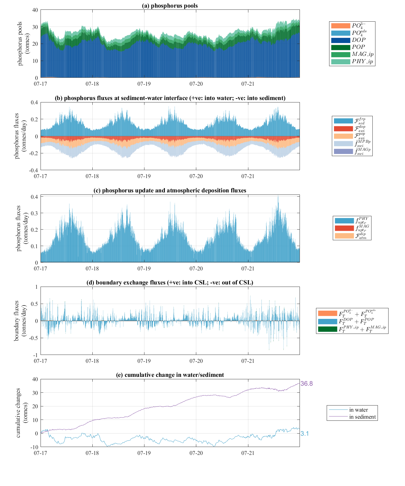

```

#### PHOSPHORUS (CNL) {.unnumbered}

```{r ass-budget4, echo = FALSE, out.width='100%', class = "text-image", fig.cap = "Time-series plot of daily changes in (a) phosphorus pools, (b) phosphorus sources and sinks at the atmospheric and sediment interfaces, (c) exchange fluxes at the boundaries, and (d) cumulative changes in water and sediment of the north lagoon."}

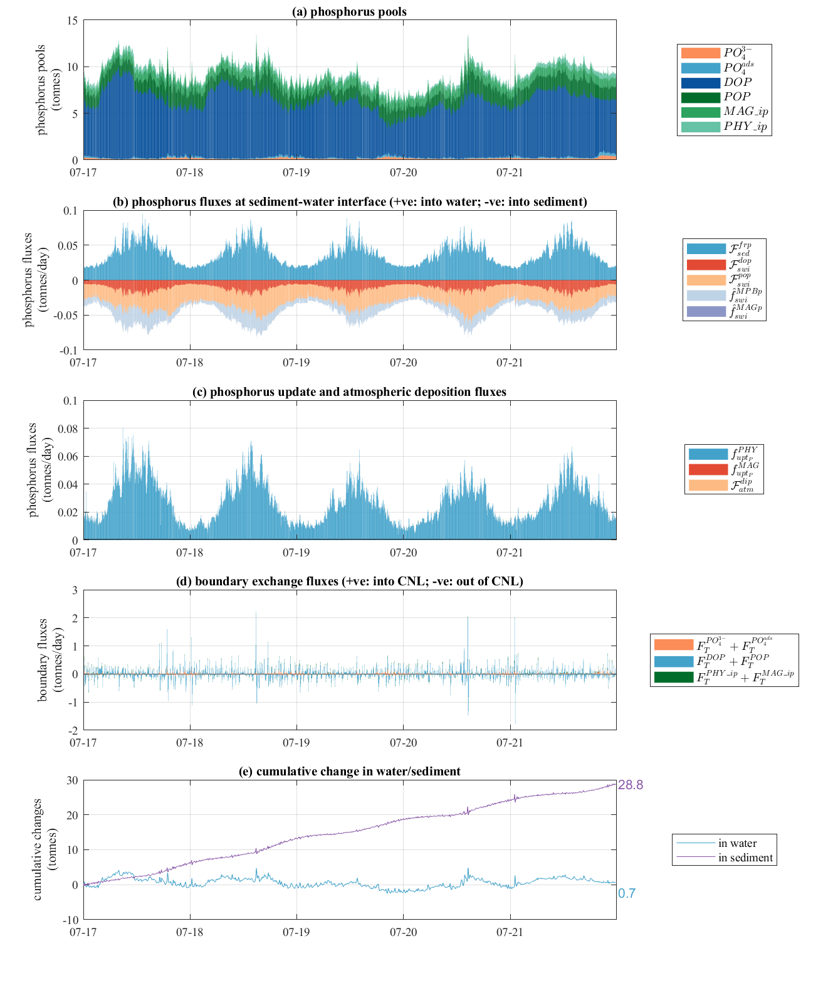

```

<br>

### Source and sink summary

Averaging the nitrogen and phosphorus pathways over the 5-year study period highlights the general fate of external nutrient loads entering the system, which is conceptualised as the Coorong “conveyer belt” (Figure 9.13). In summary, the nutrient loads with the barrage flows were the dominant source, representing 99% of total catchment nutrient load from the barrages and Salt Creek. There was active exchange of water and nutrient at the Murray mouth, where most of the nitrogen and phosphorus entering the Coorong through the barrages were exported to the ocean. The net fluxes transported to the CNL and to the CSL showed a gradual decrease, indicating decreasing connectivity from north to south. In CNL, the nitrogen fluxes by sediment release and settling were in the same order to that by transport into the CNL. While in CSL, the internal sediment fluxes were one order higher to that by transport through the boundary. However, although there was fast exchange of nitrogen at the sediment-water interface, the net accumulation in the CSL sediment of nitrogen (4.0% of total catchment load) and of phosphorus (4.1% of total catchment load) was relatively slow and in same order to the boundary exchange.
<center>

```{r ass-pie, echo = FALSE, out.width='100%', class = "text-image", fig.cap = "Summary pie chart of nitrogen sources and sinks in the north lagoon (NCL) and south lagoon (SCL)."}

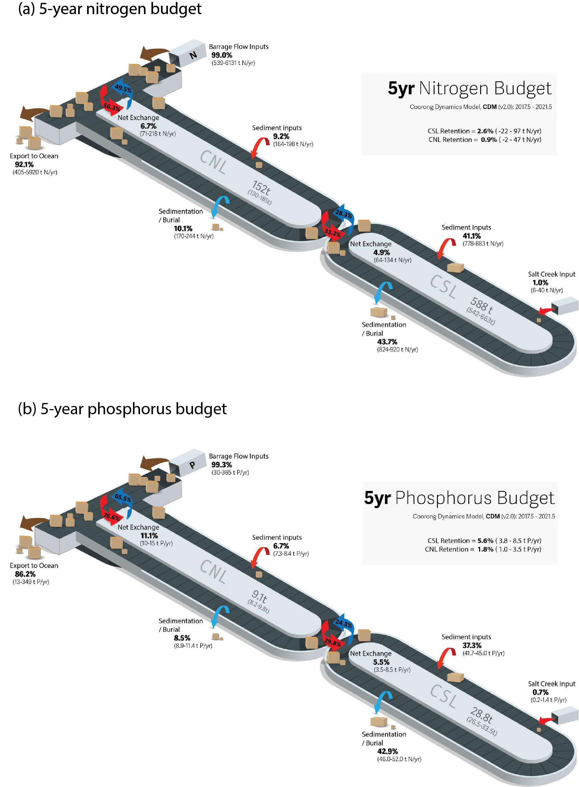
```

</center>

<br>

## Environmental response function (ERF) analysis

A useful method for applying the model is to construct environmental response function (ERFs); these can be used to predict water quality variables in estuary/lagoon sub-domains in response to changes in boundary forcing, and can therefore provide a simple and quick assessment of the occurrence of some target events. As an example, the environmental response of salinity, TN and TP in space and time is compared for a scenario assessing the delivery of water for the environment. This compares how the lagoon differs in repsonse to water being provided as an "[environmental flow](https://vimeo.com/715481753)" (e.g. see @brookes2022 ). Two simulations are compared:

-   'all water' : representing the base-case scenario where water was delivered over the barrages as actually occurred, and
-   'no-eWater' : representing a counter-factual situation when there was no environmental water delivered across the barrages

The results demonstrate that, under the current condition, the annual-average salinity presented an increase from north the south, and the condition stayed similar from 2017 to 2021; while if there is no environmental water contribution (the 'no-eWater' scenario), the salinity would had increased from about 150 PSU in 2017 to near 190 PSU in 2021 (Figure \@ref(fig:ass-erf)). The nutrient levels showed an increase from north to south, and also increased with time in both scenarios. However, if there is no environmental water contribution, the TN and TP in the south lagoon would have increased at a faster pace. In summary, the environmental water has shown to help to reduce the salinity level as well as the trophic statues of the Coorong, and show how the model can be used to develop 'look-up' tables for expected benefits of a given change in operation, without running the full model.

```{r ass-erf, echo = FALSE, out.width='100%', class = "text-image", fig.cap = "Environmental response functions (ERF) of salinity, TN, and TP in space and time of the Coorong for the base-case scenario (left panel) and an example ‘no e-Water’ scenario (right panel)."}

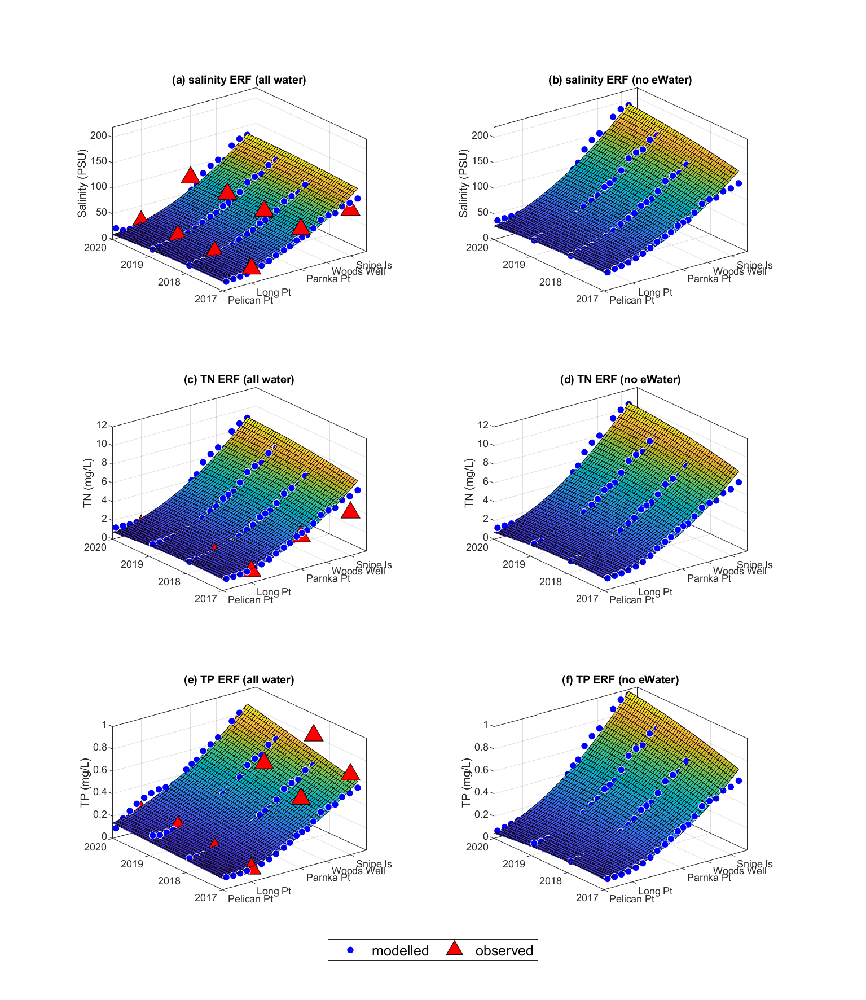
```

## Habitat condition assessment {.panelset}

The overall habitat suitability for sexual and asexual reproduction between 2018 - 2021 have been simulated using the Gen 2 model (Figure \@ref(fig:HSIsexual4) and Figure \@ref(fig:HSIasexual4)). The results show that habitat quality and suitable area can shift from year to year. For exmaple, in comparison, 2021 offered the least amount of suitable habitat for *Ruppia* to complete its sexual life cycle (flowering), which was consistent with field observations in that very few flowers were recorded in 2021 compared to 2020.

<br>

### Ruppia HSI (sexual lifecycle) {.unnumbered}

```{r HSIsexual4, echo = FALSE, out.width='100%', class = "text-image", fig.cap = "Overall Habitat Suitability Index for the successful completion of the sexual life cycle in the Coorong, for the Base Case in 2018 - 2021. An HSI of 0 (dark purple) represents unsuitable habitat conditions, while an HSI of 1 represents optimal conditions (yellow)."}

knitr::include_graphics("images/lagoon_habitat/HSI sexual 4yrs.png")
```

### Ruppia HSI (asexual lifecycle) {.unnumbered}

```{r HSIasexual4, echo = FALSE, out.width='100%', class = "text-image", fig.cap = "Overall Habitat Suitability Index for the successful completion of the asexual life cycle in the Coorong, for the Base Case in 2018 - 2021. An HSI of 0 (dark purple) represents unsuitable habitat conditions, while an HSI of 1 represents optimal conditions (yellow)."}

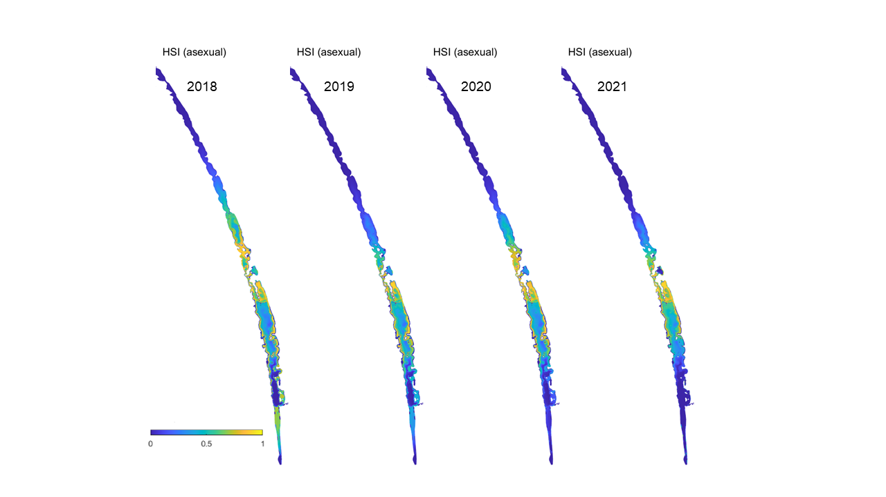
```

<br>

## Coorong Decision Making Framework (DMF)

To facilitate management decision making, and comprehensive list of customised model post-processing exports has been created. The Decision Making Framework (DMF) exports encompass a wide range of critical "CPS" indicators. These are defined in Table \@ref(tab:ass-dmftable).

```{r ass-dmftable, echo=FALSE, message=FALSE, warning=FALSE}
library(knitr)
library(kableExtra)
library(readxl)
library(rmarkdown)
theSheet <- read_excel('tables/dmf.xlsx', sheet = 1)
#theSheet <- theSheet[theSheet$Table == "Data",]
theSheetGroups <- unique(theSheet$CriticalCPS)

kbl(theSheet[,3:6], caption = "Coorong Decision Making Framework", align = "l",) %>%

  pack_rows(theSheetGroups[1],
            min(which(theSheet$CriticalCPS == theSheetGroups[1])),
            max(which(theSheet$CriticalCPS == theSheetGroups[1])),
            background = '#ebebeb') %>%
  pack_rows(theSheetGroups[2],
            min(which(theSheet$CriticalCPS == theSheetGroups[2])),
            max(which(theSheet$CriticalCPS == theSheetGroups[2])),
            background = '#ebebeb') %>%
  pack_rows(theSheetGroups[3],
					  min(which(theSheet$CriticalCPS == theSheetGroups[3])),
					  max(which(theSheet$CriticalCPS == theSheetGroups[3])),
					  background = '#ebebeb') %>%
  pack_rows(theSheetGroups[4],
          	min(which(theSheet$CriticalCPS == theSheetGroups[4])),
          	max(which(theSheet$CriticalCPS == theSheetGroups[4])),
          	background = '#ebebeb') %>%
  pack_rows(theSheetGroups[5],
            min(which(theSheet$CriticalCPS == theSheetGroups[5])),
            max(which(theSheet$CriticalCPS == theSheetGroups[5])),
            background = '#ebebeb') %>%
  pack_rows(theSheetGroups[6],
            min(which(theSheet$CriticalCPS == theSheetGroups[6])),
            max(which(theSheet$CriticalCPS == theSheetGroups[6])),
            background = '#ebebeb') %>%
pack_rows(theSheetGroups[7],
            min(which(theSheet$CriticalCPS == theSheetGroups[7])),
            max(which(theSheet$CriticalCPS == theSheetGroups[7])),
            background = '#ebebeb') %>%
  pack_rows(theSheetGroups[8],
            min(which(theSheet$CriticalCPS == theSheetGroups[8])),
            max(which(theSheet$CriticalCPS == theSheetGroups[8])),
            background = '#ebebeb') %>%
   pack_rows(theSheetGroups[9],
            min(which(theSheet$CriticalCPS == theSheetGroups[9])),
            max(which(theSheet$CriticalCPS == theSheetGroups[9])),
            background = '#ebebeb') %>%
   pack_rows(theSheetGroups[10],
            min(which(theSheet$CriticalCPS == theSheetGroups[10])),
            max(which(theSheet$CriticalCPS == theSheetGroups[10])),
            background = '#ebebeb') %>%
  
row_spec(0, background = "#14759e", bold = TRUE, color = "white") %>%
  kable_styling(full_width = F,font_size = 10) %>%
  column_spec(2, width_min = "7em") %>%
  column_spec(3, width_max = "10em") %>%
  column_spec(4, width_min = "10em") %>%
 # column_spec(5, width_min = "10em") %>%
  #column_spec(6, width_min = "19em") %>%
    scroll_box(width = "700px", height = "1000px",
             fixed_thead = FALSE)
```

<br>

Outputs are initially grouped based upon the style of calculation required.

An example of the outputs can be found in Table \@ref(tab:ass-DMFexportexample).

```{r ass-DMFexportexample, echo=FALSE, message=FALSE, warning=FALSE}
library(knitr)
library(kableExtra)
library(readxl)
library(rmarkdown)
theSheet <- read_excel('tables/DMF_export_2.xlsx', sheet = 1)
#theSheet <- theSheet[theSheet$Table == "Data",]
theSheetGroups <- unique(theSheet$CPS)

kbl(theSheet[,2:8], caption = "Coorong Decision Making Framework", align = "l",) %>%

  pack_rows(theSheetGroups[1],
            min(which(theSheet$CPS == theSheetGroups[1])),
            max(which(theSheet$CPS == theSheetGroups[1])),
            background = '#ebebeb') %>%
  
  
row_spec(0, background = "#14759e", bold = TRUE, color = "white") %>%
  kable_styling(full_width = F,font_size = 10) #%>%
   # scroll_box(fixed_thead = FALSE)
  
```

In addition to the required DMF value, time series plots are also produced to provide context to the data analyst.

<center>

```{r ass-pic2, echo = FALSE, out.width='50%', class = "text-image", fig.cap = "Critial CPS for macroinvertabrates where Average daily area (Km2) with water cover and Salinity is < 25 g/L Apr-Sep"}

knitr::include_graphics('images/cdm/DMF_Example.png')

```

</center>

## Summary

A series of integrated CDM assessment toolbox has been developed that are able to:

-   Accomodate data from different sources/campaigns (see Appendix A)
-   Flexible plotting of time-series outputs at points and integrated over polygons
-   Plotting of transects
-   Map outputs integrated over selected time-windows (e.g. month or season)
-   Nutrient budget on defined polygon regions
-   Error metric assessment
-   Habitat area calculation

Looking holistically at the statistic results in the long-term simulation, the CDM appeared to capture the salinity and temperature changes, and also the TN, TP and dissolved oxygen variation compared to the observational data in most regions. Reasonable predictions were obtained for other nutrient species. The Ruppia HSI shows reasonable performance against field sample data and the predicted macroalgae biomass reasonably captures the spatial distribution of filamentous algae. As is expected for these type of simulations (e.g., see @arhonditsis2004 ), model performance is much better for the hydrodynamic variables (salinity and temperature) than for the nutrient and biological properties. It is particularly challenging to get high model performance scores when values have high inherent variance, and/or are near to the detection limit. This was the case for many variables assessed in this study, particularly the bioavailable nutrients, and the error metric numbers should be considered with the data quality issues in mind as discussed in Chapter 9.4.2.

Overall, the model performance is consistent in both the focus period (2020-2021) and the long-term simulation (2017-2021) when adopting the same water quality modules and model parameters, suggesting in its present form the model is suitable for assessing the management scenarios associated with water management. These results show the promise of the model and give direction to focus areas for development and calibration. Key challenges in model setup, calibration and use for scenario assessment appear to be:

-   Salinity calibration in the South Lagoon has remained problematic in some years
-   Resolving organic matter partitioning, and reaction rates
-   Constraining the sediment flux rates of nutrients, considering spatial variability
-   Chlorophyll-a biomass
-   Macroalgal biomass and timing

Looking at these key challenges, some areas for CDM improvement in the next phase modelling development are summarised in Table \@ref(tab:ass-gaps).

```{r ass-gaps, echo=FALSE, message=FALSE, warning=FALSE}
library(knitr)
library(kableExtra)
library(readxl)
library(rmarkdown)
theSheet <- read_excel('tables/gaps.xlsx', sheet = 1)
theSheet <- theSheet[theSheet$Table == "Data",]
theSheetGroups <- unique(theSheet$Group)

kbl(theSheet[,3:5], caption = "CDM model reccomendations for future experimetations and data collection.", align = "l",) %>%

  pack_rows(theSheetGroups[1],
            min(which(theSheet$Group == theSheetGroups[1])),
            max(which(theSheet$Group == theSheetGroups[1])),
            background = '#ebebeb') %>%
 pack_rows(theSheetGroups[2],
            min(which(theSheet$Group == theSheetGroups[2])),
            max(which(theSheet$Group == theSheetGroups[2])),
            background = '#ebebeb') %>%
  pack_rows(theSheetGroups[3],
					  min(which(theSheet$Group == theSheetGroups[3])),
					  max(which(theSheet$Group == theSheetGroups[3])),
					  background = '#ebebeb') %>%
  pack_rows(theSheetGroups[4],
          	min(which(theSheet$Group == theSheetGroups[4])),
          	max(which(theSheet$Group == theSheetGroups[4])),
          	background = '#ebebeb') %>%

  
row_spec(0, background = "#14759e", bold = TRUE, color = "white") %>%
  kable_styling(full_width = F,font_size = 10) #%>%
   # scroll_box(fixed_thead = FALSE)
  
```

<!--chapter:end:cdm_integrated_assessment.Rmd-->

# References {-}

<div id="refs"></div>

<!--chapter:end:cdm_references.Rmd-->

# Appendix A : Data Catalogue {-}

## Coorong data categories {-}

All data available for model setup and validation has been compiled, from HCHB research, prior research and routine monitoring (see [Chapter 3](Model-Data Ecosystem)). Data is categorised in the general areas of :

+ *Bathymetry*
+ *Meteorology*
+ *Hydrology*
+ *Water Quality*
+ *Sediment*
+ *Biota*

These are defined into sub-categories, as outlined in Table \@ref(tab:A-dataclasses).

<br>

```{r A-dataclasses, echo=FALSE, message=FALSE, warning=FALSE}
library(knitr)
library(kableExtra)
library(readxl)
library(rmarkdown)
theSheet <- read_excel('tables/CDM_Classes.xlsx', sheet = 2)
theSheet <- theSheet[theSheet$Table == "Data",]
theSheetGroups <- unique(theSheet$Group)

kbl(theSheet[,3:4], caption = "CDM Data Classification", align = "l",) %>%

row_spec(0, background = "#14759e", bold = TRUE, color = "white") %>%
  kable_styling(full_width = T,font_size = 10) %>%
    scroll_box(fixed_thead = FALSE)
```

<br>

## Coorong data catalogue {-}

A summary of the available data categorised by these data types and by agency/supplier is shown below (Table \@ref(tab:A-datacatalogue)). Data is accesible via the `data` folder of the CDM [GitHub repository](https://github.com/AquaticEcoDynamics/CDM/tree/master/data). Please refer to the master data catalogue spreadsheet therein for data provenance information.

<br>
```{r A-datacatalogue, echo=FALSE, message=FALSE, warning=FALSE}
library(knitr)
library(kableExtra)
library(readxl)
library(rmarkdown)
theSheet <- read_excel('tables/data_catalogue.xlsx', sheet = 2)
theSheet <- theSheet[theSheet$Table == "Data",]
theSheetGroups <- unique(theSheet$Group)

kbl(theSheet[,4:10], caption = "CDM simulated variable summary", align = "l",) %>%
  pack_rows(theSheetGroups[1],
            min(which(theSheet$Group == theSheetGroups[1])),
            max(which(theSheet$Group == theSheetGroups[1])),
            background = '#ebebeb') %>%
  pack_rows(theSheetGroups[2],
            min(which(theSheet$Group == theSheetGroups[2])),
            max(which(theSheet$Group == theSheetGroups[2])),
            background = '#ebebeb') %>%
  pack_rows(theSheetGroups[3],
					  min(which(theSheet$Group == theSheetGroups[3])),
					  max(which(theSheet$Group == theSheetGroups[3])),
					  background = '#ebebeb') %>%
  pack_rows(theSheetGroups[4],
          	min(which(theSheet$Group == theSheetGroups[4])),
          	max(which(theSheet$Group == theSheetGroups[4])),
          	background = '#ebebeb') %>%
  pack_rows(theSheetGroups[5],
            min(which(theSheet$Group == theSheetGroups[5])),
            max(which(theSheet$Group == theSheetGroups[5])),
            background = '#ebebeb') %>%
  pack_rows(theSheetGroups[6],
            min(which(theSheet$Group == theSheetGroups[6])),
            max(which(theSheet$Group == theSheetGroups[6])),
            background = '#ebebeb') %>%

row_spec(0, background = "#14759e", bold = TRUE, color = "white") %>%
  kable_styling(full_width = F,font_size = 10) %>%
  column_spec(2, width_min = "7em") %>%
  column_spec(3, width_max = "19em") %>%
  column_spec(4, width_min = "10em") %>%
  column_spec(5, width_min = "5em") %>%
    scroll_box(width = "700px", height = "4600px",
             fixed_thead = FALSE)
```

<br>


<!--chapter:end:appendix_a.Rmd-->

# Appendix B : Results Archive {-}

## Long term assessment of model performance  {-}

The aim of this section is to statistically compare the modelling results against historical data collected within the Coorong (where available), over the period of 2013-2021, with outputs of various generations of the CDM. The model performance in predicting a range of relevant variables including salinity, temperature, nitrogen, phosphorus and total chlorophyll-a, are assessed with a set of statistical metrics: 

  +	$R$ : regression coefficient; 
  +	$BIAS$ : bias of average prediction to the average observation; 
  +	$RMS$ : root mean square; and 
  +	$NRMS$ : normalized root mean square calculated as $RMS$ normalized by the average of observed values.

The calculations of statistical metrics has been performed for each site where the number of field observations was >10 in the assessment/simulation period. 

The validation plots including the statistics for each site are available via the links in the below table (Table \@ref(tab:A-testing)). The tables are organised based on model generation, in addition to a comparison of the performance of the model generations (termed 'mutli').


## {.panelset .unnumbered}

### GEN 2 {.unnumbered}
 
```{r A-testing3, echo=FALSE, message=FALSE, warning=FALSE}
library(knitr)
library(kableExtra)
library(readxl)
library(rmarkdown)
library(stringr)

theSheet_Names <- list.files(path = "HTML/Performance/GEN2/HTML", pattern = NULL, all.files = FALSE,
           full.names = FALSE, recursive = FALSE,
           ignore.case = FALSE, include.dirs = FALSE, no.. = FALSE)

theSheet_Names2 <- list.files(path = "HTML/Performance/TRAN/HTML", pattern = NULL, all.files = FALSE,
           full.names = FALSE, recursive = FALSE,
           ignore.case = FALSE, include.dirs = FALSE, no.. = FALSE)

theSheet <- paste(
  "<",'a href="HTML/Performance/GEN2/HTML/',theSheet_Names,'"',">",theSheet_Names,"<",'/a',">",",",
  "<",'a href="HTML/Performance/TRAN/HTML/',theSheet_Names2,'"',">",theSheet_Names2,"<",'/a',">",
  sep = "")

theSheet <- str_split_fixed(theSheet, ',', 2)


kbl(theSheet, caption = "Model results for GEN 2 nWV nSDG simulation (Generation 2 model without wave or dynamic sediment modules engaged.)", align = "l",escape = F,col.names = c("Generation 2  (TIME SERIES)","Generation 2 (TRANSECT)"), ) %>%
row_spec(0, background = "#14759e", bold = TRUE, color = "white") %>%
  kable_styling(full_width = T,font_size = 10) %>%
    scroll_box(fixed_thead = FALSE)
```

### GEN 1.5 {.unnumbered}
 

```{r A-testing2, echo=FALSE, message=FALSE, warning=FALSE}
library(knitr)
library(kableExtra)
library(readxl)
library(rmarkdown)
library(stringr)

theSheet_Names <- list.files(path = "HTML/Performance/GEN15/HTML", pattern = NULL, all.files = FALSE,
           full.names = FALSE, recursive = FALSE,
           ignore.case = FALSE, include.dirs = FALSE, no.. = FALSE)


theSheet_Names2 <- list.files(path = "HTML/Performance/GEN15_ALS/HTML", pattern = NULL, all.files = FALSE,
           full.names = FALSE, recursive = FALSE,
           ignore.case = FALSE, include.dirs = FALSE, no.. = FALSE)


theSheet <- paste(
  "<",'a href="HTML/Performance/GEN15/HTML/',theSheet_Names,'"',">",theSheet_Names,"<",'/a',">",",",
  "<",'a href="HTML/Performance/GEN15_ALS/HTML/',theSheet_Names2,'"',">",theSheet_Names2,"<",'/a',">",
  sep = "")

theSheet <- str_split_fixed(theSheet, ',', 2)


kbl(theSheet, caption = "Model results for Generation 1.5", align = "l",escape = F,col.names = c("Generation 1.5 nALS Data 2017 2022","Generation 1.5 wALS Data 2017 2022"), ) %>%
row_spec(0, background = "#14759e", bold = TRUE, color = "white") %>%
  kable_styling(full_width = T,font_size = 10) %>%
    scroll_box(fixed_thead = FALSE)
```

### GEN 1 {.unnumbered}


```{r A-testing1, echo=FALSE, message=FALSE, warning=FALSE}
library(knitr)
library(kableExtra)
library(readxl)
library(rmarkdown)
theSheet_Names <- list.files(path = "HTML/Performance/GEN1/HTML", pattern = NULL, all.files = FALSE,
           full.names = FALSE, recursive = FALSE,
           ignore.case = FALSE, include.dirs = FALSE, no.. = FALSE)
theSheet <- paste("<",'a href="HTML/Performance/GEN1/HTML/',theSheet_Names,'"',">",theSheet_Names,"<",'/a',">", sep = "")
#theSheet <- append(theSheets,'Validation 2019 2021',0)
kbl(theSheet, caption = "Model results for Generation 1", align = "l",escape = F,col.names = 'Generation 1 2019 2021', ) %>%
row_spec(0, background = "#14759e", bold = TRUE, color = "white") %>%
  kable_styling(full_width = T,font_size = 10) %>%
    scroll_box(fixed_thead = FALSE)
```


### GEN 0 {.unnumbered}


```{r A-testing, echo=FALSE, message=FALSE, warning=FALSE}
library(knitr)
library(kableExtra)
library(readxl)
library(rmarkdown)
theSheet_Names <- list.files(path = "HTML/Performance/GEN0/HTML", pattern = NULL, all.files = FALSE,
           full.names = FALSE, recursive = FALSE,
           ignore.case = FALSE, include.dirs = FALSE, no.. = FALSE)
theSheet <- paste("<",'a href="HTML/Performance/GEN0/HTML/',theSheet_Names,'"',">",theSheet_Names,"<",'/a',">", sep = "")
#theSheet <- append(theSheets,'Validation 2013 2016',0)
kbl(theSheet, caption = "Model results for Generation 0", align = "l",escape = F,col.names = 'Generation 0 2013 2019', ) %>%
row_spec(0, background = "#14759e", bold = TRUE, color = "white") %>%
  kable_styling(full_width = T,font_size = 10) %>%
    scroll_box(fixed_thead = FALSE)
```


### MULTI {.unnumbered}
 
HCHB *Multiple Model Comparison*

```{r A-testing5, echo=FALSE, message=FALSE, warning=FALSE}

library(knitr)
library(kableExtra)
library(readxl)
library(rmarkdown)
theSheet_Names <- list.files(path = "HTML/Performance/MULT/HTML", pattern = NULL, all.files = FALSE,
           full.names = FALSE, recursive = FALSE,
           ignore.case = FALSE, include.dirs = FALSE, no.. = FALSE)
theSheet <- paste("<",'a href="HTML/Performance/MULT/HTML/',theSheet_Names,'"',">",theSheet_Names,"<",'/a',">", sep = "")
#theSheet <- append(theSheets,'Validation 2013 2016',0)

kbl(theSheet, caption = "Comparison of Model Generations 1, 1.5 & 2", align = "l",escape = F,col.names = 'Model Comparison 2017 2022', ) %>%
row_spec(0, background = "#14759e", bold = TRUE, color = "white") %>%
  kable_styling(full_width = T,font_size = 10) %>%
    scroll_box(fixed_thead = FALSE)
```

### WAVE {.unnumbered}

HCHB *Wave Comparisons*

```{r A-testing6, echo=FALSE, message=FALSE, warning=FALSE}
library(knitr)
library(kableExtra)
library(readxl)
library(rmarkdown)
theSheet_Names <- list.files(path = "HTML/Performance/WAVE/HTML", pattern = NULL, all.files = FALSE,
           full.names = FALSE, recursive = FALSE,
           ignore.case = FALSE, include.dirs = FALSE, no.. = FALSE)
theSheet <- paste("<",'a href="HTML/Performance/WAVE/HTML/',theSheet_Names,'"',">",theSheet_Names,"<",'/a',">", sep = "")
#theSheet <- append(theSheets,'Validation 2013 2016',0)

kbl(theSheet, caption = "Generation 1.5 Wave Analysis", align = "l",escape = F,col.names = 'Generation 1.5', ) %>%
row_spec(0, background = "#14759e", bold = TRUE, color = "white") %>%
  kable_styling(full_width = T,font_size = 10) %>%
    scroll_box(fixed_thead = FALSE)

```


## Sensitivity assessment {-}

### Sensitivity to internal nutrient loading  {-}

This section includes the sensitivity assessment results to a selected range of sediment nutrient flux rates, based on the latest report on the field observations and laboratory experiments on nutrient cycling in the Coorong (Mosley et al., 2021, Annual Investigations Report: Sediment quality, nutrient cycling and fluxes). In the early versions of CDM, the sediment flux rate of ammonium (`Fsed_amm`), nitrate (`Fsed_nit`), phosphate (`Fsed_frp`), and oxygen demand (`Fsed_oxy`) were set based on literature review of similar coastal sites due to absence of relative data in the Coorong. In this sensitivity assessment, the CDM was updated with the findings from Mosley et al. (2021) (Table \@ref(tab:5-sedpars)), with a series of sediment flux settings as listed in Table \@ref(tab:B-sentbl), and these were compared to the HCHB Generation 0 version of CDM.

<br>

```{r B-sentbl, echo=FALSE, message=FALSE, warning=FALSE}
library(knitr)
library(kableExtra)
library(readxl)
library(rmarkdown)
theSheet <- read_excel('tables/CIIP_phase2_scenarios.xlsx', sheet = 1)
theSheet <- theSheet[theSheet$Table == "Data",]
theSheetGroups <- unique(theSheet$Group)


kbl(theSheet[,3:8], caption = "Summary of sediment nutrient flux sensitivity scenarios", align = "l",) %>%
  pack_rows(theSheetGroups[1],
            min(which(theSheet$Group == theSheetGroups[1])),
            max(which(theSheet$Group == theSheetGroups[1])),
            background = '#ebebeb') %>%
  pack_rows(theSheetGroups[2],
            min(which(theSheet$Group == theSheetGroups[2])),
            max(which(theSheet$Group == theSheetGroups[2])),
            background = '#ebebeb') %>%
  pack_rows(theSheetGroups[3],
          min(which(theSheet$Group == theSheetGroups[3])),
          max(which(theSheet$Group == theSheetGroups[3])),
          background = '#ebebeb') %>%
  pack_rows(theSheetGroups[4],
          min(which(theSheet$Group == theSheetGroups[4])),
          max(which(theSheet$Group == theSheetGroups[4])),
          background = '#ebebeb') %>%
row_spec(0, background = "#14759e", bold = TRUE, color = "white") %>%
  kable_styling(full_width = T,font_size = 11) %>%
  scroll_box(fixed_thead = FALSE)
```

<br> 

*FSED Sensitivity*: The results from the sensitivity scenarios with comparison to the prior version of CDM are presented in Table \@ref(tab:B-nutsen), with links to each assessed water quality variable. Key findings from the sensitivity assessment include:

  +	The laboratory experiment revealed a relatively strong sediment oxygen demand, ammonium flux, and phosphate flux, and weak nitrate sediment flux under dark condition; Compared to the laboratory experiment results, the prior CDM relatively overestimated the sediment nitrate flux, and under-estimated the sediment oxygen demand, and ammonium and phosphate sediment fluxes;
  +	The scenario results showed complex interactions between the phytoplankton dynamics and the sediment nutrient fluxes. In scenario 1 with relatively low Fsed_nit/Fsed_amm and high Fsed_frp, the model showed to overestimate the FRP concentration in the water while underestimate the phytoplankton biomass; whilst in scenario 2-4 with increasing Fsed_nit/Fsed_amm and Fsed_frp, improvement of the model performance, especially the phytoplankton prediction in the south lagoon are observed;
  +	The north lagoon especially the area around the Murray Mouth and barrage inputs showed a relatively low sensitivity to the changes in the sediment nutrient fluxes, while in the south lagoon the water quality changes were more dominated by the sediment nutrient fluxes.

<br>

```{r B-nutsen, echo=FALSE, message=FALSE, warning=FALSE}
library(knitr)
library(kableExtra)
library(readxl)
library(rmarkdown)

theSheet_Names <- list.files(path = "HTML/Sed_Nut_flux_sensitivity", pattern = NULL, all.files = FALSE,
           full.names = FALSE, recursive = FALSE,
           ignore.case = FALSE, include.dirs = FALSE, no.. = FALSE)

theSheet <- paste("<",'a href="HTML/Sed_Nut_flux_sensitivity/',theSheet_Names,'"',">",theSheet_Names,"<",'/a',">", sep = "")

kbl(theSheet, caption = "Model sensitivity test results for sediment nutrient flux rates.", align = "l",escape = F,col.names = 'Variable', ) %>%

row_spec(0, background = "#14759e", bold = TRUE, color = "white") %>%
  kable_styling(full_width = T,font_size = 10) %>%
    scroll_box(fixed_thead = FALSE)
```


<!--chapter:end:appendix_b.Rmd-->

# Appendix C : Ruppia Habitat Assessment {.unnumbered}

## Habitat Suitability Index Functions {.unnumbered}

Habitat suitability functions for Ruppia life stages based on literature review and analyses of HCHB survey data. Note that HSI = 1 under optimal conditions, HSI = 0 under unsuitable conditions, and HSI for sub-optimal is linearly interpolated between these values. Rows shaded in green indicate threshold values were largely sourced from current literature (except text in red), while rows shaded in orange indicate threshold values were estimated.

```{r hsi-function, echo=FALSE, message=FALSE, warning=FALSE}
library(knitr)
library(kableExtra)
library(readxl)
library(rmarkdown)
#library(dplyr)
# library(pander)

theSheet <- read_excel('tables/habitat/AllTables.xlsx', sheet =10)
#gsub(pattern = "pic",x = theSheet[,5], replacement = 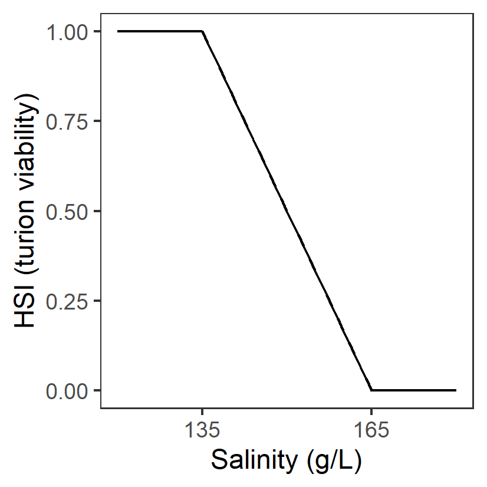)
  # theSheet %>% 
  # slice(1) %>% 
  # mutate(
  #   pic = "images/lagoon_habitat/HSI_viability_salinity.png" %>% pander::pandoc.image.return()
  #   ) %>% 
  # pander()%>%

kbl(theSheet[,2:8], caption = "Habitat suitability functions for Ruppia life stages based on literature review and analyses of HCHB survey data. Note that HSI = 1 under optimal conditions, HSI = 0 under unsuitable conditions, and HSI for sub-optimal is linearly interpolated between these values. Rows shaded in green indicate threshold values were largely sourced from current literature (except text in red), while rows shaded in orange indicate threshold values were estimated.", align = "l",escape = F) %>%  #escape controls whether the syntax in table is interpreted
  row_spec(0, background = "#14759e", bold = TRUE, color = "white") %>%

  kable_styling(full_width = F,font_size = 10) %>%
  column_spec(2, width_min = "15em") %>%
  column_spec(5, width_min = "30em") %>%
  column_spec(7, width_min = "20em") %>%
  pack_rows("Turion viability (Jan 1 – Mar 31)", 1, 1) %>%
  pack_rows("Seed germination (Apr 1 – Jun 30)", 2, 6) %>%
  pack_rows("Turion sprouting (Apr 1 – Jun 30)", 7, 11) %>% #3rd and 4th row
  pack_rows("Adult plant growth (Jun 1 – Sep 30)", 12, 16) %>%
  pack_rows("Flowering and seed set (Sep 1 – Dec 31)", 17, 21) %>%
  pack_rows("Turion formation (Sep 1 – Dec 31)", 22, 26)%>%
  scroll_box(width = "700px", height = "1600px",fixed_thead = FALSE)

  # column_spec(2, width = "12em")%>%
  # column_spec(4, width = "10em")%>%

```

<br>


## Model assessment - historical (pre-HCHB) data {.unnumbered}

<br> **i. Field seed/flower count (obs) vs. HSI flowering and seed set (model)**

The average number of seeds per core sampled in January from 2017 to 2019 were compared with the flowering and seed set HSI of the previous year (2016 -- 2018) (Figure \@ref(fig:hist-seed2017) - Figure \@ref(fig:hist-flower2016)); this is a result of integrating across the average conditions between August and December in each year. In contrast, the number of flowerheads was sampled in November 2016 only, and so was compared with HSI flowering and seed set of the same year.

Surveys conducted during other times of the year, such as May or July, are more complicated to validate against, since during this period some of the seeds that were produced (during last spring) would have germinated. Therefore, the seed abundance at this time is a combined result of previous year's seed production success, and current year's seed germination rate.

In general, the spatial distribution of seeds and flowers in the field agreed with model outputs (Figure \@ref(fig:hist-seed2017) - Figure \@ref(fig:hist-flower2016)). For example, higher number of seeds and flowers were often found in the middle lagoon, overlapping with areas where higher HSIs are concentrated. In comparison, north and/or south lagoons recorded lower density of seeds and/or flowers, matching the lower HSIs or limited suitable habitat extent in these regions. However, there were some disagreements between the modelled HSI and field data in the relative abundance of seeds recorded in the south and north lagoons. Specifically, seeds appeared to be mostly absent in the north lagoon between 2017 and 2019, while they had been in higher abundance in the south consistently. Current model predictions however, predicted that the south and north lagoon had similar habitat suitability for flowering and seed set.

In addition to the visual comparison between model outputs and field observations, a quantitative validation was conducted between seed abundance in 2019 and HSI flowering and seed set in 2018 (Figure \@ref(fig:hist-seed2019) and Figure \@ref(fig:hist-seed2019box)). A 600-meter radius buffer was created around each sampling site, and HSI value in each cell that falls within this buffer were averaged and compared with seed count at each site.

```{r hist-seed2017, echo = FALSE, out.width='100%', class = "text-image", fig.cap = "Average seed count per core in **2017 January** (circles) overlaid on HSI model output for flowering and seed set in 2016. Inset on top right shows the overall habitat suitability for the flowering and seed set phase of Ruppia as a function of salinity f(S), light f(l), water level f(WL), and presence of filamentous algae f(FA). An HSI of 0 (dark purple) represents unsuitable habitat conditions, while an HSI of 1 represents optimal conditions (yellow)."}

knitr::include_graphics("images/lagoon_habitat/hist_seed2017vsHSI2016.png")

```

```{r hist-seed2018, echo = FALSE, out.width='100%', class = "text-image", fig.cap = "Average seed count per core in **2018 January** (circles) overlaid on HSI model output for flowering and seed set in 2017. Inset on top right shows the overall habitat suitability for the flowering and seed set phase of Ruppia as a function of salinity f(S), light f(l), water level f(WL), and presence of filamentous algae f(FA). An HSI of 0 (dark purple) represents unsuitable habitat conditions, while an HSI of 1 represents optimal conditions (yellow)."}

knitr::include_graphics("images/lagoon_habitat/hist_seed2018vsHSI2017.png")

```

```{r hist-seed2019, echo = FALSE, out.width='100%', class = "text-image", fig.cap = "Average seed count per core in **2019 January** (circles) overlaid on HSI model output for flowering and seed set in 2018. A HSI of 0 (dark purple) represents unsuitable habitat conditions, while an HSI of 1 represents optimal conditions (yellow). Inset shows the size of the buffers created around sampling sites."}

knitr::include_graphics("images/lagoon_habitat/hist_seed2019vsHSI2018.png")
```

```{r hist-seed2019box, echo = FALSE, out.width='100%', class = "text-image", fig.cap = "Scatter and box plot of average seed count per core in 2019 January versus averaged HSI for flowering and seed set in 2018 in the entire lagoon (top panel: red - north lagoon sites; blue - south lagoon sites) and south lagoon (bottom panel). Text on top of each data point indicates site name."}

knitr::include_graphics("images/lagoon_habitat/hist_seed2019vsHSI2018_box.png")

```

The modelled Ruppia HSI prediction for flowers correlates reasonably well with the observed seed count measured at the beginning of the following season, particularly in the South Lagoon (Figure \@ref(fig:hist-seed2019box)).

```{r hist-flower2016, echo = FALSE, out.width='100%', class = "text-image",fig.align='center', fig.cap = "Average flowerhead count per square meter quadrat in 2016 November (circles) overlaid on HSI model output for flowering and seed set in 2016. Inset on top right shows the overall habitat suitability for the flowering and seed set phase of Ruppia as a function of salinity f(S), light f(l), water level f(WL), and presence of filamentous algae f(FA). An HSI of 0 (dark purple) represents unsuitable habitat conditions, while an HSI of 1 represents optimal conditions (yellow)."}

knitr::include_graphics("images/lagoon_habitat/hist_flower2016vsHSI2016.png")

```

**ii. Field turion count (obs) vs. HSI turion formation (model)**

Average number of turions (type I and II) per core sampled in January in 2016, 2017 and 2019 were compared with HSI turion formation of the previous year (2015, 2016 and 2018) (Figure \@ref(fig:hist-turion2016) - Figure \@ref(fig:hist-turion2019)), which is a result of integrated average condition between August and December in each year.

Surveys conducted during other times of the year, such as May or July would be less suitable for validation, as some of the turions formed during previous spring should have had sprouted in May or July in the current year. Such validation will be more complicated as turion abundance in the field is a combined result of previous year's turion formation success and current year's turion sprouting rate.

Visual validation of turions showed mixed results (Figure \@ref(fig:hist-turion2016) - Figure \@ref(fig:hist-turion2019)). HSIs for turion formation in 2015 were generally consistent with turion distribution and abundance in 2016 January, where south lagoon observed more suitable environmental conditions than the north, and field records showed a similar pattern (Figure \@ref(fig:hist-turion2016)). However, the model seemed to underpredict habitat suitability in the south lagoon in 2016 and 2018 (Figure \@ref(fig:hist-turion2017) and Figure \@ref(fig:hist-turion2019)).

```{r hist-turion2016, echo = FALSE, out.width='100%', class = "text-image", fig.cap = "Average turion count (type I and II) per core in **2016 January** (circles) overlaid on HSI model output for turion formation in 2015. Inset on top right shows the overall habitat suitability for the turion formation phase of Ruppia as a function of salinity f(S), light f(l), water level f(WL), and presence of filamentous algae f(FA). An HSI of 0 (dark purple) represents unsuitable habitat conditions, while an HSI of 1 represents optimal conditions (yellow)."}

knitr::include_graphics("images/lagoon_habitat/hist_turion2016vsHSI2015.png")

```

```{r hist-turion2017, echo = FALSE, out.width='100%', class = "text-image", fig.cap = "HSI turion Average turion count (type I and II) per core in **2017 January** (circles) overlaid on HSI model output for turion formation in 2016. Inset on top right shows the overall habitat suitability for the turion formation phase of Ruppia as a function of salinity f(S), light f(l), water level f(WL), and presence of filamentous algae f(FA). An HSI of 0 (dark purple) represents unsuitable habitat conditions, while an HSI of 1 represents optimal conditions (yellow)."}

knitr::include_graphics("images/lagoon_habitat/hist_turion2017vsHSI2016.png")

```

```{r hist-turion2019, echo = FALSE, out.width='100%', class = "text-image", fig.cap = "Average turion count (type I and II) per core in **2019 January** (circles) overlaid on HSI model output for turion formation in 2018. Inset on top right shows the overall habitat suitability for the turion formation phase of Ruppia as a function of salinity f(S), light f(l), water level f(WL), and presence of filamentous algae f(FA). An HSI of 0 (dark purple) represents unsuitable habitat conditions, while an HSI of 1 represents optimal conditions (yellow)."}

knitr::include_graphics("images/lagoon_habitat/hist_turion2019vsHSI2018.png")

```

**iii. Field shoot count (obs) vs. HSI sexual and asexual combined (model)**

Average number of shoots (green and brown) per core sampled in January in 2018 and 2019 were compared with combined overall HSI for successful completions of sexual or asexual life cycle in the previous year (2017 and 2018) (Figure \@ref(fig:hist-shoot2018) and Figure \@ref(fig:hist-shoot2019)), which is a result of integrating the HSI results for adult plants, flowering and seed set, seed germination, turion sprouting and turion formation.

Although a proportion of Ruppia might have died off in January, the total shoot count including green and brown materials should be a relatively good indicator of environmental conditions experienced in the previous year. Presence of shoots could be a result of sexual or asexual reproduction success, and hence HSI sexual and asexual were integrated for validation.

Similar to turion predictions, the HSI model seemed to relatively underpredict the habitat suitability in the south lagoon, and overpredict in the north in both years (Figure \@ref(fig:hist-shoot2018) and Figure \@ref(fig:hist-shoot2019)). Since the model result is an integration of all life stages of Ruppia, this mismatch may be stemmed from a particular life stage, such as the turion formation stage described in the above section.

```{r hist-shoot2018, echo = FALSE, out.width='100%', class = "text-image", fig.cap = "Average shoot count (green and brown) per core in **2018 January** (circles) overlaid on HSI model output for combined sexual and asexual cycle in 2017. Inset on top right shows the overall habitat suitability for the completion of sexual and asexual life cycle of Ruppia by integrating the HSI results for each life stage. An HSI of 0 (dark purple) represents unsuitable habitat conditions, while an HSI of 1 represents optimal conditions (yellow)."}

knitr::include_graphics("images/lagoon_habitat/hist_shoot2018vsHSI2017.png")

```

```{r hist-shoot2019, echo = FALSE, out.width='100%', class = "text-image", fig.cap = "Average shoot count (green and brown) per core in **2019 January** (circles) overlaid on HSI model output for combined sexual and asexual cycle in 2018. Inset on top right shows the overall habitat suitability for the completion of sexual and asexual life cycle of Ruppia by integrating the HSI results for each life stage. An HSI of 0 (dark purple) represents unsuitable habitat conditions, while an HSI of 1 represents optimal conditions (yellow)."}

knitr::include_graphics("images/lagoon_habitat/hist_shoot2019vsHSI2018.png")

```

<br>


## Model assessment - HCHB data version 1 {.unnumbered}

**i. Field seagrass shoot count Sep 2020 (obs) vs. HSI germination & sprouting Jul 2020 (model)**

Average number of shoots per core sampled in Sep - Oct 2020 were compared with combined HSI for seed germination and turion sprouting in the same year (Figure \@ref(fig:hchbv1-shoot2020)). By default, the integration period for germination and sprouting is Apr -- Jul, therefore there was around a two-month gap between the end of the model period and the start of the survey period. In addition to the 600m-radius buffer, a 100m-radius buffer was also used as a comparison since there were far more survey sites throughout the lagoon during HCHB and sites were relatively close to each other. 100m is approximately the average width of a grid cell on the model domain. In general, model outputs agreed with field shoot abundance, despite the two-month gap where environmental conditions were not accounted for. Both field data and HSI outputs suggested higher shoot abundance in the north lagoon compared to the south, likely due to a lower salinity level in the north. Using a 100m-radius buffer seemed to result in a better model fit. It is worth noting that the seagrass shoot count includes several seagrass species in the lagoon such as R. tuberosa and Althenia cylindrocarpa, whereas the environmental thresholds for seed germination and turion sprouting were derived from experiments on R. tuberosa only (Kim et al. 2013). Although these species can co-occur and may have overlapping requirements on some environmental aspects (Asanopoulos & Waycott 2020), care should be taken when interpreting validation results.

```{r hchbv1-shoot2020, echo = FALSE, out.width='100%', class = "text-image", fig.cap = "Average shoot count per core in 2020 Sep (circles) overlaid on HSI model output for germination and sprouting in 2020 (right), and validation plots for the entire lagoon (top left, 600m buffer), entire lagoon separated into north and south (middle left, red: north, blue: south, 100m buffer), and south lagoon only (bottom left, 100m buffer). An HSI of 0 (dark purple) represents unsuitable habitat conditions, while an HSI of 1 represents optimal conditions (yellow)."}

knitr::include_graphics("images/lagoon_habitat/hchbv1_shoot2020.png")

```

**ii. Field flower count Sep 2020 (obs) vs. HSI flowering and seed set Dec 2020 (model)** Average number of flowers per core sampled in Sep - Oct 2020 were compared with HSI for flowering and seed set in the same year (Figure \@ref(fig:hchbv1-flower2020)). By default, the integration period for flowering and seed set is Aug -- Dec, which included approximately a two-month period after the survey. Both 600m-radius and 100m-radius buffer were used as a comparison. Model output generally agreed with field flower abundance, in that the condition in the south lagoon was mostly unsuitable where no flowers were recorded, while the conditions around the middle and north lagoon were more suitable where Ruppia was flowering. Using a 100m-radius buffer resulted in an improved validation score.

```{r hchbv1-flower2020, echo = FALSE, out.width='100%', class = "text-image", fig.cap = "Average flower count per core in 2020 Sep (circles) overlaid on HSI model output for flowering and seed set in 2020 (right), and validation plots for the entire lagoon (top left, 600m buffer), entire lagoon separated into north and south (middle left, red: north, blue: south, 100m buffer), and south lagoon only (bottom left, 100m buffer). An HSI of 0 (dark purple) represents unsuitable habitat conditions, while an HSI of 1 represents optimal conditions (yellow)."}

knitr::include_graphics("images/lagoon_habitat/hchbv1_flower2020vsHSIflower.png")

```

**iii. Field flower count Sep 2020 (obs) vs. HSI sexual Dec 2020 (model)** Average number of flowers per core sampled in Sep - Oct 2020 were compared with HSI for overall sexual reproduction the same year (Figure \@ref(fig:hchbv1-flower2020-2)), which is an integration of habitat suitability for seed germination, adult growth and flowering and seed set over Apr - Dec. Validation results were similar to the previous case (ii).

```{r hchbv1-flower2020-2, echo = FALSE, out.width='100%', class = "text-image", fig.cap = "Average flower count per core in 2020 Sep (circles) overlaid on HSI model output for overall probability of completing sexual reproduction cycle in 2020 (right), and validation plots for the entire lagoon (separated into north and south (top left, red: north, blue: south, 100m buffer), and south lagoon only (bottom left, 100m buffer). An HSI of 0 (dark purple) represents unsuitable habitat conditions, while an HSI of 1 represents optimal conditions (yellow)."}

knitr::include_graphics("images/lagoon_habitat/hchbv1_flower2020vsHSIsexual.png")
```

**iv. Field seed count Mar 2021 (obs) vs. HSI flowering and seed set Dec 2020 (model)** Average number of seeds per core sampled in Mar -- Apr 2021 were compared with HSI for flowering and seed set in the previous year (Figure \@ref(fig:hchbv1-seed2021)) using both 600m and 100m-radius buffer. Seed abundance appeared to be less predictable than shoots or flowers, likely because once detached from mother plant, seeds can disperse with water currents before settling down. Kim et al. (2015) studied the physiochemical influences on R. tuberosa abundance in the Coorong and found that only 27% of the seed abundance variation could be explained by salinity, depth and turbidity, which was much less than shoots, flowers or turions. Our NPMR results indicated a similar trend on the HCHB data (Table \@ref(tab:NPMRresult)). Using the bigger buffer produced slightly higher validation scores (R = 0.35) than the smaller buffer (R = 0.25, Figure \@ref(fig:hchbv1-seed2021)), which may be a reflection of the Ruppia seeds being able to disperse a small distance (i.e. \> 100m).

```{r hchbv1-seed2021, echo = FALSE, out.width='100%', class = "text-image", fig.cap = "Average seed count per core in 2021 Mar (circles) overlaid on HSI model output for flowering and seed set in 2020 (right), and validation plots for the entire lagoon (top left, 600m buffer), entire lagoon separated into north and south (middle left, red: north, blue: south, 100m buffer), and south lagoon only (bottom left, 100m buffer). An HSI of 0 (dark purple) represents unsuitable habitat conditions, while an HSI of 1 represents optimal conditions (yellow)."}

knitr::include_graphics("images/lagoon_habitat/hchbv1_seed2021vsHSIflower.png")
```

**v. Field seed count Mar 2021 (obs) vs. HSI sexual Dec 2020 (model)** Average number of seeds per core sampled in Mar -- Apr 2021 were compared with HSI for overall sexual reproduction in the previous year (Figure \@ref(fig:hchbv1-seed2021-sexual)). This produced similar results to the above case (iv).

```{r hchbv1-seed2021-sexual, echo = FALSE, out.width='100%', class = "text-image", fig.cap = "Average seed count per core in 2021 Mar (circles) overlaid on HSI model output for overall probability of completing sexual reproduction cycle in 2020 (right), and validation plots for the entire lagoon separated into north and south (top left, red: north, blue: south, 100m buffer), and south lagoon only (bottom left, 100m buffer). An HSI of 0 (dark purple) represents unsuitable habitat conditions, while an HSI of 1 represents optimal conditions (yellow)."}

knitr::include_graphics("images/lagoon_habitat/hchbv1_seed2021vsHSIsexual.png")
```

**vi. Field turion count Sep 2020 (obs) vs. HSI turion formation Dec 2020 (model)** Average number of turions per core sampled in Sep - Oct 2020 were compared with HSI for turion formation in the same year (Figure \@ref(fig:hchbv1-turion2020)) using a 600m buffer. Model predictions did not agree well with field turion abundance, as the environmental thresholds used for turion formation (derived from Kim et al. 2015) was likely biased from a year with very high salinities (discussed in Section 8.1.3.1).

```{r hchbv1-turion2020, echo = FALSE, out.width='100%', class = "text-image", fig.cap = "Average turion count per core in 2020 Sep (circles) overlaid on HSI model output for turion formation in 2020 (right), and validation plots for the entire lagoon (left, 600m buffer). An HSI of 0 (dark purple) represents unsuitable habitat conditions, while an HSI of 1 represents optimal conditions (yellow)."}

knitr::include_graphics("images/lagoon_habitat/hchbv1_turion2020vsHSIturion.png")
```

**vii. Field turion count Mar 2021 (obs) vs. HSI turion formation Dec 2020 (model)** Average number of turions per core sampled in Mar - Apr 2020 were compared with HSI for turion formation in the previous year (Figure \@ref(fig:hchbv1-turion2021)) using a 600m buffer. Validation results were similar to the previous case (vi).

```{r hchbv1-turion2021, echo = FALSE, out.width='100%', class = "text-image", fig.cap = "Average turion count per core in 2021 Mar (circles) overlaid on HSI model output for turion formation in 2020 (right), and validation plots for the entire lagoon (left, 600m buffer). An HSI of 0 (dark purple) represents unsuitable habitat conditions, while an HSI of 1 represents optimal conditions (yellow)."}

knitr::include_graphics("images/lagoon_habitat/hchbv1_turion2021vsHSIturion.png")
```

**viii. Field algae cover % Sep 2020 (obs) vs. HSI Ulva Nov 2020 or biomass Nov 2020 (model)** Site macroalgae cover proportion in Sep -- Oct 2020 were compared with Ulva HSI and biomass in the same year (Figure \@ref(fig:hchbv1-algaecover2020) and Figure \@ref(fig:hchbv1-algaecover2020-biomass)). Compared to modelled Ulva biomass, Ulva HSI prediction correlates better with the observed algae cover. This implies the growth controls (as embodied in the HSI) are well resolved, but the seasonal factors leading to biomass accumulation are more complicated and need further refinement. The HSI range was however quite restricted.

```{r hchbv1-algaecover2020, echo = FALSE, out.width='100%', class = "text-image", fig.cap = "Site algae cover (%) in 2020 Sep (circles) overlaid on HSI model output for Ulva in 2020 (right), and validation plots for the entire lagoon (left, 600m buffer). An HSI of 0 (dark purple) represents unsuitable habitat conditions, while an HSI of 1 represents optimal conditions (yellow)."}

knitr::include_graphics("images/lagoon_habitat/hchbv1_algaecover2020vsHSI.png")
```

```{r hchbv1-algaecover2020-biomass, echo = FALSE, out.width='100%', class = "text-image", fig.cap = "Site algae cover (%) in 2020 Sep (circles) overlaid on model output for Ulva biomass (g) in 2020 (right), and validation plots for the entire lagoon (left, 600m buffer). An HSI of 0 (dark purple) represents unsuitable habitat conditions, while an HSI of 1 represents optimal conditions (yellow)."}

knitr::include_graphics("images/lagoon_habitat/hchbv1_algaecover2020vsbiomass.png")
```

<br>


## Model assessment - HCHB data version 2 {.unnumbered}

The major updates of this validation cycle include: 1) a tailored model integration period that corresponds to each HCHB survey season so that model output can be directly compared with field data at the right time. For example, the default model output for HSI sexual is a result of integration of environmental conditions over the entire Ruppia growing season up to Dec, which goes beyond the Sep/Oct survey period, making field data and model results less comparable. Therefore, for validation against the Sep/Oct HCHB field data, models were configured to integrate HSI of each life-stage only to end of Sep; 2) pairing strategies between field data and model output have been refined. For example, field flower count is now being compared with modelled HSI sexual, which takes into account the probability of Ruppia going through germination/sprouting, adult growth and flowering, instead of the probability of flowering only (HSI flowering); 3) calculation of mean HSI within the buffer was improved from a simple arithmetic mean to a spatial (area-weighted) mean (Table \@ref(tab:validversion)). This is particularly relevant for sampling sites around the northern end of south lagoon, where grid cells vary significantly in size (Figure \@ref(fig:buffer)). Validation results are shown below.

```{r buffer, echo = FALSE, out.width='100%', class = "text-image", fig.cap = "An example output of the middle lagoon showing Ruppia sampling sites (red circles) with 600m-radius buffer, overlaid on model HSI results (dark purple to yellow, representing unsuitable to optimal habitat conditions). For site S06W (red circle on the left), grid cells within the buffer show large variation in size (area)."}
knitr::include_graphics("images/lagoon_habitat/buffer.png")
```

**i. Field seagrass shoot count Sep 2020 (obs) vs. HSI germination & sprouting & adult growth Sep 2020 (model)**

Average number of shoots per core sampled in Sep - Oct 2020 were compared with combined HSI for seed germination, turion sprouting and adult growth up to end of Sep in the same year (Figure \@ref(fig:hchbv2-shoot2020-box)). This has resulted in similar validation scores compared to HCHB validation version 1, which did not include the adult growth stage between Jun and Sep, possibly because the 1) adult stage is more resilient to a wide range of conditions than germination or sprouting; and 2) conditions in Jun -- Sep in the lagoon are usually less extreme. Therefore, adding the HSI for adult life-stage during this period will not necessarily restrict (lower) the overall HSI.

```{r hchbv2-shoot2020, echo = FALSE, out.width='100%', class = "text-image", fig.cap = ""}
knitr::include_graphics("images/lagoon_habitat/hchbv2_shoot2020vsHSI.png")
```

```{r hchbv2-shoot2020-box, echo = FALSE, out.width='100%', class = "text-image", fig.cap = "Average shoot count per core in 2020 Sep (circles) overlaid on HSI model output for germination, sprouting and adult growth up to end of Sep in 2020 (top), and validation plots for the entire lagoon separated into north and south (middle, red: north, blue: south, 100m buffer), and south lagoon only (bottom, 100m buffer). An HSI of 0 (dark purple) represents unsuitable habitat conditions, while an HSI of 1 represents optimal conditions (yellow)."}
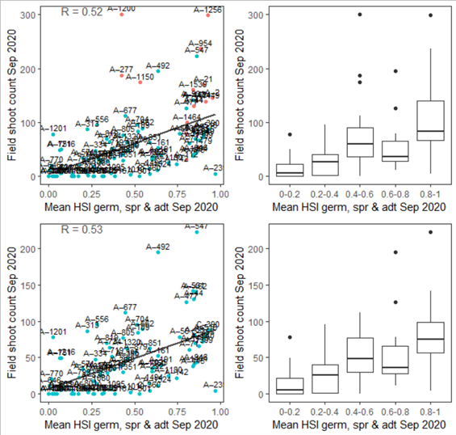
```

**ii. Field flower count Sep 2020 (obs) vs. HSI sexual Sep 2020 (model)**

Average number of flowers per core sampled in Sep - Oct 2020 were compared with HSI for sexual reproduction up to end of Sep in the same year (Figure \@ref(fig:hchbv2-flower2020-box). This has resulted in slightly better validation scores for the whole Coorong compared to HCHB validation version 1.

```{r hchbv2-flower2020, echo = FALSE, out.width='100%', class = "text-image", fig.cap = ""}
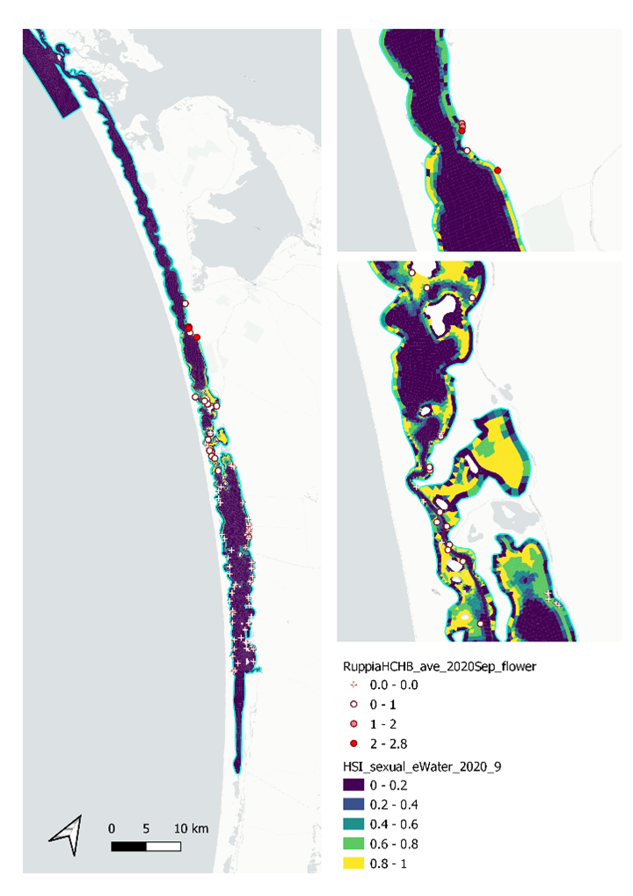
```

```{r hchbv2-flower2020-box, echo = FALSE, out.width='100%', class = "text-image", fig.cap = "Average flower count per core in 2020 Sep (circles) overlaid on HSI model output for sexual reproduction to end of Sep in 2020 (top), and validation plots for the entire lagoon separated into north and south (middle, red: north, blue: south, 100m buffer), and south lagoon only (bottom, 100m buffer). An HSI of 0 (dark purple) represents unsuitable habitat conditions, while an HSI of 1 represents optimal conditions (yellow)."}
knitr::include_graphics("images/lagoon_habitat/hchbv2_flower2020vsHSI_box.png")
```

**iii. Field seed count Mar 2021 (obs) vs. HSI sexual Dec 2020 (model)**

Average number of seeds per core sampled in Mar were compared with HSI for sexual reproduction up to the end of 2020 (Figure \@ref(fig:hchbv2-seed2021-box)). This has resulted in slightly better validation scores compared to HCHB validation version 1.

```{r hchbv2-seed2021, echo = FALSE, out.width='100%', class = "text-image", fig.cap = ""}
knitr::include_graphics("images/lagoon_habitat/hchbv2_seed2021vsHSI.png")
```

```{r hchbv2-seed2021-box, echo = FALSE, out.width='100%', class = "text-image", fig.cap = "Average seed count per core in 2021 Mar (circles) overlaid on HSI model output for sexual reproduction to end of 2020 (top), and validation plots for the entire lagoon separated into north and south (middle, red: north, blue: south, 100m buffer), and south lagoon only (bottom, 100m buffer). An HSI of 0 (dark purple) represents unsuitable habitat conditions, while an HSI of 1 represents optimal conditions (yellow)."}
knitr::include_graphics("images/lagoon_habitat/hchbv2_seed2021vsHSI_box.png")
```

**iv. Field turion count Sep 2020 (obs) vs. HSI asexual Sep 2020 (model)**

Average number of turions per core sampled in Sep 2020 were compared with HSI for asexual reproduction up to the end of Sep 2020 (Figure \@ref(fig:hchbv2-turion2020-box)). Validation results for turion occurrences should be interpreted with caution, as the environmental thresholds used for turion formation (derived from Kim et al. 2015) was likely biased from a year with very high salinities (discussed in Section 8.1.3.1).

```{r hchbv2-turion2020, echo = FALSE, out.width='100%', class = "text-image", fig.cap = ""}
knitr::include_graphics("images/lagoon_habitat/hchbv2_turion2020vsHSI.png")
```

```{r hchbv2-turion2020-box, echo = FALSE, out.width='100%', class = "text-image", fig.cap = "Average turion count per core in 2020 Sep (circles) overlaid on HSI model output for asexual reproduction to end of Sep in 2020 (top), and validation plots for the entire lagoon separated into north and south (middle, red: north, blue: south, 100m buffer), and south lagoon only (bottom, 100m buffer). An HSI of 0 (dark purple) represents unsuitable habitat conditions, while an HSI of 1 represents optimal conditions (yellow)."}
knitr::include_graphics("images/lagoon_habitat/hchbv2_turion2020vsHSI_box.png")
```

**v. Field turion count Mar 2021 (obs) vs. HSI asexual Dec 2020 (model)**

Average number of turions per core sampled in Mar - Apr 2021 were compared with HSI for asexual reproduction to the end of 2020 (Figure \@ref(fig:hchbv2-turion2021-box)). Validation results for turion occurrences should be interpreted with caution, as the environmental thresholds used for turion formation (derived from Kim et al. 2015) was likely biased from a year with very high salinities (discussed in Section 8.1.3.1).

```{r hchbv2-turion2021, echo = FALSE, out.width='100%', class = "text-image", fig.cap = ""}
knitr::include_graphics("images/lagoon_habitat/hchbv2_turion2021vsHSI.png")
```

```{r hchbv2-turion2021-box, echo = FALSE, out.width='100%', class = "text-image", fig.cap = "Average turion count per core in 2021 Mar (circles) overlaid on HSI model output for asexual reproduction to end of 2020 (top), and validation plots for the entire lagoon separated into north and south (middle, red: north, blue: south, 100m buffer), and south lagoon only (bottom, 100m buffer). An HSI of 0 (dark purple) represents unsuitable habitat conditions, while an HSI of 1 represents optimal conditions (yellow)."}
knitr::include_graphics("images/lagoon_habitat/hchbv2_turion2021vsHSI_box.png")
```

**vi. Field algae cover % Sep 2020 (obs) vs. HSI Ulva Sep 2020 (model)**

Site macroalgae cover proportion in Sep - Oct 2020 were compared with Ulva HSI in the same year up to end of Sep (Figure \@ref(fig:hchbv2-algaecover2020-box)). This has resulted in slightly better validation scores compared to HCHB validation version 1.

```{r hchbv2-algaecover2020, echo = FALSE, out.width='100%', class = "text-image", fig.cap = ""}
knitr::include_graphics("images/lagoon_habitat/hchbv2_algaecover2020vsHSI.png")
```

```{r hchbv2-algaecover2020-box, echo = FALSE, out.width='100%', class = "text-image", fig.cap = "Site macroalgae cover proportion (%) in 2020 Sep (circles) overlaid on HSI model output for Ulva to end of Sep 2020 (top), and validation plots for the entire lagoon separated into north and south (middle, red: north, blue: south, 100m buffer), and south lagoon only (bottom, 100m buffer). An HSI of 0 (dark purple) represents unsuitable habitat conditions, while an HSI of 1 represents optimal conditions (yellow)."}
knitr::include_graphics("images/lagoon_habitat/hchbv2_algaecover2020vsHSI_box.png")
```

## Model assessment - HCHB Generation 2.0 {.unnumbered}

<br> Ruppia survey data and associated model output used for the Gen II model assessment as well as validation metrics (correlation coefficients) are summarised in Table \@ref(tab:validpairs-old), and results described in following subsections. Overall, implementation of the *Ruppia* Gen II model has improved validation scores on most life-cycle phases, in particular field turion abundance versus modelled HSI for asexual reproduction due to a major update on the turion environmental threshold parameters. In most cases, model achieved a higher validation score in the south lagoon compared to the whole lagoon, which offers a higher confidence in assessing potential management options that are focused in the south. Model performance was significantly better in 2020 than in 2021 (for all validation pairs in the whole lagoon: average R = 0.4 in 2020 versus R = 0.11 in 2021). The lower scores in 2021 may be due to 1) an unusually cool and wet conditions experienced in the winter/spring 2021 that has delayed the *Ruppia* life cycle, particularly the flowering phase which may be triggered by rising temperature (Waycott 2022, pers.comm.), the threshold of which is currently unknown; 2) quantitative field surveys were conducted in Dec only in 2021 due to accessibility issues in extremely wet conditions prior to Dec, instead of between Sep and Dec in 2020.

```{r validpairs-old, echo=FALSE, message=FALSE, warning=FALSE}
library(kableExtra)
library(readxl)
theSheet <- read_excel('tables/habitat/AllTables.xlsx', sheet =12)

kbl(theSheet[,1:6], digits = 2, caption = "Summary of *Ruppia* survey data with their corresponding model output used for validation of the Gen 2 model, and correlation coefficients (*r*) between field abundance and modelled Habitat Suitability Index (HSI).", align = "l",escape = F) %>%  #escape controls whether the syntax in table is interpreted
  row_spec(0, background = "#14759e", bold = TRUE, color = "white") %>%
  kable_styling(bootstrap_options = "basic", full_width = T,font_size = 10) 
  # column_spec(1, width = "12em")%>%
  # column_spec(2, width = "12em")%>%
  # column_spec(4, width = "10em")%>%
#  scroll_box(fixed_thead = FALSE) %>%
```

<br>

**i. Field shoot count Sep 2020 (obs) vs. HSI seed germination + turion viability + turion sprouting + adult growth Sep 2020 (model)**

Average number of seagrass shoots per square meter recorded in Sep - Dec 2020 (reproductive period) were compared with combined HSI for seed germination, turion sprouting and adult growth up to end of Sep in the same year (Figure \@ref(fig:hchb-shoot2020map) and \@ref(fig:hchb-shoot2020-old)). The Gen II model update has resulted in slightly higher validation scores (correlation coefficient) than that of the Gen 0 model. The overall distribution of shoots was consistent with model prediction. Seagrass density around the middle lagoon and north lagoon were higher, where HSI predictions were highest.

```{r hchb-shoot2020map, echo = FALSE, out.width='100%', class = "text-image", fig.cap = "Average seagrass shoot count per square meter in Sep – Dec 2020 (circles) overlaid on HSI model output for germination, sprouting and adult growth integrated over Jan - Sep 2020. An HSI of 0 (dark purple) represents unsuitable habitat conditions, while an HSI of 1 represents optimal conditions (yellow)."}

knitr::include_graphics("images/lagoon_habitat/shoot2020_germspradt2020_map.png")

```

```{r hchb-shoot2020-old, echo = FALSE, out.width='100%', class = "text-image", fig.cap = "Scatter plot and boxplot of average seagrass shoot count per square meter in Sep – Dec 2020 versus HSI model output for germination, sprouting and adult growth integrated over Jan - Sep 2020. Top panel: the entire lagoon (red: north, blue: south), bottom panel: south lagoon. An HSI of 0 represents unsuitable habitat conditions, while an HSI of 1 represents optimal conditions."}

knitr::include_graphics("images/lagoon_habitat/shoot2020_germspradt2020.png")

```

<br>

**ii. Field flower count Sep 2020 (obs) vs. HSI sexual Oct 2020 (model)**

Average number of *Ruppia* flower per square meter recorded in Sep - Dec 2020 (reproductive period) were compared with overall HSI for sexual reproduction up to end of Oct in the same year (Figure \@ref(fig:hchb-flower2020map) and \@ref(fig:hchb-flower2020-old)). The Gen II has similar validation scores of the Gen 0 model. The overall distribution of flowers was consistent with model prediction. Highest density of flowers was found in the north lagoon where HSI predictions were highest. Almost no flowers were recorded in the south lagoon, where HSI predictions were low.

```{r hchb-flower2020map, echo = FALSE, out.width='100%', class = "text-image", fig.cap = "Average *Ruppia* flower count per square meter in Sep – Dec 2020 (circles) overlaid on HSI model output for overall sexual reproduction integrated over Jan – Oct 2020. An HSI of 0 (dark purple) represents unsuitable habitat conditions, while an HSI of 1 represents optimal conditions (yellow)."}

knitr::include_graphics("images/lagoon_habitat/flower2020_sexual2020_map.png")

```

```{r hchb-flower2020-old, echo = FALSE, out.width='100%', class = "text-image", fig.cap = "Scatter plot and boxplot of average *Ruppia* flower count per square meter in Sep – Dec 2020 versus HSI model output for overall sexual reproduction integrated over Jan - Oct 2020. Top panel: the entire lagoon (red: north, blue: south), bottom panel: south lagoon. An HSI of 0 represents unsuitable habitat conditions, while an HSI of 1 represents optimal conditions."}

knitr::include_graphics("images/lagoon_habitat/flower2020_sexual2020.png")

```

<br>

**iii. Field seed count Mar 2021 (obs) vs. HSI sexual Dec 2020 (model)**

Average number of *Ruppia tuberosa* seed per square meter recorded in Mar - Apr 2021 (aestivation period) were compared with overall HSI for sexual reproduction in 2020 (Figure \@ref(fig:hchb-seed2021map) and \@ref(fig:hchb-seed2021-old)). The Gen II model update has resulted in better validation scores than the Gen 0 model, especially in the south lagoon. It's important to note that seeds have the potential to disperse with water current/wind therefore its distribution and abundance may be less predictable than other plant materials.

```{r hchb-seed2021map, echo = FALSE, out.width='100%', class = "text-image", fig.cap = "Average *Ruppia tuberosa* seed count per square meter in Mar – Apr 2021 (circles) overlaid on HSI model output for overall sexual reproduction integrated over Jan – Dec 2020. An HSI of 0 (dark purple) represents unsuitable habitat conditions, while an HSI of 1 represents optimal conditions (yellow)."}


```

```{r hchb-seed2021-old, echo = FALSE, out.width='100%', class = "text-image", fig.cap = "Scatter plot and boxplot of average *Ruppia tuberosa* seed count per square meter in Mar – Apr 2021 versus HSI model output for overall sexual reproduction integrated over Jan - Dec 2020. Top panel: the entire lagoon (red: north, blue: south), bottom panel: south lagoon. An HSI of 0 represents unsuitable habitat conditions, while an HSI of 1 represents optimal conditions."}

knitr::include_graphics("images/lagoon_habitat/seed2021_sexual2020.png")
```

<br>

**iv. Field turion count Sep 2020 (obs) vs. HSI asexual Oct 2020 (model)**

Average number of *Ruppia* turion (type I and II) per square meter recorded in Sep - Dec 2020 (reproductive period) were compared with overall HSI for asexual reproduction up to end of Oct in the same year (Figure \@ref(fig:hchb-turion2020map) and \@ref(fig:hchb-turion2020-old)). The Gen 2 model update has significantly improved validation scores compared to the Gen 0 model due to a major change in salinity threshold parameter. The overall distribution of turions agreed with model prediction in that more turions were found around the middle lagoon and northern end of south lagoon, where HSI were highest.

```{r hchb-turion2020map, echo = FALSE, out.width='100%', class = "text-image", fig.cap = "Average *Ruppia* turion count per square meter in Sep – Dec 2020 (circles) overlaid on HSI model output for overall asexual reproduction integrated over Jan – Oct 2020. An HSI of 0 (dark purple) represents unsuitable habitat conditions, while an HSI of 1 represents optimal conditions (yellow)."}

knitr::include_graphics("images/lagoon_habitat/turion2020_asexual2020_map.png")
```

```{r hchb-turion2020-old, echo = FALSE, out.width='100%', class = "text-image", fig.cap = "Scatter plot and boxplot of average *Ruppia* turion count per square meter in Sep – Dec 2020 versus HSI model output for overall asexual reproduction integrated over Jan - Oct 2020. Top panel: the entire lagoon (red: north, blue: south), bottom panel: south lagoon. An HSI of 0 represents unsuitable habitat conditions, while an HSI of 1 represents optimal conditions."}

knitr::include_graphics("images/lagoon_habitat/turion2020_asexual2020.png")
```

<br>

**v. Field shoot count Dec 2021 (obs) vs. HSI seed germination + turion viability + turion sprouting + adult growth Sep 2021 (model)**

Average number of seagrass shoots per square meter recorded in Dec 2021 (reproductive period) were compared with combined HSI for seed germination, turion sprouting and adult growth up to end of Sep in the same year (Figure \@ref(fig:hchb-shoot2021map) and \@ref(fig:hchb-shoot2021-old)). The validation scores of 2021 were lower than that of 2020, possibly due to the environmental conditions experienced in winter-spring 2021 (including unusually cool and wet conditions), which may have caused a delay in the *Ruppia* life cycle (Waycott 2022, pers. comm.).

```{r hchb-shoot2021map, echo = FALSE, out.width='100%', class = "text-image", fig.cap = "Average seagrass shoot count per square meter in Dec 2021 (circles) overlaid on HSI model output for germination, sprouting and adult growth integrated over Jan - Sep 2021. An HSI of 0 (dark purple) represents unsuitable habitat conditions, while an HSI of 1 represents optimal conditions (yellow)."}

knitr::include_graphics("images/lagoon_habitat/shoot2021_germspradt2021_map.png")
```

```{r hchb-shoot2021-old, echo = FALSE, out.width='100%', class = "text-image", fig.cap = "Scatter plot and boxplot of average seagrass shoot count per square meter in Dec 2021 versus HSI model output for germination, sprouting and adult growth integrated over Jan - Sep 2020. Top panel: the entire lagoon (red: north, blue: south), bottom panel: south lagoon. An HSI of 0 represents unsuitable habitat conditions, while an HSI of 1 represents optimal conditions."}

knitr::include_graphics("images/lagoon_habitat/shoot2021_germspradt2021.png")
```

<br>

**vi. Field flower count Dec 2021 (obs) vs. HSI sexual Dec 2021 (model)**

Average number of *Ruppia* flowers per square meter recorded in Dec 2021 (reproductive period) were compared with overall HSI for sexual reproduction in 2021 (Figure \@ref(fig:hchb-flower2021map) and \@ref(fig:hchb-flower2021-old)). The validation scores of 2021 were lower than that of 2020, possibly due to the environmental conditions experienced in winter-spring 2021 (including unusually cool and wet conditions), which may have caused a delay in the *Ruppia* life cycle (Waycott 2022, pers. comm.). Overall very few flowers were recorded in the 2021 reproductive period. It was speculated that flowering may be triggered by warming temperature (Waycott 2022, pers. comm.), the threshold of which remains unclear (in the current model the temperature threshold for flowering is assumed to be the same as vegetative growth).

```{r hchb-flower2021map, echo = FALSE, out.width='100%', class = "text-image", fig.cap = "Average *Ruppia* flower count per square meter in Dec 2021 (circles) overlaid on HSI model output for overall sexual reproduction integrated over Jan – Dec 2021. An HSI of 0 (dark purple) represents unsuitable habitat conditions, while an HSI of 1 represents optimal conditions (yellow)."}

knitr::include_graphics("images/lagoon_habitat/flower2021_sexual2021_map.png")
```

```{r hchb-flower2021-old, echo = FALSE, out.width='100%', class = "text-image", fig.cap = "Scatter plot and boxplot of average *Ruppia* flower count per square meter in Dec 2021 versus HSI model output for overall sexual reproduction integrated over Jan – Dec 2021. Top panel: the entire lagoon (red: north, blue: south), bottom panel: south lagoon. An HSI of 0 represents unsuitable habitat conditions, while an HSI of 1 represents optimal conditions."}

knitr::include_graphics("images/lagoon_habitat/flower2021_sexual2021.png")
```

<br>

**vii. Field seed count Dec 2021 (obs) vs. HSI sexual Dec 2021 (model)**

Average number of *Ruppia tuberosa* seeds per square meter recorded in Dec 2021 (reproductive period) were compared with overall HSI for sexual reproduction in 2021 (Figure \@ref(fig:hchb-seed2021map-2) and \@ref(fig:hchb-seed2021-2-old)). The validation scores of 2021 were lower than that of 2020. This is as expected, since flowering activity was markedly delayed in 2021 and would not have set seed in Dec yet.

```{r hchb-seed2021map-2, echo = FALSE, out.width='100%', class = "text-image", fig.cap = "Average *Ruppia tuberosa* seed count per square meter in Dec 2021 (circles) overlaid on HSI model output for overall sexual reproduction integrated over Jan – Dec 2021. An HSI of 0 (dark purple) represents unsuitable habitat conditions, while an HSI of 1 represents optimal conditions (yellow)."}

knitr::include_graphics("images/lagoon_habitat/seed2021_sexual2021_map.png")
```

```{r hchb-seed2021-2-old, echo = FALSE, out.width='100%', class = "text-image", fig.cap = "Scatter plot and boxplot of average *Ruppia tuberosa* seed count per square meter in Dec 2021 versus HSI model output for overall sexual reproduction integrated over Jan - Dec 2021. Top panel: the entire lagoon (red: north, blue: south), bottom panel: south lagoon. An HSI of 0 represents unsuitable habitat conditions, while an HSI of 1 represents optimal conditions."}

knitr::include_graphics("images/lagoon_habitat/seed2021_sexual2021.png")
```

<br>

**viii. Field turion count Dec 2021 (obs) vs. HSI asexual Dec 2021 (model)**

Average number of *Ruppia* turion (type I and II) per square meter recorded in Dec 2021 (reproductive period) were compared with overall HSI for asexual reproduction in 2021 (Figure \@ref(fig:hchb-turion2021map) and \@ref(fig:hchb-turion2021-old)). Validation scores for 2021 is markedly higher than in 2020. The overall distribution of turions agreed with model prediction in that more turions were found around the middle lagoon and northern half of south lagoon, where HSI were higher.

```{r hchb-turion2021map, echo = FALSE, out.width='100%', class = "text-image", fig.cap = "Average *Ruppia* turion count per square meter in Dec 2021 (circles) overlaid on HSI model output for overall asexual reproduction integrated over Jan – Dec 2021. An HSI of 0 (dark purple) represents unsuitable habitat conditions, while an HSI of 1 represents optimal conditions (yellow)."}

knitr::include_graphics("images/lagoon_habitat/turion2021_asexual2021_map.png")
```

```{r hchb-turion2021-old, echo = FALSE, out.width='100%', class = "text-image", fig.cap = "Scatter plot and boxplot of average *Ruppia* turion count per square meter in Dec 2021 versus HSI model output for overall asexual reproduction integrated over Jan - Dec 2021. Top panel: the entire lagoon (red: north, blue: south), bottom panel: south lagoon. An HSI of 0 represents unsuitable habitat conditions, while an HSI of 1 represents optimal conditions."}

knitr::include_graphics("images/lagoon_habitat/turion2021_asexual2021.png")
```

<br>

**x. Field shoot count Jul 2018 (obs) vs. HSI seed germination + turion viability + turion sprouting + adult growth Jun 2018 (model)**

Average number of seagrass shoots per 7.5 cm core recorded in Jul 2018 were compared with combined HSI for seed germination, turion sprouting and adult growth up to end of Jun in the same year (Figure \@ref(fig:hchb-shoot2018map) and \@ref(fig:hchb-shoot2018-old)). There was some mismatch between model prediction and field observation, in that model predicted most suitable conditions in the north lagoon where no shoots were recorded, and less suitable conditions in the south lagoon where a small number of shoots were recorded.

```{r hchb-shoot2018map, echo = FALSE, out.width='100%', class = "text-image", fig.cap = "Average seagrass shoot count per 7.5 cm core in Jul 2018 (circles) overlaid on HSI model output for germination, sprouting and adult growth integrated over Jan – Jun 2018. An HSI of 0 (dark purple) represents unsuitable habitat conditions, while an HSI of 1 represents optimal conditions (yellow)."}

knitr::include_graphics("images/lagoon_habitat/shoot2018_germspradt2018_map.png")
```

```{r hchb-shoot2018-old, echo = FALSE, out.width='100%', class = "text-image", fig.cap = "Scatter plot and boxplot of average seagrass shoot count per 7.5 cm core in Jul 2018 versus HSI model output for germination, sprouting and adult growth integrated over Jan – Jun 2018. Top panel: the entire lagoon (red: north, blue: south), bottom panel: south lagoon. An HSI of 0 represents unsuitable habitat conditions, while an HSI of 1 represents optimal conditions."}

knitr::include_graphics("images/lagoon_habitat/shoot2018_germspradt2018.png")
```

<br>

**xi. Field seed count Jan 2019 (obs) vs. HSI sexual Dec 2018 (model)**

Average number of *Ruppia tuberosa* seeds per 7.5 cm core recorded in Jan 2019 were compared with overall HSI for sexual reproduction in 2018 (Figure \@ref(fig:hchb-seed2019map) and \@ref(fig:hchb-seed2019-old)). The overall distribution of seeds agreed with model predictions. More seeds were found around the middle lagoon where model predicted higher HSIs.

```{r hchb-seed2019map, echo = FALSE, out.width='100%', class = "text-image", fig.cap = "Average *Ruppia tuberosa* seed count per 7.5 cm core in Jan 2019 (circles) overlaid on HSI model output for overall sexual reproduction integrated over Jan – Dec 2018. An HSI of 0 (dark purple) represents unsuitable habitat conditions, while an HSI of 1 represents optimal conditions (yellow)."}

knitr::include_graphics("images/lagoon_habitat/seed2019_sexual2018_map.png")
```

```{r hchb-seed2019-old, echo = FALSE, out.width='100%', class = "text-image", fig.cap = "Scatter plot and boxplot of average *Ruppia tuberosa* seed count per 7.5 cm core in Jan 2019 versus HSI model output for overall sexual reproduction integrated over Jan - Dec 2018. Top panel: the entire lagoon (red: north, blue: south), bottom panel: south lagoon. An HSI of 0 represents unsuitable habitat conditions, while an HSI of 1 represents optimal conditions."}

knitr::include_graphics("images/lagoon_habitat/seed2019_sexual2018.png")
```

<br>

**xii. Field turion count Jan 2019 (obs) vs. HSI asexual Dec 2018 (model)**

Average number of *Ruppia* turions (type I and II) per 7.5 cm core recorded in Jan 2019 were compared with overall HSI for asexual reproduction in 2018 (Figure \@ref(fig:hchb-turion2019map) and \@ref(fig:hchb-turion2019-old)). Higher density of turions were recorded around the northern end of south lagoon, where our model also predicted high HSIs, however there are also sites with a mismatch between modelled and observed, such as around the southern end of north lagoon.

```{r hchb-turion2019map, echo = FALSE, out.width='100%', class = "text-image", fig.cap = "Average *Ruppia* turion count per 7.5 cm core in Jan 2019 (circles) overlaid on HSI model output for overall asexual reproduction integrated over Jan – Dec 2018. An HSI of 0 (dark purple) represents unsuitable habitat conditions, while an HSI of 1 represents optimal conditions (yellow)."}

knitr::include_graphics("images/lagoon_habitat/turion2019_asexual2018_map.png")
```

```{r hchb-turion2019-old, echo = FALSE, out.width='100%', class = "text-image", fig.cap = "Scatter plot and boxplot of average *Ruppia* turion count per 7.5 cm core in Jan 2019 versus HSI model output for overall asexual reproduction integrated over Jan - Dec 2018. Top panel: the entire lagoon (red: north, blue: south), bottom panel: south lagoon. An HSI of 0 represents unsuitable habitat conditions, while an HSI of 1 represents optimal conditions."}

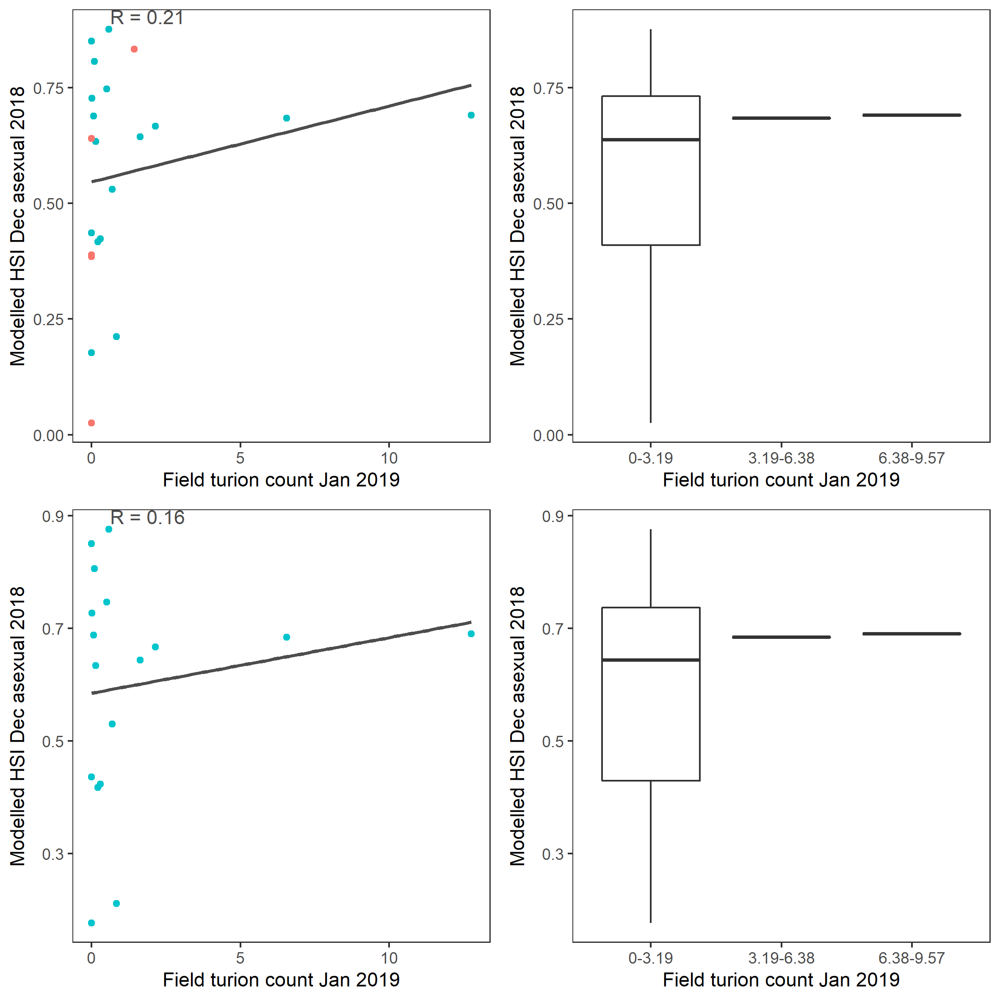
```

<!--chapter:end:appendix_c.Rmd-->

# Appendix D : Sediment Data {.unnumbered}

### Sample points {.unnumbered}

A rich dataset with many types of data were collected along the length of the lagoon, shown in \@ref(fig:dev-seddata1). These sites are referred to throughout this document and catalogued here on one section to create an overview. The grab samples (24) and rapid assessments (50) were taken at many points and provided one snapshot in time, in the surface sediment only. The grab samples were taken at the same points as almost half of the rapid samples and were submitted for many assays, such as total metals, as well as sediment quality. The rapid assessment samples were assessed for texture, colour and oxic/sulfidic state. Seven extra particle size samples were taken, which complement the sediment texture data from the grab samples. Five sites had cores taken in two seasons and used to measured sediment-water fluxes, as well as concentration-depth profiles. Macro invertebrate samples were taken at seven points, and one sample was transplanted to an eighth point. Finally, particle fluxes were measured at the site Villa de Yumpa.

```{r dev-seddata1, echo = FALSE, out.width='33%', class = "text-image",fig.show='hold',fig.align='center', fig.cap = "Overview of the locations and different types of sediment sample data across the Cooorong. Left - Grab samples. Centre - Particle size samples. Right - Cores. "}

knitr::include_graphics(c("images/dev/AppD/sed_GrabsMap.png"
                          ,"images/dev/AppD/sed_ParticleSizeMap.png"
                          ,"images/dev/AppD/sed_CoresMap.png"
                        ))

```

\

```{r dev-seddata1b, echo = FALSE, out.width='33%', class = "text-image",fig.show='hold',fig.align='center', fig.cap = "Overview of the locations and different types of sediment sample data across the Cooorong. Left - Macroinvertebrates. Centre - Rapid assessments. Right - Flux chamber. "}

knitr::include_graphics(c("images/dev/AppD/sed_MacrosMap.png"
                          ,"images/dev/AppD/sed_RapidMap.png"
                          ,"images/dev/AppD/sed_FluxChamberMap.png"
                        ))

```

### Sediment quality {.unnumbered}

Two sediment quality surveys by the University of Adelaide provided sediment quality data along the length of the lagoon (Figure \@ref(fig:dev-seddata2)). 24 grab samples were measured for % moisture, and proportions of gravel, sand, silt and clay. Seven other samples were taken for grain size analysis in classes of gravel, coarse sand, medium sand, fine sand, very fine sand and mud. These measured points were categorized to represent the ten Coorong zones, as well as deep and shallow areas.

\

```{r dev-seddata2, echo = FALSE, out.width='67%', class = "text-image",fig.show='hold',fig.align='center', fig.cap = "Locations of the three types of sediment quality data sampling points. In this appendix, zone numbers refer to the north-south allocation of zones before subdivision into bank/shallow zones. Hence 1 refers to 11, 12 and 13, 2 refers to 21, 22 and 23 etc."}

knitr::include_graphics(c("images/dev/AppD/sed_GrabGrainRapMap.png"
                        ))

```

\

The sediment quality points are summarised in \@ref(tab:3dev-sedQual1). The sediment quality was either sand with low % moisture and low organic matter, clay with high moisture and high organic matter, or somewhere in between these (\@ref(tab:3dev-sedQual2)). The zones that had a combination of these were further refined according to depth.

\

<center>

```{r 3dev-sedQual1, echo=FALSE, message=FALSE, warning=FALSE}
 library(knitr)
 library(kableExtra)
 library(readxl)
sediment_linkvars <- read_xlsx("tables/sed/SedQualitySamples.xlsx", sheet = "AllZones2" )
 kable(sediment_linkvars,"html", escape = F, align = "c", caption = "Summary of sediment quality classifications for each of the 31 zones.",
       bootstrap_options = "hover") %>%
   kable_styling(sediment_linkvars, bootstrap_options = "hover", 
                 full_width = F, position = "center", 
                 font_size = 12) %>% 
   row_spec(0, background = "#14759e", bold = TRUE, color = "white") %>%  
   column_spec(1, width_min = "10em") %>%
   column_spec(2, width_min = "20em") %>% 
   column_spec(3, width_min = "10em") %>% 
   column_spec(4, width_min = "10em") %>%
   column_spec(5, width_min = "10em") %>%
   column_spec(6, width_min = "10em") %>%
   row_spec(1:10, background = 'white') %>% 
    scroll_box(width = "650px", height = "400px",
               fixed_thead = FALSE)
```

\

```{r 3dev-sedQual2, echo=FALSE, message=FALSE, warning=FALSE}
 library(knitr)
 library(kableExtra)
 library(readxl)
sediment_linkvars <- read_xlsx("tables/sed/SedQualitySamples.xlsx", sheet = "TextMoistOM" )
 kable(sediment_linkvars,"html", escape = F, align = "c", caption = "Most common combinations of texture, moisture and organic matter across the samples.",
       bootstrap_options = "hover") %>%
   kable_styling(sediment_linkvars, bootstrap_options = "hover", 
                 full_width = F, position = "center", 
                 font_size = 12) %>% 
   row_spec(0, background = "#14759e", bold = TRUE, color = "white") %>%  
   column_spec(1, width_min = "10em") %>%
   column_spec(2, width_min = "20em") %>% 
   row_spec(1:3, background = 'white') #%>% 
   #scroll_box(width = "500px", height = "200px",
      #        fixed_thead = FALSE)
```

</center>

\

The % moisture data was calculated as the mass of water per total mass of sample. This measurement ranged from around 20% for sandy sediment to around 80% for clay sediment. Assuming a dry mass density of 2.7 kg L^-1^, these values translated to roughly 40% porosity for sand and 92% porosity for clay. The rapid assessments had a texture description converted to a scale of 1 to 5, where 1 represented sticky ooze and 5 represented coarse grains \@ref(fig:dev-seddata3)). The dominant texture type was assigned by zone. This was further refined for the bank and channel subzones.

<center>

(ref:hallett2019) @hallett2019

```{r 3dev-sedQual3, echo=FALSE, message=FALSE, warning=FALSE}
 library(knitr)
 library(kableExtra)
 library(readxl)
sediment_linkvars <- read_xlsx("tables/sed/SedQualitySamples.xlsx", sheet = "Rapid" )
 kable(sediment_linkvars,"html", escape = F, align = "c", caption = "Rapid assessment criteria, based on (ref:hallett2019). These samples assessed the grainy or oozy state of the sediment.",
       bootstrap_options = "hover") %>%
   kable_styling(sediment_linkvars, bootstrap_options = "hover", 
                 full_width = F, position = "center", 
                 font_size = 12) %>% 
   row_spec(0, background = "#14759e", bold = TRUE, color = "white") %>%  
   column_spec(1, width_min = "10em") %>%
   column_spec(2, width_min = "20em") %>% 
   column_spec(3, width_min = "10em") %>% 
   column_spec(4, width_min = "10em") %>%
   column_spec(5, width_min = "10em") %>%
   column_spec(6, width_min = "10em") %>%
   row_spec(1:3, background = 'white') %>% 
   scroll_box(width = "650px", height = "300px",
              fixed_thead = FALSE)
```

</center>

\

```{r dev-seddata3, echo = FALSE, out.width='40%', class = "text-image",fig.show='hold',fig.align='center', fig.cap = "Left - sediment texture measurements from the rapid samples. Right - Texture classifications assigned to zones."}

knitr::include_graphics(c("images/dev/AppD/sed_Texture.png"
                          ,"images/dev/AppD/sed_TextureZone.png"
                        ))

```

\

### Salinity {.unnumbered}

The salinity in the southern lagoon was much higher than in the northern lagoon, due to the evaporation of the water between rainfall events (\@ref(fig:dev-seddata4)). The Goyder Institute T&T report suggested that high salinity had destroyed habitat for macroinvertebrates (see also section Macroinvertebrates). Salinity was measured in the grab samples 0 to 5 cm deep. It is displayed in (\@ref(fig:dev-seddata4)) as interpolated sediment salinity. Note that it is hypersaline even in the northern lagoon, in zone 6.

```{r dev-seddata4, echo = FALSE, out.width='40%', class = "text-image",fig.show='hold',fig.align='center', fig.cap = "Interpolated salinity in the bottom water, performed by the University of Adelaide. Salinity is higher in the southern lagoon. For comparison, seawater is about 35 psu. The colour band only applies to the lagoon in the map, not the lakes, the ocean or zone 1."}

knitr::include_graphics(c("images/dev/AppD/sed_Salinity.png"
                        ))

```

### Sulfur {.unnumbered}

The rapid assessments gave the general oxic/sulfidic state of the sediment, where the ooze texture usually coincided with the sulfidic state of the sediment (see criteria in \@ref(tab:3dev-sedQual4). These were divided per zone (\@ref(fig:dev-seddata5)) and further divided by depth. There were no measurements of $SO_4^{2-}$ in the sediments or the water column, and so an estimate was made by correlating the $SO_4^{2-}$ concentration with salinity.

\

<center>

```{r 3dev-sedQual4, echo=FALSE, message=FALSE, warning=FALSE}
 library(knitr)
 library(kableExtra)
 library(readxl)
sediment_linkvars <- read_xlsx("tables/sed/SedQualitySamples.xlsx", sheet = "Rapid" )
 kable(sediment_linkvars,"html", escape = F, align = "c", caption = "Rapid assessment criteria, based on Hallett et al. (2019). These samples indicate the sulfidic state of the sediment.",
       bootstrap_options = "hover") %>%
   kable_styling(sediment_linkvars, bootstrap_options = "hover", 
                 full_width = F, position = "center", 
                 font_size = 12) %>% 
   row_spec(0, background = "#14759e", bold = TRUE, color = "white") %>%  
   column_spec(1, width_min = "10em") %>%
   column_spec(2, width_min = "20em") %>% 
   row_spec(1:3, background = 'white') %>% 
   scroll_box(width = "650px", height = "300px",
              fixed_thead = FALSE)
```

</center>

\

```{r dev-seddata5, echo = FALSE, out.width='40%', class = "text-image",fig.show='hold',fig.align='center', fig.cap = "Rapid tests in the Coorong, which indicate sulfidic state of the sediment. Left – Individual rapid assessment points; Right – rapid scores averaged across points in zone."}

knitr::include_graphics(c("images/dev/AppD/sed_RapidTotal.png"
                          ,"images/dev/AppD/sed_RapidZone.png"
                        ))

```

\

<center>

```{r 3dev-sedQual5, echo=FALSE, message=FALSE, warning=FALSE}
 library(knitr)
 library(kableExtra)
 library(readxl)
sediment_linkvars <- read_xlsx("tables/sed/SedQualitySamples.xlsx", sheet = "SCores" )
 kable(sediment_linkvars,"html", escape = F, align = "c", caption = "∑H~2~S core sites and times.",
       bootstrap_options = "hover") %>%
   kable_styling(sediment_linkvars, bootstrap_options = "hover", 
                 full_width = F, position = "center", 
                 font_size = 12) %>% 
   row_spec(0, background = "#14759e", bold = TRUE, color = "white") %>%  
   column_spec(1, width_min = "22em") %>%
   column_spec(2, width_min = "15em") %>% 
   column_spec(3, width_min = "15em") %>% 
   row_spec(1:3, background = 'white')  %>% 
   scroll_box(width = "650px", height = "400px",
               fixed_thead = FALSE)
```

</center>

\

### Nutrients {.unnumbered}

The grab samples also provided TN and TP measurements. These are shown as interpolated data (\@ref(fig:dev-seddata6)). Nutrients were concentrated in zones 4 and 6, either side of the narrow, shallow zone 5 that separates the north and south lagoons.

\

```{r dev-seddata6, echo = FALSE, out.width='40%', class = "text-image",fig.show='hold',fig.align='center', fig.cap = "Interpolated nutrients as calculated by University of Adelaide. Left - TN (%). Right - TP (mg kg^-1^),"}

knitr::include_graphics(c("images/dev/AppD/sed_TNInterp.png"
                          ,"images/dev/AppD/sed_TPInterp.png"
                        ))

```

\

Nutrients were measured in cores at three locations (\@ref(fig:dev-seddata7). While $NH_4^+$ was present in all cores, $PO_4^{3-}$ was below the detection limit at two of the points (in zones 2 and 7), and only above the detection limit at Parnka Point (zone 5). Note that zone 2 had high TP but low $PO_4^{3-}$, therefore it must be examined whether there were high concentrations of organic P. The $NH_4^+$ concentration reached around 0.1 mmol L-1 and the $PO_4^{3-}$ 0.01 mmol L-1 (\@ref(fig:dev-seddata8)).

\

<center>

```{r dev-seddata7, echo = FALSE, out.width='40%', class = "text-image",fig.show='hold',fig.align='center', fig.cap = "Sampling sites for nutrient cores, in which $NH_4^+$ and $PO_4^{3-}$ profiles were measured to 12 cm depth."}

knitr::include_graphics(c("images/dev/AppD/sed_NutrientCores.png"
                        ))

```

</center>

\

```{r dev-seddata8, echo = FALSE, out.width='80%', class = "text-image",fig.show='hold',fig.align='center', fig.cap = "Measured $NH_4^+$ and $PO_4^{3-}$ cores. $PO_4^{3-}$ was below detection limits for Noonameena and Policeman's Point sites."}

knitr::include_graphics(c("images/dev/AppD/sed_RawCores.png"
                        ))

```

\

```{r 3dev-sedQual5b, echo=FALSE, message=FALSE, warning=FALSE}
 library(knitr)
 library(kableExtra)
 library(readxl)
sediment_linkvars <- read_xlsx("tables/sed/SedQualitySamples.xlsx", sheet = "NutFlux" )
 kable(sediment_linkvars,"html", escape = F, align = "c", caption = "Measured nutrient fluxes from Parnka point (mmol m^-2^ y^-1^). The negative NH~4~^+^ dark value indicates that it fluxes from the water column to the sediment.",
       bootstrap_options = "hover") %>%
   kable_styling(sediment_linkvars, bootstrap_options = "hover", 
                 full_width = F, position = "center", 
                 font_size = 12) %>% 
   row_spec(0, background = "#14759e", bold = TRUE, color = "white") %>%  
   column_spec(1, width_min = "10em") %>%
   column_spec(2, width_min = "20em") %>% 
   row_spec(1:2, background = 'white') # %>% 
   # scroll_box(width = "500px", height = "350px",
              # fixed_thead = FALSE)
```

### Oxygen {.unnumbered}

The rapid assessment sites give an indication of whether the sediment was oxic (high value) or sulfidic (low value) (\@ref(fig:dev-seddata9)). Zones 3, 4, 6 and 7 were the least oxic.

\

```{r dev-seddata9, echo = FALSE, out.width='40%', class = "text-image",fig.show='hold',fig.align='center', fig.cap = "Rapid tests in the Coorong, which indicate oxic state of the sediment. Left – Individual rapid assessment points; Right – rapid scores averaged across points in zone."}

knitr::include_graphics(c("images/dev/AppD/sed_RapidTotal.png"
                          ,"images/dev/AppD/sed_RapidZone.png"
                        ))

```

\

Oxygen fluxes were measured at two sites, Parnka Point and Policeman's Point (\@ref(fig:dev-seddata10)). At each site, there were five cores. Each core was incubated for one to three hours in either light or dark conditions. The oxygen concentration in the headspace was measured. Parnka Point cores had concentration around 6 mg L^-1^, or 180 µmol L^-1^. This site had sandy sediment with low concentrations of organic matter and nutrients. (This was the same point that produced nutrient cores and fluxes.)

Policemans Point cores had concentration of 5 mg L^-1^, or 150 µmol L^-1^. This site had either clay or sand, with high concentrations of organic matter, nutrients, and sulfidic ooze. In all dark cores, the concentration dropped slightly. In all Policeman's Point light cores concentration increased. In the Parnka Point light cores, results were mixed: in three cores the concentration decreased and in two cores the concentration increased. There are four oxygen fluxes to work within (\@ref(tab:3dev-sedQual6)). Note that Parnka Point has a narrower range of flux and is still negative in the light conditions. Policeman's Point has a wider range and positive oxygen flux under light conditions.

\

<center>

```{r 3dev-sedQual6, echo=FALSE, message=FALSE, warning=FALSE}
 library(knitr)
 library(kableExtra)
 library(readxl)
sediment_linkvars <- read_xlsx("tables/sed/SedQualitySamples.xlsx", sheet = "OxyFlux" )
 kable(sediment_linkvars,"html", escape = F, align = "c", caption = " Oxygen flux (mol m^-2^ y^-1^). Negative values indicate that the oxygen fluxes from the water column to the sediment. The positive value indicates that the sediment produced oxygen and fluxes it to the water column",
       bootstrap_options = "hover") %>%
   kable_styling(sediment_linkvars, bootstrap_options = "hover",
                 full_width = F, position = "center",
                 font_size = 12) %>%
   row_spec(0, background = "#14759e", bold = TRUE, color = "white") %>%
   column_spec(1, width_min = "10em") %>%
   column_spec(2, width_min = "20em") #%>%
   # row_spec(1:3, background = 'white') %>%
   # scroll_box(width = "500px", height = "200px",
              # fixed_thead = FALSE)
```

\

```{r dev-seddata10, echo = FALSE, out.width='40%', class = "text-image",fig.show='hold',fig.align='center', fig.cap =" Locations where $O_2$ fluxes were measured.  "}

knitr::include_graphics(c("images/dev/AppD/sed_OxygenCores.png"
                        ))

```

</center>

### Organic matter {.unnumbered}

The grab samples provided a measure of total organic carbon (TOC). The highest areas mapped onto the areas of high nutrients (\@ref(fig:dev-seddata11)).

\

```{r dev-seddata11, echo = FALSE, out.width='40%', class = "text-image",fig.show='hold',fig.align='center', fig.cap = "TOC% from the grab samples. Left - Individual grab samples for TOC%. Right - TOC % applied to zones. "}

knitr::include_graphics(c("images/dev/AppD/sed_TOCgrab.png"
                         ,"images/dev/AppD/sed_TOC.png"
                        ))

```

\

TOC % was converted to organic matter (mmol L^-1^) according to the following rationale: - TOC % was measured as kg OC per kg dry sample (and the raw value was divided by 100).\
- The kg dry sample was converted to L of total sample as (%moisture / 100 + 2.7 × (1 - %moisture / 100)), where %moisture was measured at each site and 2.7 was the value assumed for kg solids per L solids.\
- The kg OC was converted to mol OC by dividing by 12 g / mol and multiplying by 1000 for g OC.\
- The mol OC / L was multiplied by 1000 for mmol OC / L total.\
- The mmol OC / L total was divided by 0.35 to get the total organic matter concentration.\
- The value 0.35 was derived by assuming a molecular formula of (CH~2~O)~A~(NH~3~)~B~(H~3~PO~4~)~C~ where the ratio A:B:C was assumed to be 106:16:1. Although there were total C and N measurements in the sediment data, there were no measurements of organic C:N:P ratios and so the assumed value was used.

### Macroinvertebrates {.unnumbered}

Macroinvertebrate populations were measured at seven locations (\@ref(fig:dev-seddata12)). The northernmost two sites (zones 10 and 9) had high abundance. Noonameena (zone 7) had moderately low abundance. The southernmost sites (zones 5 and 2) had very low abundance. The variable that explained this pattern was the hypersalinity (T&I reference document). A sample was taken from Jack Point (zone 2) and transplanted to Long Point (zone 8).

<center>

\

```{r dev-seddata12, echo = FALSE, out.width='40%', class = "text-image",fig.show='hold',fig.align='center', fig.cap =" Sampling sites for macroinvertebrate measurements."}

knitr::include_graphics(c("images/dev/AppD/sed_MacrosZ.png"
                        ))

```

</center>

### Iron and manganese {.unnumbered}

\

Total iron and manganese data were available from the grab samples (\@ref(fig:dev-seddata13)).

\

```{r dev-seddata13, echo = FALSE, out.width='40%', class = "text-image",fig.show='hold',fig.align='center', fig.cap = "Left - Total iron from grab samples. Right - total manganese from grab samples."}

knitr::include_graphics(c("images/dev/AppD/sed_irongrab.png"
                         ,"images/dev/AppD/sed_manganese.png"
                        ))

```

\

Cores were taken from five locations, in November 2020 and February 2021 (\@ref(fig:dev-seddata14)) and $Fe^{2+}$ was measured (Table 10). The presence of $Fe^{2+}$ indicates iron reduction of organic matter. The highest concentrations were at Parnka Point (zone 5) and Policeman's Point (zone 3) in November 2020. These were not sites that had very high TOC or nutrients.

\

<center>

```{r 3dev-sedQual7, echo=FALSE, message=FALSE, warning=FALSE}
 library(knitr)
 library(kableExtra)
 library(readxl)
sediment_linkvars <- read_xlsx("tables/sed/SedQualitySamples.xlsx", sheet = "FeCores" )
 kable(sediment_linkvars,"html", escape = F, align = "c", caption = "Times and locations of cores where $Fe^{2+}$ samples were taken.   ",
       bootstrap_options = "hover") %>%
   kable_styling(sediment_linkvars, bootstrap_options = "hover",
                 full_width = F, position = "center",
                 font_size = 12) %>%
   row_spec(0, background = "#14759e", bold = TRUE, color = "white") %>%
   column_spec(1, width_min = "10em") %>%
   column_spec(2, width_min = "20em") %>%
   row_spec(1:3, background = 'white') #%>%
   # scroll_box(width = "300px", height = "200px",
   #            fixed_thead = FALSE)
```

\

```{r 3dev-sedQual8, echo=FALSE, message=FALSE, warning=FALSE}
 library(knitr)
 library(kableExtra)
 library(readxl)
sediment_linkvars <- read_xlsx("tables/sed/SedQualitySamples.xlsx", sheet = "FeConcs" )
 kable(sediment_linkvars,"html", escape = F, align = "c", caption = " Approximate concentrations of $Fe^{2+}$ in core samples.  ",
       bootstrap_options = "hover") %>%
   kable_styling(sediment_linkvars, bootstrap_options = "hover",
                 full_width = F, position = "center",
                 font_size = 12) %>%
   row_spec(0, background = "#14759e", bold = TRUE, color = "white") %>%
   column_spec(1, width_min = "10em") %>%
   column_spec(2, width_min = "20em") %>%
   row_spec(1:3, background = 'white') #%>%
   # scroll_box(width = "300px", height = "200px",
              # fixed_thead = FALSE)
```

\

```{r dev-seddata14, echo = FALSE, out.width='40%', class = "text-image",fig.show='hold',fig.align='center', fig.cap =" Sampling locations for cores where $Fe^{2+}$ profiles were measured."}

knitr::include_graphics(c("images/dev/AppD/sed_IronCores.png"
                        ))

```

\

```{r dev-seddata15, echo = FALSE, out.width='50%', class = "text-image",fig.show='hold',fig.align='center', fig.cap =" Concentration profiles of $Fe^{2+}$."}

knitr::include_graphics(c("images/dev/AppD/sed_IronCoreProfiles.png"
                        ))

```

</center>

\

Iron data was also available from the water column sampling to use as a boundary at the sediment water interface. As with $SO_4^{2-}$, since the water column model did not simulate iron and so an approximation was taken from measured data. Data was available for total iron and dissolved iron (mg L^-1^), at 16 sites along the whole Coorong, for the time period 1998 to 2012. The dissolved iron was typically less than 1% of the total iron. Both were converted to mmol L^-1^ and averaged over the entire time period at each site. The total iron was assumed to be particulate iron and it was converted from mmol L^-1^ to a flux in mmol m^-2^ y^-1^ by multiplying the concentration by the deposition rate in cm y^-1^. The deposition rate was assumed to be 1 cm y-1.

\

### Iron sulfides {.unnumbered}

\

FeS and FeS~2~ are likely to be present in the sediments of the Coorong, however, they were not measured directly. Measurements of acid volatile sulphide (AVS) were taken with each grab sample by the field researchers. It was decided to attempt to connect AVS with FeS concentration, while still weighing the uncertainty of the connection.

An argument has been presented by Rickard and Morse (2005) that measured AVS is not necessarily a good proxy for FeS, because of differences in what is being measured at study sites. The AVS may not correspond to all of the sulphide in the sediment, it may correspond to different metal sulphide species and it may be partly organic sulphur compounds. The rapid assessments in the Coorong showed that there was a sulphurous black ooze in many of the sediment samples and so the presence of an organic sulphur compound mixed with metal sulphur compounds is possible. Several responses to Rickard and Morse's paper were published in the same issue, including one from Meysman and Middelburg, which presented the issue from the point of view of sediment diagenesis modellers. Meysman and Middelburg's perspective on modelling reflected the model used for this project well. They wrote that although Rickard and Morse's explanation is thorough and precise, it is not necessarily helpful for modellers, who cannot include all chemical species in their models, especially if there is not measured data for calibration. Considering this argument, the authors of this paper pursued the AVS measurement.

AVS was converted from units of '% S WW', which was assumed to be kg S (100 kg wet sediment)^-1^, to mmol S (L total volume)^-1^, using porosity at each grab site. (A sample of 0.025 % S WW converted to 3.7 mmol S L^-1^, where the porosity was 0.66). The average of the AVS grabs was 3.36 mmol L^-1^, the minimum value 0.26 and maximum 7.21 mmol L^-1^.

The AVS concentrations in the grab samples mostly corresponded with the values in the rapid assessments, with high concentrations usually in the deep channel and in zones 4, 5 and 6.

The AVS concentrations were compared to the total iron concentrations from the grab samples. The average total iron was 7.69 mmol L^-1^ total sediment, which implies roughly two Fe for each S on average over the lagoon. Each site did not have a clear correlation between S and Fe. Therefore it would be hard to justify an assignment of FeS concentration based on AVS. A compromise approximation was reached in which the FeS concentration was assigned as total Fe minus AVS. The remaining Fe was assigned as Fe(OH)~3~.

\

### pH and alkalinity {.unnumbered}

\
pH was generally high, with an average of 8.72, across the grab samples. This was likely a result of the high amounts of shell grit in the surface sediment, corresponding with the high scores in the rapid assessments. Inorganic carbon was measured as the difference between %Total carbon minus %Total organic carbon. The maximum value was in zone 2 at the inland edge, and the minimum value was in zone 6 in the channel.

<!--chapter:end:appendix_d.Rmd-->

