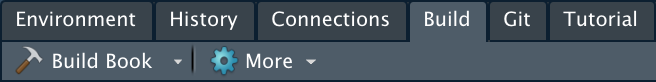

# CDM-manual

<!-- badges: start -->

[](https://github.com/gilesnknight/CDM-manual/issues)

<!-- badges: end -->

The goal of CDM-manual is to provide an easily editable "living manual" that describes the set-up and results of the Coorong Dynamics Model (CDM).

## Contributing

This manual was built using the R [bookdown](https://github.com/rstudio/bookdown) package - an extension of the [rmarkdown](https://github.com/rstudio/rmarkdown) package designed for writing long-form documents and generating outputs in multiple formats.

Below are basic instructions to help you get started editing the manual. For a detailed contribution guide, please read the [Contributing chapter](https://gilesnknight.github.io/CDM-manual/contributing.html) of the manual.

#### 1. Prerequisites

For the best experience, we recommend editing the manual using the [RStudio IDE](https://rstudio.com). Once installed, use the console to download the bookdown package:

```{r}
install.packages("bookdown")
```

#### 2. Clone the repository

Clone CDM-manual using [GitHub Desktop](https://desktop.github.com) or from your terminal:

```{bash}
git clone https://github.com/AquaticEcoDynamics/CDM.git
```

#### 3. Edit a chapter

Open the R project file `CDM-manual.Rpoj` and navigate to the `.Rmd` file that corresponds with the desired chapter you wish to edit. Once edits have been made, click the 'Build Book' button in RStudio's 'Build' tab to recompile (alternatively use the shortcut <kbd>Shift</kbd> + <kbd>CTRL</kbd> + <kbd>B</kbd> or <kbd>Shift</kbd> + <kbd>⌘</kbd> + <kbd>B</kbd>).



#### 4. Create a new chapter

Open the R project file `CDM-manual.Rpoj` and create a new blank `.Rmd` file. Write it's contents and save the file as the chapter name written in 'snake case' (e.g. 'Lagoon Water Quality' becomes `lagoon_water_quality.Rmd`). Navigate to `_bookdown.yml` and add the chapter `.Rmd` file to the `rmd_files` list. Save and re-build the book.

#### 5. Push the changes

Using GitHub Desktop or your terminal, push the changes back to the CDM-manual repository. Updates to the main branch will automatically trigger a re-build of the website.
