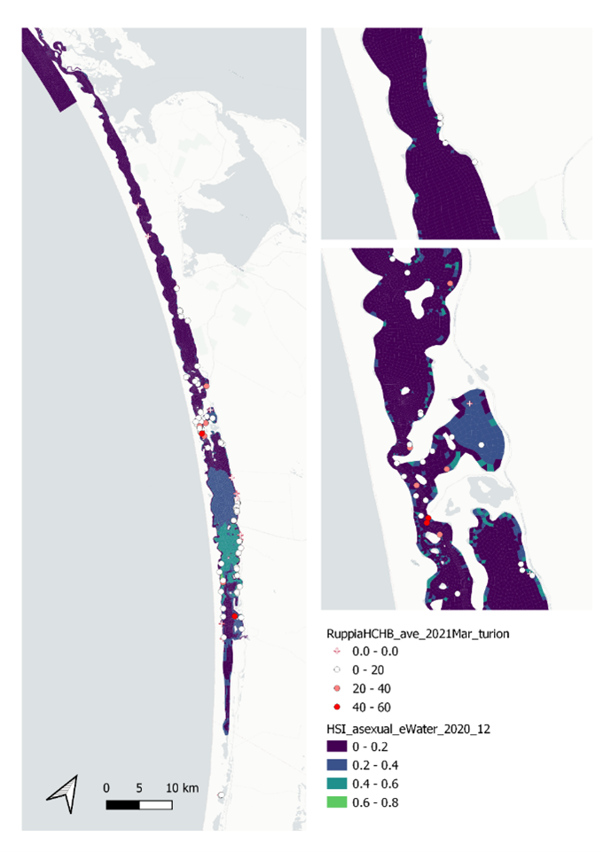

# Appendix: Ruppia model assessment - HCHB data version 2{-}

The major updates of this validation version include 1) a tailored model integration period that corresponds to each HCHB survey season so that model output can be directly compared with field data at the right time. For example, the default model output for HSI sexual is a result of integration of environmental conditions over the entire Ruppia growing season up to Dec, which goes beyond the Sep/Oct survey period, making field data and model results less comparable. Therefore, for validation against the Sep/Oct HCHB field data, models were configured to integrate HSI of each life-stage only to end of Sep; 2) pairing strategies between field data and model output have been refined. For example, field flower count is now being compared with modelled HSI sexual, which takes into account the probability of Ruppia going through germination/sprouting, adult growth and flowering, instead of the probability of flowering only (HSI flowering); 3) calculation of mean HSI within the buffer was improved from a simple arithmetic mean to a spatial (area-weighted) mean (Table \@ref(tab:validversion)). This is particularly relevant for sampling sites around the northern end of south lagoon, where grid cells vary significantly in size (Figure \@ref(fig:buffer)). Validation results are shown below.

```{r buffer, echo = FALSE, out.width='60%', class = "text-image", fig.cap = "Average turion count per core in 2021 Mar (circles) overlaid on HSI model output for asexual reproduction to end of 2020 (top), and validation plots for the entire lagoon separated into north and south (middle, red: north, blue: south, 100m buffer), and south lagoon only (bottom, 100m buffer). An HSI of 0 (dark purple) represents unsuitable habitat conditions, while an HSI of 1 represents optimal conditions (yellow)."}
knitr::include_graphics("images/lagoon_habitat/buffer.png")
```

**i.	Field seagrass shoot count Sep 2020 (obs) vs. HSI germination & sprouting & adult growth Sep 2020 (model)**

Average number of shoots per core sampled in Sep - Oct 2020 were compared with combined HSI for seed germination, turion sprouting and adult growth up to end of Sep in the same year (Figure \@ref(fig:hchbv2-shoot2020-box)). This has resulted in similar validation scores compared to HCHB validation version 1, which did not include the adult growth stage between Jun and Sep, possibly because the 1) adult stage is more resilient to a wide range of conditions than germination or sprouting; and 2) conditions in Jun – Sep in the lagoon are usually less extreme. Therefore, adding the HSI for adult life-stage during this period will not necessarily restrict (lower) the overall HSI.

```{r hchbv2-shoot2020, echo = FALSE, out.width='60%', class = "text-image", fig.cap = ""}
knitr::include_graphics("images/lagoon_habitat/hchbv2_shoot2020vsHSI.png")
```
```{r hchbv2-shoot2020-box, echo = FALSE, out.width='60%', class = "text-image", fig.cap = "Average shoot count per core in 2020 Sep (circles) overlaid on HSI model output for germination, sprouting and adult growth up to end of Sep in 2020 (top), and validation plots for the entire lagoon separated into north and south (middle, red: north, blue: south, 100m buffer), and south lagoon only (bottom, 100m buffer). An HSI of 0 (dark purple) represents unsuitable habitat conditions, while an HSI of 1 represents optimal conditions (yellow)."}
knitr::include_graphics("images/lagoon_habitat/hchbv2_shoot2020vsHSI_box.png")
```

**ii.	Field flower count Sep 2020 (obs) vs. HSI sexual Sep 2020 (model) **

Average number of flowers per core sampled in Sep - Oct 2020 were compared with HSI for sexual reproduction up to end of Sep in the same year (Figure \@ref(fig:hchbv2-flower2020-box). This has resulted in slightly better validation scores for the whole Coorong compared to HCHB validation version 1.

```{r hchbv2-flower2020, echo = FALSE, out.width='60%', class = "text-image", fig.cap = ""}
knitr::include_graphics("images/lagoon_habitat/hchbv2_flower2020vsHSI.png")
```
```{r hchbv2-flower2020-box, echo = FALSE, out.width='60%', class = "text-image", fig.cap = "Average flower count per core in 2020 Sep (circles) overlaid on HSI model output for sexual reproduction to end of Sep in 2020 (top), and validation plots for the entire lagoon separated into north and south (middle, red: north, blue: south, 100m buffer), and south lagoon only (bottom, 100m buffer). An HSI of 0 (dark purple) represents unsuitable habitat conditions, while an HSI of 1 represents optimal conditions (yellow)."}
knitr::include_graphics("images/lagoon_habitat/hchbv2_flower2020vsHSI_box.png")
```


**iii.	Field seed count Mar 2021 (obs) vs. HSI sexual Dec 2020 (model) **

Average number of seeds per core sampled in Mar were compared with HSI for sexual reproduction up to the end of 2020 (Figure \@ref(fig:hchbv2-seed2021-box)). This has resulted in slightly better validation scores compared to HCHB validation version 1.

```{r hchbv2-seed2021, echo = FALSE, out.width='60%', class = "text-image", fig.cap = ""}
knitr::include_graphics("images/lagoon_habitat/hchbv2_seed2021vsHSI.png")
```
```{r hchbv2-seed2021-box, echo = FALSE, out.width='60%', class = "text-image", fig.cap = "Average seed count per core in 2021 Mar (circles) overlaid on HSI model output for sexual reproduction to end of 2020 (top), and validation plots for the entire lagoon separated into north and south (middle, red: north, blue: south, 100m buffer), and south lagoon only (bottom, 100m buffer). An HSI of 0 (dark purple) represents unsuitable habitat conditions, while an HSI of 1 represents optimal conditions (yellow)."}
knitr::include_graphics("images/lagoon_habitat/hchbv2_seed2021vsHSI_box.png")
```

**iv.	Field turion count Sep 2020 (obs) vs. HSI asexual Sep 2020 (model) **

Average number of turions per core sampled in Sep 2020 were compared with HSI for asexual reproduction up to the end of Sep 2020 (Figure \@ref(fig:hchbv2-turion2020-box)). Validation results for turion occurrences should be interpreted with caution, as the environmental thresholds used for turion formation (derived from Kim et al. 2015) was likely biased from a year with very high salinities (discussed in Section 8.1.3.1).

```{r hchbv2-turion2020, echo = FALSE, out.width='60%', class = "text-image", fig.cap = ""}
knitr::include_graphics("images/lagoon_habitat/hchbv2_turion2020vsHSI.png")
```
```{r hchbv2-turion2020-box, echo = FALSE, out.width='60%', class = "text-image", fig.cap = "Average turion count per core in 2020 Sep (circles) overlaid on HSI model output for asexual reproduction to end of Sep in 2020 (top), and validation plots for the entire lagoon separated into north and south (middle, red: north, blue: south, 100m buffer), and south lagoon only (bottom, 100m buffer). An HSI of 0 (dark purple) represents unsuitable habitat conditions, while an HSI of 1 represents optimal conditions (yellow)."}
knitr::include_graphics("images/lagoon_habitat/hchbv2_turion2020vsHSI_box.png")
```

**v.	Field turion count Mar 2021 (obs) vs. HSI asexual Dec 2020 (model)**

Average number of turions per core sampled in Mar - Apr 2021 were compared with HSI for asexual reproduction to the end of 2020 (Figure \@ref(fig:hchbv2-turion2021-box)). Validation results for turion occurrences should be interpreted with caution, as the environmental thresholds used for turion formation (derived from Kim et al. 2015) was likely biased from a year with very high salinities (discussed in Section 8.1.3.1).

```{r hchbv2-turion2021, echo = FALSE, out.width='60%', class = "text-image", fig.cap = ""}

```
```{r hchbv2-turion2021-box, echo = FALSE, out.width='60%', class = "text-image", fig.cap = "Average turion count per core in 2021 Mar (circles) overlaid on HSI model output for asexual reproduction to end of 2020 (top), and validation plots for the entire lagoon separated into north and south (middle, red: north, blue: south, 100m buffer), and south lagoon only (bottom, 100m buffer). An HSI of 0 (dark purple) represents unsuitable habitat conditions, while an HSI of 1 represents optimal conditions (yellow)."}
knitr::include_graphics("images/lagoon_habitat/hchbv2_turion2021vsHSI_box.png")
```

**vi.	Field algae cover % Sep 2020 (obs) vs. HSI Ulva Sep 2020 (model)**

Site macroalgae cover proportion in Sep - Oct 2020 were compared with Ulva HSI in the same year up to end of Sep (Figure \@ref(fig:hchbv2-algaecover2020-box)). This has resulted in slightly better validation scores compared to HCHB validation version 1.

```{r hchbv2-algaecover2020, echo = FALSE, out.width='60%', class = "text-image", fig.cap = ""}
knitr::include_graphics("images/lagoon_habitat/hchbv2_algaecover2020vsHSI.png")
```
```{r hchbv2-algaecover2020-box, echo = FALSE, out.width='60%', class = "text-image", fig.cap = "Site macroalgae cover proportion (%) in 2020 Sep (circles) overlaid on HSI model output for Ulva to end of Sep 2020 (top), and validation plots for the entire lagoon separated into north and south (middle, red: north, blue: south, 100m buffer), and south lagoon only (bottom, 100m buffer). An HSI of 0 (dark purple) represents unsuitable habitat conditions, while an HSI of 1 represents optimal conditions (yellow)."}
knitr::include_graphics("images/lagoon_habitat/hchbv2_algaecover2020vsHSI_box.png")
```
