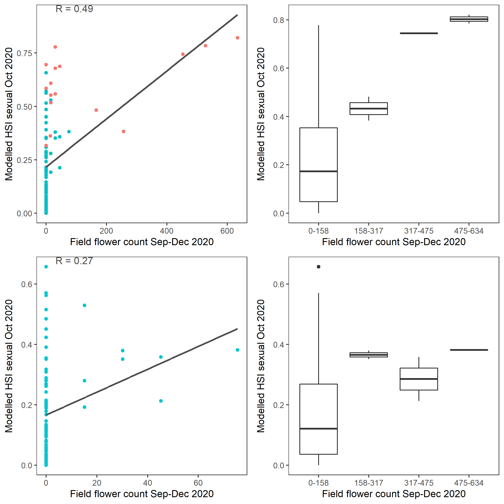
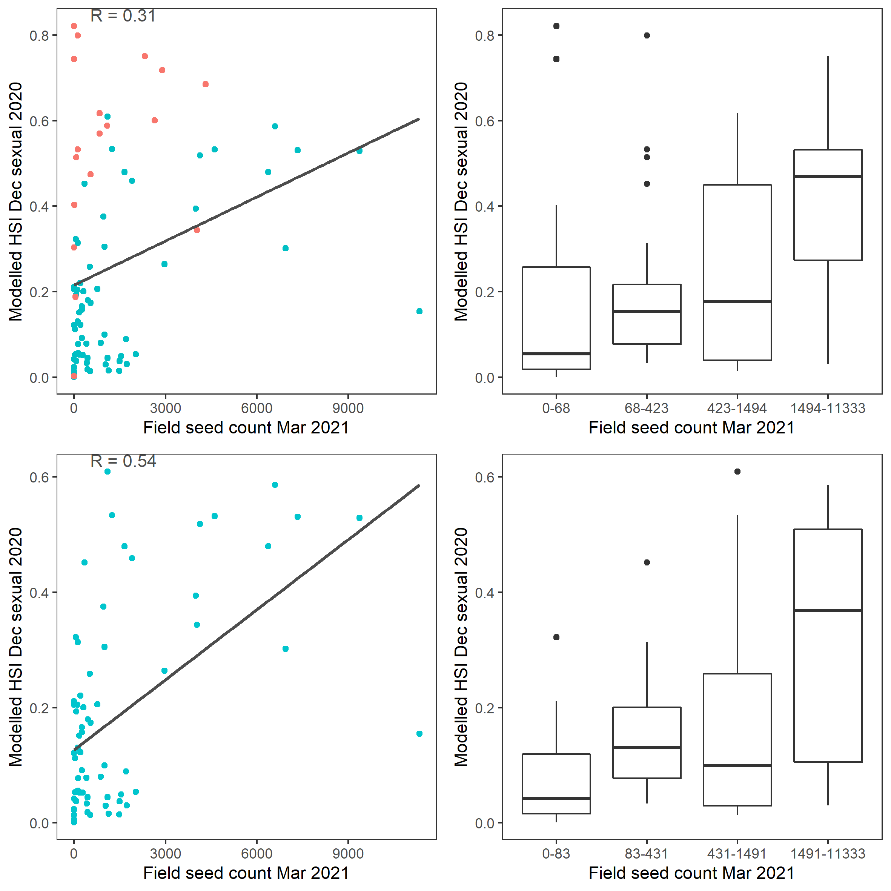
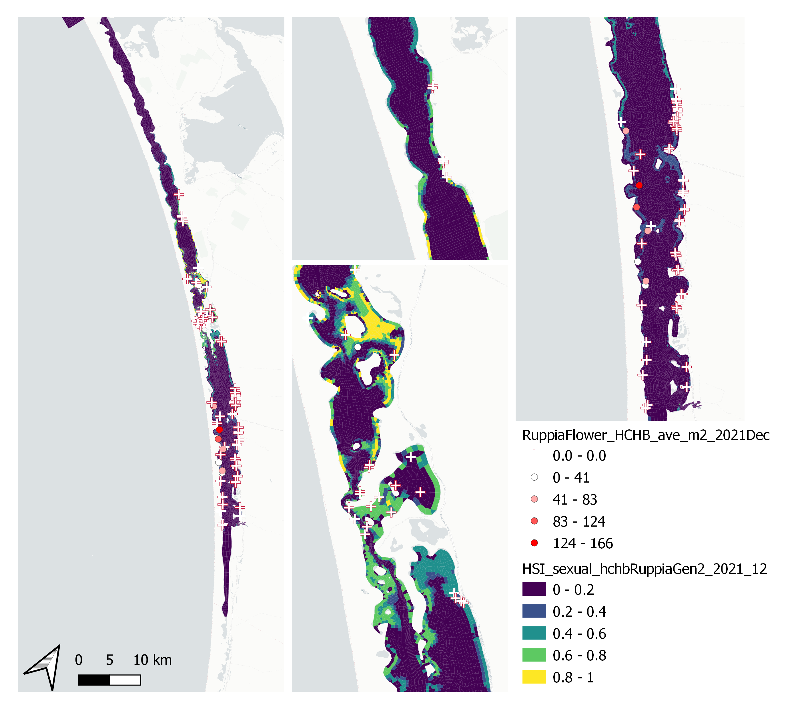
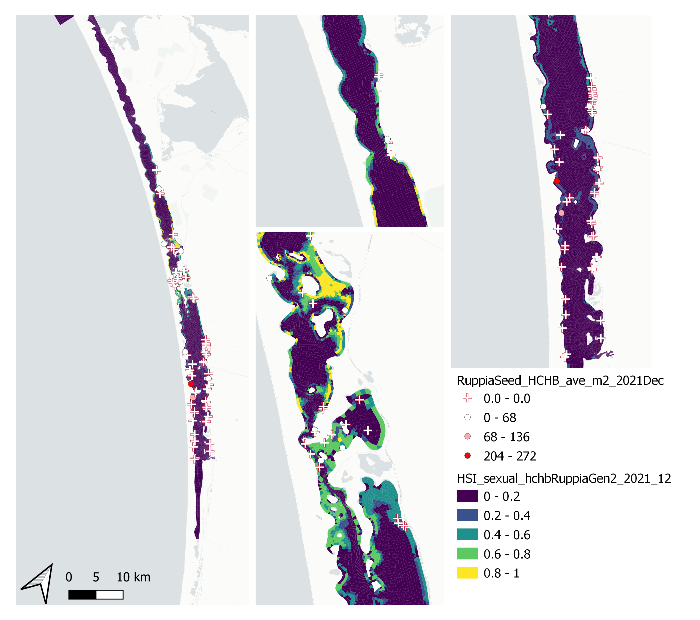

# Appendix C : Ruppia Habitat Assessment {.unnumbered}

## Habitat Suitability Index Functions {.unnumbered}

Habitat suitability functions for Ruppia life stages based on literature review and analyses of HCHB survey data. Note that HSI = 1 under optimal conditions, HSI = 0 under unsuitable conditions, and HSI for sub-optimal is linearly interpolated between these values. Rows shaded in green indicate threshold values were largely sourced from current literature (except text in red), while rows shaded in orange indicate threshold values were estimated.

```{r hsi-function, echo=FALSE, message=FALSE, warning=FALSE}
library(knitr)
library(kableExtra)
library(readxl)
library(rmarkdown)
#library(dplyr)
# library(pander)

theSheet <- read_excel('tables/habitat/AllTables.xlsx', sheet =10)
#gsub(pattern = "pic",x = theSheet[,5], replacement = )
  # theSheet %>% 
  # slice(1) %>% 
  # mutate(
  #   pic = "images/lagoon_habitat/HSI_viability_salinity.png" %>% pander::pandoc.image.return()
  #   ) %>% 
  # pander()%>%

kbl(theSheet[,2:8], caption = "Habitat suitability functions for Ruppia life stages based on literature review and analyses of HCHB survey data. Note that HSI = 1 under optimal conditions, HSI = 0 under unsuitable conditions, and HSI for sub-optimal is linearly interpolated between these values. Rows shaded in green indicate threshold values were largely sourced from current literature (except text in red), while rows shaded in orange indicate threshold values were estimated.", align = "l",escape = F) %>%  #escape controls whether the syntax in table is interpreted
  row_spec(0, background = "#14759e", bold = TRUE, color = "white") %>%

  kable_styling(full_width = F,font_size = 10) %>%
  column_spec(2, width_min = "15em") %>%
  column_spec(5, width_min = "30em") %>%
  column_spec(7, width_min = "20em") %>%
  pack_rows("Turion viability (Jan 1 – Mar 31)", 1, 1) %>%
  pack_rows("Seed germination (Apr 1 – Jun 30)", 2, 6) %>%
  pack_rows("Turion sprouting (Apr 1 – Jun 30)", 7, 11) %>% #3rd and 4th row
  pack_rows("Adult plant growth (Jun 1 – Sep 30)", 12, 16) %>%
  pack_rows("Flowering and seed set (Sep 1 – Dec 31)", 17, 21) %>%
  pack_rows("Turion formation (Sep 1 – Dec 31)", 22, 26)%>%
  scroll_box(width = "700px", height = "1600px",fixed_thead = FALSE)

  # column_spec(2, width = "12em")%>%
  # column_spec(4, width = "10em")%>%

```

<br>

## Model assessment - historical (pre-HCHB) data {.unnumbered}

<br> **i. Field seed/flower count (obs) vs. HSI flowering and seed set (model)**

The average number of seeds per core sampled in January from 2017 to 2019 were compared with the flowering and seed set HSI of the previous year (2016 -- 2018) (Figure \@ref(fig:hist-seed2017) - Figure \@ref(fig:hist-flower2016)); this is a result of integrating across the average conditions between August and December in each year. In contrast, the number of flowerheads was sampled in November 2016 only, and so was compared with HSI flowering and seed set of the same year.

Surveys conducted during other times of the year, such as May or July, are more complicated to validate against, since during this period some of the seeds that were produced (during last spring) would have germinated. Therefore, the seed abundance at this time is a combined result of previous year's seed production success, and current year's seed germination rate.

In general, the spatial distribution of seeds and flowers in the field agreed with model outputs (Figure \@ref(fig:hist-seed2017) - Figure \@ref(fig:hist-flower2016)). For example, higher number of seeds and flowers were often found in the middle lagoon, overlapping with areas where higher HSIs are concentrated. In comparison, north and/or south lagoons recorded lower density of seeds and/or flowers, matching the lower HSIs or limited suitable habitat extent in these regions. However, there were some disagreements between the modelled HSI and field data in the relative abundance of seeds recorded in the south and north lagoons. Specifically, seeds appeared to be mostly absent in the north lagoon between 2017 and 2019, while they had been in higher abundance in the south consistently. Current model predictions however, predicted that the south and north lagoon had similar habitat suitability for flowering and seed set.

In addition to the visual comparison between model outputs and field observations, a quantitative validation was conducted between seed abundance in 2019 and HSI flowering and seed set in 2018 (Figure \@ref(fig:hist-seed2019) and Figure \@ref(fig:hist-seed2019box)). A 600-meter radius buffer was created around each sampling site, and HSI value in each cell that falls within this buffer were averaged and compared with seed count at each site.

```{r hist-seed2017, echo = FALSE, out.width='100%', class = "text-image", fig.cap = "Average seed count per core in **2017 January** (circles) overlaid on HSI model output for flowering and seed set in 2016. Inset on top right shows the overall habitat suitability for the flowering and seed set phase of Ruppia as a function of salinity f(S), light f(l), water level f(WL), and presence of filamentous algae f(FA). An HSI of 0 (dark purple) represents unsuitable habitat conditions, while an HSI of 1 represents optimal conditions (yellow)."}

knitr::include_graphics("images/lagoon_habitat/hist_seed2017vsHSI2016.png")

```

```{r hist-seed2018, echo = FALSE, out.width='100%', class = "text-image", fig.cap = "Average seed count per core in **2018 January** (circles) overlaid on HSI model output for flowering and seed set in 2017. Inset on top right shows the overall habitat suitability for the flowering and seed set phase of Ruppia as a function of salinity f(S), light f(l), water level f(WL), and presence of filamentous algae f(FA). An HSI of 0 (dark purple) represents unsuitable habitat conditions, while an HSI of 1 represents optimal conditions (yellow)."}

knitr::include_graphics("images/lagoon_habitat/hist_seed2018vsHSI2017.png")

```

```{r hist-seed2019, echo = FALSE, out.width='100%', class = "text-image", fig.cap = "Average seed count per core in **2019 January** (circles) overlaid on HSI model output for flowering and seed set in 2018. A HSI of 0 (dark purple) represents unsuitable habitat conditions, while an HSI of 1 represents optimal conditions (yellow). Inset shows the size of the buffers created around sampling sites."}

knitr::include_graphics("images/lagoon_habitat/hist_seed2019vsHSI2018.png")
```

```{r hist-seed2019box, echo = FALSE, out.width='100%', class = "text-image", fig.cap = "Scatter and box plot of average seed count per core in 2019 January versus averaged HSI for flowering and seed set in 2018 in the entire lagoon (top panel: red - north lagoon sites; blue - south lagoon sites) and south lagoon (bottom panel). Text on top of each data point indicates site name."}

knitr::include_graphics("images/lagoon_habitat/hist_seed2019vsHSI2018_box.png")

```

The modelled Ruppia HSI prediction for flowers correlates reasonably well with the observed seed count measured at the beginning of the following season, particularly in the South Lagoon (Figure \@ref(fig:hist-seed2019box)).

```{r hist-flower2016, echo = FALSE, out.width='100%', class = "text-image",fig.align='center', fig.cap = "Average flowerhead count per square meter quadrat in 2016 November (circles) overlaid on HSI model output for flowering and seed set in 2016. Inset on top right shows the overall habitat suitability for the flowering and seed set phase of Ruppia as a function of salinity f(S), light f(l), water level f(WL), and presence of filamentous algae f(FA). An HSI of 0 (dark purple) represents unsuitable habitat conditions, while an HSI of 1 represents optimal conditions (yellow)."}

knitr::include_graphics("images/lagoon_habitat/hist_flower2016vsHSI2016.png")

```

**ii. Field turion count (obs) vs. HSI turion formation (model)**

Average number of turions (type I and II) per core sampled in January in 2016, 2017 and 2019 were compared with HSI turion formation of the previous year (2015, 2016 and 2018) (Figure \@ref(fig:hist-turion2016) - Figure \@ref(fig:hist-turion2019)), which is a result of integrated average condition between August and December in each year.

Surveys conducted during other times of the year, such as May or July would be less suitable for validation, as some of the turions formed during previous spring should have had sprouted in May or July in the current year. Such validation will be more complicated as turion abundance in the field is a combined result of previous year's turion formation success and current year's turion sprouting rate.

Visual validation of turions showed mixed results (Figure \@ref(fig:hist-turion2016) - Figure \@ref(fig:hist-turion2019)). HSIs for turion formation in 2015 were generally consistent with turion distribution and abundance in 2016 January, where south lagoon observed more suitable environmental conditions than the north, and field records showed a similar pattern (Figure \@ref(fig:hist-turion2016)). However, the model seemed to underpredict habitat suitability in the south lagoon in 2016 and 2018 (Figure \@ref(fig:hist-turion2017) and Figure \@ref(fig:hist-turion2019)).

```{r hist-turion2016, echo = FALSE, out.width='100%', class = "text-image", fig.cap = "Average turion count (type I and II) per core in **2016 January** (circles) overlaid on HSI model output for turion formation in 2015. Inset on top right shows the overall habitat suitability for the turion formation phase of Ruppia as a function of salinity f(S), light f(l), water level f(WL), and presence of filamentous algae f(FA). An HSI of 0 (dark purple) represents unsuitable habitat conditions, while an HSI of 1 represents optimal conditions (yellow)."}

knitr::include_graphics("images/lagoon_habitat/hist_turion2016vsHSI2015.png")

```

```{r hist-turion2017, echo = FALSE, out.width='100%', class = "text-image", fig.cap = "HSI turion Average turion count (type I and II) per core in **2017 January** (circles) overlaid on HSI model output for turion formation in 2016. Inset on top right shows the overall habitat suitability for the turion formation phase of Ruppia as a function of salinity f(S), light f(l), water level f(WL), and presence of filamentous algae f(FA). An HSI of 0 (dark purple) represents unsuitable habitat conditions, while an HSI of 1 represents optimal conditions (yellow)."}

knitr::include_graphics("images/lagoon_habitat/hist_turion2017vsHSI2016.png")

```

```{r hist-turion2019, echo = FALSE, out.width='100%', class = "text-image", fig.cap = "Average turion count (type I and II) per core in **2019 January** (circles) overlaid on HSI model output for turion formation in 2018. Inset on top right shows the overall habitat suitability for the turion formation phase of Ruppia as a function of salinity f(S), light f(l), water level f(WL), and presence of filamentous algae f(FA). An HSI of 0 (dark purple) represents unsuitable habitat conditions, while an HSI of 1 represents optimal conditions (yellow)."}

knitr::include_graphics("images/lagoon_habitat/hist_turion2019vsHSI2018.png")

```

**iii. Field shoot count (obs) vs. HSI sexual and asexual combined (model)**

Average number of shoots (green and brown) per core sampled in January in 2018 and 2019 were compared with combined overall HSI for successful completions of sexual or asexual life cycle in the previous year (2017 and 2018) (Figure \@ref(fig:hist-shoot2018) and Figure \@ref(fig:hist-shoot2019)), which is a result of integrating the HSI results for adult plants, flowering and seed set, seed germination, turion sprouting and turion formation.

Although a proportion of Ruppia might have died off in January, the total shoot count including green and brown materials should be a relatively good indicator of environmental conditions experienced in the previous year. Presence of shoots could be a result of sexual or asexual reproduction success, and hence HSI sexual and asexual were integrated for validation.

Similar to turion predictions, the HSI model seemed to relatively underpredict the habitat suitability in the south lagoon, and overpredict in the north in both years (Figure \@ref(fig:hist-shoot2018) and Figure \@ref(fig:hist-shoot2019)). Since the model result is an integration of all life stages of Ruppia, this mismatch may be stemmed from a particular life stage, such as the turion formation stage described in the above section.

```{r hist-shoot2018, echo = FALSE, out.width='100%', class = "text-image", fig.cap = "Average shoot count (green and brown) per core in **2018 January** (circles) overlaid on HSI model output for combined sexual and asexual cycle in 2017. Inset on top right shows the overall habitat suitability for the completion of sexual and asexual life cycle of Ruppia by integrating the HSI results for each life stage. An HSI of 0 (dark purple) represents unsuitable habitat conditions, while an HSI of 1 represents optimal conditions (yellow)."}

knitr::include_graphics("images/lagoon_habitat/hist_shoot2018vsHSI2017.png")

```

```{r hist-shoot2019, echo = FALSE, out.width='100%', class = "text-image", fig.cap = "Average shoot count (green and brown) per core in **2019 January** (circles) overlaid on HSI model output for combined sexual and asexual cycle in 2018. Inset on top right shows the overall habitat suitability for the completion of sexual and asexual life cycle of Ruppia by integrating the HSI results for each life stage. An HSI of 0 (dark purple) represents unsuitable habitat conditions, while an HSI of 1 represents optimal conditions (yellow)."}

knitr::include_graphics("images/lagoon_habitat/hist_shoot2019vsHSI2018.png")

```

<br>

## Model assessment - HCHB data version 1 {.unnumbered}

**i. Field seagrass shoot count Sep 2020 (obs) vs. HSI germination & sprouting Jul 2020 (model)**

Average number of shoots per core sampled in Sep - Oct 2020 were compared with combined HSI for seed germination and turion sprouting in the same year (Figure \@ref(fig:hchbv1-shoot2020)). By default, the integration period for germination and sprouting is Apr -- Jul, therefore there was around a two-month gap between the end of the model period and the start of the survey period. In addition to the 600m-radius buffer, a 100m-radius buffer was also used as a comparison since there were far more survey sites throughout the lagoon during HCHB and sites were relatively close to each other. 100m is approximately the average width of a grid cell on the model domain. In general, model outputs agreed with field shoot abundance, despite the two-month gap where environmental conditions were not accounted for. Both field data and HSI outputs suggested higher shoot abundance in the north lagoon compared to the south, likely due to a lower salinity level in the north. Using a 100m-radius buffer seemed to result in a better model fit. It is worth noting that the seagrass shoot count includes several seagrass species in the lagoon such as R. tuberosa and Althenia cylindrocarpa, whereas the environmental thresholds for seed germination and turion sprouting were derived from experiments on R. tuberosa only (Kim et al. 2013). Although these species can co-occur and may have overlapping requirements on some environmental aspects (Asanopoulos & Waycott 2020), care should be taken when interpreting validation results.

```{r hchbv1-shoot2020, echo = FALSE, out.width='100%', class = "text-image", fig.cap = "Average shoot count per core in 2020 Sep (circles) overlaid on HSI model output for germination and sprouting in 2020 (right), and validation plots for the entire lagoon (top left, 600m buffer), entire lagoon separated into north and south (middle left, red: north, blue: south, 100m buffer), and south lagoon only (bottom left, 100m buffer). An HSI of 0 (dark purple) represents unsuitable habitat conditions, while an HSI of 1 represents optimal conditions (yellow)."}

knitr::include_graphics("images/lagoon_habitat/hchbv1_shoot2020.png")

```

**ii. Field flower count Sep 2020 (obs) vs. HSI flowering and seed set Dec 2020 (model)** Average number of flowers per core sampled in Sep - Oct 2020 were compared with HSI for flowering and seed set in the same year (Figure \@ref(fig:hchbv1-flower2020)). By default, the integration period for flowering and seed set is Aug -- Dec, which included approximately a two-month period after the survey. Both 600m-radius and 100m-radius buffer were used as a comparison. Model output generally agreed with field flower abundance, in that the condition in the south lagoon was mostly unsuitable where no flowers were recorded, while the conditions around the middle and north lagoon were more suitable where Ruppia was flowering. Using a 100m-radius buffer resulted in an improved validation score.

```{r hchbv1-flower2020, echo = FALSE, out.width='100%', class = "text-image", fig.cap = "Average flower count per core in 2020 Sep (circles) overlaid on HSI model output for flowering and seed set in 2020 (right), and validation plots for the entire lagoon (top left, 600m buffer), entire lagoon separated into north and south (middle left, red: north, blue: south, 100m buffer), and south lagoon only (bottom left, 100m buffer). An HSI of 0 (dark purple) represents unsuitable habitat conditions, while an HSI of 1 represents optimal conditions (yellow)."}

knitr::include_graphics("images/lagoon_habitat/hchbv1_flower2020vsHSIflower.png")

```

**iii. Field flower count Sep 2020 (obs) vs. HSI sexual Dec 2020 (model)** Average number of flowers per core sampled in Sep - Oct 2020 were compared with HSI for overall sexual reproduction the same year (Figure \@ref(fig:hchbv1-flower2020-2)), which is an integration of habitat suitability for seed germination, adult growth and flowering and seed set over Apr - Dec. Validation results were similar to the previous case (ii).

```{r hchbv1-flower2020-2, echo = FALSE, out.width='100%', class = "text-image", fig.cap = "Average flower count per core in 2020 Sep (circles) overlaid on HSI model output for overall probability of completing sexual reproduction cycle in 2020 (right), and validation plots for the entire lagoon (separated into north and south (top left, red: north, blue: south, 100m buffer), and south lagoon only (bottom left, 100m buffer). An HSI of 0 (dark purple) represents unsuitable habitat conditions, while an HSI of 1 represents optimal conditions (yellow)."}

knitr::include_graphics("images/lagoon_habitat/hchbv1_flower2020vsHSIsexual.png")
```

**iv. Field seed count Mar 2021 (obs) vs. HSI flowering and seed set Dec 2020 (model)** Average number of seeds per core sampled in Mar -- Apr 2021 were compared with HSI for flowering and seed set in the previous year (Figure \@ref(fig:hchbv1-seed2021)) using both 600m and 100m-radius buffer. Seed abundance appeared to be less predictable than shoots or flowers, likely because once detached from mother plant, seeds can disperse with water currents before settling down. Kim et al. (2015) studied the physiochemical influences on R. tuberosa abundance in the Coorong and found that only 27% of the seed abundance variation could be explained by salinity, depth and turbidity, which was much less than shoots, flowers or turions. Our NPMR results indicated a similar trend on the HCHB data (Table \@ref(tab:NPMRresult)). Using the bigger buffer produced slightly higher validation scores (R = 0.35) than the smaller buffer (R = 0.25, Figure \@ref(fig:hchbv1-seed2021)), which may be a reflection of the Ruppia seeds being able to disperse a small distance (i.e. \> 100m).

```{r hchbv1-seed2021, echo = FALSE, out.width='100%', class = "text-image", fig.cap = "Average seed count per core in 2021 Mar (circles) overlaid on HSI model output for flowering and seed set in 2020 (right), and validation plots for the entire lagoon (top left, 600m buffer), entire lagoon separated into north and south (middle left, red: north, blue: south, 100m buffer), and south lagoon only (bottom left, 100m buffer). An HSI of 0 (dark purple) represents unsuitable habitat conditions, while an HSI of 1 represents optimal conditions (yellow)."}

knitr::include_graphics("images/lagoon_habitat/hchbv1_seed2021vsHSIflower.png")
```

**v. Field seed count Mar 2021 (obs) vs. HSI sexual Dec 2020 (model)** Average number of seeds per core sampled in Mar -- Apr 2021 were compared with HSI for overall sexual reproduction in the previous year (Figure \@ref(fig:hchbv1-seed2021-sexual)). This produced similar results to the above case (iv).

```{r hchbv1-seed2021-sexual, echo = FALSE, out.width='100%', class = "text-image", fig.cap = "Average seed count per core in 2021 Mar (circles) overlaid on HSI model output for overall probability of completing sexual reproduction cycle in 2020 (right), and validation plots for the entire lagoon separated into north and south (top left, red: north, blue: south, 100m buffer), and south lagoon only (bottom left, 100m buffer). An HSI of 0 (dark purple) represents unsuitable habitat conditions, while an HSI of 1 represents optimal conditions (yellow)."}

knitr::include_graphics("images/lagoon_habitat/hchbv1_seed2021vsHSIsexual.png")
```

**vi. Field turion count Sep 2020 (obs) vs. HSI turion formation Dec 2020 (model)** Average number of turions per core sampled in Sep - Oct 2020 were compared with HSI for turion formation in the same year (Figure \@ref(fig:hchbv1-turion2020)) using a 600m buffer. Model predictions did not agree well with field turion abundance, as the environmental thresholds used for turion formation (derived from Kim et al. 2015) was likely biased from a year with very high salinities (discussed in Section 8.1.3.1).

```{r hchbv1-turion2020, echo = FALSE, out.width='100%', class = "text-image", fig.cap = "Average turion count per core in 2020 Sep (circles) overlaid on HSI model output for turion formation in 2020 (right), and validation plots for the entire lagoon (left, 600m buffer). An HSI of 0 (dark purple) represents unsuitable habitat conditions, while an HSI of 1 represents optimal conditions (yellow)."}

knitr::include_graphics("images/lagoon_habitat/hchbv1_turion2020vsHSIturion.png")
```

**vii. Field turion count Mar 2021 (obs) vs. HSI turion formation Dec 2020 (model)** Average number of turions per core sampled in Mar - Apr 2020 were compared with HSI for turion formation in the previous year (Figure \@ref(fig:hchbv1-turion2021)) using a 600m buffer. Validation results were similar to the previous case (vi).

```{r hchbv1-turion2021, echo = FALSE, out.width='100%', class = "text-image", fig.cap = "Average turion count per core in 2021 Mar (circles) overlaid on HSI model output for turion formation in 2020 (right), and validation plots for the entire lagoon (left, 600m buffer). An HSI of 0 (dark purple) represents unsuitable habitat conditions, while an HSI of 1 represents optimal conditions (yellow)."}

knitr::include_graphics("images/lagoon_habitat/hchbv1_turion2021vsHSIturion.png")
```

**viii. Field algae cover % Sep 2020 (obs) vs. HSI Ulva Nov 2020 or biomass Nov 2020 (model)** Site macroalgae cover proportion in Sep -- Oct 2020 were compared with Ulva HSI and biomass in the same year (Figure \@ref(fig:hchbv1-algaecover2020) and Figure \@ref(fig:hchbv1-algaecover2020-biomass)). Compared to modelled Ulva biomass, Ulva HSI prediction correlates better with the observed algae cover. This implies the growth controls (as embodied in the HSI) are well resolved, but the seasonal factors leading to biomass accumulation are more complicated and need further refinement. The HSI range was however quite restricted.

```{r hchbv1-algaecover2020, echo = FALSE, out.width='100%', class = "text-image", fig.cap = "Site algae cover (%) in 2020 Sep (circles) overlaid on HSI model output for Ulva in 2020 (right), and validation plots for the entire lagoon (left, 600m buffer). An HSI of 0 (dark purple) represents unsuitable habitat conditions, while an HSI of 1 represents optimal conditions (yellow)."}

knitr::include_graphics("images/lagoon_habitat/hchbv1_algaecover2020vsHSI.png")
```

```{r hchbv1-algaecover2020-biomass, echo = FALSE, out.width='100%', class = "text-image", fig.cap = "Site algae cover (%) in 2020 Sep (circles) overlaid on model output for Ulva biomass (g) in 2020 (right), and validation plots for the entire lagoon (left, 600m buffer). An HSI of 0 (dark purple) represents unsuitable habitat conditions, while an HSI of 1 represents optimal conditions (yellow)."}

knitr::include_graphics("images/lagoon_habitat/hchbv1_algaecover2020vsbiomass.png")
```

<br>

## Model assessment - HCHB data version 2 {.unnumbered}

The major updates of this validation cycle include: 1) a tailored model integration period that corresponds to each HCHB survey season so that model output can be directly compared with field data at the right time. For example, the default model output for HSI sexual is a result of integration of environmental conditions over the entire Ruppia growing season up to Dec, which goes beyond the Sep/Oct survey period, making field data and model results less comparable. Therefore, for validation against the Sep/Oct HCHB field data, models were configured to integrate HSI of each life-stage only to end of Sep; 2) pairing strategies between field data and model output have been refined. For example, field flower count is now being compared with modelled HSI sexual, which takes into account the probability of Ruppia going through germination/sprouting, adult growth and flowering, instead of the probability of flowering only (HSI flowering); 3) calculation of mean HSI within the buffer was improved from a simple arithmetic mean to a spatial (area-weighted) mean (Table \@ref(tab:validversion)). This is particularly relevant for sampling sites around the northern end of south lagoon, where grid cells vary significantly in size (Figure \@ref(fig:buffer)). Validation results are shown below.

```{r buffer, echo = FALSE, out.width='100%', class = "text-image", fig.cap = "An example output of the middle lagoon showing Ruppia sampling sites (red circles) with 600m-radius buffer, overlaid on model HSI results (dark purple to yellow, representing unsuitable to optimal habitat conditions). For site S06W (red circle on the left), grid cells within the buffer show large variation in size (area)."}

```

**i. Field seagrass shoot count Sep 2020 (obs) vs. HSI germination & sprouting & adult growth Sep 2020 (model)**

Average number of shoots per core sampled in Sep - Oct 2020 were compared with combined HSI for seed germination, turion sprouting and adult growth up to end of Sep in the same year (Figure \@ref(fig:hchbv2-shoot2020-box)). This has resulted in similar validation scores compared to HCHB validation version 1, which did not include the adult growth stage between Jun and Sep, possibly because the 1) adult stage is more resilient to a wide range of conditions than germination or sprouting; and 2) conditions in Jun -- Sep in the lagoon are usually less extreme. Therefore, adding the HSI for adult life-stage during this period will not necessarily restrict (lower) the overall HSI.

```{r hchbv2-shoot2020, echo = FALSE, out.width='100%', class = "text-image", fig.cap = ""}

```

```{r hchbv2-shoot2020-box, echo = FALSE, out.width='100%', class = "text-image", fig.cap = "Average shoot count per core in 2020 Sep (circles) overlaid on HSI model output for germination, sprouting and adult growth up to end of Sep in 2020 (top), and validation plots for the entire lagoon separated into north and south (middle, red: north, blue: south, 100m buffer), and south lagoon only (bottom, 100m buffer). An HSI of 0 (dark purple) represents unsuitable habitat conditions, while an HSI of 1 represents optimal conditions (yellow)."}
knitr::include_graphics("images/lagoon_habitat/hchbv2_shoot2020vsHSI_box.png")
```

**ii. Field flower count Sep 2020 (obs) vs. HSI sexual Sep 2020 (model)**

Average number of flowers per core sampled in Sep - Oct 2020 were compared with HSI for sexual reproduction up to end of Sep in the same year (Figure \@ref(fig:hchbv2-flower2020-box). This has resulted in slightly better validation scores for the whole Coorong compared to HCHB validation version 1.

```{r hchbv2-flower2020, echo = FALSE, out.width='100%', class = "text-image", fig.cap = ""}
knitr::include_graphics("images/lagoon_habitat/hchbv2_flower2020vsHSI.png")
```

```{r hchbv2-flower2020-box, echo = FALSE, out.width='100%', class = "text-image", fig.cap = "Average flower count per core in 2020 Sep (circles) overlaid on HSI model output for sexual reproduction to end of Sep in 2020 (top), and validation plots for the entire lagoon separated into north and south (middle, red: north, blue: south, 100m buffer), and south lagoon only (bottom, 100m buffer). An HSI of 0 (dark purple) represents unsuitable habitat conditions, while an HSI of 1 represents optimal conditions (yellow)."}
knitr::include_graphics("images/lagoon_habitat/hchbv2_flower2020vsHSI_box.png")
```

**iii. Field seed count Mar 2021 (obs) vs. HSI sexual Dec 2020 (model)**

Average number of seeds per core sampled in Mar were compared with HSI for sexual reproduction up to the end of 2020 (Figure \@ref(fig:hchbv2-seed2021-box)). This has resulted in slightly better validation scores compared to HCHB validation version 1.

```{r hchbv2-seed2021, echo = FALSE, out.width='100%', class = "text-image", fig.cap = ""}
knitr::include_graphics("images/lagoon_habitat/hchbv2_seed2021vsHSI.png")
```

```{r hchbv2-seed2021-box, echo = FALSE, out.width='100%', class = "text-image", fig.cap = "Average seed count per core in 2021 Mar (circles) overlaid on HSI model output for sexual reproduction to end of 2020 (top), and validation plots for the entire lagoon separated into north and south (middle, red: north, blue: south, 100m buffer), and south lagoon only (bottom, 100m buffer). An HSI of 0 (dark purple) represents unsuitable habitat conditions, while an HSI of 1 represents optimal conditions (yellow)."}
knitr::include_graphics("images/lagoon_habitat/hchbv2_seed2021vsHSI_box.png")
```

**iv. Field turion count Sep 2020 (obs) vs. HSI asexual Sep 2020 (model)**

Average number of turions per core sampled in Sep 2020 were compared with HSI for asexual reproduction up to the end of Sep 2020 (Figure \@ref(fig:hchbv2-turion2020-box)). Validation results for turion occurrences should be interpreted with caution, as the environmental thresholds used for turion formation (derived from Kim et al. 2015) was likely biased from a year with very high salinities (discussed in Section 8.1.3.1).

```{r hchbv2-turion2020, echo = FALSE, out.width='100%', class = "text-image", fig.cap = ""}

```

```{r hchbv2-turion2020-box, echo = FALSE, out.width='100%', class = "text-image", fig.cap = "Average turion count per core in 2020 Sep (circles) overlaid on HSI model output for asexual reproduction to end of Sep in 2020 (top), and validation plots for the entire lagoon separated into north and south (middle, red: north, blue: south, 100m buffer), and south lagoon only (bottom, 100m buffer). An HSI of 0 (dark purple) represents unsuitable habitat conditions, while an HSI of 1 represents optimal conditions (yellow)."}
knitr::include_graphics("images/lagoon_habitat/hchbv2_turion2020vsHSI_box.png")
```

**v. Field turion count Mar 2021 (obs) vs. HSI asexual Dec 2020 (model)**

Average number of turions per core sampled in Mar - Apr 2021 were compared with HSI for asexual reproduction to the end of 2020 (Figure \@ref(fig:hchbv2-turion2021-box)). Validation results for turion occurrences should be interpreted with caution, as the environmental thresholds used for turion formation (derived from Kim et al. 2015) was likely biased from a year with very high salinities (discussed in Section 8.1.3.1).

```{r hchbv2-turion2021, echo = FALSE, out.width='100%', class = "text-image", fig.cap = ""}
knitr::include_graphics("images/lagoon_habitat/hchbv2_turion2021vsHSI.png")
```

```{r hchbv2-turion2021-box, echo = FALSE, out.width='100%', class = "text-image", fig.cap = "Average turion count per core in 2021 Mar (circles) overlaid on HSI model output for asexual reproduction to end of 2020 (top), and validation plots for the entire lagoon separated into north and south (middle, red: north, blue: south, 100m buffer), and south lagoon only (bottom, 100m buffer). An HSI of 0 (dark purple) represents unsuitable habitat conditions, while an HSI of 1 represents optimal conditions (yellow)."}
knitr::include_graphics("images/lagoon_habitat/hchbv2_turion2021vsHSI_box.png")
```

**vi. Field algae cover % Sep 2020 (obs) vs. HSI Ulva Sep 2020 (model)**

Site macroalgae cover proportion in Sep - Oct 2020 were compared with Ulva HSI in the same year up to end of Sep (Figure \@ref(fig:hchbv2-algaecover2020-box)). This has resulted in slightly better validation scores compared to HCHB validation version 1.

```{r hchbv2-algaecover2020, echo = FALSE, out.width='100%', class = "text-image", fig.cap = ""}
knitr::include_graphics("images/lagoon_habitat/hchbv2_algaecover2020vsHSI.png")
```

```{r hchbv2-algaecover2020-box, echo = FALSE, out.width='100%', class = "text-image", fig.cap = "Site macroalgae cover proportion (%) in 2020 Sep (circles) overlaid on HSI model output for Ulva to end of Sep 2020 (top), and validation plots for the entire lagoon separated into north and south (middle, red: north, blue: south, 100m buffer), and south lagoon only (bottom, 100m buffer). An HSI of 0 (dark purple) represents unsuitable habitat conditions, while an HSI of 1 represents optimal conditions (yellow)."}
knitr::include_graphics("images/lagoon_habitat/hchbv2_algaecover2020vsHSI_box.png")
```

## Model assessment - HCHB Generation 2.0 {.unnumbered}

<br> Ruppia survey data and associated model output used for the Gen II model assessment as well as validation metrics (correlation coefficients) are summarised in Table \@ref(tab:validpairs-old), and results described in following subsections. Overall, implementation of the *Ruppia* Gen II model has improved validation scores on most life-cycle phases, in particular field turion abundance versus modelled HSI for asexual reproduction due to a major update on the turion environmental threshold parameters. In most cases, model achieved a higher validation score in the south lagoon compared to the whole lagoon, which offers a higher confidence in assessing potential management options that are focused in the south. Model performance was significantly better in 2020 than in 2021 (for all validation pairs in the whole lagoon: average R = 0.4 in 2020 versus R = 0.11 in 2021). The lower scores in 2021 may be due to 1) an unusually cool and wet conditions experienced in the winter/spring 2021 that has delayed the *Ruppia* life cycle, particularly the flowering phase which may be triggered by rising temperature (Waycott 2022, pers.comm.), the threshold of which is currently unknown; 2) quantitative field surveys were conducted in Dec only in 2021 due to accessibility issues in extremely wet conditions prior to Dec, instead of between Sep and Dec in 2020.

```{r validpairs-old, echo=FALSE, message=FALSE, warning=FALSE}
library(kableExtra)
library(readxl)
theSheet <- read_excel('tables/habitat/AllTables.xlsx', sheet =12)

kbl(theSheet[,1:6], digits = 2, caption = "Summary of *Ruppia* survey data with their corresponding model output used for validation of the Gen 2 model, and correlation coefficients (*r*) between field abundance and modelled Habitat Suitability Index (HSI).", align = "l",escape = F) %>%  #escape controls whether the syntax in table is interpreted
  row_spec(0, background = "#14759e", bold = TRUE, color = "white") %>%
  kable_styling(bootstrap_options = "basic", full_width = T,font_size = 10) 
  # column_spec(1, width = "12em")%>%
  # column_spec(2, width = "12em")%>%
  # column_spec(4, width = "10em")%>%
#  scroll_box(fixed_thead = FALSE) %>%
```

<br>

**i. Field shoot count Sep 2020 (obs) vs. HSI seed germination + turion viability + turion sprouting + adult growth Sep 2020 (model)**

Average number of seagrass shoots per square meter recorded in Sep - Dec 2020 (reproductive period) were compared with combined HSI for seed germination, turion sprouting and adult growth up to end of Sep in the same year (Figure \@ref(fig:hchb-shoot2020map-old) and \@ref(fig:hchb-shoot2020-old)). The Gen II model update has resulted in slightly higher validation scores (correlation coefficient) than that of the Gen 0 model. The overall distribution of shoots was consistent with model prediction. Seagrass density around the middle lagoon and north lagoon were higher, where HSI predictions were highest.

```{r hchb-shoot2020map-old, echo = FALSE, out.width='100%', class = "text-image", fig.cap = "Average seagrass shoot count per square meter in Sep – Dec 2020 (circles) overlaid on HSI model output for germination, sprouting and adult growth integrated over Jan - Sep 2020. An HSI of 0 (dark purple) represents unsuitable habitat conditions, while an HSI of 1 represents optimal conditions (yellow)."}

knitr::include_graphics("images/lagoon_habitat/shoot2020_germspradt2020_map.png")

```

```{r hchb-shoot2020-old, echo = FALSE, out.width='100%', class = "text-image", fig.cap = "Scatter plot and boxplot of average seagrass shoot count per square meter in Sep – Dec 2020 versus HSI model output for germination, sprouting and adult growth integrated over Jan - Sep 2020. Top panel: the entire lagoon (red: north, blue: south), bottom panel: south lagoon. An HSI of 0 represents unsuitable habitat conditions, while an HSI of 1 represents optimal conditions."}

knitr::include_graphics("images/lagoon_habitat/shoot2020_germspradt2020.png")

```

<br>

**ii. Field flower count Sep 2020 (obs) vs. HSI sexual Oct 2020 (model)**

Average number of *Ruppia* flower per square meter recorded in Sep - Dec 2020 (reproductive period) were compared with overall HSI for sexual reproduction up to end of Oct in the same year (Figure \@ref(fig:hchb-flower2020map-old) and \@ref(fig:hchb-flower2020-old)). The Gen II has similar validation scores of the Gen 0 model. The overall distribution of flowers was consistent with model prediction. Highest density of flowers was found in the north lagoon where HSI predictions were highest. Almost no flowers were recorded in the south lagoon, where HSI predictions were low.

```{r hchb-flower2020map-old, echo = FALSE, out.width='100%', class = "text-image", fig.cap = "Average *Ruppia* flower count per square meter in Sep – Dec 2020 (circles) overlaid on HSI model output for overall sexual reproduction integrated over Jan – Oct 2020. An HSI of 0 (dark purple) represents unsuitable habitat conditions, while an HSI of 1 represents optimal conditions (yellow)."}

knitr::include_graphics("images/lagoon_habitat/flower2020_sexual2020_map.png")

```

```{r hchb-flower2020-old, echo = FALSE, out.width='100%', class = "text-image", fig.cap = "Scatter plot and boxplot of average *Ruppia* flower count per square meter in Sep – Dec 2020 versus HSI model output for overall sexual reproduction integrated over Jan - Oct 2020. Top panel: the entire lagoon (red: north, blue: south), bottom panel: south lagoon. An HSI of 0 represents unsuitable habitat conditions, while an HSI of 1 represents optimal conditions."}



```

<br>

**iii. Field seed count Mar 2021 (obs) vs. HSI sexual Dec 2020 (model)**

Average number of *Ruppia tuberosa* seed per square meter recorded in Mar - Apr 2021 (aestivation period) were compared with overall HSI for sexual reproduction in 2020 (Figure \@ref(fig:hchb-seed2021map-old) and \@ref(fig:hchb-seed2021-old)). The Gen II model update has resulted in better validation scores than the Gen 0 model, especially in the south lagoon. It's important to note that seeds have the potential to disperse with water current/wind therefore its distribution and abundance may be less predictable than other plant materials.

```{r hchb-seed2021map-old, echo = FALSE, out.width='100%', class = "text-image", fig.cap = "Average *Ruppia tuberosa* seed count per square meter in Mar – Apr 2021 (circles) overlaid on HSI model output for overall sexual reproduction integrated over Jan – Dec 2020. An HSI of 0 (dark purple) represents unsuitable habitat conditions, while an HSI of 1 represents optimal conditions (yellow)."}

knitr::include_graphics("images/lagoon_habitat/seed2021_sexual2020_map.png")
```

```{r hchb-seed2021-old, echo = FALSE, out.width='100%', class = "text-image", fig.cap = "Scatter plot and boxplot of average *Ruppia tuberosa* seed count per square meter in Mar – Apr 2021 versus HSI model output for overall sexual reproduction integrated over Jan - Dec 2020. Top panel: the entire lagoon (red: north, blue: south), bottom panel: south lagoon. An HSI of 0 represents unsuitable habitat conditions, while an HSI of 1 represents optimal conditions."}


```

<br>

**iv. Field turion count Sep 2020 (obs) vs. HSI asexual Oct 2020 (model)**

Average number of *Ruppia* turion (type I and II) per square meter recorded in Sep - Dec 2020 (reproductive period) were compared with overall HSI for asexual reproduction up to end of Oct in the same year (Figure \@ref(fig:hchb-turion2020map-old) and \@ref(fig:hchb-turion2020-old)). The Gen 2 model update has significantly improved validation scores compared to the Gen 0 model due to a major change in salinity threshold parameter. The overall distribution of turions agreed with model prediction in that more turions were found around the middle lagoon and northern end of south lagoon, where HSI were highest.

```{r hchb-turion2020map-old, echo = FALSE, out.width='100%', class = "text-image", fig.cap = "Average *Ruppia* turion count per square meter in Sep – Dec 2020 (circles) overlaid on HSI model output for overall asexual reproduction integrated over Jan – Oct 2020. An HSI of 0 (dark purple) represents unsuitable habitat conditions, while an HSI of 1 represents optimal conditions (yellow)."}

knitr::include_graphics("images/lagoon_habitat/turion2020_asexual2020_map.png")
```

```{r hchb-turion2020-old, echo = FALSE, out.width='100%', class = "text-image", fig.cap = "Scatter plot and boxplot of average *Ruppia* turion count per square meter in Sep – Dec 2020 versus HSI model output for overall asexual reproduction integrated over Jan - Oct 2020. Top panel: the entire lagoon (red: north, blue: south), bottom panel: south lagoon. An HSI of 0 represents unsuitable habitat conditions, while an HSI of 1 represents optimal conditions."}

knitr::include_graphics("images/lagoon_habitat/turion2020_asexual2020.png")
```

<br>

**v. Field shoot count Dec 2021 (obs) vs. HSI seed germination + turion viability + turion sprouting + adult growth Sep 2021 (model)**

Average number of seagrass shoots per square meter recorded in Dec 2021 (reproductive period) were compared with combined HSI for seed germination, turion sprouting and adult growth up to end of Sep in the same year (Figure \@ref(fig:hchb-shoot2021map-old) and \@ref(fig:hchb-shoot2021-old)). The validation scores of 2021 were lower than that of 2020, possibly due to the environmental conditions experienced in winter-spring 2021 (including unusually cool and wet conditions), which may have caused a delay in the *Ruppia* life cycle (Waycott 2022, pers. comm.).

```{r hchb-shoot2021map-old, echo = FALSE, out.width='100%', class = "text-image", fig.cap = "Average seagrass shoot count per square meter in Dec 2021 (circles) overlaid on HSI model output for germination, sprouting and adult growth integrated over Jan - Sep 2021. An HSI of 0 (dark purple) represents unsuitable habitat conditions, while an HSI of 1 represents optimal conditions (yellow)."}

knitr::include_graphics("images/lagoon_habitat/shoot2021_germspradt2021_map.png")
```

```{r hchb-shoot2021-old, echo = FALSE, out.width='100%', class = "text-image", fig.cap = "Scatter plot and boxplot of average seagrass shoot count per square meter in Dec 2021 versus HSI model output for germination, sprouting and adult growth integrated over Jan - Sep 2020. Top panel: the entire lagoon (red: north, blue: south), bottom panel: south lagoon. An HSI of 0 represents unsuitable habitat conditions, while an HSI of 1 represents optimal conditions."}

knitr::include_graphics("images/lagoon_habitat/shoot2021_germspradt2021.png")
```

<br>

**vi. Field flower count Dec 2021 (obs) vs. HSI sexual Dec 2021 (model)**

Average number of *Ruppia* flowers per square meter recorded in Dec 2021 (reproductive period) were compared with overall HSI for sexual reproduction in 2021 (Figure \@ref(fig:hchb-flower2021map-old) and \@ref(fig:hchb-flower2021-old)). The validation scores of 2021 were lower than that of 2020, possibly due to the environmental conditions experienced in winter-spring 2021 (including unusually cool and wet conditions), which may have caused a delay in the *Ruppia* life cycle (Waycott 2022, pers. comm.). Overall very few flowers were recorded in the 2021 reproductive period. It was speculated that flowering may be triggered by warming temperature (Waycott 2022, pers. comm.), the threshold of which remains unclear (in the current model the temperature threshold for flowering is assumed to be the same as vegetative growth).

```{r hchb-flower2021map-old, echo = FALSE, out.width='100%', class = "text-image", fig.cap = "Average *Ruppia* flower count per square meter in Dec 2021 (circles) overlaid on HSI model output for overall sexual reproduction integrated over Jan – Dec 2021. An HSI of 0 (dark purple) represents unsuitable habitat conditions, while an HSI of 1 represents optimal conditions (yellow)."}


```

```{r hchb-flower2021-old, echo = FALSE, out.width='100%', class = "text-image", fig.cap = "Scatter plot and boxplot of average *Ruppia* flower count per square meter in Dec 2021 versus HSI model output for overall sexual reproduction integrated over Jan – Dec 2021. Top panel: the entire lagoon (red: north, blue: south), bottom panel: south lagoon. An HSI of 0 represents unsuitable habitat conditions, while an HSI of 1 represents optimal conditions."}

knitr::include_graphics("images/lagoon_habitat/flower2021_sexual2021.png")
```

<br>

**vii. Field seed count Dec 2021 (obs) vs. HSI sexual Dec 2021 (model)**

Average number of *Ruppia tuberosa* seeds per square meter recorded in Dec 2021 (reproductive period) were compared with overall HSI for sexual reproduction in 2021 (Figure \@ref(fig:hchb-seed2021map-2-old) and \@ref(fig:hchb-seed2021-2-old)). The validation scores of 2021 were lower than that of 2020. This is as expected, since flowering activity was markedly delayed in 2021 and would not have set seed in Dec yet.

```{r hchb-seed2021map-2-old, echo = FALSE, out.width='100%', class = "text-image", fig.cap = "Average *Ruppia tuberosa* seed count per square meter in Dec 2021 (circles) overlaid on HSI model output for overall sexual reproduction integrated over Jan – Dec 2021. An HSI of 0 (dark purple) represents unsuitable habitat conditions, while an HSI of 1 represents optimal conditions (yellow)."}


```

```{r hchb-seed2021-2-old, echo = FALSE, out.width='100%', class = "text-image", fig.cap = "Scatter plot and boxplot of average *Ruppia tuberosa* seed count per square meter in Dec 2021 versus HSI model output for overall sexual reproduction integrated over Jan - Dec 2021. Top panel: the entire lagoon (red: north, blue: south), bottom panel: south lagoon. An HSI of 0 represents unsuitable habitat conditions, while an HSI of 1 represents optimal conditions."}

knitr::include_graphics("images/lagoon_habitat/seed2021_sexual2021.png")
```

<br>

**viii. Field turion count Dec 2021 (obs) vs. HSI asexual Dec 2021 (model)**

Average number of *Ruppia* turion (type I and II) per square meter recorded in Dec 2021 (reproductive period) were compared with overall HSI for asexual reproduction in 2021 (Figure \@ref(fig:hchb-turion2021map-old) and \@ref(fig:hchb-turion2021-old)). Validation scores for 2021 is markedly higher than in 2020. The overall distribution of turions agreed with model prediction in that more turions were found around the middle lagoon and northern half of south lagoon, where HSI were higher.

```{r hchb-turion2021map-old, echo = FALSE, out.width='100%', class = "text-image", fig.cap = "Average *Ruppia* turion count per square meter in Dec 2021 (circles) overlaid on HSI model output for overall asexual reproduction integrated over Jan – Dec 2021. An HSI of 0 (dark purple) represents unsuitable habitat conditions, while an HSI of 1 represents optimal conditions (yellow)."}

knitr::include_graphics("images/lagoon_habitat/turion2021_asexual2021_map.png")
```

```{r hchb-turion2021-old, echo = FALSE, out.width='100%', class = "text-image", fig.cap = "Scatter plot and boxplot of average *Ruppia* turion count per square meter in Dec 2021 versus HSI model output for overall asexual reproduction integrated over Jan - Dec 2021. Top panel: the entire lagoon (red: north, blue: south), bottom panel: south lagoon. An HSI of 0 represents unsuitable habitat conditions, while an HSI of 1 represents optimal conditions."}

knitr::include_graphics("images/lagoon_habitat/turion2021_asexual2021.png")
```

<br>

**x. Field shoot count Jul 2018 (obs) vs. HSI seed germination + turion viability + turion sprouting + adult growth Jun 2018 (model)**

Average number of seagrass shoots per 7.5 cm core recorded in Jul 2018 were compared with combined HSI for seed germination, turion sprouting and adult growth up to end of Jun in the same year (Figure \@ref(fig:hchb-shoot2018map) and \@ref(fig:hchb-shoot2018-old)). There was some mismatch between model prediction and field observation, in that model predicted most suitable conditions in the north lagoon where no shoots were recorded, and less suitable conditions in the south lagoon where a small number of shoots were recorded.

```{r hchb-shoot2018map, echo = FALSE, out.width='100%', class = "text-image", fig.cap = "Average seagrass shoot count per 7.5 cm core in Jul 2018 (circles) overlaid on HSI model output for germination, sprouting and adult growth integrated over Jan – Jun 2018. An HSI of 0 (dark purple) represents unsuitable habitat conditions, while an HSI of 1 represents optimal conditions (yellow)."}

knitr::include_graphics("images/lagoon_habitat/shoot2018_germspradt2018_map.png")
```

```{r hchb-shoot2018-old, echo = FALSE, out.width='100%', class = "text-image", fig.cap = "Scatter plot and boxplot of average seagrass shoot count per 7.5 cm core in Jul 2018 versus HSI model output for germination, sprouting and adult growth integrated over Jan – Jun 2018. Top panel: the entire lagoon (red: north, blue: south), bottom panel: south lagoon. An HSI of 0 represents unsuitable habitat conditions, while an HSI of 1 represents optimal conditions."}

knitr::include_graphics("images/lagoon_habitat/shoot2018_germspradt2018.png")
```

<br>

**xi. Field seed count Jan 2019 (obs) vs. HSI sexual Dec 2018 (model)**

Average number of *Ruppia tuberosa* seeds per 7.5 cm core recorded in Jan 2019 were compared with overall HSI for sexual reproduction in 2018 (Figure \@ref(fig:hchb-seed2019map) and \@ref(fig:hchb-seed2019-old)). The overall distribution of seeds agreed with model predictions. More seeds were found around the middle lagoon where model predicted higher HSIs.

```{r hchb-seed2019map, echo = FALSE, out.width='100%', class = "text-image", fig.cap = "Average *Ruppia tuberosa* seed count per 7.5 cm core in Jan 2019 (circles) overlaid on HSI model output for overall sexual reproduction integrated over Jan – Dec 2018. An HSI of 0 (dark purple) represents unsuitable habitat conditions, while an HSI of 1 represents optimal conditions (yellow)."}

knitr::include_graphics("images/lagoon_habitat/seed2019_sexual2018_map.png")
```

```{r hchb-seed2019-old, echo = FALSE, out.width='100%', class = "text-image", fig.cap = "Scatter plot and boxplot of average *Ruppia tuberosa* seed count per 7.5 cm core in Jan 2019 versus HSI model output for overall sexual reproduction integrated over Jan - Dec 2018. Top panel: the entire lagoon (red: north, blue: south), bottom panel: south lagoon. An HSI of 0 represents unsuitable habitat conditions, while an HSI of 1 represents optimal conditions."}

knitr::include_graphics("images/lagoon_habitat/seed2019_sexual2018.png")
```

<br>

**xii. Field turion count Jan 2019 (obs) vs. HSI asexual Dec 2018 (model)**

Average number of *Ruppia* turions (type I and II) per 7.5 cm core recorded in Jan 2019 were compared with overall HSI for asexual reproduction in 2018 (Figure \@ref(fig:hchb-turion2019map) and \@ref(fig:hchb-turion2019-old)). Higher density of turions were recorded around the northern end of south lagoon, where our model also predicted high HSIs, however there are also sites with a mismatch between modelled and observed, such as around the southern end of north lagoon.

```{r hchb-turion2019map, echo = FALSE, out.width='100%', class = "text-image", fig.cap = "Average *Ruppia* turion count per 7.5 cm core in Jan 2019 (circles) overlaid on HSI model output for overall asexual reproduction integrated over Jan – Dec 2018. An HSI of 0 (dark purple) represents unsuitable habitat conditions, while an HSI of 1 represents optimal conditions (yellow)."}

knitr::include_graphics("images/lagoon_habitat/turion2019_asexual2018_map.png")
```

```{r hchb-turion2019-old, echo = FALSE, out.width='100%', class = "text-image", fig.cap = "Scatter plot and boxplot of average *Ruppia* turion count per 7.5 cm core in Jan 2019 versus HSI model output for overall asexual reproduction integrated over Jan - Dec 2018. Top panel: the entire lagoon (red: north, blue: south), bottom panel: south lagoon. An HSI of 0 represents unsuitable habitat conditions, while an HSI of 1 represents optimal conditions."}

knitr::include_graphics("images/lagoon_habitat/turion2019_asexual2018.png")
```
