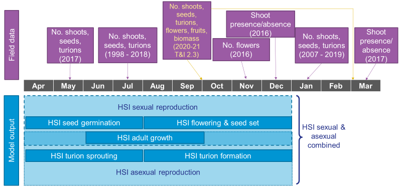
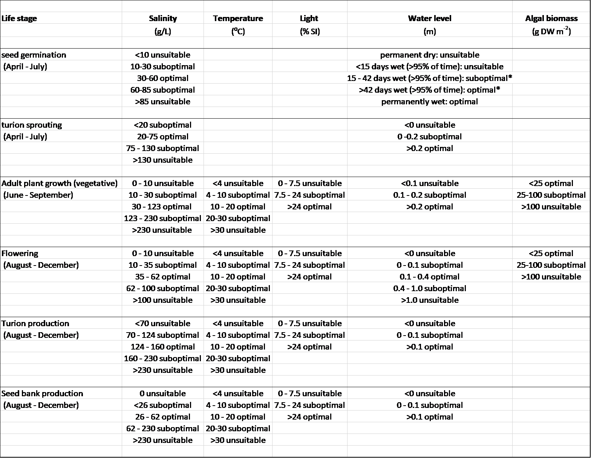
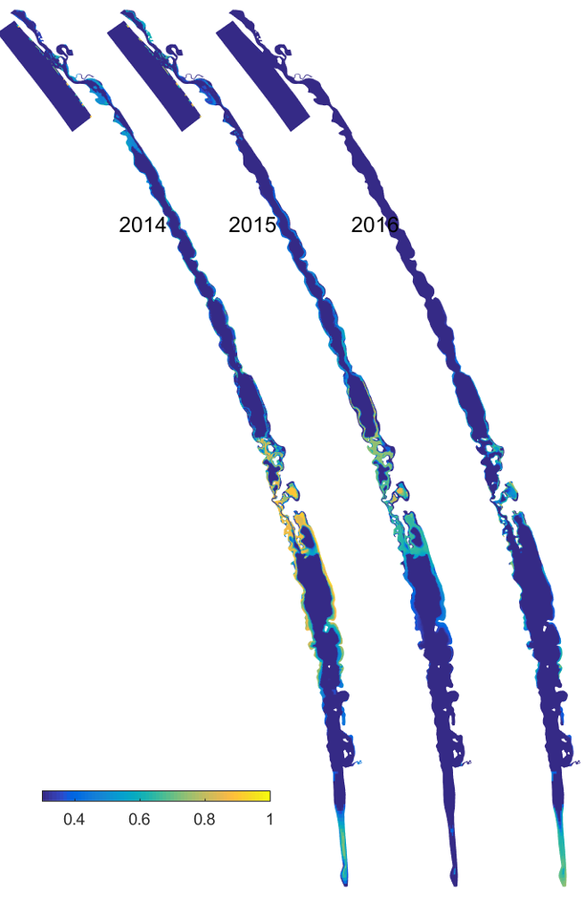
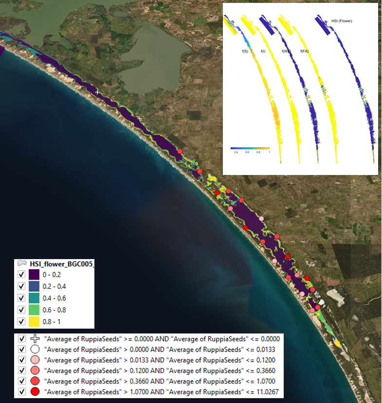
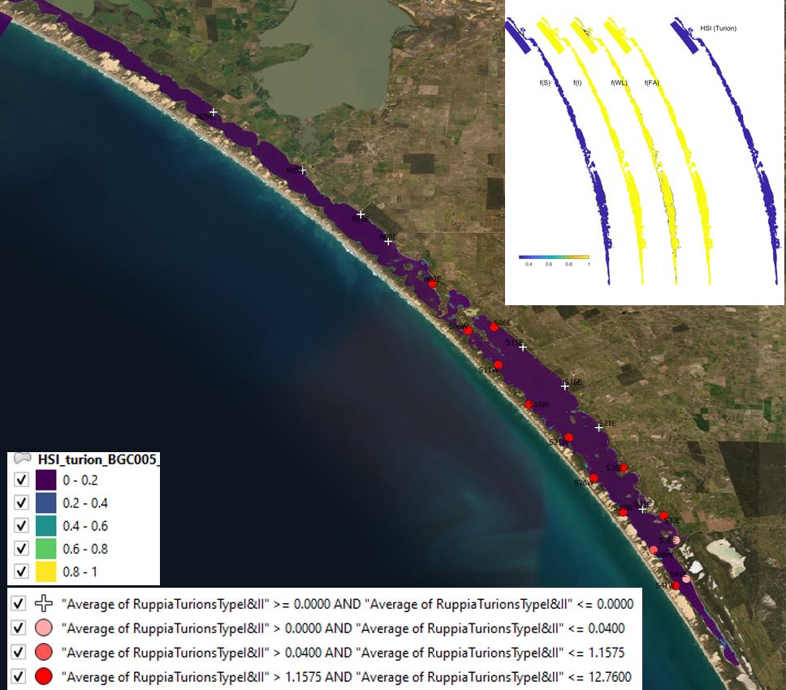
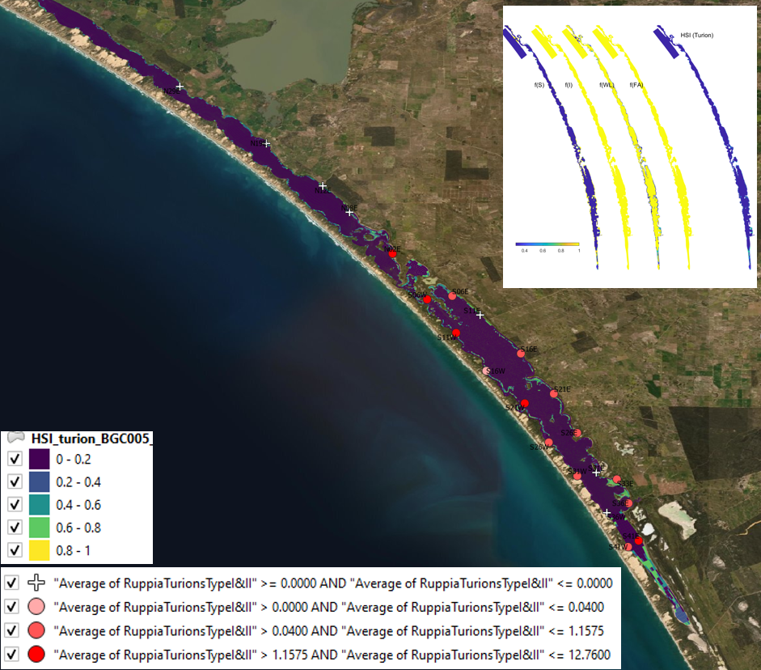

# Habitat Modelling

<br>

## Habitat modelling - **Ruppia**

### Overview

Whilst the Coorong is a naturally saline to hyper-saline lagoon, freshwater flows are important in maintaining estuarine habitat and ecosystem health and preventing extreme hyper-salinity (Brookes et al. 2009). *Ruppia tuberosa* is an important macrophyte in the Coorong that provides habitat for fish and food for herbivorous birds (Phillips and Muller 2006), and it can tolerate a salinity higher than natural seawater. It therefore is known to concentrate in the mid to southern regions (Figure \@ref(fig:hab-pic1)).  

The germination and growth of *R. tuberosa* is known to be governed in large part by changes in salinity and water level regimes, which are influenced by flows through the barrages (Kim et al. 2013). Other factors that influence *R. tuberosa* growth include nutrient availability, water temperature, sediment quality and interactions with algae, including shading of light and interference with flowers and fruits on the surface. Early summer flows are thought to be particularly beneficial as they delay the drop in water level in the South Lagoon and can prevent extreme salinities emerging, thereby encouraging a more complete reproductive cycle (Collier et al. 2017).

In addition, salinity has also been identified as the key driver that influences fish assemblage structure and the extent of estuarine fish habitat in the Coorong (Ye et al. 2011). This section describes how simulations of *Ruppia and* estuarine fish habitat have been configured and assessed.

```{r hab-pic1, echo = FALSE, out.width='100%', class = "text-image", fig.cap = "Conceptual diagram of Ruppia presence in the Coorong, under base case conditions=  with moderate inflows from the Barrages (North) and Salt Creek (South-east)."}

knitr::include_graphics("images/lagoon_habitat/picture1.png")

```

### Model description: Ruppia HSI

The approach adopted in the current study is to simulate "habitat suitability" based on an assessment of modelled environmental conditions relative to the known requirements of Ruppia tuberosa, for example, considering salinity, light and/or other environmental conditions. This approach was then used to define a relative index for each computational cell by overlaying the various environmental controls/limitations that have been informed based on prior experiments and surveys. The ***Habitat Suitability Index*** approach empirically defines conditions that lead to successful growth and reproduction, without simulation of processes such as photosynthesis and respiration.

For the Coorong, a similar habitat model approach was undertaken previously by Ye et al. (2014), who focused exclusively on the salinity and water level requirements of Ruppia and presented the model results as an overall probability that Ruppia plants would successfully complete their lifecycle, by accounting for the different tolerances of different life stages.

In this study, we used the hydrodynamic-biogeochemical model to predict environmental conditions at high spatial and temporal resolution for a period of multiple years, and used this to calculate the habitat suitability index (HSI) for each particular phase of the life cycle of Ruppia (Figure \@ref(fig:lagoonhabitat-pic2)). The calculation of the HSI required the integration of environmental conditions over a biologically relevant time period, based on the typical duration and seasonal timing for each life-stage. HSI results for different life stages were then combined and integrated to obtain overall HSI results for successful completion of sexual or asexual life cycles of Ruppia. For each annual cycle these model results were then summarised over the length of the Coorong, to allow estimation of the total suitable area.

```{r lagoonhabitat-pic2, echo = FALSE, out.width='75%', class = "text-image", fig.align='center', fig.cap = "Overview of the sexual and vegetative life cycles of *Ruppia tuberosa* (from Collier et al. 2017)."}

knitr::include_graphics("images/lagoon_habitat/picture2.png")
```

#### Ruppia Habitat Suitability Index calculation {-}

In each model cell ($c$), the Habitat Suitability Index (HSI) is computed based on suitability of conditions ($i$), for each of the main life-stages ($j$), by defining a fractional index, . The fractional index for each attribute is computed at each time, step and then integrated over a 90-day window, specific to the life-cycle stage.

$$
\Phi^{HSI_{j}}_{i} = \frac{1}{t_{j_{\text{start}}}-t_{j_{\text{end}}}} \sum^{t_{j_{\text{end}}}}_{t=t_{j_{\text{start}}}}\Phi^{HSI_{j}}_{i}(i)_{t}
(\#eq:lagoonhabitat7)
\\
\scriptsize{
\\ \text{whereby: $i$ = {salinity, temperature, light, depth, algae}}
\\ \text{and: $j$ = {seed, sprout, adult, flower, turion}}}
$$

The integration time for each life-stage, $j$, is set to be 90-days based on assessment of literature on the typical impact times reported following shading or disturbance. The optimum 90-day period is selected from within the available plant growth windows, as indicated in Table 2.

The above function is computed in each cell and produces maps of suitability (between 0 and 1) for each environmental attribute for each life stage within any given year. The individual functions are piecewise, based on synthesis of the available literature (Table 3). These are then overlaid to produce a final map for any given year using:

$$
\Phi^{HSI}_{c} = \text{min}\left[\Phi^{HSI_{j}}_{c} \right]_{c}
(\#eq:lagoonhabitat8)
$$

To compare the overall area of suitable habitat between years, or the relative suitability of alternate scenarios, the fractional suitability is used as a multiplier with the cell area, according to:

$$
A^{HSI} = \sum_{c} \Phi^{HSI}_{c} A_{c}
(\#eq:lagoonhabitat9)
$$

and the spatially averaged HSI in any given region (with area A) is computed as:

$$
\overline{HSI} = \frac{1}{A}\sum_{c} \Phi^{HSI}_{c} A_{c}
(\#eq:lagoonhabitat10)
$$

<br>

+------------------------------------+------------------+------------------+--------------+-----------+-------------------+
| Stage, $j$                         | Seed germination | Turion sprouting | Adult growth | Flowering | Turion production |
+====================================+==================+==================+==============+===========+===================+
| Start date, $t_{j_{\text{start}}}$ | *Apr*            | *Apr*            | *Jun*        | *Aug*     | *Aug*             |
+------------------------------------+------------------+------------------+--------------+-----------+-------------------+
| End date, $t_{j_{\text{end}}}$     | *Jun*            | *Jun*            | *Aug*        | *Oct*     | *Oct*             |
+------------------------------------+------------------+------------------+--------------+-----------+-------------------+

: Life cycle time windows over which environmental suitability is assessed. {\#tbl:table1}

### Data availability

The model approach requires empirical data for a) assignment of appropriate environmental threshold data for each life-stage, and b) validation and assessment of the approach under various conditions. The available data for this tasks is described next.

#### Environmental threshold parameter review {-}

Environmental conditions and thresholds suitable for Ruppia growth have been reviewed and summarised in Table 5.2.

+----------------------------+------------------------------------------------------------------------------------------------------------------------------------------------------------------------------------------+-----------------------------------------------------------------------------------------------------------------------------------------------------------------------------------+--------------------------------------------------------------------------------------------------------------------------------------------------------------------------------------------------+
| Environmental attribute    | Optimal                                                                                                                                                                                  | Acceptable                                                                                                                                                                        | Rationale/source                                                                                                                                                                                 |
+============================+==========================================================================================================================================================================================+===================================================================================================================================================================================+==================================================================================================================================================================================================+
| Water depth                | Adult: 0.2 -- 0.7 mAHD, Flowering and turion formation: 0.1-0.4 mAHD                                                                                                                     | Adult: 0.1 -- 1 mAHD                                                                                                                                                              | Prone to desiccation if \<0.3m, light limited if \>0.6m. Thresholds derived from pre -- 2019 studies and summarised in TI-2.1.1_TRS_20-13_Aquatic Plant Synthesis_2020-12-11_Final v2. Section 3 |
+----------------------------+------------------------------------------------------------------------------------------------------------------------------------------------------------------------------------------+-----------------------------------------------------------------------------------------------------------------------------------------------------------------------------------+--------------------------------------------------------------------------------------------------------------------------------------------------------------------------------------------------+
| Water depth                | -0.2 -- 0.2 mAHD                                                                                                                                                                         | -0.5 -- 0.3m AHD                                                                                                                                                                  | TI-2.3.2_Restoration_2021-06-15_v1.0_FINAL                                                                                                                                                       |
+----------------------------+------------------------------------------------------------------------------------------------------------------------------------------------------------------------------------------+-----------------------------------------------------------------------------------------------------------------------------------------------------------------------------------+--------------------------------------------------------------------------------------------------------------------------------------------------------------------------------------------------+
| Salinity                   | *Adult* (Jun-Sep): 25 -122g/L; *Flowering & seed set* (Sep-Dec): 40-62g/L; *Turion formation* (Sep-Dec): 128-162g/L; Seed germi (Apr-Jun): 5-60g/L; Turion sprouting (Apr-Jun): 20-75g/L | Adult (Jun-Sep): 5 -215g/L; Flowering & seed set (Sep-Dec): 12-102g/L; Turion formation (Sep-Dec): 72-228g/L; Seed germi (Apr-Jun): 0-85g/L; Turion sprouting (Apr-Jun): 0-130g/L | Thresholds derived from pre -- 2019 studies and summarised in TI-2.1.1_TRS_20-13_Aquatic Plant Synthesis_2020-12-11_Final v2. Section 3                                                          |
+----------------------------+------------------------------------------------------------------------------------------------------------------------------------------------------------------------------------------+-----------------------------------------------------------------------------------------------------------------------------------------------------------------------------------+--------------------------------------------------------------------------------------------------------------------------------------------------------------------------------------------------+
| Light                      | ? - 100%                                                                                                                                                                                 | \>5%                                                                                                                                                                              | As above                                                                                                                                                                                         |
+----------------------------+------------------------------------------------------------------------------------------------------------------------------------------------------------------------------------------+-----------------------------------------------------------------------------------------------------------------------------------------------------------------------------------+--------------------------------------------------------------------------------------------------------------------------------------------------------------------------------------------------+
| Substrate/slope            |                                                                                                                                                                                          | Non-rocky and non-sloping steeply                                                                                                                                                 | TI-2.2.1_Annual Report_AquaticPlantSurveys_2020-12-11_Final                                                                                                                                      |
+----------------------------+------------------------------------------------------------------------------------------------------------------------------------------------------------------------------------------+-----------------------------------------------------------------------------------------------------------------------------------------------------------------------------------+--------------------------------------------------------------------------------------------------------------------------------------------------------------------------------------------------+

: Summary of environmental thresholds for Ruppia growth. {\#tbl:table2}

#### Ruppia extent within the lagoon  {-}

The distribution and abundance of Ruppia has been regularly monitored in the Coorong since 1998. However, the types of data collected, the sampling season, location and methods varied between programs. An overview of the available historical and HBHC datasets is shown in Figure 5.3.

```{r hab-pic4, echo = FALSE, out.width='100%', class = "text-image", fig.cap = "Overview of Ruppia survey datasets showing sampling periods and types of data collected (purple boxes), versus habitat model output (HSI, blue boxes) on a timeline. Datasets from the HCHB project are highlighted in yellow."}


```

**Historical Monitoring** A summary of historical Ruppia monitoring datasets (pre-2020) is shown in Table 5.3. Locations of sampling sites are shown in Figure 5.4.

```{r hab-pic5, echo = FALSE, out.width='100%', class = "text-image", fig.cap = "Ruppia sampling sites for various monitoring program prior to 2020. Agency/program code under each map corresponds to those listed in Table 5.3. Turquoise outline represents the model boundary. Note that sampling sites of the last dataset listed in Table 5.3 are the same as UA MDBA_2."}

knitr::include_graphics("images/lagoon_habitat/fig4.4.ruppia sites.png")

```

**HCHB Monitoring** A summary of the HCHB monitoring datasets is shown in Table 5.4. Locations of sampling sites are shown in Figure 5.5.

```{r hab-pic6, echo = FALSE, out.width='40%', class = "text-image", fig.cap = "Ruppia sampling sites for the HCHB program (T and I 2). Agency/program code under each map corresponds to those listed in Table 5.4. Turquoise outline represents the model boundary."}

knitr::include_graphics("images/lagoon_habitat/fig4.5.ruppia sites_HCHB.png")

```

### Model application

The hydrodynamic-biogeochemical model TUFLOW-FV -- AED is used to simulate the hydrodynamic conditions (velocity, salinity, temperature and water level), water clarity (light and turbidity) and the potential for filamentous algae (nutrients and algae). Specifically, the HCHB V0.1 model was applied, configured using the specification of AED parameters (....). The Coorong has a long residence time and to account for the longer timescales of water and solute flux, multi-year simulations must be performed.

The habitat suitability functions for each environmental variable of each Ruppia life-stage were determined based on literature review and expert judgement (Table 5.5), and used for the calculation of overall habitat suitability indices (Section 5.1.2). In these tests, the model was run from May 2013 to March 2019 using the base case condition.

```{r hab-pic7, echo = FALSE, out.width='100%', class = "text-image", fig.cap = "Suitability functions for Ruppia life stages (based on literature review presented in Table 5.2 and expert judgement). Note that optimal = 1, unsuitable = 0, and sub-optimal is linearly interpolated between these values. Note: for Salinity, Temperature, Light and Algal biomass, use 90-day rolling mean values for the respective periods to interrogate the model outputs against these thresholds."}


```

\* provided that the wet days are not followed by \>8 dry days (= unsuitable)

The outputs of the model are maps of habitat suitability of critical life stages (Figure 5.6a, showing only the flowering stage in 2018), in response to light, depth, salinity and temperature, which in the end results in a combined probability of sexual or asexual life-cycle completion (Figure 5.6b, showing only the overall HSI for a completion of the sexual life cycle in 2018). The requirements for each life stage are quite different, and when each is superimposed together, the areas where life-cycle completion are limited to the margins of the main lagoons, and the shallow areas around Parnka. From year to year, the area of good habitat changes, depending on that year's eco-hydrodynamic regime.

By comparing scenarios with different flows into the Lagoon, we can see that there is an expansion of good habitat in the north of the South Lagoon, and along the South Lagoon margins, when extreme salinity values are avoided (Figure 11).

<center>

```{r lagoonhabitat-pic4, echo = FALSE, out.width='60%', class = "text-image", fig.cap = "Habitat suitability (HSI) for the adult plant phase of *Ruppia tuberosa* in the Coorong as a function of salinity, light, water level and presence of filamentous algae for the Base Case (2015)."}

knitr::include_graphics("images/lagoon_habitat/picture4.png")
```

```{r lagoonhabitat-pic5, echo = FALSE, out.width='60%', class = "text-image", fig.cap = "Overall Habitat Suitability (HSI) for a successful completion of the asexual life cycle by *Ruppia tuberosa* in the Coorong, calculated by integrating the HSI results for adult plants, turion formation and turion sprouting for the Base Case (2015)."}

knitr::include_graphics("images/lagoon_habitat/picture5.png")

```

```{r lagoonhabitat-pic6, echo = FALSE, out.width='60%', class = "text-image", fig.cap = "Overall Habitat Suitability (HSI) for a successful completion of the sexual life cycle by *Ruppia tuberosa* in the Coorong, calculated by integrating the HSI results for adult plants, flowering (incl. seed formation) and seed germination (incl. seedling survival) for the Base Case (2015)."}



```

</center>

### Model results and assessment

To assess the accuracy of model predictions, the habitat suitability maps produced above were compared with Ruppia field survey results for both distribution and abundance, including several types of plant materials (e.g., shoot, seed, turion) which were used to validate HSI of different life-stages.

#### Historical validation  {-}

<br> **i. Field seed/flower count (obs) vs. HSI flowering and seed set (model)**

Average number of seeds per core sampled in January from 2017 to 2019 were compared with HSI flowering and seed set of the previous year (2016 -- 2018) (Figure 5.7 -- 5.10), which is a result of integrated average condition between August and December in each year (Figure 5.3). Number of flowerheads was sampled in November 2016 only, and was compared with HSI flowering and seed set of the same year.

Both of these validation methods are relatively straight forward and should reflect a close link between model output and field observations i.e. if the habitat suitability for flowering and seed set was suitable for existing Ruppia to flower and set seed between August and December, the flower count in November the same year should largely reflect this. Seed count conducted in January the following year should also be a good indicator as the Ruppia that had flowered in the previous year should have set seed by January. However, as it may take several years for the seed bank to deplete, number of seeds recorded each year could potentially be a 'cumulative' result of the sexual reproduction success of Ruppia in preceding years. This means there could be a lag between the actual seed count, and the HSI which largely reflects the environmental conditions of the current year only.

Surveys conducted during other times of the year, such as May or July, are more complicated to validated against, as during this period some of the seeds that were produced during last spring would have had germinated. Therefore, the seed abundance at this time is a combined result of previous year's seed production success, and current year's seed germination rate.

In general, the spatial distribution of seeds and flowers in the field agreed with model outputs (Figure 5.7 -- 5.10). For example, higher number of seeds and flowers were often found in the middle lagoon, overlapping with areas where higher HSIs are concentrated. In comparison, north and/or south lagoons recorded lower density of seeds and/or flowers, matching the lower HSIs or limited suitable habitat extent in these regions. However, there were some disagreements between the modelled HSI and field data in the relative abundance of seeds recorded in the south and north lagoons. Specifically, seeds appeared to be mostly absent in the north lagoon between 2017 and 2019, while they had been in higher abundance in the south consistently. Current model predictions however, predicted that the south and north lagoon had similar habitat suitability for flowering and seed set.

In addition to the visual comparison between model outputs and field observations, a quantitative validation was conducted between seed abundance in 2019 and HSI flowering and seed set in 2018 (Figure 5.9). A 600-meter radius buffer was created around each sampling site, and HSI value in each cell that falls within this buffer were averaged and compared with seed count at each site.

```{r hab-pic11, echo = FALSE, out.width='100%', class = "text-image", fig.cap = "Average seed count per core in **2017 January** (circles) overlaid on HSI model output for flowering and seed set in 2016. Inset on top right shows the overall habitat suitability for the flowering and seed set phase of Ruppia as a function of salinity f(S), light f(l), water level f(WL), and presence of filamentous algae f(FA). An HSI of 0 (dark purple) represents unsuitable habitat conditions, while an HSI of 1 represents optimal conditions (yellow)."}

knitr::include_graphics("images/lagoon_habitat/fig4.7.seed2017vsHSI2016.png")

```

```{r hab-pic12, echo = FALSE, out.width='100%', class = "text-image", fig.cap = "Average seed count per core in **2018 January** (circles) overlaid on HSI model output for flowering and seed set in 2017. Inset on top right shows the overall habitat suitability for the flowering and seed set phase of Ruppia as a function of salinity f(S), light f(l), water level f(WL), and presence of filamentous algae f(FA). An HSI of 0 (dark purple) represents unsuitable habitat conditions, while an HSI of 1 represents optimal conditions (yellow)."}



```

```{r hab-pic13, echo = FALSE, out.width='100%', class = "text-image", fig.cap = "Average seed count per core in **2019 January** (circles) overlaid on HSI model output for flowering and seed set in 2018 (left). A HSI of 0 (dark purple) represents unsuitable habitat conditions, while an HSI of 1 represents optimal conditions (yellow). Inset shows the size of the buffers created around sampling sites. Scatter plot shows the relationship between average seed count per core in 2019 January and averaged HSI for flowering and seed set in 2018 (right). Text on top of each data point indicates site name."}

knitr::include_graphics("images/lagoon_habitat/fig4.9left.seed2019vsHSI2018.png")
```

```{r hab-pic14, echo = FALSE, out.width='100%', class = "text-image", fig.cap = "Average flowerhead count per square meter quadrat in 2016 November (circles) overlaid on HSI model output for flowering and seed set in 2016. Inset on top right shows the overall habitat suitability for the flowering and seed set phase of Ruppia as a function of salinity f(S), light f(l), water level f(WL), and presence of filamentous algae f(FA). An HSI of 0 (dark purple) represents unsuitable habitat conditions, while an HSI of 1 represents optimal conditions (yellow)."}

knitr::include_graphics("images/lagoon_habitat/fig4.10.flower2016vsHSI2016.png")

```


The modelled Ruppia HSI prediction for flowers correlates reasonably well with the observed seed count measured at the beginning of the following season, particularly in the South Lagoon (Figure \@ref(fig:hab-pic21)). 


```{r hab-pic21, echo = FALSE, out.width='100%', class = "text-image",fig.align='center', fig.cap = "Filamentous algae observed density and equivalent model predicted Ruppia HSI for the entire lagoon (top) and restricted to just the South Lagoon (bottom)."}

knitr::include_graphics("images/lagoon_habitat/Ruppia_flowerHSI2018_seed2019Jan.png")

```


**ii. Field turion count (obs) vs. HSI turion formation (model)**

Average number of turions (type I and II) per core sampled in January in 2016, 2017 and 2019 were compared with HSI turion formation of the previous year (2015, 2016 and 2018) (Figure 5.11 -- 5.13), which is a result of integrated average condition between August and December in each year (Figure 5.3).

As number of turions recorded in January should reflect the habitat conditions for turion formation in the preceding months when HSI for turions were calculated (August to December), this validation method is relatively straight forward, compared to if model outputs were to be validated against surveys conducted during other times of the year such as May or July, as some of the turions formed during previous spring should have had sprouted in May or July in the current year. Such validation will be more complicated as turion abundance in the field is a combined result of previous year's turion formation success and current year's turion sprouting rate.

Visual validation of turions showed mixed results (Figure 5.11 -- 5.13). HSIs for turion formation in 2015 were generally consistent with turion distribution and abundance in 2016 January, where south lagoon observed more suitable environmental conditions than the north, and field records showed a similar pattern (Figure 5.11). However, the model seemed to underpredict habitat suitability in the south lagoon in 2016 and 2018 (Figure 5.12 and 5.13).

```{r hab-pic15, echo = FALSE, out.width='100%', class = "text-image", fig.cap = "Average turion count (type I and II) per core in **2016 January** (circles) overlaid on HSI model output for turion formation in 2015. Inset on top right shows the overall habitat suitability for the turion formation phase of Ruppia as a function of salinity f(S), light f(l), water level f(WL), and presence of filamentous algae f(FA). An HSI of 0 (dark purple) represents unsuitable habitat conditions, while an HSI of 1 represents optimal conditions (yellow)."}

knitr::include_graphics("images/lagoon_habitat/fig4.11.turion2016vsHSI2015.png")

```

```{r hab-pic16, echo = FALSE, out.width='100%', class = "text-image", fig.cap = "HSI turion Average turion count (type I and II) per core in **2017 January** (circles) overlaid on HSI model output for turion formation in 2016. Inset on top right shows the overall habitat suitability for the turion formation phase of Ruppia as a function of salinity f(S), light f(l), water level f(WL), and presence of filamentous algae f(FA). An HSI of 0 (dark purple) represents unsuitable habitat conditions, while an HSI of 1 represents optimal conditions (yellow)."}



```

```{r hab-pic17, echo = FALSE, out.width='100%', class = "text-image", fig.cap = "Average turion count (type I and II) per core in **2019 January** (circles) overlaid on HSI model output for turion formation in 2018. Inset on top right shows the overall habitat suitability for the turion formation phase of Ruppia as a function of salinity f(S), light f(l), water level f(WL), and presence of filamentous algae f(FA). An HSI of 0 (dark purple) represents unsuitable habitat conditions, while an HSI of 1 represents optimal conditions (yellow)."}



```

**iii. Field shoot count (obs) vs. HSI sexual and asexual combined (model)**

Average number of shoots (green and brown) per core sampled in January in 2018 and 2019 were compared with combined overall HSI for successful completions of sexual or asexual life cycle in the previous year (2017 and 2018) (Figure 5.14 -- 5.15), which is a result of integrating the HSI results for adult plants, flowering and seed set, seed germination, turion sprouting and turion formation (Figure 5.3).

Although a proportion of Ruppia might have died off in January, the total shoot count including green and brown materials should be a relatively good indicator of environmental conditions experienced in the previous year. Presence of shoots could be a result of sexual or asexual reproduction success, and hence HSI sexual and asexual were integrated for validation.

Similar to turion predictions, the HSI model seemed to relatively underpredict the habitat suitability in the south lagoon, and overpredict in the north in both years (Figure 5.14 -- 5.15). Since the model result is an integration of all life stages of Ruppia, this mismatch may be stemmed from a particular life stage, such as the turion formation stage described in the above section.

```{r hab-pic18, echo = FALSE, out.width='100%', class = "text-image", fig.cap = "Average shoot count (green and brown) per core in **2018 January** (circles) overlaid on HSI model output for combined sexual and asexual cycle in 2017. Inset on top right shows the overall habitat suitability for the completion of sexual and asexual life cycle of Ruppia by integrating the HSI results for each life stage. An HSI of 0 (dark purple) represents unsuitable habitat conditions, while an HSI of 1 represents optimal conditions (yellow)."}

knitr::include_graphics("images/lagoon_habitat/fig4.14.shoot2018vsHSI2017.png")

```

```{r hab-pic19, echo = FALSE, out.width='100%', class = "text-image", fig.cap = "Average shoot count (green and brown) per core in **2019 January** (circles) overlaid on HSI model output for combined sexual and asexual cycle in 2018. Inset on top right shows the overall habitat suitability for the completion of sexual and asexual life cycle of Ruppia by integrating the HSI results for each life stage. An HSI of 0 (dark purple) represents unsuitable habitat conditions, while an HSI of 1 represents optimal conditions (yellow)."}

knitr::include_graphics("images/lagoon_habitat/fig4.14.shoot2018vsHSI2017.png")

```

#### HCHB validation {-}

...To be completed...

### Summary (Sept 2021)

We undertook an extensive review of the Ruppia monitoring data availability dating back to 1998 within the Coorong lagoon, including distribution and abundance of several types of plant materials (i.e. shoot, seed, turion, flowers) during different seasons. Habitat Suitability Index outputs from the existing model were compared against available field observations to assess model accuracy with a primary focus in recent years (post-2015).

In general, model predictions aligned with the general distribution pattern of Ruppia seeds, but turions and shoots produced mixed results. Detailed investigation is needed to pinpoint potential ways to improve model accuracy. Ruppia environmental thresholds need further refinement as new data become available. 


<br><br> 

---

<br>

## Habitat modelling - **Fish**

### Overview

The high salinity values experienced in times of low freshwater flows challenges the fish populations that inhabit the lagoon. As an indicator of suitable conditions, the fish model calculates probabilities of habitat suitability for juveniles of seven key species, mulloway (*Argyrosomus japonicus*), black bream (*Acanthopagrus butcheri*), greenback flounder (*Rhombosolea tapirina*), yelloweye mullet (*Aldrichetta forsteri*), congolli (*Pseudaphritis urvillii*), Tamar goby (*Afurcagobius tamarensis*) and smallmouth hardyhead (*Atherinosoma microstoma*), based on laboratory experiment-derived salinity thresholds (Table 2. Ye et al. 2016a).

### Model description: Fish HSI


The model adopts a seasonal effect by account for temperature sensitivity to the salinity thresholds (higher salinity tolerance at lower temperatures), according to functions and parameters described in Table 1 and Table 2. It is computed as:

\begin{equation}
  Fish\: HSI =\left\{
  \begin{array}{@{}ll@{}}
    1, & 0 \le S \lt S_{c10} \\
    \frac{S_{c50}-S}{S_{c50}-S_{c10}}, & S_{c10} \le S \lt S_{c50}\\
    0 & S\ge S_{c50}\\
  \end{array}\right.
\end{equation} 

where $S$ is salinity $S_{c50}$ is the temperature-corrected concentration of salinity that kills 50% of the test animals and $S_{c10}$ is the temperature-corrected concentration of salinity that kills 10% of the test animals. These are based on lethal concentration tests at specific temperatures, and calculated according to:

\begin{equation}
  S_{c10} =\left\{
  \begin{array}{@{}ll@{}}
    LC_{10}^{14}, & 0 \le \bar{T} \lt 14 \\
    \frac{LC_{10}^{23}-LC_{10}^{14}}{23-14}(T-14) +LC_{10}^{14} , & 14 \le \bar{T} \lt 23 \\
    LC_{10}^{23}, & \bar{T} \ge 23 \\
  \end{array}\right.
\end{equation} 
\begin{equation}
  S_{c50} =\left\{ 
  \begin{array}{@{}ll@{}}
    LC_{50}^{14}, & 0 \le \bar{T} \lt 14 \\
    \frac{LC_{50}^{23}-LC_{50}^{14}}{23-14}(T-14) +LC_{50}^{14} , & 14 \le \bar{T} \lt 23 \\
    LC_{50}^{23}, & \bar{T} \ge 23 \\
  \end{array}\right.
\end{equation} 

where $\bar{T}$ is the monthly average water temperature and the $LC$ are the experimentally determined  salinity concentrations that removed 10 and 50% of the population for the denoted temperatured.

Figure 5 shows an example three-dimensional plot of the HSI functions for mulloway. In addition, habitat is deemed unsuitable if water is less than 0.1m deep. The computed habitat suitability index (HSI) ranges between 0 and 1, where 0 represents least suitable and 1 represents most suitable.

```{r hab-pic20, echo = FALSE, out.width='100%', class = "text-image", fig.cap = "Fish Habitat Suitability Index (HSI) surface plot (3D) as a function of salinity tolerance for mulloway, where a HSI value of 1 represents the most suitable conditions and 0 the least suitable. The salinity thresholds are specified as a function of water temperature where fish is able to tolerate higher salinities at lower temperatures. The red lines (2D) show the effect of salinity on HSI at two fixed temperatures"}

knitr::include_graphics("images/lagoon_habitat/4_picture1.png")
```


### Data availability

####	Environmental threshold parameter review {-}

The following parameters have been assigned as the temperature and salinity thresholds (Table X).

Table X. Summary of $LC_{50}$ and $LC_{10}$ estimates of salinity (expressed as ppt) for six species at 14°C ($LC^{14}$) and 23°C ($LC^{23}$) temperatures.

+--------------------------+------------------+------------------+----------------+----------------+
| Common name              | $LC^{14}_{50}$   | $LC^{23}_{50}$   | $LC^{14}_{10}$ | $LC^{23}_{10}$ |
+==========================+==================+==================+================+================+
| Mulloway                 | 64               | 59               | 60             | 51             |
+--------------------------+------------------+------------------+----------------+----------------+
| Tamar goby               | 73               | 71               | 68             | 66             |
+--------------------------+------------------+------------------+----------------+----------------+
| Black bream              | 85               | 88               | 79             | 82             |
+--------------------------+------------------+------------------+----------------+----------------+
| Greenback flounder       | 88               | 79               | 81             | 73             |
+--------------------------+------------------+------------------+----------------+----------------+
| Yelloweye mullet         | 91               | 82.4\*           | 84             | 68             |
+--------------------------+------------------+------------------+----------------+----------------+
| Congolli                 | 100              | 94               | 90             | 87             |
+--------------------------+------------------+------------------+----------------+----------------+
| Smallmouth hardyhead     | 108              | 108              | 100            | 97             |
+--------------------------+------------------+------------------+----------------+----------------+


####	Fish data  {-}

-   Overview
-   Historical monitoring
-   HCHB monitoring

### Model application

The Generation 0 model was run between 2013 - 2019.

### Model results and assessment

The estuarine fish species that inhabit the Coorong vary slightly in their tolerance to salinity with yellow-eye mullet and small mouth hardyhead able to tolerate more saline conditions. Salinity varies in response to tides, season and river flow. Fish can move to in response to the expansion and contraction of appropriate salinity conditions.

To summarise the suitable habitat area for each species, the sum of HSI-weighted area (i.e. HSI \* area) in each grid cell for each scenario was computed.

### Summary (Sept 2021)

The fish habitat model has been applied with the Generation 0 model and has demonstrated its usefulness in comparing how different hydrologic conditions can impact on biota. The approach will be further tested with T & I 3 project data using results from the next model simualtions.