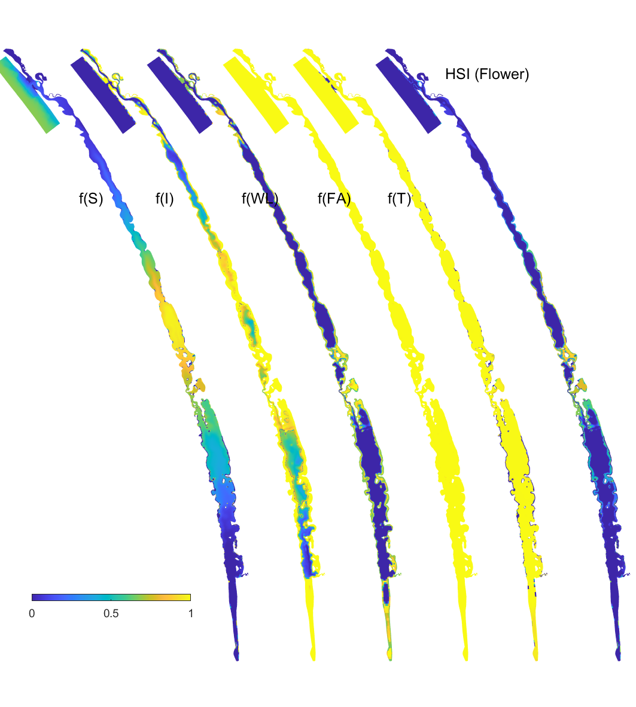

# Habitat Modelling

<br>

## Habitat modelling - **Ruppia**

### Overview

Whilst the Coorong is a naturally saline to hyper-saline lagoon,
freshwater flows are important in maintaining estuarine habitat and
ecosystem health and preventing extreme hyper-salinity [@brookes2009].
*Ruppia tuberosa* is an important macrophyte in the Coorong that
provides habitat for fish and food for herbivorous birds
[@phillips2006], and it can tolerate a salinity higher than natural
seawater. It therefore is known to concentrate in the mid to southern
regions (Figure \@ref(fig:hab-pic1)).

The germination and growth of *R. tuberosa* is known to be governed in
large part by changes in salinity and water level regimes, which are
influenced by flows through the barrages [@kim2013]. Other factors that
influence *R. tuberosa* growth include nutrient availability, water
temperature, sediment quality and interactions with algae, including
shading of light and interference with flowers and fruits on the
surface. Early summer flows are thought to be particularly beneficial as
they delay the drop in water level in the South Lagoon and can prevent
extreme salinities emerging, thereby encouraging a more complete
reproductive cycle [@collier2017].

In addition, salinity has also been identified as the key driver that
influences fish assemblage structure and the extent of estuarine fish
habitat in the Coorong [@ye2011]. This section describes how simulations
of *Ruppia* and estuarine fish habitat have been configured and
assessed.

```{r hab-pic1, echo = FALSE, out.width='100%', class = "text-image", fig.cap = "Conceptual diagram of *Ruppia* presence in the Coorong, under base case conditions=  with moderate inflows from the Barrages (North) and Salt Creek (South-east)."}

knitr::include_graphics("images/lagoon_habitat/fig1.png")

```

### Model description: *Ruppia* HSI

The approach adopted in the current study is to simulate "habitat
suitability" based on an assessment of modelled environmental conditions
relative to the known requirements of *Ruppia tuberosa*, for example,
considering salinity, light and/or other environmental conditions. This
approach was then used to define a relative index for each computational
cell by overlaying the various environmental controls/limitations that
have been informed based on prior experiments and surveys. The
***Habitat Suitability Index*** approach empirically defines conditions
that lead to successful growth and reproduction, without simulation of
processes such as photosynthesis and respiration.

For the Coorong, a similar habitat model approach was undertaken
previously by @ye2014, who focused exclusively on the salinity and water
level requirements of *Ruppia* and presented the model results as an
overall probability that *Ruppia* plants would successfully complete
their lifecycle, by accounting for the different tolerances of different
life stages.

In this study, we used the hydrodynamic-biogeochemical model to predict
environmental conditions at high spatial and temporal resolution for a
period of multiple years, and used this to calculate the habitat
suitability index (HSI) for each particular phase of the life cycle of
*Ruppia* (Figure \@ref(fig:hab-pic2)). The calculation of the HSI
required the integration of environmental conditions over a biologically
relevant time period, based on the typical duration and seasonal timing
for each life-stage. HSI results for different life stages were then
combined and integrated to obtain overall HSI results for successful
completion of sexual or asexual life cycles of *Ruppia*. For each annual
cycle these model results were then summarised over the length of the
Coorong, to allow estimation of the total suitable area.

```{r hab-pic2, echo = FALSE, out.width='75%', class = "text-image", fig.align='center', fig.cap = "Overview of the sexual and vegetative life cycles of *Ruppia tuberosa* (from Collier et al. 2017)."}


```

#### *Ruppia* Habitat Suitability Index calculation {.unnumbered}

In each model cell ($c$), the Habitat Suitability Index (HSI) is
computed based on suitability of conditions ($i$), for each of the main
life-stages ($j$), by defining a fractional index, $Φ$. The fractional
index for each attribute is computed at each time, step and then
integrated over a time window, specific to the life-cycle stage.

$$
\Phi^{HSI_{j}}_{i} = \frac{1}{t_{j_{\text{start}}}-t_{j_{\text{end}}}} \sum^{t_{j_{\text{end}}}}_{t=t_{j_{\text{start}}}}\Phi^{HSI_{j}}_{i}(i)_{t}
(\#eq:hab1)
\\
\scriptsize{
\\ \text{whereby: $i$ = {salinity, temperature, light, depth, algae}}
\\ \text{and: $j$ = {seed, sprout, adult, flower, turion} (Generation 0), or}
\\ \text{$j$ = {turion viability, seed, sprout, adult, flower, turion} (Generation II)}}
$$

The integration time for each life-stage, $j$, is selected from within
the available plant growth windows, as indicated in Table
\@ref(tab:timewindow-0) (Generation 0) and Table \@ref(tab:timewindow-2)
(Generation II).

The above function is computed in each cell and produces maps of
suitability (between 0 and 1) for each environmental attribute for each
life stage within any given year. The individual functions are
piece-wise, based on synthesis of the available literature and analyses
of survey data (Table \@ref(tab:threshold)). These are then overlaid to
produce a final map for any given year using:

$$
\Phi^{HSI}_{c} = \text{min}\left[\Phi^{HSI_{j}}_{i} \right]_{c}
(\#eq:hab2)
$$

To compare the overall area of suitable habitat between years, or the
relative suitability of alternate scenarios, the fractional suitability
is used as a multiplier with the cell area, according to:

$$
A^{HSI} = \sum_{c} \Phi^{HSI}_{c} A_{c}
(\#eq:hab3)
$$

and the spatially averaged HSI in any given region (with area A) is
computed as:

$$
\overline{HSI} = \frac{1}{A}\sum_{c} \Phi^{HSI}_{c} A_{c}
(\#eq:hab4)
$$

### Data availability

The model approach requires empirical data for a) assignment of
appropriate environmental threshold data for each life-stage, and b)
validation and assessment of the approach under various conditions. The
available data for this tasks is described next.

#### Environmental threshold review

##### *Ruppia* life-stages {.unnumbered}

*Ruppia* life-stage time windows were reviewed based on both the
phenology and seasonal survey datasets collected during the HCHB
program. Number of *Ruppia* flowers, fruits, seeds, turions and their
biomass recorded at each site during September 2020 -- December 2021 as
well as algae biomass were grouped by month and plotted as timeseries to
visualise the peak of life-stage events that are relevant to the
*Ruppia* habitat model. It was evident that the peak of
flowering/fruiting and turion formation lies between September and
December (Figure \@ref(fig:phe-sex) and Figure \@ref(fig:phe-asex)).
Seed count peaked around March -- May in 2021, as well as during the
reproductive period (September -- December) in 2020, however in 2021 Dec
much fewer seeds were recorded (Figure \@ref(fig:phe-sex)). Peak algae
growth occurred around September -- December, coincident with the
*Ruppia* reproductive period (Figure \@ref(fig:phe-biomass)). It was
suggested that there were remnant living plants during the aestivation
season (January -- March), which indicates the presence of a perennial
*Ruppia* community [@lewis2022].

```{r phe-sex, echo = FALSE, out.width='100%', class = "text-image", fig.cap = "Boxplots  of monthly *Ruppia* flower count, fruit count, seed count (per m^2^) and biomass of sexual reproductive structures (inflorescence, flowers, fruits, g DW/m^2^) between December 2020 and December 2021. ‘+’ indicates data outside of plotting range."}

knitr::include_graphics("images/lagoon_habitat/phenology_sexual.png")
```

```{r phe-asex, echo = FALSE, out.width='100%', class = "text-image", fig.cap = "Boxplots of monthly *Ruppia* turion count (type I and type II combined, per m^2^) and turion biomass (type I and type II combined, g DW/m^2^) between December 2020 and December 2021."}

knitr::include_graphics("images/lagoon_habitat/phenology_asexual.png")
```

```{r phe-biomass, echo = FALSE, out.width='100%', class = "text-image", fig.cap = "Boxplots of monthly aboveground macrophyte biomass (excluding reproductive structures, g DW/m^2^) and estimated algae biomass (g DW/m^2^) between December 2020 and December 2021."}

knitr::include_graphics("images/lagoon_habitat/phenology_shoot_algae.png")
```

<br>

##### Environmental threshold parameters {.unnumbered}

Environmental conditions and thresholds suitable for *Ruppia* growth,
including salinity, water depth, light availability and temperature have
been reviewed and summarised in Table \@ref(tab:threshold) based on
existing literature and analyses of survey data collected during the
HCHB program.

```{r threshold, echo=FALSE, message=FALSE, warning=FALSE}
library(kableExtra)
library(readxl)
theSheet <- read_excel('tables/habitat/AllTables.xlsx', sheet =4)

kbl(theSheet[,2:6], caption = "Summary of environmental thresholds for *Ruppia* growth based on existing literature (including reports prepared during the HCHB program) and analyses of survey data collected during the HCHB program.", align = "l",escape = F) %>%  #escape controls whether the syntax in table is interpreted
  row_spec(0, background = "#14759e", bold = TRUE, color = "white") %>%
  kable_styling(bootstrap_options = "basic", full_width = T,font_size = 10) %>%
  column_spec(1, width = "12em")%>%
  column_spec(2, width = "12em")%>%
  column_spec(4, width = "10em")%>%
#  scroll_box(fixed_thead = FALSE) %>%
  pack_rows("Turion viability (Jan 1 – Mar 31)", 1, 1) %>%
  pack_rows("Seed germination (Apr 1 – Jun 30)", 2, 2) %>%
  pack_rows("Turion sprouting (Apr 1 – Jun 30)", 3, 3) %>% #3rd and 4th row
  pack_rows("Adult plant growth (Jun 1 – Sep 30)", 4, 8) %>%
  pack_rows("Flowering and seed set (Sep 1 – Dec 31)", 9, 11) %>%
  pack_rows("Turion formation (Sep 1 – Dec 31)", 12, 13)
```

<br>

Statistical analyses were conducted on HCHB *Ruppia* survey data to
investigate the influences of salinity and water depth on *Ruppia*
abundance during 2020 -- 2021, in order to further refine environmental
thresholds in the *Ruppia* model. This is because some of the optimal
values presented in the literature prior to HCHB were thought to be
possibly biased due to extreme environmental conditions in the Coorong
during the survey (e.g. salinity thresholds for turion formation from
[@kim2015], pers. comm). Nonparametric multiplicative regressions (NPMR,
@mccune2006) were used to derive optimal fit models describing the
response of different life-stages of *Ruppia* to salinity and water
depth in seasons appropriate for each life-stage. Salinity and water
depth were found to be the most important abiotic factors influencing
the distribution and abundance of *R. tuberosa* in previous studies
[@kim2015]. Although recent studies suggested that Distance from Murray
Mouth (DFMM), elevation and algal biomass also influence macrophyte
communities in the lagoon [@lewis2022], they are not included in this
NPMR analysis as 1) the mechanisms underlying how DFMM influences
macrophyte abundance is unclear; 2) elevation was recorded as a more
permanent landmark which does not vary between seasons compared to water
depth, however it is the actual water depth that influences the
distribution of seagrass; 3) algae biomass is also influenced by
salinity therefore co-correlation likely exists. The analysis was
conducted in R using the 'ngnn' package and results are shown in (Figure
\@ref(fig:NPMR-repro) and Figure \@ref(fig:NPMR-allperiod)) and Table
\@ref(tab:NPMRresult) below. The abundance of *Ruppia* flower, seed and
macrophyte shoot recorded during 2020 -- 2021 surveys in relation to
salinity and water depth largely agreed with existing literature (Table
\@ref(tab:threshold)). However, relatively high turion abundance was
found to be in lower salinity conditions than previously recorded by
@kim2015. During 2020 -- 2021, considerable number of turions occurred
below salinity of 70 g/L down to approximately 45 g/L, especially when
water depth \<0.4m (Figure \@ref(fig:NPMR-repro)), while @kim2015
suggested that turions were most likely to occur with salinity \>70 g/L.
This finding was therefore incorporated into the turion formation
thresholds in the habitat model (Table \@ref(tab:threshold)). <br>

```{r NPMR-repro, echo = FALSE, fig.show="hold", out.width='50%',  fig.align = "default", class = "text-image",  fig.cap = "Relationship between abundance of *Ruppia* flowers, turions, macroalgae and salinity (g/L) and water depth (m) during the *Ruppia* reproductive period (Sep – Dec 2020 and Dec 2021) in the Coorong."}

knitr::include_graphics("images/lagoon_habitat/NPMR_flower.png")
knitr::include_graphics("images/lagoon_habitat/NPMR_turion.png")
knitr::include_graphics("images/lagoon_habitat/NPMR_algaebiomass.png")

```

<br>

```{r NPMR-allperiod, echo = FALSE, fig.show="hold", out.width='50%',  fig.align = "default", class = "text-image",  fig.cap = "Relationship between abundance of *Ruppia* seeds, macrophyte shoots, macrophyte biomass and salinity (g/L) and water depth (m) during the *Ruppia* reproductive and aestivation period (Sep – Dec 2020, Mar – Apr 2021 and Dec 2021) in the Coorong."}

knitr::include_graphics("images/lagoon_habitat/NPMR_seed_allperiod.png")

knitr::include_graphics("images/lagoon_habitat/NPMR_seagrassbiomass_allperiod.png")
```

<br>

```{r NPMRresult, echo=FALSE, message=FALSE, warning=FALSE}
theSheet <- read_excel('tables/habitat/AllTables.xlsx', sheet = 1)
kbl(theSheet[,1:7], caption = "Summary of nonparametric multiplicative regression results on the influence of salinity and water depth on *Ruppia* and macroalgae abundance. Tol: tolerance; Sens: sensitivity.", align = "c",escape=F) %>%
row_spec(0, background = "#14759e", bold = TRUE, color = "white") %>%
  kable_styling(full_width = F,font_size = 10) %>%
  column_spec(1, width = "15em")%>%
  column_spec(2, width = "11em")%>%
  column_spec(3, width = "11em")%>%
  scroll_box(fixed_thead = FALSE)
```

<br>

##### Macroalgae influences {.unnumbered}

As the presence of filamentous algae mats is thought to negatively
impact *Ruppia* growth by shading submerged plants and entangle
flowers/fruits potentially causing sexual reproductive failure
[@paton2018; @asano2020], a literature review and statistical
analyses on HCHB survey data were conducted on the relationship between
*Ruppia* abundance and macroalgae abundance in an attempt to quantify
the effect of macroalgae on *Ruppia* and improve model accuracy. Very
limited literature exists on the impact of macroalgae on seagrass that
may potentially be translated to the *Ruppia* model. A field
experimental study by @bittick2018 on the effect of *Ulva* biomass on
*Zostera marina* shoot density and growth indicated that *Zostera* shoot
density was negatively affected by *Ulva* biomass predictable by an
exponential decay function (Figure \@ref(fig:Bittick), while *Zostera*
growth was not affected. @irlandi2004 found that 100% drift algal
cover for 2-3 months produced around 25% reduction in above ground
seagrass biomass (*Thalassia testudinum*). However, below-ground
biomass, shoot density or growth rate were not impacted.

```{r Bittick, echo = FALSE, fig.show="hold", out.width='100%', class = "text-image",  fig.cap = "Relationship between *Ulva* biomass and *Zostera marina* shoot density (Source: Bittick et al. 2018)."}


```

<br>

During the HCHB survey filamentous algae largely co-occur with *Ruppia*
communities both spatially and temporally, and dense mats were observed
to be almost exclusively associated with the presence of macrophytes
[@lewis2022]. @lewis2022 identified that when estimated algae
biomass exceeded 184 g DW/m2, there was a significant reduction in
macrophyte biomass.As it was previously speculated that filamentous
algal mats may have a negative impact on the reproductive success of
*Ruppia* by entangling and breaking flower stalks away from the stem
[@paton2018; @asano2020], further analyses were conducted on the
relationship between algae biomass and various *Ruppia* life-stages to
provide insights on assigning appropriate threshold values to each
*Ruppia* life-stage in the habitat model. HCHB seasonal survey core data
including seagrass biomass, seagrass shoot count, *Ruppia* flower count
and total turion count during period when algae growth was most active
(i.e., September - December 2020 and December 2021, Figure
\@ref(fig:phe-biomass)) were averaged by site and summarised in boxplots
against six levels of algae biomass (estimated by converting algal
severity index, conversion method is described in @lewis2022). Results
indicated that compared to overall macrophyte biomass or density, flower
density appeared to have a shaper reduction as algae biomass reached 184
g DW/m^2^ (Figure \@ref(fig:ruppia-algae)). Although this association
may not indicate causation, a lower maximum tolerance on algae was
assigned to the flowering stage than adult growth stage in the habitat
model (Table \@ref(tab:threshold)) based on the assumption that the
impact of dense algal mats is likely to be greater on the sexual
reproductive success than on vegetative growth. In contrast, turion
density appeared to be almost unaffected by high algae biomass (Figure
\@ref(fig:ruppia-algae)). However, it is unclear whether this was a
shift of reproductive strategy from aboveground (flowering) to
belowground (turion) when algae mats were dense, or other co-correlating
factors were at play. As a result, no threshold values were assigned for
turion formation in the model.

```{r ruppia-algae, echo = FALSE, fig.show="hold", out.width='100%',  class = "text-image",  fig.cap = "Boxplots for macrophyte biomass, macrophyte shoot count, *Ruppia* flower count and turion count against six levels of estimated algae biomass during September - December 2020 and December 2021.."}

knitr::include_graphics("images/lagoon_habitat/AlgaeVSRuppia.png")
```

<br>

#### *Ruppia* extent within the lagoon

The distribution and abundance of *Ruppia* has been regularly monitored
in the Coorong since 1998. However, the types of data collected, the
sampling season, location and methods varied between programs. An
overview of the available historical and HBHC datasets is shown in
Figure \@ref(fig:dataavail).

```{r dataavail, echo = FALSE, out.width='100%', class = "text-image", fig.cap = "Overview of *Ruppia* survey datasets showing sampling periods and types of data collected (purple boxes, with HCHB data highlighted in yellow), versus habitat model output (HSI, blue boxes) on a timeline. For model output, life-stages involved in the integration of overall sexual reproduction success are shaded in light blue (with light blue dashed outline), and life-stages involved in the integration of overall asexual reproduction success are shaded in light green (with green dashed outline). Please note that the integration method shown reflects the updated *Ruppia* model (Generation II), for detailed information on the differences between Generation II model and Generation 0 model (pre-HCHB) please refer to Section 8.1.4."}


```

**Historical Monitoring** A summary of historical *Ruppia* monitoring
datasets (pre-2020) is shown in Table \@ref(tab:data-hist). Locations of
sampling sites are shown in Figure \@ref(fig:site-hist). <br>

```{r data-hist, echo=FALSE, message=FALSE, warning=FALSE}
theSheet <- read_excel('tables/habitat/AllTables.xlsx', sheet = 2)
kbl(theSheet[,1:4], caption = "Details of available *Ruppia* survey datasets prior to 2020 showing types of data collected, date range and number of sites surveyed. UA = University of Adelaide. MDBA = Murray-Darling Basin Authority. ORH = Optimising Ruppia Habitat project.", align = "l",escape = F) %>%
row_spec(0, background = "#14759e", bold = TRUE, color = "white") %>%
  kable_styling(bootstrap_options = "basic",full_width = F,font_size = 10) %>%
    scroll_box(fixed_thead = FALSE)
```

```{r site-hist, echo = FALSE, out.width='100%', class = "text-image", fig.cap = "*Ruppia* sampling sites for various monitoring program prior to 2020. Agency/program code under each map corresponds to those listed in Table 5.3. Turquoise outline represents the model boundary. Note that sampling sites of the last dataset listed in Table 5.3 are the same as UA MDBA_2."}

#knitr::include_graphics("images/lagoon_habitat/surveysites_hist.png")

```

{width="100%"}

**HCHB Monitoring** A summary of the HCHB monitoring datasets is shown
in Table \@ref(tab:data-hchb). Locations of sampling sites are shown in
Figure \@ref(fig:site-hchb). <br>

```{r data-hchb, echo=FALSE, message=FALSE, warning=FALSE}
theSheet <- read_excel('tables/habitat/AllTables.xlsx', sheet = 3)
kbl(theSheet[,1:4], caption = "Details of available *Ruppia* survey datasets for the HCHB program showing types of data collected, date range and number of sites surveyed. UA = University of Adelaide. HCHB = Healthy Coorong Healthy Basin project.", align = "l",escape = F) %>%
row_spec(0, background = "#14759e", bold = TRUE, color = "white") %>%
  kable_styling(bootstrap_options = "basic",full_width = F,font_size = 10) %>%
  scroll_box(fixed_thead = FALSE)
```

```{r site-hchb, echo = FALSE, out.width='100%', class = "text-image", fig.cap = "*Ruppia* sampling sites for the HCHB program. Agency/program code under each map corresponds to those listed in Table 5.4. Turquoise outline represents the model boundary."}

#knitr::include_graphics("images/lagoon_habitat/surveysites_hchb.png")
```

{width="100%"}

### Model application

This section describes both the Generation 0 model, which is the
original model developed before HCHB, and the Generation II model, which
was developed during HCHB.

#### Generation 0 model

The hydrodynamic-biogeochemical model TUFLOW-FV -- AED was used to
simulate hydrodynamic conditions (velocity, salinity, temperature and
water level), water clarity (light and turbidity) and the potential for
filamentous algae (nutrients and algae). Specifically, the HCHB V0.1
model was applied, configured using the specification of AED parameters
(...). The Coorong has a long residence time and to account for the
longer timescales of water and solute flux, multi-year simulations must
be performed. The habitat suitability functions for each environmental
variable of each *Ruppia* life-stage were determined based on literature
review and expert judgement (Table \@ref(tab:timewindow-0) and Table
\@ref(tab:threshold-0)), and used for the calculation of HSI for each
life-stage (Equation \@ref(eq:hab1) and Equation \@ref(eq:hab2)). The
HSI for each life-stage were integrated into an overall HSI for

-   Completing the sexual reproduction annual cycle by going through
    seed germination in autumn, adult growth in winter and flowering and
    seed set in spring; or
-   Completing the asexual reproduction annual cycle by going through
    turion sprouting in autumn, adult growth in winter and turion
    formation in spring. Specifically:

$$
\Phi^{HSI sexual}_{c} = \text{min}\left[\Phi^{HSI_{seed}}_{i},\Phi^{HSI_{adult}}_{i},\Phi^{HSI_{flower}}_{i} \right]_{c}
(\#eq:hab5)
$$

$$
\Phi^{HSI asexual}_{c} = \text{min}\left[\Phi^{HSI_{sprout}}_{i},\Phi^{HSI_{adult}}_{i},\Phi^{HSI_{turion}}_{i} \right]_{c}
(\#eq:hab6)
$$

<br>

```{r timewindow-0, echo=FALSE, message=FALSE, warning=FALSE}
theSheet <- read_excel('tables/habitat/AllTables.xlsx', sheet = 5)
kbl(theSheet[,1:4], caption = "Life-stage time windows over which environmental suitability for *Ruppia* is assessed.", align = "c",escape = F) %>%
row_spec(0, background = "#14759e", bold = TRUE, color = "white") %>%
  kable_styling(bootstrap_options = "basic",full_width = F,font_size = 10)
#  scroll_box(fixed_thead = FALSE)
```

<br>

```{r threshold-0, echo=FALSE, message=FALSE, warning=FALSE}
theSheet <- read_excel('tables/habitat/AllTables.xlsx', sheet = 7)
kbl(theSheet[,1:6], caption = "Environmental thresholds applied in the Gen 0 model for *Ruppia* life-stages based on past literature review and expert judgement.", align = "c",escape = F) %>%
row_spec(0, background = "#14759e", bold = TRUE, color = "white") %>%
  kable_styling(bootstrap_options = "basic",full_width = T,font_size = 10)
#  scroll_box(fixed_thead = FALSE)
```

<font size="1"> \*Provided that the wet days are not followed by \>8 dry
days (= unsuitable).</font> <font size="1"> Note: for Salinity,
Temperature, Light and Algal biomass, use 90-day rolling mean values for
the respective periods to interrogate the model outputs against these
thresholds</font> <br>

In these tests, the model was run from May 2013 to March 2019 using the
base case condition. The outputs of the model are maps of habitat
suitability of critical life stages (Figure \@ref(fig:ewater-HSIflower),
showing only the flowering stage in 2018), in response to light, depth,
salinity and filamentous algae presence, which in the end results in a
combined probability of sexual or asexual life-cycle completion (Figure
\@ref(fig:ewater-HSIsexual), showing only the overall HSI for the
completion of the sexual life cycle in 2018). The requirements for each
life stage are quite different, and when each is superimposed together,
the areas where life-cycle completion are limited to the margins of the
main lagoons, and the shallow areas around the central region. From year
to year, the area of good habitat changes, depending on that year's
eco-hydrodynamic regime.

```{r ewater-HSIflower, echo = FALSE, out.width='60%', class = "text-image", fig.cap = "Habitat suitability (HSI) for the flowering plant phase of *Ruppia tuberosa* in the Coorong as a function of salinity f(S), light f(l), water level f(WL), and presence of filamentous algae f(FA) for the Base Case in 2018.An HSI of 0 (dark purple) represents unsuitable habitat conditions, while an HSI of 1 represents optimal conditions (yellow)."}


```

```{r ewater-HSIsexual, echo = FALSE, out.width='60%', class = "text-image", fig.cap = "Overall HSI for the successful completion of the sexual life cycle of *Ruppia tuberosa* calculated by integrating the HSI results for adult plants, flowering and seedset, and seed germination in the Coorong, for the Base Case in 2018. An HSI of 0 (dark purple) represents unsuitable habitat conditions, while an HSI of 1 represents optimal conditions (yellow)."}

knitr::include_graphics("images/lagoon_habitat/eWater_HSI sexual.png")

```

</center>

#### Generation II model

The hydrodynamic-biogeochemical model TUFLOW-FV -- AED was used to
simulate the hydrodynamic conditions (velocity, salinity, temperature
and water level), water clarity (light and turbidity) and the potential
for filamentous algae (nutrients and algae). Specifically, the HCHB
Generation II model was applied, configured using the specification of
AED parameters (...). The Coorong has a long residence time and to
account for the longer timescales of water and solute flux, multi-year
simulations must be performed. The habitat suitability functions for
each environmental variable of each *Ruppia* life-stage were determined
based on recent literature review, analyses of the HCHB survey data and
expert judgement (Table \@ref(tab:timewindow-2), Table
\@ref(tab:threshold-2), Appendix C), and used for the calculation of HSI
for each life-stage (Equation \@ref(eq:hab1) and Equation
\@ref(eq:hab2)). The HSI for each life-stage were integrated into

-   An overall HSI sexual, representing the integrated habitat
    suitability for *Ruppia* to complete its annual life cycle by
    reproducing sexually, i.e., flowering, which includes i) emerging in
    autumn, either from germination from seed or sprouting from viable
    turions that survived the summer; ii) vegetative growth to adult
    plants in winter; and iii) successful flowering and producing seed
    in spring; or

-   An overall HSI asexual, representing the integrated habitat
    suitability for *Ruppia* to complete its annual life cycle by
    reproducing asexually, i.e., forming turions, which includes i)
    emerging in autumn, either from germination from seed or sprouting
    from viable turions that survived the summer; ii) vegetative growth
    to adult plants in winter; and iii) formation of turions in spring.
    Specifically:

$$
\Phi^{HSI sexual}_{c} = \text{min}\left[\text{max}\left[\Phi^{HSI_{seed}}_{i},\text{min}\left[\Phi^{HSI_{viability}}_{i},\Phi^{HSI_{sprout}}_{i}\right]\right],\Phi^{HSI_{adult}}_{i},\Phi^{HSI_{flower}}_{i}\right]_{c}
(\#eq:hab7)
$$

$$
\Phi^{HSI asexual}_{c} = \text{min}\left[\text{max}\left[\Phi^{HSI_{seed}}_{i},\text{min}\left[\Phi^{HSI_{viability}}_{i},\Phi^{HSI_{sprout}}_{i}\right]\right],\Phi^{HSI_{adult}}_{i},\Phi^{HSI_{turion}}_{i}\right]_{c}
(\#eq:hab8)
$$

<br> This new HSI integration approach differs from the Generation 0
model in two ways:

1.  A new function, turion viability was added to the model for the
    summer dormancy period and integrated in the HSI calculation before
    turion sprouting to exclude areas where salinity levels were
    sufficiently high to cause ion toxicity in turions during summer.
    @kim2013 showed that after exposure to high salinities for
    60 days, most turions lost viability and failed to sprout after
    being transferred back to fresher conditions. In comparison, seed
    viability was not negatively affected by high salinities.

2.  For the beginning of *Ruppia*'s life cycle in autumn, the
    probability of both seed germination and turion sprouting are
    included in both sexual and asexual pathways, whereas in the
    previous version, seed germination was exclusive to the calculation
    of HSI sexual and turion sprouting exclusive to HSI asexual. The
    rationale behind this change is because *Ruppia* individuals that
    ended up flowering may not necessarily have started from seed
    germination but could be from turion sprouting. Likewise, *Ruppia*
    individuals that formed turions in the end could have started from
    seed germination. <br>

```{r timewindow-2, echo=FALSE, message=FALSE, warning=FALSE}
theSheet <- read_excel('tables/habitat/AllTables.xlsx', sheet = 6)
kbl(theSheet[,1:5], caption = "Life-stage time windows over which environmental suitability for *Ruppia* is assessed. Refer to Section 8.1.3.1 for details on rationale.", align = "c",escape = F) %>%
row_spec(0, background = "#14759e", bold = TRUE, color = "white") %>%
  kable_styling(bootstrap_options = "basic",full_width = F,font_size = 10)
#  scroll_box(fixed_thead = FALSE)
```

<br>

```{r threshold-2, echo=FALSE, message=FALSE, warning=FALSE}
theSheet <- read_excel('tables/habitat/AllTables.xlsx', sheet = 8)
kbl(theSheet[,1:6], caption = "Environmental thresholds applied in the Gen II model for *Ruppia* life-stages based on recent literature review, HCHB survey data and expert judgement. Refer to Section 8.1.3.1 and Appendix C for more details on each function and rationale.", align = "c",escape = F) %>%
row_spec(0, background = "#14759e", bold = TRUE, color = "white") %>%
  kable_styling(bootstrap_options = "basic",full_width = T,font_size = 10)
#  scroll_box(fixed_thead = FALSE)
```

<font size="1"> \*Provided that the wet days are not followed by \>8 dry
days (= unsuitable).</font>

<br> In these tests, the model was run from July 2017 to Dec 2021 using
the base case condition. The outputs of the model are maps of habitat
suitability of critical life stages (Figure \@ref(fig:Gen2-HSIflower)),
showing only the flowering stage in 2020), in response to light, depth,
salinity, temperature and filamentous algae presence, which in the end
results in a combined probability of sexual or asexual life-cycle
completion (Figure \@ref(fig:Gen2-HSIsexual), showing only the overall
HSI for the completion of the sexual life cycle in 2020). The
requirements for each life stage are quite different, and when each is
superimposed together, the areas where life-cycle completion are limited
to the margins of the main lagoons, and the shallow areas around the
central region. From year to year, the area of good habitat changes,
depending on that year's eco-hydrodynamic regime.

```{r Gen2-HSIflower, echo = FALSE, out.width='60%', class = "text-image", fig.cap = "Habitat suitability (HSI) for the flowering plant phase of *Ruppia tuberosa* in the Coorong as a function of salinity f(S), light f(l), water level f(WL), temperature f(T) and presence of filamentous algae f(FA) for the base case in 2020. An HSI of 0 (dark purple) represents unsuitable habitat conditions, while an HSI of 1 represents optimal conditions (yellow)."}


```

```{r Gen2-HSIsexual, echo = FALSE, out.width='60%', class = "text-image", fig.cap = "Overall HSI for the successful completion of the sexual life cycle calculated by integrating the HSI results for seed germination, turion viability and turion sprouting, adult plants, and flowering and seed set in the Coorong, for the Base Case in 2020. An HSI of 0 (dark purple) represents unsuitable habitat conditions, while an HSI of 1 represents optimal conditions (yellow)."}

knitr::include_graphics("images/lagoon_habitat/Gen2_HSI_sexual.png")

```

<br>

### Model results and assessment

To assess the accuracy of model predictions, the habitat suitability
maps produced above were compared with *Ruppia* field survey results for
both distribution and abundance, including several types of plant
materials (e.g., shoot, seed, turion) which were used to validate HSI of
different life-stages. In addition to a visual assessment, regression
analyses were conducted in R studio between HSI values and *Ruppia*
abundance for each life-stage over relevant periods. In general, this
was done by overlaying *Ruppia* spatial data on HSI maps, creating a
buffer around each sampling site, averaging HSI values in each model
cell that fall within this buffer, and comparing with *Ruppia*
abundance. <br> The specific validation approach has evolved as the
project progresses with more data becoming available, model updates
implemented, and more insights revealed. For example, the strategies for
pairing specific plant material recorded in the field with HSI output of
a particular life-stage (e.g. seed abundance in Mar vs. HSI flowering in
Sep the previous year) and its appropriate timing has initially been
explored extensively. Table \@ref(tab:validversion) summarises the
various major validation versions, including their data source, model
version and methodology. Details of methods and results of the latest
version 'HCHB_Gen II', in which the Gen II model were implemented are
described below. Details of assessments of previous versions and
evolution of validation approaches are included in Appendices. <br>

```{r validversion, echo=FALSE, message=FALSE, warning=FALSE}
theSheet <- read_excel('tables/habitat/AllTables.xlsx', sheet = 9)
kbl(theSheet[,1:9], caption = "Validation versions for the *Ruppia* model showing their data source, model version and validation methodology. Gen 0: Generation 0 model; Gen II: Generation II model; ‘default’ model output timeframe: the output HSI results were integrated across the entire period of relevant life-stage (e.g. HSI flowering by default is an integration of environmental conditions over Aug – Dec); ‘tailored’ model output timeframe: the output HSI results were integrated only up to the survey period (e.g. to validate against field surveys conducted in Sep, HSI flowering Sep is an integration of environmental conditions over Aug – Sep only).", align = "c",escape = F) %>%
  add_header_above(c(" " = 3, "Ruppia model" = 3, "Validation methodology" = 3))%>%
#row_spec(0, background = "#14759e", bold = TRUE, color = "white") %>%
  column_spec(2, width = "13em")%>%
  column_spec(6, width = "8em")%>%
  kable_styling(bootstrap_options = "basic",full_width = T,font_size = 10)
#  scroll_box(fixed_thead = FALSE)
```

<font size="1"> \*Excludes turion viability function </font> <br>

<br>

#### HCHB Gen II validation {.unnumbered}

<br> Ruppia survey data and associated model output used for the Gen II
model assessment as well as validation metrics (correlation
coefficients) are summarised in Table \@ref(tab:validpairs), and results
described in following subsections. Overall, implementation of the
*Ruppia* Gen II model has improved validation scores on most life-cycle
phases, in particular field turion abundance versus modelled HSI for
asexual reproduction due to a major update on the turion environmental
threshold parameters. In most cases, model achieved a higher validation
score in the south lagoon compared to the whole lagoon, which offers a
higher confidence in assessing potential management options that are
focused in the south. Model performance was significantly better in 2020
than in 2021 (for all validation pairs in the whole lagoon: average R =
0.4 in 2020 versus R = 0.11 in 2021). The lower scores in 2021 may be
due to 1) an unusually cool and wet conditions experienced in the
winter/spring 2021 that has delayed the *Ruppia* life cycle,
particularly the flowering phase which may be triggered by rising
temperature (Waycott 2022, pers.comm.), the threshold of which is
currently unknown; 2) quantitative field surveys were conducted in Dec
only in 2021 due to accessibility issues in extremely wet conditions
prior to Dec, instead of between Sep and Dec in 2020.

```{r validpairs, echo=FALSE, message=FALSE, warning=FALSE}
# library(kableExtra)
# library(readxl)
theSheet <- read_excel('tables/habitat/AllTables.xlsx', sheet =12)

kbl(theSheet[,1:6], digits = 2, caption = "Summary of *Ruppia* survey data with their corresponding model output used for validation of the Gen II model, and correlation coefficients (R) between field abundance and modelled Habitat Suitability Index (HSI).", align = "l",escape = F) %>%  #escape controls whether the syntax in table is interpreted
  row_spec(0, background = "#14759e", bold = TRUE, color = "white") %>%
  kable_styling(bootstrap_options = "basic", full_width = T,font_size = 10) 
  # column_spec(1, width = "12em")%>%
  # column_spec(2, width = "12em")%>%
  # column_spec(4, width = "10em")%>%
#  scroll_box(fixed_thead = FALSE) %>%
```

<br>

**i. Field shoot count Sep 2020 (obs) vs. HSI seed germination + turion
viability + turion sprouting + adult growth Sep 2020 (model)**

Average number of seagrass shoots per square meter recorded in Sep - Dec
2020 (reproductive period) were compared with combined HSI for seed
germination, turion sprouting and adult growth up to end of Sep in the
same year (Figure \@ref(fig:hchb-shoot2020map) and
\@ref(fig:hchb-shoot2020)). The Gen II model update has resulted in
slightly higher validation scores (correlation coefficient) than that of
the Gen 0 model. The overall distribution of shoots was consistent with
model prediction. Seagrass density around the middle lagoon and north
lagoon were higher, where HSI predictions were highest.

```{r hchb-shoot2020map, echo = FALSE, out.width='100%', class = "text-image", fig.cap = "Average seagrass shoot count per square meter in Sep – Dec 2020 (circles) overlaid on HSI model output for germination, sprouting and adult growth integrated over Jan - Sep 2020. An HSI of 0 (dark purple) represents unsuitable habitat conditions, while an HSI of 1 represents optimal conditions (yellow)."}

knitr::include_graphics("images/lagoon_habitat/shoot2020_germspradt2020_map.png")

```

```{r hchb-shoot2020, echo = FALSE, out.width='100%', class = "text-image", fig.cap = "Scatter plot and boxplot of average seagrass shoot count per square meter in Sep – Dec 2020 versus HSI model output for germination, sprouting and adult growth integrated over Jan - Sep 2020. Top panel: the entire lagoon (red: north, blue: south), bottom panel: south lagoon. An HSI of 0 represents unsuitable habitat conditions, while an HSI of 1 represents optimal conditions."}

knitr::include_graphics("images/lagoon_habitat/shoot2020_germspradt2020.png")

```

<br>

**ii. Field flower count Sep 2020 (obs) vs. HSI sexual Oct 2020
(model)**

Average number of *Ruppia* flower per square meter recorded in Sep - Dec
2020 (reproductive period) were compared with overall HSI for sexual
reproduction up to end of Oct in the same year (Figure
\@ref(fig:hchb-flower2020map) and \@ref(fig:hchb-flower2020)). The Gen
II has similar validation scores of the Gen 0 model. The overall
distribution of flowers was consistent with model prediction. Highest
density of flowers was found in the north lagoon where HSI predictions
were highest. Almost no flowers were recorded in the south lagoon, where
HSI predictions were low.

```{r hchb-flower2020map, echo = FALSE, out.width='100%', class = "text-image", fig.cap = "Average *Ruppia* flower count per square meter in Sep – Dec 2020 (circles) overlaid on HSI model output for overall sexual reproduction integrated over Jan – Oct 2020. An HSI of 0 (dark purple) represents unsuitable habitat conditions, while an HSI of 1 represents optimal conditions (yellow)."}

knitr::include_graphics("images/lagoon_habitat/flower2020_sexual2020_map.png")

```

```{r hchb-flower2020, echo = FALSE, out.width='100%', class = "text-image", fig.cap = "Scatter plot and boxplot of average *Ruppia* flower count per square meter in Sep – Dec 2020 versus HSI model output for overall sexual reproduction integrated over Jan - Oct 2020. Top panel: the entire lagoon (red: north, blue: south), bottom panel: south lagoon. An HSI of 0 represents unsuitable habitat conditions, while an HSI of 1 represents optimal conditions."}

knitr::include_graphics("images/lagoon_habitat/flower2020_sexual2020.png")

```

<br>

**iii. Field seed count Mar 2021 (obs) vs. HSI sexual Dec 2020 (model)**

Average number of *Ruppia tuberosa* seed per square meter recorded in
Mar - Apr 2021 (aestivation period) were compared with overall HSI for
sexual reproduction in 2020 (Figure \@ref(fig:hchb-seed2021map) and
\@ref(fig:hchb-seed2021)). The Gen II model update has resulted in
better validation scores than the Gen 0 model, especially in the south
lagoon. It's important to note that seeds have the potential to disperse
with water current/wind therefore its distribution and abundance may be
less predictable than other plant materials.

```{r hchb-seed2021map, echo = FALSE, out.width='100%', class = "text-image", fig.cap = "Average *Ruppia tuberosa* seed count per square meter in Mar – Apr 2021 (circles) overlaid on HSI model output for overall sexual reproduction integrated over Jan – Dec 2020. An HSI of 0 (dark purple) represents unsuitable habitat conditions, while an HSI of 1 represents optimal conditions (yellow)."}

knitr::include_graphics("images/lagoon_habitat/seed2021_sexual2020_map.png")
```

```{r hchb-seed2021, echo = FALSE, out.width='100%', class = "text-image", fig.cap = "Scatter plot and boxplot of average *Ruppia tuberosa* seed count per square meter in Mar – Apr 2021 versus HSI model output for overall sexual reproduction integrated over Jan - Dec 2020. Top panel: the entire lagoon (red: north, blue: south), bottom panel: south lagoon. An HSI of 0 represents unsuitable habitat conditions, while an HSI of 1 represents optimal conditions."}

knitr::include_graphics("images/lagoon_habitat/seed2021_sexual2020.png")
```

<br>

**iv. Field turion count Sep 2020 (obs) vs. HSI asexual Oct 2020
(model)**

Average number of *Ruppia* turion (type I and II) per square meter
recorded in Sep - Dec 2020 (reproductive period) were compared with
overall HSI for asexual reproduction up to end of Oct in the same year
(Figure \@ref(fig:hchb-turion2020map) and \@ref(fig:hchb-turion2020)).
The Gen II model update has significantly improved validation scores
compared to the Gen 0 model due to a major change in salinity threshold
parameter. The overall distribution of turions agreed with model
prediction in that more turions were found around the middle lagoon and
northern end of south lagoon, where HSI were highest.

```{r hchb-turion2020map, echo = FALSE, out.width='100%', class = "text-image", fig.cap = "Average *Ruppia* turion count per square meter in Sep – Dec 2020 (circles) overlaid on HSI model output for overall asexual reproduction integrated over Jan – Oct 2020. An HSI of 0 (dark purple) represents unsuitable habitat conditions, while an HSI of 1 represents optimal conditions (yellow)."}

knitr::include_graphics("images/lagoon_habitat/turion2020_asexual2020_map.png")
```

```{r hchb-turion2020, echo = FALSE, out.width='100%', class = "text-image", fig.cap = "Scatter plot and boxplot of average *Ruppia* turion count per square meter in Sep – Dec 2020 versus HSI model output for overall asexual reproduction integrated over Jan - Oct 2020. Top panel: the entire lagoon (red: north, blue: south), bottom panel: south lagoon. An HSI of 0 represents unsuitable habitat conditions, while an HSI of 1 represents optimal conditions."}

knitr::include_graphics("images/lagoon_habitat/turion2020_asexual2020.png")
```

<br>

**v. Field shoot count Dec 2021 (obs) vs. HSI seed germination + turion
viability + turion sprouting + adult growth Sep 2021 (model)**

Average number of seagrass shoots per square meter recorded in Dec 2021
(reproductive period) were compared with combined HSI for seed
germination, turion sprouting and adult growth up to end of Sep in the
same year (Figure \@ref(fig:hchb-shoot2021map) and
\@ref(fig:hchb-shoot2021)). The validation scores of 2021 were lower
than that of 2020, possibly due to the environmental conditions
experienced in winter-spring 2021 (including unusually cool and wet
conditions), which may have caused a delay in the *Ruppia* life cycle
(Waycott 2022, pers. comm.).

```{r hchb-shoot2021map, echo = FALSE, out.width='100%', class = "text-image", fig.cap = "Average seagrass shoot count per square meter in Dec 2021 (circles) overlaid on HSI model output for germination, sprouting and adult growth integrated over Jan - Sep 2021. An HSI of 0 (dark purple) represents unsuitable habitat conditions, while an HSI of 1 represents optimal conditions (yellow)."}

knitr::include_graphics("images/lagoon_habitat/shoot2021_germspradt2021_map.png")
```

```{r hchb-shoot2021, echo = FALSE, out.width='100%', class = "text-image", fig.cap = "Scatter plot and boxplot of average seagrass shoot count per square meter in Dec 2021 versus HSI model output for germination, sprouting and adult growth integrated over Jan - Sep 2020. Top panel: the entire lagoon (red: north, blue: south), bottom panel: south lagoon. An HSI of 0 represents unsuitable habitat conditions, while an HSI of 1 represents optimal conditions."}

knitr::include_graphics("images/lagoon_habitat/shoot2021_germspradt2021.png")
```

<br>

**vi. Field flower count Dec 2021 (obs) vs. HSI sexual Dec 2021
(model)**

Average number of *Ruppia* flowers per square meter recorded in Dec 2021
(reproductive period) were compared with overall HSI for sexual
reproduction in 2021 (Figure \@ref(fig:hchb-flower2021map) and
\@ref(fig:hchb-flower2021)). The validation scores of 2021 were lower
than that of 2020, possibly due to the environmental conditions
experienced in winter-spring 2021 (including unusually cool and wet
conditions), which may have caused a delay in the *Ruppia* life cycle
(Waycott 2022, pers. comm.). Overall very few flowers were recorded in
the 2021 reproductive period. It was speculated that flowering may be
triggered by warming temperature (Waycott 2022, pers. comm.), the
threshold of which remains unclear (in the current model the temperature
threshold for flowering is assumed to be the same as vegetative growth).

```{r hchb-flower2021map, echo = FALSE, out.width='100%', class = "text-image", fig.cap = "Average *Ruppia* flower count per square meter in Dec 2021 (circles) overlaid on HSI model output for overall sexual reproduction integrated over Jan – Dec 2021. An HSI of 0 (dark purple) represents unsuitable habitat conditions, while an HSI of 1 represents optimal conditions (yellow)."}

knitr::include_graphics("images/lagoon_habitat/flower2021_sexual2021_map.png")
```

```{r hchb-flower2021, echo = FALSE, out.width='100%', class = "text-image", fig.cap = "Scatter plot and boxplot of average *Ruppia* flower count per square meter in Dec 2021 versus HSI model output for overall sexual reproduction integrated over Jan – Dec 2021. Top panel: the entire lagoon (red: north, blue: south), bottom panel: south lagoon. An HSI of 0 represents unsuitable habitat conditions, while an HSI of 1 represents optimal conditions."}

knitr::include_graphics("images/lagoon_habitat/flower2021_sexual2021.png")
```

<br>

**vii. Field seed count Dec 2021 (obs) vs. HSI sexual Dec 2021 (model)**

Average number of *Ruppia tuberosa* seeds per square meter recorded in
Dec 2021 (reproductive period) were compared with overall HSI for sexual
reproduction in 2021 (Figure \@ref(fig:hchb-seed2021map-2) and
\@ref(fig:hchb-seed2021-2)). The validation scores of 2021 were lower
than that of 2020. This is as expected, since flowering activity was
markedly delayed in 2021 and would not have set seed in Dec yet.

```{r hchb-seed2021map-2, echo = FALSE, out.width='100%', class = "text-image", fig.cap = "Average *Ruppia tuberosa* seed count per square meter in Dec 2021 (circles) overlaid on HSI model output for overall sexual reproduction integrated over Jan – Dec 2021. An HSI of 0 (dark purple) represents unsuitable habitat conditions, while an HSI of 1 represents optimal conditions (yellow)."}

knitr::include_graphics("images/lagoon_habitat/seed2021_sexual2021_map.png")
```

```{r hchb-seed2021-2, echo = FALSE, out.width='100%', class = "text-image", fig.cap = "Scatter plot and boxplot of average *Ruppia tuberosa* seed count per square meter in Dec 2021 versus HSI model output for overall sexual reproduction integrated over Jan - Dec 2021. Top panel: the entire lagoon (red: north, blue: south), bottom panel: south lagoon. An HSI of 0 represents unsuitable habitat conditions, while an HSI of 1 represents optimal conditions."}

knitr::include_graphics("images/lagoon_habitat/seed2021_sexual2021.png")
```

<br>

**viii. Field turion count Dec 2021 (obs) vs. HSI asexual Dec 2021
(model)**

Average number of *Ruppia* turion (type I and II) per square meter
recorded in Dec 2021 (reproductive period) were compared with overall
HSI for asexual reproduction in 2021 (Figure
\@ref(fig:hchb-turion2021map) and \@ref(fig:hchb-turion2021)).
Validation scores for 2021 is markedly higher than in 2020. The overall
distribution of turions agreed with model prediction in that more
turions were found around the middle lagoon and northern half of south
lagoon, where HSI were higher.

```{r hchb-turion2021map, echo = FALSE, out.width='100%', class = "text-image", fig.cap = "Average *Ruppia* turion count per square meter in Dec 2021 (circles) overlaid on HSI model output for overall asexual reproduction integrated over Jan – Dec 2021. An HSI of 0 (dark purple) represents unsuitable habitat conditions, while an HSI of 1 represents optimal conditions (yellow)."}

knitr::include_graphics("images/lagoon_habitat/turion2021_asexual2021_map.png")
```

```{r hchb-turion2021, echo = FALSE, out.width='100%', class = "text-image", fig.cap = "Scatter plot and boxplot of average *Ruppia* turion count per square meter in Dec 2021 versus HSI model output for overall asexual reproduction integrated over Jan - Dec 2021. Top panel: the entire lagoon (red: north, blue: south), bottom panel: south lagoon. An HSI of 0 represents unsuitable habitat conditions, while an HSI of 1 represents optimal conditions."}

knitr::include_graphics("images/lagoon_habitat/turion2021_asexual2021.png")
```

<br>

**x. Field shoot count Jul 2018 (obs) vs. HSI seed germination + turion
viability + turion sprouting + adult growth Jun 2018 (model)**

Average number of seagrass shoots per 7.5 cm core recorded in Jul 2018
were compared with combined HSI for seed germination, turion sprouting
and adult growth up to end of Jun in the same year (Figure
\@ref(fig:hchb-shoot2018map) and \@ref(fig:hchb-shoot2018)). There was
some mismatch between model prediction and field observation, in that
model predicted most suitable conditions in the north lagoon where no
shoots were recorded, and less suitable conditions in the south lagoon
where a small number of shoots were recorded.

```{r hchb-shoot2018map, echo = FALSE, out.width='100%', class = "text-image", fig.cap = "Average seagrass shoot count per 7.5 cm core in Jul 2018 (circles) overlaid on HSI model output for germination, sprouting and adult growth integrated over Jan – Jun 2018. An HSI of 0 (dark purple) represents unsuitable habitat conditions, while an HSI of 1 represents optimal conditions (yellow)."}

knitr::include_graphics("images/lagoon_habitat/shoot2018_germspradt2018_map.png")
```

```{r hchb-shoot2018, echo = FALSE, out.width='100%', class = "text-image", fig.cap = "Scatter plot and boxplot of average seagrass shoot count per 7.5 cm core in Jul 2018 versus HSI model output for germination, sprouting and adult growth integrated over Jan – Jun 2018. Top panel: the entire lagoon (red: north, blue: south), bottom panel: south lagoon. An HSI of 0 represents unsuitable habitat conditions, while an HSI of 1 represents optimal conditions."}

knitr::include_graphics("images/lagoon_habitat/shoot2018_germspradt2018.png")
```

<br>

**xi. Field seed count Jan 2019 (obs) vs. HSI sexual Dec 2018 (model)**

Average number of *Ruppia tuberosa* seeds per 7.5 cm core recorded in
Jan 2019 were compared with overall HSI for sexual reproduction in 2018
(Figure \@ref(fig:hchb-seed2019map) and \@ref(fig:hchb-seed2019)). The
overall distribution of seeds agreed with model predictions. More seeds
were found around the middle lagoon where model predicted higher HSIs.

```{r hchb-seed2019map, echo = FALSE, out.width='100%', class = "text-image", fig.cap = "Average *Ruppia tuberosa* seed count per 7.5 cm core in Jan 2019 (circles) overlaid on HSI model output for overall sexual reproduction integrated over Jan – Dec 2018. An HSI of 0 (dark purple) represents unsuitable habitat conditions, while an HSI of 1 represents optimal conditions (yellow)."}

knitr::include_graphics("images/lagoon_habitat/seed2019_sexual2018_map.png")
```

```{r hchb-seed2019, echo = FALSE, out.width='100%', class = "text-image", fig.cap = "Scatter plot and boxplot of average *Ruppia tuberosa* seed count per 7.5 cm core in Jan 2019 versus HSI model output for overall sexual reproduction integrated over Jan - Dec 2018. Top panel: the entire lagoon (red: north, blue: south), bottom panel: south lagoon. An HSI of 0 represents unsuitable habitat conditions, while an HSI of 1 represents optimal conditions."}

knitr::include_graphics("images/lagoon_habitat/seed2019_sexual2018.png")
```

<br>

**xii. Field turion count Jan 2019 (obs) vs. HSI asexual Dec 2018
(model)**

Average number of *Ruppia* turions (type I and II) per 7.5 cm core
recorded in Jan 2019 were compared with overall HSI for asexual
reproduction in 2018 (Figure \@ref(fig:hchb-turion2019map) and
\@ref(fig:hchb-turion2019)). Higher density of turions were recorded
around the northern end of south lagoon, where our model also predicted
high HSIs, however there are also sites with a mismatch between modelled
and observed, such as around the southern end of north lagoon.

```{r hchb-turion2019map, echo = FALSE, out.width='100%', class = "text-image", fig.cap = "Average *Ruppia* turion count per 7.5 cm core in Jan 2019 (circles) overlaid on HSI model output for overall asexual reproduction integrated over Jan – Dec 2018. An HSI of 0 (dark purple) represents unsuitable habitat conditions, while an HSI of 1 represents optimal conditions (yellow)."}


```

```{r hchb-turion2019, echo = FALSE, out.width='100%', class = "text-image", fig.cap = "Scatter plot and boxplot of average *Ruppia* turion count per 7.5 cm core in Jan 2019 versus HSI model output for overall asexual reproduction integrated over Jan - Dec 2018. Top panel: the entire lagoon (red: north, blue: south), bottom panel: south lagoon. An HSI of 0 represents unsuitable habitat conditions, while an HSI of 1 represents optimal conditions."}

knitr::include_graphics("images/lagoon_habitat/turion2019_asexual2018.png")
```

<br>

### Summary

We undertook an extensive review of historical and HCHB *Ruppia*
monitoring data and literature review on environmental influences
including the effect of macroalgae on all *Ruppia* life-stages. We also
conducted statistical analyses on *Ruppia* phenology and distribution
data in relation to salinity, water depth and macroalgae abundance.
Based on literature review, data analyses and on-going model assessment,
we have developed the Ruppia Gen II model by 1) refining relevant
environmental threshold parameters and time windows for all *Ruppia*
life-stages, with a new life-stage function (turion viability) added to
the model; 2) improving life-stage integration approach in the model. We
have also for the first time developed an approach for validating model
output against field data. <br> Model performance was overall
satisfactory, where areas with higher HSI predicted by the model aligned
with higher abundance recorded in the field in most cases. The
implementation of Gen II model has improved validation metrics for most
life stages, especially turion abundance versus HSI for asexual
reproduction. In most cases, model achieved a higher validation score in
the south lagoon compared to the whole lagoon, which offers higher
confidence in assessing potential management options that are focused in
the south. The year-to-year variability in model performance, however,
implicates that there were likely environmental factors influencing the
distribution and abundance of *Ruppia* and its life phases that were not
accounted for in the model, such as environmental cues for flowering
event, which may include elevated temperature and photoperiod. Similar
for other life stages, statistical analysis conducted on HCHB survey
data showed that only a small portion of the variances in the
distribution of seagrass biomass (23%), *Ruppia* seeds (6.8%) and turion
(13%) could be explained by salinity, depth, elevation, algae biomass,
and distance to Murray Mouth [@lewis2022]. Although the unexplained
variances remain a knowledge gap, it is important to note that our
Ruppia model focuses on the potential suitability of habitats based on
environmental factors and does not take into account biotic interactions
such as foraging by birds. Our model focuses on the annual life cycle of
*Ruppia*, while it was observed during the HCHB surveys that there
exists a perennial *Ruppia* community in the Coorong [@lewis2022] which
may cause some mismatch between the modelled and observed *Ruppia*
presence. However what factors contribute to *Ruppia* community
persisting through the aestivation period is unclear and could
potentially be integrated into our model in the future.

<br><br>

------------------------------------------------------------------------

<br>

## Habitat modelling - **Fish**

### Overview

The high salinity values experienced in times of low freshwater flows
challenges the fish populations that inhabit the lagoon. As an indicator
of suitable conditions, the fish model calculates probabilities of
habitat suitability for juveniles of seven key species, mulloway
(*Argyrosomus japonicus*), black bream (*Acanthopagrus butcheri*),
greenback flounder (*Rhombosolea tapirina*), yelloweye mullet
(*Aldrichetta forsteri*), congolli (*Pseudaphritis urvillii*), Tamar
goby (*Afurcagobius tamarensis*) and smallmouth hardyhead (*Atherinosoma
microstoma*), based on laboratory experiment-derived salinity thresholds
(Table \@ref(tab:fishtolerance). from \@mcneil2013).

### Model description: Fish HSI

The model adopts a seasonal effect by account for temperature
sensitivity to the salinity thresholds (higher salinity tolerance at
lower temperatures), according to functions and parameters described
below. It is computed as:

```{=tex}
\begin{equation}
  Fish\: HSI =\left\{
  \begin{array}{@{}ll@{}}
    1, & 0 \le S \lt S_{c10} \\
    \frac{S_{c50}-S}{S_{c50}-S_{c10}}, & S_{c10} \le S \lt S_{c50}\\
    0 & S\ge S_{c50}\\
  \end{array}\right.
\end{equation}
```
where $S$ is salinity $S_{c50}$ is the temperature-corrected
concentration of salinity that kills 50% of the test animals and
$S_{c10}$ is the temperature-corrected concentration of salinity that
kills 10% of the test animals. These are based on lethal concentration
tests at specific temperatures, and calculated according to:

\begin{equation}
  S_{c10} =\left\{
  \begin{array}{@{}ll@{}}
    LC_{10}^{14}, & 0 \le \bar{T} \lt 14 \\
    \frac{LC_{10}^{23}-LC_{10}^{14}}{23-14}(T-14) +LC_{10}^{14} , & 14 \le \bar{T} \lt 23 \\
    LC_{10}^{23}, & \bar{T} \ge 23 \\
  \end{array}\right.
\end{equation} \begin{equation}
  S_{c50} =\left\{ 
  \begin{array}{@{}ll@{}}
    LC_{50}^{14}, & 0 \le \bar{T} \lt 14 \\
    \frac{LC_{50}^{23}-LC_{50}^{14}}{23-14}(T-14) +LC_{50}^{14} , & 14 \le \bar{T} \lt 23 \\
    LC_{50}^{23}, & \bar{T} \ge 23 \\
  \end{array}\right.
\end{equation}

where $\bar{T}$ is the monthly average water temperature and the $LC$
are the experimentally determined salinity concentrations that removed
10 and 50% of the population for the denoted temperatured.

Figure \@ref(fig:fishHSI) shows an example three-dimensional plot of the
HSI functions for mulloway. In addition, habitat is deemed unsuitable if
water is less than 0.1m deep. The computed habitat suitability index
(HSI) ranges between 0 and 1, where 0 represents least suitable and 1
represents most suitable. Details of model description and application
are described in @brookes2022.

```{r fishHSI, echo = FALSE, out.width='70%', class = "text-image", fig.cap = "Fish Habitat Suitability Index (HSI) surface plot (3D) as a function of salinity tolerance for mulloway, where a HSI value of 1 represents the most suitable conditions and 0 the least suitable. The salinity thresholds are specified as a function of water temperature where fish is able to tolerate higher salinities at lower temperatures. The red lines (2D) show the effect of salinity on HSI at two fixed temperatures"}

knitr::include_graphics("images/lagoon_habitat/fishHSI.png")
```

### Data availability

#### Environmental threshold parameter review {.unnumbered}

The following parameters have been assigned as the temperature and
salinity thresholds (Table \@ref(tab:fishtolerance)).

```{r fishtolerance, echo=FALSE, message=FALSE, warning=FALSE}
# library(kableExtra)
# library(readxl)
theSheet <- read_excel('tables/habitat/AllTables.xlsx', sheet =13)

kbl(theSheet[,1:5], caption = "Summary of $LC_{50}$ and $LC_{10}$ estimates of salinity (expressed as ppt) for six species at 14°C ($LC^{14}$) and 23°C ($LC^{23}$) temperatures.", align = "l",escape = F) %>%  #escape controls whether the syntax in table is interpreted
  row_spec(0, background = "#14759e", bold = TRUE, color = "white") %>%
  kable_styling(bootstrap_options = "basic", full_width = T,font_size = 10) 
  # column_spec(1, width = "12em")%>%
  # column_spec(2, width = "12em")%>%
  # column_spec(4, width = "10em")%>%
#  scroll_box(fixed_thead = FALSE) %>%
```

<!-- #### Fish data {.unnumbered} -->

<!-- -   Overview -->

<!-- -   Historical monitoring -->

<!-- -   HCHB monitoring -->

### Model application and results

The Generation 0 model was run between 2017 - 2020 using the base case
and two management scenarios. For details of model application and
results please refer to @brookes2022.

<!-- ### Model results and assessment -->

<!-- The estuarine fish species that inhabit the Coorong vary slightly in their tolerance to salinity with yellow-eye mullet and small mouth hardyhead able to tolerate more saline conditions. Salinity varies in response to tides, season and river flow. Fish can move to in response to the expansion and contraction of appropriate salinity conditions. -->

<!-- To summarise the suitable habitat area for each species, the sum of HSI-weighted area (i.e. HSI \* area) in each grid cell for each scenario was computed. -->

<!-- ### Summary (Sept 2021) -->

<!-- The fish habitat model has been applied with the Generation 0 model and has demonstrated its usefulness in comparing how different hydrologic conditions can impact on biota. The approach will be further tested with T & I 3 project data using results from the next model simualtions. -->
