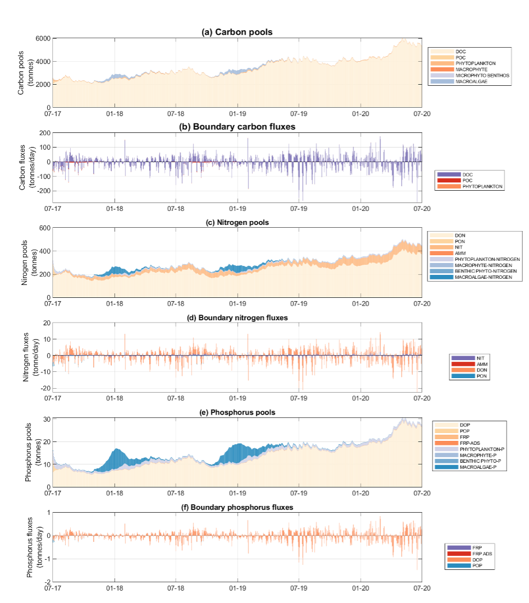

# Integrated Assessment

<br>

## Overview

The previous chapters have detailed the nature of the model setup, additions and areas of development. In this section, the model is assessed in its entirety, using the fully-coupled model, against the complete data-set. A range of metrics are used for a large number of predicted variable and different sites.

<br>

## Integrated simulations

A summary of the different simulations used through the model life cycle of model development:

<span style="color:teal">**Generation 0** model</span> : Original mesh, 2D hydrodynamics, no surface wave coupling, 5 sediment zones with statically assigned flux rates based on assumed parameters.

<span style="color:orangered">**Generation I** model</span> : Original mesh, 3D hydrodynamics, surface wave coupling, 20 sediment zones with statically assigned flux rates, updared based on observed estimates.

<span style="color:brown">**Generation I - rapid** model</span> : Coarse mesh, 2D hydrodynamics, surface wave coupling, 5 sediment zones with statically assigned flux rates based on assumed parameters.

<span style="color:darkblue">**Generation II** model</span> : Habitat optimised mesh, 3D hydrodynamics, surface wave coupling, 20 sediment zones with dynamically resolved sediment zones, and revised life-stage specific macroalgae model.

<!--
### Setup

### Simulation periods
-->

<br>

## Model assessment approach

The approach to assess the model loosely follows the [CSPS framework](https://www.sciencedirect.com/science/article/pii/S1364815219309727?via%3Dihub) of Hipsey et al (2020). The framework considers: Level 0, conceptual evaluation; Level 1, simulated state variables; Level 2, process rates; and Level 3, system-level patterns and emergent properties. Within each level a range of ways of interrogating he model are possible to demonstrate the level of performance. The specific data available for validation and the assessment metrics used are described next.  

### Summary of validation data

The field observation data available for the model validation and assessment include a diversity of historical data (collected pre 2020), and a large volume of data generated by recent monitoring and HCHB research projects. Relevant data for validation include:

- In situ water quality sensors; high frequency measurements at fixed locations.
- Water quality grab samples
- Biotic surveys
- Strategic experimental data.

All the data relevant to model calibration and validation are included in the *CDM Data Catalogue* (see Section 3.2) and detailed in Appendix A. The data spans a wide range of locations and time-periods; the most intense period of monitoring is however between 2020-2021 and this serves as our primary model assessment focus period. Long-term assessments are also undertaken for different versions of the model, as outlined next.


### Performance assessment metrics

The modelling results are compared against historical data collected within the Coorong (where available), using both traditional statistical metrics of model error, and other metrics relevant to model function. The approach is applied to each model generation with the aim to identify areas for further improvement and ongoing calibration effort. 

Initially, the model performance in predicting a range of relevant variables including salinity, temperature, nitrogen, phosphorus and total chlorophyll-a are assessed with a set of statistical metrics, and the calculations of statistical metrics was performed for each observation site where the number of field observations was >10 in the assessment period. 

The core statistical metrics considered consist of:

  +	$r$: regression coefficient, Varies between -1 and 1, with a score of 1 indicating the model varies perfectly with the observations and a negative score indicating the model varies inversely with the observations. A consistent bias may be present even when high score of r is obtained. 
  +	$BIAS$: bias of average prediction to the average observation during the assessing period. This method presents a magnitude for the discrepancy between the model results and the observational data. 
  +	$MAE$: mean absolute error: Similar to RMSE except absolute value is used. This reduces the bias towards large events. Values near zero indicate good model skill.
  +	$RMS$: root mean squared error, Measures the mean magnitude, but not direction, of the difference between model data and observations, and hence can be used to measure bias. Values near zero are desirable. This method is not affected by cancellation of negative and positive errors, but squaring the data may cause bias towards large events. 
  +	$nash$: the Nash-Sutcliffe metric (also called $NSE$ or $MEF$ is a matrix of modelling efficiency, measures the mean magnitude of the difference between model data and observations. This method compares the performance of the model to that only uses the mean of the observed data. A value of 1 would indicate a perfect model, while a value of zero indicates performance similar to simply using the mean of observed data.

<br>

\* *Other metrics used for specific areas* \*


<br>

## Validation focus period: 2020-2021

\* *Pending Gen I and II model calibration* \*


<br>

## Long-term simulation performance: 2017-2021

With the <span style="color:teal">*Generation 0* model</span> compiled boundary conditions (tide, barrages, Salt Ck inflows) and BARRA weather forcing, the performance of the model in reproducing the long-term nutrient pools has been examined.
<!--
Example model outcomes against the field observations of TN and TP are shown in Figure 10 & 11, and a summary of model performance is provided in Table 1. In summary, the model predicted well the temporal and spatial variations in TN and TP concentrations. However, the model has been shown to poorly predict the phytoplankton concentration in the South Coorong. A reason for this may be due to the current CDM being in in 2D mode which assumes the water column is fully mixed; whilst the phytoplankton samples were taken in the surface water where the phytoplankton can accumulate. The release of bioavailable nutrients is also subject to change once the sediment modelling is completed and the accuracy resolving bioavailable nutrients is still weak. A further examination of phytoplankton and nutrient data is underway, and a 3D Coorong model is under development to capture the vertical distribution of phytoplankton biomass.
-->
A summary of model performance is provided in Table 6.1. The full set of time-series validation plots against comparing the model with field observations of salinity, temperature, phytoplankton, and nitrogen/phosphorus species are included in Appendix B1. In summary, the <span style="color:teal">*Generation 0* </span> model predicted well the temporal and spatial variations in TN and TP concentrations. However, this version of the model poorly predicted the phytoplankton concentration in the South Lagoon. A reason for this may be due to the fact that this version is run in 2D mode which assumes the water column is fully mixed; whilst the phytoplankton samples were taken in the surface water where the phytoplankton can accumulate.


```{r ass-pic0, echo = FALSE, out.width='100%', class = "text-image", fig.cap = "Performance summary of CDM (Gen 0) simulating long-term TCHLA, TN and TP concentrations."}

knitr::include_graphics("tables/error.png")

```

The release of bioavailable nutrients is also subject to change once the sediment modelling is completed and the accuracy resolving bioavailable nutrients is still weak. Examination of phytoplankton and nutrient data (see CDM sensitivity assessment to internal loading in appendix B2), and implmentation of 3D dynamics is under development with the Generation I model to capture the vertical distribution of phytoplankton biomass.  

<br>

## Nutrient budget assessment

A methodology for nutrient flux and budget analysis has been developed. For the nutrient budget analysis, all of the nutrient pools (dissolved and particulate carbon, nitrogen and phosphorus, macroalgae and Ruppia) can be summarized for different regions of the estuary (north, south etc.). As an example of this method, the results from a period of three years (July 2017 to July 2020) were summarized for each region (Figure 5). Fluxes into and out of a region are shown. For the nutrient flux analysis we have developed script for calculating the salt and nutrient fluxes through selected node-string. 


```{r ass-pic1, echo = FALSE, out.width='100%', class = "text-image", fig.cap = "South Lagoon regional nutrient input/output loads for carbon, nitrogen and phosphorus for the e-water simulation July 2017 to July 2020. Negative fluxes are material leaving the region to Upper Salt Creek region. There is a high build-up of macroalgae predicted after the winter release and nutrient pulse (Gen 0 simulation)."}



```

<br>

## Habitat condition assessment

\* *Pending Gen II model calibration* \*

<br>

## Coorong Decision Making Framework

To facilitate management decision making, and comprehensive list of customised model post-processing exports has been created. The DMF exports encompass a wide range of critical CPS indicators.

<<<<<<< HEAD

These are defined in Table (Table \@ref(tab:ass-dmftable)).
=======
These are defined in Table \@ref(tab:A-dataclasses).
>>>>>>> 7da055d56ac58ee29204fb74171a3dcb74d9ec99

```{r ass-dmftable, echo=FALSE, message=FALSE, warning=FALSE}
library(knitr)
library(kableExtra)
library(readxl)
library(rmarkdown)
theSheet <- read_excel('tables/dmf.xlsx', sheet = 1)
#theSheet <- theSheet[theSheet$Table == "Data",]
theSheetGroups <- unique(theSheet$CriticalCPS)

kbl(theSheet[,3:6], caption = "Coorong Decision Making Framework", align = "l",) %>%

  pack_rows(theSheetGroups[1],
            min(which(theSheet$CriticalCPS == theSheetGroups[1])),
            max(which(theSheet$CriticalCPS == theSheetGroups[1])),
            background = '#ebebeb') %>%
  pack_rows(theSheetGroups[2],
            min(which(theSheet$CriticalCPS == theSheetGroups[2])),
            max(which(theSheet$CriticalCPS == theSheetGroups[2])),
            background = '#ebebeb') %>%
  pack_rows(theSheetGroups[3],
					  min(which(theSheet$CriticalCPS == theSheetGroups[3])),
					  max(which(theSheet$CriticalCPS == theSheetGroups[3])),
					  background = '#ebebeb') %>%
  pack_rows(theSheetGroups[4],
          	min(which(theSheet$CriticalCPS == theSheetGroups[4])),
          	max(which(theSheet$CriticalCPS == theSheetGroups[4])),
          	background = '#ebebeb') %>%
  pack_rows(theSheetGroups[5],
            min(which(theSheet$CriticalCPS == theSheetGroups[5])),
            max(which(theSheet$CriticalCPS == theSheetGroups[5])),
            background = '#ebebeb') %>%
  pack_rows(theSheetGroups[6],
            min(which(theSheet$CriticalCPS == theSheetGroups[6])),
            max(which(theSheet$CriticalCPS == theSheetGroups[6])),
            background = '#ebebeb') %>%
pack_rows(theSheetGroups[7],
            min(which(theSheet$CriticalCPS == theSheetGroups[7])),
            max(which(theSheet$CriticalCPS == theSheetGroups[7])),
            background = '#ebebeb') %>%
  pack_rows(theSheetGroups[8],
            min(which(theSheet$CriticalCPS == theSheetGroups[8])),
            max(which(theSheet$CriticalCPS == theSheetGroups[8])),
            background = '#ebebeb') %>%
   pack_rows(theSheetGroups[9],
            min(which(theSheet$CriticalCPS == theSheetGroups[9])),
            max(which(theSheet$CriticalCPS == theSheetGroups[9])),
            background = '#ebebeb') %>%
   pack_rows(theSheetGroups[10],
            min(which(theSheet$CriticalCPS == theSheetGroups[10])),
            max(which(theSheet$CriticalCPS == theSheetGroups[10])),
            background = '#ebebeb') %>%
  
row_spec(0, background = "#14759e", bold = TRUE, color = "white") %>%
  kable_styling(full_width = F,font_size = 10) %>%
  column_spec(2, width_min = "7em") %>%
  column_spec(3, width_max = "10em") %>%
  column_spec(4, width_min = "10em") %>%
 # column_spec(5, width_min = "10em") %>%
  #column_spec(6, width_min = "19em") %>%
    scroll_box(width = "700px", height = "4600px",
             fixed_thead = FALSE)
```

## Summary (Sept 2021)

The following assessments have been undertaken:

- Development of integrated CDM assessment toolbox able to:

    - Accomodate data from different sources/campaigns (see Appendix A)
    - Flexible plotting of time-series outputs at points and integrated over polygons
    - Plotting of transects
    - Map outputs integrated over selected time-windows (e.g. month or season)
    - Nutrient budget on defined polygon regions
    - Error metric assessment
    - Habitat area calculation
    
- Gen 0 calibration over the period 2013 - 2019.

    - The model accurately captures water level and salinity in both the North and South lagoon.
    - The model accurately captures TN and TP within both the North and South lagoon, based on low-frequency sampling.
    - The model captues Chl-a reasonably well in the North lagoon but underpredicts in the South lagoon.
    - Dissolved nutrients are not predicted accurately.
    - The Ruppia HSI shows reasonable performance against pre 2020 data.
    - The macroalgae biomass is poorly predicted across the length of the lagoon, but the Ulva HSI captures the spatial distribution of filamentous algae well. 

These results show the promise of the model and give direction to focus areas for development (see Chapter 4)  and calibration. Further work to undertake the integrated assessment includes:

+ Application of the assessment toolbox on Gen I and Gen II models.
+ Further nutrient budget analyses and interpretation

    
    
