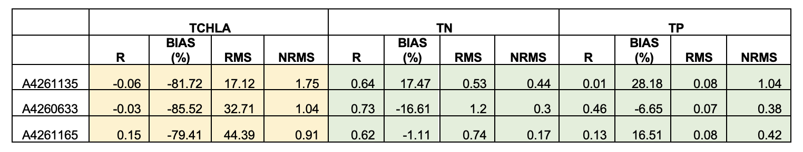

# Integrated Assessment

<br>

## Overview

The previous chapters have detailed the nature of the model setup, additions and areas of development. In this section, the model is assessed in its entirety, using the fully coupled model, against the complete dataset. The approach to assess the model loosely follows the CSPS framework of Hipsey et al (2020). The framework considers: 

- Level 0: conceptual evaluation; the conceptual diagrams for each of the water quality variables, biogeochemical reactions, and habitat modelling are based on the scientific review and data inspection as detailed in the previous chapters;
- Level 1: simulated state variables; a range of metrics is used for a large number of predicted variable and different sites.
- Level 2: process rates; and 
- Level 3: system-level patterns and emergent properties; this is evaluated by the overall nutrient budgeting analysis and nutrient cycling pathway analysis.

The specific data available for validation and the assessment metrics used are described next. The level of model uncertainty is discussed in terms of how much confidence is in the current generation of model outputs for the purposes of defining model reliability.

In addition to the model performance assessment, the model is also routinely used to support management decision-making. Detail is provided on how the diverse model outputs are processed for informing the Coorong Decision Making Framework (DMF).

<br>

## Integrated simulations

A summary of the different simulations used through the model life cycle of model development:

<span style="color:teal">**Generation 0** model</span> : Original mesh, 2D hydrodynamics, no surface wave coupling, 1 overall phytoplankton functional group, 5 sediment zones with statically assigned flux rates based on assumed parameters.

<span style="color:orangered">**Generation I** model</span> : Original mesh, 2D hydrodynamics, surface wave coupling, 1 overall phytoplankton functional group, 5 sediment zones with statically assigned flux rates, updated based on observed estimates.

<span style="color:brown">**Generation I.5** model</span> : Original mesh, 2D hydrodynamics, surface wave coupling, 4 phytoplankton functional groups, 31 sediment zones with statically assigned flux rates based on observed parameters.

<span style="color:darkblue">**Generation II** model</span> : Habitat optimised mesh, 2D/3D hydrodynamics, surface wave coupling, 4 phytoplankton functional groups, 31 sediment zones including optional simulation of dynamic, depth-resolved sediment properties, revised life-stage specific macroalgae model, and updated Ruppia habitat thresholds. Uses the 2.0.5 release AED code-base.

The results from Generation 0 model and Generation I model had been reported in previous HCHB milestone reports. In this chapter, we focus on the results from the Generation I.5 and Generation II that include the latest model development on the biogeochemistry and habitat as detailed in the previous chapters.

<br>

## Model assessment approach

### Summary of validation data-set

The field observation data available for the model validation and assessment include a diversity of historical data (collected pre 2020), and a large volume of data generated by recent monitoring and HCHB research projects. Relevant data for validation include:

- In situ water quality sensors; high frequency measurements at fixed locations.
- Water quality grab samples
- Biotic surveys
- Strategic experimental data.

All the data relevant to model calibration and validation are included in the *CDM Data Catalogue* (see Section 3.2) and detailed in Appendix A. The data spans a wide range of locations and time-periods; the most intense period of monitoring is however between 2020-2021 and this serves as our primary model assessment focus period. Long-term assessments are also undertaken for different versions of the model, as outlined next.


### Performance assessment metrics

The modelling results are compared against historical data collected within the Coorong (where available), using both traditional statistical metrics of model error, and other metrics relevant to model function. The approach is applied to each model generation with the aim to identify areas for further improvement and ongoing calibration effort. 

Initially, the model performance in predicting a range of relevant variables including salinity, temperature, nitrogen, phosphorus and total chlorophyll-a are assessed with a set of statistical metrics, and the calculations of statistical metrics was performed for each observation site where the number of field observations was >10 in the assessment period. 

The core statistical metrics considered consist of:

  +	$r$: regression coefficient, Varies between -1 and 1, with a score of 1 indicating the model varies perfectly with the observations and a negative score indicating the model varies inversely with the observations. A consistent bias may be present even when high score of r is obtained. 
  +	$BIAS$: bias of average prediction to the average observation during the assessing period. This method presents a magnitude for the discrepancy between the model results and the observational data. 
  +	$MAE$: mean absolute error: Similar to RMSE except absolute value is used. This reduces the bias towards large events. Values near zero indicate good model skill.
  +	$RMS$: root mean squared error, Measures the mean magnitude, but not direction, of the difference between model data and observations, and hence can be used to measure bias. Values near zero are desirable. This method is not affected by cancellation of negative and positive errors, but squaring the data may cause bias towards large events. 
  +	$nash$: the Nash-Sutcliffe metric (also called $NSE$ or $MEF$ is a matrix of modelling efficiency, measures the mean magnitude of the difference between model data and observations. This method compares the performance of the model to that only uses the mean of the observed data. A value of 1 would indicate a perfect model, while a value of zero indicates performance similar to simply using the mean of observed data.

<br>

## Assessment and validation periods

-	CIIP period: 2013-2019: initial assessment prior to availability of HCHB research project data;
-	Focus period: 2020-2021: initial calibrated against the intensive field sampling and observations obtained from different components of the HCHB research project;
-	Long-term performance: 2017 – 2021: calibrated against the long-term water quality data collected from the routine measurements, as well as from the HCHB research project. These results are summarised here in this Chapter.

<br>


## Integrated simulation performance


### Generation 0

With the <span style="color:teal">*Generation 0* model</span> compiled boundary conditions (tide, barrages, Salt Ck inflows) and BARRA weather forcing, the performance of the model in reproducing the long-term nutrient pools has been examined.
<!--
Example model outcomes against the field observations of TN and TP are shown in Figure 10 & 11, and a summary of model performance is provided in Table 1. In summary, the model predicted well the temporal and spatial variations in TN and TP concentrations. However, the model has been shown to poorly predict the phytoplankton concentration in the South Coorong. A reason for this may be due to the current CDM being in in 2D mode which assumes the water column is fully mixed; whilst the phytoplankton samples were taken in the surface water where the phytoplankton can accumulate. The release of bioavailable nutrients is also subject to change once the sediment modelling is completed and the accuracy resolving bioavailable nutrients is still weak. A further examination of phytoplankton and nutrient data is underway, and a 3D Coorong model is under development to capture the vertical distribution of phytoplankton biomass.
-->
A summary of model performance is provided in Table 6.1. The full set of time-series validation plots against comparing the model with field observations of salinity, temperature, phytoplankton, and nitrogen/phosphorus species are included in Appendix B1. In summary, the <span style="color:teal">*Generation 0* </span> model predicted well the temporal and spatial variations in TN and TP concentrations. However, this version of the model poorly predicted the phytoplankton concentration in the South Lagoon. A reason for this may be due to the fact that this version is run in 2D mode which assumes the water column is fully mixed; whilst the phytoplankton samples were taken in the surface water where the phytoplankton can accumulate.


```{r ass-pic0, echo = FALSE, out.width='100%', class = "text-image", fig.cap = "Performance summary of CDM (Gen 0) simulating long-term TCHLA, TN and TP concentrations."}



```

The release of bioavailable nutrients is also subject to change once the sediment modelling is completed and the accuracy resolving bioavailable nutrients is still weak. Examination of phytoplankton and nutrient data (see CDM sensitivity assessment to internal loading in appendix B2), and implmentation of 3D dynamics is under development with the Generation I model to capture the vertical distribution of phytoplankton biomass.  


### Generation I.5

With the <span style="color:brown">**Generation I.5** model</span> compiled boundary conditions (tide, barrage flows, Salt Ck inflows) and weather forcing data from Narrung, the performance of the model in reproducing the long-term nutrient pools has been examined in detail. A breif summary of model performance is provided in Table 6.1. The full set of time-series validation plots against comparing the model with field observations of salinity, temperature, phytoplankton, and nitrogen/phosphorus species are included in Appendix B1. In summary, the Generation I.5 model generally predicted well in most of the variables, including temperature, salinity, TN, TOC, DOC, ammonium and TSS. However, the results in total chlorophyll-a (TCHLA), TP, PO4 and turbidity are relatively poor. On the top of model setting reasons, some reasons for this also come from the data quality, such as:

1.	The concentration of some of the nutrient species (such as ammonium, nitrate, and phosphate) are lower than the laboratory detective limits, therefore not able to properly evaluate the performance in these species; an example of this is shown in Figure 6.1, which shows the measured nitrate concentration was consistent at 0.003 mg/L (the lowest laboratory detective level for nitrate at UA) from 07/2018 to 01/2020 in zone 42. 
2.	The field observational data were provided from different labs, where the data quality was not consistent; an example of this is shown in Figure 6.2, which shows the TP concentration varied between 0.1-0.4 mg/L before 07/2020, then raised to >5 mg/L after the data source changed to ALS from 07/2020. A similar plot for TN is provided in Figure 6.3, where the TN time series pattern also changed from 07/2020.

Given the fact that the ALS dataset largely departs from the historical data range, a new validation was performed with all existing data except the ALS dataset. A new summary of model performance is provided in Table 6.2, and the full set of time series validation plots are included in Appendix B2. It can be seen from Table 6.2 that all performance scores of CDM are significantly improved and the performance in most of the water quality prediction are satisfying.

Figure 6.1. Example of data quality issue with modelled vs. measured nitrate concentration in zone 42. Note the consistent nitrate concentration of 0.003 mg/L from 07/2018 to 01/2020 (circled in green). 

Figure 6.2. Example of data quality issue with modelled vs. measured TP concentration in zone 22. The colours of the observational data indicate their data sources.

Figure 6.3. Same as Figure 6.2 except for TN concentration in zone 22

Table 6.1. Performance summary of CDM (Gen 1.5) simulating long-term temperature, salinity, and nutrient concentrations, validated with all existing data including the laboratory data from ALS. Red indicates a poor calibration result where results should be considered with caution, yellow indicates an acceptable level of performance, and green indicates a highly accurate prediction. 


### Generation II

pending

<br>

## Nutrient budget assessment

A methodology for nutrient flux and budget analysis has been developed. For the nutrient budget analysis, all of the nutrient pools (dissolved and particulate carbon, nitrogen and phosphorus, macroalgae and Ruppia) can be summarized for different regions of the estuary (north, south etc.). As an example of this method, the results from a period of four years (01/01/2018 to 01/01/2022) were summarized for nitrogen budgeting of NCL and SCL region in Figure 6.4 and 6.5, respectively. The nutrient budgeting analysis showed that the dissolved organic matter is the major nitrogen pool in both the lagoons, while particle organic matter and the nitrogen assimilated by phytoplankton also presented to be major nutrient pools (panel “a”). The sediment diffusion release of ammonium and the nitrogen loss due to phytoplankton burial into the sediment dominate the interaction at the sediment-water interface (panel “b”), which also presented a clear seasonal pattern. The boundary exchange fluxes are dominated by the organic matters in coincident to the major pools in the water (panel “c”). The daily change flux rate varied between 0 to >20 tonne/day in the north lagoon, compared to that of between 0 to ~10 tonnes/day in the south lagoon, indicating stronger hydrodynamic transportation in the north lagoon affected by tidal intrusion and barrage flow. The results showed a net cumulative of nutrient in the sediment (panel “d”), indicating the sediment acting as a sink for the nutrients.

Summary diagrams of the nitrogen imports vs. exports for both lagoons are presented in Figure 6.6, which showed that, for the north lagoon (NCL), the nutrient loads transported though the Pelican Pt. are in comparable scales to the sediment load (56% vs. 44% of total sources), while the exports due to sedimentation/burial and transport to south lagoon though Parnka Pt are about 65% and 35% of total loss, respectively. For the south lagoon (SCL), the sediment nutrient loads was the major source (79% of total sources), and the sedimentation loss was also the major sink (92% of total sinks), indicating the internal nutrient cycling overcame the hydrodynamic transport of nutrient be to the dominant pathway of nutrient cycling.


<head>
<meta name="viewport" content="width=device-width, initial-scale=1">
<style>
/* Style the buttons inside the tab */
.tab button {
  background-color: #2481AA;
  float: left;
  width: 14.25%;
  border: none;
  outline: none;
  cursor: pointer;
  padding: 14px 16px;
  transition: 0.3s;
  font-size: 14px;
  color: #FFFFFF;
  font-weight: bold;
}
</style>
</head>
<body>

<div class="tab">
  <button class="tablinks" onclick="opentab(event, 'A4260633')"id="defaultOpen">A4260633</button>
  <button class="tablinks" onclick="opentab(event, 'A4261036')">A4261036</button>
  <button class="tablinks" onclick="opentab(event, 'A4261039')">A4261039</button>
  <button class="tablinks" onclick="opentab(event, 'A4261134')">A4261134</button>
  <button class="tablinks" onclick="opentab(event, 'A4261135')">A4261135</button>
  <button class="tablinks" onclick="opentab(event, 'A4261165')">A4261165</button>
  <button class="tablinks" onclick="opentab(event, 'A4261209')">A4261209</button>
</div>

<div id="A4260633" class="tabcontent">
  <p>
```{r ass-pic1, echo = FALSE, out.width='100%', class = "text-image", fig.cap = "South Lagoon regional nutrient input/output loads for carbon, nitrogen and phosphorus for the e-water simulation July 2017 to July 2020. Negative fluxes are material leaving the region to Upper Salt Creek region. There is a high build-up of macroalgae predicted after the winter release and nutrient pulse (Gen 0 simulation)."}


```
  </p>
</div>


<script>
function opentab(evt, tabName) {
  var i, tabcontent, tablinks;
  tabcontent = document.getElementsByClassName("tabcontent");
  for (i = 0; i < tabcontent.length; i++) {
    tabcontent[i].style.display = "none";
  }
  tablinks = document.getElementsByClassName("tablinks");
  for (i = 0; i < tablinks.length; i++) {
    tablinks[i].className = tablinks[i].className.replace(" active", "");
  }
  document.getElementById(tabName).style.display = "block";
  evt.currentTarget.className += " active";
}
document.getElementById("defaultOpen").click();
</script>

</body>


<br>


## Environmental response function (ERF) analysis

Another useful method for evaluating the model performance is the environmental response function (ERFs) that are used to predict water quality variables in estuary sub-domains in response to changes in boundary forcing, and therefore provide a simple and quick assessment of the occurrence of some target events. As an example, the environmental response of salinity, TN and TP in space and time to the management scenario of ‘all water’ (representing the base-case scenario) and ‘no-eWater’ (representing a situation when there is no environmental water) are presented in Figure 6.7. The results suggested that, under the current condition, the annual-average salinity presented an increase from north the south, and the condition stayed similar from 2017 to 2021; while if there is no environmental water contribution (the ‘no-eWater’ scenario), the salinity would had increased from about 150 PSU in 2017 to near 190 PSU in 2021. The nutrient levels showed increases from north to south, and also increased with time in both scenarios. However, if there is no environmental water contribution, the TN and TP in the south lagoon would have increased in a fast pace. In summary, the environmental water has shown to help to reduce the salinity level as well as the trophic statues of the Coorong. 

## Habitat condition assessment

The overall habitat suitablity for sexual and asexual reproduction between 2018 - 2021 have been simulated using the Gen II model (Figure \@ref(tab:HSIsexual4) and Figure \@ref(tab:HSIasexual4)). Habitat quality and suitable areas changes from year to year. In comparison, 2021 offered the least amount of suitable habitat for Ruppia to complete its sexual life cycle (flowering), which was consistent with field observations in that very few flowers were recorded in 2021 compared to 2020.

```{r HSIsexual4, echo = FALSE, out.width='100%', class = "text-image", fig.cap = "Overall Habitat Suitability Index for the successful completion of the sexual life cycle in the Coorong, for the Base Case in 2018 - 2021. An HSI of 0 (dark purple) represents unsuitable habitat conditions, while an HSI of 1 represents optimal conditions (yellow)."}

knitr::include_graphics("images/lagoon_habitat/HSI sexual 4yrs.png")
```

```{r HSIasexual4, echo = FALSE, out.width='100%', class = "text-image", fig.cap = "Overall Habitat Suitability Index for the successful completion of the asexual life cycle in the Coorong, for the Base Case in 2018 - 2021. An HSI of 0 (dark purple) represents unsuitable habitat conditions, while an HSI of 1 represents optimal conditions (yellow)."}

knitr::include_graphics("images/lagoon_habitat/HSI asexual 4yrs.png")
```

<br>

## Coorong Decision Making Framework

To facilitate management decision making, and comprehensive list of customised model post-processing exports has been created. The Decision Making Framework (DMF) exports encompass a wide range of critical CPS indicators.


These are defined in Table (Table \@ref(tab:ass-dmftable)).


```{r ass-dmftable, echo=FALSE, message=FALSE, warning=FALSE}
library(knitr)
library(kableExtra)
library(readxl)
library(rmarkdown)
theSheet <- read_excel('tables/dmf.xlsx', sheet = 1)
#theSheet <- theSheet[theSheet$Table == "Data",]
theSheetGroups <- unique(theSheet$CriticalCPS)

kbl(theSheet[,3:6], caption = "Coorong Decision Making Framework", align = "l",) %>%

  pack_rows(theSheetGroups[1],
            min(which(theSheet$CriticalCPS == theSheetGroups[1])),
            max(which(theSheet$CriticalCPS == theSheetGroups[1])),
            background = '#ebebeb') %>%
  pack_rows(theSheetGroups[2],
            min(which(theSheet$CriticalCPS == theSheetGroups[2])),
            max(which(theSheet$CriticalCPS == theSheetGroups[2])),
            background = '#ebebeb') %>%
  pack_rows(theSheetGroups[3],
					  min(which(theSheet$CriticalCPS == theSheetGroups[3])),
					  max(which(theSheet$CriticalCPS == theSheetGroups[3])),
					  background = '#ebebeb') %>%
  pack_rows(theSheetGroups[4],
          	min(which(theSheet$CriticalCPS == theSheetGroups[4])),
          	max(which(theSheet$CriticalCPS == theSheetGroups[4])),
          	background = '#ebebeb') %>%
  pack_rows(theSheetGroups[5],
            min(which(theSheet$CriticalCPS == theSheetGroups[5])),
            max(which(theSheet$CriticalCPS == theSheetGroups[5])),
            background = '#ebebeb') %>%
  pack_rows(theSheetGroups[6],
            min(which(theSheet$CriticalCPS == theSheetGroups[6])),
            max(which(theSheet$CriticalCPS == theSheetGroups[6])),
            background = '#ebebeb') %>%
pack_rows(theSheetGroups[7],
            min(which(theSheet$CriticalCPS == theSheetGroups[7])),
            max(which(theSheet$CriticalCPS == theSheetGroups[7])),
            background = '#ebebeb') %>%
  pack_rows(theSheetGroups[8],
            min(which(theSheet$CriticalCPS == theSheetGroups[8])),
            max(which(theSheet$CriticalCPS == theSheetGroups[8])),
            background = '#ebebeb') %>%
   pack_rows(theSheetGroups[9],
            min(which(theSheet$CriticalCPS == theSheetGroups[9])),
            max(which(theSheet$CriticalCPS == theSheetGroups[9])),
            background = '#ebebeb') %>%
   pack_rows(theSheetGroups[10],
            min(which(theSheet$CriticalCPS == theSheetGroups[10])),
            max(which(theSheet$CriticalCPS == theSheetGroups[10])),
            background = '#ebebeb') %>%
  
row_spec(0, background = "#14759e", bold = TRUE, color = "white") %>%
  kable_styling(full_width = F,font_size = 10) %>%
  column_spec(2, width_min = "7em") %>%
  column_spec(3, width_max = "10em") %>%
  column_spec(4, width_min = "10em") %>%
 # column_spec(5, width_min = "10em") %>%
  #column_spec(6, width_min = "19em") %>%
    scroll_box(width = "700px", height = "1000px",
             fixed_thead = FALSE)
```

<br>

Outputs are initially grouped based upon the style of calculation required.

An example of the outputs can be found  in Table (Table \@ref(tab:ass-DMFexportexample)).

```{r ass-DMFexportexample, echo=FALSE, message=FALSE, warning=FALSE}
library(knitr)
library(kableExtra)
library(readxl)
library(rmarkdown)
theSheet <- read_excel('tables/DMF_export_2.xlsx', sheet = 1)
#theSheet <- theSheet[theSheet$Table == "Data",]
theSheetGroups <- unique(theSheet$CPS)

kbl(theSheet[,2:8], caption = "Coorong Decision Making Framework", align = "l",) %>%

  pack_rows(theSheetGroups[1],
            min(which(theSheet$CPS == theSheetGroups[1])),
            max(which(theSheet$CPS == theSheetGroups[1])),
            background = '#ebebeb') %>%
  
  
row_spec(0, background = "#14759e", bold = TRUE, color = "white") %>%
  kable_styling(full_width = F,font_size = 10) #%>%
   # scroll_box(fixed_thead = FALSE)
  
```

In addition to the required DMF value, time series plots are also produced to provide context to the data analyst.

```{r ass-pic2, echo = FALSE, out.width='50%', class = "text-image", fig.cap = "Critial CPS for macroinvertabrates where Average daily area (Km2) with water cover and Salinity is < 25 g/L Apr-Sep"}


```

## Summary

A series of integrated CDM assessment toolbox has been developed that are able to:

- Accomodate data from different sources/campaigns (see Appendix A)
- Flexible plotting of time-series outputs at points and integrated over polygons
- Plotting of transects
- Map outputs integrated over selected time-windows (e.g. month or season)
- Nutrient budget on defined polygon regions
- Error metric assessment
- Habitat area calculation
    
Looking holistically at the statistic results in the long-term simulation, the CDM appeared to capture the salinity and temperature changes, and also the TN, TP and dissolved oxygen variation compared to the observational data in most regions. Reasonable predictions were obtained for other nutrient species. The Ruppia HSI shows reasonable performance against field sample data and the predicted macroalgae biomass reasonably captures the spatial distribution of filamentous algae. As is expected for these type of simulations (e.g., see Arhondistsis and Brett 2004), model performance is much better for the hydrodynamic variables (salinity and temperature) than for the nutrient and biological properties. It is particularly challenging to get high model performance scores when values have high inherent variance, and/or are near to the detection limit. This was the case for many variables assessed in this study, particularly the bioavailable nutrients, and the error metric numbers should be considered with the data quality issues in mind as discussed in chapter 9.4.2. 

Overall, the model performance is consistent in both the focus period (2020-2021) and the long-term simulation (2017-2021) when adopting the same water quality modules and model parameters, suggesting in its present form the model is suitable for assessing the management scenarios associated with water management. 
These results show the promise of the model and give direction to focus areas for development and calibration. Key challenges in model setup, calibration and use for scenario assessment appear to be:

-	Salinity calibration in the South Lagoon has remained problematic in some years
-	Resolving organic matter partitioning, and reaction rates
-	Constraining the sediment flux rates of nutrients, considering spatial variability
-	Chlorophyll-a biomass
-	Macroalgal biomass and timing

Looking at these key challenges, some areas for CDM improvement in the next phase modelling development are summarised in Table 6.3.


    
    
