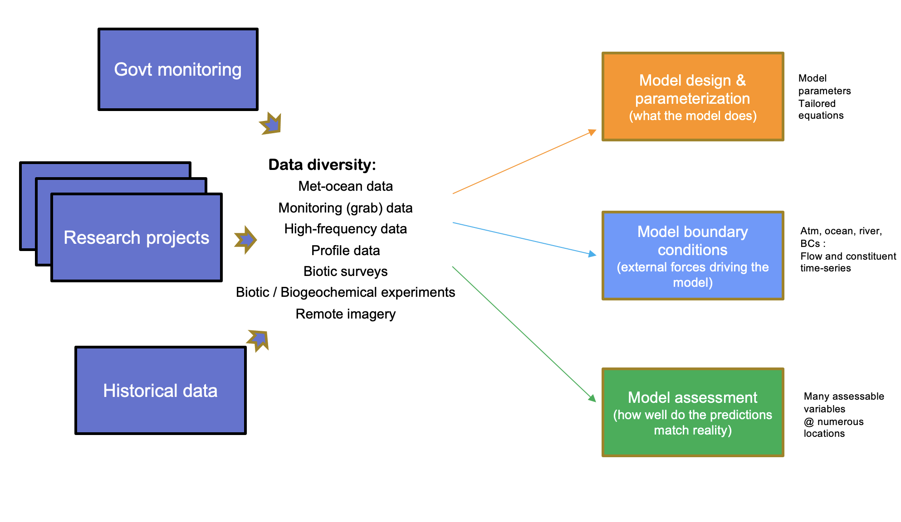
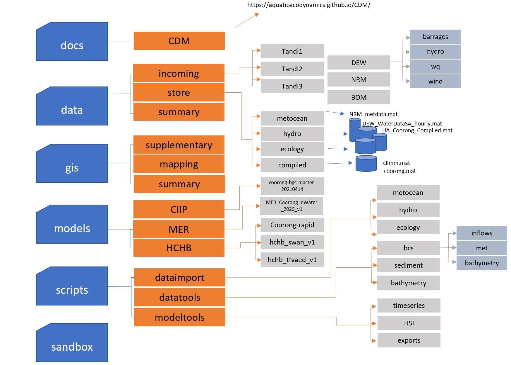
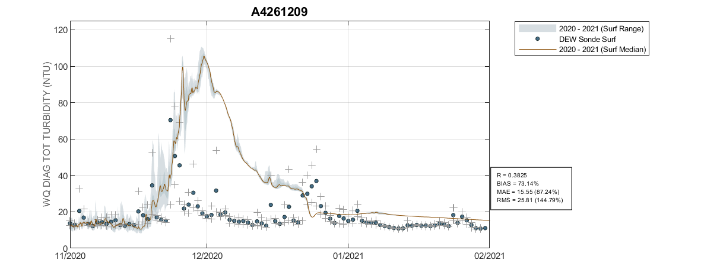
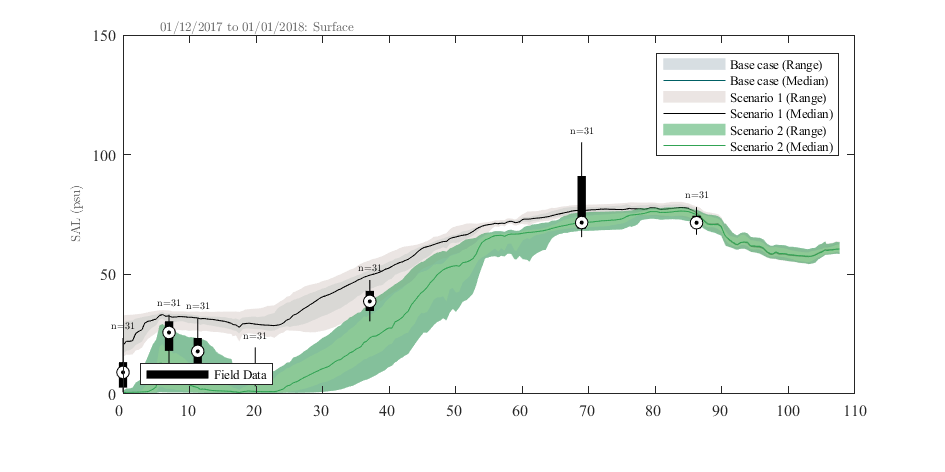

# Model-Data Ecosystem

<br>

The data requirements for the modelling are diverse and varied, spanning hydrological, meteorological, water and sediment quality (long-term monitoring, data from intensive campaigns and in situ sondes), plus ecological survey data. This creates an integration challenge for model setup, parameterisation and assessment (calibration and validation) (Figure \@ref(fig:cdm-pic5). 


```{r cdm-pic5, echo = FALSE, out.width='100%', class = "text-image",fig.align='center', fig.cap = "The Coorong model-data ecosystem and conceptual approach to model-data integration, accomodating data diversity and varied model requirements."}


```

To enable the ongoing use and development of the CDM in this context, we have developed a **model-data integration framework** able to be used by DEW staff and project partners to co-ordinate the reference datasets needed for model development, and standardise the data integration and modelling workflows. The below sections describe how the CDM is organised, the tools and approaches used for model provenance and managing data streams, and model versioning.

<br>

## CDM structure and organisation

The CDM has been designed is such a way to both facilitate the sharing of data and models across various agencies and researchers, as well as providing a formalised structure to store, catalogue and process complex and unique datasets. Comparmentalised data structures have been implemented to allow for tracking and version control of data and models as they are utilised and upgraded throughout the project.

Data cataloguing via the "CDM Data Catalogue" (described in Section 3.4) has been designed with cross-agency usage in mind. Integration with the HCHB MEK Catalogue is essential to allow for the tracking of data changes and upgrades throughout the project. The "Point of Truth", "MEK Catalogue Classification" and "Status Notes" catagories have been included in the CDM Data Catalogue to track a dataset's evolution throughout the project.

Github has been chosen to house the repository based on it's mature version control systems and cross platform program support to aid all stakeholders accessing the data and models (https://github.com/). In addition, there is a [wide variety of documentation online](https://guides.github.com/activities/hello-world/) to assist users new to GitHub. 


###	**Online repository access**

The data and model files are stored in the Github [CDM Repository](https://github.com/AquaticEcoDynamics/CDM) and shared with HCHB research partners.


###	**Repository folder structure**

The folders structure follows the logic of data types and resources as shown in Figure 2.7. 

```{r cdm-pic7, echo = FALSE, out.width='100%', class = "text-image",fig.align='center', fig.cap = "CDM online data storage folder structure"}



```

The root directories are listed and described below: 

```{r A-folders, echo=FALSE, message=FALSE, warning=FALSE}
library(knitr)
library(kableExtra)
library(readxl)
library(rmarkdown)
theSheet <- read_excel('tables/folders.xlsx', sheet = 1)
theSheet <- theSheet[theSheet$Table == "data",]
theSheetGroups <- unique(theSheet$Group)

kbl(theSheet[,2:3], caption = "CDM Root Folder Descriptions", align = "l",) %>%

row_spec(0, background = "#14759e", bold = TRUE, color = "white") %>%
  kable_styling(full_width = T,font_size = 10) %>%
    scroll_box(fixed_thead = FALSE)
```

###	**High level workflows** ###

The raw data collected from previous works and current HCHB component outcomes are stored in the ```data/incoming``` folder and classified by their sources. These raw data are then post-processed using standard scripts (stored in the ```scripts``` folder) to convert the raw data into ‘standard’ data format (stored in the ```data/store``` folder) for model configuration, calibration/validation, and reporting (see 2.4.2 Data organisation for more details). The data-model workflow is shown in Figure 2.9. 

```{r cdm-pic8, echo = FALSE, out.width='100%', class = "text-image",fig.align='center', fig.cap = "CDM conceptual diagram showing the flow of data through the system"}

knitr::include_graphics("images/cdm/2.4.1_Workflow.png")

```

<br>

## Data repository and management

### **Data catalogue**

All data that is uploaded to the CDM github repository is logged in the CDM Data Catalogue. The catalogue (found in the data directory) is comprised of a main data sheet ("CDM Data Catalogue") as well as summary sheets for all processed data. Every raw datafile is logged with the following information:

```{r A-metadata, echo=FALSE, message=FALSE, warning=FALSE}
library(knitr)
library(kableExtra)
library(readxl)
library(rmarkdown)
theSheet <- read_excel('tables/CDM_Classes.xlsx', sheet = 1)
theSheet <- theSheet[theSheet$Table == "Data",]
theSheetGroups <- unique(theSheet$Group)

kbl(theSheet[,3:4], caption = "CDM Catalogue Metadata", align = "l",) %>%

row_spec(0, background = "#14759e", bold = TRUE, color = "white") %>%
  kable_styling(full_width = T,font_size = 10) %>%
    scroll_box(fixed_thead = FALSE)
```
<br>

A catalogue of all data under management of the CDM is provided in [Appendix A](Appendix A : Data Catalogue).


### **Data organisation**

All raw data is initially uploaded into the ```data/incoming``` directory is filed under either it's Trials and Investigations (T&I) component, or the agency responsible for supplying the data.

Data is then imported into a common format via the scripts found in the ```scripts/dataimport``` directory and stored in the ```data/store``` directory. Although some imported data may contain extra fields, all imported data contains the following fields:

```{r CDM-datastore, echo=FALSE, message=FALSE, warning=FALSE}
library(knitr)
library(kableExtra)
library(readxl)
library(rmarkdown)
theSheet <- read_excel('tables/data_store_info.xlsx', sheet = 1)
theSheet <- theSheet[theSheet$Table == "Data",]
theSheetGroups <- unique(theSheet$Group)

kbl(theSheet[,3:4], caption = "CDM Stored Data", align = "l",) %>%
  pack_rows(theSheetGroups[1],
            min(which(theSheet$Group == theSheetGroups[1])),
            max(which(theSheet$Group == theSheetGroups[1])),
            background = '#ebebeb') %>%
  pack_rows(theSheetGroups[2],
            min(which(theSheet$Group == theSheetGroups[2])),
            max(which(theSheet$Group == theSheetGroups[2])),
            background = '#ebebeb') %>%
row_spec(0, background = "#14759e", bold = TRUE, color = "white") %>%
  kable_styling(full_width = T,font_size = 11) %>%
  scroll_box(fixed_thead = FALSE)
```
<br>

Once imported, the data is then summerised via a script in the ```scripts/dataimport/summary``` directory to create a standard set of plots and summary tables that can be found in the ```data/summary``` directory. ESRI shapefiles are also automatically produced and saved into the ```gis/summary``` directory to be used to create a stardarised site map of the data's sampling locations.

```{r cdm-pic10, echo = FALSE, out.width='100%', class = "text-image",fig.align='center', fig.cap = "Example GIS Map showing the sampling locations for the Water Data SA online data "}

knitr::include_graphics("images/cdm/DEW WaterDataSA Locations.png")
```

### **Data processing workflows**

The data processing scripts for the CDM are all contained within the ```scripts/``` directory, which has three subfodlers:

  + `dataimport`: All scripts that import data into the CDM, or process data into a common format
  + `datatools`: All scripts that use processed data to create additional datasets or model input files
  + `modeltools`: All scripts that use processed data and model output to create additional datasets, model validation images and analysis

Scripting has been predominately carried out utilising the [Matlab](https://au.mathworks.com/?s_tid=gn_logo) programming language, however there are scripts within the ```scripts``` directory using both [R](https://www.r-project.org/about.html) and [Python](https://www.python.org/). Users are able to add scripts in their preferred language; the repository core scripts for data storage and model plotting are currently in Matlab.
  
Below is an example workflow outlining how a meteorological boundary condition file for the TUFLOW-FV model is created (Figure \@ref(fig:cdm-pic9). Data is first downloaded and processed by scripts in the ```dataimport``` directory. A series of Matlab functions found in the ```datatools``` directory then read in the processed data (archived in the ```data/store``` directory) and use it to create the meteorological boundary condition file for the model. Both Matlab and R scripts were used in this example.


```{r cdm-pic9, echo = FALSE, out.width='100%', class = "text-image",fig.align='center', fig.cap = "CDM work flow diagram for met data"}

knitr::include_graphics("images/cdm/2.4.1_Met_Workflow.png")

```

<br>

## Model repository and management


### **Model catalogue**

All model files are stored in the `models` folder. As the model is developed over time, the model files are classified with project names and model generation identifiers. The ‘MER’ folder contains the model files used for assessing ‘eWater’ within the MER program; the ‘CIIP’ folder contains the model files developed for assessing CIIP scenarios, and the ‘HCHB’ folder contains the the core CDM files being updated throughout the HCHB project. 

Models within each project directory are separated via both *generation* and model *type*. Within the HCHB model folder there are currently 3 distinct models:

+ `hchb_swan_v1`
+ `hchb_tfvaed_v1`
+ `coorong-rapid`

The ```hchb_swan_v1``` is the first generation of the Coorong SWAN Wave model that has been developed (see Section 3.2). 

The ```coorong-rapid``` simulation folder and the ```hchb_tfvaed_v1``` simulation folder both contain TUFLOW-FV - AED simulations, but are kept separate as they constitute different generations, using different grids, simulation periods and BC files.

Each model folder may contain multiple simulation sets, but they will all rely on the same model base configuration, with minor differences or adujstments. Major changes to a model's configuration will constitute a change in generation numeber and these are stored in a separate folder. Note, models uploaded to the CDM repository may have been created by different agencies and researchers and should maintain a consistent naming convention.


### **TUFLOW-FV model organisation**

Each version of TUFLOW-FV models in the *CIIP* and *HCHB* sub-folders are organised with the following structure:

  + `Bc_dbase` (or `BCs`): boundary condition files, including tide and inflow boundary files; meteorological boundary files, and initial condition files;
  + `External`: AED model files linked with the TUFLOW-FV, and optionally the ‘GOTM’ vertical mixing model if the CDM is in 3D mode;
  + `Model`: TUFLOW-FV model structure files, including geometry and mesh files, and GIS files controlling the nodestrings and material zones;
  + `Run`: model control/configuration files;

The TUFLOW-FV model found in the MER project folder was created prior to the above structure being implemented and contains the following folder structure:

  + `BCs`: boundary condition files, including tide and inflow boundary files; meteorological boundary files, and initial condition files;
  + `External`: AED model files linked with the TUFLOW-FV, and optionally the ‘GOTM’ vertical mixing model if the CDM is in 3D mode;
  + `GEO`: TUFLOW-FV model structure files, including geometry and mesh files, and GIS files controlling the nodestrings and material zones;
  + `INPUT`: model control/configuration files;
  + `Plotting` : Directory to store model output images;
    

### **SWAN Wave Model organisation**

The SWAN Wave models found in the HCHB model directory have the following format:

  + `01_geometry` : Contains the bathymetry input files as well as a automatically generated image of the bathymetry and a matlab .mat file containing the bathymetry information;
  + `02_bc_dbase` : Contains the processed wind input files
  + `03_simulation` : Contains the INPUT control file required to run the simulation
  + `04_results` : Model output directory
  
The script required to create and configure a new SWAN wave model can be found in the ```scripts/datatools/wave``` directory.


### **Model processing toolbox**

The processing of any model output is predominately written and run in Matlab. Scripts that have been specifically developed for this project are contained within the ```scripts/modeltools``` directory. Scripts that have created Figures 3.9, 3.11 and 5.2 (among others) can be found here. 

Plotting and model processing types include:

  + Time-series plotting;
  + Transect plotting;
  + Model animation creation;
  + Error assessment;
  + Wave model plotting;
  + Habitat mapping (e.g., Ruppia & Fish HSI processing and mapping)
  + Scenario comparison and "DelMap" plotting;
  + Nutrient budget assessments.

In particular, the publicly available GitHub repository called [`aed_matlab_modeltools`](https://github.com/AquaticEcoDynamics/aed_matlab_modeltools) is used and contains a wide variety of matlab scripts and functions that are frequently used to process and visualise model output. `plottfv_polygon` and `plottfv_transect` are the main functions that are frequently used. Tables 7.3 and 7.6 in Appendix B are examples of output generated via the `plottfv_polygon` function found in the `aed_matlab_modeltools` repository. This plotting function uses data and gis files stored in the CDM repository, in addition to model output to create timeseries plots of the model (averaged within a polygon region) compared against field data. The plotting function will also automatically calculate a range of error statistics based on model output and field measured data.

```{r cdm-plottfvpolygon, echo = FALSE, out.width='100%', class = "text-image",fig.align='center', fig.cap = "Example output from plottfv_polygon with error matrix"}



```

`plottfv_transect` can also be found in the `aed_matlab_modeltools` repository. This plots model data extracted along a transect line during a specified plotting period, and compares against the range of field data found within that period.

```{r cdm-plottfvtransect, echo = FALSE, out.width='100%', class = "text-image",fig.align='center', fig.cap = "Example output from plottfv_transect with distance from Goolwa Barrage (km) along the x-axis"}



```

The `aed_matlab_modeltools` also houses scripts and functions for:

  + Curtain plotting;
  + Mesh manipulation tools;
  + Data exports;
  + Sheet plotting and animation tools;

Information on how to clone a publicly available GitHub repository can be found [here](https://docs.github.com/en/github/creating-cloning-and-archiving-repositories/cloning-a-repository-from-github/cloning-a-repository).


