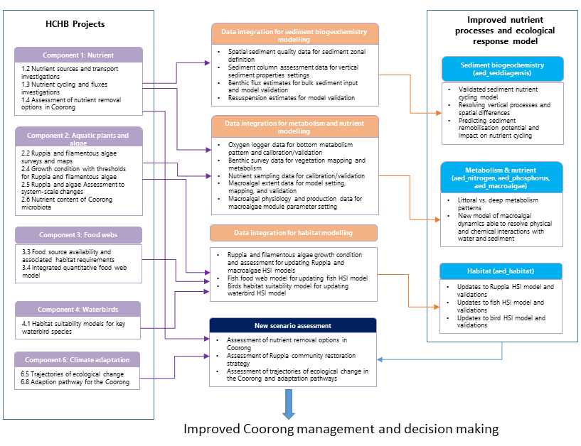

# Introduction

## Background and significance of the Coorong

### Importance of the Coorong

The Coorong has been recognised as a unique ecosystem that is essential to the overall health of the Murray–Darling Basin, and is recognised globally by its Ramsar-listing. The key functions of the Coorong include supporting a wide range of wild life as well as the local culture and economy. In recognition of the importance of the Ramsar-listed Coorong as well as the declining condition of the Coorong South Lagoon, the Commonwealth and South Australian Governments jointly funded the HCHB program to support the long-term health of the Coorong.

### Ecological Character of the Coorong

The Coorong is a shallow and narrow saline to hypersaline lagoon, which runs north-west to south-east, parallel to the South Australian coast for ~110 km and separated from the sea by a sand barrier (Figure \@ref(fig:intro-pic1)). It has a constricted channel connection to the sea towards its north-western end, referred to as the Murray Mouth. The Mouth allows exchange with sea water into the main body of the Coorong. River Murray water also enters into Lake Alexandrina and is regulated to flow, under suitable conditions, out to the Murray Mouth-Coorong region via five barrage structures (Tauwitchere, Mundoo, Ewe Island, Boundary Creek and Goolwa).

The Coorong naturally splits about halfway into the North and South Lagoons at a narrow constriction (Hell's Gate and Parnka Channel) with width down to approximately 100 m. The average widths of the North and South Lagoons are 1.5 km and 2.5 km respectively, and the average depths are 1.2 m and 1.4 m respectively (Gibbs et al. 2018). The South Lagoon receives inputs of fresh to brackish water from a network of drains from the South-East region of South Australia, discharging at Salt Creek. This discharge can be regulated via structures in Morella Basin (immediately upstream from Salt Creek), and further up the drainage network. Groundwater discharge zones exist along the length of the Coorong, from both perched freshwater lenses and the regional unconfined aquifer, but hydraulic gradients are relatively low (Barnett 2018).

The Coorong system is an important habitat for waterbirds, supporting more than 1% of the global populations of nine waterbird taxa (Paton et al., 2009). The region is recognised as a Wetland of International Importance under the Ramsar Convention. Furthermore, the Lower Lakes and Coorong are an important refuge for waterbirds, hosting up to 90% of waterbirds counted at icon sites in the Murray-Darling Basin during drought (Kingsford and Porter, 2008). However, like other Australian estuaries and coastal wetlands (Kingsford, 2000), the Coorong is increasingly threatened and its ecological health has been eroded by river regulation and over extraction of water. Waterbird populations have declined by at least 30% since 1985 (Paton et al., 2009) and low flows have led to decreased fish abundance (Brookes et al., 2015). Freshwater flows to the Murray Mouth and Coorong help maintain an open Murray Mouth, maintain connectivity for diadromous fish and modify water level and salinity in the Coorong, which shapes the habitat for biota. Freshwater flows are important in maintaining estuarine habitat and ecosystem health and preventing extreme hyper-salinity (Brookes et al. 2009), which are influenced by flows through the barrages. Salinity has been identified as a key driver of fish distribution and assemblage structure by influencing the extent of estuarine fish habitat in the Coorong (Ye et al. 2011; 2016a; Bice et al. 2018; Brookes et al., 2021). Early summer flows are likely to be particularly beneficial as they delay the drop in water level in the South Lagoon and can prevent extreme salinities emerging, thereby improving habitat conditions for key fish species.

```{r intro-pic1, echo = FALSE, out.width='80%', class = "text-image",fig.align='center', fig.cap = "The Lower Lakes and Coorong. The freshwater in the lakes is isolated from the marine water by five barrages. Exchange with the ocean occurs through the Murray Mouth, which is located near Goolwa. The Coorong is comprised of the North and South lagoons. Source: ..."}

knitr::include_graphics("images/intro/1_picture1.png")

```

### Management challenges

The major management challenge of the Coorong is the long-term decline in its ecological condition due to reductions in inflows and restricted exchange with ocean. Whilst there has been recovery of some elements of the Coorong ecosystem associated with increased inflows since the Millennium Drought, the South Lagoon has not recovered to the levels expected. There has been a switch of the ecosystem from being dominated by aquatic plants to algae associated with eutrophication (nutrient enrichment), with subsequent impacts on invertebrates, fish and waterbirds. These changes in the ecosystem and the lack of recovery is likely caused by a number of complex, interacting factors, which are not well understood. This is limiting the capacity to forecast the ecological response to future management scenarios and therefore the capacity of water managers to identify management interventions required to improve the health of the Coorong.

## Need for an integrated model to support Coorong management

The use of water quality models in the management of coastal water has been well recognised. In the past years, the development of mathematical modelling has been rapid (Stolarska & Skrzypski, 2012) and many models have been utilized to date for coastal management. The development and application of water quality models can support decision making by identifying nutrient reduction targets (Kim et al., 2014; Waltham et al., 2014), controls on harmful algal blooms (Chung et al., 2014; Robson and Hamilton, 2004), public health risks (Hipsey et al., 2008), and the quality of aquatic habitat (Brown et al., 2013).

For the Coorong, the ongoing challenges of managing the degrading water quality and habitats in a drying climate, alongside other management objectives, have led to the following priority areas where model tools are needed to support management:

-	Whole estuary water balance and nutrient budgets
-	Nutrient paths and dynamics
-	Re-construction of historical changes in habitat changes
-	Assessment of scenarios related to management options and climate change

### Prior modelling

Various modelling tools have previously been developed to assist in management of the Coorong, such as the 1D Coorong Hydrodynamic Model (CHM). Additionally, an early version of the CDM was developed over the period 2018-2019. The model TUFLOW-FV was used to simulate the hydrodynamics, and this was coupled with the ecological model AED2 for simulation of nutrients, algae and habitat. TUFLOW-FV hydrodynamics has been validated for the system separately by BMT WBM (2017) and Collier et al. (2017). The model simulations run by Collier et al. (2017) also simulated turbidity (including particle resuspension and sediment redistribution), inorganic and organic nutrients, chlorophyll a (chl-a), and filamentous algae (Ulva); the validation of these components occurred by comparing model outputs against observed data for the period from 2014-2016 at multiple locations within the domain. These years were chosen based on recent data availability for validation (Mosley et al. 2017; Frahn and Gehrig, 2015), and also spanned a range of conditions including water levels that experienced a sharp decline resulting in poor Ruppia habitat, which a weir could be expected to improve. Most recently, the CDM was applied in the Coorong Infrastructure Investigations Project (CIIP) for modelling investigations of hydrodynamics, biogeochemistry, and habitat changes to a range of infrastructure options.

A list of the prior modelling work in the Coorong:

-	BMT WBM. 2017. Coorong Options Assessment. Brisbane: BMT WBM Pty Ltd
-	Collier C., van Dijk K-J, Erftemeijer P., Foster N., Hipsey M., O’Loughlin E., Ticli K. and Waycott M. 2017. Optimising Coorong Ruppia habitat: Analysis of management strategies to improve habitat conditions for Ruppia tuberosa in the Coorong (South Australia) based on literature review, manipulative experiments and predictive modelling. Report under review.
-	Mosley L.M., Hamilton B., Busch B., Hipsey M., and Taylor B. (2017). Assessment and modelling of the effects of the 2013-2016 Morella Basin releases on Coorong water quality. Report to the Department of Environment, Water and Natural Resources (DEWNR). University of Adelaide, South Australia.
-	Hipsey, M.R., Busch, B.D., Aldridge, K.T., 2017. Coorong Investigations Project: Ruppia habitat changes in response to augmented South East Flows scenarios and a regulating structure. AED Report #R39, The University of Western Australia, Perth, Australia. 72pp.
-	Teakle, I., et al. (2021). Coorong Infrastructure Investigations Project: Hydrodynamic, Biogeochemical and Habitat Modelling Study. Brisbane: BMT WBM Pty Ltd.
-	Hipsey MR, Busch BD and Aldridge KT (2017) Coorong Investigations Project: Ruppia habitat changes in response to augmented South East Flows scenarios and a regulating structure. AED Report #R39, The University of Western Australia, Perth, Australia. 72pp.


### Knowledge gaps and development needs

Previous studies on the Coorong have laid the foundations for the development of CDM, built on model software tools able to simulate hydrodynamics, water quality and ecological habitat conditions. Whilst these previous modelling efforts have assisted decision-making, the patchy data and restricted scope of previous modelling has left uncertainty as to their suitability in capturing nutrient and sediment budgets, and in particular, the responses of algae and *Ruppia tuberosa*.

Key knowledge gaps identified from the prior modelling work include:

-	nutrient loads from sediment vs recycling, and links to Ulva accumulation;
-	the role of wave-induced resuspension on turbidity and nutrient cycling;
-	spatial extent of both Ulva and Ruppia to provide a higher level of confidence to validate model predictions;
-	eco-physiological response of different Ruppia life stages to environmental conditions. In particular, a range of studies on adult plant growth have been undertaken but the present results indicated that the seed and flowering phases, where less information is available, are the most sensitive life stages.

With the development of the HCHB research program, many of these key knowledge and data gaps have been (or are being) addressed and able to inform improved model approaches. The findings and research outputs range across a range of scales and disciplines and there is therefore a complex integration process to ensure the new knowledge is matched by the model capability and accuracy.


## Modelling development rationale

### Known gaps and model limitations

A significant component of the work tasks are allocated to customise and develop key modules of the AED platform to incorporate the specific science requirements of the model so it is compatible with the findings and details reported in the T&I research projects. These are identified in the specification as:

- Need to improve and validate hydrodynamic-biogeochemical-habitat models, including updating the Ruppia Habitat Suitability Model, to provide increased certainty in the forecasted responses to various management interventions, this includes improving and updating model representation of the following:
    - external and internal nutrient loads based on outputs from ‘Understanding Coorong nutrient dynamics' (T&I activity 1.2)
    - sediment loads, nutrient fluxes and cycling based on environmental data collected and outputs from ‘Understanding Coorong nutrient dynamics’ (T&I activity 1.3)
    - Ruppia habitat suitability model and filamentous algae preference model (within AED) based on environmental data collected and outputs from ‘Investigating the drivers and controls of filamentous algae and restoration of aquatic plants’ in the Coorong (T&I activities 2.4 and 2.5)
- Extended habitat models to incorporate the quantitative models developed through the food web and waterbird components, including:
    - Linking the quantitative food web models developed as part of ‘Restoring a functioning Coorong food web’ (T&I activity 3.4) to the existing TUFLOW FV – AED model framework to enable additional outcomes to be evaluated
    - Linking the habitat suitability models for priority waterbird species developed as part of ‘Maintaining viable waterbird populations’ (T&I activities 4.1 and 4.3) to the existing TUFLOW FV – AED2 model framework to enable additional outcomes to be evaluated


### Development focus and integration with HCHB research and monitoring

The staged development and assessment approach to the above model components and how they are linked with related T&I components are summarised in Figure  \@ref(fig:dev-pic0) (the data-model integration strategy diagram) and outlined in the below sections.

```{r dev-pic0, echo = FALSE, out.width='100%', class = "text-image", fig.cap = "Data and model integration strategy, showing links between the HCHB Goyder T&I research program and the model development priorities."}



```

## Scope of this document

The existing platforms will be further developed to expand both the hydrodynamic and biogeochemical capabilities in accordance with the specification. The scope of the project tasks are summarised as per the requirement:

-	Coupling of the TUFLOW-FV hydrodynamic model with AED biogeochemical and habitat models, as required to support HCHB science and management goals.
-	Development of improved model representation of:
    -	external and internal nutrient loads
    - sediment loads, nutrient fluxes and recycling
    -	Ruppia habitat suitability
-	Linking the ecological model approaches to the above model framework, including:
    -	waterbird habitat suitability
    -	supporting food web modelling (incl. fish)
-	Testing, validation and scenarios using the improved and integrated models and framework.


<br>

***	
