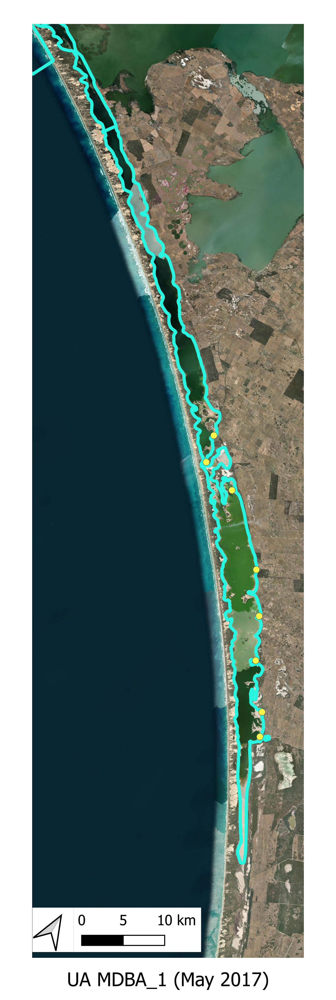
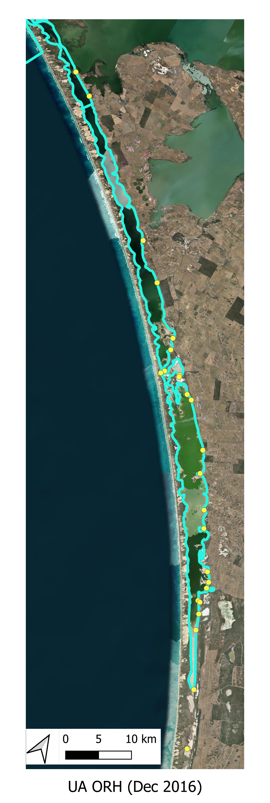
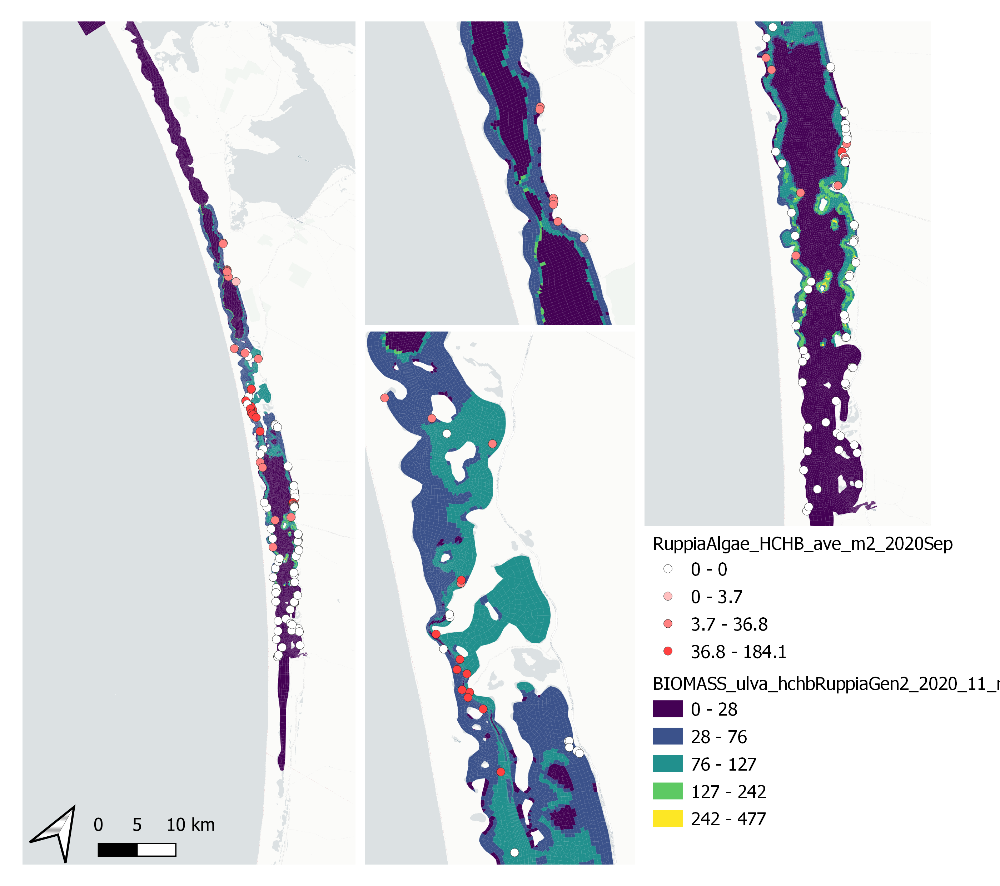
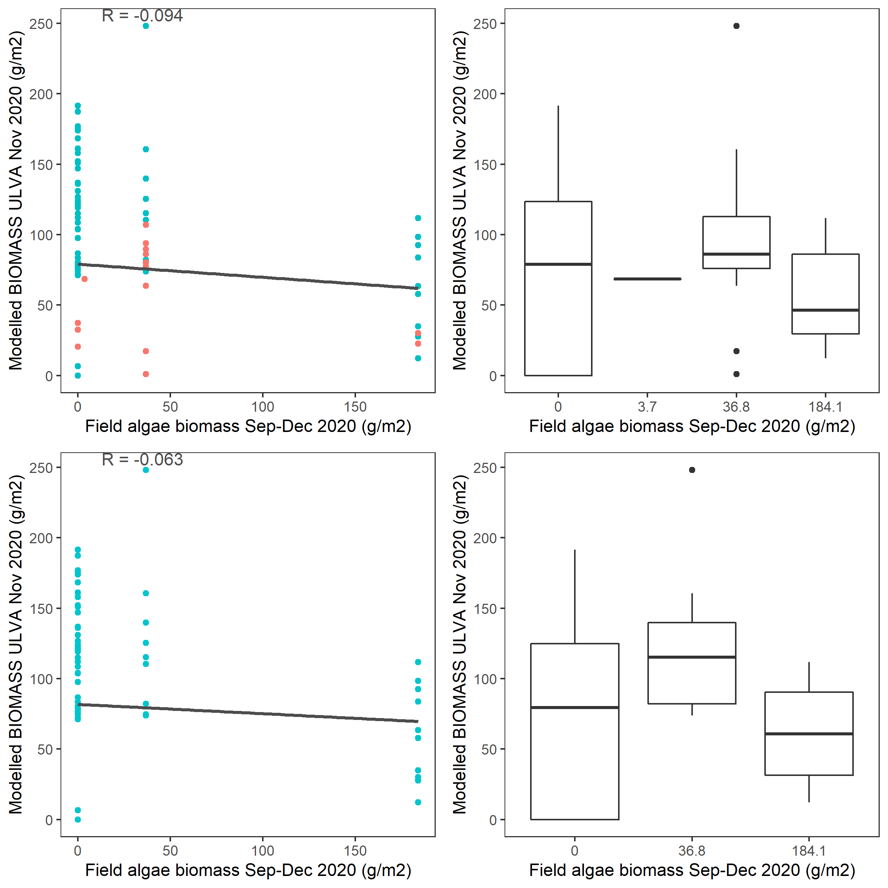
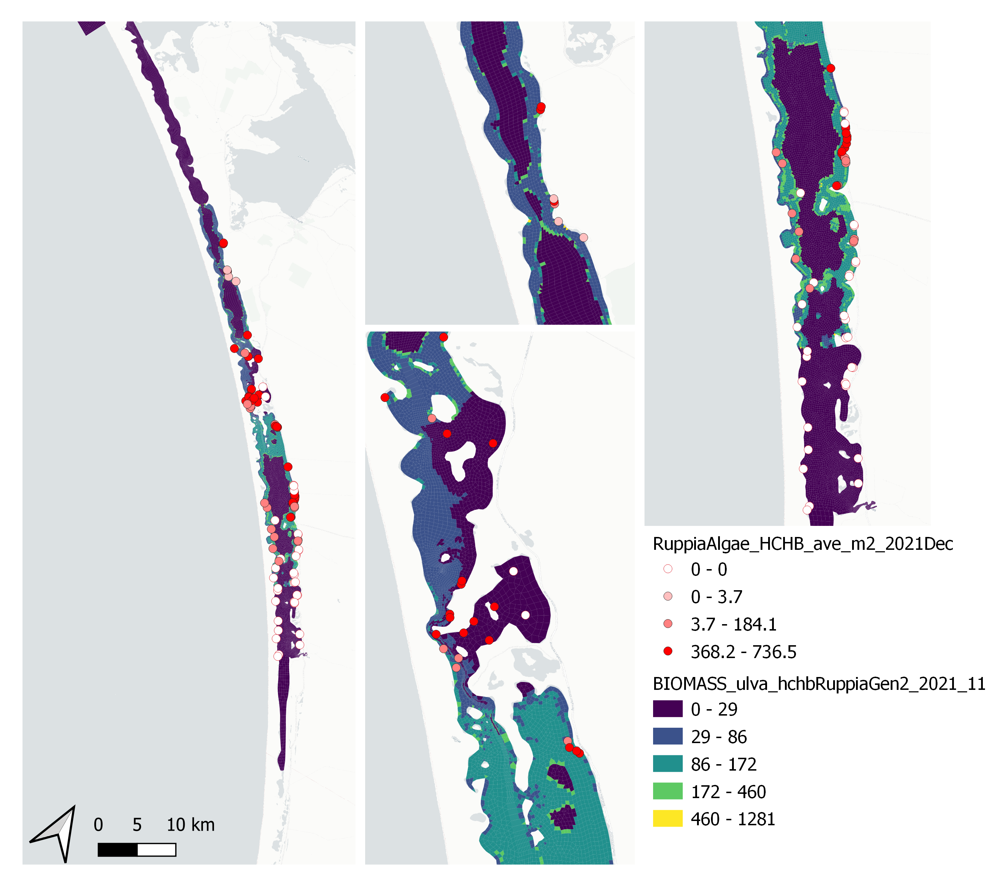
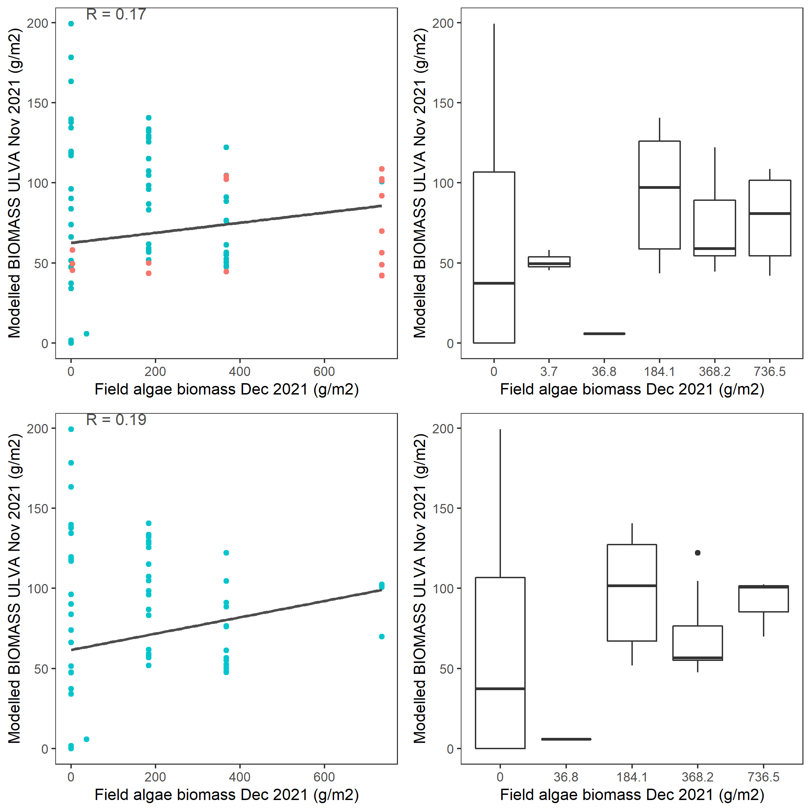

# Macroalgae
<br>

## Overview

Recent surveys in the Coorong have highlighted the challenge to ecosystem health due to the high biomass and wide extent of filamentous algae, and these 'blooms' have become emblematic of the recent cycle of eutrophication experienced in the lagoon (Figure \@ref(fig:dev-ulva01)). The survey data highlight that the filamentous algae, mainly species from the genus *Ulva*, are tightly associated with the locations where the seagrass *Ruppia* is present, and they flourish in areas with shallow, warm and poorly-mixed water. Late in the season the smothering and deoxygenation caused by the breakdown of large *Ulva* biomass accumulations drives poor water quality. This section describes the approach to simulating macroalgae within the CDM, and development of the model to tailor to the observed data collected within the HCHB research program.   

```{r dev-ulva01, echo = FALSE, out.width='40%', class = "text-image",fig.show='hold',fig.align='center', fig.cap = "Images of filamentous algae bloom conditions within the Coorong South Lagoon, showing the pervasive extent of biomass accumulation. Photo credit: David Paton."}

knitr::include_graphics(c("images/dev/paton1.jpeg","images/dev/paton2.jpeg"))

```

<br>

## Model approach

Within the Coorong, the AED model has previously been set up to predict inorganic and organic nutrients, and chlorophyll-a. Whilst nutrients are not directly required for the *Ruppia* model assessment, the presence of filamentous algal blooms can compete for light and these are linked to bioavailable nutrients within the water column (in addition to other attributes).

### Filamentous algae

We include a filamentous algae variable, $FA$, in the model that is customized to reflect the Ulva community that was been extensively described. For this case we assumed it to be attached to benthic substrate, and is therefore is not subject to advection and mixing, but can slough off under high stress conditions and become a floating variable subject to transport. Evidence from the field suggest the abundance of filaments are tightly linked to the Ruppia shoots, which the algae use to anchor too.

In general, the balance equation describes how the biomass changes over time, according to:

$$
\frac{d\left(FA\right)}{dt}=+f_{\text{uptake}}^{FA}-f_{\text{excr}}^{FA}-f_{\text{mort}}^{FA}-f_{\text{resp}}^{FA}\ -f_{\text{slough}}^{FA}
(\#eq:ulva5)
$$
where the main growth term is resolved as:

$$
\scriptsize{f^{FA}_{\text{uptake}} = \underbrace{R^{FA}_{\text{growth}}}_{\text{max growth} \\ \text{rate at 20$^\circ$C}} \ \ \underbrace{(1-k^{FA}_{\text{pr}})}_{\text{photorespiratory} \\ \text{loss}} \ \ \underbrace{\Phi^{FA}_{\text{tem}}(T)}_{\text{temperature} \\ \text{scaling}} \text{min} \left \{\underbrace{\Phi^{FA}_{\text{light}}(I)}_{\text{light limitation}}, \underbrace{\Phi^{FA}_{\text{N}}(NO_{3},NH_{4})}_{\text{light limitation}}, \underbrace{\Phi^{FA}_{\text{P}}(PO_{4})}_{\text{P limitation}} \right \} [FA]}
(\#eq:ulva6)
$$

An example of the above approach in practice is shown in the below animation. The results highlight, for this time period of interest, the areas where salinity exceeds the threshold and initially limits the productivity, and the shallow areas where light is abundant; along with other environmental drivers (e.g., temperature) these shape the biomass accumulation pattern seen in the top left panel. Animations like this for different periods throughout the year, or between years, can look quite different.

<br>
<center>
<video width="100%" height="100%" controls>
<source src="images/dev/MA2_JAN.mp4" type="video/mp4">
</video>
</center>
<br>


### Macroalgae growth physiology

The original AED macroalgal biomass model previously applied in the Generation 0 and 1 CDM applications, and exemplified in the above example, has been further developed to include includes numerous advances to light extinction within the canopy, nutrient cycling and excretion processes, and updates to the parameterisations associated with photosynthesis and biomass accumulation. The latter, in particular, are updated to better align with the experimental work reported in Waycott et al. (2019) and recent survey data collected as part of from the HCHB research program.

### Resolving seasonal life-stage dynamics

Following review of the initial data and findings from the T&I project 2, the approach to modelling macroalgae has been revised to better resolve seasonal shifts in form and physiology over the seasonal cycle.

A new ‘colony’ based model for simulating clump emergence, biomass accumulation and sloughing has been conceptualised (Figure \@ref(fig:dev-ulva5)). The model adopts the same underlying physiology as described in the above section, but allows for age/size specific application of these rates to better align with recent observations and monitoring.

```{r dev-ulva5, echo = FALSE, out.width='100%', class = "text-image", fig.cap = "Schematic depicting a new life-stage based macroalgal “clump” model being developed to track seasonal macroalgal biomass development and late-stage decay."}

knitr::include_graphics("images/dev/macroalgae_conceptual.png")

```

This approach allows more direct links with a) the experimental data collected on biomass accumulation and photosynthesis rates in the lab, and b) the field data estimates of macroalgae density from photos and aerial imagery at different points through the growth season.

The approach essentially follows a size-class based model for resolving the filamentous algae biomass pool. According to the above conceptual schematic, four discrete life-stage (aka size) categories are included. In general they are fixed in space, but note that 'sloughed' biomass (Stage 4) becomes mobilised after a sloughing 'event', and can continue to be exposed to surface light irradiances and also begin decomposition should environmental conditions be inadequate for growth (e.g., as the water becomes too salty).

The algal biomass of each group, $MAG_C$, is simulated in units of carbon ($mmol\:C/m^2$), and the groups have been configured to have a variable C:N:P ratio, with dynamic uptake rates of N and P sources simulated in response to changing water column conditions and cellular physiology. The fundamental balance equation shaping growth remains as depicted in Eq  to capture the various processes impacting ulva growth and decay, with the difference that each growth-stage allows for different light, nutrien and salinity sensitivity, and there is a aging component linking the size classes.  A full description of the AED macroalgae model can be referred to the [AED science manual](https://aquaticecodynamics.github.io/aed-science/DO_1.html). 

<br>

## Data availability

### Algae extent within the lagoon

Regular monitoring for macroalgae biomass within the Coorong is not routinely undertaken, but a range of data are available over the model calibration and testing periods. A summary of the available algal extent data is summarised in Table X.

```{r 3-malgtable, echo=FALSE, message=FALSE, warning=FALSE}
library(knitr)
library(kableExtra)
library(readxl)
library(rmarkdown)
theSheet <- read_excel('tables/malgae_data.xlsx', sheet = 1)
theSheet <- theSheet[theSheet$Table == "malgae",]
theSheetGroups <- unique(theSheet$Group)
for(i in seq_along(theSheet$Identifier)){
  if(!is.na(theSheet$Identifier[i])==TRUE){
    theSheet$Identifier[i] <- paste0("**",theSheet$Identifier[i],"**")
  } else {
    theSheet$Identifier[i] <- " "
  }
}
kbl(theSheet[,3:NCOL(theSheet)], caption = "Macroalgae data availability summary", align = "l",escape=F) %>%
  pack_rows(theSheetGroups[1],
            min(which(theSheet$Group == theSheetGroups[1])),
            max(which(theSheet$Group == theSheetGroups[1])),
            background = '#ebebeb') %>%
  pack_rows(theSheetGroups[2],
            min(which(theSheet$Group == theSheetGroups[2])),
            max(which(theSheet$Group == theSheetGroups[2])),
            background = '#ebebeb') %>%
  row_spec(0, background = "#14759e", bold = TRUE, color = "white") %>%
  kable_styling(full_width = F,font_size = 11) %>%
  scroll_box(width = "680px", height = "380px",
             fixed_thead = FALSE)
```

<br>

The locations of the various smaplign campaigns for assessment of *Filamentous Algae* presence and biomass are shown for the historical (pre-HCHB) sampling campaigns (Figure \@ref(fig:dev-ulva10)) and for the more intensive sampling campaigns undertaken within the HCHB research program (Figure \@ref(fig:dev-ulva11)).

<br>
<head>
<meta name="viewport" content="width=device-width, initial-scale=1">
<style>
/* Style the buttons inside the tab */
.tab button {
  background-color: #2481AA;
  float: left;
  width: 49.5%;
  border: none;
  outline: none;
  cursor: pointer;
  padding: 14px 16px;
  transition: 0.3s;
  font-size: 14px;
  color: #FFFFFF;
  font-weight: bold;
}
</style>
</head>
<body>

<div class="tab">
  <button class="tablinks" onclick="opentab(event, 'hchb')"id="defaultOpen">HCHB Monitoring</button>
  <button class="tablinks" onclick="opentab(event, 'hist')">Historical Monitoring</button>
</div>

<div id="hchb" class="tabcontent">
<center>

<br>

**HCHB Monitoring** A summary of the HCHB *Filamentous Algae* monitoring locations are shown below.

```{r dev-ulva11, echo = FALSE, out.width='33%', class = "text-image",fig.show='hold',fig.align='center', fig.cap = "Filamentous algae sampling sites for the HCHB program (T & I 2). Agency/program code under each map corresponds to those listed in Table 6.1. Turquoise outline represents the model boundary. Click image to enlarge."}

knitr::include_graphics(c("images/dev/algaesites_Sep2020.png","images/dev/algaesites_Mar2021.png","images/dev/algaesites_Sep2020.png"))

```

</center>
</div>

<div id="hist" class="tabcontent">
<center>

<br>

**Historical Monitoring** A summary of historical (pre 2020) *Filamentous Algae* monitoring locations are shown below.

```{r dev-ulva10, echo = FALSE, out.width='50%', class = "text-image", fig.show='hold',fig.align='default', fig.cap = "Filamentous Algae sampling sites for monitoring program prior to 2020. Agency/program code under each map corresponds to those listed in Table 6.1. Turquoise outline represents the model boundary. Click image to enlarge."}




```

</center>
</div>


<script>
function opentab(evt, tabName) {
  var i, tabcontent, tablinks;
  tabcontent = document.getElementsByClassName("tabcontent");
  for (i = 0; i < tabcontent.length; i++) {
    tabcontent[i].style.display = "none";
  }
  tablinks = document.getElementsByClassName("tablinks");
  for (i = 0; i < tablinks.length; i++) {
    tablinks[i].className = tablinks[i].className.replace(" active", "");
  }
  document.getElementById(tabName).style.display = "block";
  evt.currentTarget.className += " active";
}
document.getElementById("defaultOpen").click();
</script>

</body>

<br>


### Environmental threshold parameter review

In order to set/refine the parameters required for the macroalgae model, such as light, salinity and temperature responses, a review of available experimental data and observations was undertaken. The key information sourced incldued:

- For salinities from 35—90 ppt, an optimum temperature for the *Ulva paradoxa* filamentous green algal community was 30°C, which was the temperature where the relationship between weight gain became the most positive (Waycott et al. 2019).<br>
-	At salinities of 30 - 140 ppt, weight change decreased as salinity increases. Salinities of more than 90 ppt were the most significant at reducing filamentous green algal growth rates. At a salinity of 140 ppt the growth of algae is inhibited at all temperatures (Waycott et al. 2019).<br>
-	At salinities below 35 g/L, algal communities appear resilient to a wide range of temperatures and nutrient availability (Collier et al. 2017, cited in Asanopoulos and Waycott 2020).

<br>

## Model setup

, including the salinity limitation functions on phytoplankton communities.


Four pools were configured to simulate the biomass of filamentous algae, $ulva_a$, $ulva_b$, $ulva_c$ and $ulva_s$. The parameters used in the setup are outlined in Table (Table \@ref(tab:6-malgpars)).

```{r 6-malgpars, echo=FALSE, message=FALSE, warning=FALSE}
library(knitr)
library(kableExtra)
library(readxl)
library(rmarkdown)

# function to fix floating point decimals
# df = dataframe to fix
# colNames = list() of colummns to fix
fixDecimals <- function(df, colNames){
  for(i in colNames){
    for(ii in 1:NROW(df[,i])){
      currentVal <- df[ii,i]
      currentVal <- as.numeric(currentVal)
      if(!is.na(currentVal)==TRUE){
        newVal <- as.character(currentVal)
        df[ii,i] <- newVal
      } 
    }
  }
  return(df)
}

theSheet <- read_excel('tables/macroalgae_parameters.xlsx', sheet = 1)
theSheet <- fixDecimals(
  df = theSheet, 
  colNames = list("Parameter1","Parameter2","Parameter3","Parameter4")
  )
theSheet <- theSheet[theSheet$Table == "Parameter",]
theSheetGroups <- unique(theSheet$Group)

for(i in seq_along(theSheet$Parameter)){
  if(!is.na(theSheet$Parameter[i])==TRUE){
    theSheet$Parameter[i] <- paste0("$$",theSheet$Parameter[i],"$$")
  } else {
    theSheet$Parameter[i] <- NA
  }
}
for(i in seq_along(theSheet$Unit)){
  if(!is.na(theSheet$Unit[i])==TRUE){
    theSheet$Unit[i] <- paste0("$$\\small{",theSheet$Unit[i],"}$$")
  } else {
    theSheet$Unit[i] <- NA
  }
}

kbl(theSheet[,3:NCOL(theSheet)], caption = "Macralgae (Ulva) parameter summary", align = "l",) %>%
  pack_rows(theSheetGroups[1],
            min(which(theSheet$Group == theSheetGroups[1])),
            max(which(theSheet$Group == theSheetGroups[1])),
            background = '#ebebeb') %>%
  pack_rows(theSheetGroups[2],
            min(which(theSheet$Group == theSheetGroups[2])),
            max(which(theSheet$Group == theSheetGroups[2])),
            background = '#ebebeb') %>%
  pack_rows(theSheetGroups[3],
					  min(which(theSheet$Group == theSheetGroups[3])),
					  max(which(theSheet$Group == theSheetGroups[3])),
					  background = '#ebebeb') %>%
  pack_rows(theSheetGroups[4],
          	min(which(theSheet$Group == theSheetGroups[4])),
          	max(which(theSheet$Group == theSheetGroups[4])),
          	background = '#ebebeb') %>%
  pack_rows(theSheetGroups[5],
            min(which(theSheet$Group == theSheetGroups[5])),
            max(which(theSheet$Group == theSheetGroups[5])),
            background = '#ebebeb') %>%
  pack_rows(theSheetGroups[6],
            min(which(theSheet$Group == theSheetGroups[6])),
            max(which(theSheet$Group == theSheetGroups[6])),
            background = '#ebebeb') %>%
  pack_rows(theSheetGroups[7],
            min(which(theSheet$Group == theSheetGroups[7])),
            max(which(theSheet$Group == theSheetGroups[7])),
            background = '#ebebeb') %>%

row_spec(0, background = "#14759e", bold = TRUE, color = "white") %>%
  kable_styling(full_width = F,font_size = 10) %>%
  column_spec(2, width_min = "10em") %>%
  column_spec(3, width_max = "19em") %>%
  column_spec(4, width_min = "5em") %>%
  column_spec(5, width_min = "5em") %>%
  column_spec(6, width_min = "5em") %>%
  column_spec(7, width_min = "5em") %>%
    scroll_box(width = "700px", height = "3400px",
             fixed_thead = FALSE)
```


<br>

## Validation and assessment

### Generation 0

Using the Generation 0 model, the following assessment against Ulva biomass prediction and presence absence was recorded (Figure \@ref(fig:dev-ulva12)).

```{r dev-ulva12, echo = FALSE, out.width='45%', class = "text-image",fig.show='hold',fig.align='center', fig.cap = "Comparison of observed and simulated Ulva for 2016 (left) and 2017 (right)."}

knitr::include_graphics(c("images/dev/AlgaeDec2016vsULVAbiomass2016.png","images/dev/AlgaeMay2017vsUlvaBiomass2016.png"))

```

The modelled Ulva HSI prediction correlates well with the observed filamentous algae density, however, the correlation between predicted biomass and obsevred presence was less accurate (Figure \@ref(fig:dev-ulva13)). This implies the growth controls (as embodied in the HSI) are well resolved, but the seasonal factors leading to biomass accumulation are more complicated and need further refinement. The HSI range was however quite restricted and further data from 2020-2021 is needed to assess whether the HSI calculation needs further refinement.  


```{r dev-ulva13, echo = FALSE, out.width='100%', class = "text-image",fig.align='center', fig.cap = "Filamentous algae observed density and equivalent model predicted Ulva HSI (top) and Ulva Biomass (bottom)."}

knitr::include_graphics("images/dev/Algae_2016.png")

```

### Generation 2

The Generation 2 model results were compared with HCHB survey data in 2020 - 2021.  

```{r dev-ulva14, echo = FALSE, out.width='100%', class = "text-image", fig.align='center', fig.cap = "Comparison of Observed and Simulated Ulva biomass (g DW/m2) for 2020."}


```

```{r dev-ulva15, echo = FALSE, out.width='100%', class = "text-image",fig.align='center', fig.cap = "Scatter and box plot of field estimated macroalgae biomass versus simulated Ulva biomass for 2020 in the entire lagoon (top panel: red - north lagoon sites; blue - south lagoon sites) and south lagoon (bottom panel)."}



```

```{r dev-ulva16, echo = FALSE, out.width='100%', class = "text-image",fig.align='center', fig.cap = "Comparison of Observed and Simulated Ulva biomass (g DW/m2) for 2021."}


```

```{r dev-ulva17, echo = FALSE, out.width='100%', class = "text-image",fig.align='center', fig.cap = "Scatter and box plot of field estimated macroalgae biomass versus simulated Ulva biomass for 2021 in the entire lagoon (top panel: red - north lagoon sites; blue - south lagoon sites) and south lagoon (bottom panel). "}


```

<br>

## Summary 

The macroalgae model in AED has been able to capture the broad spatial patterns in environmental drivers that control the drivers and biomass of the *Ulva* community. Comparison of the Generation 0 model with the pre-HCHB survey data provided insights to the suitability of the model approach, and demonstrated the growth drivers (as captured via the Ulva HSI) correlated well with the ealry (albeit patchy) observations of biomass occurrence. This has been further refined in the Generation 1, 1.5 and 2.0 model simulations to ultimately allow simulation of the spatial extent of filamentous algal biomass accumulation. 


