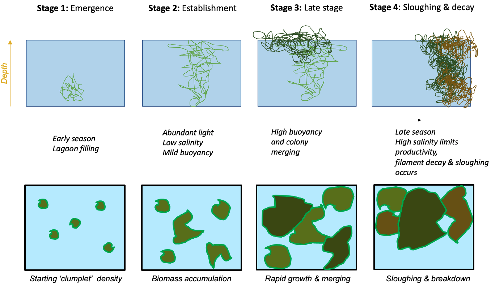
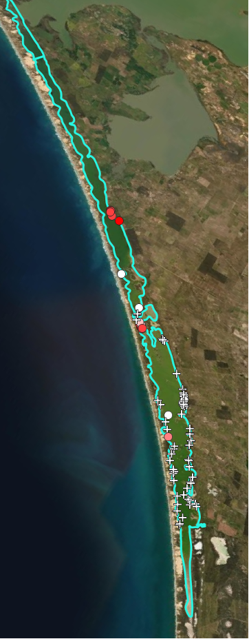

# Macroalgae
<br>

## Overview

Recent surveys in the Coorong South Lagoon have highlighted the challenge to ecosystem health due to the high biomass and wide extent of filamentous algae, mainly the species Ulva. The survey data highlight that the filamentous algae are tightly associated with the locations that Ruppia are present, and late in the season the smothering and deoxygenation casued by large biomass accumulations are driving poor water quality. This section describes the approach to simulating macroalgae, and development of the model to the CSL situation.   


Add changes text

## Model approach

Within the Coorong, the AED model has previously been set up to predict inorganic and organic nutrients, and chlorophyll-a. Whilst nutrients are not directly required for the *Ruppia* model assessment, the presence of filamentous algal blooms can compete for light and these are linked to bioavailable nutrients within the water column (in addition to other attributes).

### Filamentous algae

We include a filamentous algae variable, $FA$, in the model that is customized to reflect the Ulva community that was been extensively described. For this case we assumed it to be attached to benthic substrate, and is therefore is not subject to advection and mixing, but can slough off under high stress conditions and become a floating variable subject to transport. Evidence from the field suggest the abundance of filaments are tightly linked to the Ruppia shoots, which the algae use to anchor too.

In general, the balance equation describes how the biomass changes over time, according to:

$$
\frac{d\left(FA\right)}{dt}=+f_{\text{uptake}}^{FA}-f_{\text{excr}}^{FA}-f_{\text{mort}}^{FA}-f_{\text{resp}}^{FA}\ -f_{\text{slough}}^{FA}
(\#eq:lagoonhabitat5)
$$
where the main growth term is resolved as:

$$
\scriptsize{f^{FA}_{\text{uptake}} = \underbrace{R^{FA}_{\text{growth}}}_{\text{max growth} \\ \text{rate at 20$^\circ$C}} \ \ \underbrace{(1-k^{FA}_{\text{pr}})}_{\text{photorespiratory} \\ \text{loss}} \ \ \underbrace{\Phi^{FA}_{\text{tem}}(T)}_{\text{temperature} \\ \text{scaling}} \text{min} \left \{\underbrace{\Phi^{FA}_{\text{light}}(I)}_{\text{light limitation}}, \underbrace{\Phi^{FA}_{\text{N}}(NO_{3},NH_{4})}_{\text{light limitation}}, \underbrace{\Phi^{FA}_{\text{P}}(PO_{4})}_{\text{P limitation}} \right \} [FA]}
(\#eq:lagoonhabitat6)
$$

An example of the above approach in practice is shown in the below animation. The results highlight, for this time period of interest, the areas where salinity exceeds the threshold and initially limits the productivity, and the shallow areas where light is abundant; along with other environmental drivers (e.g., temperature) these shape the biomass accumulation pattern seen in the top left panel. Animations like this for different periods throughout the year, or between years, can look quite different.

<br>
<center>
<video width="100%" height="100%" controls>
<source src="images/dev/MA2_JAN.mp4" type="video/mp4">
</video>
</center>
<br>


### Macroalgae growth physiology

The original AED macroalgal biomass model previously applied and exemplified in the above example has been replaced with an updated version that includes numerous advances to light extinction within the canopy, nutrient cycling and excretion processes, and updates to the parameterisations associated with photosynthesis and biomass accumulation. The latter, in particular, are updated to better align with the experimental work reported in Waycott et al. (2019) and ...


### Resolving seasonal life-stage dynamics

Following review of the initial data and findings from the T&I project 2, the approach to modelling macroalgae has been revised to better resolve seasonal shifts in form and physiology over the seasonal cycle.

A new ‘colony’ based model for simulating clump emergence, biomass accumulation and sloughing has been conceptualised (Figure 13). The model adopts the same underlying physiology as described in the above section, but allows for age/size specific application of these rates to better align with recent observations and monitoring.

```{r dev-pic5, echo = FALSE, out.width='100%', class = "text-image", fig.cap = "Schematic depicting a new life-stage based macroalgal “clump” model being developed to track seasonal macroalgal biomass development and late-stage decay."}



```

This approach allows more direct links with a) the experimental data collected on biomass accumulation and photosynthesis rates in the lab, and b) the field data estimates of macroalgae density from photos and aerial imagery at different points through the growth season.

The approach essentially follows a size-class based model for resolving the filamentous algae biomass pool. According to the above conceptual schematic, four discrete life-stage (aka size) categories are included. In general they are fixed in space, but note that 'sloughed' biomass that becomes mobilised after a sloughing event can continue to be exposed to surface light irradiances and also begin decomposition should environmental conditions be inadequate for growth (e.g., as the water becomes too salty).


## Data availability

### Environmental threshold parameter review

*To be completed*

### Algae extent within the lagoon

A summary of the available algale extent data is summarised in Table X.

```{r 3-malgtable, echo=FALSE, message=FALSE, warning=FALSE}
library(knitr)
library(kableExtra)
library(readxl)
library(rmarkdown)
theSheet <- read_excel('tables/malgae_data.xlsx', sheet = 1)
theSheet <- theSheet[theSheet$Table == "malgae",]
theSheetGroups <- unique(theSheet$Group)
for(i in seq_along(theSheet$Identifier)){
  if(!is.na(theSheet$Identifier[i])==TRUE){
    theSheet$Identifier[i] <- paste0("**",theSheet$Identifier[i],"**")
  } else {
    theSheet$Identifier[i] <- " "
  }
}
kbl(theSheet[,3:NCOL(theSheet)], caption = "Macroalgae data availability summary", align = "l",) %>%
  pack_rows(theSheetGroups[1],
            min(which(theSheet$Group == theSheetGroups[1])),
            max(which(theSheet$Group == theSheetGroups[1])),
            background = '#ebebeb') %>%
  pack_rows(theSheetGroups[2],
            min(which(theSheet$Group == theSheetGroups[2])),
            max(which(theSheet$Group == theSheetGroups[2])),
            background = '#ebebeb') %>%
  row_spec(0, background = "#14759e", bold = TRUE, color = "white") %>%
  kable_styling(full_width = F,font_size = 11) %>%
  scroll_box(width = "680px", height = "360px",
             fixed_thead = FALSE)
```
<br>


**Historical Monitoring** A summary of historical (pre 2020) *Filamentous Algae* monitoring locations are shown in Figure \@ref(fig:dev-pic10).

```{r dev-pic10, echo = FALSE, out.width='45%', class = "text-image",fig.show='hold',fig.align='center', fig.cap = "Filamentous Algae sampling sites for monitoring program prior to 2020. Agency/program code under each map corresponds to those listed in Table 4.3. Turquoise outline represents the model boundary."}

knitr::include_graphics(c("images/dev/3_picture10a.png","images/dev/3_picture10b.png"))

```


**HCHB Monitoring** A summary of the HCHB monitoring locations are shown in Figure \@ref(fig:dev-pic11).

```{r dev-pic11, echo = FALSE, out.width='45%', class = "text-image",fig.align='center', fig.cap = "Filamentous algae sampling sites for the HCHB program (T and I 2). Agency/program code under each map corresponds to those listed in Table 4.4. Turquoise outline represents the model boundary."}



```

## Model setup


## Validation and assessment

Using the  Generation 0 model, the following assessment against Ulva biomass prediction and presence absence was recorded (Figure \@ref(fig:dev-pic12)).

```{r dev-pic12, echo = FALSE, out.width='45%', class = "text-image",fig.show='hold',fig.align='center', fig.cap = "Comparison of Observed and Simulated Ulva for 2016 (left) and 2017 (right)."}

knitr::include_graphics(c("images/dev/AlgaeDec2016vsULVAbiomass2016.png","images/dev/AlgaeMay2017vsUlvaBiomass2016.png"))

```

The modelled Ulva HSI prediction correlates well with the observed filamentous algae density, however, the correlation between predicted biomass and obsevred presence was less accurate (Figure \@ref(fig:dev-pic13)). This implies the growth controls (as embodied in the HSI) are well resolved, but the seasonal factors leading to biomass accumulation are more complicated and need further refinement. The HSI range was however quite restricted and further data from 2020-2021 is needed to assess whether the HSI calculation needs further refinement.  


```{r dev-pic13, echo = FALSE, out.width='100%', class = "text-image",fig.align='center', fig.cap = "Filamentous algae observed density and equivalent model predicted Ulva HSI (top) and Ulva Biomass (bottom)."}

knitr::include_graphics("images/dev/Algae_2016.png")

```


## Summary (Sept 2021)

The macroalgae model in AED is able to capture the broad spatial patterns in environmental drivers that control biomass. Comparison of the Generation 0 model with the pre-HCHB survey data has provided insights to the suitability of the model approach. This is being used to refine the conceptual basis of the model which will be introduced in the next model versions.
