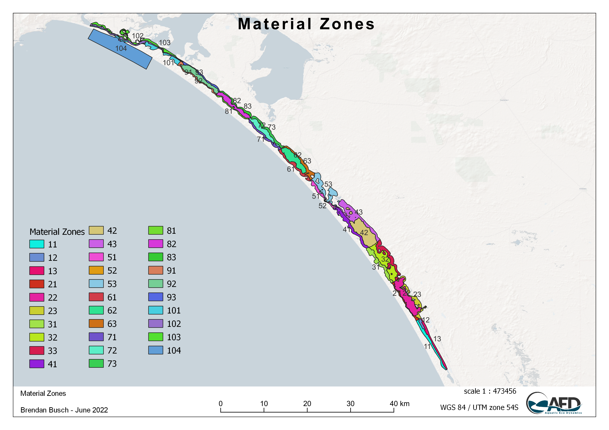

# CDM: The Coorong Dynamics Model

<br>

## Overview

The Coorong Dynamics Model (CDM) is a spatially resolved model to simulate the environmental conditions within the Coorong, a large coastal lagoon located in South Australia. It is not a single model, but a system of models that can be configured, applied and coupled in various ways for different purposes.

At its core, it consists of the hydrodynamic model TUFLOW-FV and the water quality model AED, which can be optionally linked with the SWAN wave model. Different model domain resolutions can be selected and/or time-periods of interest simulated. Different levels of model complexity (i.e., biogeochemical or ecological components) can be engaged within an environment with common input files and output analysis workflows. The flexibility allows a common approach to be used in different use-cases; for example, a long-term low-resolution simulation vs a high-resolution habitat restoration simulation can share common model settings, parameters and parameterisations. This provides decision-makers a single trusted tool that can be used to answer a diversity of questions that span from day-to-day management (e.g., barrage operation) to long-term policy settings (e.g, restoration and climate change adaptation strategies).

In general, the models are configured to resolve hydrodynamics and flushing, water temperature and salinity, and numerous water quality attributes including oxygen, nutrients (organic and inorganic), phytoplankton, macroalgae, and suspended sediment. The outputs from these modules are used to predict ecological attributes of interest, including seagrass, fish and benthic macro-invertebrates.

The CDM is also more than the individual models. The model links a large volume of data from historical surveys, real-time data streams and recent experimental work. Complex integration workflows are implemented to process data for model inputs (e.g., boundary conditions) or model assessment (e.g., calibration or validation).

The CDM project is therefore a model-data 'ecosystem' that serves as a shared analytics platform to provide a holistic view of the many complex aspects of the system. Model and data provenance is a high priority and all data and model products that are developed are under strict version control within the platform to ensure traceability and transparency in model use and assumptions (see Section 3).

The following sections describe the model platform, detail the CDM configuration, summarise the different model generations being developed and used for decision support, and provide a persistent resource summarising model performance.

<br>

## Model platform

### Hydrodynamics: TUFLOW-FV

[TUFLOW-FV](https://www.tuflow.com/products/tuflow-fv/) is a finite volume hydrodynamic model, developed by BMT Global Pty Ltd (BMTWBM, 2019). It has flexible-mesh and accounts for variations in water level, salinity, temperature, and density in response to tides, inflows and surface thermodynamics. The current version has various use-ability features including integration with QGIS and optimisiation for operation on desktop GPU resources.

The TUFLOW-FV has been used extensively in the region for hydrological assessments. Within the CDM two(three) different model domains are applied with different levels of spatial resolution, including both 2D and 3D implementations.

### Waves: SWAN

The Simulating WAves Nearshore ([SWAN](https://www.tudelft.nl/en/ceg/about-faculty/departments/hydraulic-engineering/sections/environmental-fluid-mechanics/research/swan/)) model is a numerical wave model used to obtain realistic estimates of surface wave parameters in coastal areas, lakes, and estuaries from given wind, bottom, and current conditions. The model is based on the wave action balance equation (or energy balance in the absence of currents) with sources and sinks. SWAN is a third-generation wave model with first-, second-, and third-generation options.

### Water quality and habitat: AED

The Aquatic EcoDynamics ([AED](http://aed.see.uwa.edu.au/research/models/aed/)) water quality model is a community-driven library of modules and algorithms for simulation of "aquatic ecodynamics" - water quality, aquatic biogeochemistry, biotic habitat and aquatic ecosystem dynamics, developed by the AED research group of UWA [@hipsey2019]. Each module aims to be based on state-of-the-art science sourced from a wide variety of scientific literature, making the library one of the most advanced available to aquatic ecosystem modellers.

<br>

## CDM setup and configuration

The following sections describe the general setup and approach of the model and provide an overview. Speciic simulations decsribed in subsequent sections may use tailored or customised versions adapted from this description.

### Simulation domains

The CDM modelling domain spans from the Murray Mouth region to the south end of the Coorong, with a length of \~116 km and a total area of \~237 km^2^.

Two types of model mesh were developed to support different research purposes. The first is a fine-resolution mesh (26250 cells with mean cell size of \~1×10^4^ m^2^, Figure 2.1, left); this mesh was used for resolving the spatial heterogeneity of the water quality response, especially for the habitat predictions; the second is a relatively coarse resolution mesh (2202 cells with mean cell size of \~1.3×10^5^ m^2^, Figure 2.1, right) for faster simulations of investigating water balance and other modelling experiments. The fine- and coarse-mesh models share the same boundary conditions and have been bench-marked with each other, and can be used in different stages of model development.

```{r cdm-pic1, echo = FALSE, out.width='100%', class = "text-image",fig.align='center', fig.cap = "Plan view of the Coorong Dynamics Model fine (left) and coarse (right) mesh."}

knitr::include_graphics("images/cdm/2_picture1.png")

```

```{r CDM-grid, echo=FALSE, message=FALSE, warning=FALSE}
library(knitr)
library(kableExtra)
library(readxl)
library(rmarkdown)
theSheet <- read_excel('tables/grids.xlsx', sheet = 1)
theSheet <- theSheet[theSheet$Table == "Data",]
theSheetGroups <- unique(theSheet$Group)


kbl(theSheet[,3:8], caption = "Grid Specifications", align = "l",) %>%
  pack_rows(theSheetGroups[1],
            min(which(theSheet$Group == theSheetGroups[1])),
            max(which(theSheet$Group == theSheetGroups[1])),
            background = '#ebebeb') %>%
  pack_rows(theSheetGroups[2],
            min(which(theSheet$Group == theSheetGroups[2])),
            max(which(theSheet$Group == theSheetGroups[2])),
            background = '#ebebeb') %>%
row_spec(0, background = "#14759e", bold = TRUE, color = "white") %>%
  kable_styling(full_width = F,font_size = 11) %>%
	column_spec(2, width_min = "7em") %>%
	column_spec(3, width_max = "19em") %>%
	column_spec(4, width_min = "10em") %>%
	column_spec(5, width_min = "5em") %>%
  column_spec(6, width_min = "10em") %>%
  scroll_box(width = "700px",
             fixed_thead = FALSE)
```

<br>

A range of bathymetry data is available and specified within the model(s).

-   2008 survey
-   2018 1m Lidar / Sentinel DEM
-   1999 - 2019 Murray Mouth Surveys

This is processe within the SMS software to generate a computational mesh suitable for TUFLOW-FV.

```{r cdm-pic2, echo = FALSE, out.width='100%', class = "text-image",fig.align='center', fig.cap = "Coorong bathymetry."}

knitr::include_graphics("images/cdm/HCHB 2dm.png")

```

### Boundary conditions

Regardless of the model domain / mesh option that is chosen, then CDM system manages several standard boundary conditions to allow the model to be forced by tidal, meteorological and inflow information, which is brought together from various data sources.

-   **Tidal conditions:** Set on the ocean side of the Murray Mouth, an open water level boundary is specified based on Barker Knoll / Victor Harbour tidal data, which are available at 10 minute resolution.
-   **Salk Creek inflow:** Inflow to the South Lagoon from the local catchment via Salt Creek was set based on available flow data from [water.data.sa.gov.au](water.data.sa.gov.au) (curated by the South Australian Department of Environment and Water). The nutrient boundary condition inputs are extrapolated based on field measurements at Salt Ck.
-   **Barrage flows:** Inflow boundary conditions at the five barrages are based off historical daily-interval measurements of flow rate, temperature, salinity. The nutrient boundary condition inputs are extrapolated based on field measurements at Lake Alexandrina, close to the barrages.
-   **Meteorology:** Meteorological conditions are collected from a range of sources. The main data used include that from Narrung weather station (Figure \@ref(fig:cdm-pic4)), and stations maintained on the Coorong by DEW. The spatially -resolved Bureau of Meteorology Atmospheric High-Resolution Regional Reanalysis for Australia (BARRA) climate model is also available and has been used, but we note this product is discontinued beyond 2019. A comparison of weather data sources is discussed [here](https://github.com/AquaticEcoDynamics/CDM/discussions/4).

```{r cdm-pic4, echo = FALSE, out.width='100%', class = "text-image",fig.align='center', fig.cap = "Summary locations where relevant boundary condition data is collected and/or applied."}

knitr::include_graphics("images/cdm/HCHB_Inflows with Met.png")

```

For each of the flow boundaries, the model requires specification of inflow nutrient and salt concentrations, to resolve the external loading into the domain. This is depicted in Figure \@ref(fig:cdm-pic6). Details on the specific simulated variables that must be specified are summarised in further detail below.

```{r cdm-pic6, echo = FALSE, out.width='100%', class = "text-image",fig.align='center', fig.cap = "Summary of inflow files used for boundary specification and the required input constituents."}

knitr::include_graphics("images/cdm/HCHB_Inflows.png")

```

### Hydrodynamic settings

The key hydrodynamic settings controlling the water transportation and mixing in the TUFLOW-FV model include:

-   **Bottom drag**: For hydrodynamic simulations the bed boundary resistance is described using a $K_S$ bottom drag model, which assumes a log-law velocity profile and requires specification of a surface roughness length-scale. A background roughness length-scale of 0.018 was applied in the CDM (*update to reflect zones*);

-   **Horizontal momentum mixing**: the Smagorinsky scheme was applied for the horizontal momentum mixing modelling, with default Smagorinsky coefficient of 0.2;

-   **Horizontal scalar mixing**: the horizontal non-isotropic scalar diffusivity is calculated according to the Elder model, with Global Horizontal Scalar Diffusivity was set to 250 m^2^/s and the coefficient was set to 25;

-   **Tidal input**: a `WL` (water level) boundary condition was applied to the Murray Mouth tidal input;

-   **Inflow input**: a `Q` (nodestring flow) boundary condition was applied to the barrage flows, and a `QC` (cell inflow) boundary condition was applied to the Salt Ck inflow;

-   **Meteorology**:

    -   The background shortwave radiation extinction coefficients was set to 2.0, with feedback from the AED model of TSS concentration altering the extinction coefficient;
    -   Longwave radiation heat transfer model was using the net downward long wave radiation input, based on cloud cover;
    -   The wind stress was calculated using the [@wu1982] wind stress model.

-   **Salinity correction on evaporation**: The effect of high salinity on evaporation is included, as outlined [here](https://github.com/AquaticEcoDynamics/CDM/discussions/5).

### Water quality modules

The water quality model AED has been dynamically linked with TUFLOW-FV to simulate the mass balance and redistribution of carbon, nutrients and sediment, including partitioning between organic and inorganic forms and resolution of the relevant biotic components. This includes turbidity (including particle resuspension and sediment redistribution), chlorophyll a (chl-a), and filamentous algae (Ulva), plus habitat quality of Ruppia. Benthic and pelagic properties have been resolved.

A summary of simulated model variables is shown in Table 1. For detailed scientific documentation the reader is referred to the [AED Science Manual](https://aquaticecodynamics.github.io/aed-science/index.html).

```{r 2-varstable, echo=FALSE, message=FALSE, warning=FALSE}
library(knitr)
library(kableExtra)
library(readxl)
library(rmarkdown)
theSheet <- read_excel('tables/variable_summary.xlsx', sheet = 1)
theSheet <- theSheet[theSheet$Table == "Variable",]
theSheetGroups <- unique(theSheet$Group)
theSheet$Name <- paste0("`",theSheet$Name,"`")

for(i in seq_along(theSheet$Symbol)){
  if(!is.na(theSheet$Symbol[i])==TRUE){
    theSheet$Symbol[i] <- paste0("$$",theSheet$Symbol[i],"$$")
  } else {
    theSheet$Symbol[i] <- " "
  }
}
for(i in seq_along(theSheet$Units)){
  if(!is.na(theSheet$Units[i])==TRUE){
    theSheet$Units[i] <- paste0("$$\\small{",theSheet$Units[i],"}$$")
  } else {
    theSheet$Units[i] <- NA
  }
}

kbl(theSheet[,3:NCOL(theSheet)], caption = "CDM simulated variable summary", align = "l",) %>%
  pack_rows(theSheetGroups[1],
            min(which(theSheet$Group == theSheetGroups[1])),
            max(which(theSheet$Group == theSheetGroups[1])),
            background = '#ebebeb') %>%
  pack_rows(theSheetGroups[2],
            min(which(theSheet$Group == theSheetGroups[2])),
            max(which(theSheet$Group == theSheetGroups[2])),
            background = '#ebebeb') %>%
  pack_rows(theSheetGroups[3],
					  min(which(theSheet$Group == theSheetGroups[3])),
					  max(which(theSheet$Group == theSheetGroups[3])),
					  background = '#ebebeb') %>%
  pack_rows(theSheetGroups[4],
					  min(which(theSheet$Group == theSheetGroups[4])),
					  max(which(theSheet$Group == theSheetGroups[4])),
					  background = '#ebebeb') %>%
  pack_rows(theSheetGroups[5],
					  min(which(theSheet$Group == theSheetGroups[5])),
					  max(which(theSheet$Group == theSheetGroups[5])),
					  background = '#ebebeb') %>%
  row_spec(0, background = "#14759e", bold = TRUE, color = "white") %>%
  kable_styling(full_width = F,font_size = 11) %>%
	column_spec(2, width_min = "6em") %>%
	column_spec(3, width_max = "19em") %>%
	column_spec(4, width_min = "10em") %>%
	column_spec(5, width_min = "5em") %>%
  scroll_box(width = "700px", height = "2800px",
             fixed_thead = FALSE)
```

<br>

For the sediment and benthic related variables, the model allows for spatial variability in these properties, and this is captured through the definition of several *material zones*. This is explored in some detail in Chapter 4; though an example default material zone setup (used in Generation 1.5 simulations, see below) is shown below in Figure \@ref(fig:cdm-pic3).

```{r cdm-pic3, echo = FALSE, out.width='100%', class = "text-image",fig.align='center', fig.cap = "Different sediment zones used within the domain."}



```

<br>

## Model generation summary

The CDM modelling project by its very nature has evolving capability over time, and different modelling capabilities have been developed for particular use-cases. For context, the range of pre-HCHB and HCHB simulation "generations" are summarised in Table \@ref(tab:2-simtable). As at Sept 2021, this document mainly reports on Generation 0 results and the development of Generation I and II which is underway.

```{r 2-simtable, echo=FALSE, message=FALSE, warning=FALSE}
library(knitr)
library(kableExtra)
library(readxl)
library(rmarkdown)
theSheet <- read_excel('tables/sim_summary.xlsx', sheet = 1)
theSheet <- theSheet[theSheet$Table == "Simulation",]
theSheetGroups <- unique(theSheet$Group)

theSheet$Name <- paste0("`",theSheet$Name,"`")

kbl(theSheet[,3:NCOL(theSheet)], caption = "CDM simulation summary", align = "l",) %>%
  pack_rows(theSheetGroups[1],
            min(which(theSheet$Group == theSheetGroups[1])),
            max(which(theSheet$Group == theSheetGroups[1])),
            background = '#ebebeb') %>%
  pack_rows(theSheetGroups[2],
            min(which(theSheet$Group == theSheetGroups[2])),
            max(which(theSheet$Group == theSheetGroups[2])),
            background = '#ebebeb') %>%
  pack_rows(theSheetGroups[3],
					  min(which(theSheet$Group == theSheetGroups[3])),
					  max(which(theSheet$Group == theSheetGroups[3])),
					  background = '#ebebeb') %>%
  pack_rows(theSheetGroups[4],
					  min(which(theSheet$Group == theSheetGroups[4])),
					  max(which(theSheet$Group == theSheetGroups[4])),
					  background = '#ebebeb') %>%
  row_spec(0, background = "#14759e", bold = TRUE, color = "white") %>%
  kable_styling(full_width = F,font_size = 11) %>%
	column_spec(2, width_min = "5em") %>%
	column_spec(3, width_max = "19em") %>%
	column_spec(4, width_max = "19em") %>%
	column_spec(5, width_max = "19em") %>%
	column_spec(6, width_max = "19em") %>%
	column_spec(7, width_max = "19em") %>%
  scroll_box(width = "700px", height = "1100px",
             fixed_thead = FALSE)
```

<br>
