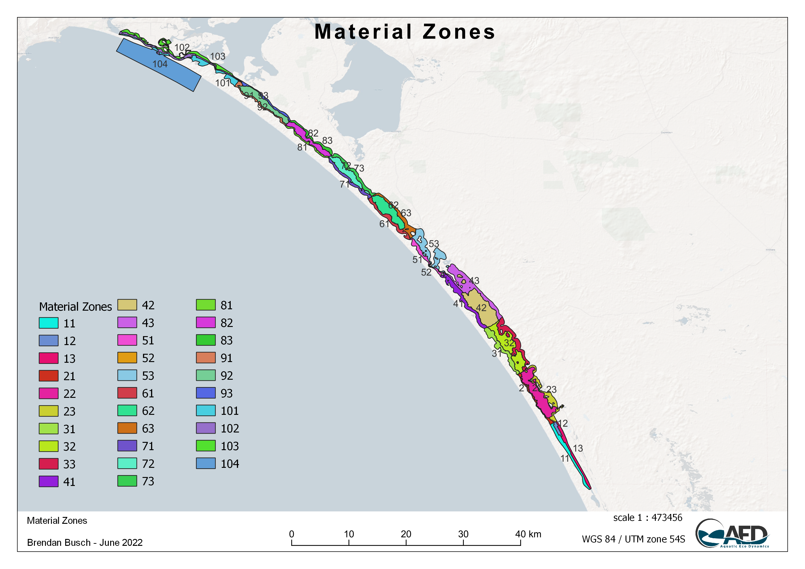
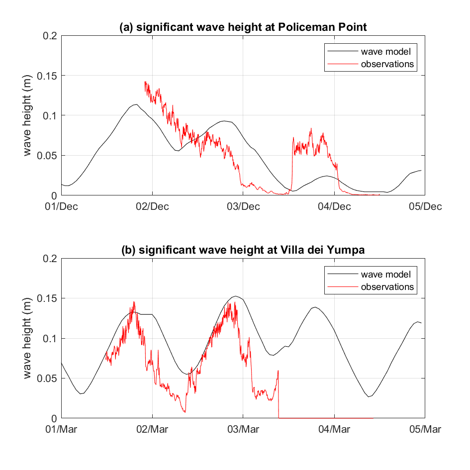
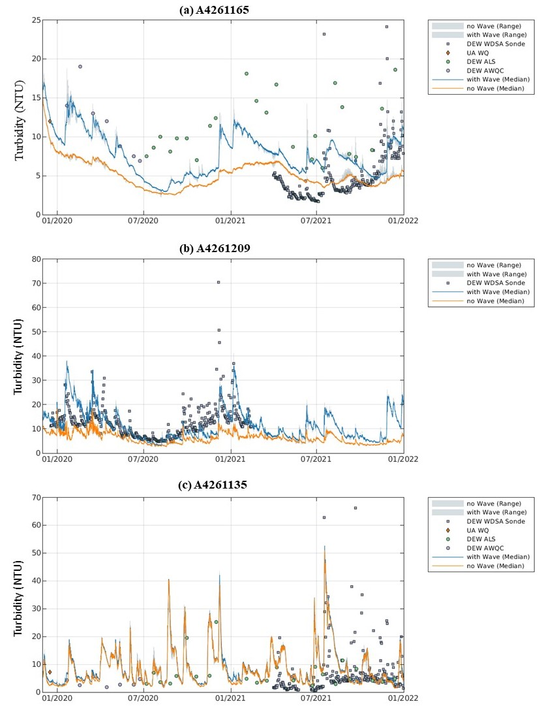
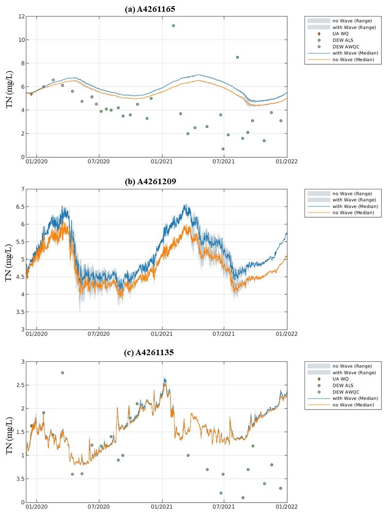

# Resuspension & Turbidity


<br>

## Overview

Waves and currents are the primary mechanisms of sediment resuspension in coastal waterways. In shallow lagoons with restricted connection to the ocean such as the Coorong, waves are locally generated by the wind acting on the fetch inside the basin [Green and Coco, 2013; @mosley2021]. Some may also propagate into the basin from the ocean, but the effect is limited in terms of the distance into the lagoon they can enter from the mouth. 

Sediments in aquatic systems are resuspended into the water column when the bottom shear stress becomes greater than the critical shear stress for the initiation of suspension [@rijn1993]. The critical shear stress for the particles is depending on the particle properties such as size and density. 

In order to capture the role of wind-driven waves on water column suspended solids and organic matter concentrations within the Coorong, the SWAN wave model was applied. The wave model predicts the spatial pattern of significant wave height and wave periods and the output is used by the TUFLOW-FV model for modelling shear stress at the seabed as affected by orbital wave velocities. Depending on the sediment particle sizes, the combined stress from the wave and current activity is used to predict the rate of sediment resuspension. Capturing sediment resuspension in the Coorong is critical to predict the turbidity fo the water which shapes the underlying light climate that shapes the dynamics of primary producers.

The settings of the wave model and the particle properties such resuspension rates and settling rates are described below. Some wave data are available from experimental work undertaken in 2020 at sites of Policeman Point and Villa de Yampa (@mosley2021; site map available in Figure \@ref(fig:dev-sites)). Turbidity data is also available as part of the regular monitoring program and as part of HCHB research at multiple sites along the Coorong. These data are used for calibration purposes and the results are presented and discussed in the following sections. 

<br>

## Model approach

### SWAN wave model simulation

The SWAN wave model was adopted using a Cartesian grid with 200 m resolution, and the third generation simulation mode. The wave model domain covers the CDM domain (Figure \@ref(fig:dev-sites)) therefore the wave outputs can be linked with CDM for resuspension simulations. The model was initially forced with the Narrung weather station data and the water depth was interpolated from the existing (2008) Coorong bathymetry data. Wind data at the wave measurement site was also integrated in the wind forcing dataset for the period of field experiments when it was available.

```{r dev-sites, echo = FALSE, out.width='100%', class = "text-image",fig.align='center', fig.cap = "Model extents for SWAN Wave Model and the TFV domains, with validation sites."}

knitr::include_graphics("images/dev/HCHB SWAN Extents.png")

```

### Sediment solids and resuspension

The field observations of the total suspension solids (TSS) composition showed that the TSS was mostly dominated by the small size particles (<3.8 microns) during the observation periods, while large size particles (186 – 461 microns) may periodically become dominant (Figure \@ref(fig:dev-ssarea)). Based on these observations, the AED component of the simulation has been configured to include upto three suspended solids (SS) groups, namely:

 - clay, for suspended particles with size < 3.8 microns;
 - silt, for suspended particles with 3.8 microns ≤ size < 186 microns; and
 - sand, for suspended particles with size > 186 microns;

```{r dev-ssarea, echo = FALSE, out.width='100%', class = "text-image",fig.align='center', fig.cap = "Suspended solids components during the field observations (data source: Mosley et al., 2021)."}

knitr::include_graphics("images/dev/waves/timehist_TSS_area.png")

```

The rate of resuspension (R) varies across the system due to heterogeneity in sediment properties. It is calculated by assuming linearity with the excess shear stress at the bed (Lee et al. 2005), such that:

$$
R_i=\sum_{s=1}^{n_s}{{\ \ f}_{s,i}\ {\ \ \varepsilon}_s}\ \ \text{max}\left(\tau_b-\tau_c,\ 0\right)
(\#eq:resus1)
$$

where $n_s$ is the number of particle size classes, $f_{s,i}$ is the fraction of each particle size class in the sediment material zone, $\varepsilon_{ss}$ is the bulk resuspension rate, $\tau_b$ is the bed shear stress (computed based on the current and wave orbital velocities in each cell), and $\tau_c$ is the critical shear stress for resuspension, which depends on the sediment size class (Julien 2010), and optionally, the presence of vegetation.

To capture regional heterogeneity across the lagoon, the sediment of Coorong was categorized to 10 regions from north to south, and each region was further divided into 3 zones spanning the deep water and both sides of shallow water in order to categorise different sediment properties between the shallow and deep areas and north to south (Figure \@ref(fig:dev-31z)). 

```{r dev-31z, echo = FALSE, out.width='100%', class = "text-image",fig.align='center', fig.cap = "31 discrete sediment zones used within the model domain."}



```

<br>


The major components of N and P released by resuspension can be in particulate form, depending on the organic matter content of the sediment [@tang2019]. Therefore, the resuspension of particulate organic matter is also considered in the model. The organic matter resuspension rate, $R_{OM}$} is calculated as:

$$
R_{OM}=\sum_1^i \left(R_i\:f_{(OM-frac)} \right)  
(\#eq:resus2)
$$


where $i$ is the particle group index, $R_i$ is the resuspension rate, and $f_{OM-frac}$ is the organic matter fraction in the sediment. This is set to be unique in each of the simulated zones. Once $R_{OM}$ is computed, this is partitioned into carbon, nitrogen and phosphorus resuspension rates for the POC, PON and POP water column balances using a user-prescribed sediment $OM$ C:N:P ratio.

The sediment properties of particle size and organic matter content were set based on the sediment survey data (details of sediment survey and results are described in Chapter 7 - Sediment Biogeochemistry), which were then interpolated into the zones based on the sediment particle sizes, organic matter content and expert assessment of sediment quality data. The details of sediment particle property settings in each zone are summarized in Table \@ref(tab:dev-zonepars). 

<br>

```{r dev-zonepars, echo=FALSE, message=FALSE, warning=FALSE}
library(knitr)
library(kableExtra)
library(readxl)
library(rmarkdown)
theSheet <- read_excel('tables/water/sediment_flux.xlsx', sheet = 5)
theSheet <- theSheet[theSheet$Table == "Data",]
for(i in seq_along(theSheet$Description)){
  if(!is.na(theSheet$Description[i])==TRUE){
    theSheet$Description[i] <- paste0("*",theSheet$Description[i],"*")
  } else {
    theSheet$Description[i] <- NA
  }
}
for(i in seq_along(theSheet$ZoneID)){
  if(!is.na(theSheet$ZoneID[i])==TRUE){
    theSheet$ZoneID[i] <- paste0("**",theSheet$ZoneID[i],"**")
  } else {
    theSheet$ZoneID[i] <- NA
  }
}

kbl(theSheet[,2:7], caption = "Summary of sediment property settings in CDM with 10 regions defined north to south, split into 31 discrete material zones.", align = "l",escape = F, ) %>%

row_spec(0, background = "#14759e", bold = TRUE, color = "white") %>%
  kable_styling(full_width = T,font_size = 10) %>%
  scroll_box(fixed_thead = FALSE)
```

<br>


Once in suspension, particles are subject to a sedimentation rate back into the sediment based on a estimated settling velocity for each particle size group. The settling velocity is calculated based on  Stokes’ law, which balances gravitational forces and drag. For inorganic suspended sediment particles this is sumamrised as:

$$
V_{ss_s}=\frac{d_s^2 g}{18η}(ρ_s-ρ_w)
(\#eq:resus3)
$$
where $w_s$ is the settling velocity ($m/s$); $d_s$ is the particle diameter ($m$); $g$ is the acceleration due to gravity ($m/s^2$); $ρ_s$ is the particle density ($kg/m^3$); $ρ_w$ is the water density ($kg/m^3$); and $η$ is the kinematic fluid viscosity ($kg/m/s$). A summary of the literature and current CDM settings related to the resuspension and suspended sediment model is summarised below in Table 4.1.

<br>

### Suspended solids and light

The concentration of suspended solids at any location depends on inputs from tributaries, advection of material through the lagoon, and vertical fluxes due to particle resuspension and deposition (described above). The CDM includes 1 to 3 sediment particles sizes ($SS_s$) and is configured to include light ($I$). The TUFLOW-FV -- AED models are also dynamically coupled to capture the feedback between $SS$, light, and surface heating.

Light is modelled by capturing the attenuation of incident shortwave radiation as it penetrates the water column. The attenuation of light is dependent on the specific bandwidth. For primary production, the shortwave (280-2800 nm) intensity at the surface ($I_0$) is partitioned to the photosynthetically active component (PAR) based on the assumption that \~45% of the incident spectrum lies between 400-700nm. PAR and other light bandwidths such as ultra-violet (UV, \~3.5%) and near-infrared (NIR, \~51%), penetrate into the water column according to the Beer-Lambert Law:

$$
I_{i} = f_{i} I_{0} \text{exp} (-K_{d_{i}} z)
(\#eq:resus4)
$$

where $i$ refers to the specific bandwidth range (e.g., PAR, UV, etc), $f_i$ is the fraction of light intensity within that range at the water surface and $z$ is the water depth. The light extinction coefficient $K_d$ is a variable parameter governing light attenuation, as influenced by the suspended solids ($SS$) in the water column, filamentous algae density, and vegetation leaf area index. In these simulations it is computed by assuming a background light extinction coefficient $K_w$ and the specific attenuation coefficient, $K_e$, for $SS$ and algae:

$$
K_{d} = K_{w} + K_{e_{s}} SS + K_{e_{pom}} POC +  K_{e_{PHY}} PHY + K_{e_{F}} FA 
(\#eq:resus5)
$$

Computing turbidity from the concentration of particulates is also possible and able to be compared to routinely measured turbidity data. The relation for simulation of turbidity is able to be expressed as:

$$
\text{Turbidity} = f_{t_{ss}}\:SS + f_{t_{chl}}\: Chla + f_{t_{pom}}\: POC
(\#eq:resus6)
$$

where $f_{t_{s}}$ is an empirical coefficient, determined through site specific correlations or literature. The suspended solids-turbidity ratio is currently assumed to be 1, based on experimental data from the March 2020 UA field assessment where both SS and Turbidity were measured simultaneously.

<br>

```{r dev-wavepars, echo=FALSE, message=FALSE, warning=FALSE}
library(knitr)
library(kableExtra)
library(readxl)
library(rmarkdown)

# function to fix floating point decimals
# df = dataframe to fix
# colNames = list() of colummns to fix
fixDecimals <- function(df, colNames){
  for(i in colNames){
    for(ii in 1:NROW(df[,i])){
      currentVal <- df[ii,i]
      currentVal <- as.numeric(currentVal)
      if(!is.na(currentVal)==TRUE){
        newVal <- as.character(currentVal)
        df[ii,i] <- newVal
      } 
    }
  }
  return(df)
}
theSheet <- read_excel('tables/wave_pars.xlsx', sheet = 2)
theSheet <- fixDecimals(
  df = theSheet, 
  colNames = list("SS1:Clay","SS2:Silt","SS3:Sand")
  )
theSheet <- theSheet[theSheet$Table == "Data",]
theSheetGroups <- unique(theSheet$Group)

for(i in seq_along(theSheet$Parameter)){
  if(!is.na(theSheet$Parameter[i])==TRUE){
    theSheet$Parameter[i] <- paste0("$$",theSheet$Parameter[i],"$$")
  } else {
    theSheet$Parameter[i] <- NA
  }
}
for(i in seq_along(theSheet$Unit)){
  if(!is.na(theSheet$Unit[i])==TRUE){
    theSheet$Unit[i] <- paste0("$$\\small{",theSheet$Unit[i],"}$$")
  } else {
    theSheet$Unit[i] <- NA
  }
}

kbl(theSheet[,2:NCOL(theSheet)], caption = "Summary of key parameters used to simulate sediment resuspension, deposition and turbidity. ", align = "l",) %>%

row_spec(0, background = "#14759e", bold = TRUE, color = "white") %>%
  kable_styling(full_width = T,font_size = 10) %>%
    scroll_box(fixed_thead = FALSE)
```

<sub><sup>a: van Rijn (1993)</sup></sub><br>
<sub><sup>b: Depinto et al. (2010)</sup></sub><br>
<sub><sup>c: Evans (1994)</sup></sub><br>
<sub><sup>d: Tang et al. (2019)</sup></sub><br>
<sub><sup>e: calculated from Eq \@ref(eq:resus3)</sup></sub><br>

<br>


## Validation and assessment

### Wave characteristics

The SWAN wave model was calibrated against data collected during the periods when sediment resuspension studies were undertaken by the UA team in December 2020 and March 2021. The comparison between the SWAN wave model outputs and the field survey data of significant wave height is shown in Figure \@ref(fig:dev-pic101), which indicates the wave model acurately simulated the time variation and magnitude of significant wave height.

<!-- 
 ```{r dev-pic1, echo = FALSE, out.width='60%', class = "text-image", fig.cap = "Comparison of the Coorong SWAN wave model output and the UA field survey data at two sites. Period spanning Mar 2021."}

knitr::include_graphics("images/dev/3_picture1.png") 

```
-->

<center>

```{r dev-pic101, echo = FALSE, out.width='80%', class = "text-image", fig.cap = "Comparison of the Coorong SWAN wave model output and the UA field survey data at two sites. Period spanning Dec 2020 and Mar 2021."} 



```

</center>

### Lagoon scale turbidity

The wave model output is then coupled to the TUFLOW-FV - AED model, where it influences $\tau_b$ and influences the rate of sediment resuspension (Eq. \@ref(eq:resus1)). 

Examples of the spatial distribution of significant wave height, bottom shear stress (TAUB), resuspension rate, and TSS concentration in the water during a low wind event (Figure \@ref(fig:dev-pic3)) and high wind event (Figure \@ref(fig:dev-pic4)) are shown below. In general, the wind condition was shown to be the dominant factor of the sediment resuspension rate. During the calm wind condition such as in 01/11/2021 when the wind speed was < 3 m/s, the sediment resuspension rate was negligible. The resuspension rate exceeded 20 g/m^2^/day in 19/11/2020 when the wind speed reached 9 m/s, which subsequently led to increase in the water TSS concentrations. The shallow water in the littoral zones are more vulnerable to the wind-induced resuspension.

```{r dev-pic3, echo = FALSE, out.width='100%', class = "text-image", fig.cap = "An example output of modelled (a) weight height, (b) bottom shear stress, (c) resuspension rates, and (d) total suspended solid concentration in Coorong during low wind condition (< 3m/s)."}

knitr::include_graphics("images/dev/3_picture2.png")

```

```{r dev-pic4, echo = FALSE, out.width='100%', class = "text-image", fig.cap = "Same as Figure xx except for a relatively higher wind condition (>9m/s)."}

knitr::include_graphics("images/dev/3_picture3.png")

```

An animation of the wave, resuspension and turbidity conditions is also shown below.

<br>
<center>
<video width="100%" height="100%" controls>
<source src="images/dev/animation_resuspension.mp4" type="video/mp4">
</video>
</center>
<br>

The resulting turbidity, in comparison with the field observations and the CDM outputs without the waves, at sites of A4261165, A4261209 and A4261135 is shown in Figure \@ref(fig:dev-pic2). The comparison indicates the degree to which addition of orbital wave velocity into the simulation led to more resuspension when compared to the ‘no-waves’ scenario;  the model with the wave inputs included accuractely captured the magnitude and the timing of high turbidity events in general. The results also showed that the wave effects on the turbidity diminished from south to north. While in the north lagoon (e.g., the site A4261135), the turbidity showed similar results between the ‘with wave’ and ‘without waves’ scenarios, indicating that the current dominated the resuspension in the north lagoon. 

Though the wave stress has a significant effect on the turbidity, the effect on the nutrient concentration is relatively small. An example of TN concentration at the same sites between the ‘with wave’ and ‘without wave’ scenario is presented in Figure \@ref(fig:dev-picss2), where shows the difference of TN concentration between the scenarios are generally < 10%, probably due the fact that the Coorong has a large stock of nutrient in the water therefore the resuspension contribution is small when compared to the existing stock. 

<br>

<head>
<meta name="viewport" content="width=device-width, initial-scale=1">
<style>
/* Style the buttons inside the tab */
.tab button {
  background-color: #2481AA;
  float: left;
  width: 49.5%;
  border: none;
  outline: none;
  cursor: pointer;
  padding: 14px 16px;
  transition: 0.3s;
  font-size: 14px;
  color: #FFFFFF;
  font-weight: bold;
}
</style>
</head>
<body>

<div class="tab">
  <button class="tablinks" onclick="opentab(event, 'turb')"id="defaultOpen">Turbidity</button>
  <button class="tablinks" onclick="opentab(event, 'tn')">Total Nitrogen</button>
</div>

<div id="turb" class="tabcontent">
<center>

```{r dev-pic2, echo = FALSE, out.width='95%', class = "text-image", fig.cap = "Comparison of the AED turbidity model output against the observed data at three sites within the Coorong over the calibration period from January 2020 to December 2021."}



```

</center>
</div>

<div id="tn" class="tabcontent">
<center>

```{r dev-picss2, echo = FALSE, out.width='95%', class = "text-image", fig.cap = "Comparison of the AED Total Nitrogen (TN) model output against the observed data at three sites within the Coorong over the calibration period from January 2020 to December 2021."}



```

</center>
</div>


<script>
function opentab(evt, tabName) {
  var i, tabcontent, tablinks;
  tabcontent = document.getElementsByClassName("tabcontent");
  for (i = 0; i < tabcontent.length; i++) {
    tabcontent[i].style.display = "none";
  }
  tablinks = document.getElementsByClassName("tablinks");
  for (i = 0; i < tablinks.length; i++) {
    tablinks[i].className = tablinks[i].className.replace(" active", "");
  }
  document.getElementById(tabName).style.display = "block";
  evt.currentTarget.className += " active";
}
document.getElementById("defaultOpen").click();
</script>

</body>

<br>

The performance assessment of the various model generations in capturing turbidity, and other variables influenced by resuspension, is outlined in Chapter 9. In addition, a full comparison results of key water quality parameters assessing the model sensitivity to inclusion of the wave forcing effect (‘with wave’ and ‘no-waves’ scenarios) is provided in [Appendix B : Results Archive].

<br>

## Summary

The existing wave model is shown to be well calibrated, and the resuspension model performance is reasonable in terms of resuspension magnitudes to capture changes in the water column turbidity. The results also showed that the coupling of wave model within CDM helped to capture the high-turbidity events that occured within the south lagoon. The results suggest that the driver for sediment resuspension transitions from a mix of wave and currents in the south lagoon to being primarily current dominated in the north lagoon, similar to the findings in other lagoon systems (e.g. Green and Coco, 2013). 

In shallow aquatic system, hydrodynamics and diffusion are regarded as crucial factors to controlling sediment nutrients exchange. More specifically, two modes are responsible for nutrient release from sediment layers to overlying water, i.e., static release by nutrient diffusion in relatively calm situation caused by concentration gradient, and dynamic release accompanied by hydrodynamic-induced sediment resuspension in the shallow lake [@teng2003; @tamm2015]. In open water where the fetch is long, In particular, the dynamic release is the dominant mode in the actual situations since the water-sediment interface is frequently disturbed by  hydrodynamic processes [@tamm2015]. However, from the point of view of the long-term nutrient cycle,  natural resuspension may make a small contribution to the nutrient release and diffusion release may dominate [@black1997].  The results for the Coorong based on these CDM simulations has shown that the effects of wind-induced resuspension on the nutrient release is relatively mild. This is coincident with the field survey of waves and resuspension in the Coorong, that there was no significant change in (total) nutrient levels due to resuspension [@mosley2021]. Also, the sediment experiment showed a strong diffusive nutrient flux of $NH_4$ and $PO_4$ under calm condition, which indicate the diffusive flux of nutrient is the major process of sediment release in the Coorong. Nonetheless, in Chapters 5 and 7, we do include parameterisations for OM resuspension and surficial pore-water flushing when resolving the sediment-water nutrient exchange.


<br>
