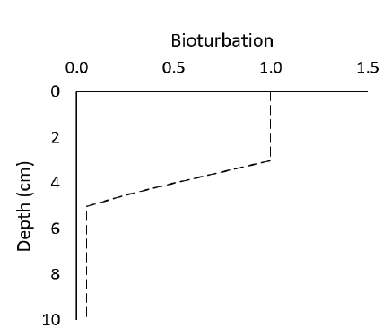
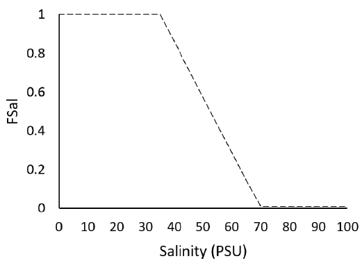
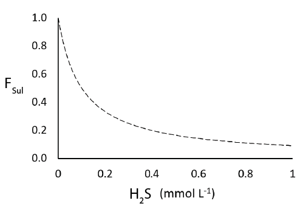
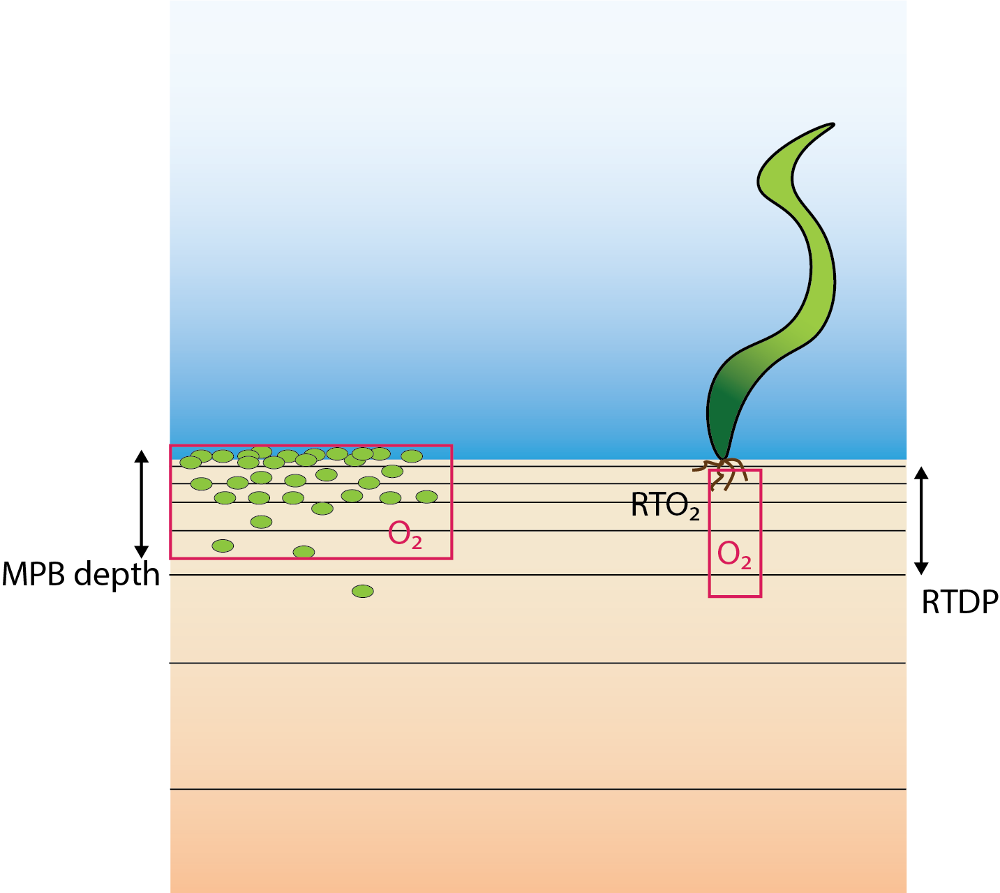
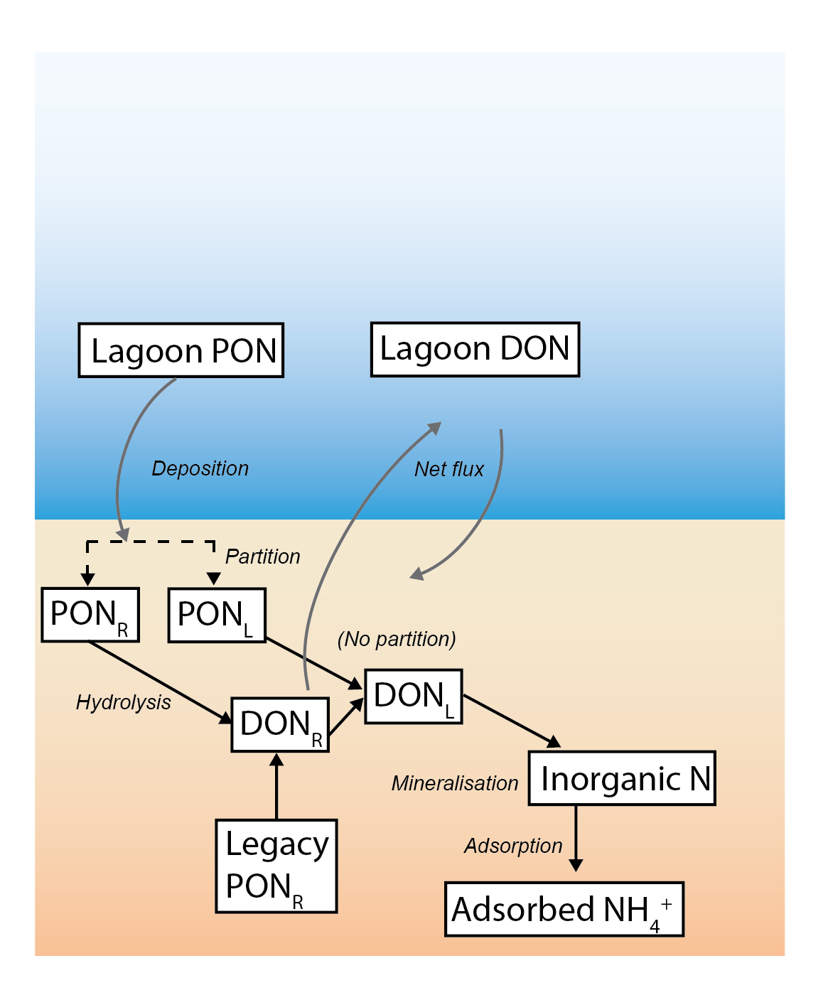
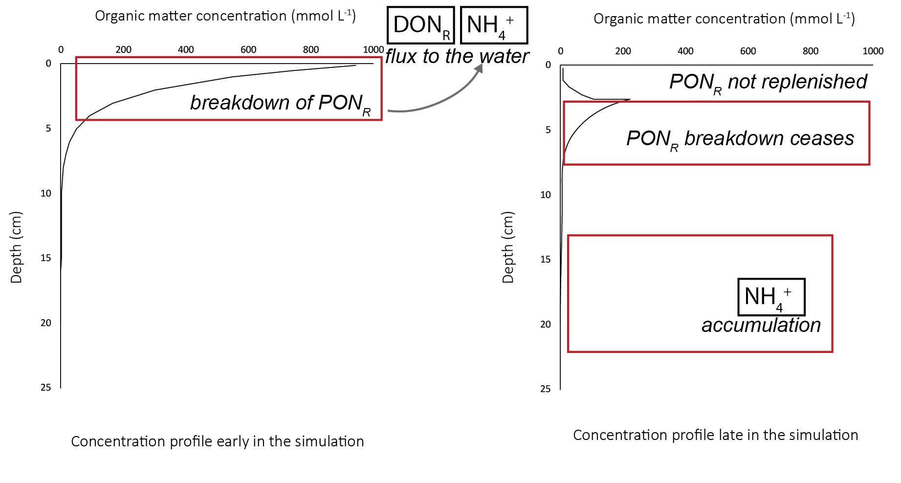

# Sediment Biogeochemistry

## Overview

In environments like the Coorong, where nutrient dynamics influence the rest of the ecosystem, management often focuses on reducing nutrient inputs and increasing flushing to the sea. However, it is important to understand the role of the sediment as a long term source or sink of nutrients.

In previous versions of the Coorong model, a static model to capture nutrient flux rates has been used for simulating water quality within the lagoon -- for example consumption of oxygen and release of ammonium based on assigned flux rates. This is an efficient and simplified first step, however, the model can be improved by using the depth-resolved sediment diagenesis model to allow the dynamic feedback between sedimentation of particualte material, and the subsequent processing and release of nutrients in dissolved form. The sediment model can represent spatial heterogeneity along the lagoon, it can capture the future burial or release of nutrients and it can make use of the rich data sets measured in the field.

Under some conditions, the sediment stores can release nutrients to the water column, while under other conditions, the sediment can remove nutrients in the long term through burial, and the surface layers can remove nitrogen through denitrification. The fine balance that controls the conditions under which the sediment stores will store, release or remove nutrients is largely governed by the aerobic state of the sediment pore water, and the amount of reactive organic matter fuelling the reactions. There is therefore a need for a depth-resolved sediment model that can accounts for mixing from the hydrodynamic model into the upper sediment layers and is able to calculate whether organic matter is consumed aerobically, through denitrification or deeper down, through sulfate reduction or even methanogenesis.

The aim of this Chapter is to summarise the development of a sediment biogeochemistry model suitable for application to the Coorong, accounting for controls on nutrient cycling and burial, and able to be used to assess relevant management scenarios. The sediment model has been developed to be able capture and contrast different environments along the length of the Coorong. Since. the north lagoon of the Coorong has higher populations of macrobiota (Dittman et al. 2021), which cause mixing of oxygen into deeper sediment layers, which in turn helps in removal of organic matter and reduced nitrogen, it was also a requirements that the model needs to include a depth of bioturbation and bioirrigation by the macrobiota living in the sediment. In contrast, in the south lagoon there is less bioturbation of the sediment and it is more likely that organic matter is consumed through anaerobic processes. The production of toxic $H_2S$ gas through sulfate reduction would lead to a further degradation of the ecosystem.

## Model approach: CANDI-AED

### Sediment reactive transport model {.unnumbered}

The heart of this model is a reaction, diffusion, advection model termed CANDI-AED; a schematic overview of the model is shown in Figure \@ref(fig:dev-pic00). The model resolves the 1D (vertical) sediment and pore-water concentration profiles. Each active sediment "zone" is a column discretized into a user-defineable number of layers that start at thicknesses of around 1 mm at the sediment-water interface and increase down to a pre-defined sediment depth.


```{r dev-pic00, echo = FALSE, out.width='80%', class = "text-image", fig.align='center', fig.cap = "CANDI-AED includes chemical processes of organic matter transformation and oxidation, and reduction/oxidation, crystallisation, adsorption and precipitation reactions of inorganic by-products. Most of the processes are triggered by the input of POM at the sediment-water interface."}

knitr::include_graphics("images/dev/sed_image2.png")

```


 The CDM sediment modelling approach uses the CANDI-AED model configurable through the AED $SDG$ module, as outlined in the [AED science manual](https://aquaticecodynamics.github.io/aed-science/sediment-biogeochemistry.html). The configuration used in the CDM simulations resolves both physical (e.g. pore-water diffusion or bioturbation) and chemical (e.g., redox transformations) processes as summarised below.

**Chemical reactions**

The dynamic model considers two types of reactions - the slow, kinetically controlled reactions, and the fast thermodynamically based equilibrium reactions. The latter are simulated in the sediment through appropriate configuration of the geochemistry reactions; the configuration of the equilibrium model will apply to both the water and each of the sediment layers. The kinetically controlled reactions are mostly microbially-mediated and include the reactions for organic matter breakdown and eventual oxidation, the re-oxidation of various by-products and the dynamics of the metal sulfides.

The organic matter ($OM$) degradation pathway considers labile and refractory $DOM$ components ($DOM_L$ and $DOM_R$ respectively) and the breakdown pathway simulated is conceptually summarized in Figure \ref{fig:sed_dynamic}. Reactions included in the kinetic component include the hydrolysis of the complex (e.g., high molecular weight) $OM$ pools ($POM_{VR}$, $POM_R$, $DOM_R$, $POM_L$) and transformation of low molecular weight (LMW) $DOM_L$ by oxidants ($O_2$, $MnO_2$, $Fe(III)$ and $SO_4^{2-}$ - the so-called 'terminal metabolism'), and the release of resulting nutrients ($NO_3^-$, $NH_4^+$, $PO_4^{3-}$) and reduced by-products ($Mn^{2+}$, $Fe^{2+}$, $N_2$, $H_2S$, $CH_4$) and $CO_2$. In addition to the primary redox reactions associated with $OM$ breakdown, the model also includes numerous secondary reactions, such as oxidation of reduced by-products (e.g., Fe or S oxidation).

**Physical processes**

The model accounts for advection and diffusion processes of solid and solute consituents. Porosity ($\phi$) is defined to decrease with depth, and for the porewater components, diffusion coefficients are used that are based on free-solution molecular diffusion constants corrected for sediment tortuosity, $θ$. For bioturbation, the model uses a diffusion coefficient that varies with depth ($D_{B(z)}$) as a two layer function or a Gaussian decrease. The irrigation of pore water is also simulated to account for the activity benthic infauna in the upper sediment. 

Fluxes of dissolved species occur between the sediment and water column depending on the sediment type (e.g. porosity), the solute type, and the degree of interfacial turbulence being experienced at the sediment-water interface. Dissolved fluxes are calculated from the concentration gradient at the sediment-water interface according to Fick's Law:

<center>

```{=tex}
\begin{equation}
F = D_{0}\frac{\Delta C}{\Delta x} = \frac{D_{0}}{\delta} (C_{bw} - C_{1})
(\#eq:biogeochem1)
\end{equation}
```
</center>

where $D_{0}$ is the diffusivity at the SWI, $\delta$ is the thickness of the diffusive boundary layer at the sediment-water interface, defined as the length scale of the first sediment layer, $C_{bw}$ is the bottom water concentration and $C_{1}$ is the concentration in the top sediment layer. The diffusivity in these models typically assumes molecular diffusivity rates, which is likely to underestimate the real diffsuivity experienced in a shallow lagoon such as the Coorong. In the CDM, a new parameterisation to resolve diffusivity based on sediment type an water turbulence properties was added.

<br>

### Model extensions and development {.unnumbered}

The above model approach is broadly used in lakes, ocean and estuarine environments, but there remain few cases in shallow lagoons (Paraska et al. 2014). Three main developments have been undertaken to adapt the CANDI_AED vertical column model to the Coorong application:

-   Improved parameterisation of diffusion at the sediment-water interface, based on $\tau_b$.
-   Inclusion of functionality to resolve resuspension effects
-   Addition of MPB and macrophyte roots $O_2$ sources into the sediment
-   Bioturbation rates linked to salinity and $H_2S$  concentrations
-   $NH_4^+$, $PO_4^{3-}$ and $DOM$ adsorption
-   Allocation of a unreactive organic matter pool

In addition, to the physical and chemical processe updates described abve, the $SDG$ module was further developed to support multi-zone operation of the CANDI-AED model, dynamic links with MPB, MAG and MAC modules, and the ability to allow for spin-up of sediment profiles.


#### Resolving sediment zonation {.unnumbered}

Facility was developed within the model to allow the use of multiple independent sediment zones across the domain, which are identical to the above CANDI-AED description but are not necessarily coincident with the grid-structure of the water. This way sediment zones may be defined for the domain, and depending on the nature of the grid, the water cells above the sediment are averaged for the purposes of the interfacial fluxes, allowing more efficient simulations (see for example Figure \@ref{fig:dev-pics3}). Using zones is a practical compromise between computational efficiency and capturing spatial heterogeneity in sediment properties and their fluxes.

```{r dev-pics3, echo = FALSE, out.width='100%', class = "text-image", fig.cap = "Schematic depicting sediment zone numerical approach."}

knitr::include_graphics("images/dev/sed_picture5.png")

```

#### Sediment-water coupling {.unnumbered}

The sediment and hydrodynamic models are coupled at the sediment-water interface (Figure \@ref(fig:dev-pics5)). The AED model setup has separate functions for coupling the bottom-most cell of the TUFLOW-FV hydrodynamic model to the top-most layer of the sediment model:

-   flux of solid material onto the sediment surface from the water column: *part_sed_link*
-   concentration of dissolved substances in the bottom water to the sediment: *water_link*
-   flux of dissolved substances from the top sediment layer to the water column: *diss_flux_link*

```{r dev-pics5, echo = FALSE, out.width=c('45%','35%'), class = "text-image",fig.show='hold',fig.align='center', fig.cap = "Schematic of sediment water coupling approach. Left: the three linking options between the water column and sediment models. Right: Water column cell concentrations and fluxes within a zone are averaged and transferred between the models."}

knitr::include_graphics(c("images/dev/sed_picture3.png","images/dev/sed_picture4.png"))

```


**Zone tracer experiment**. To test the new sediment-water coupling functions, a simple simulation was set up using a simulation with five zones. A dissolved species was used, which had a reaction rate of zero, and so it acted as a tracer. Zones were set as active sediment model zones, with especially high concentrations of tracer. The  simulation was sued to show the flux link was working between the sediment and the water, including the zone averaging algotirhm.


#### Sediment-water interface fluxes {.unnumbered}

Flux across the sediment-water interface was governed by three factors:\
-   Advection\
-   Bioturbation\
-   Bioirrigation

The advection component of this was composed of\
-   Molecular diffusion\
-   Porewater flux\
-   Sediment particle deposition

Molecular diffusion was driven by differences in chemical concentration across the sediment-water interface. For example, high $NH_4^+$ concentration in the sediment fluxes to the lower concentration in the water column. In this simulation there was no external porewater flux, from, say groundwater inflow. The sediment particle deposition rate (*w~00~*) was set to have the same value across the whole of the domain (1 cm y^-1^). (The particle deposition model was developed in the water column model during this project and a link for water column particle deposition between the models was not implemented in this study.) A link was developed for the shear stress at the sediment-water interface, such that molecular diffusion was increased when the motion in the water column was higher. The sensitivity of sediment-water diffusion to bottom water motion was assigned by the parameter *tau~b~sensitivity*. The values for\* tau~b~sensitivity can be found in the physical parameters table above. The sensitivity was set to be higher in the southern zones. The diffusion was also sensitive to the amount of macroalgae and seagrass roots in each zone, where a high amount of either reduced $tau_b$ to zero, leading to diffusion being mostly controlled by chemical concentration gradient.

Bioturbation was set up using the step-wise function, where *x~1~* was the depth of full bioturbation, and *x~2~* the depth of zero bioturbation (Figure \@ref(fig:dev-picsbudgetsetup-4)). The values for *x~1~* and *x~2~* can be found in the physical parameters table above. In this simulation, the values were assigned for each zone, with deeper vales for the northern zones. The rate constant *DB~0~* was assigned to be the same for all zones. The original model had a constant bioturbation rate assigned at the initialisation step. For this simulation the model was developed to have a dynamic bioturbation rate that is updated at every time step.

```{r dev-picsbudgetsetup-4, echo = FALSE, out.width='50%', class = "text-image",fig.show='hold',fig.align='center', fig.cap = "Diagram of bioturbation setup, showing full bioturbation above the parameter *x~1~* and no bioturbation below *x~2~*."}



```

Bioirrigation was set up as a depth at which non-local transport occurred, using the parameter *x~irrig~*. The value for *x~irrig~* can be found in the physical parameters table above, and as with *x~1~*, the depths of *x~irrig~* were assigned to each zone, to reflect the decrease of benthic fauna in the southern zones. 

Within the Coorong, particularly, in the hot summer months as the water in the southern lagoon evaporates, the remaining water becomes hypersaline. The hypersaline water kills the macroinvertebrate fauna, which causes a decrease in fauna-driven mixing of the upper sediment. The model for bioturbation and irrigation was set to  update at each time step. As $F_{Sal}$ and $F_{Sal}$ were updated at each time step, bioturbation and bioirrigation were therefore dynamically dependent on water column salinity and $H_{2}S$ concentration.

#### Denitrification

One way to remove nitrogen from the modelling domain is conversion of dissolved N to $N_2$, which then makes it unreactive: this is generally referred to as 'denitrification'. The two specific processes that create $N_2$ that are used in this model are deammonification ($R_{NH_{4}NO_{2}}$) and denitrousation ($R_{Denitrousation}$). Deammonification is the reaction between $NO_2^-$ and $NH_4^+$ and so it is dependent on the concentration of the reactants, and the process is also inhibited by $O_2$. Deammonification relies on partially-oxidised N as $NO_2^-$ as well as an anoxic environment. Denitrousation converts the N in $N_2O$ to $N_2$ by oxidising organic matter, and so the rate is highly dependent on organic matter concentration, as well as formation of $N_2O$. Both of these processes require a dynamic oxic-anoxic environment to create the reactants and allow the denitrification reactions to occur uninhibited. These reactions are also inhibited by high salinity, through the $F_{Sal}$ term.

#### Salinity and denitrification {.unnumbered}

Salinity was set as a permanently linked variable from the water column AED model, without using *water_link*.

A special salinity factor, $F_{Sal}$ was developed for the salinity in the Coorong, to inhibit processes at hypersaline concentrations. $F_{Sal}$ ranges from 1 to 0, as set between salinity concentration parameters *Sal1* and *Sal2* (PSU).

The equations for $F_{Sal}$ are given below.

```{=tex}
\begin{eqnarray}
     If   Salinity < Sal_1 \ \ then \  \     F_{Sal} = 1 \  
    \\
    \\
     If   Salinity > Sal_1  then     \frac {Sal_2 - Salinity} {Sal_2 - Sal_1} \  
    \\
    \\
     If   Salinity > Sal_2  then      F_{Sal} = 1 \  
\end{eqnarray}
```

The effect of the scaling is shown in Figure \@ref(fig:dev-picsbudgetsetup-2).

```{r dev-picsbudgetsetup-2, echo = FALSE, out.width='50%', class = "text-image",fig.show='hold',fig.align='center', fig.cap = "Diaagram of the salinity factor $F_{Sal}$, scaling between 1 and 0 between the parameters. In this diagram *Sal~1~* is 40 and *Sal~2~* is 70."}



```

The values for *Sal~1~* and *Sal~2~* can be found in the physical parameters table above. In this simulation, the same value for all was used in all zones.

$F_{Sal}$ was applied to biota-driven mixing (see below) and to the nitrogen redox reactions. It was multiplied by the following reactions:

-   *R~N2O~*
-   *R~NO2~*
-   *R~NO3~*
-   *R~NH4ox~*
-   *R~NH4NO2~*
-   *R~NO2O2~*
-   *NH~4~^+^ adsorption*

The term affected all rates equally and so did not favour the concentration of any of the species. However, it slowed down the transformation of each species into the other, and increased the effect of transport reactions and depth-driven concentration gradients. Since $PON_R$, $O_2$ and $NO_3^-$ entered the domain from above and $NH_4^+$ generally accumulated with depth, they were subject to more transport before they were reacted.

#### Sulfur and denitrification {.unnumbered}

As mentioned above, $SO_4^{2-}$ bottom water concentrations were tied to salinity and initial $SO_4^{2-}$ concentrations were set to reflect the salinity gradient along the estuary. Consequently, the generation of $H_{2}S$ was higher in the southern zones. High $H_{2}S$ concentration was set to inhibit biota-driven mixing and nitrogen redox reactions, on the basis that $H_{2}S$ is toxic to organisms. An $H_{2}S$ factor, $F_{Sul}$, was set up as an inhibition factor similar to other inhibition factors in the sediment model.

```{=tex}
\begin{eqnarray}

F_{Sul} = \frac {K_{H_{2}S}} {(K_{H_{2}S} + H_{2}S)} 

\end{eqnarray}
```
As with $F_{Sal}$, $F_{Sul}$ scales between 1 and 0, however, as a decay rather than a stepped function (Figure \@ref(fig:dev-picsbudgetsetup-3)). The value for *K~H2S~* can be found in the physical parameters table above. In this simulation, the same value for all was used in all zones.

```{r dev-picsbudgetsetup-3, echo = FALSE, out.width='50%', class = "text-image",fig.show='hold',fig.align='center', fig.cap = "Diagram of the $H_2S$ factor, $F_{Sul}$, scaling from 1 to 0 as $H_2S$ concentration decreases. "}



```

As with $F_{Sal}$, $F_{Sul}$ was applied to biota-driven mixing (see below) and to the nitrogen redox reactions. It was multiplied by the following reactions:

-   *R~N2O~*
-   *R~NO2~*
-   *R~NO3~*
-   *R~NH4ox~*
-   *R~NH4NO2~*
-   *R~NO2O2~*
-   *NH~4~^+^ adsorption*


#### Nutrient sorption and burial {.unnumbered}

A process for removing nutrients from the active zone was burial of the nutrients deep in the sediment. As much of the nutrient calibration was based around calculating the mass in the top 5 cm (see Calibration section above), a measurement of burial was defined as the change in mass at 5 cm over time.

Another mechanism of nutrient removal was adsorption of dissolved nutrients onto solid particles. $NH_4^+$ was simulated as precipitating onto solid particles, including organic matter and clay. Since the Coorong sediment survey showed high concentrations of orgnaic matter and clay, it was assumed that there were unlimited adsorption sites for $NH_4^+$, and the relative amounts of $NH_4^+$ were assigned by the adsorption constant as per the methods in Van Cappellen and Wang (1996), which was ultimately based on Mackin and Aller (1984). The adsorption constant was set to the same value in all zones, which can be found in the geochemistry parameter table above. A simplified version of the adsorption equations adsorption can be found below (the full equations correct for porosity and solid volume when transferring between particulate and dissolved phases).

<center>

```{=tex}
\begin{eqnarray}

NH_{4 _{Total}}^+       = NH_{4}^+ + NH_{4_{Adsorbed}}
\\
\\
NH_{4 _{Dissolved}}^+   = \frac {1}{K_{NH_4p}}
\\
\\
NH_{4 _{Particulate}}^+ = 1 - NH_{4 _{Dissolved}}^+ F_{Sal}
\\
\\
NH_{4 _{Particulate}}^+ = NH_{4_{Total}}^+ NH_{4 _{Particulate}}^+
\\
\\
NH_{4 _{Dissolved}}^+   = NH_{4_{Total}}^+ - NH_{4 _{Particulate}}^+

\end{eqnarray}
```

</center>

A similar approach was taken for dissolved organic carbon, nitrogen and phosphrous. The $DON_R$ and $DON_S$ are adsorbed to the sediment with the adsorption constant *K~DOMP~*, and $DOP_R$ and $DOP_S$ adsorbed using the same adsorption constant *K~DOMP~*. The value for *K~DOMP~* defaults to 1.4 and the model defaults to being switched on.

$PO_4^{3-}$ was adsorbed onto the surfaces of iron oxide particles, both the reactive $Fe(OH)_{3A}$ and unreactive $Fe(OH)_{3B}$ fractions. (While the sediment model has optional configurations, as outlined in the AED Manual, in this simulation the options *PO4AdsorptionModel* = 1 and *ads_use_pH* = TRUE.) The overall property of this setup was that low oxygen and nitrate concentrations in the sediment cause iron oxide reduction, which dissolves the solid particles and releases the dissolved $PO_4^{3-}$ to the porewater.

```{=tex}
\begin{eqnarray}

PO_{4_{Particulate}}^{3-} = \frac {K_{PO_4p} (Fe(OH)_{3A} + Fe(OH)_{3B})} 
{1 + K_{PO_4p} (Fe(OH)_{3A} + Fe(OH)_{3B}) } (PO_{4 _{Total}}^{3-})
\\
\\
PO_{4_{Dissolved}}^{3-}   = \frac {1} {1 + K_{PO_4p} (Fe(OH)_{3A} + Fe(OH)_{3B}) } (PO_{4 _{Total}}^{3-})

\end{eqnarray}
```

The final feature developed for nutrient burial for this project was the very unreactive organic matter parameter. As mentioned in the model setup above, the organic matter setup in this model has labile and refractory phases, as state variables. The model was extended in this project by dropping the reactivity of the particulate refractory phase towards zero as the concentration approaches a minimum. For $PON_R$, the parameter *ponu* set the minimum concentration and *KOMPres_N* set the sensitivity of the decrease, as in the equation below. The equivalent parameters for C an P were *pocu* and *popu*, and *KOMPres_C* and *KOMPres_P*.

```{=tex}
\begin{eqnarray}

komlim = \frac {PON_R - ponu} {PON_R - ponu + KOMPres_N} 
\\
\\
R_{PONR} = (ponr2donr) (komlim)

\end{eqnarray}
```
(The equation above is a simplified version, where the full equation had checks to prevent the rate going below zero, plus the respiration processes of $MPB$.)

#### Plants, microphytobenthos and macroalgae

$O_2$ is injected into the sediment from microphytobenthic algae ($MPB$) and from plant roots. The oxygen is not part of the mass balance of the ecosystem and it is not in any stoichiometric balance with biomass or $∑CO_2$. The depths where the $O_2$ is injected are set separately for $MPB$ and roots. The $O_2$ in these layers from $MPB$ is set as a rate of both gross primary production ($Rgpp O_2 input$) and respiration ($Rrsp O_2 consumption$). The rate $Rgpp$ is calculated as a function of the $MPB$ production rate, the parameter *fgpp~sflux~* and a decay with depth. The production rate is linked directly to the rate calculated in the water column model. Similarly, the rate $Rrsp$ is calculated as a function of the respiration rate, the same parameter *fgpp~sflux~* and a decay with depth. The respiration rate is also linked directly to the rate calculated in the water column model. Below the parameter *MPBDepth*, $Rgpp$ is zero, which means that the $MPB$ cannot photosynthesise without light. Below *MPBDepth* the rate $Rrsp$ is the product of $MPB$ biomass and 52 days, which means that the cells die within a week without access to light.

The rate of $O_2$ injection from roots is calculated from the variable $RTO_2$, which applies above the depth $RTDP$. Both $RTO_2$ and $RTDP$ are linked directly from the water column model.

```{r dev-picsbudgetsetup-5, echo = FALSE, out.width='75%', class = "text-image",fig.show='hold',fig.align='center', fig.cap = "Schematic of the new parameterisation of $O_2$ injection into the sediment. Left: $O_2$ is released where $MPB$ are respiring. Right: $O_2$ comes from plant roots to the depth of *RTDP*."}



```


## Coorong model setup and configuration

### Site description and zonation

**Spatial aggregation - ten regions** In order to simplify the Coorong study site measurement points and simulation areas, the lagoon was divided into ten separate Coorong regions from north to south, that were then split into the simulated zones (refer to Chapter 4 and Figure \@ref(fig:dev-31z)). These were primarily based on the natural boundaries, channels and sandbars of the estuary. Regions 1 to 4 were the southern lagoon, region 5 was the intermediate area and region 6 to 10 were in the northern lagoon (Figure \@ref(fig:dev-pics1)).

```{r dev-pics1, echo = FALSE, out.width='45%', class = "text-image",fig.show='hold',fig.align='center', fig.cap = "Example sediment zonation."}

knitr::include_graphics(c("images/dev/sed_Zones.png","images/dev/sed_ZonesSat.png"))

```

**Deep and shallow sites** The ten Coorong regions were further subdivided into three zones each -- the western bank on the ocean side, the central channel, and the eastern bank on the inland side. The cut-off between the channel and the bank subdivision was defined by any area that reached more than 1 m deep. Therefore, each of the ten regions along the length of the lagoon had three zones across the breadth of the lagoon, and region ten had one additional zone for the ocean boundary, giving 31 zones in total (Figure \@ref(fig:dev-pics2)).

```{r dev-pics2, echo = FALSE, out.width='45%', class = "text-image",fig.show='hold',fig.align='center', fig.cap = "Example sediment zonation."}

knitr::include_graphics(c("images/dev/sed_Half Page zones11to104.png","images/dev/sed_Half Page zones61to73.png"))

```

#### Validation sites and data {.unnumbered}

A range of data was collected and is documented in [Appendix A](Appendix A : Data Catalogue). In summary, there were five broad categories of field data available from the HCHB research project surveys for the $SDG$ module setup and parameterisation:

*Grab samples -- C, N, P, Mn, Fe, S* : These were available for many sites but only one or two depths. They were useful for averaging a concentration at depth within a zone. These were key variables for sediment biogeochemistry.

*Cores -- Fe, S, NH~4~^+^, PO~4~^3-^ GHGs* : The cores were available for only around four sites, but they were used for calibrating depth profiles and sediment-water fluxes. These often had data measured in the day and the night, as well as in November and March, which all had different concentrations and fluxes. The challenge was to capture both day and night conditions, while also capturing seasonal changes.

*Sediment quality* : These measurements were used for setting the initial porosity parameters. Once these were set they were not tuned further.

*Macroinvertebrates -- bioturbation parameters* : Benthic infauna measurements were used for setting bioturbation and bioirrigation parameters. Broadly, the North Lagoon had high bioturbation and the South Lagoon had very little bioturbation. The depth to bioturbation was important, as it was expected that there was uninhabited black ooze below a few centimetres.

*Water column water quality measurements* : These were used for estimating water column concentrations and influxes for variables that were not able to be linked to active AED modules used for the water column model.


### Model setup and application approach

#### Simulated variables {.unnumbered}

In total, each sediment zone was configured to include a total of 42 simulated constituents. All simulated variables are listed in Table \@ref(tab:3dev-sedvars).

<center>

```{r 3dev-sedvars, echo=FALSE, message=FALSE, warning=FALSE}
 library(knitr)
 library(kableExtra)
 library(readxl)

 sediment_vars <- read_xlsx("tables/BookdownSDGVars.xlsx", sheet = "Vars" )
 kable(sediment_vars,"html", escape = F, align = "c", caption = "All sediment variables",
       bootstrap_options = "hover") %>%
   kable_styling(sediment_vars, bootstrap_options = "hover", 
                 full_width = F, position = "center", 
                 font_size = 12) %>% 
   row_spec(0, background = "#14759e", bold = TRUE, color = "white") %>%  
   column_spec(1, width_min = "10em") %>%
   column_spec(1, width_min = "10em") %>%
   column_spec(1, width_min = "10em") %>%
   row_spec(1, background = 'white') %>% 
   scroll_box(width = "400px", height = "200px",
              fixed_thead = FALSE)
```

</center>

<br>

\

#### Water column linkages {.unnumbered}

Where possible, simulated sediment variables were dynamically 'linked' to their water column counterpart to assign the upper sediment boundary condition. 

Nutrients, TN and TP, are transferred between the water column model and the sediment model in three ways:

-   Solids fluxed to the sediment via the *part_sed_link* term, using the link variables from the AED organic matter module *OGM_pon_swi* and *OGM_pop_swi*.
-   Dissolved species were fluxed from the sediment to the water column via the *diss_flux_link* terms *SDF_Fsed_don* and *SDF_Fsed_dop* for organics, and *SDF_Fsed_nit* and *SDF_Fsed_amm* for $NO_3^-$ and $NH_4^+$.
-   Dissolved species took their upper sediment concentration from the water column bottom water concentration via the *water_link* term, using *OGM_don* and *OGM_dop* for organics and *NIT_nit* and *NIT_amm* for $NO_3^-$ and $NH_4^+$.

The linked variables are listed in Table \@ref(tab:3dev-sedlinkvars). As outlined above, they can be linked by concentration, dissolved flux and particle flux.  The $SO_4^2-$ link is set such that $SO_4^2-$ concentration in mmol L^-1^ is 0.9 × salinity (PSU).

```{r 3dev-sedlinkvars, echo=FALSE, message=FALSE, warning=FALSE}
 library(knitr)
 library(kableExtra)
 library(readxl)

 sediment_linkvars <- read_xlsx("tables/BookdownSDGVars.xlsx", sheet = "Links" )
 kable(sediment_linkvars,"html", escape = F, align = "c", caption = "Linked sediment parameters",
       bootstrap_options = "hover") %>%
   kable_styling(sediment_linkvars, bootstrap_options = "hover", 
                 full_width = F, position = "center", 
                 font_size = 12) %>% 
   row_spec(0, background = "#14759e", bold = TRUE, color = "white") %>%  
   column_spec(1, width_min = "10em") %>%
   column_spec(2, width_min = "20em") %>% 
   column_spec(3, width_min = "10em") %>% 
   column_spec(4, width_min = "10em") %>%
   column_spec(5, width_min = "10em") %>%
   column_spec(6, width_min = "10em") %>%
   row_spec(1:10, background = 'white') %>% 
   scroll_box(width = "650px", height = "400px",
              fixed_thead = FALSE)
```
<br>

Sediment nutrients were present in several phases: - organic and inorganic, - dissolved and particulate, - labile and refractory, and - oxidised and reduced. This is also the case for water column nutrients, however, they were not simulated as labile and refractory. Therefore, the *part_sed_link* water column $PON$ was partitioned into $PON_L$ and $PON_R$ with the term *part_sed_scale*. In this simulation, the value for $PON$ was 0.5 (and for all other variables the value was 1). The *diss_flux_link* of water column $DON$ and $DOP$ were linked to sediment $DON_R$ and $DOP_R$ only Figure \@ref(fig:dev-picsbudgetsetup-1).


```{r dev-picsbudgetsetup-1, echo = FALSE, out.width='50%', class = "text-image", fig.show='hold' , fig.align='center', fig.cap = "Schematic of major N pools, as transferred between the water and sediment models. The water column PON is partitioned into labile and refractory fractions in the sediment. The refractory DON is fluxed back to the water column."}



```


The flux of $Fe(OH)_{3A}$ from the water column to the sediment is set from the parameter 'default_vals'. In the water column model, Fe is not simulated, therefore one value was applied equally to all zones. The value was calibrated to fit the $Fe^2+$ concentration value.
<br>

\

#### Initialisation and spinup {.unnumbered}

Most chemical species are initialized at zero concentration. Some species are initialised as guided by the available field data (Table \@ref(tab:3dev-init)), or where field measurements were not available, then literature sources for coastal sediment were assumed. From the initial tests, it was assumed the bulk of the nutrients were the in the refractory organic phases, e.g., $PON_R$ and $POP_R$.


```{r 3dev-init, echo=FALSE, message=FALSE, warning=FALSE}

sediment_initial <- read_xlsx("tables/BookdownSDGVars.xlsx", sheet = "Initial" )
kable(sediment_initial,"html", escape = F, align = "c", caption = "Sediment initial conditions", 
     bootstrap_options = "hover") %>%
 kable_styling(sediment_initial, bootstrap_options = "hover",
               full_width = F, position = "center",
               font_size = 12) %>%
 row_spec(0, background = "#14759e", bold = TRUE, color = "white") %>%  
 column_spec(1, width_min = "10em") %>%
 column_spec(2, width_min = "20em") %>%
 column_spec(3, width_min = "10em") %>%
 column_spec(4, width_min = "10em") %>%
 row_spec(1:10, background = 'white') %>%
 scroll_box(width = "650px", height = "400px",
            fixed_thead = FALSE)
```

<br>

\

#### Model parameters {.unnumbered}

##### Physical domain and numerical parameters {.unnumbered}

The physical properties of the sediment are given in Table \@ref(tab:3dev-Mixing) and \@ref(tab:3dev-Layers). In general, the SDG module was set to run with a time-step of 2 hours, resolve a vertical sediment depth of 80cm using 50 layers. 

Some parameters are set as constant values for all zones, while others are set to be variable in each zone. The variability of bioturbation and irrigation along the length of the lagoon is set using the depth of the effect ($x_1$, $x_2$ and $x_{irrig}$) rather than the intensity ($DB_0$, $\alpha_0$). Upper porosity $\rho_0$ is held at 0.9 (i.e. 90% porewater) for all zones and the lower porosity $\rho_{00}$ is based on measured data at sites in each zone.

<!-- 2 Mixing -->

```{r 3dev-Mixing, echo=FALSE, message=FALSE, warning=FALSE}
sediment_Mixing <- read_xlsx("tables/BookdownParams.xlsx", sheet = "Mixing" )
kable(sediment_Mixing,"html", escape = F, align = "c", caption = "Sediment physical properties", 
     bootstrap_options = "hover") %>%
   kable_styling(sediment_initial, bootstrap_options = "hover",
               full_width = F, position = "center",
               font_size = 12) %>%
 row_spec(0, background = "#14759e", bold = TRUE, color = "white") %>%  
 column_spec(1, width_min = "10em") %>%
 column_spec(2, width_min = "20em") %>%
 column_spec(3, width_min = "10em") %>%
 row_spec(1:5, background = 'white') %>%
 scroll_box(width = "600px", height = "200px",
            fixed_thead = FALSE)
```

<!-- 3 SedimentLayers -->
\

```{r 3dev-Layers, echo=FALSE, message=FALSE, warning=FALSE}
sediment_Layers <- read_xlsx("tables/BookdownParams.xlsx", sheet = "Layers" )
kable(sediment_Layers,"html", escape = F, align = "c", caption = "Sediment layer setup parameters and mixing parameters that vary by zone.", 
     bootstrap_options = "hover") %>%
   kable_styling(sediment_initial, bootstrap_options = "hover",
               full_width = F, position = "center",
               font_size = 12) %>%
 row_spec(0, background = "#14759e", bold = TRUE, color = "white") %>%  
 column_spec(1, width_min = "10em") %>%
 column_spec(2, width_min = "20em") %>%
 column_spec(3, width_min = "10em") %>%
 row_spec(1:5, background = 'white') %>%
 scroll_box(width = "600px", height = "300px",
            fixed_thead = FALSE)
```

<br>

\

##### Organic matter parameters {.unnumbered}

Many of the key processes in the sediment are driven by organic matter oxidation. Fresh organic matter supplied to the sediment surface fuels the bacterially-driven primary redox reactions that constantly shift the chemical equilibrium in the sediment. Organic matter metabolism also releases organic N and P to the water column. The parameters are given in Table \@ref(tab:3dev-OM).

The organic matter model option number 2 was used in this project. This option has both particulate and dissolved organic phases, and simulates organic C, N and P as separate state variables.

<!-- 4 OM -->

```{r 3dev-OM, echo=FALSE, message=FALSE, warning=FALSE}
sediment_OM <- read_xlsx("tables/BookdownParams.xlsx", sheet = "OM" )
kable(sediment_OM ,"html", escape = F, align = "c", caption = "Organic matter oxidation parameters", 
     bootstrap_options = "hover") %>%
   kable_styling(sediment_initial, bootstrap_options = "hover",
               full_width = F, position = "center",
               font_size = 12) %>%
 row_spec(0, background = "#14759e", bold = TRUE, color = "white") %>%  
 column_spec(1, width_min = "10em") %>%
 column_spec(2, width_min = "20em") %>%
 column_spec(3, width_min = "10em") %>%
 row_spec(1:5, background = 'white') %>%
 scroll_box(width = "600px", height = "300px",
            fixed_thead = FALSE)
```

<br>

\

##### Organic matter initialisation {.unnumbered}
Organic matter was initialised with profiles that had a higher concentration in the upper layers of the sediment. (All other variables were initialised with concentrations that were constant with depth.) This is due to the common assumption that organic matter concentration decreases with depth, based on the degradation of water column-derived organic matter over time. Refractory species (particulate and dissolved) used the linear method and labile species (particulate and dissolved) used the exponential method. The linear method set the initial concentration at the surface, a minimum concentration as a fraction of the initial concentration (*OM_minR*), and a depth at which the minimum concentration would be reached (*InitMinDepthR*). The exponential method set the initial concentration, and an exponential decay constant (*OM_cfL*). An example of how the initial profiles appear is given in \@ref(fig:dev-pics2b). 

\

```{r dev-pics2b, echo = FALSE, out.width='100%', class = "text-image",fig.show='hold',fig.align='center', fig.cap = "Organic matter initial profiles. Left - linear profiles for refractory species. Right - exponential profiles for labile species."}

knitr::include_graphics(c("images/dev/sed_OMInitialProfiles-02.png"))

```


\

##### Secondary redox reactions {.unnumbered}

Secondary redox reactions are formed from the by-products of primary redox reactions. The nitrogen redox cycle parameters are given in Table \@ref(tab:3dev-NRedox).

<!-- 5 NRedox -->

```{r 3dev-NRedox, echo=FALSE, message=FALSE, warning=FALSE}
sediment_Nredox <- read_xlsx("tables/BookdownParams.xlsx", sheet = "NRedox" )
kable(sediment_Nredox ,"html", escape = F, align = "c", caption = "Nitrogen redox cycle parameters", 
     bootstrap_options = "hover") %>%
   kable_styling(sediment_initial, bootstrap_options = "hover",
               full_width = F, position = "center",
               font_size = 12) %>%
 row_spec(0, background = "#14759e", bold = TRUE, color = "white") %>%  
 column_spec(1, width_min = "10em") %>%
 column_spec(2, width_min = "20em") %>%
 column_spec(3, width_min = "10em") %>%
 row_spec(1:5, background = 'white') %>%
 scroll_box(width = "600px", height = "300px",
            fixed_thead = FALSE)
```

Secondary redox parameters for other processes are given in Table \@ref(tab:3dev-SecondaryRedox).

<!-- 6 SecondaryRedox -->

```{r 3dev-SecondaryRedox, echo=FALSE, message=FALSE, warning=FALSE}
sediment_SecondaryRedox <- read_xlsx("tables/BookdownParams.xlsx", sheet = "SecondaryRedox" )
kable(sediment_SecondaryRedox ,"html", escape = F, align = "c", caption = "Secondary redox arameters",      bootstrap_options = "hover") %>%
   kable_styling(sediment_initial, bootstrap_options = "hover",
               full_width = F, position = "center",
               font_size = 12) %>%
 row_spec(0, background = "#14759e", bold = TRUE, color = "white") %>%  
 column_spec(1, width_min = "10em") %>%
 column_spec(2, width_min = "20em") %>%
 column_spec(3, width_min = "10em") %>%
 row_spec(1:5, background = 'white') %>%
 scroll_box(width = "600px", height = "300px",
            fixed_thead = FALSE)
```

<br>

\

##### Geochemistry parameters {.unnumbered}

Equilibrium and precipitation/dissolution constants are given in Table \@ref(tab:3dev-Geochem).

<!-- 7 Geochem -->

```{r 3dev-Geochem, echo=FALSE, message=FALSE, warning=FALSE}
sediment_Geochem <- read_xlsx("tables/BookdownParams.xlsx", sheet = "Geochem" )
kable(sediment_Geochem ,"html", escape = F, align = "c", caption = "Geochemistry and precipitation/dissolution parameters",
      bootstrap_options = "hover") %>%
   kable_styling(sediment_initial, bootstrap_options = "hover",
               full_width = F, position = "center",
               font_size = 12) %>%
 row_spec(0, background = "#14759e", bold = TRUE, color = "white") %>%  
 column_spec(1, width_min = "10em") %>%
 column_spec(2, width_min = "20em") %>%
 column_spec(3, width_min = "10em") %>%
 row_spec(1:5, background = 'white') %>%
 scroll_box(width = "600px", height = "300px",
            fixed_thead = FALSE)
```

<br>


## Validation and assessment

### Calibration process

As there is no perfect data set fro calibration of the sediment constituent profiles, a multi-pronged strategy was developed to assess the performance of the model. The model performance was assessed across 31 zones, and compared to measured data wherever they were available which was a small subset of the simulated zones. The model outputs were also compared to the values used in the unlinked water column model, which was separately calibrated to data measured in the water column.

##### Top 5 cm budget {.unnumbered}

The initial condition of organic matter was set such that it matched the estimated sediment budget from the UA T&I 1.2.2 investigation. This gave estimates of the mass of total N and total P in the top 5 cm of the sediment, for both the north and south lagoons. It was assumed that the bulk of the deep N was in the form of particulate refractory organic nitrogen ($PON_R$) and the P was a combination of refractory organic and adsorbed P. The budget was found by using:

-   the concentration at each layer in the top 5 cm
-   the height between layers in the top 5 cm
-   the area of each zone
-   the zones that corresponded to the lagoons of the original study.

$TN$ and $TP$ were also compared to the grab samples. The grab samples showed a wide variety of concentrations, over several orders of magnitude, and in some cases it was necessary to compress the range of concentrations in order to get a more constant initial sediment concentration.
\

##### Top 5 cm over time {.unnumbered}

The combination of the linear initial profile and the *ponu* parameter produced an unexpected result in the long-term concentration of organic nitrogen. Even though the top 5 cm had a high initial concentration, over a long simulation, the concentration would eventually drop to zero. As the $PON_R$ was hydrolysed to $DON_R$, and buried with ongoing sediment deposition, the $PON_R$ concentration in the top 5 cm decreased: $PON_R$ was not replenished by incoming organic matter from the water column (see Figure \@ref(fig:dev-picsbudgetsetup-5b)). The $DON_R$ that was created from $PON_R$ fluxed out of the sediment to the water column or mineralised to $NH_4^+$. The $NH_4^+$ either fluxed to the water column, or accumulated at depth. The problem that this creates for future calibrations is that either 
   - the $DON_R$ and $NH_4^+$ fluxes are artificially high early in the simulation, as a false result of a long spin-up, or
   - an additional amount of $PON_R$ needs to be added to the influxing organic matter.

\ 

```{r dev-picsbudgetsetup-5b, echo = FALSE, out.width='100%', class = "text-image",fig.show='hold',fig.align='center', fig.cap = "Schematic of the fate of $PON_R$ over the course of a long simulation. Left - in the initial phase, the concentration resembled the initial profile. The $PON_R$ broke down to $DON_R$ and $NH_4^+$. Right - later in the simulation, the upper 5 cm had a much lower $PON_R$ concentration."}



```

\

##### Oxygen penetration depth {.unnumbered}

The concentration of $O_2$ was not measured in the Coorong sediment. However, some general patterns were observed from the measured data, which informed the setup of the model. The rapid samples had oxygen penetration depths, which were used to guide the general trends of oxygen behaviour. The banks generally had higher concentrations than the deep channel. The South Lagoon had lower concentration than the North lagoon, due to the lower abundance of benthic fauna mixing oxygen into the upper sediment. The oxygen penetration was examined in line with the core measurements in order to calibrate the organic matter reduction. The $O_2$ concentration was dependent on the concentrations of species that could be oxidised, such as organic matter, $NH_4^+$ and $H_2S$ concentration. It was also dependent on bioturbation bioirrigation, and injection from plant roots and MPB, which were assigned for each zone.

Achieving the right oxic environment was important for its inhibition of other lower-energy redox processes, such as N cycling, and Fe and $SO_4^{2-}$ reduction.

##### Fluxes {.unnumbered}

While there were measured fluxes across the sediment-water interface for several variables, they were not used for the calibration. These variables were measured in laboratory cores and so they were typically much lower than would be expected in the field site. The motion of water in the lagoon causes a larger flux than just the diffusive flux in the laboratory cores. Therefore, the guide for sediment fluxes was the fluxes used in the standalone model, which was calibrated to water column concentrations. The advantage of using the sediment model over the constant rates in the water column model was that the fluxes became much more responsive to changing chemical concentrations. There was also varying sensitivity to the water column hydrodynamics (see section below on $\tau_b$).

##### Grabs {.unnumbered}

The grab samples were not used for the calibration, rather they were used for setting the initial condition. For $TOC$, $TN$ and $TP$, the total sediment budget was relied on for calibration, rather than the grab samples. For $FeS$ and $FeS_2$, their concentrations stayed approximately consistent with the initial condition.

##### Cores {.unnumbered}

Measured $NH_4^+$ profiles showed concentrations of about 0.1 mmol L^-1^ and accumulation with depth. The model captured this well, with a finely tuned balance between the main source of $NH_4^+$ from DONR and $NH_{4}^+$ flux to the bottom water.

The measured data showed a spike of $Fe^2+$ at approximately 1 cm depth, with a $H_2S$ spike slightly below that. The model was calibrated to fit this. In many zones, the oxygen was penetrating too deeply into the sediment and inhibiting iron reduction. Once the oxygen was consumed higher in the sediment, more $Fe^2+$ and $H_2S$ were produced. This was then balanced with the precipitation of FeS.

Only one $PO_4^3-$ core was available, which had concentrations around 1×10^-3^ mmol L^-1^. Other samples were taken but the concentrations were below detection limit. The model produced concentrations of $PO_4^3-$ that were satisfactory compared to the measured data.

##### Overall nitrogen calibration {.unnumbered}

As mentioned above, the nitrogen was initialised and calibrated based on\
-   sediment top 5 cm budget\
-   $NH_4^+$ concentrations in the sediment\
-   $NH_4^+$ fluxes into the water column

The dominant reaction pathways for nitrogen include hydrolysis of $PON_R$ to $DON_R$, and mineralisation of $DON_R$ to $NH_4^+$. The major chemical processes that affected the mass budget were hydrolysis of $PON_R$ to $DON_R$ and mineralization of $DON_R$ to $NH_4^+$.

```{=tex}
\begin{eqnarray}
\\
    PON_{R} \rightarrow DON_{R} 
\\
    DON_{R} \rightarrow NH_{4}^{+}    
\\
\end{eqnarray}
```
The setup was tuned to prevent the degradation of too much $PON_R$ and accumulation of $NH_4^+$, especially over the course of a long simulation. During the calibration, $PON_R$ concentrations were in the order of 1×10^3^ mmol L^-1^, while $DON_R$ and $NH_4^+$ were in the order of 1×10^-1^ mmol L^-1^, and so a small change in the concentration of $PON_R$ was able to cause a large change in the concentrations of DONR and $NH_4^+$. The accumulation was controlled by adjusting the hydrolysis and mineralisation rate constants, and the amount of unreactive $PON_R$ (see $ponu$ below).

The concentration of $NH_4^+$ was compared to measured concentration values, and the $NH_4^+$ flux was compared to both the measured fluxes and the flux rate that was calibrated for the water column model.

A side effect of producing the $DON_R$ intermediate product was its flux into the water column. The sediment model combined both labile and refractory DON ($DON_L$ and $DON_R$) and fluxed a combined $DON$ species to the water column (via *diss_flux_link*). The water column $DON$ was also fluxed back into the sediment and split 50:50 into $DON_L$ and $DON_R$ (via *water_link*). This resulted in the surprising outcome of a much larger accumulation of $DON$ and $NH_4^+$ in the water column than had been expected from the uncoupled model. As the simulation proceeded, the $NH_4^+$ had such high concentrations that it was fluxing back into the sediment, which was an unrealistic outcome.

##### Denitrification rates {.unnumbered}

In the initial calibration, denitrification processes did not occur in the sediment model, which was in conflict with the rates measured by UA in T&I 1.2.2 (Reference). The high penetration of oxygen into the sediment inhibited the reduction of $NO_3^-$ to $NO_2^-$ and $NO_2^-$ to $NH_4^+$ or $N_2$. Furthermore, there was too little labile dissolved organic matter to consume the oxygen in the upper layers. The salinity and sulphide factors *FSal* and *FSul* inhibited denitrification in the deep sediment.

<br>

### Model results

#### Top 5 cm budget {.unnumbered}

The total mass of TN and TP in both the north and the south lagoons was calibrated to the right order of magnitude as that measured in the field measurements (Figures \@ref(fig:dev-calpics1) to \@ref(fig:dev-calpics4)). The total mass decreased by a small amount over the course of the simulation.

```{r dev-calpics1, echo = FALSE, out.width='100%', class = "text-image",fig.show='hold',fig.align='center', fig.cap = ""}

knitr::include_graphics(c("images/dev/sed_TNNorth.png"))

```

```{r dev-calpics2, echo = FALSE, out.width='100%', class = "text-image",fig.show='hold',fig.align='center', fig.cap = "TN budgets in the top 5 cm. Above: North lagoon. Below: South lagoon. Left: each zone is displayed in the horizontal bars, changing over time across the x axis. Right: sum of all zones in the lagoon, changing over time across the x axis. The 'Target concentration' is the lagoon concentration as determined by UA."}

knitr::include_graphics(c("images/dev/sed_TNSouth.png"))

```

```{r dev-calpics3, echo = FALSE, out.width='100%', class = "text-image",fig.show='hold',fig.align='center', fig.cap = ""}

knitr::include_graphics(c("images/dev/sed_TPNorth.png"))

```

```{r dev-calpics4, echo = FALSE, out.width='100%', class = "text-image",fig.show='hold',fig.align='center', fig.cap = "TP budgets in the top 5 cm. Above: North lagoon. Below: South lagoon. Left: each zone is displayed in the horizontal bars, changing over time across the x axis. Right: sum of all zones in the lagoon, changing over time across the x axis. The 'Target concentration' is the lagoon concentration as determined by UA."}

knitr::include_graphics(c("images/dev/sed_TPSouth.png"))

```

<br>

#### Oxygen penetration depth {.unnumbered}

$O_2$ concentration was generally higher, and the penetration was deeper in the northern zones, and it was lower and shallower in the southern zones. In general, the oxygen concentration was higher than that indicated by the RAPID samples. A future calibration should target a lower $O_2$ concentration and a shallower penetration.

<br>

#### Fluxes {.unnumbered}

The fluxes were generally within the right order of magnitude (Figure \@ref(fig:dev-calpics5)). Comparison was made with either the constant values used by the water column model for calibration, and the measured fluxes. Constant values were available for $O_2$, $NO_3^-$, $PO_4^{3-}$ and $NH_4^+$. Zone 52 had the most measured flux data, from Parnka Point and measured under dark and light conditions, with measurements for $O_2$, $NO_3^-$, $PO_4^{3-}$, $NH_4^+$, $N_2O$ and $CH_4$. Simulated fluxes were generally closer to the measured values than the constant values for $O_2$, $PO_4^{3-}$, $NH_4^+$. In the case of $NO_3^-$, the constant flux was close to the measured fluxes.

```{r dev-calpics5, echo = FALSE, out.width='100%', class = "text-image",fig.show='hold',fig.align='center', fig.cap = "Example of 12 sediment-water flux results for zone 52. Measured values are averages of several measurements for dark and light conditions and 'Constant fluxes' were those used in the previous calibration of the water column model."}

knitr::include_graphics(c("images/dev/sed_t_F_zone_52.png"))

```

<br>

#### Cores {.unnumbered}

Simulated depth profiles of $NH_4^+$ matched the measured values well, in particular in zone 73 (Figure \@ref(fig:dev-calpics6)). This was a major result, considering the very large total mass of N tied up in $PON_R$ and the relatively small amount produced as $DON$ and $NH_4^+$.

In most cases the initial concentration was close to the final concentration, with a slight decay over time. In a few zones (51, 52, 53 and 63) the $NH_4^+$ concentration in the upper sediment centimetres was more responsive to the flux at the sediment-water interface.

```{r dev-calpics6, echo = FALSE, out.width='45%', class = "text-image",fig.show='hold',fig.align='center', fig.cap = "Ammonium concentration profile for zone 73, compared to data at Noonameena."}

knitr::include_graphics(c("images/dev/sed_C_D_core_zone73_amm_2020-11-30.png"))

```

Some measured $Fe^{2+}$ and $H_2S$ data showed a clear spike in the profile at around 10 cm (with the $H_2S$ spike being slightly deeper in the sediment than the $Fe^{2+}$ spike) (Figure \@ref(fig:dev-calpics7) and \@ref(fig:dev-calpics8)). The sediment model did not capture this, and so a future calibration would require getting the total magnitude of both species right, as well as the right depth of $O_2$ penetration. Since the $O_2$ was generally slightly too deep, it is assumed that a shallower $O_2$ depth would create the right anoxic zone for Fe and SO~4~^2-^ reduction.

```{r dev-calpics7, echo = FALSE, out.width='45%', class = "text-image",fig.show='hold',fig.align='center', fig.cap = "$Fe^{2+}$ concentration profile with simulated and measured data, as a snapshot at November 2020."}

knitr::include_graphics(c("images/dev/sed_C_D_core_zone33_feii_2020-11-01.png"))

```

```{r dev-calpics8, echo = FALSE, out.width='45%', class = "text-image",fig.show='hold',fig.align='center', fig.cap = "$H_2S$ concentration profile with simulated and measured data, as a snapshot at November 2020."}

knitr::include_graphics(c("images/dev/sed_C_D_core_zone33_h2s_2020-11-01.png"))

```

<br>

### Nutrient behaviour and advanced biogeochemistry analysis

#### Nutrient species {.unnumbered}

Most of the TN and TP was present in unreactive OM, largely as a result of how the model was initialised to meet the total budget. The concentration of $PON$ was at approximately 500 to 1000 mmol L^-1^, while the concentrations of $DON$ and $NH_4^+$ were around 0.1 to 0.5 mmol L^-1^. Although the dissolved N concentrations were so much smaller than the solid concentration, they had an important effect on the water column concentrations.

<br>

#### Salinity and denitrification {.unnumbered}

High salinity and high $H_2S$ in the southern zones created inhibition. $F_{Sal}$ was at around 0.2 and $F_{Sul}$ around 0.7 (Figure \@ref(fig:dev-nutpics1)). In the northern zones, both factors were closer to 1.0, and therefore not inhibitory at all. The inhibition in the southern zones affected biota-driven mixing (see section below) and denitrification reactions (see section below).

```{r dev-nutpics1, echo = FALSE, out.width='95%', class = "text-image",fig.show='hold',fig.align='center', fig.cap = "Time-magnitude-depth profiles of $F_{Sal}$ and $F_{Sul}$ inhibition factors in four of the sediment zones, from north to south. The central figure shows the interpolated salinity from the UA survey. The higher salinity and higher $H_2S$ in the southern zones resulted in greater inhibition of other processes."}

knitr::include_graphics(c("images/dev/sed_FSalFSulBioturb_2-02.png"))

```

<br>

#### Sediment-water interface fluxes {.unnumbered}

Bioturbation and irrigation resulted from\
1) the setup (depths) and\
2) the FSal and FSul gradient along the lagoons (see above).

\
Note that the bioturbation and bioirrigation input parameters were 40 and 200, respectively (Figure \@ref(fig:dev-nutpics3)). In the southern zones, these raw inputs were decreased to around 8 for bioturbation and 40 for bioirrigation. The image from Zone 52, which is the intermediate area between the north and south lagoons, illustrates how the dynamic salinity boundary produced a dynamic response from biota-driven mixing. Future work could build in a time lag between the onset of the environmental condition and the result for the benthic fauna.

```{r dev-nutpics3, echo = FALSE, out.width='95%', class = "text-image",fig.show='hold',fig.align='center', fig.cap = "Time-magnitude-depth profiles of bioturbation and bioirrigation in four of the sediment zones, from north to south. The central figure shows the interpolated salinity from the UA survey. The higher salinity and higher $H_2S$ in the southern zones resulted in greater inhibition of bioturbation and bioirrigation."}

knitr::include_graphics(c("images/dev/sed_FSalFSulBioturb-01.png"))

```

As an example going across the breadth of the lagoon, bioturbation and bioirrigation in zones 61 to 63 are shown in Figure \@ref(fig:dev-nutpics2). The depth and magnitude of bioturbation are smaller in the central, deep zone 62, than on the shallow edge zones, 61 and 63. 

```{r dev-nutpics2, echo = FALSE, out.width='100%', class = "text-image",fig.show='hold',fig.align='center', fig.cap = "Time-magnitude-depth profiles of bioturbation and bioirrigation in three sediment zones, across the breadth of the lagoon in zone 6. The deeper central zone had lower bioturbation than the edge zones."}

knitr::include_graphics(c("images/dev/sed_Z6Bioturb.png"))

```

The total mass of TN flux across the sediment-water interface was calculated for one year (Figure \@ref(fig:dev-nutpics4)). The flux was dominated by the influx of $PON$ from the water to the sediment. There was a relatively smaller amount of $NH_4^+$ outflux from the sediment to the water.


```{r dev-nutpics4, echo = FALSE, out.width='75%', class = "text-image",fig.show='hold',fig.align='center', fig.cap = "Total flux of TN across the sediment-water interface, calculated as a mass (tonnes). The smaller species, such as $NO_2$ were at such low masses that they do not appear on the figure. "}

knitr::include_graphics(c("images/dev/sed_TotalNFluxMass.png"))

```

Although the influx of $PON$ was a far larger amount than the outflux of $NH_4^+$, there was an overall loss of $PON_R$ in the upper 5 cm (Figures \@ref(fig:dev-nutpics5) and \@ref(fig:dev-nutpics6)). The $PON_R$ was hydrolysed to $DON_R$, which was mineralised to $NH_4^+$. Deeper than 10 cm, the $PON_R$ concentration was stable over time. The $DON_R$ concentration was dependent on the flux to the water column.

```{r dev-nutpics5, echo = FALSE, out.width='100%', class = "text-image",fig.show='hold',fig.align='center', fig.cap = "Time-concentration-depth figures for three major N species. Upper 25 cm of sediment over 50 days for zone 52."}

knitr::include_graphics(c("images/dev/sed_t_D_C_3N_zone_52.png"))

```

```{r dev-nutpics6, echo = FALSE, out.width='100%', class = "text-image",fig.show='hold',fig.align='center', fig.cap = "Sediment-water interface fluxes for major N species. The fluxes correspond to the concentration figures above."}

knitr::include_graphics(c("images/dev/sed_t_F_3Nzone_52.png"))

```

<br>

#### Nutrient burial {.unnumbered}

The change in mass at the 5 cm depth over a year was very small (around 1%) for both lagoons and for both $TN$ and $TP$. Using this definition of burial, very little of the nutrients were removed. The concentration of adsorbed $NH_4^+$ and $PO4^{3-}$ was also a small percentage of TN and TP, and stayed constant over the course of the simulation (see, for example, Figure \@ref(fig:dev-nutpics7)). It was not the case that adsorption was a major process for removing water column nutrients and locking them in the sediment. In the case of adsorbed $PO4^{3-}$, the lack of change in concentration was due, in part, to the relatively low amount of Fe reduction in the sediment.

```{r dev-nutpics7, echo = FALSE, out.width='95%', class = "text-image",fig.show='hold',fig.align='center', fig.cap = "Time-concentration-depth figures of adsorbed N and P in zone 52."}

knitr::include_graphics(c("images/dev/sed_t_D_C_pip_zone_52.png"))

```

<br>

#### Plants, microphytobenthos and macroalgae {.unnumbered}

$O_2$ penetration into the sediment from MPB and roots inhibited many of the nitrogen redox reactions in the upper sediment layers. However, the $O_2$ did allow the nitrification reactions. In the zones that had less $O_2$, nitrogen redox reactions were allowed to occur, however, they were also inhibited by $H_2S$ through $F_{Sul}$.

<br>

#### Denitrification {.unnumbered}

Little TN was lost through the denitrification reactions. Overall, conditions were not very favourable for denitrification, as the processes were either inhibited by $O_2$ and salinity from above, or $H_2S$ from below. In areas that lacked mixing due to low bioturbation and bioirrigation, $NO_3^-$ was not mixed into the upper sediment layers. Where denitrification did occur, it was through the deammonification pathway, rather than denitrousation (see Figure \@ref(fig:dev-nutpics8)). The denitrousation pathway is favoured by mixing labile organic matter deeper into the sediment, and so a low amount of organic matter and inhibited bioturbation made denitrousation unfavourable in this simulation.

The total mass of N converted to $N_2$ in each lagoon over the course of the simulation was around 10 g.

```{r dev-nutpics8, echo = FALSE, out.width='95%', class = "text-image",fig.show='hold',fig.align='center', fig.cap = "Denitrification reactions in four zones across the lagoon from north to south. The occurrence of the process of deammonification can be seen at around 10 to 20 cm."}

knitr::include_graphics(c("images/dev/sed_FO2-04.png"))

```

<br>

Across the lagoon, there were at least three major types of sediment environment that affected denitrification rates. In the northern zones, where salinity was lower, the upper sediment was well-mixed and so water column variables such as $O_2$, $NO_3^-$ and organic matter went deeper into the sediment. Overall $SO_4^{2-}$, and therefore $H_2S$ concentration was also lower in the northner zones. In the southern zones, where salinity was high, the upper sediment was not well mixed. High concentrations of $O_2$, $NO_3^-$ and organic matter were held in the upper few mm, and reacted before they were mixed deeper. In some southern zones, salinity was high but plant roots added $O_2$ deeper into the sediment. Mixing was still low, and so $NO_3^-$ and organic matter were not mixed deep into the sediment. Denitrification reactions were able to occur just below the oxic zone. 

```{r dev-nutpics9, echo = FALSE, out.width='85%', class = "text-image",fig.show='hold',fig.align='center', fig.cap = "Schematic of three of the possible sediment zone denitrification results. Left: low-salinity areas were well mixed and had $O_2$ added at a relatively deep layer. Centre: high-salinity zones had little mixing and so influxing chemicals were confined to the very top layers. Right: High-salinity zones with plants had $O_2$ but not other variables mixed into the deeper layers."}

knitr::include_graphics(c("images/dev/sed_3panel-16.png"))

```


#### Integrated TN results {.unnumbered}

The mass of TN in the top 5 cm of the sediment was close to the target mass, and it can be refined after further calibration. Most of the TN was in the form of $PON_R$, which decayed from its initial concentration. As the $PON_R$ was hydrolysed to $DON_R$, the $DON_R$ solute was fluxed to the water column. Below 10 cm, the $PON_R$ concentration was relatively stable. The sediment received a greater mass of $PON_R$ and $PON_L$ than it returned to the water column, and so the sediment was a source of $NH_4^+$ and $DON_R$ but overall a sink of TN. The major TN pathways and masses are given in Table \@ref(tab:3dev-TotalTNa) and \@ref(tab:3dev-TotalTNb).


A challenge of this project was the accumulation of TN. The small extra amount of DON fluxed from the sediment to the water column created a high concentration of $NH_4^+$ in the water column by the end of a long simulation.

A future calibration will start with a check of $O_2$ penetration depth in each zone, compared to the rapid samples. A shallower $O_2$ depth would provide a better agreement with $Fe^2+$ and $H_2S$ depth profiles. 
     

```{r 3dev-TotalTNa, echo=FALSE, message=FALSE, warning=FALSE}
sediment_Geochem <- read_xlsx("tables/sed/TotalTN.xlsx", sheet = "SCL" )
kable(sediment_Geochem ,"html", escape = F, align = "c", caption = "TN balance for the South Coorong Lagoon",
      bootstrap_options = "hover") %>%
   kable_styling(sediment_initial, bootstrap_options = "hover",
               full_width = F, position = "center",
               font_size = 12) %>%
 column_spec(1, width_min = "10em") %>%
 column_spec(2, width_min = "20em") %>%
 column_spec(3, width_min = "10em") %>%
 row_spec(1:5, background = 'white') %>%
 scroll_box(width = "600px", height = "300px",
            fixed_thead = FALSE)
```

\

```{r 3dev-TotalTNb, echo=FALSE, message=FALSE, warning=FALSE}
sediment_Geochem <- read_xlsx("tables/sed/TotalTN.xlsx", sheet = "NCL" )
kable(sediment_Geochem ,"html", escape = F, align = "c", caption = "TN balance for the North Coorong Lagoon",
      bootstrap_options = "hover") %>%
   kable_styling(sediment_initial, bootstrap_options = "hover",
               full_width = F, position = "center",
               font_size = 12) %>%
 column_spec(1, width_min = "10em") %>%
 column_spec(2, width_min = "20em") %>%
 column_spec(3, width_min = "10em") %>%
 row_spec(1:5, background = 'white') %>%
 scroll_box(width = "600px", height = "300px",
            fixed_thead = FALSE)
```

<br>

## Summary

Overall, the sediment diagenesis module $SDG$ has been setup and applied successfully to the Coorong Lagoon. The approach adopts 31 independent simulated sediment zones,  each with 50 layers that resolve the local sediment physical and chemical conditions and dynamically interact with the overlying water column. Several model development activities were undertaken to better resolve the processes at the sediment-water interface, account for benthic primary producers and infauna, and to account for the effect of hyper-salinity on various biogeochemical processes. 

The model was able to be run in a computationally efficient way for the four-year GEN 2 simulations. The fluxes between the sediment and water were shown to be highly dynamic, and vary not only seasonally but also at finer time-scales. The model resolved the difference in sediment conditions in the south and north lagoon in response to different sediment organic matter contents, and organic matter deposition rates (e.g. from phytoplankton and filamentous algae).

The calibration of the model was found to be highly sensitive to assumptions of a) organic matter partitioning and reactivity, b) mineralisation rates and c) the settings related sediment-water exchange including bioturbation and bioirrigation.

The model is suitable for assessing scenarios related to restoration of the south lagoon by identifying sustainable conditions that will promote the optimal attenuation and burial of sedimented organic material.


------------------------------------------------------------------------

<!-- install.packages("kableExtra", lib="C:/Program Files/R/R-4.2.0/library") -->

<!-- install.packages("knitr", lib="C:/Program Files/R/R-4.2.0/library") -->

<!-- install.packages("readxl", lib="C:/Program Files/R/R-4.2.0/library") -->

<!-- library(rmarkdown, lib.loc = "C:/Program Files/R/R-4.2.0/library") -->

<!-- install.packages("downlit") -->

<!-- library(knitr) -->

<!-- library(kableExtra) -->

<!-- library(readxl) -->

<!-- library(downlit) -->
