# Sediment Biogeochemistry

<br>

## Overview

This section outlines the examination of the Coorong sediment environment and the simulation of its key processes using CANDI-AED. This section consists of the theory, a summary of relevant Coorong data, how the theory is implemented in CANDI-AED, a standalone sediment simulation and a coupled sediment-water simulation. 

## Background

### Organic matter – background
#### Organic matter pools and pathways  {.unnumbered}
Organic matter drives most of the biogeochemical reactions in the sediment. It acts as a source of reduced carbon for bacteria to metabolise, producing oxidised carbon, $CO_2$. Oxidised organic matter also releases N and P to the environment. As sediment bacteria oxidise organic matter, they consume $O_2$, $NO_3^-$, $MnO_2$, $Fe(OH)_3$ and $SO_4^{2-}$. These processes have implications for the rest of the biogeochemistry: animals are deprived of $O_2$, $NO_3^-$ is ultimately removed from the system as $N_2$, $PO_4^{3-}$ bound to iron minerals is released, toxic $H_2S$ is produced and greenhouse gases $N_2O$ and $CH_4$ are released. 

Although organic matter is fundamental, it does not exist as one clearly defined chemical species. It is present in dissolved and particulate forms, and with different degrees of reactivity. It is composed of recognisable components such as carbohydrates, lipids and proteins and the bacterial metabolism of organic matter is often calculated by considering the consumption of simple molecules such as glucose, acetate or a representative $CH_2O$ polymer. However, it can also be composed of irregular refractory components such as lignin, humic acids or polymerised and aromatic hydrocarbons. The origin of organic matter can be sources such as bacterial biomass, algal detritus, aquatic plants, terrestrial plants and stored sediment organic matter. 

This complexity is treated differently in each model, however, a common method in sediment models is the ‘multi-G’ approach, where the organic matter is assigned two or three classes of reactivity, for example, labile, refractory and very refractory. 

Although these descriptions apply generally, it is difficult to describe the organic matter of any particular study site with any precision. Field measurements are typically in the form of the mass of total organic carbon per mass of sediment. The characteristics of the organic matter are inferred from the reaction by-products such as $NH_4^+$ and Fe2+ concentration. 
In the Coorong, observations show a large pool of accumulated organic matter in the sediment. Observational studies have suggested that the Coorong organic matter is largely derived from algal detritus. NMR analysis shows functional groups that are present in algae, rather than plants washed in from the catchment. It is not known why the algal detritus was not consumed by sediment bacteria. 

### Iron and sulfur – background
#### Iron and sulfate reduction redox processes  {.unnumbered}
Iron reduction and sulfate reduction are anaerobic processes that break down organic matter and produce $Fe^{2+}$ and $∑H_2S$ as reaction by-products (\@ref(fig:dev-boxes1)). These processes occur deeper in the sediment where $O_2$, $NO_3^-$ and $MnO_2$ have already been consumed, and sulfate reduction occurs where $Fe(OH)_3$ has been consumed. The by-products of these two reactions react with each other to form solid $FeS$. 
 
```{r dev-boxes1, echo = FALSE, out.width='75%', class = "text-image",fig.show='hold',fig.align='center', fig.cap = "Schematic of the iron and sulfate reduction parts of the organic matter oxidation reactions. When both reactions occur, the reduced by-products combine to form $FeS$."}

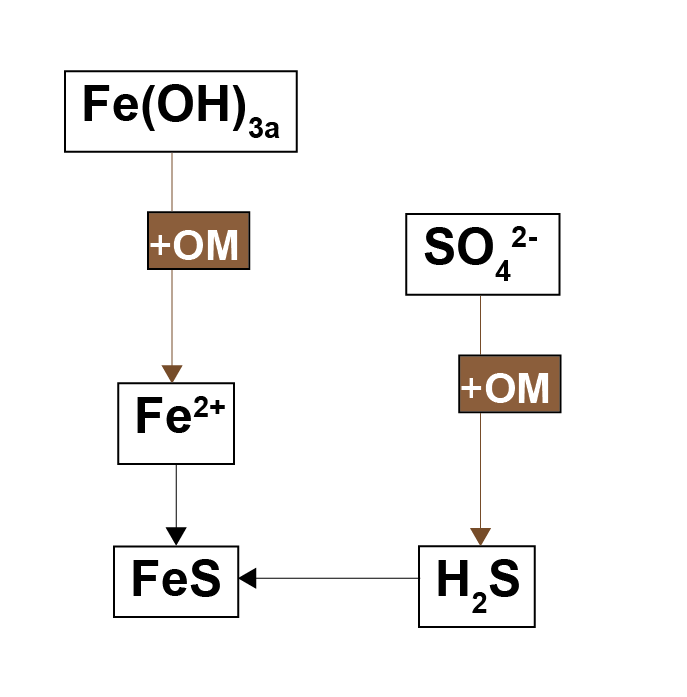

```

Antler et al. (2019) described a ‘bistable’ system of salt marshes being either iron rich or sulphide rich. The iron rich sediments were characterised by macrofauna mixing, aerobic oxidation and iron reduction. The sulphide rich sediments were characterised by less mixing, sulfate reduction and methanogenesis. The possible switch between the two states was suggested to be dependent on the local iron concentration. Where both iron and sulfate reduction of organic matter occur, the production of $FeS$ pulls the $H_2S$ out of the system, preventing toxicity for the macrofauna and maintaining mixing. If the iron to sulphur ratio were lower than a certain threshold, then through positive feedbacks, the system could be pushed towards a sulphide rich state (\@ref(fig:dev-boxes2)). 

```{r dev-boxes2, echo = FALSE, out.width='75%', class = "text-image",fig.show='hold',fig.align='center', fig.cap = "Left – in a system with high concentrations of oxidised iron minerals, iron reduction inhibits sulfate reduction. Right – in a system with less iron, sulfate reduction dominates and $$H_2S$$ is produced."}

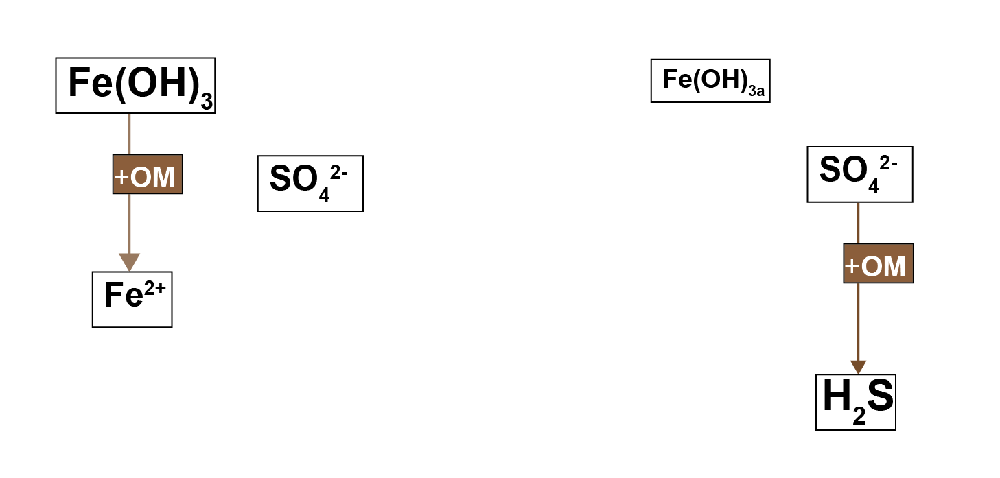

```

#### Sulphide toxicity {.unnumbered}

The Coorong may have a similar bistable state controlled by salinity as well as iron. The mechanism may be related to either the salinity itself, as described in the section below on salinity, or it may be related to the $SO_4^{2-}$ that is coincident with salinity. $H_2S$ being toxic to macrofauna may cause the lack of mixing and bring about the anoxic state of the sediment, although examples can be found where the animals are tolerant of $H_2S$. Volkenborn et al. (2007) found that concentrations of 0.1 mmol  L^-1^ $H_2S$ were toxic to macrofauna. Fuller et al. (1994) showed that polychaete worms could tolerate 3.8 mmol  L^-1^ $H_2S$. Shumway et al. (1983) found that clams could survive with $H_2S$ at 2.68 mmol  L^-1^, but were less tolerant of anoxia when $H_2S$ was present. Hargraves et al. (2008) suggested that benthic macrofauna communities may change their composition as sediments become sulfidic, with increasing biomass of species that are tolerant of sulfidic sediment, but lower total biomass of all macrofauna. A review by Hargraves et al. (2008) considered a range of benthic $∑H_2S$, $O_2$ and macrofauna and suggested that the transition from healthy to unhealthy sediments occurred at $H_2S$ concentration between 0.75 and 1.5 mmol L^-1^. These observational studies suggest a likely mechanistic link between the concentration of $H_2S$, mixing and anoxic sediment, though the exact concentrations are hard to pinpoint.

#### Iron and sulfur phases in sediments {.unnumbered}
Examining the interactions between iron- and sulfur-dominated states requires an estimate of both iron and sulfur species and minerals in the sediment. The variables used in sediment models are rarely measured directly in the environment, and the assumptions made in the model for iron compounds are also dependent on the assumptions for sulfur compounds. Sulfur was measured as acid volatile sulfur (AVS) and chromium reducible sulfur (CRS).

It is assumed that the concentration of AVS corresponds to the amount of FeS. An argument has been presented by Rickard and Morse (2005) that measured AVS is not necessarily a good proxy for FeS, because of differences in what is being measured at study sites. The AVS may not correspond to all of the sulphide in the sediment, it may correspond to different metal sulphide species and it may be partly organic sulphur compounds. The rapid assessments in the Coorong showed that there was a sulphurous black ooze in many of the sediment samples and so the presence of an organic sulphur compound mixed with metal sulphur compounds is possible. Several responses to Rickard and Morse’s paper were published in the same issue, including one from Meysman and Middelburg, which presented the issue from the point of view of sediment diagenesis modellers. Meysman and Middelburg’s perspective on modelling reflected the model used for this project well. They wrote that although Rickard and Morse’s explanation is thorough and precise, it is not necessarily helpful for modellers, who cannot include all chemical species in their models, especially if there is not measured data for calibration. Considering this argument, and the need for general measured concentrations that we can use in the model, we assume that the AVS measurement is an adequate proxy for $FeS$. 

The concentration of $FeS_2$ is calculated as the difference between CRS and AVS. The remaining iron minerals are calculated as the difference between total iron and CRS. Iron minerals are an unknown combination of redox-active Fe(OH)3A, redox-stable Fe(OH)3B and siderite, FeCO3. The literature provides some clues as to the distribution of these species but no definite concentrations. 

The modelling study of Van Cappellen and Wang (1996), based in a marine environment, had a surface peak concentration of Fe(OH)3A of around 35 mmol L^-1^ solids, and $FeCO_3$ of 25 mmol L^-1^ solids. A study by Canfield et al. (1989) measured $Fe(OH)_{3A}$ and $Fe(OH)_{3B}$ at roughly equal concentrations. Thamdrup et al (1994) measured Fe(OH)3A at around 10 to 20% of total iron in the top 4 cm and ‘residual Fe’ at around 70% of total iron, which was constant for approximately the whole depth. $Fe(OH)_{3A}$ was also around 20 to 40 mmol  L^-1^ in five samples, which was consistent with the measurement from Van Cappellen and Wang (1996).

### Nitrogen – background

#### Nitrogen redox pathways {.unnumbered}

Nitrogen redox processes are important in this context because they control whether bioavailable forms of N, such as $NO_3^-$, are recycled in the ecosystem or removed from the system as $N_2$ gas. The simplest conceptual model of nitrogen redox has $NH_4^+$ oxidised by $O_2$ to $NO_3^-$, and $NO_3^-$ reduced with organic matter to $N_2$(\@ref(fig:dev-boxes3)). A more sophisticated conceptual model includes the N species $NO_2^-$ and $N_2O$, which allows more reaction processes of DNRA, denitrousation and deammonification (also known as anammox)(\@ref(fig:dev-boxes4)). The full explanation can be found in aed-science [chapter 14.3](https://aquaticecodynamics.github.io/aed-science/sediment-biogeochemistry.html#model-description-8) for organic matter reactions, and [chapter 6.4.2.1](https://aquaticecodynamics.github.io/aed-science/inorganic-nitrogen.html#model-description---adding-n2o-reactions) for inorganic reactions.
 
```{r dev-boxes3, echo = FALSE, out.width='75%', class = "text-image",fig.show='hold',fig.align='center', fig.cap = "Schematic of the nitrogen redox model commonly used in sediment biogeochemical models."}

knitr::include_graphics("images/dev/23-sediment_biogeochemistry/Boxes&Arrows/NModels-02.png")

```

```{r dev-boxes4, echo = FALSE, out.width='75%', class = "text-image",fig.show='hold',fig.align='center', fig.cap = "Schematic of the nitrogen redox reactions used in this sediment model. Brown pathways are the oxidation of organic matter by nitrogen species; red pathways are oxidation of nitrogen species by oxygen; the blue pathway is the oxidation of one nitrogen species by another."}

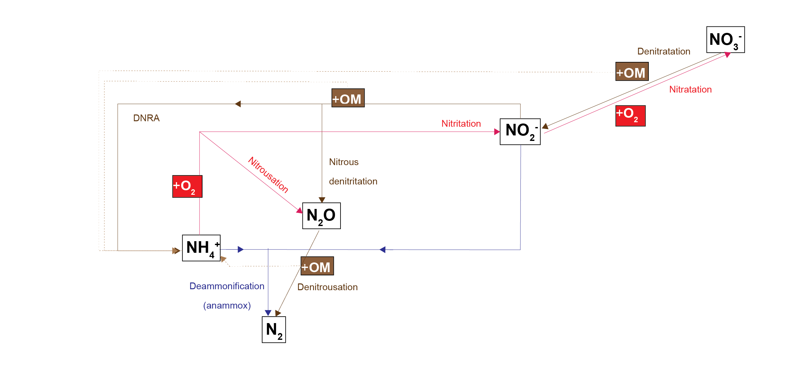

```

Two processes create $N_2O$: nitrousation, from the oxidation of $NH_4^+$; and nitrous denitritation, from the reduction of $NO_2^-$. Tallec et al (2008) showed that nitrous denitritation produced more $N_2O$ than nitrousation. The peak of nitrous denitritation occurred at $O_2$ concentration of 0.01 mmol  L^-1^. 

There is a tight range of $O_2$ concentration in which these nitrogen redox reactions can take place. At high $O_2$ concentration, organic matter oxidation by N species is inhibited and so $NO_2^-$ and $N_2O$ accumulate. According to some literature observations, at zero $O_2$ concentration, denitrousation is the energetically favoured process, rather than denitritation. At around 200 nmol  L^-1^ $O_2$, denitritation is less inhibited by $O_2$ and $NO_2^-$ is converted to $NH_4^+$ and $N_2O$ . Above 200 nmol  L^-1^ denitrousation is inhibited and $N_2O$ accumulates. 

The $N_2O$ production rate has been measured at 626 mmol  L^-1^  y^-1^ (Su et al ), 9 mmol L^-1^  y^-1^ (Jiang et al), 175 mmol  L^-1^  y^-1^ (Tan et al ) and 88 mmol  L^-1^  y^-1^ (Hernandez-del-Amo et al ). 

### Salinity – background 

#### Salinity and benthic fauna {.unnumbered}

High salinity does not favour benthic macrofauna and the processes they create, bioturbation and bioirrigation. Bioturbation is the mixing of solids and solutes by small animals as they move in the upper layers of the sediment; bioirrigation is the transport of solutes between the sediment-water interface and the bottom of a burrow. One of the effects of these processes is to increase the concentration of oxygen in the upper layers of the sediment, and so, conversely, a lack of these processes creates an anaerobic environment closer to the sediment-water interface. These processes are captured in the sediment model, as described in the implementation section below, and in the aed-science manual, chapter 14.3. 
Benthic macrofauna have been described as ‘ecosystem engineers’, in which they maintain the sediment conditions within a range favourable to their own survival (T&I 1.3.2). Beyond a certain point they cannot maintain their own favourable conditions. If they can help bury nutrients deep in the sediment rather than release them to the water column, they can prevent eutrophication and thus prevent oxygen depletion. However, at high salinity, it becomes difficult for benthic macrofauna to survive.

#### Salinity and $SO_4^{2-}$ concentration {.unnumbered}
Seawater has a consistent concentration of $SO_4^{2-}$, in mmol L^-1^, of approximately 0.9 × salinity, in PSU. Hypersaline water is produced by evapoconcentration of the salt in seawater, and so in principle it should have a correspondingly high concentration of $SO_4^{2-}$. This calculation may be imprecise because $SO_4^{2-}$ is removed through sulfate reduction, whereas salt only accumulates. However, it provides a first-order approximation. 

#### Salinity and nitrogen redox – theoretical background  {.unnumbered}
Some evidence suggests that the hypersaline environment causes lower rates of denitrification. The cause is not clear, but it may be either because the salt has a direct effect on denitrifying bacterial cells, or it may be because of broader environmental effects on the benthic macrofauna. Hypersaline water does impose an energetic cost on cellular systems (Isaji et al., 2019). However, despite the cost, cells can still live in hypersaline environments. 

The process of nitrification has been shown to be inhibited by hypersaline conditions. In some cases, there is a time lag from the onset of hypersaline conditions, for example, a 20-day lag for the growth of ammonium oxidising bacteria (Helder and DeVries 1983). Santoro and Enrich-Prast (2015) found a negative exponential correlation between nitrification rates and salinity between 0 and 30‰. The maximum nitrification rate was 120 nml $NO_3^-$ cm^-3^ h^-1^. Cui et al. (2016) observed that high salinity did not change which ammonia-oxidising bacteria species were dominant, but it did inhibit their activity and abundance. The effect of inhibited nitrification is ultimately less denitrification: in the theoretical redox equilibrium, the nitrogen remains in the $NH_4^+$ phase rather than being nitrified to $NO_3^-$ and reduced to N2. This phenomenon has been observed in algal mats by Isaji et al. (2019). Benthic algae has been observed to correlate positively with nitrification rates (Lorenzen et al. 1998; Risgaard et al. 1999; An and Joye, 2001; Travieso et al. 2006).

### Observed data and characteristics in the Coorong

#### Salinity – Coorong observations {.unnumbered}

Salinity in the Coorong has been observed to range from as low as around 20 PSU in the north (where freshwater from the lake mixes with marine water) to around 80 in the south (where the salt from the marine water has evapoconcentrated). The whole southern lagoon is more saline and has at least around 60 PSU.

#### Iron and sulfur – Coorong observations {.unnumbered}

##### Sediment iron{-}

Coorong grab samples had been analysed as total iron, measured in mg Fe / kg dry sediment solid. For reference with the other variables in the model, raw Coorong iron measurements were converted to the unit of mmol L^-1^. Grab samples averaged around 6500 mg kg^-1^ and ranged from 700 to 23 000 mg kg^-1^. Each grab was converted using the % moisture measured at that site, which ranged widely from 18% to 81%. The final values ranged from 5 to 158 mmol L^-1^ sediment: this wide range in final values was determined mostly because of the % moisture measurements. The average measurement was 45 mmol L^-1^, which was in line with literature values (35 mmol L^-1^ in Van Cappellen and Wang).

##### Water column iron{-}
Total iron data was also available from the water column sampling to use as a boundary at the sediment water interface. Data was available for total iron and dissolved iron (mg L^-1^), at 16 sites along the whole Coorong, for the time period 1998 to 2012. The dissolved iron was typically less than 1% of the total iron. Both were converted to mmol L^-1^ and averaged over the entire time period at each site. The total iron was assumed to be particulate iron and it was converted from mmol L^-1^ to a flux in mmol m^{-2} y^-1^ by multiplying the concentration by the deposition rate of 1 cm y^-1^. Iron fluxes ranged from 0.0042 to 0.0109 mmol L^-1^. These fluxes were much lower than literature values used in sediment models, for example, 750 mmol m^{-2} y^-1^ in Van Cappellen and Wang (1996). Reconciling these differences depends on the settling rate of the iron mineral particles, which is unknown. 

##### Water column $SO_4^{2-}${-}
Water column $SO_4^{2-}$ data was available from measurements at 16 sites along the length of the Coorong, for the time period 1998 to 2005. When these measurements were converted from mg L^-1^ to mmol L^-1^ and averaged over time, they corresponded well with the theoretical rule mentioned above, where $SO_4^{2-}$ (mmol L^-1^) is equal to 0.9 × salinity (PSU).

##### Sediment sulfides {-}
AVS was converted from units of ‘% S WW’, which was assumed to be kg S (100 kg wet sediment)-1, to mmol S (L total volume)-1, using porosity at each grab site. (A sample of 0.025 % S WW converted to 3.7 mmol S L^-1^, where the porosity was 0.66). The average of the AVS grabs was 3.36 mmol L^-1^, the minimum value 0.26 and maximum 7.21 mmol L^-1^.The AVS concentrations in the grab samples mostly corresponded with the values in the rapid assessments, with high concentrations usually in the deep channel and in zones 4, 5 and 6.The AVS concentrations were compared to the total iron concentrations from the grab samples. The average total iron was 7.69 mmol L^-1^ total sediment, which implies roughly two Fe for each S on average over the lagoon. Each site did not have a clear correlation between S and Fe.

##### Sediment $∑$H_2S$$ cores{-}
Depth profiles of $∑$H_2S$ were taken at two sites in November 2020 and three sites in February 2021. The profiles were measured after either a dark or light incubation, to see the difference in oxic state. Concentrations peaked at around 0.1 mmol L^-1^ and the peak was around 5 cm deep.

##### Sediment $Fe^{2+}$ cores{-}
$Fe^{2+}$ was measured in cores taken from five locations, in November 2020 and February 2021. The highest concentrations were at Parnka Point and Policeman’s Point in November 2020. These were not sites that had very high TOC or nutrients. 

#### Nitrogen – Coorong observations  {.unnumbered}
##### Grab sample and core measurements{-}
TN was measured in grab samples in units of N%, ranging from 0.04 to 0.78%. This was converted to mmol L^-1^ using each grab sample’s porosity and an assumed density of 2.7 g cm-3. This resulted in a concentration between 0.0063 and 0.0176 mmol L^-1^ of total volume. 
 $NH_4^+$ measurements in the core samples were around 0.1 mmol L^-1^ porewater, increasing with depth. This concentration was similar to that in Van Cappellen and Wang (1996). 
 
##### Water column model results at the sediment boundary{-}
$NO_3^-$ and  $NH_4^+$ concentrations were measured in the water column and a separate water column model was calibrated to match these concentrations. The average water column concentration of each was 1.5 × 10^-5^ mmol NO3- L^-1^ and 6.0 × 10 -5 mmol $NH_4^+$ L^-1^. Organic N flux was calculated in the water column model at around 250 mmol m^{-2} y^-1^ for detritus (PONR) and 300 mmol m^{-2} y^-1^ for algae (PONS). This indicated that most of the N was held in the organic pools.

##### TN and TP budget estimates{-}
The T&I report 1.2.2 Nutrient Dynamics contained an estimate of nutrient budgets in the sediment of the Coorong. The mass of TN was estimated at 25506 tonnes for the South Lagoon and 9377 tonnes for the North Lagoon. The mass of TP was 2204 tonnes for the South Lagoon and 924 tonnes for the North Lagoon. To meet this budget, the concentration of TN was calculated at around 50 mmol L^-1^, which was four orders of magnitude higher than indicated by the TN% measurements. 

##### Nitrogen and salinity {-}
Observations of denitrification correspond to the theory and literature observations described above. The T&I report 1.3.2 Nutrient Cycling showed a statistical relationship between salinity and the genes present in denitrifying bacteria, indicating that denitrification was occurring at a low rate in hypersaline areas. The Coorong has very low concentrations of NO3-, which suggests that nitrification may be inhibited by the high salinity. However, the  $NH_4^+$ concentrations are also low, and organic nitrogen is high. Therefore the problem is not with the lack of nitrification so much as the binding of the N in algal biomass.

#### Organic matter– Coorong observations
The grab samples had TOC% measured between 0.1 and 6.6 %C, averaging 2.7%. This was converted to mmol L^-1^ using porosity measurements and an assumed density of 2.7 g cm-3 to reach concentrations of 0.5 to 104 mmol L^-1^, averaging 34. The wide variation in TOC mmol L^-1^ was a result of the wide range of porosity measurements. The RAPID assessments had many examples of black ooze, which suggested high concentrations of organic carbon. The large TN budget suggested a likely high concentration of organic carbon. The organic carbon concentration may be six or more times greater than the organic nitrogen concentration. 


## Model approach: CANDI-AED

The heart of this model is a reaction, diffusion, advection model termed CANDI-AED. For details of the CANDI-AED model and scientific description, please refer to [the AED Manual](https://aquaticecodynamics.github.io/aed-science/sediment-biogeochemistry.html).

The model approach is broadly used in lakes, ocean and estuarine environments, but there remain few cases in shallow lagoons [@paraska2014]. 

### Model developments made during the Coorong project
Several developments have been undertaken to adapt the CANDI_AED vertical column model to the Coorong application:

-  Improved parameterisation of diffusion at the sediment-water interface, based on $\tau_b$.
-  Inclusion of functionality to resolve resuspension effects
-  Addition of MPB and macrophyte roots $O_2$ sources into the sediment
-  Dynamic bioturbation rates linked to salinity and $H_2S$ concentrations
-  Bioturbation rates linked to salinity and $H_2S$ concentrations
-  Bioturbation rates linked to salinity and $H_2S$ concentrations
-  $NH_4^+$, $PO_4^{3-}$ and $DOM$ adsorption
-  Allocation of a an unreactive organic matter pool

In addition, to the physical and chemical process updates described above, the $SDG$ module was further developed to support multi-zone operation of the CANDI-AED model, dynamic links with MPB, MAG and MAC modules, and the ability to allow for spin-up of sediment profiles.

### Implementation of theory and Coorong observations in the sediment model setup

#### Salinity – implementation on mixing and nitrogen redox {.unnumbered}
Two functions to connect salinity to mixing and nitrogen reactions were developed for the sediment model during this project: $F_{Sal}$ and $F_{Sul}$. The full explanation for these can also be found in the aed-science manual, chapter 14.3. The $F_{Sal}$ function decreases from 1 to 0 as salinity increases, with two parameters for salinity concentrations that set the range over which the function works (35 and 70 PSU). The $F_{Sul}$ function decreases from 1 to 0 as $H_2S$ increases, which occurs as organic matter undergoes sulphate reduction. These two functions were applied to both macrofauna mixing processes, by multiplying the process rate by the value between 0 and 1. $F_{Sal}$ was also applied to all nitrogen redox reactions. Therefore, as salinity increased, and as $SO_4^{2-}$ increased and indirectly created $H_2S$, mixing and nitrogen redox were all reduced. $F_{Sal}$ was applied to the nitrogen redox reactions, but not the hydrolysis breakdown pathways that generated $NH_4^+$ (\@ref(fig:dev-boxes5)).
 
```{r dev-boxes5, echo = FALSE, out.width='75%', class = "text-image",fig.show='hold',fig.align='center', fig.cap = "Schematic of the nitrogen breakdown pathways from PONR to N2. PONL was not included in this diagram in order to simplify it, and because PONR was the major PON pool. The salinity inhibition factor, $F_{Sal}$, was applied to those processes where $F_{Sal}$ is beside the arrow."}

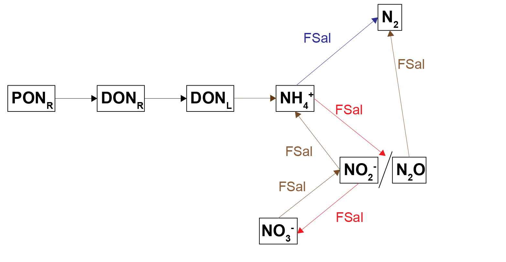

```
 
#### Iron and sulfur – implementation {.unnumbered}
The influx of redox active Fe(OH)3A was set to 80 mmol m^{-2} y^{-1}, and a range of boundary fluxes were tested alongside different organic matter influxes. SO42- concentration was set in proportion to salinity, as described in the section above. The iron and sulfur cycles function as described in the aed-science manual. In brief, Fe(OH)3A reacts with organic matter to produce Fe2+ and its presence inhibits sulfate reduction. SO42- reacts with organic matter to produce $H_2S$. The by-products Fe2+ and $H_2S$ react together to form FeS. 

Simulations were run with the parameter rxn_mode set to each option, 0 to 4, to test the effect of each option. The options are outlined in the aed-science manual. In brief, with options 0 and 1, FeS does not precipitate; with option 2 FeS precipitates at a constant kinetic rate; with options 3 and 4 FeS precipitates in proportion to the concentrations of the reactants and products already present. Options 2, 3 and 4 often created numerical instability problems. 

#### Organic matter– implementation {.unnumbered}
The sediment model has several organic matter models available to it, as outlined in the aed-science manual. This simulation used OMModel set to 2, which has separate state variables for each of dissolved or particulate, and refractory or labile organic C, N and P – 12 variables. An additional three variables were developed for this project, POCS, PONS and POPS, which were representative of the algal deposition from the water column – 15 variables in total. The boundary fluxes were set to average results from outputs from the water column model. Labile phases were set to be 10% of the value of the refractory variable. This simulation used the advanced nitrogen redox model shown above in (\@ref(fig:dev-boxes5)). 

```{r dev-boxes6, echo = FALSE, out.width='75%', class = "text-image",fig.show='hold',fig.align='center', fig.cap = "Model of organic carbon decomposition. Particulate phases are hydrolysed to dissolved phases, and finally the labile dissolved phase is oxidised to $CO_2$."}

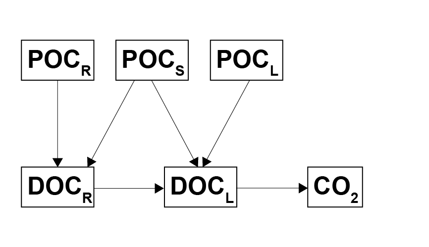

```
 
```{r dev-boxes6, echo = FALSE, out.width='75%', class = "text-image",fig.show='hold',fig.align='center', fig.cap = "Model of organic nitrogen decomposition. Particulate phases are hydrolysed to dissolved phases, and finally the $NH_4^+$ enters the redox reactions."}

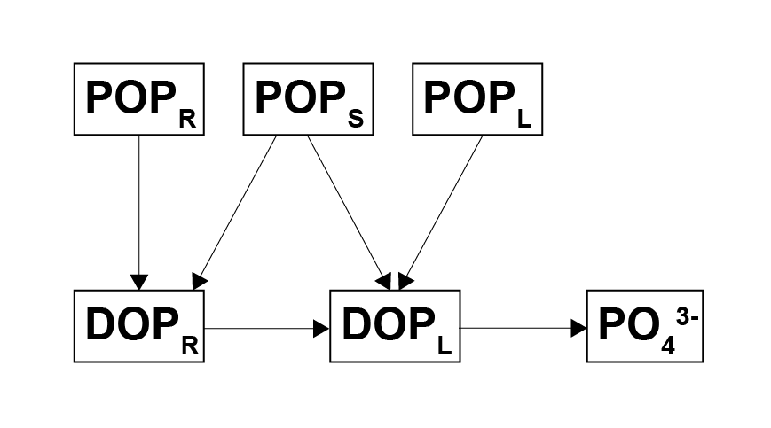

```


```{r dev-boxes6, echo = FALSE, out.width='75%', class = "text-image",fig.show='hold',fig.align='center', fig.cap = "Model of organic phosphorus decomposition. Particulate phases are hydrolysed to dissolved phases, and finally the labile dissolved phase is released as to $PO_4^{3-}$."}

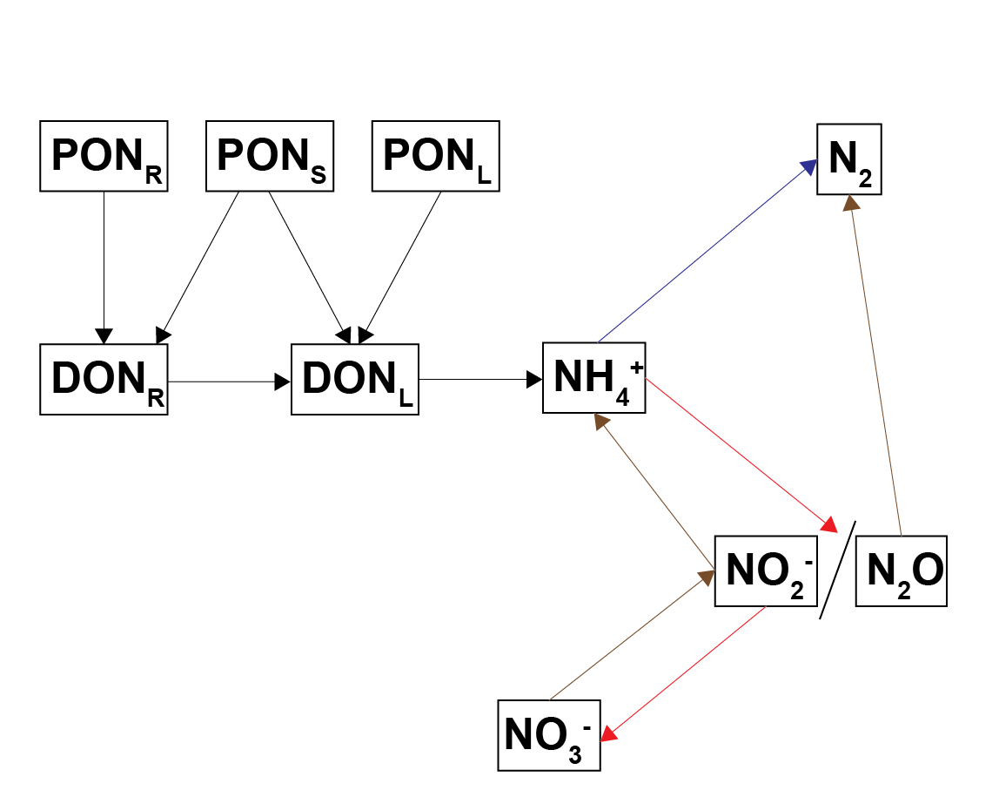

```
 
#### Sulfur and denitrification {.unnumbered}

As mentioned above, $SO_4^{2-}$ bottom water concentrations were tied to salinity and initial $SO_4^{2-}$ concentrations were set to reflect the salinity gradient along the estuary. Consequently, the generation of $H_{2}S$ was higher in the southern zones. High $H_{2}S$ concentration was set to inhibit biota-driven mixing and nitrogen redox reactions, on the basis that $H_{2}S$ is toxic to organisms. An $H_{2}S$ factor, $F_{Sul}$, was set up as an inhibition factor similar to other inhibition factors in the sediment model. As with $F_{Sal}$, $F_{Sul}$ was applied to biota-driven mixing (see below) and to the nitrogen redox reactions. 

### Nutrient sorption and burial {.unnumbered}

A process for removing nutrients from the active zone was burial of the nutrients deep in the sediment. As much of the nutrient calibration was based around calculating the mass in the top 5 cm (see Calibration section above), a measurement of burial was defined as the change in mass at 5 cm over time.

Another mechanism of nutrient removal was adsorption of dissolved nutrients onto solid particles. $NH_4^+$ was simulated as precipitating onto solid particles, including organic matter and clay. Since the Coorong sediment survey showed high concentrations of organic matter and clay, it was assumed that there were unlimited adsorption sites for $NH_4^+$, and the relative amounts of $NH_4^+$ were assigned by the adsorption constant as per the methods in Van Cappellen and Wang (1996), which was ultimately based on Mackin and Aller (1984). The adsorption constant was set to the same value in all zones, which can be found in the geochemistry parameter table below. A simplified version of the adsorption equations adsorption can be found below (the full equations correct for porosity and solid volume when transferring between particulate and dissolved phases).

<center>

```{=tex}
\begin{eqnarray}

NH_{4 _{Total}}^+    = NH_{4}^+ + NH_{4_{Adsorbed}}
\\
\\
NH_{4 _{Dissolved}}^+  = \frac {1}{K_{NH_4p}}
\\
\\
NH_{4 _{Particulate}}^+ = 1 - NH_{4 _{Dissolved}}^+ F_{Sal}
\\
\\
NH_{4 _{Particulate}}^+ = NH_{4_{Total}}^+ NH_{4 _{Particulate}}^+
\\
\\
NH_{4 _{Dissolved}}^+  = NH_{4_{Total}}^+ - NH_{4 _{Particulate}}^+

\end{eqnarray}
```
</center>

A similar approach was taken for dissolved organic carbon, nitrogen and phosphrous. The $DON_R$ and $DON_S$ are adsorbed to the sediment with the adsorption constant *K~DOMP~*, and $DOP_R$ and $DOP_S$ adsorbed using the same adsorption constant *K~DOMP~*. The value for *K~DOMP~* defaults to 1.4 and the model defaults to being switched on.

$PO_4^{3-}$ was adsorbed onto the surfaces of iron oxide particles, both the reactive $Fe(OH)_{3A}$ and unreactive $Fe(OH)_{3B}$ fractions. (While the sediment model has optional configurations, as outlined in the AED Manual, in this simulation the options *PO4AdsorptionModel* = 1 and *ads_use_pH* = TRUE.) The overall property of this setup was that low oxygen and nitrate concentrations in the sediment cause iron oxide reduction, which dissolves the solid particles and releases the dissolved $PO_4^{3-}$ to the porewater.

```{=tex}
\begin{eqnarray}

PO_{4_{Particulate}}^{3-} = \frac {K_{PO_4p} (Fe(OH)_{3A} + Fe(OH)_{3B})} 
{1 + K_{PO_4p} (Fe(OH)_{3A} + Fe(OH)_{3B}) } (PO_{4 _{Total}}^{3-})
\\
\\
PO_{4_{Dissolved}}^{3-}  = \frac {1} {1 + K_{PO_4p} (Fe(OH)_{3A} + Fe(OH)_{3B}) } (PO_{4 _{Total}}^{3-})

\end{eqnarray}
```

Organic P and 'residual' P were assumed to be the two largest fractions of sediment P, based on the work of Koch et al. (2001) from a study site similar to the Coorong. The 'residual' P was bound to sediment particles and extracted with acid. The ratio of PIP:POP was 40:60 in the initialisation step.

The final feature developed for nutrient burial for this project was the very unreactive organic matter parameter. As mentioned in the model setup above, the organic matter setup in this model has labile and refractory phases, as state variables. The model was extended in this project by dropping the reactivity of the particulate refractory phase towards zero as the concentration approached a minimum. For $PON_R$, the parameter *ponu* set the minimum concentration and *KOMPres_N* set the sensitivity of the decrease, as in the equation below. The equivalent parameters for C an P were *pocu* and *popu*, and *KOMPres_C* and *KOMPres_P*.


```{=tex}
\begin{eqnarray}

komlim = \frac {PON_R - ponu} {PON_R - ponu + KOMPres_N} 
\\
\\
R_{PONR} = (ponr2donr) (komlim)

\end{eqnarray}
```
(The equation above is a simplified version, where the full equation had checks to prevent the rate going below zero, plus the respiration processes of $MPB$.)

### Plants, microphytobenthos and macroalgae

$O_2$ is injected into the sediment from microphytobenthic algae ($MPB$) and from plant roots (\@ref(fig:dev-picsbudgetsetup-5)). The oxygen is not part of the mass balance of the ecosystem and it is not in stoichiometric balance with biomass or $∑CO_2$. The depths where the $O_2$ is injected are set separately for $MPB$ and roots. The $O_2$ in these layers from $MPB$ is set as a rate of both gross primary production ($Rgpp O_2 input$) and respiration ($Rrsp O_2 consumption$). The rate $Rgpp$ is calculated as a function of the $MPB$ production rate, the parameter *fgpp~sflux~* and a decay with depth. The production rate is linked directly to the rate calculated in the water column model. Similarly, the rate $Rrsp$ is calculated as a function of the respiration rate, the same parameter *fgpp~sflux~* and a decay with depth. The respiration rate is also linked directly to the rate calculated in the water column model. Below the parameter *MPBDepth*, $Rgpp$ is zero, which means that the $MPB$ cannot photosynthesise without light. Below *MPBDepth* the rate $Rrsp$ is the product of $MPB$ biomass and 52 days, which means that the cells die within a week without access to light.

The rate of $O_2$ injection from roots is calculated from the variable $RTO_2$, which applies above the depth $RTDP$. Both $RTO_2$ and $RTDP$ are linked directly from the water column model.

```{r dev-picsbudgetsetup-5, echo = FALSE, out.width='75%', class = "text-image",fig.show='hold',fig.align='center', fig.cap = "Schematic of the new parameterisation of $O_2$ injection into the sediment. Left: $O_2$ is released where $MPB$ are respiring. Right: $O_2$ comes from plant roots to the depth of *RTDP*."}

knitr::include_graphics("images/dev/sed_O2Inject.png")

```


### Uncoupled model methods - GLM setup

The sediment model was run using the General Lake Model (GLM) for the upper boundary conditions. Most state variables had no initial condition. The initialisation of organic matter is described in the section below. No variables were linked to a dynamic model at the sediment-water interface. Most variables at the sediment-water interface were set with constant concentrations and fluxes, as shown in the table below the (using the default_vals option, as described in the aed-science manual, chapter 14.4.3). The flux of organic matter was tuned during the setup of the model, as described in the section below. The boundary conditions of salinity and SO42- were set to a range of different options for each simulation, as described in the section below. A set of key setup parameters is presented in Table 4. Some of these were varied to test the model confidence. 


#### Organic matter initialisation {.unnumbered}
The particulate, refractory organic matter initial condition was set using the linear option, as described in the aed-science manual, chapter 14.2.2. The initialisation was set to decrease from 10% to 100% from the surface to 12 cm deep(\@ref(fig:dev-initprof1)). 
 
 
```{r dev-initprof1, echo = FALSE, out.width='75%', class = "text-image",fig.show='hold',fig.align='center', fig.cap = "Organic matter initial profile and parameters"}

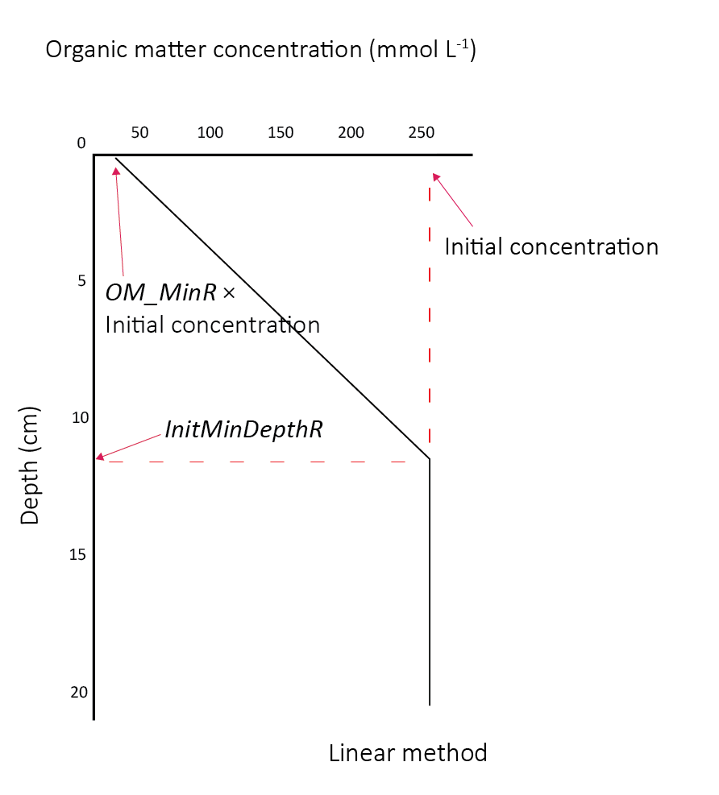

```
 
#### Nitrogen transformation rate constants {.unnumbered}
The kinetic rate constants that governed the reactions between the nitrogen pools were configured as presented in (\@ref(fig:dev-initprof1)). Note that these were not the rates, but the constants that are multiplied by the concentrations of the reactants involved and other limitation and inhibition factors that affected the rates. Thus the total rates were mostly dependent on the concentrations, however, the rate constants affected the distribution between the nitrogen pools.

```{r dev-initprof1, echo = FALSE, out.width='75%', class = "text-image",fig.show='hold',fig.align='center', fig.cap = "Diagram of the processes of nitrogen breakdown with the kinetic rate constants shown for each process."}

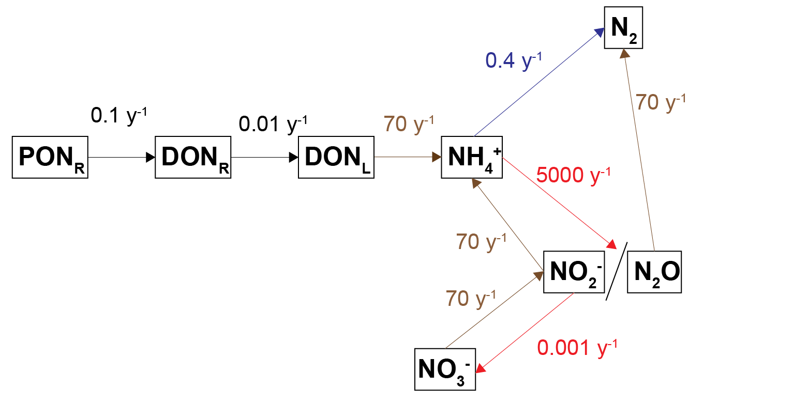

```
 


#### Nutrient budget and mass calculator {.unnumbered}
Since the sediment samples had often contained black ooze, it was assumed that most of the TN and TP was present as refractory organic matter and so the model was calibrated to meet the measured TN and TP budget. Because the sediment model is only resolved in one dimension of depth, in theory it has no specific area or volume. The same model can represent a large or small study site, which had traditionally worked well for reporting units of concentration and flux. 

The simulation was set up as though it were exactly 1 m2, which was conceptualised as a representative area anywhere in the South Lagoon (\@ref(fig:dev-area1m2)). The estimate of the masses in the top 5 cm of the South Lagoon were 25 000 tonnes TN and 2200 tonnes TP. The area of the South Lagoon was approximately 1×108 m2. Therefore, the target concentration was approximately 250 g TN m^{-2} and 22 g TP m^{-2}. Initial and boundary conditions were tuned until a steady mass of TN and TP was reached.

```{r dev-area1m2, echo = FALSE, out.width='75%', class = "text-image",fig.show='hold',fig.align='center', fig.cap = "Diagram of the processes of nitrogen breakdown with the kinetic rate constants shown for each process."}

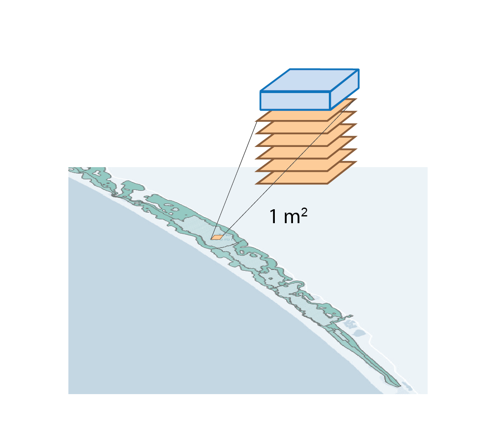

```
 


#### Salinity variation tests {-}
In a suite of model tests, the salinity boundary was changed for ten separate simulations (\@ref(fig:dev-salinitysims1)). Each simulation had an annual oscillation, with the highest value in May and the lowest in October (Figure 13). The first five simulations had salinity between 0 and 35, with different ranges of variation. The other five had increasing maximum and minimum salinity, with a range of 50 PSU throughout the year. The $SO_4^{2-}$ boundary concentration (mmol L^{-1}) was set to 90% of the salinity concentration (PSU), and so $SO_4^{2-}$ also had a yearly concentration change. 

Four variations of these ten simulations were run, to isolate the effects of the salinity and SO42- factors. The first used both $F_{Sal}$ and $F_{Sul}$, as per the normal simulations. The second used only $F_{Sal}$, the third only $F_{Sul}$, and the final simulation had neither $F_{Sal}$ nor $F_{Sul}$. 

```{r dev-salinitysims1, echo = FALSE, out.width='75%', class = "text-image",fig.show='hold',fig.align='center', fig.cap = "Upper and lower salinity concentrations (PSU) for the annual oscillation at the sediment-water interface."}

knitr::include_graphics("images/dev/23-sediment_biogeochemistry/CoorongImages/SalinitySims.tiff")

```
 
```{r dev-salinitysims2, echo = FALSE, out.width='75%', class = "text-image",fig.show='hold',fig.align='center', fig.cap = "UA representative example of a salinity sediment-water interface boundary condition."}

knitr::include_graphics("images/dev/23-sediment_biogeochemistry/CoorongImages/SalinitySin.pdf")

```
 


### Coupled model methods

#### Resolving sediment zonation {.unnumbered}

The model was developed to allow the use of multiple independent sediment zones across the domain, which are identical to the above CANDI-AED description but are not necessarily coincident with the grid-structure of the water. This way sediment zones may be defined for the domain, and depending on the nature of the grid, the water cells above the sediment are averaged for the purposes of the interfacial fluxes, allowing more efficient simulations (see for example Figure \@ref(fig:dev-pics3). Using zones is a practical compromise between using fewer sediment calculations (for computational efficiency) and more calculations (for capturing spatial heterogeneity in sediment properties and their fluxes).

```{r dev-pics3, echo = FALSE, out.width='100%', class = "text-image", fig.cap = "Schematic depicting sediment zone numerical approach."}

knitr::include_graphics("images/dev/sed_picture5.png")

```

#### Sediment-water coupling {.unnumbered}

The sediment and hydrodynamic models are coupled at the sediment-water interface (Figure \@ref(fig:dev-pics5)). The AED model setup has three separate functions for coupling the bottom-most cell of the TUFLOW-FV hydrodynamic model to the top-most layer of the sediment model:

-  flux of solid material onto the sediment surface from the water column: *part_sed_link*
-  concentration of dissolved substances in the bottom water to the sediment: *water_link*
-  flux of dissolved substances from the top sediment layer to the water column: *diss_flux_link*

```{r dev-pics5, echo = FALSE, out.width=c('45%','45%'), class = "text-image",fig.show='hold',fig.align='center', fig.cap = "Schematic of sediment water coupling approach. Left: the three linking options between the water column and sediment models. Right: Water column cell concentrations and fluxes within a zone are averaged and transferred between the models."}

knitr::include_graphics(c("images/dev/sed_picture3.png","images/dev/sed_picture4.png"))

```


#### Sediment-water interface fluxes {.unnumbered}

Flux across the sediment-water interface was governed by three factors:

- Advection
- Bioturbation
- Bioirrigation

The advection component of this was composed of

- Molecular diffusion
- Porewater flux
- Sediment particle deposition

Molecular diffusion was driven by differences in chemical concentration across the sediment-water interface. For example, high $NH_4^+$ concentration in the sediment fluxes to the lower concentration in the water column. In this simulation there was no external porewater flux from, for example, groundwater inflow. The sediment particle deposition rate (*w~00~*) was set to have the same value across the whole of the domain (1 cm y^-1^). (The particle deposition model was developed in the water column model during this project and a link for water column particle deposition between the models was not implemented in this study.) A link was developed for the shear stress at the sediment-water interface, such that molecular diffusion was increased when the motion in the water column was higher. The sensitivity of sediment-water diffusion to bottom water motion was assigned by the parameter *tau~b~sensitivity*. The values for *tau~b~sensitivity* can be found in the physical parameters table above. The sensitivity was set to be higher in the southern zones. The diffusion was also sensitive to the amount of macroalgae and seagrass roots in each zone, where a high amount of either reduced $\tau_b$ to zero, leading to diffusion being mostly controlled by chemical concentration gradient.

Bioirrigation was set up as a depth at which non-local transport occurred, using the parameter *x~irrig~*. The value for *x~irrig~* can be found in the physical parameters table below, and as with *x~1~*, the depths of *x~irrig~* were assigned to each zone, to reflect the decrease of benthic fauna in the southern zones. 

Within the Coorong, in the hot summer months as the water in the southern lagoon evaporates, the remaining water becomes hypersaline. The hypersaline water kills the macroinvertebrate fauna, which causes a decrease in fauna-driven mixing of the upper sediment. The model for bioturbation and irrigation was set to update at each time step. As $F_{Sal}$ and $F_{Sal}$ were updated at each time step, bioturbation and bioirrigation were therefore dynamically dependent on water column salinity and $H_{2}S$ concentration.


#### Salinity coupling method {.unnumbered}

Salinity was set as a permanently linked variable from the water column AED model, without using *water_link*.

A special salinity factor, $F_{Sal}$ was developed for the salinity in the Coorong, to inhibit processes at hypersaline concentrations. $F_{Sal}$ ranges from 1 to 0, as set between salinity concentration parameters *Sal1* and *Sal2* (PSU). See the [AED manual](https://aquaticecodynamics.github.io/aed-science/sediment-biogeochemistry.html#model-description-8) for details. The values for *Sal~1~* and *Sal~2~* can be found in the physical parameters table below. In this simulation, the same value for all was used in all zones. $F_{Sal}$ was applied to biota-driven mixing (see below) and to the nitrogen redox and adsorption reactions. 


### Coupled model zonation

**Spatial aggregation - ten regions** In order to simplify the Coorong study site measurement points and simulation areas, the lagoon was divided into ten separate Coorong regions from north to south, that were then split into the simulated zones. These were primarily based on the natural boundaries, channels and sandbars of the estuary. Regions 1 to 4 were the southern lagoon, region 5 was the intermediate area and region 6 to 10 were in the northern lagoon (Figure \@ref(fig:dev-pics1)).

```{r dev-pics1, echo = FALSE, out.width='45%', class = "text-image",fig.show='hold',fig.align='center', fig.cap = "Example sediment zonation."}

knitr::include_graphics(c("images/dev/sed_Zones.png","images/dev/sed_ZonesSat.png"))

```

**Deep and shallow sites** The ten Coorong regions were further subdivided into three zones each -- the western bank on the ocean side, the central channel, and the eastern bank on the inland side. The cut-off between the channel and the bank subdivision was defined by any area that reached more than 1 m deep. Therefore, each of the ten regions along the length of the lagoon had three zones across the breadth of the lagoon, and region ten had one additional zone for the ocean boundary, giving 31 zones in total (Figure \@ref(fig:dev-pics2)).

```{r dev-pics2, echo = FALSE, out.width='45%', class = "text-image",fig.show='hold',fig.align='center', fig.cap = "Example sediment zonation."}

knitr::include_graphics(c("images/dev/sed_Half Page zones11to104.png","images/dev/sed_Half Page zones61to73.png"))

```

#### Validation sites and data {.unnumbered}

A range of data was collected and is documented in [Appendix D](Appendix D: Sediment Data). In summary, there were five broad categories of field data available from the HCHB research project surveys for the $SDG$ module setup and parameterisation:

*Grab samples -- C, N, P, Mn, Fe, S* : These were available for many sites but only one or two depths. They were useful for averaging a concentration at depth within a zone. These were key variables for sediment biogeochemistry.

*Cores -- Fe, S, NH~4~^+^, PO~4~^3-^ GHGs* : The cores were available for only around four sites, but they were used for calibrating depth profiles and sediment-water fluxes. These often had data measured in the day and the night, as well as in November and March, which all had different concentrations and fluxes. The challenge was to capture both day and night conditions, while also capturing seasonal changes.

*Sediment quality* : These measurements were used for setting the initial porosity parameters. Once these were set they were not tuned further.

*Macroinvertebrates -- bioturbation parameters* : Benthic infauna measurements were used for setting bioturbation and bioirrigation parameters. Broadly, the North Lagoon had high bioturbation and the South Lagoon had very little bioturbation. The depth to bioturbation was important, as it was expected that there was uninhabited black ooze below a few centimetres.

*Water column water quality measurements* : These were used for estimating water column concentrations and influxes for variables that were not able to be linked to active AED modules used for the water column model.

A detailed analysis of available sediment data is presented in [Appendix D](Appendix%20D%20:%20Sediment%20Data) - this was used as the basis for the $SDG$ module steup and validation.


#### Coupled model simulated variables {.unnumbered}

In total, each sediment zone was configured to include a total of 42 simulated constituents. All simulated variables are listed in Table \@ref(tab:3dev-sedvars).

<center>

```{r 3dev-sedvars, echo=FALSE, message=FALSE, warning=FALSE}
 library(knitr)
 library(kableExtra)
 library(readxl)

 sediment_vars <- read_xlsx("tables/BookdownSDGVars.xlsx", sheet = "Vars" )
 kable(sediment_vars,"html", escape = F, align = "c", caption = "All sediment variables",
    bootstrap_options = "hover") %>%
  kable_styling(sediment_vars, bootstrap_options = "hover", 
         full_width = F, position = "center", 
         font_size = 12) %>% 
  row_spec(0, background = "#14759e", bold = TRUE, color = "white") %>% 
  column_spec(1, width_min = "10em") %>%
  column_spec(1, width_min = "10em") %>%
  column_spec(1, width_min = "10em") %>%
  row_spec(1, background = 'white') %>% 
  scroll_box(width = "400px", height = "400px",
       fixed_thead = FALSE)
```

</center>

<br>

\

row_spec(0, background = "#14759e", bold = TRUE, color = "white") %>%
 kable_styling(full_width = T,font_size = 10) %>%
  scroll_box(fixed_thead = FALSE)


#### Water column linkages {.unnumbered}

Where possible, simulated sediment variables were dynamically 'linked' to their water column counterpart to assign the upper sediment boundary condition.

Nutrients, TN and TP, are transferred between the water column model and the sediment model in three ways:

-  Solids fluxed to the sediment via the *part_sed_link* term, using the link variables from the AED organic matter module *OGM_pon_swi* and *OGM_pop_swi*.
-  Dissolved species were fluxed from the sediment to the water column via the *diss_flux_link* terms *SDF_Fsed_don* and *SDF_Fsed_dop* for organics, and *SDF_Fsed_nit* and *SDF_Fsed_amm* for $NO_3^-$ and $NH_4^+$.
-  Dissolved species took their upper sediment concentration from the water column bottom water concentration via the *water_link* term, using *OGM_don* and *OGM_dop* for organics and *NIT_nit* and *NIT_amm* for $NO_3^-$ and $NH_4^+$.

The linked variables are listed in Table \@ref(tab:3dev-sedlinkvars). As outlined above, they can be linked by concentration, dissolved flux and particle flux. The $SO_4^2-$ link is set such that $SO_4^2-$ concentration in mmol L^-1^ is 0.9 × salinity (PSU).

```{r 3dev-sedlinkvars, echo=FALSE, message=FALSE, warning=FALSE}
 library(knitr)
 library(kableExtra)
 library(readxl)

 sediment_linkvars <- read_xlsx("tables/BookdownSDGVars.xlsx", sheet = "Links" )
 kable(sediment_linkvars,"html", escape = F, align = "c", caption = "Linked sediment variables",
    bootstrap_options = "hover") %>%
  kable_styling(sediment_linkvars, bootstrap_options = "hover", 
         full_width = F, position = "center", 
         font_size = 12) %>% 
  row_spec(0, background = "#14759e", bold = TRUE, color = "white") %>% 
  column_spec(1, width_min = "10em") %>%
  column_spec(2, width_min = "20em") %>% 
  column_spec(3, width_min = "10em") %>% 
  column_spec(4, width_min = "10em") %>%
  column_spec(5, width_min = "10em") %>%
  column_spec(6, width_min = "10em") %>%
  row_spec(1:10, background = 'white') %>% 
  scroll_box(width = "650px", height = "400px",
       fixed_thead = FALSE)
```

<br>

Sediment nutrients were present in several phases:\
- organic and inorganic,\
- dissolved and particulate,\
- labile and refractory, and \
- oxidised and reduced. \
This is also the case for water column nutrients, however, they were not simulated as labile and refractory. Therefore, the *part_sed_link* water column $PON$ was partitioned into $PON_L$ and $PON_R$ with the term *part_sed_scale*. In this simulation, the value for $PON$ was 0.5 (and for all other variables the value was 1). The *diss_flux_link* of water column $DON$ and $DOP$ were linked to sediment $DON_R$ and $DOP_R$ only Figure \@ref(fig:dev-picsbudgetsetup-1).

Sediment nutrients were present in several phases: - organic and inorganic, - dissolved and particulate, - labile and refractory, and - oxidised and reduced. This is also the case for water column nutrients, however, they were not simulated as labile and refractory. Therefore, the *part_sed_link* water column $PON$ was partitioned into $PON_L$ and $PON_R$ with the term *part_sed_scale*. In this simulation, the value for $PON$ was 0.5 (and for all other variables the value was 1). The *diss_flux_link* of water column $DON$ and $DOP$ were linked to sediment $DON_R$ and $DOP_R$ only Figure \@ref(fig:dev-picsbudgetsetup-1).

 ```{r dev-picsbudgetsetup-1, echo = FALSE, out.width='50%', class = "text-image", fig.show='hold' , fig.align='center', fig.cap = "Schematic of major N pools, as transferred between the water and sediment models. The water column PON is partitioned into labile and refractory fractions in the sediment. The refractory DON is fluxed back to the water column."}

 knitr::include_graphics("images/dev/sed_N_OveralL^{-1}0-10.png")

 ```

The flux of $Fe(OH)_{3A}$ from the water column to the sediment is set from the parameter 'default_vals'. In the water column model, Fe is not simulated, therefore one value was applied equally to all zones. The value was calibrated to fit the $Fe^2+$ concentration value. <br>

\

#### Initialisation and spinup {.unnumbered}

Most chemical species were initialized at zero concentration. Some species were initialised as guided by the available field data (Table \@ref(tab:3dev-init)), or where field measurements were not available, then literature sources for coastal sediment were assumed. From the initial tests, it was assumed the bulk of the nutrients were the in the refractory organic phases, e.g., $PON_R$ and $POP_R$.

Most chemical species are initialized at zero concentration. Some species are initialised as guided by the available field data (Table \@ref(tab:3dev-init)), or where field measurements were not available, then literature sources for coastal sediment were assumed. From the initial tests, it was assumed the bulk of the nutrients were the in the refractory organic phases, e.g., $PON_R$ and $POP_R$.

```{r 3dev-init, echo=FALSE, message=FALSE, warning=FALSE}

sediment_initial <- read_xlsx("tables/BookdownSDGVars.xlsx", sheet = "Initial" )
kable(sediment_initial,"html", escape = F, align = "c", caption = "Sediment initial conditions for all variables in all 31 zones", 
   bootstrap_options = "hover") %>%
 kable_styling(sediment_initial, bootstrap_options = "hover",
        full_width = F, position = "center",
        font_size = 12) %>%
 row_spec(0, background = "#14759e", bold = TRUE, color = "white") %>% 
 column_spec(1, width_min = "10em") %>%
 column_spec(2, width_min = "20em") %>%
 column_spec(3, width_min = "10em") %>%
 column_spec(4, width_min = "10em") %>%
 row_spec(1:10, background = 'white') %>%
 scroll_box(width = "650px", height = "400px",
      fixed_thead = FALSE)
```

<br>

**Organic matter initialisation** : Organic matter was initialised with profiles that had a higher concentration in the upper layers of the sediment. (All other variables were initialised with concentrations that were constant with depth.) This is due to the common assumption that organic matter concentration decreases with depth, based on the degradation of water column-derived organic matter over time. Refractory species (particulate and dissolved) used the linear method and labile species (particulate and dissolved) used the exponential method. The linear method set the initial concentration at the surface, a minimum concentration as a fraction of the initial concentration (*OM_minR*), and a depth at which the minimum concentration would be reached (*InitMinDepthR*). The exponential method set the initial concentration, and an exponential decay constant (*OM_cfL*). An example of how the initial profiles appear is given in \@ref(fig:dev-pics2b).

\

```{r dev-pics2b, echo = FALSE, out.width='100%', class = "text-image",fig.show='hold',fig.align='center', fig.cap = "Organic matter initial profiles. Left - linear profiles for refractory species. Right - exponential profiles for labile species."}

knitr::include_graphics(c("images/dev/sed_OMInitialProfiles-02.png"))

```

\

#### Coupled model parameters {.unnumbered}

##### Physical domain and numerical parameters {.unnumbered}

The physical properties of the sediment are given in Table \@ref(tab:3dev-Mixing) and \@ref(tab:3dev-Layers). In general, the SDG module was set to run with a time-step of 2 hours, resolve a vertical sediment depth of 80 cm using 50 layers. 

The physical properties of the sediment are given in Table \@ref(tab:3dev-Mixing) and \@ref(tab:3dev-Layers). In general, the SDG module was set to run with a time-step of 2 hours, resolve a vertical sediment depth of 80cm using 50 layers.

The physical properties of the sediment are given in Table \@ref(tab:3dev-Mixing) and \@ref(tab:3dev-Layers). In general, the SDG module was set to run with a time-step of 2 hours, resolve a vertical sediment depth of 80cm using 50 layers.

Some parameters are set as constant values for all zones, while others are set to be variable in each zone. The variability of bioturbation and irrigation along the length of the lagoon is set using the depth of the effect ($x_1$, $x_2$ and $x_{irrig}$) rather than the intensity ($DB_0$, $\alpha_0$). Upper porosity $\rho_0$ is held at 0.9 (i.e. 90% porewater) for all zones and the lower porosity $\rho_{00}$ is based on measured data at sites in each zone.

<!-- 2 Mixing -->

```{r 3dev-Mixing, echo=FALSE, message=FALSE, warning=FALSE}
sediment_Mixing <- read_xlsx("tables/BookdownParams.xlsx", sheet = "Mixing" )
kable(sediment_Mixing,"html", escape = F, align = "c", caption = "Sediment physical properties", 
   bootstrap_options = "hover") %>%
  kable_styling(sediment_initial, bootstrap_options = "hover",
        full_width = F, position = "center",
        font_size = 12) %>%
 row_spec(0, background = "#14759e", bold = TRUE, color = "white") %>% 
 column_spec(1, width_min = "10em") %>%
 column_spec(2, width_min = "20em") %>%
 column_spec(3, width_min = "10em") %>%
 row_spec(1:5, background = 'white') %>%
 scroll_box(width = "600px", height = "200px",
      fixed_thead = FALSE)
```

<!-- 3 SedimentLayers -->

\

```{r 3dev-Layers, echo=FALSE, message=FALSE, warning=FALSE}
sediment_Layers <- read_xlsx("tables/BookdownParams.xlsx", sheet = "Layers" )
kable(sediment_Layers,"html", escape = F, align = "c", caption = "Sediment layer setup parameters and mixing parameters that vary by zone.", 
   bootstrap_options = "hover") %>%
  kable_styling(sediment_initial, bootstrap_options = "hover",
        full_width = F, position = "center",
        font_size = 12) %>%
 row_spec(0, background = "#14759e", bold = TRUE, color = "white") %>% 
 column_spec(1, width_min = "10em") %>%
 column_spec(2, width_min = "20em") %>%
 column_spec(3, width_min = "10em") %>%
 row_spec(1:5, background = 'white') %>%
 scroll_box(width = "600px", height = "300px",
      fixed_thead = FALSE)
```

<br>

\

##### Organic matter parameters {.unnumbered}

Many of the key processes in the sediment are driven by organic matter oxidation. Fresh organic matter supplied to the sediment surface fuels the bacterially-driven primary redox reactions that constantly shift the chemical equilibrium in the sediment. Organic matter metabolism also releases organic N and P to the water column. The parameters are given in Table \@ref(tab:3dev-OM).

The organic matter model option number 2 was used in this project. This option has both particulate and dissolved organic phases, and simulates organic C, N and P as separate state variables.

<!-- 4 OM -->

```{r 3dev-OM, echo=FALSE, message=FALSE, warning=FALSE}
sediment_OM <- read_xlsx("tables/BookdownParams.xlsx", sheet = "OM" )
kable(sediment_OM ,"html", escape = F, align = "c", caption = "Organic matter oxidation parameters", 
   bootstrap_options = "hover") %>%
  kable_styling(sediment_initial, bootstrap_options = "hover",
        full_width = F, position = "center",
        font_size = 12) %>%
 row_spec(0, background = "#14759e", bold = TRUE, color = "white") %>% 
 column_spec(1, width_min = "10em") %>%
 column_spec(2, width_min = "20em") %>%
 column_spec(3, width_min = "10em") %>%
 row_spec(1:5, background = 'white') %>%
 scroll_box(width = "600px", height = "300px",
      fixed_thead = FALSE)
```

<br>

\

##### Secondary redox reactions {.unnumbered}

Secondary redox reactions are formed from the by-products of primary redox reactions. The nitrogen redox cycle parameters are given in Table \@ref(tab:3dev-NRedox).

<!-- 5 NRedox -->

```{r 3dev-NRedox, echo=FALSE, message=FALSE, warning=FALSE}
sediment_Nredox <- read_xlsx("tables/BookdownParams.xlsx", sheet = "NRedox" )
kable(sediment_Nredox ,"html", escape = F, align = "c", caption = "Nitrogen redox cycle parameters", 
   bootstrap_options = "hover") %>%
  kable_styling(sediment_initial, bootstrap_options = "hover",
        full_width = F, position = "center",
        font_size = 12) %>%
 row_spec(0, background = "#14759e", bold = TRUE, color = "white") %>% 
 column_spec(1, width_min = "10em") %>%
 column_spec(2, width_min = "20em") %>%
 column_spec(3, width_min = "10em") %>%
 row_spec(1:5, background = 'white') %>%
 scroll_box(width = "600px", height = "300px",
      fixed_thead = FALSE)
```
\
\
\
\

Secondary redox parameters for other processes are given in Table \@ref(tab:3dev-SecondaryRedox).

<!-- 6 SecondaryRedox -->

```{r 3dev-SecondaryRedox, echo=FALSE, message=FALSE, warning=FALSE}
sediment_SecondaryRedox <- read_xlsx("tables/BookdownParams.xlsx", sheet = "SecondaryRedox" )
kable(sediment_SecondaryRedox ,"html", escape = F, align = "c", caption = "Secondary redox arameters",   bootstrap_options = "hover") %>%
  kable_styling(sediment_initial, bootstrap_options = "hover",
        full_width = F, position = "center",
        font_size = 12) %>%
 row_spec(0, background = "#14759e", bold = TRUE, color = "white") %>% 
 column_spec(1, width_min = "10em") %>%
 column_spec(2, width_min = "20em") %>%
 column_spec(3, width_min = "10em") %>%
 row_spec(1:5, background = 'white') %>%
 scroll_box(width = "600px", height = "300px",
      fixed_thead = FALSE)
```

<br>

\

##### Geochemistry parameters {.unnumbered}

Equilibrium and precipitation/dissolution constants are given in Table \@ref(tab:3dev-Geochem).


```{r 3dev-Geochem, echo=FALSE, message=FALSE, warning=FALSE}
sediment_Geochem <- read_xlsx("tables/BookdownParams.xlsx", sheet = "Geochem" )
kable(sediment_Geochem ,"html", escape = F, align = "c", caption = "Geochemistry and precipitation/dissolution parameters",
   bootstrap_options = "hover") %>%
  kable_styling(sediment_initial, bootstrap_options = "hover",
        full_width = F, position = "center",
        font_size = 12) %>%
 row_spec(0, background = "#14759e", bold = TRUE, color = "white") %>% 
 column_spec(1, width_min = "10em") %>%
 column_spec(2, width_min = "20em") %>%
 column_spec(3, width_min = "10em") %>%
 row_spec(1:5, background = 'white') %>%
 scroll_box(width = "600px", height = "300px",
      fixed_thead = FALSE)
```

<br>

## Coupled model validation and assessment

### Calibration process

As there was no perfect data set for calibration of the sediment constituent profiles, a multi-pronged strategy was developed to assess the performance of the model. The model performance was assessed across 31 zones, and compared to measured data wherever they were available, which was a small subset of the simulated zones. The model outputs were also compared to the values used in the unlinked water column model, which was separately calibrated to data measured in the water column.

##### Top 5 cm budget {.unnumbered}

The initial condition of organic matter was set such that it matched the estimated sediment budget from the UA T&I 1.2.2 investigation. This gave estimates of the mass of total N and total P in the top 5 cm of the sediment, for both the north and south lagoons. It was assumed that the bulk of the deep N was in the form of particulate refractory organic nitrogen ($PON_R$) and the P was a combination of refractory organic and adsorbed P. The budget was found by using:

-  the concentration at each layer in the top 5 cm
-  the height between layers in the top 5 cm
-  the area of each zone
-  the zones that corresponded to the lagoons of the original study.

$TN$ and $TP$ were also compared to the grab samples. The grab samples showed a wide variety of concentrations, over several orders of magnitude, and in some cases it was necessary to compress the range of concentrations in order to get a more constant initial sediment concentration.\

##### Top 5 cm over time {.unnumbered}

The combination of the linear initial profile and the *ponu* parameter produced an unexpected result in the long-term concentration of organic nitrogen. Even though the top 5 cm had a high initial concentration, over a long simulation, the concentration would eventually drop to zero. As the $PON_R$ was hydrolysed to $DON_R$, and buried with ongoing sediment deposition, the $PON_R$ concentration in the top 5 cm decreased: $PON_R$ was not replenished by incoming organic matter from the water column (see Figure \@ref(fig:dev-picsbudgetsetup-5b)). The $DON_R$ that was created from $PON_R$ fluxed out of the sediment to the water column or mineralised to $NH_4^+$. The $NH_4^+$ either fluxed to the water column, or accumulated at depth. The problem that this creates for future calibrations is that either - the $DON_R$ and $NH_4^+$ fluxes are artificially high early in the simulation, as a false result of a long spin-up, or - an additional amount of $PON_R$ needs to be added to the influxing organic matter.

 

```{r dev-picsbudgetsetup-5b, echo = FALSE, out.width='100%', class = "text-image",fig.show='hold',fig.align='center', fig.cap = "Schematic of the fate of $PON_R$ over the course of a long simulation. Left - in the initial phase, the concentration resembled the initial profile. The $PON_R$ broke down to $DON_R$ and $NH_4^+$. Right - later in the simulation, the upper 5 cm had a much lower $PON_R$ concentration."}

knitr::include_graphics("images/dev/sed_OMInitialProfiles-03.png")

```

\

##### Oxygen penetration depth {.unnumbered}

The concentration of $O_2$ was not measured in the Coorong sediment. However, some general patterns were observed from the measured data, which informed the setup of the model. The rapid samples had oxygen penetration depths, which were used to guide the general trends of oxygen behaviour. The banks generally had higher concentrations than the deep channel. The South Lagoon had lower concentration than the North lagoon, due to the lower abundance of benthic fauna mixing oxygen into the upper sediment. The oxygen penetration was examined in line with the core measurements in order to calibrate the organic matter reduction. The $O_2$ concentration was dependent on the concentrations of species that could be oxidised, such as organic matter, $NH_4^+$ and $H_2S$ concentration. It was also dependent on bioturbation bioirrigation, and injection from plant roots and MPB, which were assigned for each zone.

Achieving the right oxic environment was important for its inhibition of other lower-energy redox processes, such as N cycling, and Fe and $SO_4^{2-}$ reduction.

##### Fluxes {.unnumbered}

While there were measured fluxes across the sediment-water interface for several variables, they were not used for the calibration. These variables were measured in laboratory cores and so they were typically much lower than would be expected in the field site. The motion of water in the lagoon causes a larger flux than just the diffusive flux in the laboratory cores. Therefore, the guide for sediment fluxes was the fluxes used in the standalone model, which was calibrated to water column concentrations. The advantage of using the sediment model over the constant rates in the water column model was that the fluxes became much more responsive to changing chemical concentrations. There was also varying sensitivity to the water column hydrodynamics (see section above on $\tau_b$).

##### Grabs {.unnumbered}

The grab samples were not used for the calibration, rather they were used for setting the initial condition. For $TOC$, $TN$ and $TP$, the total sediment budget was relied on for calibration, rather than the grab samples. For $FeS$ and $FeS_2$, their concentrations stayed approximately consistent with the initial condition.

##### Cores {.unnumbered}

Measured $NH_4^+$ profiles showed concentrations of about 0.1 mmol L^-1^ and accumulation with depth. The model captured this well, with a finely tuned balance between the main source of $NH_4^+$ from DONR and $NH_{4}^+$ flux to the bottom water.

The measured data showed a spike of $Fe^2+$ at approximately 1 cm depth, with a $H_2S$ spike slightly below that. The model was calibrated to fit this. In many zones, the oxygen was penetrating too deeply into the sediment and inhibiting iron reduction. Once the oxygen was consumed higher in the sediment, more $Fe^2+$ and $H_2S$ were produced. This was then balanced with the precipitation of FeS.

Only one $PO_4^{3-}$ core was available, which had concentrations around 1×10^-3^ mmol L^-1^. Other samples were taken but the concentrations were below detection limit. The model produced concentrations of $PO_4^3-$ that were satisfactory compared to the measured data.

##### Overall nitrogen calibration {.unnumbered}

As mentioned above, the nitrogen was initialised and calibrated based on\
- sediment top 5 cm budget\
- $NH_4^+$ concentrations in the sediment\
- $NH_4^+$ fluxes into the water column

The dominant reaction pathways for nitrogen include hydrolysis of $PON_R$ to $DON_R$, and mineralisation of $DON_R$ to $NH_4^+$. The major chemical processes that affected the mass budget were hydrolysis of $PON_R$ to $DON_R$ and mineralization of $DON_R$ to $NH_4^+$.

```{=tex}
\begin{eqnarray}
\\
  PON_{R} \rightarrow DON_{R} 
\\
  DON_{R} \rightarrow NH_{4}^{+}  
\\
\end{eqnarray}
```
The setup was tuned to prevent the degradation of too much $PON_R$ and accumulation of $NH_4^+$, especially over the course of a long simulation. During the calibration, $PON_R$ concentrations were in the order of 1×10^3^ mmol L^-1^, while $DON_R$ and $NH_4^+$ were in the order of 1×10^-1^ mmol L^-1^, and so a small change in the concentration of $PON_R$ was able to cause a large change in the concentrations of DONR and $NH_4^+$. The accumulation was controlled by adjusting the hydrolysis and mineralisation rate constants, and the amount of unreactive $PON_R$ (see $ponu$ below).

The concentration of $NH_4^+$ was compared to measured concentration values, and the $NH_4^+$ flux was compared to both the measured fluxes and the flux rate that was calibrated for the water column model.

A side effect of producing the $DON_R$ intermediate product was its flux into the water column. The sediment model combined both labile and refractory DON ($DON_L$ and $DON_R$) and fluxed a combined $DON$ species to the water column (via *diss_flux_link*). The water column $DON$ was also fluxed back into the sediment and split 50:50 into $DON_L$ and $DON_R$ (via *water_link*). This resulted in the surprising outcome of a much larger accumulation of $DON$ and $NH_4^+$ in the water column than had been expected from the uncoupled model. As the simulation proceeded, the $NH_4^+$ had such high concentrations that it was fluxing back into the sediment in some zones, which was an unrealistic outcome.

##### Denitrification rates {.unnumbered}

In the initial calibration, denitrification processes did not occur in the sediment model, which was in conflict with the rates measured by UA in T&I 1.2.2 (Reference). The high penetration of oxygen into the sediment inhibited the reduction of $NO_3^-$ to $NO_2^-$ and $NO_2^-$ to $NH_4^+$ or $N_2$. Furthermore, there was too little labile dissolved organic matter to consume the oxygen in the upper layers. The salinity and sulphide factors $F_{Sal}$ and $F_{Sul}$ inhibited denitrification in the deep sediment.

<br>

## Model results

### Uncoupled model results


#### Uncoupled calibration results {-}

##### TN TP budget calibration {-}
The mass of PONR in the top 5 cm of the sediment was calibrated to reach approximately the target values. The masses, initial conditions and influxes are given in Table 11. The concentrations remained reasonably stable, but there was a slight ‘smearing’ of mass over time as the solids were pushed down into the sediment through burial. 

Table 11 Calibrated values for setting the PONR and POPR budgets. These were the major phases for TN and TP in the sediment. 

	                PONR	POPR
  Approximate mass	250 g	20 g
  Initial concentration at the sediment-water interface	800 mmol L^{-1}	30 mmol L^{-1}
  Flux at the sediment-water interface 	4000 mmol m^{-2} y^{-1}	100 mmol m^{-2} y^{-1}
  Approximate concentration through the profile at the final time	400 mmol L^{-1}	10 mmol L^{-1}

PONR had the highest concentration, and the amount of TN in the redox active phases was comparatively very small. The approximate distribution of concentrations is given in Figure 8. (The $NH_4^+$ concentration profiles, magnitude and flux varied the most between the simulations, as is explained in the section below.) The distribution of concentrations was partly proportional to the kinetic rate constants. There is uncertainty involved in all of these constants and a recalibration of any of them could produce a different distribution of relative concentrations.

```{r dev-NPools, echo = FALSE, out.width='75%', class = "text-image",fig.show='hold',fig.align='center', fig.cap = "SApproximate maximum concentrations for each of the nitrogen pools. The concentrations varied with depth, but these values are representative and show the relative orders of magnitude for each pool."}

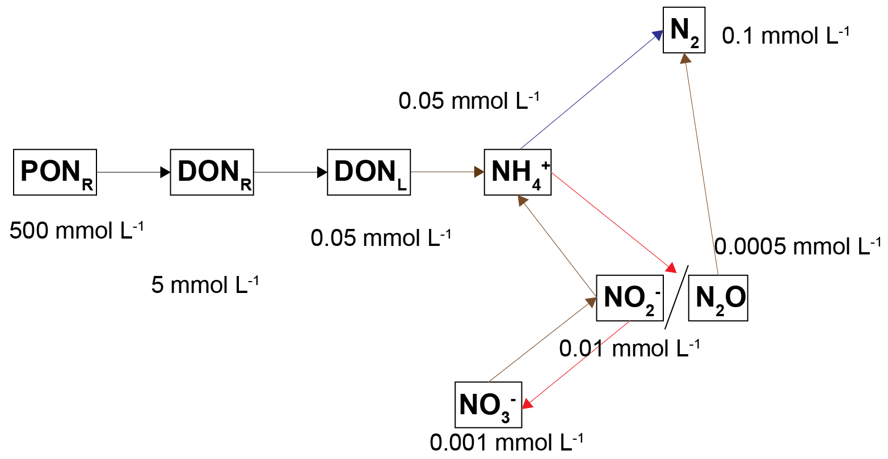

```
 

##### Uncoupled organic matter flux variation results {-}
The calibrations that met the organic nitrogen budget required a PONR influx of 4000 mmol m^{-2} y^{-1}. The calibrations that used the values from the water column model used PONR of 250 and PONS of 300 mmol m^{-2} y^{-1}: 550 in total. So the influx that met the budget required around four times the amount of flux. The POCS was added later in the calibration process as a means of increasing the influx while maintaining the link with the water column model. 

##### Uncoupled salinity variation {-}
With increasing salinity, two general states were observed in the model. At low salinity, macrofauna mixing was continuous. As salinity increased to the values around 35 to 70 PSU (parameters *Sal1* and *Sal2* in the $F_{Sal}$ function) a clear pattern could be seen where mixing increased and decreased in proportion to the salinity oscillation. However, the general concentrations remained approximately within the limits of the low salinity simulations. At high salinity, mixing ceased and the reaction products accumulated much closer to the sediment-water interface.

```{r dev-salsim1, echo = FALSE, out.width='75%', class = "text-image",fig.show='hold',fig.align='center', fig.cap = "General description of the results. At high salinity, mixing from bioturbation and bioirrigation does not occur."}

knitr::include_graphics("images/dev/23-sediment_biogeochemistry/CoorongImages/MixingNoMixing.pdf")

```
 

###### $NH_4^+$ and $H_2S$ patterns in low and high salinity {-}
At low salinity, $NH_4^+$ was approximately 0.05 mmol L^{-1} and accumulated in the deep sediment, towards 40 cm. Thus the $NH_4^+$ was removed from the system through burial. At high salinity, $NH_4^+$ reached approximately 0.4 mmol L^{-1} and accumulated at approximately 10 cm deep. At low salinity, $NH_4^+$ fluxed into the sediment because the concentration in the top few cm was low. At high salinity, $NH_4^+$ flux from the sediment to the water column was around 200 mmol L^{-1} y^{-1}. 

A similar pattern was present for $H_2S$ concentrations. At seawater salinity, $H_2S$ was approximately 0.4 mmol L^{-1} and accumulated in the deep sediment. At high salinity, $H_2S$ reached approximately 1.5 mmol L^{-1} and accumulated at approximately 10 cm deep. At seawater salinity, $H_2S$ flux from the sediment to the water column was approximately 50 mmol m^{-2} y^{-1}. At high salinity it was approximately 100 mmol m^{-2} y^{-1}.

```{r dev-salsims2, echo = FALSE, out.width='75%', class = "text-image",fig.show='hold',fig.align='center', fig.cap = "General result of the simulations for $NH_4^+$ and $H_2S$"}

knitr::include_graphics("images/dev/23-sediment_biogeochemistry/CoorongImages/LowDeep.pdf")

```
 

####### Uncoupled denitrification rates and salinity {-}
Deammonification occured in a narrow band of sediment at approximately 8 cm deep and magnitude of approximately 1.5×10-5 mmol L^{-1} y^{-1}. At intermediate salinity, the rate occurred at an oscillating depth. At high salinity, the rate was approximately 1.5×10-6 mmol L^{-1} and occurred at 1 cm deep. This general pattern was consistent for the other nitrogen redox reactions: high salinity caused the nitrogen redox processes to occur closer to the sediment-water interface and at a lower magnitude. 

###### Distinguishing salinity and SO42- effects on macrofauna mixing
The general patterns described above are explained through the effects of FSal and FSul. Both factors caused macrofauna mixing to decrease, and to respond quickly to a change in salinity concentration. 
When the salinity dropped during its seasonal oscillation, with enough mixing, $H_2S$ and $NH_4^+$ could be fluxed out of the sediment. However, if the $H_2S$ concentration reached a minimum value, a positive feedback occurred and the sediment switched over to its new equilibrium state. In the simulation with a salinity between 10 and 50 PSU, the sediment maintained its outflux of $H_2S$, and the concentration reached 0.5 mmol L^{-1} in the deep sediment. With a salinity between 25 and 75 PSU, $H_2S$ accumulated in the shallow sediment and though it oscillated in response to the salinity, it increased with each oscillation. 

In the simulation where FSal and FSul were turned off, even at the highest salinity concentration, $H_2S$ did not accumulate to high concentrations near the sediment-water interface. In the simulation where FSal was off but FSul was on, the result was the same. Although $H_2S$ accumulated to 0.4 mmol L^{-1} in the deepest sediment, this was not enough to cause a switch to a sulphide rich system. With this model setup, FSul alone was not enough to capture an environment in an unhealthy state. Further simulations with only FSul switched on may be able to capture this system with, for example, a longer simulation, a lower K$H_2S$ parameter, or a different FSul inhibition function.  

#### Uncoupled simluation summary {-}
##### Salinity and sulfur{-}
As salinity and SO42- concentration increased above a threshold, the ecosystem shifted to an unhealthy state. The simulation showed a mechanism of how this can occur. Below the threshold, any $H_2S$ produced from sulfate reduction was pumped out of the sediment by bioturbation. Above the threshold, $H_2S$ overwhelmed the bioturbation and it accumulated in the sediment. 

##### Iron and sulfur{-}
A high iron concentration held the ecosystem in a healthy state. The mechanism was clear, in that iron reduction prevented a large build-up of $H_2S$, both through inhibition of sulfate reduction and precipitation of FeS. Capturing this process was difficult because of the uncertainty over iron measurements at the field site. Though a range of concentrations was tested here, the results were very sensitive to assumptions about the distribution of total iron among its species. 

##### Nitrogen{-}
One of the focuses of the Coorong project was N removal. This study showed that N removal through denitrification was very small. Most of the N was present as organic N, which was not able to produce a large amount of inorganic N. Concurrently, large amounts of organic matter were shifted the nitrogen redox towards the species $NH_4^+$, rather than N2. Nonetheless, most of the N was bound in unreactive organic sediments. This means there was a large pool of N that could be released in the future, however, it is more likely that the N is buried in the deep sediment. 

##### Organic matter{-}
High organic matter concentration fit the other factors described here: causing less bioturbation, oxygen, denitrification and iron reduction. The general trend was clear from the simulation, however, the specifics were not. It was difficult to reconcile the different measurements and the theoretical processes. 
The organic N budget was approximately 1×105 tonnes N, which corresponded to approximately 400 mmol L^{-1}. The grab sample measurements averaged 34 mmol L^{-1} for TOC, which would suggest organic N of around 1 mmol L^{-1}. However, the grab samples TN measurements were around 0.0063 and 0.0176 mmol L^{-1}, which suggests that the assumptions in one of the unit conversions were not right. 
The water column model influx, as suggested by the water column model, was 250 mmol m^{-2} y^{-1}. The only way to reconcile the organic nitrogen influx with any of these concentrations was to have a slow reaction rate (the kinetic rate constant for the hydrolysis of PONR). This matched the theory if we assumed that the incoming organic nitrogen was from algal detritus (as suggested by the NMR studies) that was unable to decompose quickly in the sediment environment. However, this conclusion reaches the limit of our theoretical understanding of the processes, and our empirical data from the site. 


### Coupled model results

#### Top 5 cm budget {.unnumbered}

The total mass of TN and TP in both the north and the south lagoons was calibrated to the right order of magnitude as that measured in the field measurements (Figures \@ref(fig:dev-calpics1) to \@ref(fig:dev-calpics4)). The total mass decreased by a small amount over the course of the simulation.

```{r dev-calpics1, echo = FALSE, out.width='100%', class = "text-image",fig.show='hold',fig.align='center', fig.cap = " "}

knitr::include_graphics(c("images/dev/sed_TNNorth.png"))

```

```{r dev-calpics2, echo = FALSE, out.width='100%', class = "text-image",fig.show='hold',fig.align='center', fig.cap = "TN budgets in the top 5 cm. Above: North lagoon. Below: South lagoon. Left: each zone is displayed in the horizontal bars, changing over time across the x axis. Right: sum of all zones in the lagoon, changing over time across the x axis. The 'Target concentration' is the lagoon concentration as determined by UA."}

knitr::include_graphics(c("images/dev/sed_TNSouth.png"))

```

```{r dev-calpics3, echo = FALSE, out.width='100%', class = "text-image",fig.show='hold',fig.align='center', fig.cap = " "}

knitr::include_graphics(c("images/dev/sed_TPNorth.png"))

```

```{r dev-calpics4, echo = FALSE, out.width='100%', class = "text-image",fig.show='hold',fig.align='center', fig.cap = "TP budgets in the top 5 cm. Above: North lagoon. Below: South lagoon. Left: each zone is displayed in the horizontal bars, changing over time across the x axis. Right: sum of all zones in the lagoon, changing over time across the x axis. The 'Target concentration' is the lagoon concentration as determined by UA."}

knitr::include_graphics(c("images/dev/sed_TPSouth.png"))

```

<br>

#### Oxygen penetration depth {.panelset .unnumbered}

The $O_2$ concentration was generally higher, and the penetration was deeper in the northern zones, and it was lower and shallower in the southern zones. In general, the oxygen penetration depth ($OPD$) was higher than that indicated by the RAPID samples, though the spatia pattern reflected the field sampling.

The penetration of oxygen is shown to vary along the lagoon (Figure \@ref(fig:dev-sdgoxy)) in accordance with the porosity and bioturbation/bioirrigation depth, and this depth controls the vertical profiles of nutrient species like ammonia (Figure \@ref(fig:dev-sdgamm)).

##### Oxygen, DO {.unnumbered}

<center>

```{r dev-sdgoxy, echo = FALSE, out.width='70%', class = "text-image", fig.cap = "Simulated sediment concentrations of oxygen in different zones along the length of the lagoon."}

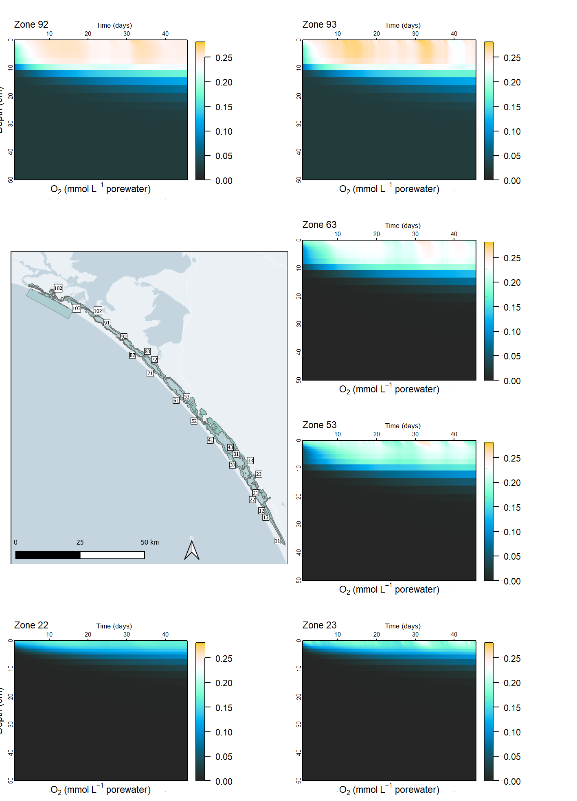
```

</center>

#####{-} Ammonium, NH4 {.unnumbered}

<center>

```{r dev-sdgamm, echo = FALSE, out.width='70%', class = "text-image", fig.cap = "Simulated sediment concentrations of ammonium in different zones along the length of the lagoon."}

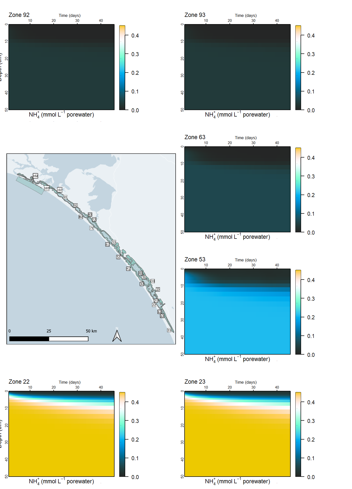
```

</center>

<br>

#### Cores {.unnumbered}

Simulated depth profiles of $NH_4^+$ matched the measured values well, in particular in zone 73 (Figure \@ref(fig:dev-calpics6)). This was a major result, considering the very large total mass of N tied up in $PON_R$ and the relatively small amount produced as $DON$ and $NH_4^+$.

In most cases the initial concentration was close to the final concentration, with a slight decay over time. In a few zones (51, 52, 53 and 63) the $NH_4^+$ concentration in the upper sediment centimetres was more responsive to the flux at the sediment-water interface.

```{r dev-calpics6, echo = FALSE, out.width='45%', class = "text-image",fig.show='hold',fig.align='center', fig.cap = "Ammonium concentration profile for zone 73, compared to data at Noonameena."}

knitr::include_graphics(c("images/dev/sed_C_D_core_zone73_amm_2020-11-30.png"))

```

Some measured $Fe^{2+}$ and $H_2S$ data showed a clear spike in the profile at around 10 cm (with the $H_2S$ spike being slightly deeper in the sediment than the $Fe^{2+}$ spike) (Figure \@ref(fig:dev-calpics7) and \@ref(fig:dev-calpics8)). The sediment model did not capture this, and so a future calibration would require getting the total magnitude of both species right, as well as the right depth of $O_2$ penetration. Since the $O_2$ was generally slightly too deep, it is assumed that a shallower $O_2$ depth would create the right anoxic zone for Fe and SO~4~^2-^ reduction.

```{r dev-calpics7, echo = FALSE, out.width='45%', class = "text-image",fig.show='hold',fig.align='center', fig.cap = "$Fe^{2+}$ concentration profile with simulated and measured data, as a snapshot at November 2020."}

knitr::include_graphics(c("images/dev/sed_C_D_core_zone33_feii_2020-11-01.png"))

```

```{r dev-calpics8, echo = FALSE, out.width='45%', class = "text-image",fig.show='hold',fig.align='center', fig.cap = "$H_2S$ concentration profile with simulated and measured data, as a snapshot at November 2020."}

knitr::include_graphics(c("images/dev/sed_C_D_core_zone33_$H_2S$_2020-11-01.png"))

```

<br>

#### Fluxes {.unnumbered}

The fluxes were generally within the right order of magnitude (Figure \@ref(fig:dev-calpics5)). Comparison was made with either the constant values used by the water column model for calibration, and the measured fluxes. Constant values were available for $O_2$, $NO_3^-$, $PO_4^{3-}$ and $NH_4^+$. Zone 52 had the most measured flux data, from Parnka Point and measured under dark and light conditions, with measurements for $O_2$, $NO_3^-$, $PO_4^{3-}$, $NH_4^+$, $N_2O$ and $CH_4$. Simulated fluxes were generally closer to the measured values than the constant values for $O_2$, $PO_4^{3-}$, $NH_4^+$. In the case of $NO_3^-$, the constant flux was close to the measured fluxes.

```{r dev-calpics5, echo = FALSE, out.width='100%', class = "text-image",fig.show='hold',fig.align='center', fig.cap = "Example of 12 sediment-water flux results for zone 52. Measured values are averages of several measurements for dark and light conditions and 'Constant fluxes' were those used in the previous calibration of the water column model."}

knitr::include_graphics(c("images/dev/sed_t_F_zone_52.png"))

```

<br>

### Nutrient behaviour and advanced biogeochemistry analysis

#### Nutrient species {.unnumbered}

Most of the TN and TP was present in unreactive OM, largely as a result of how the model was initialised to meet the total budget. The concentration of $PON$ was at approximately 500 to 1000 mmol L^-1^, while the concentrations of $DON$ and $NH_4^+$ were around 0.1 to 0.5 mmol L^-1^. Although the dissolved N concentrations were so much smaller than the solid concentration, they had an important effect on the water column concentrations.

<br>

#### Salinity and denitrification {.unnumbered}

High salinity and high $H_2S$ in the southern zones created inhibition. $F_{Sal}$ was at around 0.2 and $F_{Sul}$ around 0.7 (Figure \@ref(fig:dev-nutpics1)). In the northern zones, both factors were closer to 1.0, and therefore not inhibitory at all. The inhibition in the southern zones affected biota-driven mixing (see section below) and denitrification reactions (see section below).

```{r dev-nutpics1, echo = FALSE, out.width='95%', class = "text-image",fig.show='hold',fig.align='center', fig.cap = "Time-magnitude-depth profiles of $F_{Sal}$ and $F_{Sul}$ inhibition factors in four of the sediment zones, from north to south. The central figure shows the interpolated salinity from the UA survey. The higher salinity and higher $H_2S$ in the southern zones resulted in greater inhibition of other processes."}

knitr::include_graphics(c("images/dev/sed_FSalFSulBioturb_2-02.png"))

```

<br>

#### Sediment-water interface fluxes {.unnumbered}

Bioturbation and irrigation resulted from\
- the setup (depths) and\
- the $F_{Sal}$ and $F_{Sul}$ gradient along the lagoons (see above).

\
Note that the bioturbation and bioirrigation input parameters were 40 and 200 cm y^-1^, respectively (Figure \@ref(fig:dev-nutpics3)). In the southern zones, these raw inputs were decreased to around 8 for bioturbation and 40 for bioirrigation. The image from Zone 52, which is the intermediate area between the north and south lagoons, illustrates how the dynamic salinity boundary produced a dynamic response from biota-driven mixing. Future work could build in a time lag between the onset of the environmental condition and the result for the benthic fauna.

```{r dev-nutpics3, echo = FALSE, out.width='95%', class = "text-image",fig.show='hold',fig.align='center', fig.cap = "Time-magnitude-depth profiles of bioturbation and bioirrigation in four of the sediment zones, from north to south. The central figure shows the interpolated salinity from the UA survey. The higher salinity and higher $H_2S$ in the southern zones resulted in greater inhibition of bioturbation and bioirrigation."}

knitr::include_graphics(c("images/dev/sed_FSalFSulBioturb-01.png"))

```

As an example going across the breadth of the lagoon, bioturbation and bioirrigation in zones 61 to 63 are shown in Figure \@ref(fig:dev-nutpics2). The depth and magnitude of bioturbation are smaller in the central, deep zone 62, than on the shallow edge zones, 61 and 63.

```{r dev-nutpics2, echo = FALSE, out.width='100%', class = "text-image",fig.show='hold',fig.align='center', fig.cap = "Time-magnitude-depth profiles of bioturbation and bioirrigation in three sediment zones, across the breadth of the lagoon in zone 6. The deeper central zone had lower bioturbation than the edge zones."}

knitr::include_graphics(c("images/dev/sed_Z6Bioturb.png"))

```

The total mass of TN flux across the sediment-water interface was calculated for one year (Figure \@ref(fig:dev-nutpics4)). The flux was dominated by the influx of $PON$ from the water to the sediment. There was a relatively smaller amount of $NH_4^+$ outflux from the sediment to the water.

```{r dev-nutpics4, echo = FALSE, out.width='75%', class = "text-image",fig.show='hold',fig.align='center', fig.cap = "Total flux of TN across the sediment-water interface, calculated as a mass (tonnes). The smaller species, such as $NO_2$ were at such low masses that they do not appear on the figure. "}

knitr::include_graphics(c("images/dev/sed_TotalNFluxMass.png"))

```

Although the influx of $PON$ was a far larger amount than the outflux of $NH_4^+$, there was an overall loss of $PON_R$ in the upper 5 cm (Figures \@ref(fig:dev-nutpics5) and \@ref(fig:dev-nutpics6)). The $PON_R$ was hydrolysed to $DON_R$, which was mineralised to $NH_4^+$. Deeper than 10 cm, the $PON_R$ concentration was stable over time. The $DON_R$ concentration was dependent on the flux to the water column.

```{r dev-nutpics5, echo = FALSE, out.width='100%', class = "text-image",fig.show='hold',fig.align='center', fig.cap = "Time-concentration-depth figures for three major N species. Upper 25 cm of sediment over 50 days for zone 52."}

knitr::include_graphics(c("images/dev/sed_t_D_C_3N_zone_52.png"))

```

```{r dev-nutpics6, echo = FALSE, out.width='100%', class = "text-image",fig.show='hold',fig.align='center', fig.cap = "Sediment-water interface fluxes for major N species. The fluxes correspond to the concentration figures above."}

knitr::include_graphics(c("images/dev/sed_t_F_3Nzone_52.png"))

```

<br>

#### Nutrient burial {.unnumbered}

The change in mass at the 5 cm depth over a year was very small (around 1%) for both lagoons and for both $TN$ and $TP$. Using this definition of burial, very little of the nutrients were removed. The concentration of adsorbed $NH_4^+$ and $PO4^{3-}$ was also a small percentage of TN and TP, and stayed constant over the course of the simulation (see, for example, Figure \@ref(fig:dev-nutpics7)). It was not the case that adsorption was a major process for removing water column nutrients and locking them in the sediment. In the case of adsorbed $PO4^{3-}$, the lack of change in concentration was due, in part, to the relatively low amount of Fe reduction in the sediment.

```{r dev-nutpics7, echo = FALSE, out.width='95%', class = "text-image",fig.show='hold',fig.align='center', fig.cap = "Time-concentration-depth figures of adsorbed N and P in zone 52."}

knitr::include_graphics(c("images/dev/sed_t_D_C_pip_zone_52.png"))

```

<br>

#### Plants, microphytobenthos and macroalgae {.unnumbered}

$O_2$ penetration into the sediment from MPB and roots inhibited many of the nitrogen redox reactions in the upper sediment layers. However, the $O_2$ did allow the nitrification reactions. In the zones that had less $O_2$, nitrogen redox reactions were allowed to occur, however, they were also inhibited by $H_2S$ through $F_{Sul}$.

<br>

#### Denitrification {.unnumbered}

Little TN was lost through the denitrification reactions. Overall, conditions were not very favourable for denitrification, as the processes were either inhibited by $O_2$ and salinity from above, or inhibited by $H_2S$ from below. In areas that lacked mixing due to low bioturbation and bioirrigation, $NO_3^-$ was not mixed into the upper sediment layers. Where denitrification did occur, it was through the deammonification pathway, rather than denitrousation (see Figure \@ref(fig:dev-nutpics8)). The denitrousation pathway is favoured by mixing labile organic matter deeper into the sediment, and so a low amount of organic matter and inhibited bioturbation made denitrousation unfavourable in this simulation.

The total mass of N converted to $N_2$ in each lagoon over the course of the simulation was around 10 g.

```{r dev-nutpics8, echo = FALSE, out.width='95%', class = "text-image",fig.show='hold',fig.align='center', fig.cap = "Denitrification reactions in four zones across the lagoon from north to south. The occurrence of the process of deammonification can be seen at around 10 to 20 cm."}

knitr::include_graphics(c("images/dev/sed_FO2-04.png"))

```

<br>

Across the lagoon, there were at least three major types of sediment environment that affected denitrification rates. In the northern zones, where salinity was lower, the upper sediment was well-mixed and so water column variables such as $O_2$, $NO_3^-$ and organic matter went deeper into the sediment. Overall $SO_4^{2-}$, and therefore $H_2S$ concentration was also lower in the northner zones. In the southern zones, where salinity was high, the upper sediment was not well mixed. High concentrations of $O_2$, $NO_3^-$ and organic matter were held in the upper few mm, and reacted before they were mixed deeper. In some southern zones, salinity was high but plant roots added $O_2$ deeper into the sediment. Mixing was still low, and so $NO_3^-$ and organic matter were not mixed deep into the sediment. Denitrification reactions were able to occur just below the oxic zone.

```{r dev-nutpics9, echo = FALSE, out.width='100%', class = "text-image",fig.show='hold',fig.align='center', fig.cap = "Schematic of three of the possible sediment zone denitrification results. Left: low-salinity areas were well mixed and had $O_2$ added at a relatively deep layer. Centre: high-salinity zones had little mixing and so influxing chemicals were confined to the very top layers. Right: High-salinity zones with plants had $O_2$ but not other variables mixed into the deeper layers."}

knitr::include_graphics(c("images/dev/sed_3paneL^{-1}6.png"))

```

#### Integrated TN results {.unnumbered}

The mass of TN in the top 5 cm of the sediment was close to the target mass, and it can be refined after further calibration. Most of the TN was in the form of $PON_R$, which decayed from its initial concentration. As the $PON_R$ was hydrolysed to $DON_R$, the $DON_R$ solute was fluxed to the water column. Below 10 cm, the $PON_R$ concentration was relatively stable. The sediment received a greater mass of $PON_R$ and $PON_L$ than it returned to the water column, and so the sediment was a source of $NH_4^+$ and $DON_R$ but overall a sink of TN. The major TN pathways and masses are given in Table \@ref(tab:3dev-TotalTNa) and \@ref(tab:3dev-TotalTNb).

A challenge of this project was the accumulation of TN. The small extra amount of DON fluxed from the sediment to the water column created a high concentration of $NH_4^+$ in the water column by the end of a long simulation.

A future calibration will start with a check of $O_2$ penetration depth in each zone, compared to the rapid samples. A shallower $O_2$ depth would provide a better agreement with $Fe^2+$ and $H_2S$ depth profiles.

```{r 3dev-TotalTNa, echo=FALSE, message=FALSE, warning=FALSE}
sediment_Geochem <- read_xlsx("tables/sed/TotalTN.xlsx", sheet = "SCL" )
kable(sediment_Geochem ,"html", escape = F, align = "c", caption = "TN balance for the South Coorong Lagoon",
   bootstrap_options = "hover") %>%
  kable_styling(sediment_initial, bootstrap_options = "hover",
        full_width = F, position = "center",
        font_size = 12) %>%
 column_spec(1, width_min = "10em") %>%
 column_spec(2, width_min = "20em") %>%
 column_spec(3, width_min = "10em") %>%
 row_spec(1:5, background = 'white') %>%
 scroll_box(width = "600px", height = "300px",
      fixed_thead = FALSE)
```

\

```{r 3dev-TotalTNb, echo=FALSE, message=FALSE, warning=FALSE}
sediment_Geochem <- read_xlsx("tables/sed/TotalTN.xlsx", sheet = "NCL" )
kable(sediment_Geochem ,"html", escape = F, align = "c", caption = "TN balance for the North Coorong Lagoon",
   bootstrap_options = "hover") %>%
  kable_styling(sediment_initial, bootstrap_options = "hover",
        full_width = F, position = "center",
        font_size = 12) %>%
 column_spec(1, width_min = "10em") %>%
 column_spec(2, width_min = "20em") %>%
 column_spec(3, width_min = "10em") %>%
 row_spec(1:5, background = 'white') %>%
 scroll_box(width = "600px", height = "300px",
      fixed_thead = FALSE)
```

<br>

## Summary

Overall, the sediment diagenesis module SDG has been setup and applied successfully to the Coorong Lagoon. The approach adopts 31 independent simulated sediment zones, each with 50 layers that resolve the local sediment physical and chemical conditions and dynamically interact with the overlying water column. Several model development activities were undertaken to better resolve the processes at the sediment-water interface, account for benthic primary producers and infauna, and to account for the effect of hyper-salinity on various biogeochemical processes.

The model was able to be run in a computationally efficient way for the four-year GEN 2 simulations. The fluxes between the sediment and water were shown to be highly dynamic, and vary not only seasonally but also at finer time-scales. The model resolved the difference in sediment conditions in the south and north lagoon in response to different sediment organic matter contents, and organic matter deposition rates (e.g. from phytoplankton and filamentous algae).

The calibration of the model was found to be highly sensitive to assumptions of a) organic matter partitioning and reactivity, b) mineralisation rates and c) the settings related sediment-water exchange including bioturbation and bioirrigation.

The model is suitable for assessing scenarios related to restoration of the south lagoon by identifying sustainable conditions that will promote the optimal attenuation and burial of sedimented organic material.

---------------------------------------------------------------------------

Koch, M. S., et al. (2001). "Solid-phase phosphorus pools in highly organic carbonate sediments of northeastern Florida Bay." Estuarine, Coastal and Shelf Science 52(2): 279-291.
	
Mackin, J. E. and R. C. Aller (1984). "Ammonium adsorption in marine sediments 1." Limnology and Oceanography 29(2): 250-257.
	
Van Cappellen, P. and Y. Wang (1996). "Cycling of iron and manganese in surface sediments; a general theory for the coupled transport and reaction of carbon, oxygen, nitrogen, sulfur, iron, and manganese." American Journal of Science 296(3): 197-243.
	
------------------------------------------------------------------------

<!-- install.packages("kableExtra", lib="C:/Program Files/R/R-4.2.0/library") -->

<!-- install.packages("knitr", lib="C:/Program Files/R/R-4.2.0/library") -->

<!-- install.packages("readxl", lib="C:/Program Files/R/R-4.2.0/library") -->

<!-- library(rmarkdown, lib.loc = "C:/Program Files/R/R-4.2.0/library") -->

<!-- install.packages("downlit") -->

<!-- library(knitr) -->

<!-- library(kableExtra) -->

<!-- library(readxl) -->

<!-- library(downlit) -->
