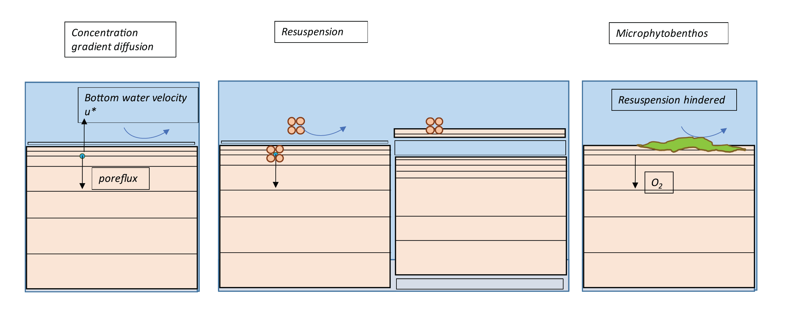

# Sediment Biogeochemistry

<br>

## Overview

In environments like the Coorong, where nutrient dynamics influence the rest of the ecosystem, management often focuses on reducing nutrient inputs and increasing flushing to the sea. However, it is important not to overlook the sediment as a long term source or sink of nutrients.
 
In previous versions of the Coorong model, a constant flux rate has been used for the lagoon – for example consumption of oxygen and release of ammonium. This is an efficient and simplified first step, however, the model can be improved by using the depth-resolved sediment diagenesis model. The sediment model can represent spatial heterogeneity along the lagoon, it can capture the future burial or release of nutrients and it can make use of the rich data sets measured in the field.
 
Under some conditions, the sediment stores can release nutrients to the water column, while under other conditions, the sediment can remove nutrients in the long term through burial, and the surface layers can remove nitrogen through denitrification. The fine balance that controls the conditions under which the sediment stores will store, release or remove nutrients is largely governed by the aerobic state of the sediment pore water, and the amount of reactive organic matter fuelling the reactions. The depth-resolved sediment model accounts for mixing from the hydrodynamic model into the upper sediment layers. It calculates whether organic matter is consumed aerobically, through denitrification or deeper down, through sulfate reduction or even methanogenesis.
 
The sediment model can also capture and contrast different environments in the Coorong. The model includes a depth of bioturbation and bioirrigation by macrobiota living in the sediment. The north lagoon of the Coorong has higher populations of macrobiota, which cause mixing of oxygen into deeper sediment layers, which in turn helps in removal of organic matter and reduced nitrogen. In contrast, in the south lagoon there is less bioturbation of the sediment and it is more likely that organic matter is consumed through anaerobic processes. The production of toxic H~2~S gas through sulfate reduction would lead to a further degradation of the ecosystem.  

## Model approach: CANDI-AED

The heart of this model is the reaction, diffusion, advection model of Berner (1980), which was implemented as the Carbon and Nutrient Diagenesis model of Boudreau (1996). CANDI-AED implementation however has evolved from the original code, and the main differences pertain to the treatment of organic matter, and the simulation of the geochemical conditions known to influence the diagenetic equations. However, the core organic matter breakdown equations (and their numerical solution) remains similar as the original descriptions presented in Boudreau (1996), and to other similar sediment models. An overview of the model is shown in Figure X.


```{r dev-pic00, echo = FALSE, out.width='80%', class = "text-image", fig.align='center', fig.cap = "CANDI-AED includes chemical processes of organic matter transformation and oxidation, and reduction/oxidation, crystallisation, adsorption and precipitation reactions of inorganic by-products. Most of the processes are triggered by the input of POM at the sediment-water interface."}

knitr::include_graphics("images/dev/sed_image2.png")

```


####	Sediment reactive transport model {-}

The model is based on a 1D approximation of the sediment and pore-water profiles. Each active sediment zone (or column) is discretized into a user defineable number of layers that start at thicknesses of around 1mm at the sediment-water interface and increase exponentially down to a pre-defined sediment depth. The model resolves in each layer both physical (e.g. pore-water diffusion or bioturbation) and chemical (e.g., redox transformations) processes; these are summarised next.

**Chemical reactions**

The dynamic model considers two types of reactions - the slow, kinetically controlled reactions, and the fast thermodynamically based equilibrium reactions. The latter are simulated in the sediment through appropriate configuration of the geochemistry reactions; the configuration of the equilibrium model will apply to both the water and each of the sediment layers. The kinetically controlled reactions are mostly microbially-mediated and include the reactions for organic matter breakdown and eventual oxidation, the re-oxidation of various by-products and the dynamics of the metal sulfides.

The organic matter ($OM$) degradation pathway considers labile and refractory $DOM$ components ($DOM$ and $DOM_R$ respectively) and the breakdown pathway simulated is conceptually summarized in Figure \ref{fig:sed_dynamic}. Reactions included in the kinetic component include the hydrolysis of the complex (e.g., high molecular weight) $OM$ pools ($POM_{VR}$, $POM_R$, $DOM_R$, $POM_L$) and transformation of Low Molecular Weight (LMW) $DOM_L$ by oxidants ($O_2$, $MnO_2$, $Fe(III)$ and $SO_4^{2-}$ - the so-called 'terminal metabolism'), and the release of resulting nutrients ($NO_3^-$, $NH_4^+$, $PO_4^{3-}$) and reduced by-products ($Mn^{2+}$, $Fe^{2+}$, $N_2$, $H_2S$, $CH_4$) and $CO_2$. Oxidants, nutrients and by-products are all capable of interacting, say through complexation or re-oxidation of reduced species for example.

The decay of the complex $OM$ types to the LMW $DOM$ required for the hetertrophic bacteria to utilise are all modelled with a simple first-order decay rate. The subsequent reactions that describe the breakdown of $DOM_L$ may be written as:
\begin{eqnarray}
\overbrace{(CH_2O)_{106}(NH_3)_{16}(H_3PO_4)}^{\textrm{organic matter}} &+& 138O_2 \rightarrow \nonumber
\\
&& 106CO_2 + 16HNO_3 + H_3PO_4 + 122H_2O
\\
\textrm{Free energy, } \Delta G_0 &=& -3190\:kJmol^{-1} \nonumber
\end{eqnarray}

\begin{eqnarray}
(CH_2O)_{106}(NH_3)_{16}(H_3PO_4) &+& 236MnO_2 +472H^+ \rightarrow  \nonumber
\\
&& 106CO_2 + 236Mn^{2+} + 8N_2 + H_3PO_4 + 366H_2O
\\
\textrm{Free energy, } \Delta G_0 &=& -3050\:kJmol^{-1} \nonumber
\\
\\
(CH_2O)_{106}(NH_3)_{16}(H_3PO_4) &+& 94.4HNO_3 \rightarrow  \nonumber
\\
&& 106CO_2 + 55.5N_2 + H_3PO_4 + 177H_2O
\\
\textrm{Free energy, } \Delta G_0 &=& -3030\:kJmol^{-1} \nonumber
\\
\\
(CH_2O)_{106}(NH_3)_{16}(H_3PO_4) &+& 212Fe_2O_3 +848H^+ \rightarrow  \nonumber
\\
&& 106CO_2 + 16NH_3 + H_3PO_4 + 742H_2O + 424Fe^{2+}
\\
\textrm{Free energy, } \Delta G_0 &=& -1410\:kJmol^{-1} \nonumber
\\
\\
(CH_2O)_{106}(NH_3)_{16}(H_3PO_4) &+& 53SO_4^{2-}  \rightarrow  \nonumber
\\
&& 106CO_2 + 16NH_3 + H_3PO_4 + 106H_2O + 53S^{2-}
\\
\textrm{Free energy, } \Delta G_0 &=& -380\:kJmol^{-1} \nonumber
\\
\\
(CH_2O)_{106}(NH_3)_{16}(H_3PO_4) &&  \rightarrow  \nonumber
\\
&& 53CO_2 + 53CH_4 + 16NH_3 + H_3PO_4
\\
\textrm{Free energy, } \Delta G_0 &=& -350\:kJmol^{-1} \nonumber
\end{eqnarray}

and the reaction rates for each of these are calculated dynamically based on Monod expressions which mediate the reaction rate according to the concentration of potential oxidants higher in the redox sequence, and the concentration of the available oxidant.

In addition to the primary redox reactions associated with $OM$ breakdown, the model also includes numerous secondary reactions, such as oxidation of reduced by-products (e.g., Fe or S oxidation).

**Physical processes**

Accounting for advection and diffusion reactions is fairly consistent across diagenesis models, and here we use the same methods. Porosity ($\phi$) is defined according to equation 5 - 104, which allows it to decrease with depth, and the solid fraction is defined from $\phi_s=(1-\phi)$. For bioturbation the model uses a diffusion coefficient that varies with depth ($D_{B(z)}$) as a two layer function or a Gaussian decrease (Boudreau 1996). For the porewater components, diffusion coefficients are used that are based on free-solution molecular diffusion constants corrected for sediment tortuosity, $θ$, according to equation 5 - 105.


####	Model extensions and development {-}

The above model approach is broadly used in lakes, ocean and estuarine environments, but there remain few cases in shallow lagoons (Paraska et al. 2014). Three main developments have been undertaken to adapt the code-base to the Coorong application (Figure \@ref(fig:dev-pics5)):

i.	Improved parameterisation of diffusion at the sediment-water interface
ii.	Inclusion of functionality to resolve resuspension effects
iii.	Addition of MPB

```{r dev-pics5, echo = FALSE, out.width='100%', class = "text-image", fig.cap = "Visual summary of model updates undertaken."}



```

**SWI diffusion**

Fluxes of dissolved species occur between the sediment and water column depending on the sediment type, solute and interfacial turbulence being experienced at the sediment-water interface. Dissolved fluxes are calculated from the concentration gradient at the sediment-water interface according to Fick’s Law:

<center>
\begin{equation}
F = D_{0}\frac{\Delta C}{\Delta x} = \frac{D_{0}}{\delta} (C_{bw} - C_{1})
(\#eq:biogeochem1)
\end{equation}
</center>

where $D_{0}$ is the diffusivity, $\delta$ is the thickness of the diffusive boundary layer at the sediment-water interface,  defined as the length scale of the first sediment layer, $C_{bw}$ is the bottom water concentration and $C_{1}$ is the concentration in the top sediment layer. The diffusivity in these models typically assumes molecular diffusivity rates, which is likely to underestimate the real diffsuivity experienced in a shallow algoon such as the Coorong. We therefore add a new parameterisation to resolve diffusivity based on sediment type an water turbulence proerties, based on the metric $u_*^3$.

**Resuspension effects**

To Be Completed

**SWI Productivity**

To Be Completed


<br>


####	Resolving sediment zonation {-}

Facility also exists within the model to use sediment zones'\ which are identical to the above description but are not necessarily coincident with the grid-structure of the water. This way sed-zones may be defined for the domain, and depending on the nature of the grid, the water cells above the sediment will be averaged for the purposes of the interfacial fluxes, allowing more efficient simulations (see for example Figure \ref{fig:sed_integration}). Using zones is a practical compromise between computational efficiency and capturing spatial heterogeneity in sediment properties and their fluxes.


```{r dev-pics3, echo = FALSE, out.width='100%', class = "text-image", fig.cap = "Schematic depicting sediment zone numerical approach."}

knitr::include_graphics("images/dev/sed_picture5.png")

```

**3-zone experiment**

To demonstrate the zones can function independently, a model test was performed with three zones. In this simulation each model zone received a sustained 1-year surface loading of organic material, which either was maintained for throughout the simulation duration (Zone 1), or was reduced to a new lower value (Zone 2 and 3); this can conceptually be considered as a test of the sediment model to respond to 'remediation' scenarios. The results highlight the individual zones responding accordingly, as shown for NO~3~ (Figure X).

```{r dev-pics4, echo = FALSE, out.width='100%', class = "text-image", fig.cap = "Example of sediment concentration-depth-time plot for ammonia, given different organic matter influx rates in three different zones. To demonstrate capability for spatial differences, the organic matter input stayed the same in Zone 1 but decreased after 1 year in Zones 2 and 3 to different levels."}

knitr::include_graphics("images/dev/sed_picture6.png")

```

####	Sediment-water coupling {-}

The sediment and hydrodynamic models are coupled at the sediment-water interface. The AED model setup has separate functions for coupling the bottom-most cell of the TUFLOW-FV hydrodynamic model to the top-most layer of the sediment model:

-	flux of solid material onto the sediment surface
-	concentration of dissolved substances in the bottom water
-	flux of dissolved substances from the top sediment layer


```{r dev-pics2, echo = FALSE, out.width='45%', class = "text-image",fig.show='hold',fig.align='center', fig.cap = "Schematic of sediment water coupling approach."}

knitr::include_graphics(c("images/dev/sed_picture3.png","images/dev/sed_picture4.png"))

```

**Zone tracer experiment**

*To Be Completed*


## Model setup and configuration

The Coorong lagoon is divided into 10(20) sediment zones along its length. One sediment model is run for each of the ten(twenty) zones. The zone boundaries are largely based on locations of sandbars and where the lagoon channel narrows and broadens. There are measured data points in all zones except for zone 1, south of the Salt Creek inflow. Zones 1 to 4 correspond to the South Lagoon, as mentioned in the Goyder Institute nutrient budget. Zone 5 is the intermediate area and zones 6 to 10 are the North Lagoon.

```{r dev-pics1, echo = FALSE, out.width='45%', class = "text-image",fig.show='hold',fig.align='center', fig.cap = "Example sediment zonation."}

knitr::include_graphics(c("images/dev/sed_picture1.png","images/dev/sed_picture2.png"))

```

The sediment model is calibrated initially without any coupling. The sediment-water interface boundaries are based on measured bottom water data, where available, or literature values. Some parameters are tuned so that measured data matches simulated variables, for concentration depth profiles and fluxes.

The sediment model is then coupled to the water column model. Many variables are set up to be linked between the two models; however, not all variables need to be linked. The fluxes and concentrations of linked variables in the bottom water are averaged across all cells in a zone, and this average value is passed to the sediment. Similarly, the value of a dissolved flux from the sediment is given to all bottom water cells within a sediment zone.


####	Parameters and settings {-}

The assigned parameters for the model are described below in Table X.

```{r 3dev-sedpars, echo=FALSE, message=FALSE, warning=FALSE}
library(knitr)
library(kableExtra)
sediment_parameters <- read.csv("tables/sediment_parameters.csv", check.names=FALSE)
kable(sediment_parameters,"html", escape = F, align = "c", caption = "Sediment physical and transport parameters",
      bootstrap_options = "hover") %>%
  kable_styling(sediment_parameters, bootstrap_options = "hover",
                full_width = F, position = "center",
                font_size = 12) %>%
  column_spec(1, width_min = "10em") %>%
  column_spec(2, width_min = "7em") %>%
  column_spec(3, width_min = "7em") %>%
  column_spec(4, width_min = "15em") %>%
  row_spec(1:19, background = 'white') %>%
  scroll_box(width = "690px", height = "800px",
             fixed_thead = FALSE)
```

<br>

####	Validation sites and data {-}

A wide diversity of data has been collected and is documentaed in Appendix A (Data Catalogue). In summary, there are four broad categories of field data available from the University of Adelaide surveys for model setup and parameterisation.

*Grab samples – C, N, P, Mn, Fe, S* : These are available for many sites but only one or two depths. They are useful for averaging a concentration at depth within a zone. These are key variables for sediment biogeochemistry.

*Cores – Fe, S, NH4+, PO43- GHGs* : The cores are available for only around four sites, but they are used for calibrating depth profiles and sediment-water fluxes. These often have data measured in the day and the night, as well as in November and March, which all have different concentrations and fluxes. The challenge will be to capture both day and night conditions, while also capturing seasonal changes.
The GHG models are new and require testing and development. It may be a challenge to tune these models to fit GHG flux measurements.

*Sediment quality* : These measurements are used for setting the initial porosity parameters. Once these are set they are not tuned further.

*Macroinvertebrates – bioturbation parameters* : These measurements are used for setting bioturbation and bioirrigation parameters. Broadly, the North Lagoon has high bioturbation and the South Lagoon has very little bioturbation. The depth to bioturbation is important, as it is expected that there is uninhabited black ooze below a certain depth.


## Validation and assessment

*To Be Completed*


## Lagoon scale predictions

*To Be Completed*


## Summary (Sept 2021)

The sediment biogeochemistry model has been implemented that can resolve the nature of sediment condition across the Coorong lagoon. The model has been demonstrated to capture sharp vertical gradients in nutients, organic matter and sulfides, and can be applied across discrete zones within the overall lagoon to resolve spatial heterogeneity. The model is now being calibrated against T&I1 project data.

<br>

***	

