# Oxygen, Nutrients & Chlorophyll-a

<br>

<!-- -->

## Overview

Coastal lagoons occur along 13% of the coastlines of all continents
[@barnes1980] and represent a special type of coastal systems in terms
of their hydrology and biogeochemistry, where strong gradients in
chemical variables and ecosystem function persist [@kjerfve1994].
Coastal lagoons like the Coorong are shallow with restricted connection
with the ocean, and become vulnerable to nutrient enrichment and
eutrophication. Choked lagoons have comparatively long water retention
time and high phytoplankton biomass [@knoppers1991; @newton2005] due to
the restricted water exchange. The relatively poor flushing, together
with shallow bathymetry and evaporation, leads to accumulation of salt
and nutrients within the basins that is not easily flushed out. Within
the South Lagoon in particular, the intense cycling of N and P between
the organic and inorganic forms is mediated by the many complex controls
on oxygen solubility and primary productivity.

Furthermore, the biogeochemical cycle of hypersaline environments is
highly distinct from typical freshwater, estuarine or marine
environments because it is strongly affected by changes in the
physicochemical parameters of the brine as well as in the state and
composition of the biological community in response to the salinity
variations [@zhang2011; @isaji2019; @mosley2020]. The use of water
quality models in the management of coastal water has been well
recognised and many models have been utilized to date for coastal
management, however, water quality models considering hypersaline lagoon
environments are relatively rare although extensive hydrodynamic
modelling has been undertaken in these systems.

Therefore, whilst the base AED model platform being used in previous
model versions has been a good starting point, there is a need to tailor
the setup to the hypersaline Coorong lagoon system. The aim of this
section is to describe the approach, model adjustments and model
assessment in terms of how the model is applied to capture the core
biogeochemical components: the oxygen, nutrients, and phytoplankton that
form the foundation of the elemental cycles in the lagoon.

<br>

<!-- -->

## Dissolved Oxygen

### Background

Dissolved Oxygen ($DO$) dynamics respond to processes of atmospheric
exchange, sediment oxygen demand, microbial use during organic matter
mineralisation and nitrification, photosynthetic oxygen production and
respiratory oxygen consumption, chemical oxygen demand and respiration
by other biotic components. In general, within the Coorong, dissolved
oxygen levels are affected by salinity and temperature changes, which
control oxygen solubility. In the South Lagoon however, enriched
sediments create a large sediment oxygen demand ($SOD$), which can casue
a temporary sag in the oxygen saturation levels, particualr under
quiescent conditions when wind mixing is unable to replenish low oxugen
in the bottom waters. Superimposed on this is the often patchy
photosynthetic inputs of oxygen by phytoplankton and filamentous
macroalgae, and their subsequent high respiratory demands under dark
conditions.

### Model setup

The CDM oxygen modelling approach follows the AED oxygen model setup as
outlined in the [AED science
manual](https://aquaticecodynamics.github.io/aed-science/DO_1.html). The
configuration used in the CDM simulations includes:

-   atmospheric exchange, based on oxygen solubility
-   phytoplankton photosynthesis and respiration
-   microphytobenthos photosynthesis and respiration
-   macroalgae photosynthesis and respiration
-   sediment oxygen demand
-   oxygen consumption due to nitrification
-   oxygen consumption due to organic matter mineralisation

The sediment oxygen demand is calculated either by the static sediment
oxygen model, or when the SDG model is engaged, then the sediment oxygen
demand is computed dynamically based on the oxygen gradient across the
sediment-water interface.

The settings for the model run with the static sediement oxygen demand
models, include sensitivity of the SOD to temperature and oxygen
concentration in the overlying water. The base oxygen flux rate is
however specified for each sediment zone; this is summarised in more
detail in the subsequent section.

Aside from the sediment oxygen demand, the parameters used in the oxygen
module are largely fixed and based on either the solubility constants
for oxygen, and the reaction rates computed in the nutrient and primary
producer modules based on a pre-determined oxygen stoichiometry.

### Model results

The oxygen predictions have been assessed over various years of
conditions in the Coorong (2017-2021) based on the routine oxygen
monitoring data available, in addition to the once-off high-frequency
oxygen logger deployment undertaken at McGrath. In assessing the model
performance, we sought to ensure:

-   the mean solubility condition across the lagoon was resolved along
    the salinity gradient
-   the seasonal cycle of solubility was reproduced in the mouth, south
    lagoon and north lagoon
-   the high-frequency measurements of diel oxygen variation were
    resolved in the deep (open) water monitoring sites, and
-   the high-frequency measurements of diel oxygen variation were
    resolved in the shallow (littoral) water monitoring locations, which
    have higher densities of macrophytes and macroalgae.

The results of the integrated assessment for the final calibrated model
are shown in Chapter 9, and below some focused results are presented to
demonstrate model performance in simulation oxygen dynamics.

#### Oxygen metabolism at McGrath {.unnumbered}

Figure \@ref(fig:water-oxy1) shows the modelled dissolved oxygen
saturation levels against the high frequency oxygen logger data that was
collected at the site of McGrath. The results indicate the model
captures diel oxygen metabolism at this site well, with fluctuations of
high oxygen saturation levels in the day time and low oxygen saturation
level at the night time, due to primary production and respiration,
respectively.

```{r water-oxy1, echo = FALSE, out.width='100%', class = "text-image", fig.cap = "(a) Long-term time-series and (b) zoom-in view of the modelled vs. measured DO saturation levels at McGrath."}

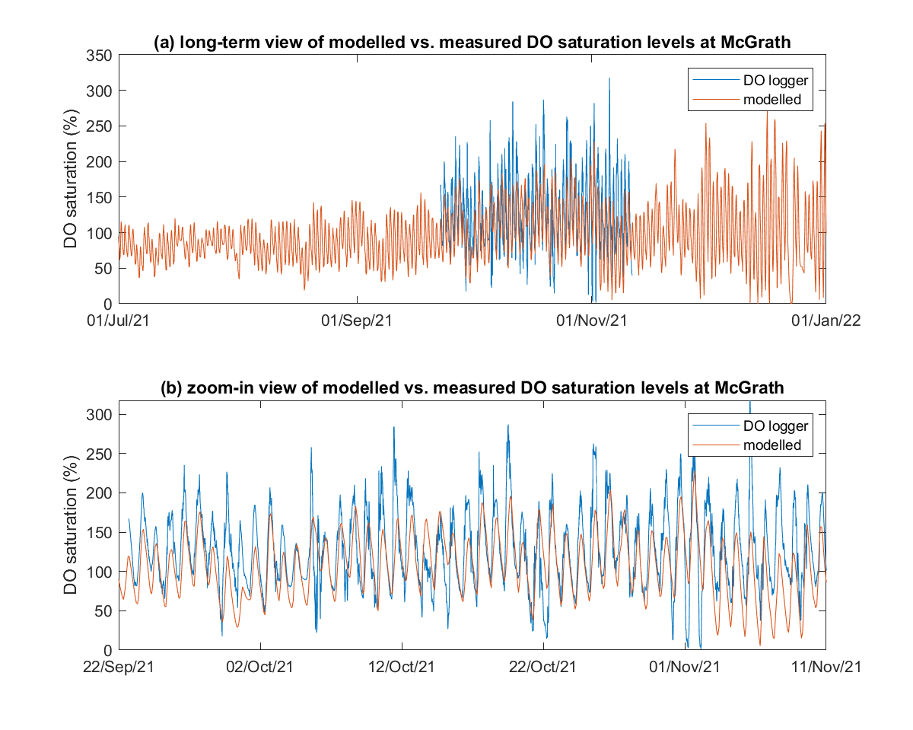

```

#### Long-term oxygen predictions {.unnumbered}

The predictions of oxygen concentrations for the main calibration
(2020-2021) and validation (2017-2021) multi-year assessments are shown
in [Appendix B : Results Archive].

<br>

<!-- -->

## Nitrogen, Phosphorus & Silica

### Background

Nutrient retention in the Coorong lagoon is currently a core management
driver, linked to habitat quality and a key target of proposed
management interventions. Recent analysis of the available historical
nutrient data across the lagoon has shown the sharp gradients in
nutrient species, and often high levels of nutrients in the South Lagoon
in particular (Mosley et al., 202X). Furthermore, process investigations
have elucidated the high rates of benthic metabolism and rates of
productivity, contributing to a system with intensively cycled materials
between ecosystem pools. Yet, we currently have only a limited
understanding of the nutrient budget within the lagoons and the
hydrodynamic and biogeochemical controls on elemental cycling. In this
section, we outline the model setup and approach to parameterisation and
parameter selection for the key pools and processes relevant to the
Coorong.

### Model setup

#### General approach {.unnumbered}

The CDM approach to simulate nutrients includes the
[nitrogen](https://aquaticecodynamics.github.io/aed-science/inorganic-nitrogen.html),
[phosphorus](https://aquaticecodynamics.github.io/aed-science/inorganic-phosphorus.html),
[silica](https://aquaticecodynamics.github.io/aed-science/silica.html)
and [organic
matter](https://aquaticecodynamics.github.io/aed-science/organic-matter.html)
modules within AED. Both the inorganic and organic, and dissolved and
particulate forms of C, N and P are modelled explicitly along the
general degradation pathway of POM to DOM to dissolved inorganic matter
(DIM), however the need for discrete OM pools is elaborated upon below.
The nitrogen cycle includes the additional processes of denitrification
and nitrification that are not in the carbon and phosphorus cycles.

An 8-pool organic matter module able to capture the variable reactivity
of the OM pool and its stoichiometry is included. Under this conceptual
model the decomposition of particulate detrital material is broken down
through a process of enzymatic hydrolysis that slowly converts POM to
labile DOM. A small fraction, f_ref, of this material is diverted to the
DOM-R pool. The bioavailable DOM material enters the bacterial terminal
metabolism pathways. These are active depending on the ambient oxygen
concentrations and presence of electron acceptors, and of most relevance
to the reservoirs, these pathways aerobic breakdown, denitrification,
sulfate reduction, and methanogenesis. In most model approaches it is
assumed these communities vary in response to temperature, and are
mediated using a simple oxygen dependence or limitation factor.
Reoxidation of reduced by-products is also included to account the role
of nitrifiers, sulfate oxidising bacteria (SOB) and methane oxidising
bacteria (MOB).

Filterable reactive phosphorus also is known to adsorb onto suspended
solids (SS), however, the rate is often site specific. Particulate
organic matter in that deposits into the sediment may also be
resuspended back into the water column when the bottom shear stress is
adequate. In addition to the normal process descriptions included in the
AED modules summarised above, several adjustments were made during the
Coorong application, as dsicussed next.

#### Impact of hypersalinity on nitrification and denitrification {.unnumbered}

The hypersalinity in the Coorong also has potential to impair the
nitrification-denitrification process which is regarded as a function to
remove the nitrogen in healthy coastal wetland systems. Multiple studies
have suggested that the nitrification and denitrification rates in
estuarine environments generally decrease with increasing salinity
[@helder1983; @isaji2019; @enrich-prast2015]. Salinity inhibits ammonia
oxidizing bacteria activity that has been observed to lead to enrichment
of ammonium with salinity [@cui2016; @isaji2019]. This is coincident
with the finding in the Coorong that strong ammonium flux from sediment
and high ammonium concentrations within surface sediments observed at
Parnka Point [@mosley2020]. In the Coorong, it also has been found that
the denitrification gene *nirK* had a strong inverse relationship with
salinity, and the decline of the *nirK* concentration became more
significant when the salinity was over about 40 PSU [@mosley2020].
Therefore, a Michaelis-Menten kinetic function of salinity limitation
has been adopted for the nitrification and denitrification rates within
the water columns as:

```{=tex}
\begin{equation}
  f_{SAL}=\begin{cases}
    1, & \text{when $S \le S_{thresh}$}\\
    \frac{K_S}{K_S+(S-S_{thresh})}, & \text{when $S>S_{thresh}$}
  \end{cases}
\end{equation}
```
where $f_{SAL}$ is the limitation factor, $S$ the salinity, $S_{thresh}$
the salinity threshold when limitation starts to work, and $K_S$ is the
half saturation coefficient. In the Coorong, the $S_{thresh}$ is set to
40 PSU and $K_S$ is set to 20 PSU as interpolated from the report of
@mosley2020. This is shown graphically in Figure \@ref(fig:water-sal1).

```{r water-sal1, echo = FALSE, out.width='100%', class = "text-image", fig.cap = "Limitation factor of salinity on base nitrification and denitrification rates."}

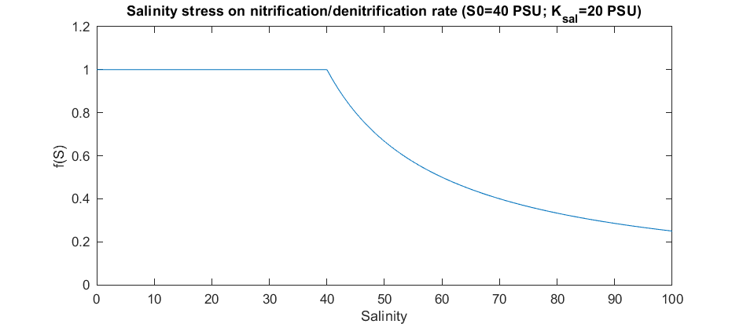

```

#### Impact of salinity and temperature on phosphorus adsorption-desorption {.unnumbered}

Because of low solubility of P-bearing minerals in the earth's crust and
a strong affinity of dissolved phosphate to adsorb on the solid
surfaces, sediment, including suspended particles, has been identified
as the dominant P reservoir in both freshwater and coastal marine
environments. Suspended particles are able to adsorb or desorb phosphate
in the water, depending on the sediment phosphorus contents and a range
of environmental conditions. Adsorption can vary considerably along a
salinity gradient [@sundareshwar1999; @zhang2011] as well as affected by
the temperature [@zhang2011]. For this process adoption of the
algorithm, as implemented by @zhang2011, is a convenient method. In this
method, the PO4 adsorption capability ($K_{PO4-P}$), defined as the
ratio of $PO_4$ concentration in the particles and water per mg of
suspended particles, is calculated as:

<center>

```{=tex}
\begin{equation}
K_{PO4-P} = (60- [EPC]_0)/(100 ×[EPC]_0)
(\#eq:watereq1)
\end{equation}
```
</center>

where the $[EPC]_0$ is the equilibrium $PO_4$ concentration in the water
and is a function of the exchangeable $PO_4$ content in the particle
$P_{exch}$, calculated as:

```{=tex}
\begin{equation}
[EPC]_0 = A × P_{exch} +B×P_{exch}^2
(\#eq:watereq2)
\end{equation}
```
where $A$ and $B$ in Eq \@ref(eq:watereq2) are coefficients as a
function of salinity and temperature through multi-parameter regression
analysis from laboratory experiments as:

```{=tex}
\begin{equation}
A=-140.5+1098.2/T+30.67× ln(T)+0.0907×S \\
B=1225.96-6880.49/T-278.77×ln(T))+0.4561×S
(\#eq:watereq3)
\end{equation}
```
where $T$ is the water temperature in °C, $S$ is the salinity in PSU. In
the Coorong, the $P_{exch}$ is estimated as 0.78 µmol P/g from the field
survey data [@mosley2020]. The resulting $PO4$ adsorption capability
under a range of temperature and salinity is shown graphically in Figure
\@ref(fig:water-sal2).

```{r water-sal2, echo = FALSE, out.width='100%', class = "text-image", fig.cap = "Response of the adsorption capability of phosphorus of suspended particles to water temperature and salinity."}

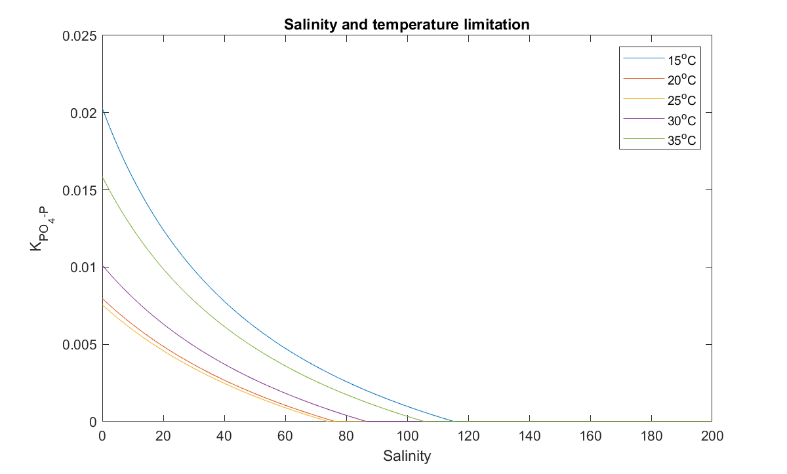

```

#### Nutrient flux at the sediment-water interface (SWI) {.unnumbered}

One of the key drivers of lagoon water quality is the sediment
biogeochemical processes and the exchange of nutrient at the SWI
[@crowe2012]. In shallow waters, hydrodynamics and diffusion have been
regarded as the crucial factors to dominate the rate of sediment
nutrient release. More specifically, two modes are responsible for
nutrient release from sediment layers to overlying water: static release
by nutrient diffusion in relatively calm situations as driven by a
concentration gradient, and dynamic release accompanied by
hydrodynamic-induced sediment resuspension [@qin2006; @teng2003]. In
open water where the fetch is long, in particular, the dynamic release
can be the dominant mode since the water-sediment interface is
frequently disturbed by hydrodynamic processes [@qin2006]. @fan2001 have
claimed that the internal phosphorus (P) load induced by resuspension
was 8--10 times larger than the static release, while @reddy1996 have
reported that ammonia concentration increased ten times in the overlying
water caused by resuspension compared with gradient diffusion. It is
also found that internal P from sediment resuspension resulting from
moderate wind could be comparable in magnitude to the daily external
supply @gelencser1982. Thus, the disturbance at the water-sediment layer
induced by wind can significantly affect SS and nutrient behaviors in
shallow aquatic ecosystems [@huang2016].

Resuspension leads to a predictable increase of suspended solids
(including POC) in the overlying water, but the impacts on the dissolved
nutrient release rate depends on many factors. Tengler et al (2003)
showed the resuspension led to an increase flux of NO3, but decrease of
PO4 and no change of NH4. Similarly, @teng2003 and [@sondergaard1992]
found that resuspension can led to either higher or lower concentration
of phosphate in the overlying water, depending the iron level of the
suspended solids. Furthermore, the effects of resuspension on the
long-term nitrogen and phosphorus liberation may be mild. [@sloth1996]
showed small changes in nutrient fluxes in the laboratory study, and the
measured parameters of a marine system returned to the condition before
the resuspension events. @black1997 also stated that natural
resuspension does not significantly contribute to a long-term change of
sediment nitrogen release. The nitrogen release with or without
resuspension is just a matter of time, that is a sudden or a gradual
release but to the same extent.

In the Coorong, the effects of wind-induced resuspension on the nutrient
release in the Coorong may be relatively mild. In the field survey of
waves and resuspension in the Coorong, there was no significant change
in nutrient levels due to resuspension. Total nutrient concentrations
did not show a consistent relationship to any other variables and TN and
TP had a moderately negative relationship to each other. Dissolved
nutrient concentrations were consistently below minimum detectable
levels. This is probably due to the major components of N/P released by
resuspension was the particulate forms [@tang2020]; also, the sediment
experiment showed a strong diffusive nutrient flux of NH4 and PO4 under
calm condition, which indicate the diffusive flux of nutrient is the
major process of sediment release in the Coorong. The major components
of TSS in the Coorong was found to be phytoplankton, where the inorganic
suspended particles contributed relatively small to the TSS.

Therefore, in the CDM generation one the "static" sediment flux
algorithm is adopted that is suited to long-term studies and assumed the
OM concentration is thought to be relatively stable. The sediment oxygen
demand and nutrient flux rates were set based on the sediment flux data
from the site of Parnka Point (Table \@ref(tab:5-sedpars)) which were
then interpolated into the zones based on the sediment particle sizes
and organic matter contents, following a role of thumb that the oxygen
demand and nutrient flux increased with the organic matter contents
(Table \@ref(tab:5-zonepars)).

<br>

```{r 5-sedpars, echo=FALSE, message=FALSE, warning=FALSE}
library(knitr)
library(kableExtra)
library(readxl)
library(rmarkdown)
theSheet <- read_excel('tables/water/sediment_flux.xlsx', sheet = 3)
theSheet <- theSheet[theSheet$Table == "Data",]
theSheetGroups <- unique(theSheet$Group)

for(i in seq_along(theSheet$Units)){
  if(!is.na(theSheet$Units[i])==TRUE){
    theSheet$Units[i] <- paste0("$$",theSheet$Units[i],"$$")
  } else {
    theSheet$Units[i] <- NA
  }
}

kbl(theSheet[,3:6], caption = "Summary of dissolved sediment flux data collected within the Coorong (HCHB T&I 1) and used in the CDM model.", align = "l",) %>%
  pack_rows(theSheetGroups[1],
            min(which(theSheet$Group == theSheetGroups[1])),
            max(which(theSheet$Group == theSheetGroups[1])),
            background = '#ebebeb') %>%
  pack_rows(theSheetGroups[2],
            min(which(theSheet$Group == theSheetGroups[2])),
            max(which(theSheet$Group == theSheetGroups[2])),
            background = '#ebebeb') %>%
  pack_rows(theSheetGroups[3],
          min(which(theSheet$Group == theSheetGroups[3])),
          max(which(theSheet$Group == theSheetGroups[3])),
          background = '#ebebeb') %>%
  pack_rows(theSheetGroups[4],
          min(which(theSheet$Group == theSheetGroups[4])),
          max(which(theSheet$Group == theSheetGroups[4])),
          background = '#ebebeb') %>%
row_spec(0, background = "#14759e", bold = TRUE, color = "white") %>%
  kable_styling(full_width = T,font_size = 11) %>%
  scroll_box(fixed_thead = FALSE)
```

<br>

These sediment flux parameters serve as the default values used in the
intial simulations. When the model is run with the dynamic sediment
biogeochemistry model this fluxes in the tables are not used as input
parameters, but rather as guides for validation of the predicted rates -
see Chapter 7 for further detail about the dynamic prediction of
sediment nutrient fluxes.

<br>

```{r 5-zonepars, echo=FALSE, message=FALSE, warning=FALSE}
library(knitr)
library(kableExtra)
library(readxl)
library(rmarkdown)
theSheet <- read_excel('tables/water/sediment_flux.xlsx', sheet = 4)
theSheet <- theSheet[theSheet$Table == "Data",]

kbl(theSheet[,2:7], caption = "Summary of sediment oxygen demand and nutrient fluxes setting in the CDM with 31 material zones.", align = "l",escape = F, ) %>%

row_spec(0, background = "#14759e", bold = TRUE, color = "white") %>%
  kable_styling(full_width = T,font_size = 11) %>%
  scroll_box(fixed_thead = FALSE)
```

<br>

#### Parameter summary {.unnumbered}

A summary of the overall model parameters used within the CDM
simulations related to nutrient dynamics are summarised below in Table
X.

### Model results

A summary of the model performance for several nutrient variables is
shown in Figure \@ref(fig:water-nut1), for a wet and dry period in
2018-2019. The results show the gradient along the lagoon, and also the
very low concentrations of bio-available nutrient fractions within the
total pool. Further results of the nutrient variables are reported in
the integrated assessment of the model in Chapter 9. The predictions of
nutrient concentrations for the main calibration (2020-2021) and
validation (2017-2021) multi-year assessments are shown in [Appendix B :
Results Archive]. Appendix B also includes the results of a sensitivity
analysis undertaken to assess the relative importance of sediment
nutrient flux rates on the overlying water nutrient and chlorophyll-a
concentrations.

```{r water-nut1, echo = FALSE, out.width='100%', class = "text-image", fig.cap = "Performance of predicted nutrient concentrations along the length of the Coorong. The observed (field) data is from available monitoring over the period of a dry season (left) and wet season (right), presented as a box-whisker plot for each site based on all data available for that site within that period."}

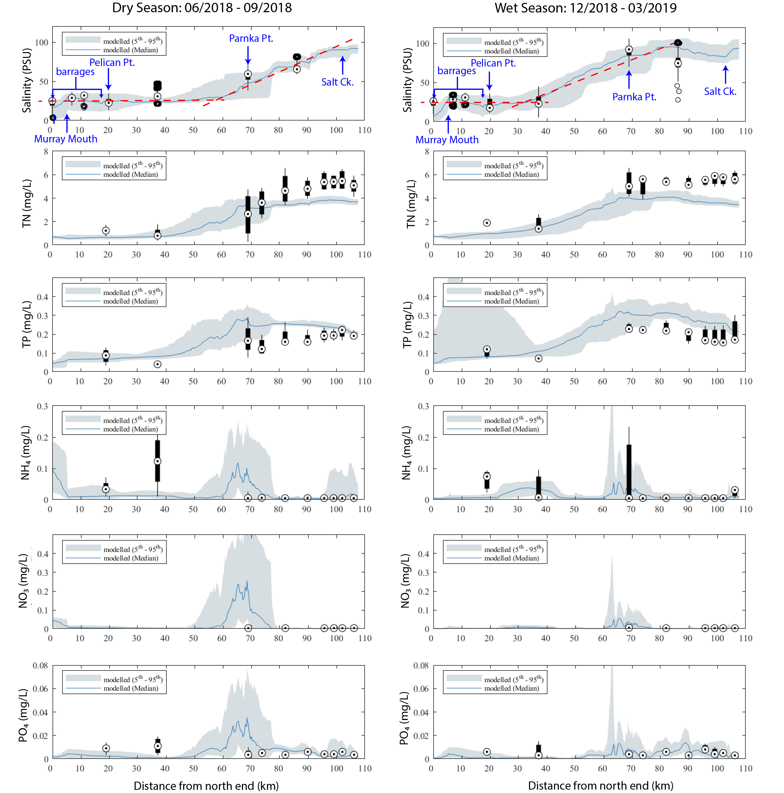

```

<br>

<!-- ------------------- -->

## Phytoplankton & Chlorophyll-a

### Background

Within the Coorong, salinity has been identified as the most important
driver of the phytoplankton community [@scha2010; @jend2014; @lete2015].
The water in the north lagoon is brackish because of mixing between the
ocean and barrage flows, and this area is generally dominated by
chlorophytes since the salinity threshold for dominant chlorophyte
species in the lagoon is reported to be \~28 PSU. On the other hand, the
water in the south lagoon is hypersaline and generally dominated by
diatoms. Cryptophytes and dinoflagellates have also be documented
throughout both lagoons but in comparatively lower abundance and biomass
[@jend2014; @lete2015].

More specifically, this paper proposed 4 salinity regimes that tend to
shape phytoplankton habitat:

-   waters in the H1 category (\<5 PSU) which tend to be dominated by
    chlorophytes, although diatoms and cryptophytes sporadically
    accounted for between 10 and 50% of the overall phytoplankton
    abundance at Site 1 and Site 2.
-   waters in the H2 category (5--20 PSU) are co-dominated by
    chlorophytes, diatoms and cryptophytes with no significant temporal
    differences in the relative overall abundance evident.
-   waters in the H3 category (21--40 PSU) saw a drastic decrease in the
    prevalence of chlorophytes compared to lower salinity habitats, and
    a marked increases in the abundance of dinoflagellates, particularly
    toward the higher end of the salinity spectrum.
-   waters the H4 category (\>41 PSU) which are mainly dominated by
    diatoms, although the abundance of dinoflagellates was sometimes
    higher than that of diatoms.

Aside from these main habitat-species groupings, @scha2010 had
previously reported on the Coorong phytoplankton community. The major
conclusions from theri study were:

-   salinity was identified as the main factor structuring the
    distribution of pico-phytoplankton along the lagoon;
-   the highest pico-phytoplankton abundances were recorded under
    salinity conditions ranging between 8.0% and 11.0%;
-   one population of pico-eukaryote dominated the community throughout
    the salinity gradient and was responsible for the bloom observed
    between 8.0% and 11.0%. Only this halotolerant population and
    *Prochlorococcus*-like pico-cyanobacteria were identified in
    hypersaline waters (i.e. above 14.0%).

In addition to the phytoplankton assemblage (algae and cyanobacteria
suspended in the water), the lagoon is also characterised by benthic
microalgae - the so-called microphytobenthos (MPB). These have been
shown to vary along the lagoon as part of the The Living Murray
ecological sampling (Dittman et al. 2021). As with the phytoplankton
biomass, the benthic chlorophyll-a biomass is also controlled by the
sharp salinity gradient with significantly higher biomass in the North
Lagoon.

The subsequent sections document the phytoplankton ($PHY$) and
microphytobenthos ($MPB$) modelling approach and rationale, and the
results and analysis, with comaprisons against available chlorophyll-a
data within the lagoon.

### Model setup: Phytoplankton

The approach to simulate algal biomass is to adopt several plankton
functional types (PFTs) that are typically defined based on specific
groups. Whilst each group that is simulated is unique, they share a
common mathematical approach and each simulate growth, death and
sedimentation processes, and customisable internal nitrogen, phosphorus
and/or silica stores. Distinction between groups is made by adoption of
group's specific parameters for environmental dependencies, and/or
enabling options such as vertical migration or N fixation. This way the
group-specific traits are used to inform the groups parameterisations.

Based on the findings of the above-cited studies, the phytoplankton
community in the CDM has been configured into four PFTs, according to
their salinity tolerance and literature review of their biogeochemical
properties asscoiated with the dominant taxa - spanning green algae
(chlorophytes), cryptophytes, dinoflagellates, and diatoms.

The algal biomass of each group, $PHY_C$, is simulated in units of
carbon ($mmol\:C/m^3$), and the groups have been configured to have a
constant C:N:P:Si ratio (this can be alternatuvely changed to use
dynamic stoichiometry and uptake of N and P sources in response to
changing water column condition and cellular physiology if preferred).
The total water column chlorophyll-a is calculated from the sum of the
individual groups with a carbon:chlorophyll-a conversion applied.
Balance equations that capture the various processes impacting
phytoplankton are outlined in the full description of the phytoplankton
model within the [AED science
manual](https://aquaticecodynamics.github.io/aed-science/phytoplankton.html).
Key aspects relevant to the Coorong implementation are summarised in the
following sections, including the salinity limitation functions and
parameters used to differentiate the phytoplankton groups within the
community.

The four pools configured to simulate the biomass of phytoplankton, were
denoted $grn$, $crypt$, $diatom$ and $dino$, which map to the mixed
assemblage groups identified above as $H1$ - $H4$. The parameters used
in the setup are outlined in Table (Table \@ref(tab:5-phytopars)).

<br>

```{r 5-phytopars, echo=FALSE, message=FALSE, warning=FALSE}
library(knitr)
library(kableExtra)
library(readxl)
library(rmarkdown)

# function to fix floating point decimals
# df = dataframe to fix
# colNames = list() of colummns to fix
fixDecimals <- function(df, colNames){
  for(i in colNames){
    for(ii in 1:NROW(df[,i])){
      currentVal <- df[ii,i]
      currentVal <- as.numeric(currentVal)
      if(!is.na(currentVal)==TRUE){
        newVal <- as.character(currentVal)
        df[ii,i] <- newVal
      } 
    }
  }
  return(df)
}

theSheet <- read_excel('tables/water/phytoplankton_parameters.xlsx', sheet = 1)
theSheet <- fixDecimals(
  df = theSheet, 
  colNames = list("Parameter1","Parameter2","Parameter3","Parameter4")
  )
theSheet <- theSheet[theSheet$Table == "Parameter",]
theSheetGroups <- unique(theSheet$Group)

for(i in seq_along(theSheet$Parameter)){
  if(!is.na(theSheet$Parameter[i])==TRUE){
    theSheet$Parameter[i] <- paste0("$$",theSheet$Parameter[i],"$$")
  } else {
    theSheet$Parameter[i] <- NA
  }
}
for(i in seq_along(theSheet$Unit)){
  if(!is.na(theSheet$Unit[i])==TRUE){
    theSheet$Unit[i] <- paste0("$$\\small{",theSheet$Unit[i],"}$$")
  } else {
    theSheet$Unit[i] <- NA
  }
}

kbl(theSheet[,3:NCOL(theSheet)], caption = "Summary of the phytoplankton parameters used in the CDM version of the AED model.", align = "l",) %>%
  pack_rows(theSheetGroups[1],
            min(which(theSheet$Group == theSheetGroups[1])),
            max(which(theSheet$Group == theSheetGroups[1])),
            background = '#ebebeb') %>%
  pack_rows(theSheetGroups[2],
            min(which(theSheet$Group == theSheetGroups[2])),
            max(which(theSheet$Group == theSheetGroups[2])),
            background = '#ebebeb') %>%
  pack_rows(theSheetGroups[3],
					  min(which(theSheet$Group == theSheetGroups[3])),
					  max(which(theSheet$Group == theSheetGroups[3])),
					  background = '#ebebeb') %>%
  pack_rows(theSheetGroups[4],
          	min(which(theSheet$Group == theSheetGroups[4])),
          	max(which(theSheet$Group == theSheetGroups[4])),
          	background = '#ebebeb') %>%
  pack_rows(theSheetGroups[5],
            min(which(theSheet$Group == theSheetGroups[5])),
            max(which(theSheet$Group == theSheetGroups[5])),
            background = '#ebebeb') %>%
  pack_rows(theSheetGroups[6],
            min(which(theSheet$Group == theSheetGroups[6])),
            max(which(theSheet$Group == theSheetGroups[6])),
            background = '#ebebeb') %>%
  pack_rows(theSheetGroups[7],
            min(which(theSheet$Group == theSheetGroups[7])),
            max(which(theSheet$Group == theSheetGroups[7])),
            background = '#ebebeb') %>%

row_spec(0, background = "#14759e", bold = TRUE, color = "white") %>%
  kable_styling(full_width = F,font_size = 10) %>%
  column_spec(2, width_min = "10em") %>%
  column_spec(3, width_max = "19em") %>%
  column_spec(4, width_min = "5em") %>%
  column_spec(5, width_min = "5em") %>%
  column_spec(6, width_min = "5em") %>%
  column_spec(7, width_min = "5em") %>%
    scroll_box(width = "700px", height = "4200px",
             fixed_thead = FALSE)
```

<br>

In terms of understanding the productivity of phytoplankton, for
informing other rate parameters in the model, [@joint2002] studied
phytoplankton along a hypersalinity gradient and found that elevated
photosynthetic pigment concentrations were present in ponds of
intermediate (5\^11%) and high (s32%) salinity, but that rates of
primary production and nutrient uptake were generally reduced at the
highest salinity. For example, the maximum primary production was
measured at 8% salinity and chlorophyll-specific carbon fixation also
maximised at this salinity under conditions where ammonium was the
dominant nitrogen source throughout the salinity gradient.

Noting that salinity impacts productivity and the observations noted in
the previous section in the Coorong, the salinity tolerance effect on
phytoplankton was therefore given by adopting salinity tolerance
functions, $f(S)$, depending on the group's sensitivity to salinity.
There are four options adding into the $CDM$ based on quadratic
functions that are used to define the salinity effect [@griffin2001;
@robson2004]:

The salinity limitation settings are included in the phytoplankton
parameter table and the use of various salinity limitation options for
each phytoplankton PFT are shown graphically in Figure
\@ref(fig:water-sal3).

```{r water-sal3, echo = FALSE, out.width='100%', class = "text-image", fig.cap = "Salinity limitation curves applied to the photosynthesis rate of each phytoplankton group to acheive the phytoplankton group zonation reported in the literature."}

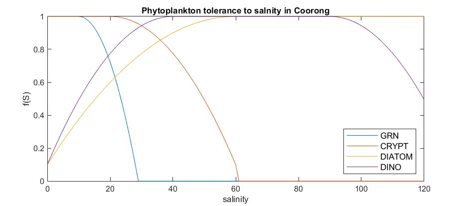

```

Direct measurements for other group-specific physiological rates and
parameters are not yet available for the Coorong, and so the current
version of the model relies on prior experience and relevant literature
to set the other key parameters shown in Table \@ref(tab:5-phytopars)
for each group, such as the sedimentation rate, nutrient stoichiometry
and light sensitivity.

------------------------------------------------------------------------

### Model setup: Microphytobenthos

The approach to simulate the biomass of benthic microalgae
(microphytobenthos) is to allocate a single biomass pool that
cocneptually sites between the water and sediment (i.e., at the
sediment-water interface). The biomass of this group, $MPB$, is
simulated in units of carbon ($mmol\:C/m^2$), and has a dynamic C:N:P
stoichiometry based on the history of the deposited phytopalnkton that
have landed on the sediment. The model is conceptually simple compared
to the overlying phytoplankton group model, with paramaetrs to mediate
response to light, resuspension back into the watre column, and burial
into the deeper sediment.Balance equations that capture the various
processes impacting phytoplankton are outlined in the full description
of the phytoplankton model within the [AED science
manual](https://aquaticecodynamics.github.io/aed-science/phytoplankton.html).

The $MPB$ pool configured to simulate the biomass is configured
according to the parameters outlined in Table (Table
\@ref(tab:5-mpbpars)).

<br>

```{r 5-mpbpars, echo=FALSE, message=FALSE, warning=FALSE}
library(knitr)
library(kableExtra)
library(readxl)
library(rmarkdown)
theSheet <- read_excel('tables/water/phytoplankton_parameters.xlsx', sheet = 1)
theSheet <- theSheet[theSheet$Table == "Microphytobenthos",]
theSheetGroups <- unique(theSheet$Group)

for(i in seq_along(theSheet$Parameter)){
  if(!is.na(theSheet$Parameter[i])==TRUE){
    theSheet$Parameter[i] <- paste0("$$",theSheet$Parameter[i],"$$")
  } else {
    theSheet$Parameter[i] <- NA
  }
}
for(i in seq_along(theSheet$Unit)){
  if(!is.na(theSheet$Unit[i])==TRUE){
    theSheet$Unit[i] <- paste0("$$\\small{",theSheet$Unit[i],"}$$")
  } else {
    theSheet$Unit[i] <- NA
  }
}

kbl(theSheet[,3:6], caption = "Summary of the microphytobenthos parameters used in the CDM version of the AED model.", align = "l",) %>%
  pack_rows(theSheetGroups[1],
            min(which(theSheet$Group == theSheetGroups[1])),
            max(which(theSheet$Group == theSheetGroups[1])),
            background = '#ebebeb') %>%

row_spec(0, background = "#14759e", bold = TRUE, color = "white") %>%
  kable_styling(full_width = F,font_size = 10) %>%
  column_spec(2, width_min = "15em") %>%
  column_spec(3, width_max = "20em") %>%
  column_spec(4, width_min = "20em") %>%
    scroll_box(width = "680px", height = "700px",
             fixed_thead = FALSE)
```

<br>

### Model results

The simulated phytoplankton biomass has been compared against the
available chlorophyll-a data from the routine WQ monitoring sites. The
model captures well the long-term mean gradient in biomass along the
length of the Coorong, which includes the separation of the groups based
on their optimum salinity and nutrient parameters (Figure
\@ref(fig:water-phy1)).

```{r water-phy1, echo = FALSE, out.width='100%', class = "text-image", fig.cap = "Simulated and observed chlorophyll-a concentration along the length of the Coorong from the Murray Mouth. The observed (field) data is from available monitoring over the period from Jul 2017 to Jan 2022, presented as a box-whisker plot for each site based on all data available for that site. The simulated data is shaded based on the PFT (group) contribution to the total phytoplankton biomass."}

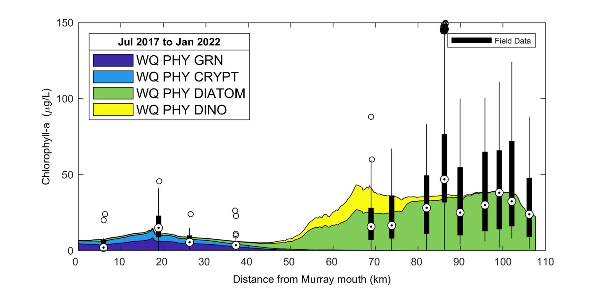

```

<br>

Whilst the above plot shows the along-lagoon gradient, the seasonal and
high frequency variability of chlorophyll-a can be more variable and is
also well-captured by the model (Figure \@ref(fig:water-phy2)).

```{r water-phy2, echo = FALSE, out.width='100%', class = "text-image", fig.cap = "Performance of predicted phytoplankton biomass and other key water quality variables at north lagoon, center, and south lagoon."}

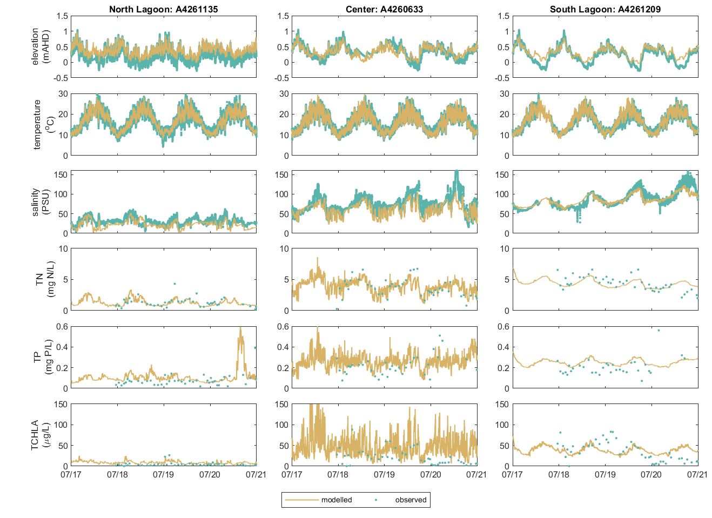

```

<br>

The limitation plots for each simulated group provide insights into the
dynamic environmental controls on group productivity (Figures
\@ref(fig:water-lim1)-\@ref(fig:water-lim7)).

<br>

<head>

<meta name="viewport" content="width=device-width, initial-scale=1">

```{=html}
<style>
/* Style the buttons inside the tab */
.tab button {
  background-color: #2481AA;
  float: left;
  width: 14.25%;
  border: none;
  outline: none;
  cursor: pointer;
  padding: 14px 16px;
  transition: 0.3s;
  font-size: 14px;
  color: #FFFFFF;
  font-weight: bold;
}
</style>
```
</head>

<body>

::: {.tab}
<button class="tablinks" onclick="opentab(event, 'A4260633')"id="defaultOpen">A4260633</button>
<button class="tablinks" onclick="opentab(event, 'A4261036')">A4261036</button>
<button class="tablinks" onclick="opentab(event, 'A4261039')">A4261039</button>
<button class="tablinks" onclick="opentab(event, 'A4261134')">A4261134</button>
<button class="tablinks" onclick="opentab(event, 'A4261135')">A4261135</button>
<button class="tablinks" onclick="opentab(event, 'A4261165')">A4261165</button>
<button class="tablinks" onclick="opentab(event, 'A4261209')">A4261209</button>
:::

::: {#A4260633 .tabcontent}
<p>

```{r water-lim1, echo = FALSE, out.width='100%', class = "text-image", fig.cap = "Phytoplankton environmental limitation controlling the photosynthesis rate of each phytoplankton group, for site A4260633 (Click the station ID above to change image)."}

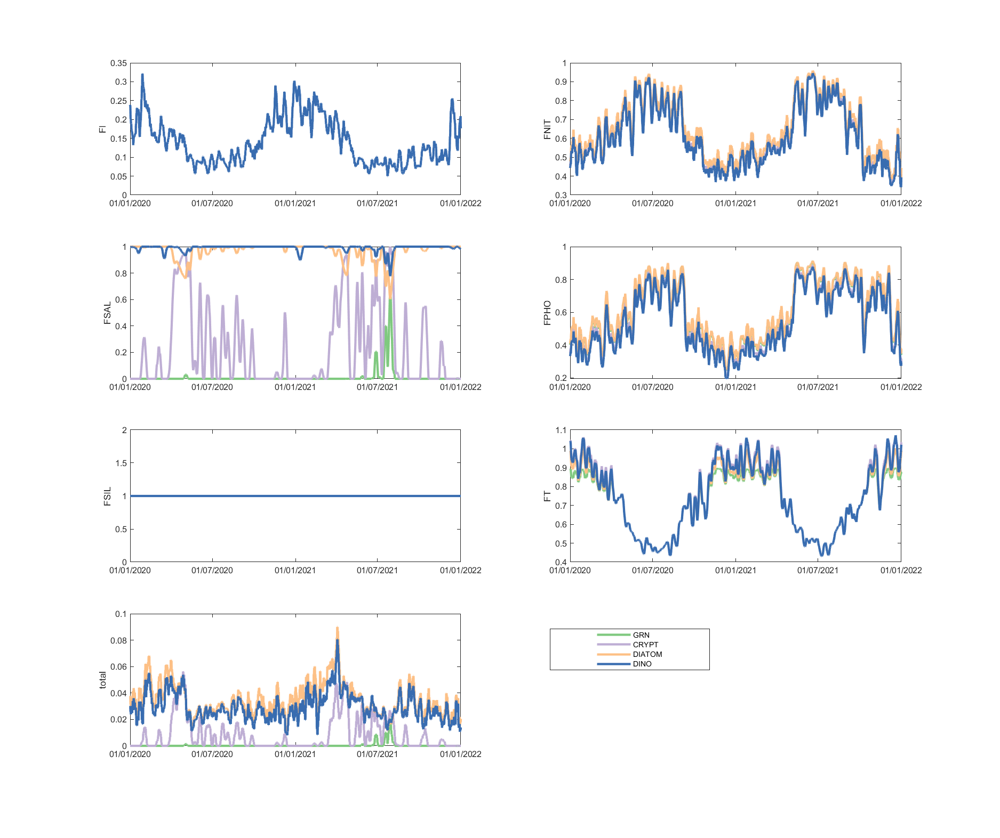

```

</p>
:::

::: {#A4261036 .tabcontent}
<p>

```{r water-lim2, echo = FALSE, out.width='100%', class = "text-image", fig.cap = "Phytoplankton environmental limitation controlling the photosynthesis rate of each phytoplankton group, for site A4261036."}

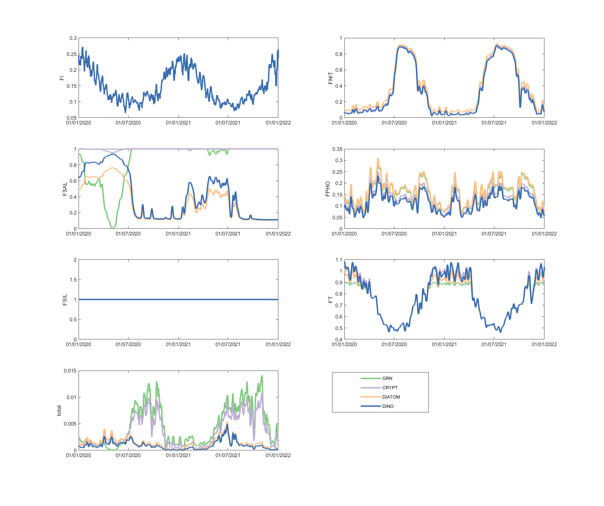

```

</p>
:::

::: {#A4261039 .tabcontent}
<p>

```{r water-lim3, echo = FALSE, out.width='100%', class = "text-image", fig.cap = "Phytoplankton environmental limitation controlling the photosynthesis rate of each phytoplankton group, for site A4261039."}

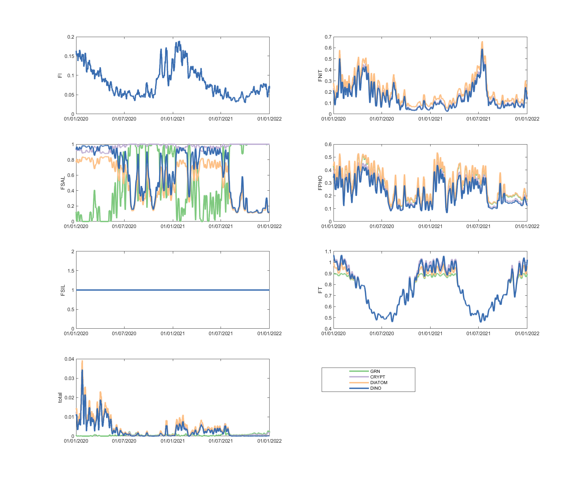

```

</p>
:::

::: {#A4261134 .tabcontent}
<p>

```{r water-lim4, echo = FALSE, out.width='100%', class = "text-image", fig.cap = "Phytoplankton environmental limitation controlling the photosynthesis rate of each phytoplankton group, for site A4261134."}

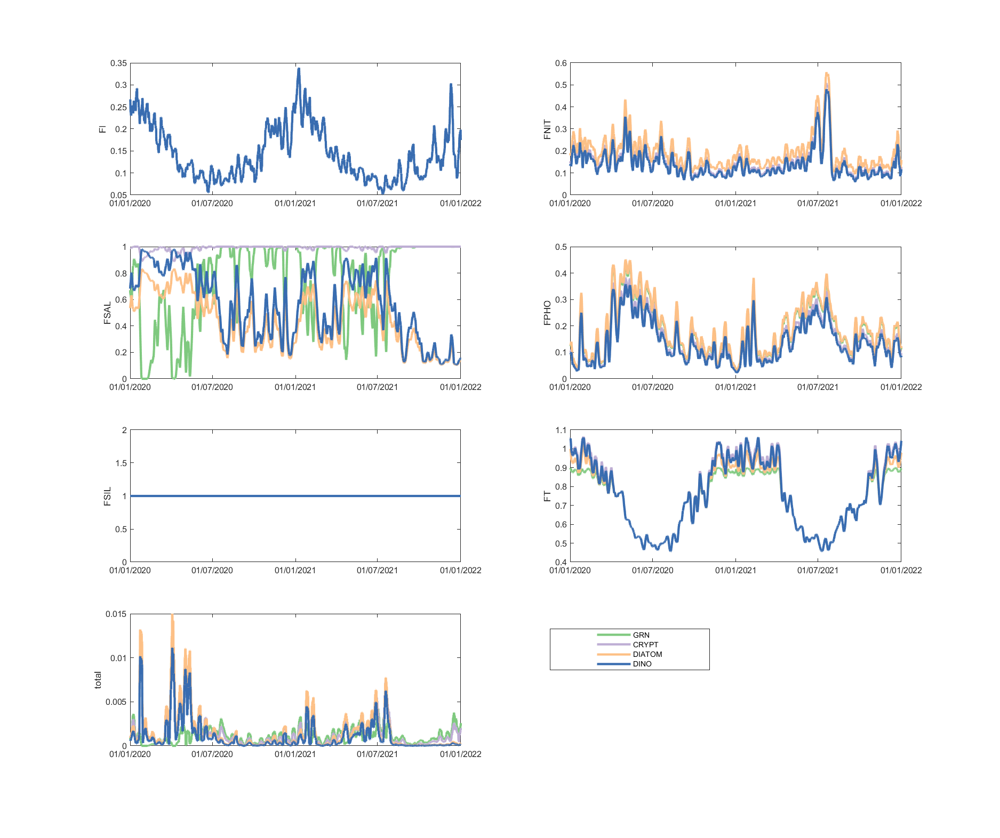

```

</p>
:::

::: {#A4261135 .tabcontent}
<p>

```{r water-lim5, echo = FALSE, out.width='100%', class = "text-image", fig.cap = "Phytoplankton environmental limitation controlling the photosynthesis rate of each phytoplankton group, for site A4261135."}

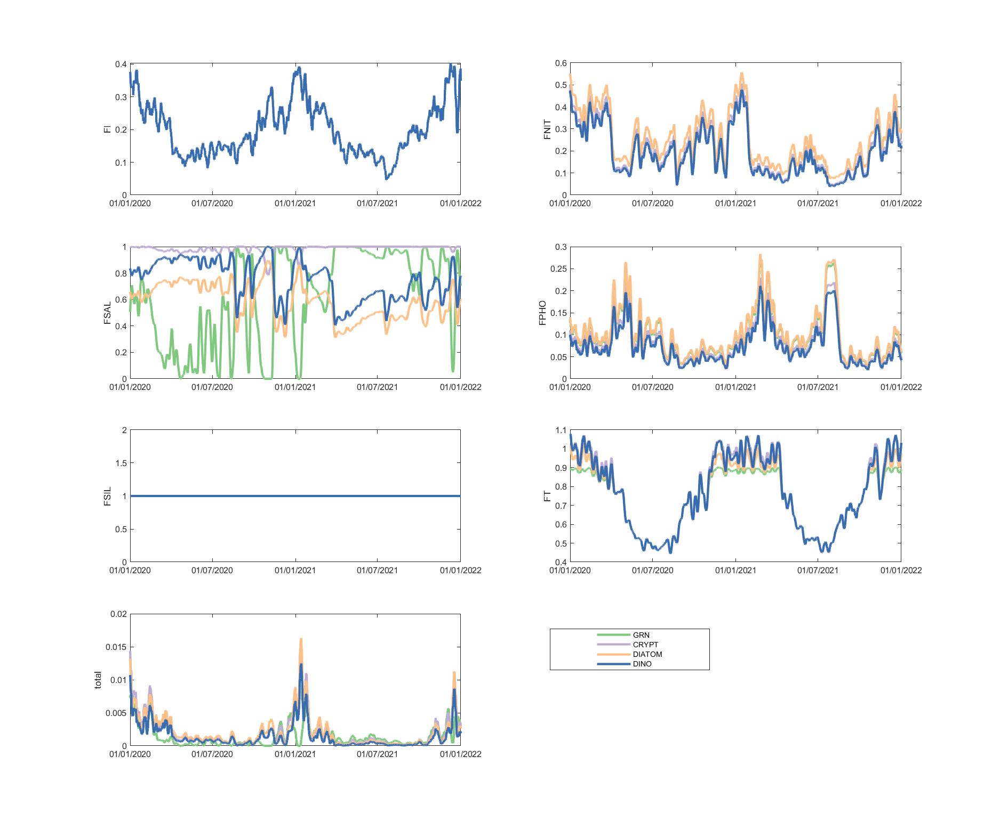

```

</p>
:::

::: {#A4261165 .tabcontent}
<p>

```{r water-lim6, echo = FALSE, out.width='100%', class = "text-image", fig.cap = "Phytoplankton environmental limitation controlling the photosynthesis rate of each phytoplankton group, for site A4261165."}

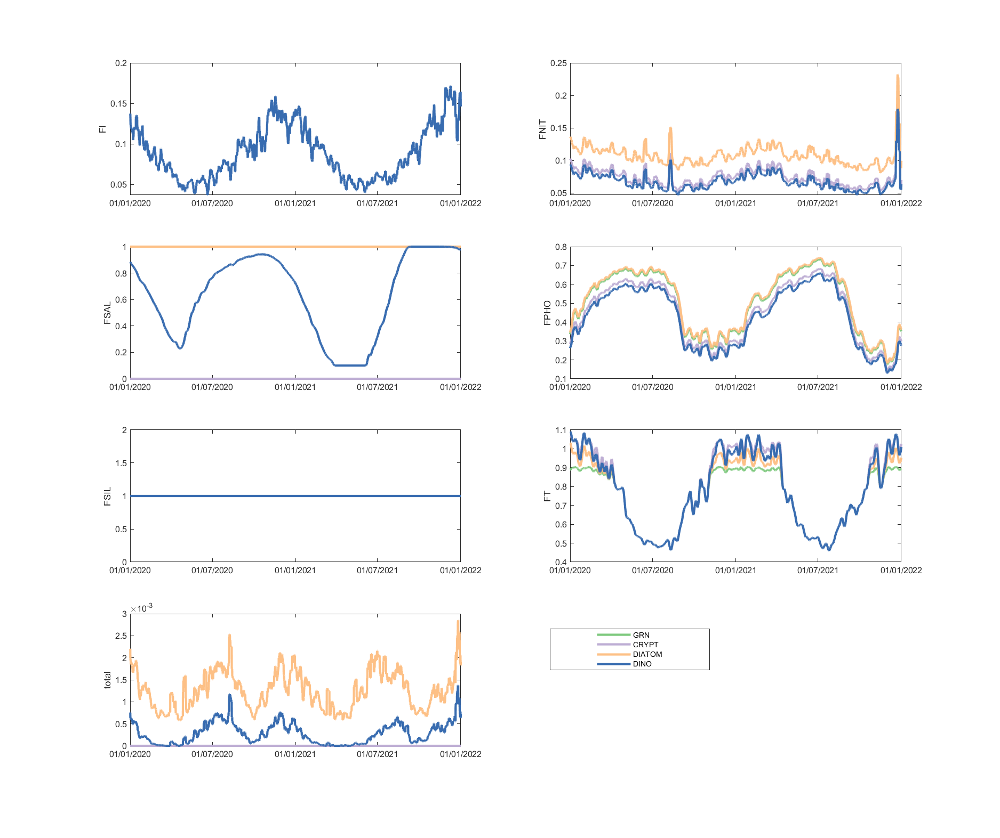

```

</p>
:::

::: {#A4261209 .tabcontent}
<p>

```{r water-lim7, echo = FALSE, out.width='100%', class = "text-image", fig.cap = "Phytoplankton environmental limitation controlling the photosynthesis rate of each phytoplankton group, for site A4261209."}

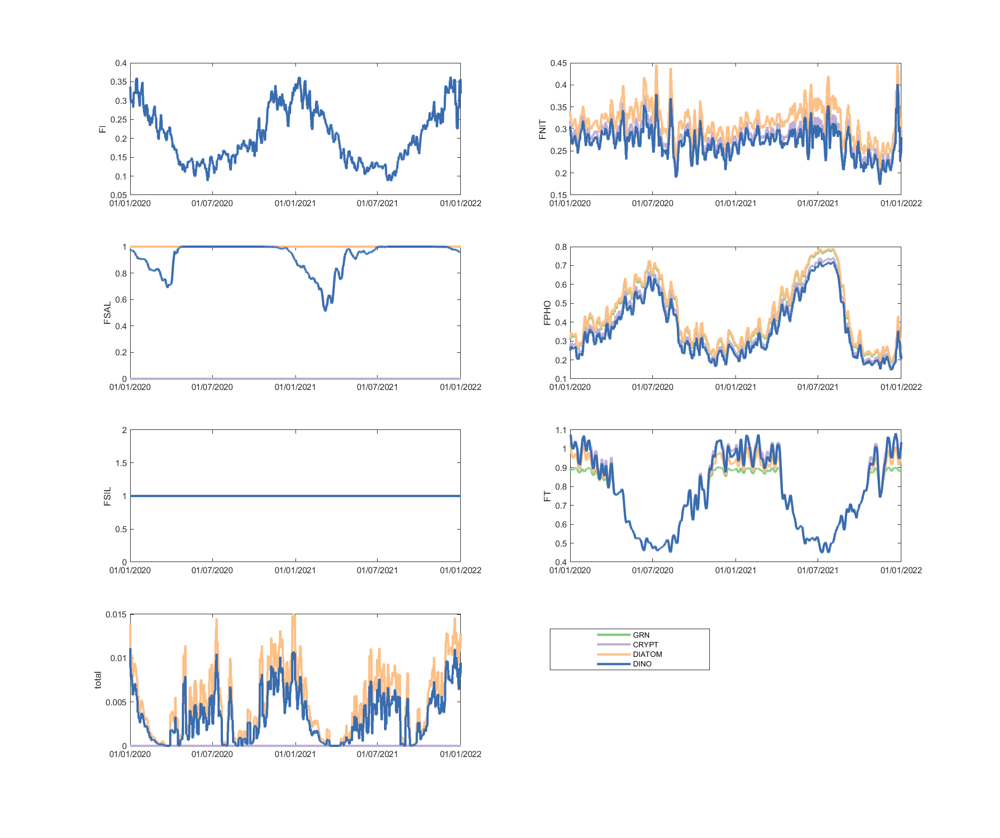

```

</p>
:::

```{=html}
<script>
function opentab(evt, tabName) {
  var i, tabcontent, tablinks;
  tabcontent = document.getElementsByClassName("tabcontent");
  for (i = 0; i < tabcontent.length; i++) {
    tabcontent[i].style.display = "none";
  }
  tablinks = document.getElementsByClassName("tablinks");
  for (i = 0; i < tablinks.length; i++) {
    tablinks[i].className = tablinks[i].className.replace(" active", "");
  }
  document.getElementById(tabName).style.display = "block";
  evt.currentTarget.className += " active";
}
document.getElementById("defaultOpen").click();
</script>
```
</body>

<!-- -->

## Summary
