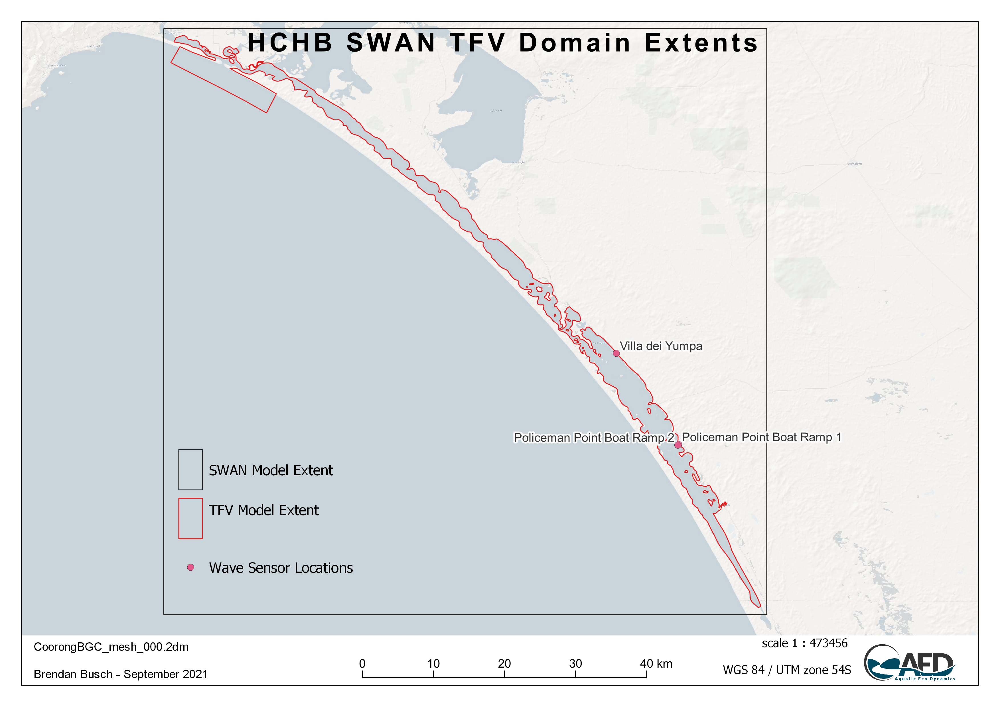

# CDM Development & Testing

<br>

## Modelling development rationale

### Known gaps and model limitations

A significant component of the work tasks are allocated to customise and develop key modules of the AED platform to incorporate the specific science requirements of the model so it is compatible with the findings and details reported in the T&I research projects. These are identified in the specification as:

- Need to improve and validate hydrodynamic-biogeochemical-habitat models, including updating the Ruppia Habitat Suitability Model, to provide increased certainty in the forecasted responses to various management interventions, this includes improving and updating model representation of the following:
    - external and internal nutrient loads based on outputs from ‘Understanding Coorong nutrient dynamics' (T&I activity 1.2)
    - sediment loads, nutrient fluxes and cycling based on environmental data collected and outputs from ‘Understanding Coorong nutrient dynamics’ (T&I activity 1.3)
    - Ruppia habitat suitability model and filamentous algae preference model (within AED) based on environmental data collected and outputs from ‘Investigating the drivers and controls of filamentous algae and restoration of aquatic plants’ in the Coorong (T&I activities 2.4 and 2.5)
- Extended habitat models to incorporate the quantitative models developed through the food web and waterbird components, including:
    - Linking the quantitative food web models developed as part of ‘Restoring a functioning Coorong food web’ (T&I activity 3.4) to the existing TUFLOW FV – AED model framework to enable additional outcomes to be evaluated
    - Linking the habitat suitability models for priority waterbird species developed as part of ‘Maintaining viable waterbird populations’ (T&I activities 4.1 and 4.3) to the existing TUFLOW FV – AED2 model framework to enable additional outcomes to be evaluated


### Development focus and integration with HCHB research and monitoring

The staged development and assessment approach to the above model components and how they are linked with related T&I components are summarised in Figure * (the data-model integration strategy diagram) and outlined in the below sections.

```{r dev-pic0, echo = FALSE, out.width='100%', class = "text-image", fig.cap = "Data and model integration strategy, showing links between the HCHB Goyder T&I research program and the model development priorities."}

knitr::include_graphics("images/dev/Project integration diagram.png")

```

<br>

***	

<br>

## Waves and resuspension

### Overview

In shallow lagoons such as the Coorong, wind-induced waves at the water surface causes the bottom material to resuspend; this can dominate water quality during strong winds, due to large changes in nutrients, suspended solids, and turbidity within the water. Specifically, we seek to capture the role of wind-driven waves on water column suspended solids and organic matter concentration within Coorong.

In order to capture this effect in the Coorong, the SWAN wave model was applied. The wave model predicts the spatial pattern of significant wave height and wave periods and the output is then coupled with the TUFLOW-FV model for modelling shear stress at the seabed and the rate of sediment resuspension.  

The model settings and validation results are described below. Wave and turbidity data are available from experimental work undertaken in 2020 at some sites which is used for calibration purposes, and the particle properties such resuspension rates and settling rates are also discussed.

### Model approach

#### SWAN wave model simulation

The SWAN wave model was adopted using a Cartesian grid with 200 m resolution, and the third generation simulation mode. The model was initially forced with the Narrung weather station data and the water depth was interpolated from the existing (2008) Coorong bathymetry data. Wind data at the measurement site was also used for a period when it was available.


```{r dev-sites, echo = FALSE, out.width='100%', class = "text-image",fig.align='center', fig.cap = "Model extents for SWAN Wave Model and the TFV domains, with validation sites."}



```

#### Suspended solids and light

The AED component of the simulation is configured to include light ($I$), and two suspended solids ($SS$) groups.  The TUFLOW-FV -- AED models are dynamically coupled to capture the feedbacks between $SS$, light, surface heating and (optionally) vegetation presence. 

The model accounts for incident shortwave radiation to be attenuated as it penetrates the water column. The attenuation of light is dependent on the specific bandwidth. For primary production, the shortwave (280-2800 nm) intensity at the surface ($I_0$) is partitioned to the photosynthetically active component (PAR) based on the assumption that \~45% of the incident spectrum lies between 400-700nm. PAR and other light bandwidths such as ultra-violet (UV, \~3.5%) and near-infrared (NIR, \~51%), penetrate into the water column according to the Beer-Lambert Law:

$$
I_{i} = f_{i} I_{0} \text{exp} (-K_{d_{i}} z)
(\#eq:lagoonhabitat1)
$$

where $i$ refers to the specific bandwidth range (e.g., PAR, UV, etc), $f_i$ is the fraction of light intensity within that range at the water surface and $z$ is the water depth. The light extinction coefficient $K_d$ is a variable parameter governing light attenuation, as influenced by the suspended solids ($SS$) in the water column, filamentous algae density, and vegetation leaf area index. In these simulations it is computed by assuming a background light extinction coefficient $K_w$ and the specific attenuation coefficient, $K_e$, for $SS$ and algae: 

$$
K_{d} = K_{w} + K_{e_{s}} SS + K_{e_{F}} FA
(\#eq:lagoonhabitat2)
$$

Computing turbidity from the concentration of particulates is also possible and able to be compared to routinely measured turbidity data. The relation for simulation of turbidity is able to be expressed as:

$$
\text{Turbidity} = f_{t_{ss}}\:SS + f_{t_{chl}}\: Chla
(\#eq:lagoonhabitat3)
$$

where $f_{t_{s}}$ is an empirical coefficient, determined through site specific correlations or literature. The suspended solids-turbidity ratio is currently assumed to be 1, and this relationship is based on experimental data from the March 2020 UA field assessment.

#### Resuspension

The concentration of suspended solids at any location depends on inputs from tributaries, advection of material through the lagoon, and vertical fluxes due to particle resuspension and deposition. Deposition is computed based on a prescribed settling velocity for each particle group. The rate of resuspension ($R$) varies across the system due to heterogeneity in sediment properties. It is calculated by assuming linearity with the excess shear stress at the bed (Lee et al. 2005), such that:

$$
R_i=\sum_{s=1}^{n_s}{{\ \ f}_{s,i}\ {\ \ \varepsilon}_s}\ \ \text{max}\left(\tau_b-\tau_c,\ 0\right)
(\#eq:lagoonhabitat4)
$$

where $n_s$ is the number of particle size classes, $f_{s,i}$ is the fraction of each particle size class in the  sediment material zone, $\varepsilon$ is the resuspension rate coefficient, $\tau_b$ is the bed shear stress (computed based on the current and wave orbital velocities in each cell), and $\tau_c$ is the critical shear stress for resuspension, which depends on the sediment size (Julien 2010), and optionally, the presence of vegetation. 

The resuspended particles are then subjected to settling assuming a constant settling velocity
$\omega$ of 0.2 m/day. A literature review and current CDM settings of resuspension is summarised in Table xx.


```{r dev-wavepars, echo=FALSE, message=FALSE, warning=FALSE}
library(knitr)
library(kableExtra)
library(readxl)
library(rmarkdown)
theSheet <- read_excel('tables/wave_pars.xlsx', sheet = 1)
theSheet <- theSheet[theSheet$Table == "Data",]
theSheetGroups <- unique(theSheet$Group)


kbl(theSheet[,2:6], caption = "Summary of key parameters in the resuspension model", align = "l",) %>%

row_spec(0, background = "#14759e", bold = TRUE, color = "white") %>%
  kable_styling(full_width = T,font_size = 10) %>%
    scroll_box(fixed_thead = FALSE)
```
	a Zhu et al., 2015 <br>
	b Ghose-Hajra et al., 2014<br>
	c van Rijn, 2007<br>
	d McAnally et al., 2007<br>
	e Mehta, 1991<br>
<!--
Table xx. Summary of key parameters in the resuspension model.

Parameter	Description	Unit	Literature range	Current CDM setting
$\epsilon$	Bulk resuspension rate	g/m^2^/s	0-0.01 a	0.008
$\tau_0$ Critical shear stress	N/m^2^	0.02-0.25 b, c	0.05
$tau_r$	Resuspension coefficient	-	-	1
$\omega$	Settling velocity	m/day	0.01-1 d, e 	0.2

	a Zhu et al., 2015
	b Ghose-Hajra et al., 2014
	c van Rijn, 2007
	d McAnally et al., 2007
	e Mehta, 1991
-->

### Validation and assessment

The SWAN wave model was calibrated during the periods between the UA sediment resuspension studies undertaken in December 2020 and March 2021. The comparison between the SWAN wave model outputs and the field survey data of significant wave height is shown in Figure 3.9, which indicates the wave model produced reasonable outcomes in the time variation and magnitude of the response of significant wave height.

<!-- 
 ```{r dev-pic1, echo = FALSE, out.width='60%', class = "text-image", fig.cap = "Comparison of the Coorong SWAN wave model output and the UA field survey data at two sites. Period spanning Mar 2021."}

knitr::include_graphics("images/dev/3_picture1.png") 


```
-->
```{r dev-pic101, echo = FALSE, out.width='60%', class = "text-image", fig.cap = "Comparison of the Coorong SWAN wave model output and the UA field survey data at two sites. Period spanning Dec 2020."}

knitr::include_graphics("images/dev/compare_wave_Policeman_v2_2000w.png")

```

The wave model output is then coupled to the TUFLOW-AED model to calibrate the sediment resuspension. The resulting turbidity, in comparison with the field observations and the CDM outputs without the waves, at site of A4261209 is shown in Figure 3.10. The comparison indicates the waves introduced resuspension when compared to the ‘no-waves’ scenario, and the model with the wave inputs captured the general variations in the turbidity, though more calibrations to the resuspension events under high wind conditions will be examined in next stages of model development. 


```{r dev-pic2, echo = FALSE, out.width='80%', class = "text-image", fig.cap = "Comparison of the AED turbidity model output and the DEW in situ sensor data within the South Lagoon station A4261209."}

knitr::include_graphics("images/dev/0006_A4261209.png")

```

### Lagoon scale predictions

Examples of spatial distribution of significant wave height, bottom shear stress (TAUB), resuspension rate, and TSS concentration in the water during a low wind event (Figure xx) and high wind event (Figure xx) are shown below. In general, the wind condition was shown to be the dominant factor of the sediment resuspension rate. During the calm wind condition such as in 01/11/2021 when the wind speed was < 3 m/s, the sediment resuspension rate was negligible. The resuspension rate exceeded 20 g/m^2^/day in 19/11/2020 when the wind speed reached 9 m/s, which subsequently led to increase in the water TSS concentrations. The shallow water in the littoral zones are more vulnerable to the wind-induced resuspension.

```{r dev-pic3, echo = FALSE, out.width='100%', class = "text-image", fig.cap = "An example output of modelled (a) weight height, (b) bottom shear stress, (c) resuspension rates, and (d) total suspended solid concentration in Coorong during low wind condition (< 3m/s)."}

knitr::include_graphics("images/dev/3_picture2.png")

```

```{r dev-pic4, echo = FALSE, out.width='100%', class = "text-image", fig.cap = "Same as Figure xx except for a relatively higher wind condition (>9m/s)."}

knitr::include_graphics("images/dev/3_picture3.png")

```

An animation of the wave, resuspension and turbidity conditions is shown below.

<br>
<center>
<video width="100%" height="100%" controls>
<source src="images/dev/animation_resuspension.mp4" type="video/mp4">
</video>
</center>
<br>

### Summary (Sept 2021)

The existing wave model is shown to be well calibrated, and the resuspension model performance is reasonable in terms of resuspension magnitudes and changes in the TSS concentration. However, there are also remaining knowledge gaps/limitations which are to be refined:

1.	Considering more particle groups in the sediment and TSS composition, based on assessment of the UA LISST data.
2.	Adding the Stokes Law method for the parcel setting velocity depending on the particle density and sizes;
3.	Further calibration on the sediment resuspension rates and the critical shear stress for better model performance, also including organic vs inorganic resuspension rates.

<br>

***	

<br>

## Sediment biogeochemistry

### Overview

In environments like the Coorong, where nutrient dynamics influence the rest of the ecosystem, management often focuses on reducing nutrient inputs and increasing flushing to the sea. However, it is important not to overlook the sediment as a long term source or sink of nutrients.
 
In previous versions of the Coorong model, a constant flux rate has been used for the lagoon – for example consumption of oxygen and release of ammonium. This is an efficient and simplified first step, however, the model can be improved by using the depth-resolved sediment diagenesis model. The sediment model can represent spatial heterogeneity along the lagoon, it can capture the future burial or release of nutrients and it can make use of the rich data sets measured in the field.
 
Under some conditions, the sediment stores can release nutrients to the water column, while under other conditions, the sediment can remove nutrients in the long term through burial, and the surface layers can remove nitrogen through denitrification. The fine balance that controls the conditions under which the sediment stores will store, release or remove nutrients is largely governed by the aerobic state of the sediment pore water, and the amount of reactive organic matter fuelling the reactions. The depth-resolved sediment model accounts for mixing from the hydrodynamic model into the upper sediment layers. It calculates whether organic matter is consumed aerobically, through denitrification or deeper down, through sulfate reduction or even methanogenesis.
 
The sediment model can also capture and contrast different environments in the Coorong. The model includes a depth of bioturbation and bioirrigation by macrobiota living in the sediment. The north lagoon of the Coorong has higher populations of macrobiota, which cause mixing of oxygen into deeper sediment layers, which in turn helps in removal of organic matter and reduced nitrogen. In contrast, in the south lagoon there is less bioturbation of the sediment and it is more likely that organic matter is consumed through anaerobic processes. The production of toxic H~2~S gas through sulfate reduction would lead to a further degradation of the ecosystem.  

### Model approach: CANDI-AED

The heart of this model is the reaction, diffusion, advection model of Berner (1980), which was implemented as the Carbon and Nutrient Diagenesis model of Boudreau (1996). CANDI-AED implementation however has evolved from the original code, and the main differences pertain to the treatment of organic matter, and the simulation of the geochemical conditions known to influence the diagenetic equations. However, the core organic matter breakdown equations (and their numerical solution) remains similar as the original descriptions presented in Boudreau (1996), and to other similar sediment models. An overview of the model is shown in Figure X.


```{r dev-pic00, echo = FALSE, out.width='80%', class = "text-image", fig.align='center', fig.cap = "CANDI-AED includes chemical processes of organic matter transformation and oxidation, and reduction/oxidation, crystallisation, adsorption and precipitation reactions of inorganic by-products. Most of the processes are triggered by the input of POM at the sediment-water interface."}

knitr::include_graphics("images/dev/sed_image2.png")

```


####	Sediment reactive transport model {-}

The model is based on a 1D approximation of the sediment and pore-water profiles. Each active sediment zone (or column) is discretized into a user defineable number of layers that start at thicknesses of around 1mm at the sediment-water interface and increase exponentially down to a pre-defined sediment depth. The model resolves in each layer both physical (e.g. pore-water diffusion or bioturbation) and chemical (e.g., redox transformations) processes; these are summarised next.

**Chemical reactions**

The dynamic model considers two types of reactions - the slow, kinetically controlled reactions, and the fast thermodynamically based equilibrium reactions. The latter are simulated in the sediment through appropriate configuration of the geochemistry reactions; the configuration of the equilibrium model will apply to both the water and each of the sediment layers. The kinetically controlled reactions are mostly microbially-mediated and include the reactions for organic matter breakdown and eventual oxidation, the re-oxidation of various by-products and the dynamics of the metal sulfides.

The organic matter ($OM$) degradation pathway considers labile and refractory $DOM$ components ($DOM$ and $DOM_R$ respectively) and the breakdown pathway simulated is conceptually summarized in Figure \ref{fig:sed_dynamic}. Reactions included in the kinetic component include the hydrolysis of the complex (e.g., high molecular weight) $OM$ pools ($POM_{VR}$, $POM_R$, $DOM_R$, $POM_L$) and transformation of Low Molecular Weight (LMW) $DOM_L$ by oxidants ($O_2$, $MnO_2$, $Fe(III)$ and $SO_4^{2-}$ - the so-called 'terminal metabolism'), and the release of resulting nutrients ($NO_3^-$, $NH_4^+$, $PO_4^{3-}$) and reduced by-products ($Mn^{2+}$, $Fe^{2+}$, $N_2$, $H_2S$, $CH_4$) and $CO_2$. Oxidants, nutrients and by-products are all capable of interacting, say through complexation or re-oxidation of reduced species for example.

The decay of the complex $OM$ types to the LMW $DOM$ required for the hetertrophic bacteria to utilise are all modelled with a simple first-order decay rate. The subsequent reactions that describe the breakdown of $DOM_L$ may be written as:
\begin{eqnarray}
\overbrace{(CH_2O)_{106}(NH_3)_{16}(H_3PO_4)}^{\textrm{organic matter}} &+& 138O_2 \rightarrow \nonumber
\\
&& 106CO_2 + 16HNO_3 + H_3PO_4 + 122H_2O
\\
\textrm{Free energy, } \Delta G_0 &=& -3190\:kJmol^{-1} \nonumber
\end{eqnarray}

\begin{eqnarray}
(CH_2O)_{106}(NH_3)_{16}(H_3PO_4) &+& 236MnO_2 +472H^+ \rightarrow  \nonumber
\\
&& 106CO_2 + 236Mn^{2+} + 8N_2 + H_3PO_4 + 366H_2O
\\
\textrm{Free energy, } \Delta G_0 &=& -3050\:kJmol^{-1} \nonumber
\\
\\
(CH_2O)_{106}(NH_3)_{16}(H_3PO_4) &+& 94.4HNO_3 \rightarrow  \nonumber
\\
&& 106CO_2 + 55.5N_2 + H_3PO_4 + 177H_2O
\\
\textrm{Free energy, } \Delta G_0 &=& -3030\:kJmol^{-1} \nonumber
\\
\\
(CH_2O)_{106}(NH_3)_{16}(H_3PO_4) &+& 212Fe_2O_3 +848H^+ \rightarrow  \nonumber
\\
&& 106CO_2 + 16NH_3 + H_3PO_4 + 742H_2O + 424Fe^{2+}
\\
\textrm{Free energy, } \Delta G_0 &=& -1410\:kJmol^{-1} \nonumber
\\
\\
(CH_2O)_{106}(NH_3)_{16}(H_3PO_4) &+& 53SO_4^{2-}  \rightarrow  \nonumber
\\
&& 106CO_2 + 16NH_3 + H_3PO_4 + 106H_2O + 53S^{2-}
\\
\textrm{Free energy, } \Delta G_0 &=& -380\:kJmol^{-1} \nonumber
\\
\\
(CH_2O)_{106}(NH_3)_{16}(H_3PO_4) &&  \rightarrow  \nonumber
\\
&& 53CO_2 + 53CH_4 + 16NH_3 + H_3PO_4
\\
\textrm{Free energy, } \Delta G_0 &=& -350\:kJmol^{-1} \nonumber
\end{eqnarray}

and the reaction rates for each of these are calculated dynamically based on Monod expressions which mediate the reaction rate according to the concentration of potential oxidants higher in the redox sequence, and the concentration of the available oxidant.

In addition to the primary redox reactions associated with $OM$ breakdown, the model also includes numerous secondary reactions, such as oxidation of reduced by-products (e.g., Fe or S oxidation).

**Physical processes**

Accounting for advection and diffusion reactions is fairly consistent across diagenesis models, and here we use the same methods. Porosity ($\phi$) is defined according to equation 5 - 104, which allows it to decrease with depth, and the solid fraction is defined from $\phi_s=(1-\phi)$. For bioturbation the model uses a diffusion coefficient that varies with depth ($D_{B(z)}$) as a two layer function or a Gaussian decrease (Boudreau 1996). For the porewater components, diffusion coefficients are used that are based on free-solution molecular diffusion constants corrected for sediment tortuosity, $θ$, according to equation 5 - 105.


####	Model extensions and development {-}

The above model approach is broadly used in lakes, ocean and estuarine environments, but there remain few cases in shallow lagoons (Paraska et al. 2014). Three main developments have been undertaken to adapt the code-base to the Coorong application (Figure \@ref(fig:dev-pics5)):

i.	Improved parameterisation of diffusion at the sediment-water interface
ii.	Inclusion of functionality to resolve resuspension effects
iii.	Addition of MPB

```{r dev-pics5, echo = FALSE, out.width='100%', class = "text-image", fig.cap = "Visual summary of model updates undertaken."}

knitr::include_graphics("images/dev/sdg extensions and development-01.png")

```

**SWI diffusion**

Fluxes of dissolved species occur between the sediment and water column depending on the sediment type, solute and interfacial turbulence being experienced at the sediment-water interface. Dissolved fluxes are calculated from the concentration gradient at the sediment-water interface according to Fick’s Law:

<center>
\begin{equation}
F = D_{0}\frac{\Delta C}{\Delta x} = \frac{D_{0}}{\delta} (C_{bw} - C_{1})
(\#eq:biogeochem1)
\end{equation}
</center>

where $D_{0}$ is the diffusivity, $\delta$ is the thickness of the diffusive boundary layer at the sediment-water interface,  defined as the length scale of the first sediment layer, $C_{bw}$ is the bottom water concentration and $C_{1}$ is the concentration in the top sediment layer. The diffusivity in these models typically assumes molecular diffusivity rates, which is likely to underestimate the real diffsuivity experienced in a shallow algoon such as the Coorong. We therefore add a new parameterisation to resolve diffusivity based on sediment type an water turbulence proerties, based on the metric $u_*^3$.

**Resuspension effects**

To Be Completed

**SWI Productivity**

To Be Completed


<br>


####	Resolving sediment zonation {-}

Facility also exists within the model to use sediment zones'\ which are identical to the above description but are not necessarily coincident with the grid-structure of the water. This way sed-zones may be defined for the domain, and depending on the nature of the grid, the water cells above the sediment will be averaged for the purposes of the interfacial fluxes, allowing more efficient simulations (see for example Figure \ref{fig:sed_integration}). Using zones is a practical compromise between computational efficiency and capturing spatial heterogeneity in sediment properties and their fluxes.


```{r dev-pics3, echo = FALSE, out.width='100%', class = "text-image", fig.cap = "Schematic depicting sediment zone numerical approach."}

knitr::include_graphics("images/dev/sed_picture5.png")

```

**3-zone experiment**

To demonstrate the zones can function independently, a model test was performed with three zones. In this simulation each model zone received a sustained 1-year surface loading of organic material, which either was maintained for throughout the simulation duration (Zone 1), or was reduced to a new lower value (Zone 2 and 3); this can conceptually be considered as a test of the sediment model to respond to 'remediation' scenarios. The results highlight the individual zones responding accordingly, as shown for NO~3~ (Figure X).

```{r dev-pics4, echo = FALSE, out.width='100%', class = "text-image", fig.cap = "Example of sediment concentration-depth-time plot for ammonia, given different organic matter influx rates in three different zones. To demonstrate capability for spatial differences, the organic matter input stayed the same in Zone 1 but decreased after 1 year in Zones 2 and 3 to different levels."}

knitr::include_graphics("images/dev/sed_picture6.png")

```

####	Sediment-water coupling {-}

The sediment and hydrodynamic models are coupled at the sediment-water interface. The AED model setup has separate functions for coupling the bottom-most cell of the TUFLOW-FV hydrodynamic model to the top-most layer of the sediment model:

-	flux of solid material onto the sediment surface
-	concentration of dissolved substances in the bottom water
-	flux of dissolved substances from the top sediment layer


```{r dev-pics2, echo = FALSE, out.width='45%', class = "text-image",fig.show='hold',fig.align='center', fig.cap = "Schematic of sediment water coupling approach."}

knitr::include_graphics(c("images/dev/sed_picture3.png","images/dev/sed_picture4.png"))

```

**Zone tracer experiment**

*To Be Completed*


### Model setup and configuration

The Coorong lagoon is divided into 10(20) sediment zones along its length. One sediment model is run for each of the ten(twenty) zones. The zone boundaries are largely based on locations of sandbars and where the lagoon channel narrows and broadens. There are measured data points in all zones except for zone 1, south of the Salt Creek inflow. Zones 1 to 4 correspond to the South Lagoon, as mentioned in the Goyder Institute nutrient budget. Zone 5 is the intermediate area and zones 6 to 10 are the North Lagoon.

```{r dev-pics1, echo = FALSE, out.width='45%', class = "text-image",fig.show='hold',fig.align='center', fig.cap = "Example sediment zonation."}

knitr::include_graphics(c("images/dev/sed_picture1.png","images/dev/sed_picture2.png"))

```

The sediment model is calibrated initially without any coupling. The sediment-water interface boundaries are based on measured bottom water data, where available, or literature values. Some parameters are tuned so that measured data matches simulated variables, for concentration depth profiles and fluxes.

The sediment model is then coupled to the water column model. Many variables are set up to be linked between the two models; however, not all variables need to be linked. The fluxes and concentrations of linked variables in the bottom water are averaged across all cells in a zone, and this average value is passed to the sediment. Similarly, the value of a dissolved flux from the sediment is given to all bottom water cells within a sediment zone.


####	Parameters and settings {-}

The assigned parameters for the model are described below in Table X.

```{r 3dev-sedpars, echo=FALSE, message=FALSE, warning=FALSE}
library(knitr)
library(kableExtra)
sediment_parameters <- read.csv("tables/sediment_parameters.csv", check.names=FALSE)
kable(sediment_parameters,"html", escape = F, align = "c", caption = "Sediment physical and transport parameters",
      bootstrap_options = "hover") %>%
  kable_styling(sediment_parameters, bootstrap_options = "hover",
                full_width = F, position = "center",
                font_size = 12) %>%
  column_spec(1, width_min = "10em") %>%
  column_spec(2, width_min = "7em") %>%
  column_spec(3, width_min = "7em") %>%
  column_spec(4, width_min = "15em") %>%
  row_spec(1:19, background = 'white') %>%
  scroll_box(width = "690px", height = "800px",
             fixed_thead = FALSE)
```

<br>

####	Validation sites and data {-}

A wide diversity of data has been collected and is documentaed in Appendix A (Data Catalogue). In summary, there are four broad categories of field data available from the University of Adelaide surveys for model setup and parameterisation.

*Grab samples – C, N, P, Mn, Fe, S* : These are available for many sites but only one or two depths. They are useful for averaging a concentration at depth within a zone. These are key variables for sediment biogeochemistry.

*Cores – Fe, S, NH4+, PO43- GHGs* : The cores are available for only around four sites, but they are used for calibrating depth profiles and sediment-water fluxes. These often have data measured in the day and the night, as well as in November and March, which all have different concentrations and fluxes. The challenge will be to capture both day and night conditions, while also capturing seasonal changes.
The GHG models are new and require testing and development. It may be a challenge to tune these models to fit GHG flux measurements.

*Sediment quality* : These measurements are used for setting the initial porosity parameters. Once these are set they are not tuned further.

*Macroinvertebrates – bioturbation parameters* : These measurements are used for setting bioturbation and bioirrigation parameters. Broadly, the North Lagoon has high bioturbation and the South Lagoon has very little bioturbation. The depth to bioturbation is important, as it is expected that there is uninhabited black ooze below a certain depth.


### Validation and assessment

*To Be Completed*


### Lagoon scale predictions

*To Be Completed*


### Summary (Sept 2021)

The sediment biogeochemistry model has been implemented that can resolve the nature of sediment condition across the Coorong lagoon. The model has been demonstrated to capture sharp vertical gradients in nutients, organic matter and sulfides, and can be applied across discrete zones within the overall lagoon to resolve spatial heterogeneity. The model is now being calibrated against T&I1 project data.

<br>

***	

<br>

## Oxygen metabolism and nutrient cycling

### Overview

### Model approach

### Data availability

### Model setup

### Validation and assessment

### Summary


<br>

***	

<br>

## Macroalgal dynamics

### Overview

Recent surveys in the Coorong South Lagoon have highlighted the challenge to ecosystem health due to the high biomass and wide extent of filamentous algae, mainly the species Ulva. The survey data highlight that the filamentous algae are tightly associated with the locations that Ruppia are present, and late in the season the smothering and deoxygenation casued by large biomass accumulations are driving poor water quality. This section describes the approach to simulating macroalgae, and development of the model to the CSL situation.   

### Model approach

Within the Coorong, the AED model has previously been set up to predict inorganic and organic nutrients, and chlorophyll-a. Whilst nutrients are not directly required for the *Ruppia* model assessment, the presence of filamentous algal blooms can compete for light and these are linked to bioavailable nutrients within the water column (in addition to other attributes).

#### Filamentous algae

We include a filamentous algae variable, $FA$, in the model that is customized to reflect the Ulva community that was been extensively described. For this case we assumed it to be attached to benthic substrate, and is therefore is not subject to advection and mixing, but can slough off under high stress conditions and become a floating variable subject to transport. Evidence from the field suggest the abundance of filaments are tightly linked to the Ruppia shoots, which the algae use to anchor too.

In general, the balance equation describes how the biomass changes over time, according to:

$$
\frac{d\left(FA\right)}{dt}=+f_{\text{uptake}}^{FA}-f_{\text{excr}}^{FA}-f_{\text{mort}}^{FA}-f_{\text{resp}}^{FA}\ -f_{\text{slough}}^{FA}
(\#eq:lagoonhabitat5)
$$
where the main growth term is resolved as:

$$
\scriptsize{f^{FA}_{\text{uptake}} = \underbrace{R^{FA}_{\text{growth}}}_{\text{max growth} \\ \text{rate at 20$^\circ$C}} \ \ \underbrace{(1-k^{FA}_{\text{pr}})}_{\text{photorespiratory} \\ \text{loss}} \ \ \underbrace{\Phi^{FA}_{\text{tem}}(T)}_{\text{temperature} \\ \text{scaling}} \text{min} \left \{\underbrace{\Phi^{FA}_{\text{light}}(I)}_{\text{light limitation}}, \underbrace{\Phi^{FA}_{\text{N}}(NO_{3},NH_{4})}_{\text{light limitation}}, \underbrace{\Phi^{FA}_{\text{P}}(PO_{4})}_{\text{P limitation}} \right \} [FA]}
(\#eq:lagoonhabitat6)
$$

An example of the above approach in practice is shown in the below animation. The results highlight, for this time period of interest, the areas where salinity exceeds the threshold and initially limits the productivity, and the shallow areas where light is abundant; along with other environmental drivers (e.g., temperature) these shape the biomass accumulation pattern seen in the top left panel. Animations like this for different periods throughout the year, or between years, can look quite different.

<br>
<center>
<video width="100%" height="100%" controls>
<source src="images/dev/MA2_JAN.mp4" type="video/mp4">
</video>
</center>
<br>


#### Macroalgae growth physiology

The original AED macroalgal biomass model previously applied and exemplified in the above example has been replaced with an updated version that includes numerous advances to light extinction within the canopy, nutrient cycling and excretion processes, and updates to the parameterisations associated with photosynthesis and biomass accumulation. The latter, in particular, are updated to better align with the experimental work reported in Waycott et al. (2019) and ...


#### Resolving seasonal life-stage dynamics

Following review of the initial data and findings from the T&I project 2, the approach to modelling macroalgae has been revised to better resolve seasonal shifts in form and physiology over the seasonal cycle.

A new ‘colony’ based model for simulating clump emergence, biomass accumulation and sloughing has been conceptualised (Figure 13). The model adopts the same underlying physiology as described in the above section, but allows for age/size specific application of these rates to better align with recent observations and monitoring.

```{r dev-pic5, echo = FALSE, out.width='100%', class = "text-image", fig.cap = "Schematic depicting a new life-stage based macroalgal “clump” model being developed to track seasonal macroalgal biomass development and late-stage decay."}

knitr::include_graphics("images/dev/macroalgae_conceptual.png")

```

This approach allows more direct links with a) the experimental data collected on biomass accumulation and photosynthesis rates in the lab, and b) the field data estimates of macroalgae density from photos and aerial imagery at different points through the growth season.

The approach essentially follows a size-class based model for resolving the filamentous algae biomass pool. According to the above conceptual schematic, four discrete life-stage (aka size) categories are included. In general they are fixed in space, but note that 'sloughed' biomass that becomes mobilised after a sloughing event can continue to be exposed to surface light irradiances and also begin decomposition should environmental conditions be inadequate for growth (e.g., as the water becomes too salty).


### Data availability

#### Environmental threshold parameter review

*To be completed*

#### Algae extent within the lagoon

A summary of the available algale extent data is summarised in Table X.

```{r 3-malgtable, echo=FALSE, message=FALSE, warning=FALSE}
library(knitr)
library(kableExtra)
library(readxl)
library(rmarkdown)
theSheet <- read_excel('tables/malgae_data.xlsx', sheet = 1)
theSheet <- theSheet[theSheet$Table == "malgae",]
theSheetGroups <- unique(theSheet$Group)
for(i in seq_along(theSheet$Identifier)){
  if(!is.na(theSheet$Identifier[i])==TRUE){
    theSheet$Identifier[i] <- paste0("**",theSheet$Identifier[i],"**")
  } else {
    theSheet$Identifier[i] <- " "
  }
}
kbl(theSheet[,3:NCOL(theSheet)], caption = "Macroalgae data availability summary", align = "l",) %>%
  pack_rows(theSheetGroups[1],
            min(which(theSheet$Group == theSheetGroups[1])),
            max(which(theSheet$Group == theSheetGroups[1])),
            background = '#ebebeb') %>%
  pack_rows(theSheetGroups[2],
            min(which(theSheet$Group == theSheetGroups[2])),
            max(which(theSheet$Group == theSheetGroups[2])),
            background = '#ebebeb') %>%
  row_spec(0, background = "#14759e", bold = TRUE, color = "white") %>%
  kable_styling(full_width = F,font_size = 11) %>%
  scroll_box(width = "680px", height = "360px",
             fixed_thead = FALSE)
```
<br>


**Historical Monitoring** A summary of historical (pre 2020) *Filamentous Algae* monitoring locations are shown in Figure \@ref(fig:dev-pic10).

```{r dev-pic10, echo = FALSE, out.width='45%', class = "text-image",fig.show='hold',fig.align='center', fig.cap = "Filamentous Algae sampling sites for monitoring program prior to 2020. Agency/program code under each map corresponds to those listed in Table 4.3. Turquoise outline represents the model boundary."}

knitr::include_graphics(c("images/dev/3_picture10a.png","images/dev/3_picture10b.png"))

```


**HCHB Monitoring** A summary of the HCHB monitoring locations are shown in Figure \@ref(fig:dev-pic11).

```{r dev-pic11, echo = FALSE, out.width='45%', class = "text-image",fig.align='center', fig.cap = "Filamentous algae sampling sites for the HCHB program (T and I 2). Agency/program code under each map corresponds to those listed in Table 4.4. Turquoise outline represents the model boundary."}

knitr::include_graphics("images/dev/3_picture11.png")

```

### Model setup


### Validation and assessment

Using the  Generation 0 model, the following assessment against Ulva biomass prediction and presence absence was recorded (Figure \@ref(fig:dev-pic12)).

```{r dev-pic12, echo = FALSE, out.width='45%', class = "text-image",fig.show='hold',fig.align='center', fig.cap = "Comparison of Observed and Simulated Ulva for 2016 (left) and 2017 (right)."}

knitr::include_graphics(c("images/dev/AlgaeDec2016vsULVAbiomass2016.png","images/dev/AlgaeMay2017vsUlvaBiomass2016.png"))

```

The modelled Ulva HSI prediction correlates well with the observed filamentous algae density, however, the correlation between predicted biomass and obsevred presence was less accurate (Figure \@ref(fig:dev-pic13)). This implies the growth controls (as embodied in the HSI) are well resolved, but the seasonal factors leading to biomass accumulation are more complicated and need further refinement. The HSI range was however quite restricted and further data from 2020-2021 is needed to assess whether the HSI calculation needs further refinement.  


```{r dev-pic13, echo = FALSE, out.width='100%', class = "text-image",fig.align='center', fig.cap = "Filamentous algae observed density and equivalent model predicted Ulva HSI (top) and Ulva Biomass (bottom)."}

knitr::include_graphics("images/dev/Algae_2016.png")

```


### Summary (Sept 2021)

The macroalgae model in AED is able to capture the broad spatial patterns in environmental drivers that control biomass. Comparison of the Generation 0 model with the pre-HCHB survey data has provided insights to the suitability of the model approach. This is being used to refine the conceptual basis of the model which will be introduced in the next model versions.
